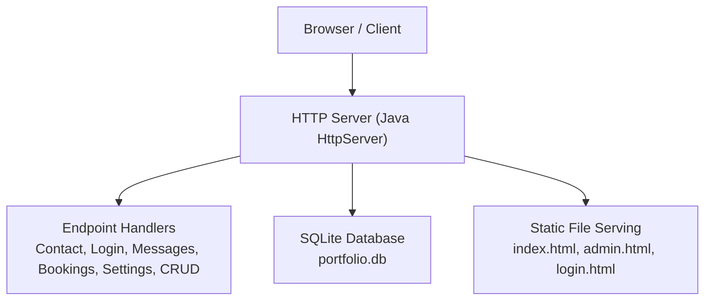
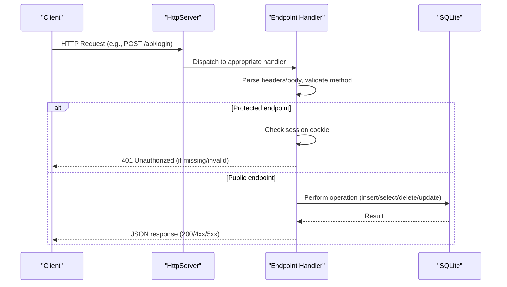
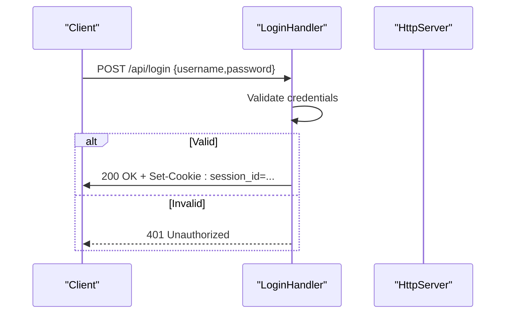
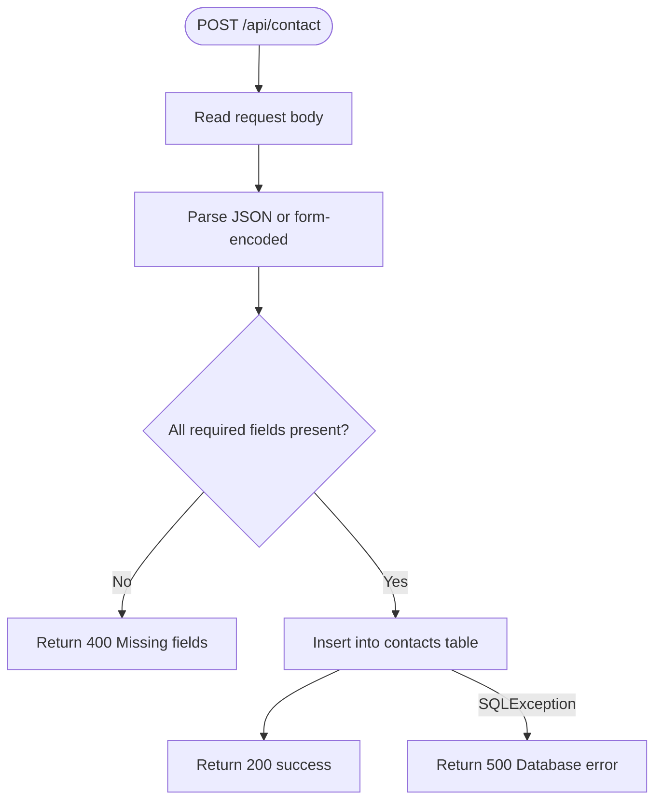
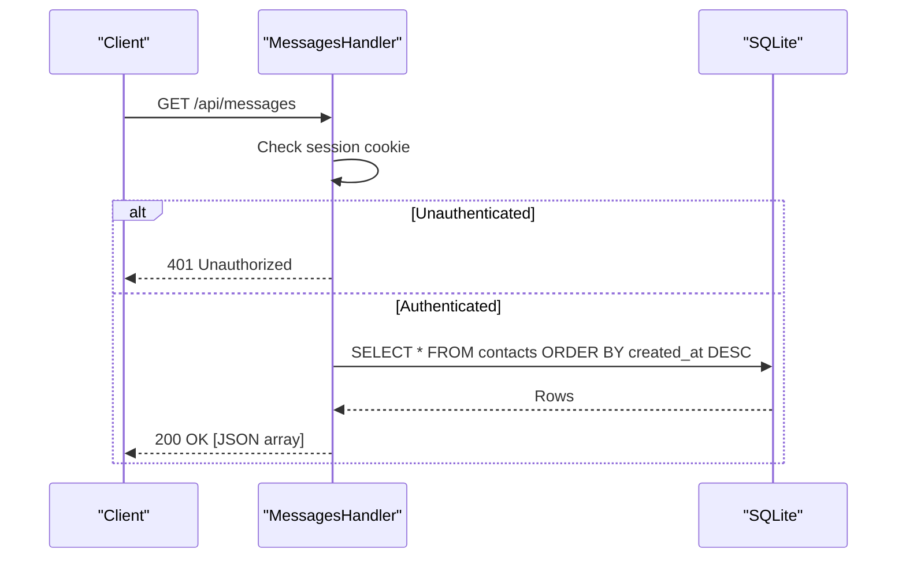
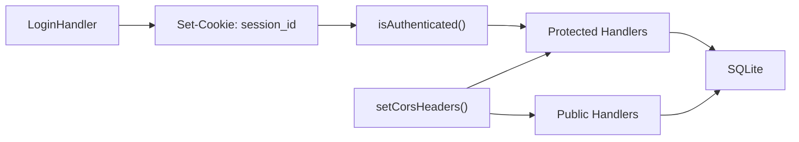

# API Reference

<cite>
**Referenced Files in This Document**
- [Server.java](file://Server.java)
- [login.html](file://login.html)
- [admin.html](file://admin.html)
- [main.js](file://main.js)
- [design.md](file://design.md)
</cite>

## Table of Contents
1. [Introduction](#introduction)
2. [Project Structure](#project-structure)
3. [Core Components](#core-components)
4. [Architecture Overview](#architecture-overview)
5. [Detailed Component Analysis](#detailed-component-analysis)
6. [Dependency Analysis](#dependency-analysis)
7. [Performance Considerations](#performance-considerations)
8. [Troubleshooting Guide](#troubleshooting-guide)
9. [Conclusion](#conclusion)
10. [Appendices](#appendices)

## Introduction
This document provides a complete API reference for the Premium Portfolio application’s backend. It covers all REST endpoints, authentication mechanisms, request/response schemas, validation rules, error handling, CORS configuration, and practical client integration guidance. The backend is implemented as a standalone HTTP server using Java’s built-in HttpServer and SQLite for persistence.

## Project Structure
The backend is a single-file Java application that initializes an HTTP server, sets up database tables, and exposes REST endpoints. Static assets and admin pages are served alongside the API.

**Diagram sources**
- [Server.java:34-83](file://Server.java#L34-L83)
- [Server.java:813-890](file://Server.java#L813-L890)

**Section sources**
- [Server.java:34-83](file://Server.java#L34-L83)
- [Server.java:813-890](file://Server.java#L813-L890)

## Core Components
- HTTP Server: Creates an HttpServer bound to an environment-configurable port and registers endpoint contexts.
- Endpoint Handlers: Implementers of HttpHandler for each route, managing request parsing, validation, database operations, and responses.
- Database: SQLite-backed schema with tables for contacts, bookings, portfolio settings, projects, education, and experience.
- Authentication: Session-based authentication via a secure cookie validated by a simple server-side check.
- CORS: Permissive CORS headers applied to API responses.

Key behaviors:
- Port resolution from environment variable with a default fallback.
- Database initialization and schema migration on startup.
- Strict authentication for protected endpoints.
- JSON and form-encoded request body parsing.
- UTF-8 content-type responses.

**Section sources**
- [Server.java:18-32](file://Server.java#L18-L32)
- [Server.java:85-337](file://Server.java#L85-L337)
- [Server.java:339-352](file://Server.java#L339-L352)
- [Server.java:398-411](file://Server.java#L398-L411)
- [Server.java:413-466](file://Server.java#L413-L466)

## Architecture Overview
The server exposes a set of REST endpoints grouped into public and protected resources. Protected endpoints require a valid session cookie. Static pages are served from the root context with authentication enforced for admin routes.

**Diagram sources**
- [Server.java:354-396](file://Server.java#L354-L396)
- [Server.java:556-644](file://Server.java#L556-L644)
- [Server.java:646-735](file://Server.java#L646-L735)
- [Server.java:1000-1061](file://Server.java#L1000-L1061)
- [Server.java:1252-1377](file://Server.java#L1252-L1377)
- [Server.java:1379-1498](file://Server.java#L1379-L1498)
- [Server.java:1500-1619](file://Server.java#L1500-L1619)

## Detailed Component Analysis

### Authentication and Session Cookies
- Endpoint: POST /api/login
- Method: POST
- Purpose: Authenticate and set a session cookie for admin access.
- Request Body:
  - Content-Type: application/json
  - Fields:
    - username: string
    - password: string
- Response:
  - 200 OK: {"status":"success","message":"Access Granted"}
  - 401 Unauthorized: {"status":"error","message":"Invalid credentials. Access denied."}
  - 500 Internal Server Error: {"status":"error","message":"Internal server error."}
- Cookie:
  - Name: session_id
  - Value: authorized_aditya_session
  - Attributes: HttpOnly, SameSite=Lax
- Validation:
  - Username must equal "aditya".
  - Password must equal "soni123".

**Diagram sources**
- [Server.java:354-396](file://Server.java#L354-L396)

**Section sources**
- [Server.java:354-396](file://Server.java#L354-L396)
- [login.html:146-171](file://login.html#L146-L171)

### Contact Form Submission
- Endpoint: POST /api/contact
- Method: POST
- Purpose: Submit contact messages to the database.
- Request Body:
  - Content-Type: application/json or application/x-www-form-urlencoded
  - Fields:
    - name: string (required)
    - email: string (required)
    - message: string (required)
- Response:
  - 200 OK: {"status":"success","message":"✓ Message received and stored in SQL database."}
  - 400 Bad Request: {"status":"error","message":"Missing required fields (name, email, message)"}
  - 500 Internal Server Error: {"status":"error","message":"Database error: <escaped_message>"}

**Diagram sources**
- [Server.java:494-554](file://Server.java#L494-L554)

**Section sources**
- [Server.java:494-554](file://Server.java#L494-L554)
- [main.js:739-752](file://main.js#L739-L752)

### Booking Submission (Public)
- Endpoint: POST /api/booking-submit
- Method: POST
- Purpose: Submit consultation booking requests.
- Request Body:
  - Content-Type: application/json or application/x-www-form-urlencoded
  - Fields:
    - name: string (required)
    - email: string (required)
    - booking_date: string (required)
    - booking_time: string (required)
    - topic: string (required)
- Response:
  - 200 OK: {"status":"success","message":"✓ Consultation session booked and stored in SQL database."}
  - 400 Bad Request: {"status":"error","message":"Missing required fields for booking."}
  - 500 Internal Server Error: {"status":"error","message":"Database error: <escaped_message>"}

**Section sources**
- [Server.java:738-800](file://Server.java#L738-L800)

### Messages Administration (Protected)
- Endpoint: GET /api/messages
- Method: GET
- Purpose: Retrieve all contact messages.
- Authentication: Required (session cookie).
- Response:
  - 200 OK: JSON array of message objects with fields: id, name, email, message, created_at.
  - 401 Unauthorized: {"status":"error","message":"Unauthorized"}
  - 500 Internal Server Error: {"status":"error","message":"<escaped_message>"}

- Endpoint: DELETE /api/messages?id={id}
- Method: DELETE
- Purpose: Delete a message by ID.
- Authentication: Required (session cookie).
- Query Parameter:
  - id: integer (required)
- Response:
  - 200 OK: {"status":"success","message":"Message deleted."}
  - 400 Bad Request: {"status":"error","message":"Missing or invalid 'id' parameter."}
  - 444 Not Found: {"status":"error","message":"Message ID not found."}
  - 500 Internal Server Error: {"status":"error","message":"<escaped_message>"}

**Diagram sources**
- [Server.java:556-644](file://Server.java#L556-L644)

**Section sources**
- [Server.java:556-644](file://Server.java#L556-L644)
- [admin.html:1188-1196](file://admin.html#L1188-L1196)

### Bookings Administration (Protected)
- Endpoint: GET /api/bookings
- Method: GET
- Purpose: Retrieve all bookings.
- Authentication: Required (session cookie).
- Response:
  - 200 OK: JSON array of booking objects with fields: id, name, email, booking_date, booking_time, topic, created_at.
  - 401 Unauthorized: {"status":"error","message":"Unauthorized"}
  - 500 Internal Server Error: {"status":"error","message":"<escaped_message>"}

- Endpoint: DELETE /api/bookings?id={id}
- Method: DELETE
- Purpose: Delete a booking by ID.
- Authentication: Required (session cookie).
- Query Parameter:
  - id: integer (required)
- Response:
  - 200 OK: {"status":"success","message":"Booking deleted."}
  - 400 Bad Request: {"status":"error","message":"Missing or invalid 'id' parameter."}
  - 444 Not Found: {"status":"error","message":"Booking ID not found."}
  - 500 Internal Server Error: {"status":"error","message":"<escaped_message>"}

**Section sources**
- [Server.java:646-735](file://Server.java#L646-L735)
- [admin.html:1188-1196](file://admin.html#L1188-L1196)

### Settings Management (Public and Protected)
- Endpoint: GET /api/settings
- Method: GET
- Purpose: Retrieve active portfolio settings and related content collections.
- Response:
  - 200 OK: JSON object containing settings, projects, education, experience arrays.
  - 500 Internal Server Error: {"status":"error","message":"<escaped_message>"}

- Endpoint: POST /api/settings
- Method: POST
- Purpose: Update portfolio settings (protected).
- Authentication: Required (session cookie).
- Request Body:
  - Content-Type: application/json
  - Fields: theme_preset, primary_color, secondary_color, accent_color, background_color, surface_color, font_display, font_body, animations_enabled, layout_sections_order, seo_title, seo_description, analytics_id, hero_* fields, about_* fields, skills_* fields, contact_* fields, social_* fields, brand_name, logo_text, footer_text, goal_* fields, contact_email, contact_location, contact_status, custom_css, custom_javascript.
- Response:
  - 200 OK: {"status":"success","message":"✓ Settings saved successfully."}
  - 401 Unauthorized: {"status":"error","message":"Unauthorized"}
  - 500 Internal Server Error: {"status":"error","message":"<escaped_message>"}

**Section sources**
- [Server.java:1000-1061](file://Server.java#L1000-L1061)
- [Server.java:1062-1250](file://Server.java#L1062-L1250)

### CRUD Endpoints (Protected)
- Projects CRUD
  - POST /api/projects-crud: Create or update a project item.
  - DELETE /api/projects-crud?id={id}: Delete a project item.
  - Authentication: Required (session cookie).
  - Validation:
    - POST requires title; optional numeric sort_order and is_visible (boolean-like).
  - Responses:
    - 201/200 OK on creation/update.
    - 400 Bad Request on validation failure.
    - 401 Unauthorized on missing/invalid session.
    - 500 Internal Server Error on database errors.

- Education CRUD
  - POST /api/education-crud: Create or update an education item.
  - DELETE /api/education-crud?id={id}: Delete an education item.
  - Authentication: Required (session cookie).
  - Validation:
    - POST requires degree and institution; optional numeric sort_order and is_visible.
  - Responses:
    - 201/200 OK on creation/update.
    - 400 Bad Request on validation failure.
    - 401 Unauthorized on missing/invalid session.
    - 500 Internal Server Error on database errors.

- Experience CRUD
  - POST /api/experience-crud: Create or update an experience item.
  - DELETE /api/experience-crud?id={id}: Delete an experience item.
  - Authentication: Required (session cookie).
  - Validation:
    - POST requires role and company; optional numeric sort_order and is_visible.
  - Responses:
    - 201/200 OK on creation/update.
    - 400 Bad Request on validation failure.
    - 401 Unauthorized on missing/invalid session.
    - 500 Internal Server Error on database errors.

**Section sources**
- [Server.java:1252-1377](file://Server.java#L1252-L1377)
- [Server.java:1379-1498](file://Server.java#L1379-L1498)
- [Server.java:1500-1619](file://Server.java#L1500-L1619)

## Dependency Analysis
- Authentication dependency chain:
  - LoginHandler sets a session cookie.
  - isAuthenticated reads the Cookie header and validates the session_id value.
  - Protected handlers call isAuthenticated before processing requests.
- CORS dependency:
  - setCorsHeaders applies permissive CORS headers to all API responses.
- Static file serving:
  - StaticFileHandler enforces authentication for /admin.html and performs canonical path checks to prevent directory traversal.

**Diagram sources**
- [Server.java:354-396](file://Server.java#L354-L396)
- [Server.java:339-352](file://Server.java#L339-L352)
- [Server.java:398-402](file://Server.java#L398-L402)
- [Server.java:556-644](file://Server.java#L556-L644)
- [Server.java:646-735](file://Server.java#L646-L735)
- [Server.java:1000-1061](file://Server.java#L1000-L1061)
- [Server.java:1252-1377](file://Server.java#L1252-L1377)
- [Server.java:1379-1498](file://Server.java#L1379-L1498)
- [Server.java:1500-1619](file://Server.java#L1500-L1619)

**Section sources**
- [Server.java:339-352](file://Server.java#L339-L352)
- [Server.java:398-402](file://Server.java#L398-L402)
- [Server.java:813-890](file://Server.java#L813-L890)

## Performance Considerations
- Database operations use prepared statements to mitigate injection risks and improve performance.
- JSON responses are constructed incrementally and escaped to avoid XSS.
- Static file serving streams content directly from disk.
- No explicit rate limiting is implemented in the current server; consider adding middleware for production deployments.

[No sources needed since this section provides general guidance]

## Troubleshooting Guide
Common issues and resolutions:
- 401 Unauthorized on protected endpoints:
  - Ensure the session cookie is present and valid.
  - Confirm the cookie value equals the expected authorized session identifier.
- 400 Bad Request on POST endpoints:
  - Verify required fields are present in the request body.
  - Ensure Content-Type matches the payload format (application/json or application/x-www-form-urlencoded).
- 444 Not Found on DELETE endpoints:
  - Confirm the id query parameter is a valid integer.
- CORS errors:
  - The server sets permissive CORS headers; verify client requests originate from allowed contexts.
- Database errors:
  - Inspect server logs for SQLException messages and confirm table schemas are initialized.

**Section sources**
- [Server.java:339-352](file://Server.java#L339-L352)
- [Server.java:494-554](file://Server.java#L494-L554)
- [Server.java:556-644](file://Server.java#L556-L644)
- [Server.java:646-735](file://Server.java#L646-L735)
- [Server.java:1062-1250](file://Server.java#L1062-L1250)
- [Server.java:1252-1377](file://Server.java#L1252-L1377)
- [Server.java:1379-1498](file://Server.java#L1379-L1498)
- [Server.java:1500-1619](file://Server.java#L1500-L1619)

## Conclusion
The Premium Portfolio backend provides a compact, SQLite-backed REST API with session-based authentication and permissive CORS. It supports public contact and booking submissions, protected administration endpoints for messages and bookings, and comprehensive CRUD operations for portfolio content. The design emphasizes simplicity and immediate feedback for the admin dashboard while maintaining straightforward client integration patterns.

[No sources needed since this section summarizes without analyzing specific files]

## Appendices

### Authentication Methods and Security Considerations
- Session Cookies:
  - Name: session_id
  - Value: authorized_aditya_session
  - Attributes: HttpOnly, SameSite=Lax
- Security Notes:
  - Current implementation uses a simple string comparison for session validation.
  - For production, consider secure, signed tokens or a proper session store with expiration and CSRF protection.

**Section sources**
- [Server.java:386](file://Server.java#L386)
- [Server.java:339-352](file://Server.java#L339-L352)

### CORS Configuration
- Headers applied to all API responses:
  - Access-Control-Allow-Origin: *
  - Access-Control-Allow-Methods: GET, POST, DELETE, OPTIONS
  - Access-Control-Allow-Headers: Content-Type

**Section sources**
- [Server.java:398-402](file://Server.java#L398-L402)

### Practical Examples and Client Integration

- curl examples:
  - Login:
    - curl -X POST http://localhost:3000/api/login -H "Content-Type: application/json" -d '{"username":"aditya","password":"soni123"}'
  - Submit contact:
    - curl -X POST http://localhost:3000/api/contact -H "Content-Type: application/json" -d '{"name":"John","email":"john@example.com","message":"Hello"}'
  - Submit booking:
    - curl -X POST http://localhost:3000/api/booking-submit -H "Content-Type: application/json" -d '{"name":"John","email":"john@example.com","booking_date":"2026-06-20","booking_time":"14:00","topic":"Consultation"}'
  - Get settings:
    - curl http://localhost:3000/api/settings
  - Get messages (admin):
    - curl -H "Cookie: session_id=authorized_aditya_session" http://localhost:3000/api/messages
  - Delete message (admin):
    - curl -X DELETE "http://localhost:3000/api/messages?id=1" -H "Cookie: session_id=authorized_aditya_session"
  - Update settings (admin):
    - curl -X POST http://localhost:3000/api/settings -H "Content-Type: application/json" -H "Cookie: session_id=authorized_aditya_session" -d '{"primary_color":"#10b981","font_display":"Outfit"}'

- Client implementation guidelines:
  - Use fetch with appropriate Content-Type headers.
  - Persist and send the session cookie for protected endpoints.
  - Handle 401 Unauthorized by redirecting to the login page.
  - For cross-origin requests, rely on the server’s CORS headers.

**Section sources**
- [login.html:146-171](file://login.html#L146-L171)
- [main.js:739-752](file://main.js#L739-L752)
- [Server.java:398-402](file://Server.java#L398-L402)

### Error Codes and Status Mapping
- 200 OK: Successful operations (creation/update).
- 201 Created: Resource created (projects/education/experience CRUD).
- 400 Bad Request: Missing or invalid parameters.
- 401 Unauthorized: Missing or invalid session cookie.
- 444 Not Found: Deletion target not found.
- 405 Method Not Allowed: Incorrect HTTP method.
- 500 Internal Server Error: Database or internal errors.

**Section sources**
- [Server.java:365-368](file://Server.java#L365-L368)
- [Server.java:527-530](file://Server.java#L527-L530)
- [Server.java:619-622](file://Server.java#L619-L622)
- [Server.java:773-776](file://Server.java#L773-L776)
- [Server.java:1290-1293](file://Server.java#L1290-L1293)
- [Server.java:1415-1418](file://Server.java#L1415-L1418)
- [Server.java:1536-1539](file://Server.java#L1536-L1539)

### Database Schema Overview
- contacts: id, name, email, message, created_at
- bookings: id, name, email, booking_date, booking_time, topic, created_at
- portfolio_settings: id (PK, constrained to 1), theme presets/colors, fonts, animations flag, layout order, SEO fields, timestamps
- projects: id, title, description, image_url, github_link, live_link, tags, sort_order, is_visible, created_at
- education: id, degree, institution, timeline, description, sort_order, is_visible, created_at
- experience: id, role, company, timeline, description, sort_order, is_visible, created_at

**Section sources**
- [Server.java:98-337](file://Server.java#L98-L337)