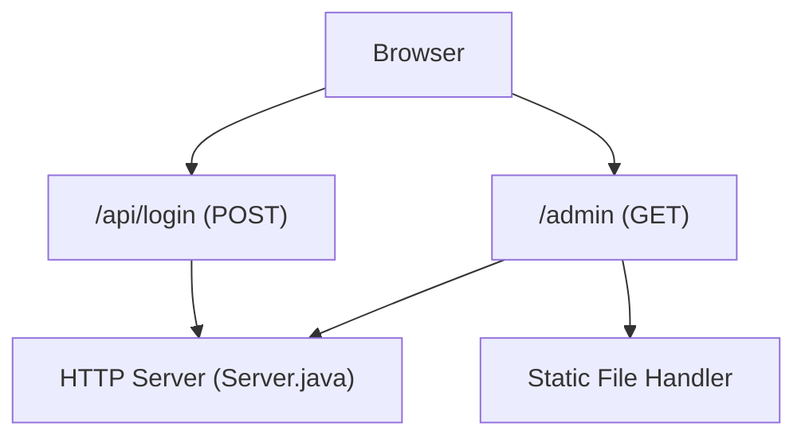
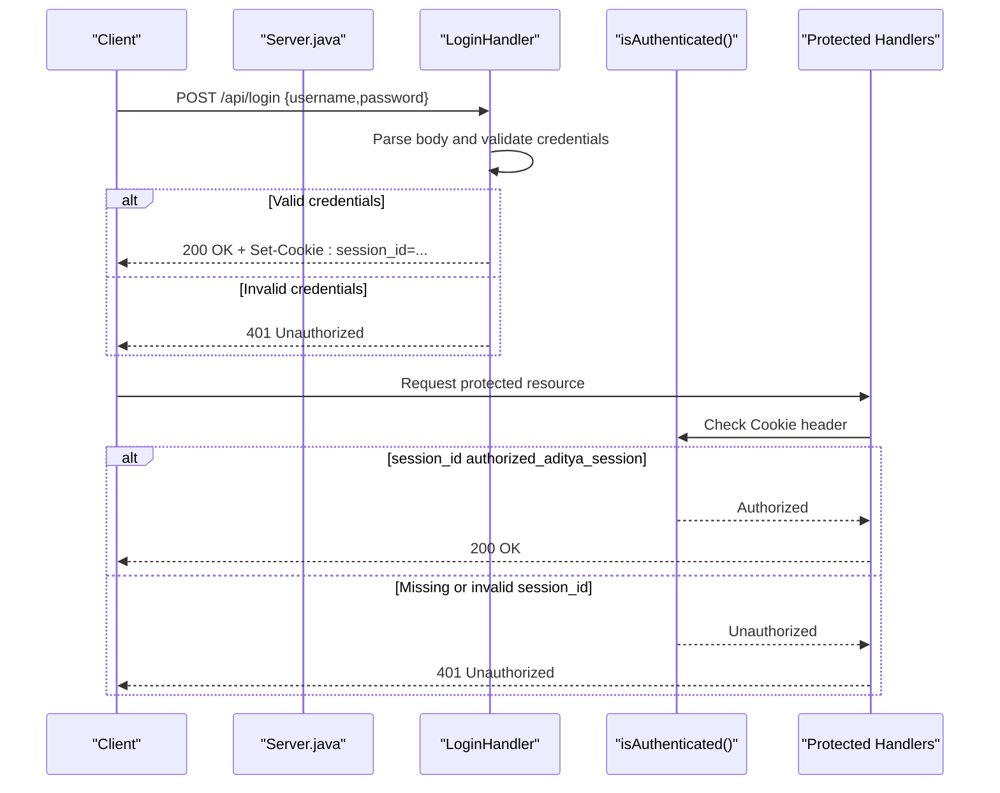
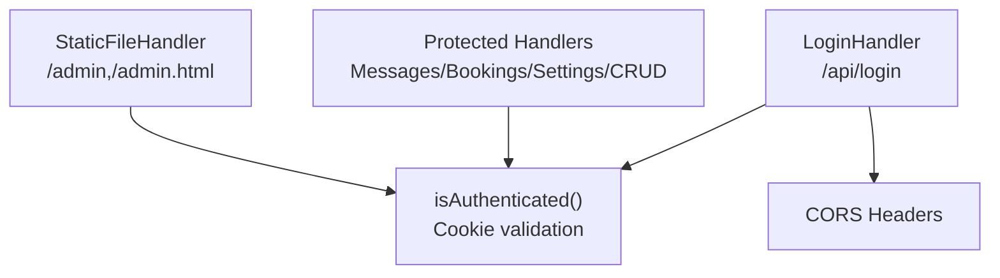

# Authentication Endpoints

<cite>
**Referenced Files in This Document**
- [Server.java](file://Server.java)
- [login.html](file://login.html)
- [main.js](file://main.js)
- [design.md](file://design.md)
</cite>

## Table of Contents
1. [Introduction](#introduction)
2. [Project Structure](#project-structure)
3. [Core Components](#core-components)
4. [Architecture Overview](#architecture-overview)
5. [Detailed Component Analysis](#detailed-component-analysis)
6. [Dependency Analysis](#dependency-analysis)
7. [Performance Considerations](#performance-considerations)
8. [Troubleshooting Guide](#troubleshooting-guide)
9. [Conclusion](#conclusion)

## Introduction
This document specifies the authentication API for the Premium Portfolio application, focusing on the /api/login endpoint. It covers HTTP method, request/response schemas, authentication flow using session cookies, and security considerations. It also documents the authentication middleware used by protected endpoints, cookie-based session validation, CORS configuration, and practical examples for successful login and unauthorized access scenarios. Guidance on debugging authentication issues and best practices is included.

## Project Structure
The authentication implementation resides in the Java-based HTTP server. The server exposes:
- A login endpoint at /api/login (POST)
- Protected endpoints that rely on cookie-based session validation
- Static file serving with authentication enforcement for admin resources

**Diagram sources**
- [Server.java:354-396](file://Server.java#L354-L396)
- [Server.java:804-890](file://Server.java#L804-L890)

**Section sources**
- [Server.java:34-83](file://Server.java#L34-L83)
- [Server.java:47-66](file://Server.java#L47-L66)

## Core Components
- Login endpoint: Validates credentials and sets an HttpOnly session cookie upon success.
- Authentication middleware: Checks for a valid session cookie on protected endpoints.
- CORS configuration: Enables cross-origin requests for the login endpoint.
- Protected endpoints: Require a valid session cookie to access admin resources.

Key implementation references:
- Login endpoint handler and cookie setting
  - [Server.java:354-396](file://Server.java#L354-L396)
- Authentication check logic
  - [Server.java:339-352](file://Server.java#L339-L352)
- CORS headers
  - [Server.java:398-402](file://Server.java#L398-L402)
- Protected endpoints using authentication
  - [Server.java:557-644](file://Server.java#L557-L644)
  - [Server.java:646-735](file://Server.java#L646-L735)
  - [Server.java:825-832](file://Server.java#L825-L832)

**Section sources**
- [Server.java:339-396](file://Server.java#L339-L396)
- [Server.java:398-402](file://Server.java#L398-L402)
- [Server.java:557-735](file://Server.java#L557-L735)
- [Server.java:825-832](file://Server.java#L825-L832)

## Architecture Overview
The authentication flow uses a simple session cookie mechanism:
- The client submits credentials to /api/login.
- On success, the server responds with a Set-Cookie header containing an HttpOnly session cookie.
- Subsequent requests to protected endpoints include the session cookie automatically.
- Protected endpoints validate the presence and value of the session cookie.

**Diagram sources**
- [Server.java:354-396](file://Server.java#L354-L396)
- [Server.java:339-352](file://Server.java#L339-L352)
- [Server.java:557-644](file://Server.java#L557-L644)

## Detailed Component Analysis

### /api/login Endpoint
- Method: POST
- Purpose: Authenticate user and establish a session via an HttpOnly cookie
- Request body: application/json or application/x-www-form-urlencoded
  - Fields:
    - username: string
    - password: string
- Response:
  - 200 OK on success: JSON with status success and message
  - 401 Unauthorized on invalid credentials: JSON with status error and message
  - 405 Method Not Allowed if not POST
  - 500 Internal Server Error on unexpected errors

Cookie behavior:
- On success, the server sets a session cookie with:
  - Name: session_id
  - Value: authorized_aditya_session
  - Attributes: HttpOnly, SameSite=Lax, Path=/

CORS:
- The endpoint supports preflight OPTIONS and sets Access-Control-Allow-Origin to *, Access-Control-Allow-Methods including POST, and Access-Control-Allow-Headers including Content-Type.

Practical examples:
- Successful login using curl:
  - curl -X POST http://localhost:3000/api/login -H "Content-Type: application/json" -d '{"username":"aditya","password":"soni123"}' -c cookies.txt
- Unauthorized access using curl:
  - curl -X POST http://localhost:3000/api/login -H "Content-Type: application/json" -d '{"username":"wrong","password":"credentials"}' -i

Frontend integration:
- The login page sends credentials to /api/login and redirects to /admin on success.
  - [login.html:147-160](file://login.html#L147-L160)
- The main client script demonstrates fetching /api/login and handling responses.
  - [main.js:146-170](file://main.js#L146-L170)

**Section sources**
- [Server.java:354-396](file://Server.java#L354-L396)
- [Server.java:398-402](file://Server.java#L398-L402)
- [login.html:147-160](file://login.html#L147-L160)
- [main.js:146-170](file://main.js#L146-L170)

### Authentication Middleware and Protected Endpoints
- Authentication check:
  - Reads the Cookie header and extracts the session_id value.
  - Compares the value to the expected authorized session string.
  - Returns true only if the cookie is present and equals the expected value.

- Protected endpoints:
  - GET /api/messages and DELETE /api/messages?id=123
  - GET /api/bookings and DELETE /api/bookings?id=123
  - GET /api/settings and POST /api/settings/save (protected)
  - POST /api/projects-crud, DELETE /api/projects-crud?id=123
  - POST /api/education-crud, DELETE /api/education-crud?id=123
  - POST /api/experience-crud, DELETE /api/experience-crud?id=123
  - Static admin pages (/admin, /admin.html) redirect unauthenticated users to /login.html

Behavior:
- If authentication fails, endpoints return 401 Unauthorized with a JSON error message.
- If the request method is not allowed, endpoints return 405 Method Not Allowed.

**Section sources**
- [Server.java:339-352](file://Server.java#L339-L352)
- [Server.java:557-644](file://Server.java#L557-L644)
- [Server.java:646-735](file://Server.java#L646-L735)
- [Server.java:825-832](file://Server.java#L825-L832)

### CORS Configuration
- The server sets the following headers for the login endpoint:
  - Access-Control-Allow-Origin: *
  - Access-Control-Allow-Methods: GET, POST, DELETE, OPTIONS
  - Access-Control-Allow-Headers: Content-Type
- Preflight requests (OPTIONS) are handled explicitly to return 204 No Content.

**Section sources**
- [Server.java:398-402](file://Server.java#L398-L402)

### Cookie-Based Session Validation
- The session cookie is validated by parsing the Cookie header and checking the session_id value.
- The cookie is marked HttpOnly to mitigate XSS risks and is sent only over the same site policy (SameSite=Lax).
- The expected session value is a fixed string used for demonstration purposes.

**Section sources**
- [Server.java:339-352](file://Server.java#L339-L352)
- [Server.java:385-387](file://Server.java#L385-L387)

### Practical Examples

- Successful login:
  - curl -X POST http://localhost:3000/api/login -H "Content-Type: application/json" -d '{"username":"aditya","password":"soni123"}' -c cookies.txt
  - The server responds with 200 OK and sets the session cookie.

- Unauthorized access:
  - curl -X POST http://localhost:3000/api/login -H "Content-Type: application/json" -d '{"username":"wrong","password":"credentials"}' -i
  - The server responds with 401 Unauthorized.

- Accessing protected endpoints with a valid session:
  - curl -X GET http://localhost:3000/api/messages -b cookies.txt -H "Content-Type: application/json"
  - curl -X DELETE http://localhost:3000/api/messages?id=123 -b cookies.txt -H "Content-Type: application/json"

- Accessing protected endpoints without a valid session:
  - curl -X GET http://localhost:3000/api/messages -i
  - The server responds with 401 Unauthorized.

**Section sources**
- [Server.java:354-396](file://Server.java#L354-L396)
- [Server.java:557-644](file://Server.java#L557-L644)

## Dependency Analysis
The authentication flow depends on:
- LoginHandler for credential validation and cookie setting
- isAuthenticated for session validation
- StaticFileHandler for enforcing authentication on admin pages
- CORS configuration for cross-origin requests

**Diagram sources**
- [Server.java:354-396](file://Server.java#L354-L396)
- [Server.java:339-352](file://Server.java#L339-L352)
- [Server.java:557-735](file://Server.java#L557-L735)
- [Server.java:804-890](file://Server.java#L804-L890)
- [Server.java:398-402](file://Server.java#L398-L402)

**Section sources**
- [Server.java:339-396](file://Server.java#L339-L396)
- [Server.java:557-735](file://Server.java#L557-L735)
- [Server.java:804-890](file://Server.java#L804-L890)
- [Server.java:398-402](file://Server.java#L398-L402)

## Performance Considerations
- Cookie parsing is O(n) over the number of cookies in the header; the implementation splits by semicolon and iterates once.
- Authentication checks occur on every protected request; keep the cookie value small and constant-length.
- Avoid storing sensitive data in cookies; use HttpOnly and SameSite policies to reduce XSS risk.

[No sources needed since this section provides general guidance]

## Troubleshooting Guide
Common issues and resolutions:
- 401 Unauthorized on protected endpoints:
  - Ensure the session cookie is present and valid.
  - Verify the Cookie header includes session_id=authorized_aditya_session.
  - Confirm the request is sent to the same origin/domain.

- 405 Method Not Allowed:
  - The endpoint requires POST for /api/login and specific methods for protected endpoints.
  - Use the correct HTTP verb for the endpoint.

- CORS errors:
  - The server allows preflight OPTIONS and sets Access-Control-Allow-Origin to *.
  - If using credentials or custom headers, ensure the client respects the configured Allow-Headers.

- Unexpected 500 errors:
  - Inspect server logs for exceptions during request processing.
  - Validate the request body format and content type.

Debugging steps:
- Use curl with verbose output to inspect headers and responses.
- Check browser developer tools Network tab for cookies and response status.
- Confirm the server is running on the expected port and path.

**Section sources**
- [Server.java:354-396](file://Server.java#L354-L396)
- [Server.java:398-402](file://Server.java#L398-L402)
- [Server.java:557-644](file://Server.java#L557-L644)

## Conclusion
The Premium Portfolio application implements a straightforward cookie-based authentication scheme centered on the /api/login endpoint. Upon successful authentication, the server sets an HttpOnly session cookie that subsequent protected requests must include. The implementation includes explicit CORS handling for the login endpoint and a centralized authentication check used by protected endpoints. While functional, the current design uses a fixed session value for demonstration and does not include CSRF protection or session timeouts. For production, consider enhancing security with CSRF tokens, secure flags, rotating session identifiers, and session expiration.