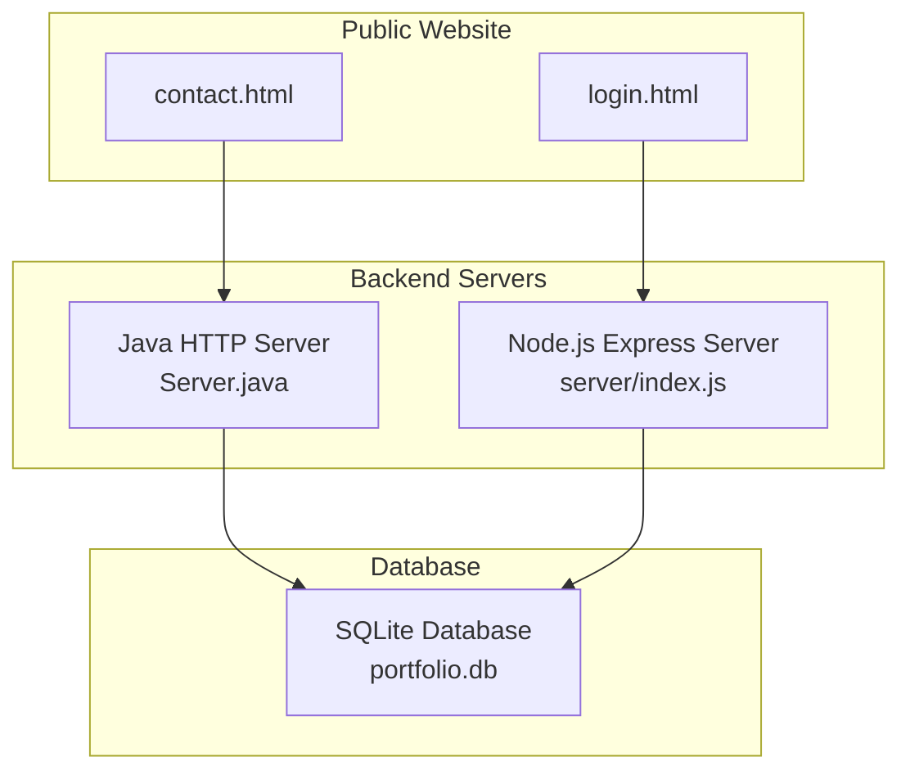
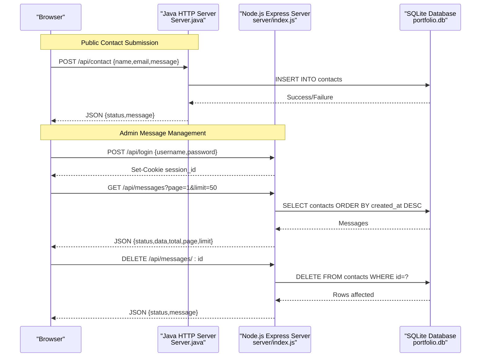
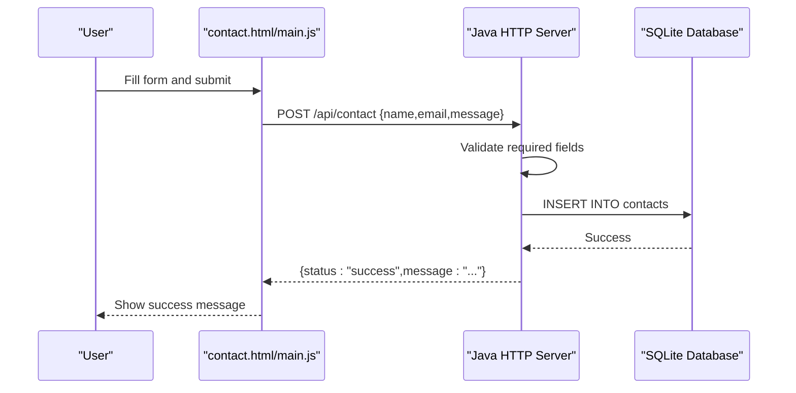
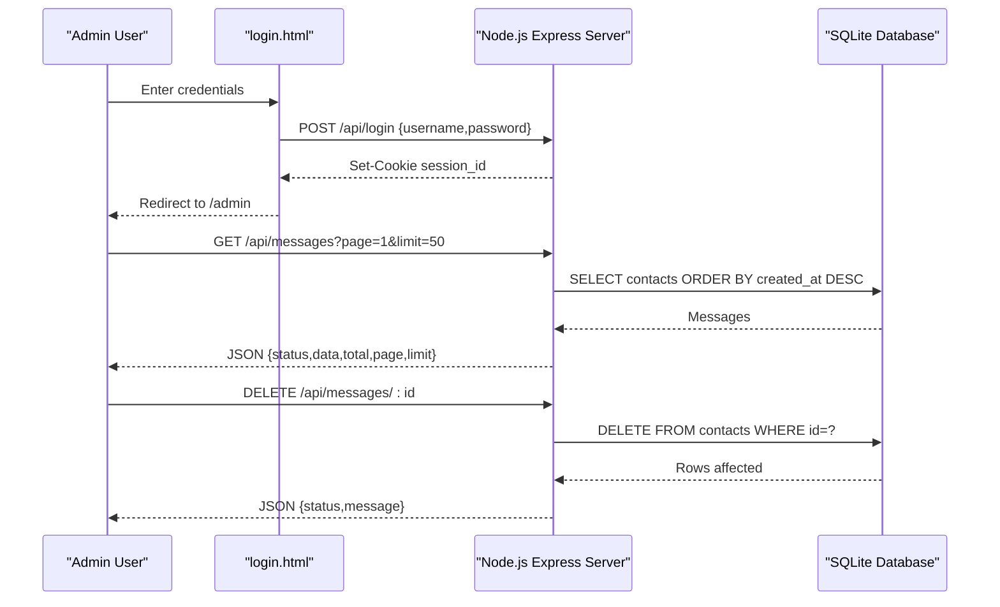
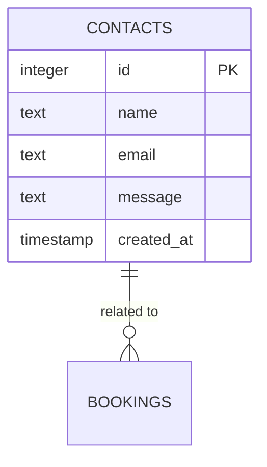
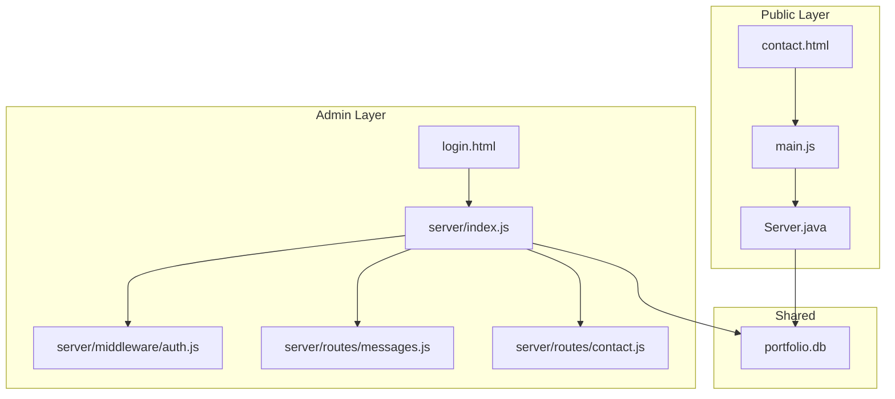

# Contact Management

<cite>
**Referenced Files in This Document**
- [Server.java](file://Server.java)
- [server/index.js](file://server/index.js)
- [server/routes/contact.js](file://server/routes/contact.js)
- [server/routes/messages.js](file://server/routes/messages.js)
- [server/middleware/auth.js](file://server/middleware/auth.js)
- [login.html](file://login.html)
- [contact.html](file://contact.html)
- [main.js](file://main.js)
</cite>

## Table of Contents
1. [Introduction](#introduction)
2. [Project Structure](#project-structure)
3. [Core Components](#core-components)
4. [Architecture Overview](#architecture-overview)
5. [Detailed Component Analysis](#detailed-component-analysis)
6. [Dependency Analysis](#dependency-analysis)
7. [Performance Considerations](#performance-considerations)
8. [Troubleshooting Guide](#troubleshooting-guide)
9. [Conclusion](#conclusion)

## Introduction
This document provides comprehensive API documentation for the contact management endpoints in the Premium Portfolio application. It covers two primary areas:

- Public contact form submission via `/api/contact`
- Admin message management via `/api/messages` (GET to retrieve all messages, DELETE to remove messages by ID)

The documentation includes HTTP methods, request/response schemas, validation rules, database insertion process, response formatting, and practical curl examples. It also details error handling for missing fields, database errors, and unauthorized access scenarios.

## Project Structure
The application consists of:
- A Java-based embedded HTTP server that exposes the contact and messages endpoints
- A Node.js/Express server that serves the admin panel and handles additional API routes
- Frontend pages for public contact submission and admin authentication
- SQLite database for storing contact messages



**Diagram sources**
- [Server.java:34-83](file://Server.java#L34-L83)
- [server/index.js:28-143](file://server/index.js#L28-L143)

**Section sources**
- [Server.java:34-83](file://Server.java#L34-L83)
- [server/index.js:28-143](file://server/index.js#L28-L143)

## Core Components
This section documents the two primary contact management endpoints:

### Endpoint: POST /api/contact
Purpose: Submit contact form data from the public website.

- Method: POST
- Content-Type: application/json or application/x-www-form-urlencoded
- Request Body Fields:
  - name: string, required
  - email: string, required
  - message: string, required
- Validation Rules:
  - All fields must be present and non-empty
  - No additional sanitization or format validation is performed
- Database Insertion:
  - Inserts into the `contacts` table with fields: name, email, message
  - Timestamp is automatically generated by the database
- Response:
  - On success: 200 OK with JSON containing status and message
  - On validation failure: 400 Bad Request with error message
  - On database error: 500 Internal Server Error with error message

### Endpoint: GET /api/messages
Purpose: Retrieve all contact messages for admin review.

- Method: GET
- Authentication: Required (session cookie)
- Query Parameters:
  - page: integer, default 1
  - limit: integer, default 50
  - search: string, optional search term
- Response:
  - On success: 200 OK with JSON containing status, data (array of messages), total, page, limit
  - On unauthorized: 401 Unauthorized with error message
  - On database error: 500 Internal Server Error with error message

### Endpoint: DELETE /api/messages/:id
Purpose: Remove a specific contact message by ID.

- Method: DELETE
- Authentication: Required (session cookie)
- Path Parameter:
  - id: integer, required
- Response:
  - On success: 200 OK with success message
  - On unauthorized: 401 Unauthorized with error message
  - On not found: 404 Not Found with error message
  - On database error: 500 Internal Server Error with error message

### Endpoint: DELETE /api/messages
Purpose: Bulk delete messages by ID array.

- Method: DELETE
- Authentication: Required (session cookie)
- Request Body:
  - ids: array of integers, required
- Response:
  - On success: 200 OK with success message indicating number of deleted records
  - On unauthorized: 401 Unauthorized with error message
  - On invalid payload: 400 Bad Request with error message
  - On database error: 500 Internal Server Error with error message

**Section sources**
- [Server.java:494-554](file://Server.java#L494-L554)
- [server/routes/messages.js:7-50](file://server/routes/messages.js#L7-L50)
- [server/routes/contact.js:6-18](file://server/routes/contact.js#L6-L18)

## Architecture Overview
The contact management system integrates public and admin workflows:



**Diagram sources**
- [Server.java:494-554](file://Server.java#L494-L554)
- [server/index.js:38-52](file://server/index.js#L38-L52)
- [server/routes/messages.js:7-50](file://server/routes/messages.js#L7-L50)
- [login.html:146-171](file://login.html#L146-L171)

## Detailed Component Analysis

### Public Contact Submission Flow
The public contact form submission follows this sequence:



**Diagram sources**
- [contact.html:125-151](file://contact.html#L125-L151)
- [main.js:709-838](file://main.js#L709-L838)
- [Server.java:494-554](file://Server.java#L494-L554)

Key implementation details:
- Frontend validation ensures all required fields are present before submission
- The frontend sends JSON data to the Java HTTP server
- The server performs basic validation and inserts into the database
- Responses are formatted consistently with status and message fields

**Section sources**
- [contact.html:125-151](file://contact.html#L125-L151)
- [main.js:709-838](file://main.js#L709-L838)
- [Server.java:494-554](file://Server.java#L494-L554)

### Admin Authentication and Message Management
Admin access requires authentication:



**Diagram sources**
- [login.html:146-171](file://login.html#L146-L171)
- [server/index.js:38-52](file://server/index.js#L38-L52)
- [server/routes/messages.js:7-50](file://server/routes/messages.js#L7-L50)

Authentication mechanism:
- Uses session cookie-based authentication
- Requires valid credentials (username: aditya, password: soni123)
- Sets HttpOnly cookie for security

**Section sources**
- [login.html:146-171](file://login.html#L146-L171)
- [server/routes/messages.js:7-50](file://server/routes/messages.js#L7-L50)

### Database Schema and Operations
The SQLite database stores contact messages with automatic timestamps:



**Diagram sources**
- [Server.java:98-107](file://Server.java#L98-L107)

Database operations:
- Creation of contacts table during server startup
- Insertion of new contact messages
- Retrieval of messages with pagination and optional search
- Deletion of messages by ID or bulk deletion

**Section sources**
- [Server.java:98-107](file://Server.java#L98-L107)
- [server/routes/messages.js:17-27](file://server/routes/messages.js#L17-L27)

## Dependency Analysis
The contact management system has the following dependencies:



**Diagram sources**
- [main.js:709-838](file://main.js#L709-L838)
- [login.html:146-171](file://login.html#L146-L171)
- [server/index.js:28-143](file://server/index.js#L28-L143)
- [server/routes/messages.js:7-50](file://server/routes/messages.js#L7-L50)
- [server/routes/contact.js:6-18](file://server/routes/contact.js#L6-L18)

Key dependencies:
- Java HTTP server depends on SQLite JDBC driver
- Node.js server uses Express, compression, cookie-parser, and custom middleware
- Both servers share the same SQLite database file
- Admin functionality requires authentication middleware

**Section sources**
- [server/index.js:28-143](file://server/index.js#L28-L143)
- [Server.java:85-92](file://Server.java#L85-L92)

## Performance Considerations
- Database operations use prepared statements to prevent SQL injection
- Pagination is implemented for message retrieval to limit response sizes
- Rate limiting middleware is configured in the Node.js server
- Compression middleware reduces response payload sizes
- SQLite is suitable for small to medium workloads; consider migration to a more robust database for high-volume scenarios

## Troubleshooting Guide

### Common Issues and Solutions

#### Missing Required Fields
**Symptoms**: 400 Bad Request response
**Causes**: 
- Empty name, email, or message fields
- Incorrect Content-Type header
**Solutions**:
- Ensure all required fields are present in the request body
- Set Content-Type to application/json or application/x-www-form-urlencoded

#### Database Connection Errors
**Symptoms**: 500 Internal Server Error
**Causes**:
- SQLite JDBC driver not found
- Database file permissions issue
- Database locked by concurrent operations
**Solutions**:
- Verify SQLite JDBC driver is available in the classpath
- Check file permissions for portfolio.db
- Retry operation after brief delay

#### Unauthorized Access
**Symptoms**: 401 Unauthorized response
**Causes**:
- Missing or invalid session cookie
- Expired authentication session
**Solutions**:
- Authenticate via /api/login endpoint
- Ensure cookie is included in subsequent requests
- Verify cookie domain/path settings

#### Message Not Found During Deletion
**Symptoms**: 404 Not Found response
**Causes**:
- Non-existent message ID
- ID parameter not provided or invalid
**Solutions**:
- Verify the message ID exists in the database
- Ensure ID parameter is a valid integer

### Practical Examples

#### Public Contact Submission
```bash
# Using application/json
curl -X POST http://localhost:3000/api/contact \
  -H "Content-Type: application/json" \
  -d '{"name":"John Doe","email":"john@example.com","message":"Hello"}'

# Using application/x-www-form-urlencoded
curl -X POST http://localhost:3000/api/contact \
  -H "Content-Type: application/x-www-form-urlencoded" \
  -d "name=John%20Doe&email=john@example.com&message=Hello"
```

#### Admin Message Retrieval
```bash
# Authenticate first
curl -X POST http://localhost:3000/api/login \
  -H "Content-Type: application/json" \
  -d '{"username":"aditya","password":"soni123"}' \
  -c cookies.txt

# Retrieve messages
curl -X GET http://localhost:3000/api/messages?page=1&limit=50 \
  -b cookies.txt

# Delete a message
curl -X DELETE http://localhost:3000/api/messages/123 \
  -b cookies.txt
```

#### Bulk Message Deletion
```bash
# Delete multiple messages
curl -X DELETE http://localhost:3000/api/messages \
  -H "Content-Type: application/json" \
  -b cookies.txt \
  -d '{"ids":[1,2,3]}'
```

**Section sources**
- [Server.java:494-554](file://Server.java#L494-L554)
- [server/routes/messages.js:7-50](file://server/routes/messages.js#L7-L50)
- [login.html:146-171](file://login.html#L146-L171)

## Conclusion
The contact management system provides a straightforward interface for collecting visitor inquiries and managing them through an authenticated admin interface. The implementation emphasizes simplicity with minimal validation, relying on the database for data integrity. The dual-server architecture allows for separation of concerns between public contact submissions and administrative operations, while sharing a common database for data consistency.

Key strengths:
- Clear separation between public and admin functionality
- Consistent JSON response format across all endpoints
- Basic authentication for admin access
- Simple validation rules focused on required fields
- Pagination support for efficient message browsing

Areas for potential improvement:
- Enhanced input validation and sanitization
- Email validation for the email field
- Rate limiting for contact form submissions
- More robust error reporting and logging
- Consider migrating to a more scalable database for production use