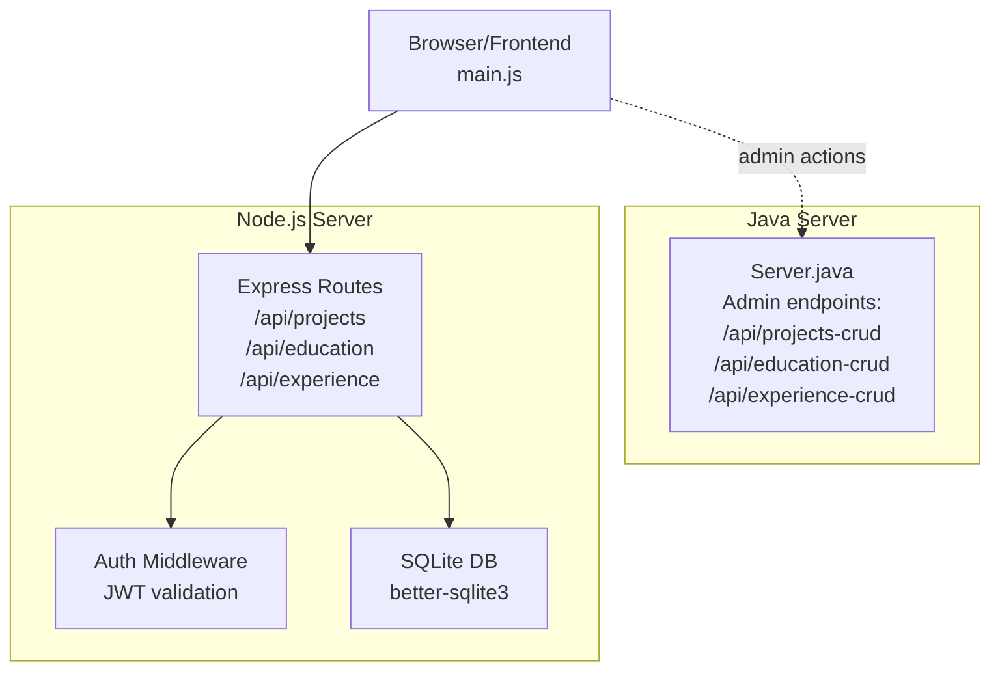
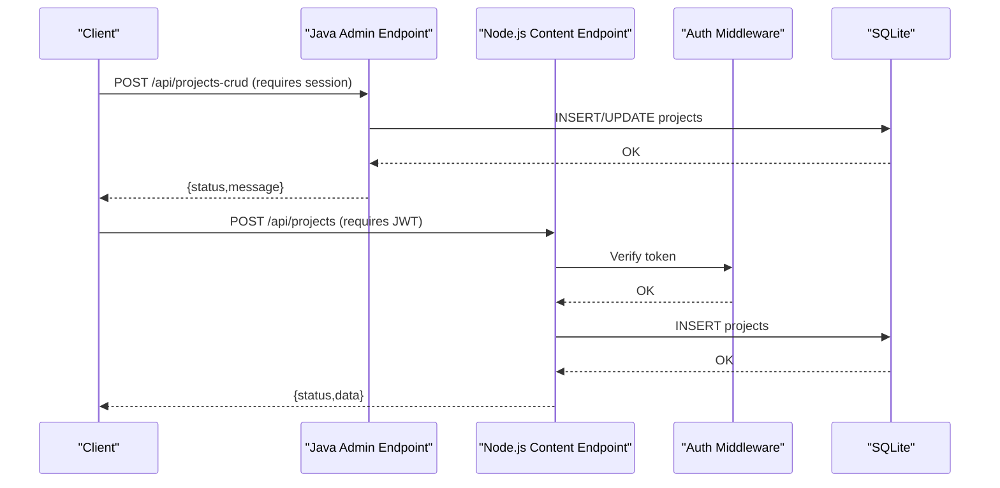
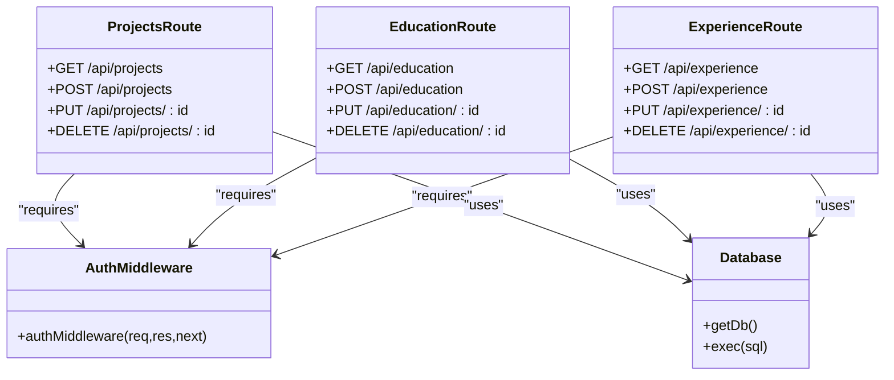
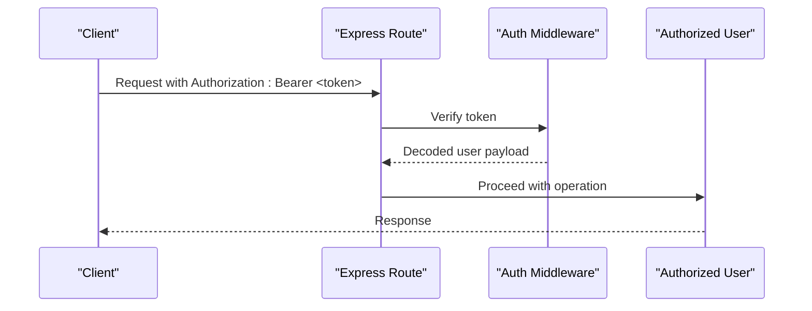
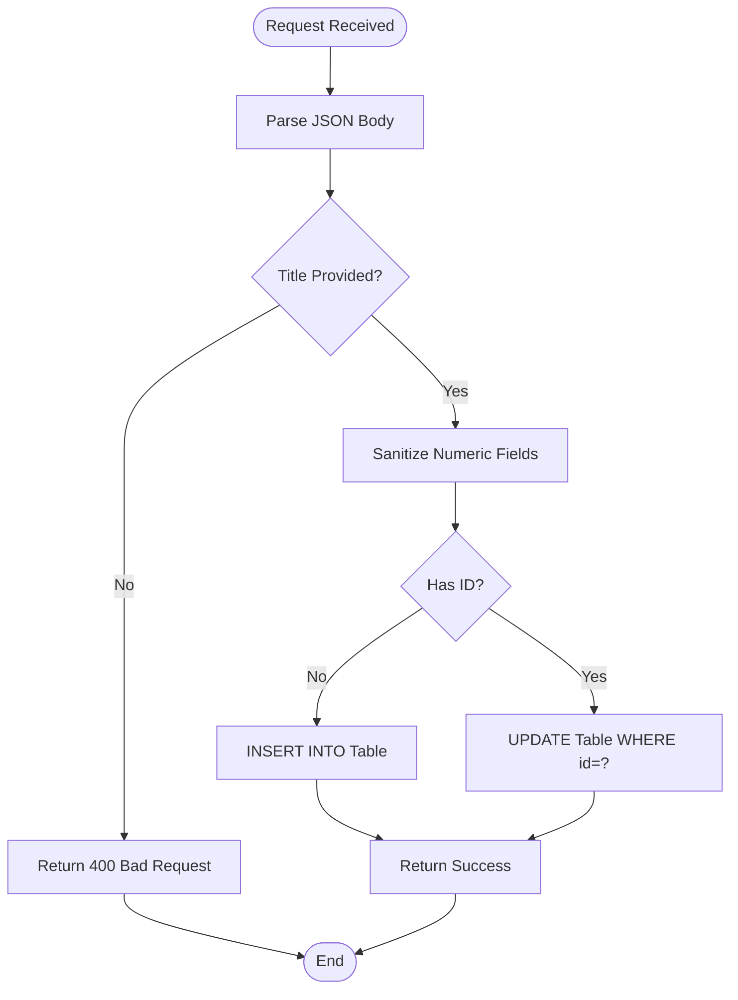
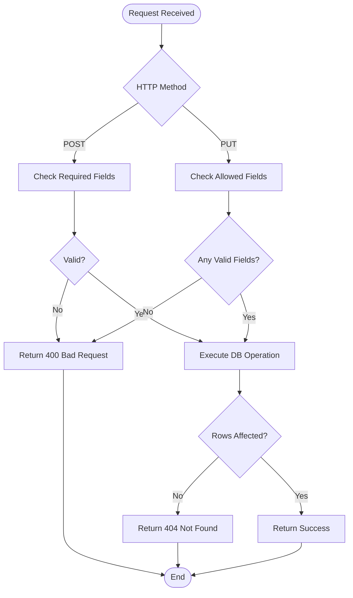
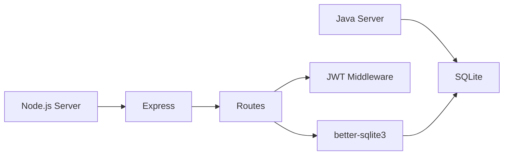

# Content Management

<cite>
**Referenced Files in This Document**
- [Server.java](file://Server.java)
- [projects.js](file://server/routes/projects.js)
- [education.js](file://server/routes/education.js)
- [experience.js](file://server/routes/experience.js)
- [auth.js](file://server/middleware/auth.js)
- [connection.js](file://server/db/connection.js)
- [schema.js](file://server/db/schema.js)
- [main.js](file://main.js)
</cite>

## Table of Contents
1. [Introduction](#introduction)
2. [Project Structure](#project-structure)
3. [Core Components](#core-components)
4. [Architecture Overview](#architecture-overview)
5. [Detailed Component Analysis](#detailed-component-analysis)
6. [Dependency Analysis](#dependency-analysis)
7. [Performance Considerations](#performance-considerations)
8. [Troubleshooting Guide](#troubleshooting-guide)
9. [Conclusion](#conclusion)

## Introduction
This document provides comprehensive API documentation for content management endpoints that power portfolio content (projects, education, and experience). It covers:
- Authentication requirements
- Request/response schemas
- Validation rules
- Error handling
- Practical curl examples for creating, updating, and deleting content

The backend exposes two distinct API families:
- A Java-based HTTP server with CRUD endpoints for admin operations
- A Node.js/Express-based API with JWT-authenticated CRUD routes for content management

## Project Structure
The repository includes:
- A Java HTTP server with admin endpoints for projects, education, and experience
- A Node.js/Express server with JWT middleware and SQLite-backed routes for content CRUD
- Frontend integration that consumes the Node.js API for rendering content

**Diagram sources**
- [Server.java:34-83](file://Server.java#L34-L83)
- [projects.js:1-56](file://server/routes/projects.js#L1-L56)
- [education.js:1-48](file://server/routes/education.js#L1-L48)
- [experience.js:1-48](file://server/routes/experience.js#L1-L48)
- [auth.js:1-62](file://server/middleware/auth.js#L1-L62)
- [connection.js:1-25](file://server/db/connection.js#L1-L25)
- [schema.js:1-287](file://server/db/schema.js#L1-L287)

**Section sources**
- [Server.java:34-83](file://Server.java#L34-L83)
- [projects.js:1-56](file://server/routes/projects.js#L1-L56)
- [education.js:1-48](file://server/routes/education.js#L1-L48)
- [experience.js:1-48](file://server/routes/experience.js#L1-L48)

## Core Components
- Java Admin Endpoints
  - /api/projects-crud: POST (create/update), DELETE (remove)
  - /api/education-crud: POST (create/update), DELETE (remove)
  - /api/experience-crud: POST (create/update), DELETE (remove)
  - Authentication: Cookie-based session check
  - Validation: Basic field presence checks and type coercion
  - Persistence: SQLite database

- Node.js Content Endpoints
  - /api/projects: GET (list), POST (create), PUT (update), DELETE (remove)
  - /api/education: GET (list), POST (create), PUT (update), DELETE (remove)
  - /api/experience: GET (list), POST (create), PUT (update), DELETE (remove)
  - Authentication: Bearer JWT token
  - Validation: Required fields per resource type
  - Persistence: SQLite via better-sqlite3

- Frontend Integration
  - main.js fetches /api/settings and renders projects, education, and experience lists
  - Uses Node.js endpoints for content CRUD operations

**Section sources**
- [Server.java:1252-1619](file://Server.java#L1252-L1619)
- [projects.js:8-53](file://server/routes/projects.js#L8-L53)
- [education.js:8-45](file://server/routes/education.js#L8-L45)
- [experience.js:8-45](file://server/routes/experience.js#L8-L45)
- [main.js:76-136](file://main.js#L76-L136)

## Architecture Overview
The system supports two complementary API surfaces:
- Java server for admin operations requiring session-based authentication
- Node.js server for content management with JWT-based authentication and SQLite persistence

**Diagram sources**
- [Server.java:1252-1377](file://Server.java#L1252-L1377)
- [projects.js:15-29](file://server/routes/projects.js#L15-L29)
- [auth.js:23-40](file://server/middleware/auth.js#L23-L40)
- [connection.js:8-15](file://server/db/connection.js#L8-L15)

## Detailed Component Analysis

### Authentication and Authorization
- Java Admin Endpoints
  - Session-based authentication via Cookie header
  - Endpoint requires a specific session cookie value to grant access
  - Unauthorized requests receive a 401 response

- Node.js Content Endpoints
  - JWT-based authentication via Authorization: Bearer <token>
  - Token validated using a shared secret; expired or invalid tokens return 401
  - Successful validation attaches user info to the request object

**Section sources**
- [Server.java:339-352](file://Server.java#L339-L352)
- [Server.java:1263-1266](file://Server.java#L1263-L1266)
- [auth.js:23-40](file://server/middleware/auth.js#L23-L40)

### Projects CRUD (/api/projects-crud and /api/projects)
- Java Admin Endpoint (/api/projects-crud)
  - POST: Accepts id (optional), title, description, image_url, github_link, live_link, tags, sort_order, is_visible
  - Validation: title is required; numeric fields coerced safely
  - Behavior: If id is missing, inserts; otherwise updates by id
  - DELETE: Requires id query parameter; deletes the project

- Node.js Endpoint (/api/projects)
  - GET: Returns all projects ordered by sort_order
  - POST: Requires title and description; optional fields supported
  - PUT :id: Updates allowed fields (title, description, image_url, github_link, live_link, tags, sort_order, is_visible)
  - DELETE :id: Removes the project by id

- Request/Response Schema
  - Common fields: title (required), description (required), image_url, github_link, live_link, tags, sort_order (integer), is_visible (boolean/int)
  - Additional fields: id (auto-generated or provided for updates)

- Validation Rules
  - Java: title must be present; numeric fields sanitized
  - Node.js: required fields enforced per endpoint; allowed fields validated for updates

- Error Handling
  - Missing/invalid parameters: 400
  - Unauthorized: 401
  - Not found: 404
  - Internal errors: 500

**Section sources**
- [Server.java:1269-1344](file://Server.java#L1269-L1344)
- [Server.java:1345-1376](file://Server.java#L1345-L1376)
- [projects.js:15-29](file://server/routes/projects.js#L15-L29)
- [projects.js:31-44](file://server/routes/projects.js#L31-L44)
- [projects.js:46-53](file://server/routes/projects.js#L46-L53)

### Education CRUD (/api/education-crud and /api/education)
- Java Admin Endpoint (/api/education-crud)
  - POST: Accepts id (optional), degree, institution, timeline, description, sort_order, is_visible
  - Validation: degree and institution are required; numeric fields sanitized
  - Behavior: Insert if id missing; otherwise update by id
  - DELETE: Requires id query parameter

- Node.js Endpoint (/api/education)
  - GET: Returns all education items ordered by sort_order
  - POST: Requires degree, institution, timeline; optional fields supported
  - PUT :id: Updates allowed fields (degree, institution, timeline, description, sort_order, is_visible)
  - DELETE :id: Removes the education item by id

- Request/Response Schema
  - Fields: degree (required), institution (required), timeline (required), description, sort_order (integer), is_visible (boolean/int)

- Validation Rules
  - Java: degree and institution required; numeric fields sanitized
  - Node.js: required fields enforced per endpoint; allowed fields validated for updates

- Error Handling
  - Missing/invalid parameters: 400
  - Unauthorized: 401
  - Not found: 404
  - Internal errors: 500

**Section sources**
- [Server.java:1396-1465](file://Server.java#L1396-L1465)
- [Server.java:1466-1496](file://Server.java#L1466-L1496)
- [education.js:14-22](file://server/routes/education.js#L14-L22)
- [education.js:25-36](file://server/routes/education.js#L25-L36)
- [education.js:39-44](file://server/routes/education.js#L39-L44)

### Experience CRUD (/api/experience-crud and /api/experience)
- Java Admin Endpoint (/api/experience-crud)
  - POST: Accepts id (optional), role, company, timeline, description, sort_order, is_visible
  - Validation: role and company are required; numeric fields sanitized
  - Behavior: Insert if id missing; otherwise update by id
  - DELETE: Requires id query parameter

- Node.js Endpoint (/api/experience)
  - GET: Returns all experience items ordered by sort_order
  - POST: Requires role, company, timeline; optional fields supported
  - PUT :id: Updates allowed fields (role, company, timeline, description, sort_order, is_visible)
  - DELETE :id: Removes the experience item by id

- Request/Response Schema
  - Fields: role (required), company (required), timeline (required), description, sort_order (integer), is_visible (boolean/int)

- Validation Rules
  - Java: role and company required; numeric fields sanitized
  - Node.js: required fields enforced per endpoint; allowed fields validated for updates

- Error Handling
  - Missing/invalid parameters: 400
  - Unauthorized: 401
  - Not found: 404
  - Internal errors: 500

**Section sources**
- [Server.java:1517-1586](file://Server.java#L1517-L1586)
- [Server.java:1587-1618](file://Server.java#L1587-L1618)
- [experience.js:14-22](file://server/routes/experience.js#L14-L22)
- [experience.js:25-36](file://server/routes/experience.js#L25-L36)
- [experience.js:39-44](file://server/routes/experience.js#L39-L44)

### Data Models and Persistence
- SQLite Tables
  - projects: id, title, description, image_url, github_link, live_link, tags, sort_order, is_visible, created_at
  - education: id, degree, institution, timeline, description, sort_order, is_visible, created_at
  - experience: id, role, company, timeline, description, sort_order, is_visible, created_at

- Node.js Initialization
  - Database initialized with schema and seeded default content
  - better-sqlite3 connection configured with WAL mode and foreign keys

**Section sources**
- [schema.js:75-108](file://server/db/schema.js#L75-L108)
- [schema.js:222-281](file://server/db/schema.js#L222-L281)
- [connection.js:8-15](file://server/db/connection.js#L8-L15)

## Architecture Overview

**Diagram sources**
- [projects.js:8-53](file://server/routes/projects.js#L8-L53)
- [education.js:8-45](file://server/routes/education.js#L8-L45)
- [experience.js:8-45](file://server/routes/experience.js#L8-L45)
- [auth.js:23-40](file://server/middleware/auth.js#L23-L40)
- [connection.js:8-15](file://server/db/connection.js#L8-L15)

## Detailed Component Analysis

### Authentication Flow (Node.js)

**Diagram sources**
- [auth.js:23-40](file://server/middleware/auth.js#L23-L40)
- [projects.js:15-29](file://server/routes/projects.js#L15-L29)

### Data Validation Flow (Java)

**Diagram sources**
- [Server.java:1269-1344](file://Server.java#L1269-L1344)

### Data Validation Flow (Node.js)

**Diagram sources**
- [projects.js:15-29](file://server/routes/projects.js#L15-L29)
- [projects.js:31-44](file://server/routes/projects.js#L31-L44)

## Dependency Analysis
- Java Server
  - Depends on JDBC SQLite driver and com.sun.net.httpserver
  - Uses a single HttpServer instance with explicit endpoint mapping
  - Authentication handled via cookie parsing and session validation

- Node.js Server
  - Express app with routes for projects, education, and experience
  - JWT middleware for authentication
  - better-sqlite3 for database connectivity
  - Centralized schema initialization and seeding

**Diagram sources**
- [Server.java:34-83](file://Server.java#L34-L83)
- [projects.js:1-6](file://server/routes/projects.js#L1-L6)
- [auth.js:1-62](file://server/middleware/auth.js#L1-L62)
- [connection.js:1-25](file://server/db/connection.js#L1-L25)

**Section sources**
- [Server.java:34-83](file://Server.java#L34-L83)
- [projects.js:1-6](file://server/routes/projects.js#L1-L6)
- [auth.js:1-62](file://server/middleware/auth.js#L1-L62)
- [connection.js:1-25](file://server/db/connection.js#L1-L25)

## Performance Considerations
- Database
  - SQLite is embedded and suitable for small to medium loads
  - Consider indexing on frequently queried columns (sort_order) if growth warrants
- API
  - Keep payloads minimal; avoid unnecessary fields in updates
  - Use pagination for large lists if needed
- Authentication
  - JWT token size should remain small; avoid embedding large claims
- Frontend
  - main.js fetches settings and content on page load; cache where appropriate

## Troubleshooting Guide
- Authentication Failures
  - Java: Ensure the session cookie is present and valid
  - Node.js: Verify Authorization header format and token validity

- Validation Errors
  - Missing required fields (title/description for projects; degree/institution/timeline for education; role/company/timeline for experience)
  - Numeric fields not coercible to integers

- Database Errors
  - Ensure SQLite database is accessible and schema is initialized
  - Check for proper table creation and seeding

- Common HTTP Status Codes
  - 400: Bad Request (validation failure)
  - 401: Unauthorized (missing/invalid auth)
  - 404: Not Found (resource not found)
  - 500: Internal Server Error (server-side issue)

**Section sources**
- [Server.java:1290-1293](file://Server.java#L1290-L1293)
- [projects.js:18-20](file://server/routes/projects.js#L18-L20)
- [education.js:15-16](file://server/routes/education.js#L15-L16)
- [experience.js:15-16](file://server/routes/experience.js#L15-L16)

## Conclusion
The portfolio content management system provides robust CRUD capabilities for projects, education, and experience through both Java admin endpoints and Node.js content endpoints. Authentication differs between the two surfaces, with session-based access for Java and JWT-based access for Node.js. Clear validation rules and error handling ensure predictable behavior, while SQLite-backed persistence offers simplicity and reliability for a personal portfolio.