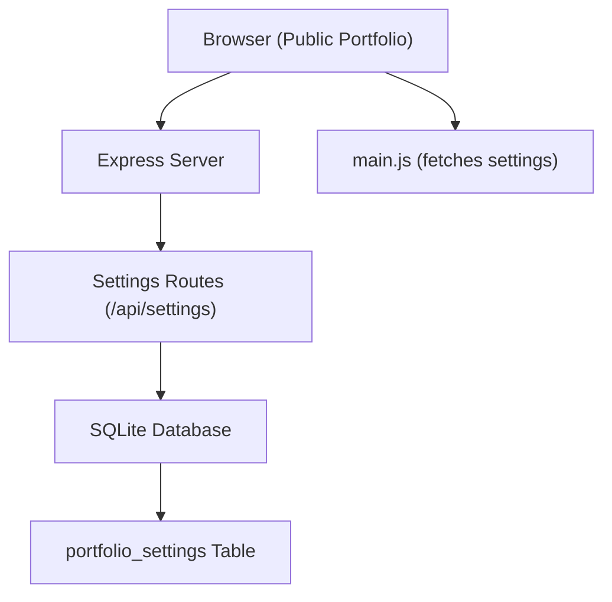
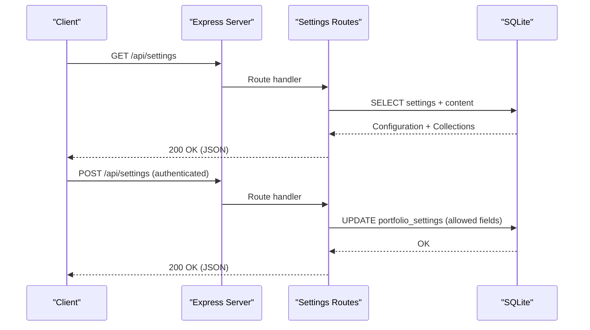
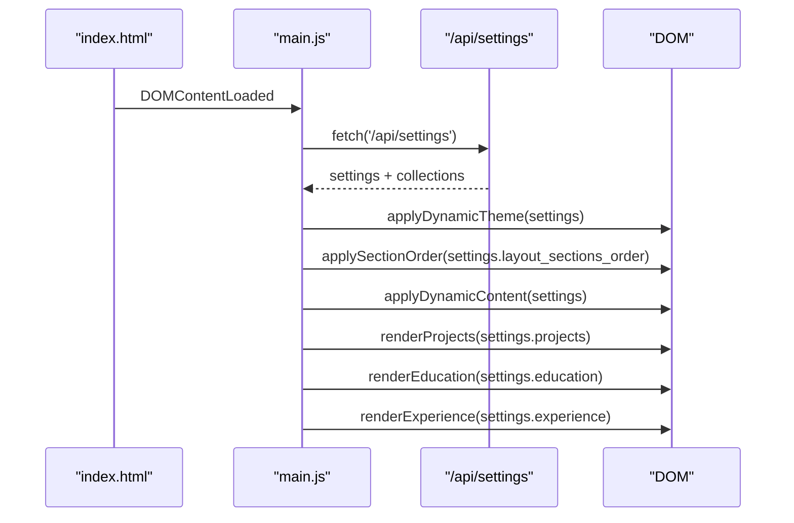
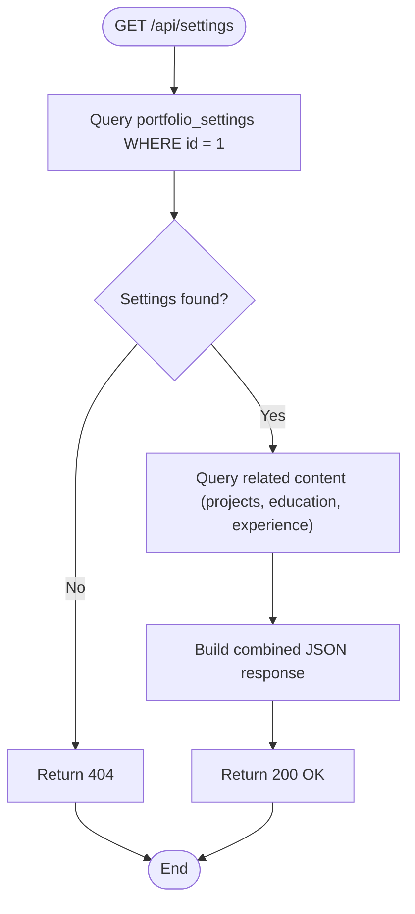
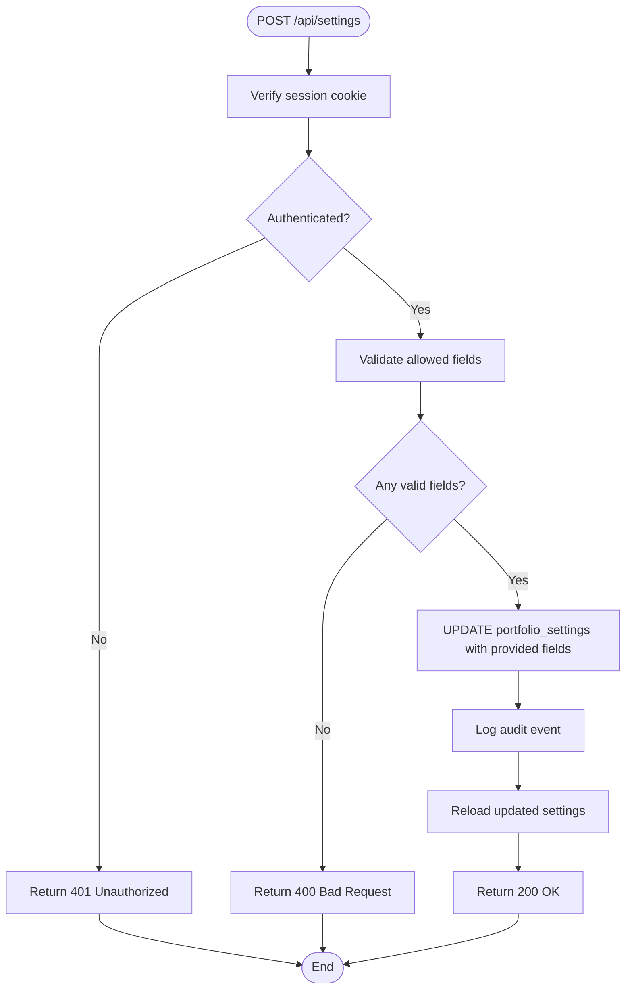
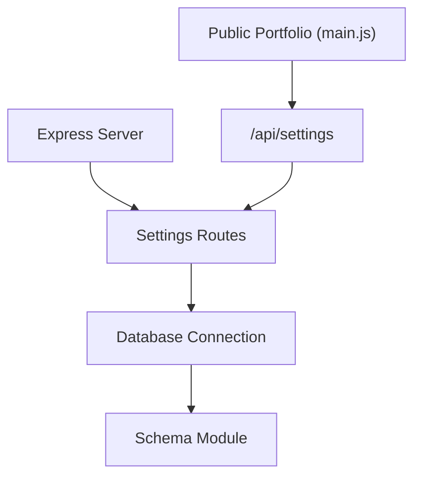

# Settings & Configuration

<cite>
**Referenced Files in This Document**
- [server/index.js](file://server/index.js)
- [server/routes/settings.js](file://server/routes/settings.js)
- [server/db/schema.js](file://server/db/schema.js)
- [main.js](file://main.js)
- [design.md](file://design.md)
</cite>

## Table of Contents
1. [Introduction](#introduction)
2. [Project Structure](#project-structure)
3. [Core Components](#core-components)
4. [Architecture Overview](#architecture-overview)
5. [Detailed Component Analysis](#detailed-component-analysis)
6. [Dependency Analysis](#dependency-analysis)
7. [Performance Considerations](#performance-considerations)
8. [Troubleshooting Guide](#troubleshooting-guide)
9. [Conclusion](#conclusion)

## Introduction
This document provides comprehensive API documentation for the settings and configuration endpoints, focusing on the /api/settings endpoint. It covers:
- GET method for retrieving portfolio configuration data
- POST method for updating settings
- All configurable fields including theme presets, color schemes, typography, animation controls, layout section ordering, SEO metadata, social media links, contact information, and custom CSS/JavaScript
- Request/response schemas, validation rules, and data types
- Practical examples with curl commands
- Database schema for portfolio_settings table and migration procedures for new settings fields

## Project Structure
The settings API is implemented in the Node.js/Express backend and integrates with the public portfolio front-end:
- Express server registers the settings route at /api/settings
- The settings route queries the SQLite database for configuration and related content
- The public front-end fetches settings on initial load and applies them dynamically

**Diagram sources**
- [server/index.js:38-52](file://server/index.js#L38-L52)
- [server/routes/settings.js:8-23](file://server/routes/settings.js#L8-L23)
- [main.js:76-114](file://main.js#L76-L114)

**Section sources**
- [server/index.js:38-52](file://server/index.js#L38-L52)
- [main.js:76-114](file://main.js#L76-L114)

## Core Components
- Settings Route Module: Implements GET and POST handlers for /api/settings
- Database Schema: Defines portfolio_settings table with all configurable fields
- Front-end Integration: Loads settings on page initialization and applies them

Key responsibilities:
- GET /api/settings: Returns active configuration plus related content collections
- POST /api/settings: Updates allowed fields with validation and audit logging
- Database seeding and migrations: Ensures default values and adds new columns safely

**Section sources**
- [server/routes/settings.js:8-71](file://server/routes/settings.js#L8-L71)
- [server/db/schema.js:26-73](file://server/db/schema.js#L26-L73)

## Architecture Overview
The settings API follows a straightforward request-response pattern:
- Public GET endpoint returns configuration and content collections
- Protected POST endpoint updates configuration with allowed fields whitelist

**Diagram sources**
- [server/routes/settings.js:8-71](file://server/routes/settings.js#L8-L71)
- [server/index.js:39-45](file://server/index.js#L39-L45)

## Detailed Component Analysis

### Settings API Endpoints

#### GET /api/settings
- Method: GET
- Authentication: None (public)
- Purpose: Retrieve active portfolio configuration and related content collections
- Response includes: settings object, projects array, education array, experience array

Request
- Headers: Content-Type: application/json
- Body: None

Response
- Status: 200 OK on success
- Body: {
  "status": "success",
  "settings": { /* configuration object */ },
  "projects": [ /* visible projects */ ],
  "education": [ /* visible education */ ],
  "experience": [ /* visible experience */ ]
}

curl example
- curl -i https://your-domain.com/api/settings

#### POST /api/settings
- Method: POST
- Authentication: Required (session cookie)
- Purpose: Update allowed configuration fields
- Validation: Only fields in the allowed list are processed
- Response: Success message with updated settings

Request
- Headers: Content-Type: application/json
- Body: {
  "field_name": "value",
  "another_field": "value"
  // Only allowed fields are processed
}

Response
- Status: 200 OK on success
- Body: {
  "status": "success",
  "message": "Settings updated successfully.",
  "settings": { /* updated configuration */ }
}

curl example
- curl -i -X POST https://your-domain.com/api/settings \
  -H "Content-Type: application/json" \
  -b "session_id=YOUR_SESSION_COOKIE" \
  -d '{"theme_preset":"dark","primary_color":"#f43f5e"}'

Allowed Fields (subset)
- Theme and Colors: theme_preset, primary_color, secondary_color, accent_color, background_color, surface_color
- Typography: font_display, font_body
- Animations: animations_enabled
- Layout: layout_sections_order
- SEO: seo_title, seo_description, analytics_id
- Hero Content: hero_badge, hero_title, hero_subtitle, hero_description
- About Section: about_lead, about_body
- Skills: skills_web_dev, skills_security, skills_languages
- Contact: contact_title, contact_subtitle, contact_email, contact_location, contact_status
- Social: social_github, social_linkedin, social_twitter
- Branding: brand_name, logo_text, footer_text
- Goals: goal_1_title, goal_1_desc, goal_1_status, goal_2_title, goal_2_desc, goal_2_status, goal_3_title, goal_3_desc, goal_3_status
- Custom Code: custom_css, custom_javascript

Validation Rules
- Allowed fields only: Requests containing unknown keys are ignored
- Type coercion: animations_enabled accepts boolean-like values (true/false, 1/0, numeric)
- Partial updates: Only provided fields are updated; others retain current values
- Audit trail: All updates are logged with user context

**Section sources**
- [server/routes/settings.js:8-71](file://server/routes/settings.js#L8-L71)
- [server/index.js:39-45](file://server/index.js#L39-L45)

### Database Schema: portfolio_settings

Table Definition
- Single-row enforcement: id PRIMARY KEY CHECK (id = 1)
- Default values for all fields
- Timestamp updated_at tracks last modification

Core Fields
- Theme and Colors
  - theme_preset: text (default 'dark')
  - primary_color: text (default '#f43f5e')
  - secondary_color: text (default '#8b5cf6')
  - accent_color: text (default '#f59e0b')
  - background_color: text (default '#050811')
  - surface_color: text (default '#0c1122')

- Typography
  - font_display: text (default 'Oswald')
  - font_body: text (default 'Inter')

- Animation Controls
  - animations_enabled: integer (default 1)

- Layout Section Ordering
  - layout_sections_order: text (default 'about,education,skills,now,projects,contact')

- SEO Metadata
  - seo_title: text (default 'Aditya Soni | Developer & Security Enthusiast')
  - seo_description: text (default 'B.Tech CSE Undergrad at Rungta Skill University. Full-stack developer & ethical hacker.')
  - analytics_id: text (default '')

- Hero Content
  - hero_badge: text (default 'First-year CSE student · Bhilai, CG')
  - hero_title: text (default 'I BUILD WEB THINGS.\nTHEN I TRY TO\nBREAK THEM.')
  - hero_subtitle: text (default '— Aditya Soni')
  - hero_description: text (default 'I'm a CS undergrad...')

- About Section
  - about_lead: text (default 'A first-year CS undergrad...')
  - about_body: text (default 'I'm Aditya Soni...')

- Skills
  - skills_web_dev: text (default 'MongoDB, Express.js, React.js, Node.js, REST APIs')
  - skills_security: text (default 'Kali Linux, Nmap, Wireshark, Metasploit, Pen Testing')
  - skills_languages: text (default 'C / C++, HTML5 / CSS3, JavaScript, Git & GitHub')

- Contact
  - contact_title: text (default 'LET'S COLLABORATE ON THE FUTURE')
  - contact_subtitle: text (default 'Have a project in mind...')
  - contact_email: text (default 'mradityasoni.cse@gmail.com')
  - contact_location: text (default 'Bhilai, Chhattisgarh 🇮🇳')
  - contact_status: text (default 'Open to Opportunities')

- Social Media
  - social_github: text (default 'https://github.com')
  - social_linkedin: text (default 'https://linkedin.com')
  - social_twitter: text (default 'https://twitter.com')

- Branding
  - brand_name: text (default 'Aditya Soni')
  - logo_text: text (default 'ADITYA.DEV')
  - footer_text: text (default '© 2026 Aditya Soni. All Rights Reserved.')

- Goals
  - goal_1_title..goal_3_status: text fields for three goals

- Custom Code
  - custom_css: text (default '')
  - custom_javascript: text (default '')

Timestamp
- updated_at: timestamp (default CURRENT_TIMESTAMP)

Migration Procedures
- Automatic migration: New columns are added to existing databases with default values
- Safe operation: Attempts to add columns are wrapped to ignore errors if columns already exist
- Seeding: Empty databases are seeded with id=1 and defaults

**Section sources**
- [server/db/schema.js:26-73](file://server/db/schema.js#L26-L73)
- [server/db/schema.js:222-227](file://server/db/schema.js#L222-L227)

### Front-end Integration

Public Portfolio Loading
- On initial load, main.js fetches settings from /api/settings
- Applies dynamic theme, typography, and content
- Loads related content collections (projects, education, experience)
- Falls back gracefully if API fails

**Diagram sources**
- [main.js:76-114](file://main.js#L76-L114)

**Section sources**
- [main.js:76-114](file://main.js#L76-L114)

### API Workflow Details

#### GET Request Flow

**Diagram sources**
- [server/routes/settings.js:9-23](file://server/routes/settings.js#L9-L23)

#### POST Request Flow

**Diagram sources**
- [server/routes/settings.js:26-71](file://server/routes/settings.js#L26-L71)

## Dependency Analysis
Settings API dependencies and relationships:
- Express server mounts settings routes
- Settings routes depend on database connection module
- Front-end depends on settings API for dynamic content
- Database schema defines table structure and defaults

**Diagram sources**
- [server/index.js:39-45](file://server/index.js#L39-L45)
- [server/routes/settings.js:1-6](file://server/routes/settings.js#L1-L6)
- [main.js:76-114](file://main.js#L76-L114)

**Section sources**
- [server/index.js:39-45](file://server/index.js#L39-L45)
- [server/routes/settings.js:1-6](file://server/routes/settings.js#L1-L6)

## Performance Considerations
- Single-row configuration: Using id=1 enforces minimal query overhead
- Combined response: Settings and related content returned in one request
- Lightweight updates: Only provided fields are updated, reducing write operations
- Front-end caching: Settings are fetched once per page load; consider client-side caching for repeated visits
- Database efficiency: Simple SELECT/UPDATE operations with minimal joins

## Troubleshooting Guide
Common issues and resolutions:
- Authentication failures: Ensure session cookie is present for POST requests
- Unknown fields ignored: Only allowed fields are processed; verify field names
- Type coercion issues: animations_enabled accepts boolean-like values
- Database connectivity: Verify SQLite file accessibility and permissions
- CORS issues: API supports wildcard CORS for development; configure appropriately for production

**Section sources**
- [server/routes/settings.js:26-71](file://server/routes/settings.js#L26-L71)

## Conclusion
The settings API provides a robust, secure mechanism for managing portfolio configuration. It offers comprehensive customization options while maintaining simplicity and performance. The design supports both immediate public consumption and protected administrative updates, with clear validation and audit trails.