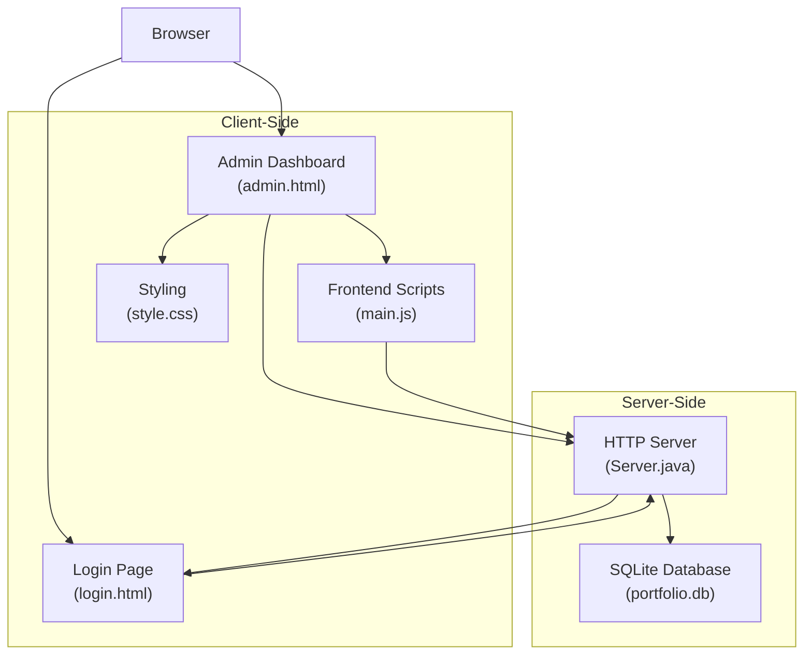
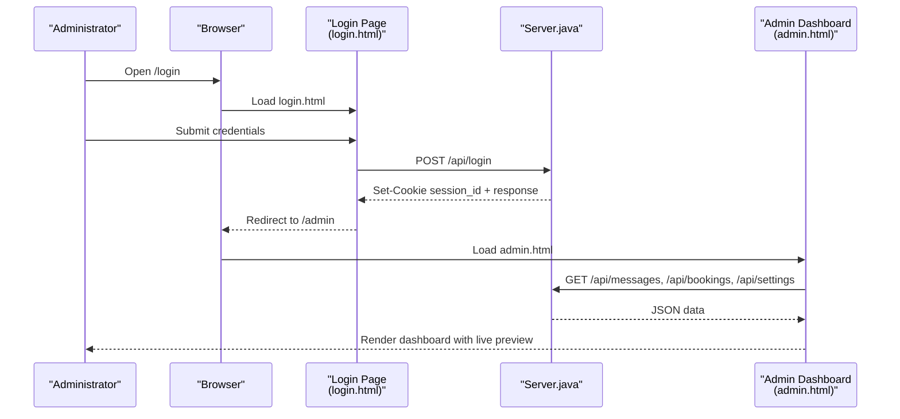
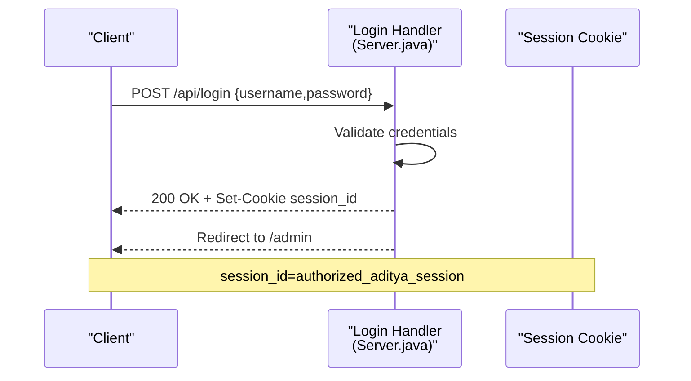
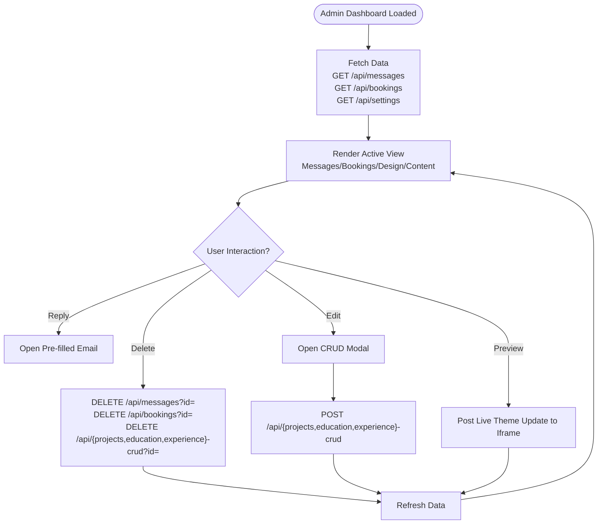
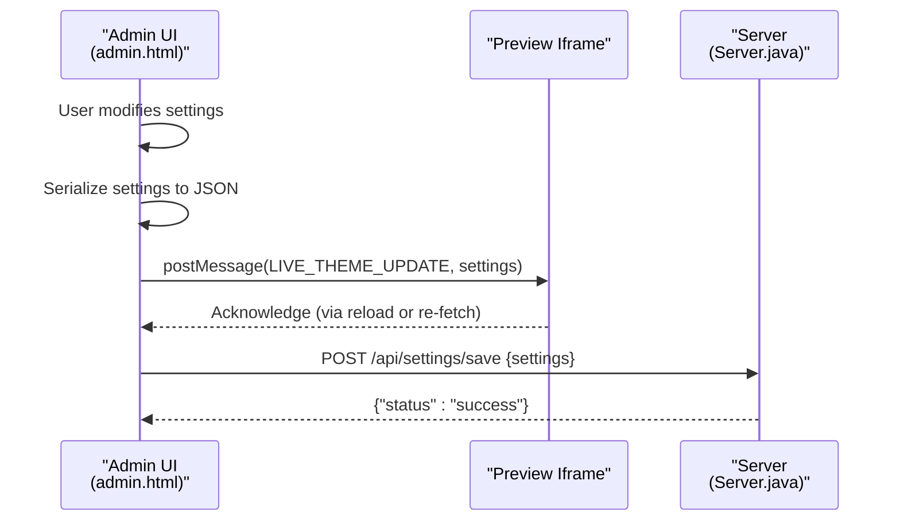
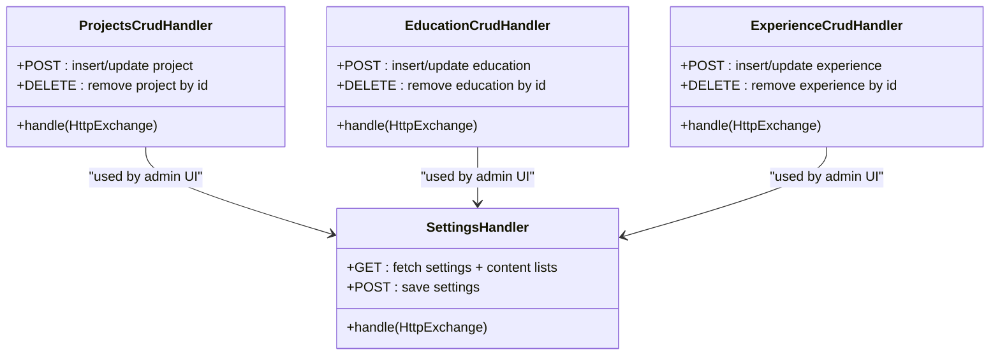
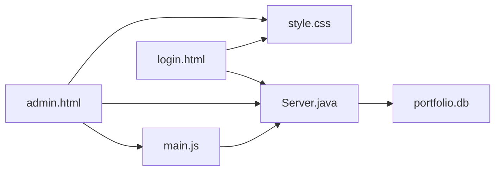

# Admin Panel Features

<cite>
**Referenced Files in This Document**
- [admin.html](file://admin.html)
- [login.html](file://login.html)
- [Server.java](file://Server.java)
- [main.js](file://main.js)
- [style.css](file://style.css)
</cite>

## Table of Contents
1. [Introduction](#introduction)
2. [Project Structure](#project-structure)
3. [Core Components](#core-components)
4. [Architecture Overview](#architecture-overview)
5. [Detailed Component Analysis](#detailed-component-analysis)
6. [Dependency Analysis](#dependency-analysis)
7. [Performance Considerations](#performance-considerations)
8. [Troubleshooting Guide](#troubleshooting-guide)
9. [Conclusion](#conclusion)

## Introduction
This document provides comprehensive documentation for the admin panel features of the premium portfolio. It covers the login and authentication system, content management interface, administrative workflows, and integration with backend API endpoints. The admin panel enables secure management of portfolio content, including messages, bookings, visual customization, and content CRUD operations for projects, education, and experience. It also documents real-time preview capabilities, security considerations, and practical usage examples for administrators.

## Project Structure
The admin panel is implemented as a single-page application served by a lightweight Java HTTP server. Key components include:
- Admin dashboard (admin.html): Central interface for managing messages, bookings, visual settings, and content.
- Login page (login.html): Authentication interface that validates credentials and redirects to the admin dashboard.
- Backend server (Server.java): Provides REST endpoints for data retrieval and updates, serves static files, and enforces access control.
- Frontend scripts (main.js): Handles dynamic content rendering, form interactions, and real-time preview updates.
- Styling (style.css): Defines the Brutalist-inspired design system and responsive layout.

**Diagram sources**
- [admin.html](file://admin.html)
- [login.html](file://login.html)
- [Server.java](file://Server.java)
- [main.js](file://main.js)
- [style.css](file://style.css)

**Section sources**
- [admin.html](file://admin.html)
- [login.html](file://login.html)
- [Server.java](file://Server.java)
- [main.js](file://main.js)
- [style.css](file://style.css)

## Core Components
- Authentication and Access Control
  - Login page validates credentials and obtains a session cookie.
  - Admin routes are protected and redirect unauthenticated users to the login page.
- Data Management
  - Messages and bookings are retrieved via protected endpoints and displayed in the dashboard.
  - Visual settings and content CRUD operations are performed through dedicated endpoints.
- Real-Time Preview
  - Live preview updates are synchronized to an embedded iframe for immediate visual feedback.
- Content CRUD
  - Projects, education, and experience items support create, update, and delete operations.

**Section sources**
- [login.html](file://login.html)
- [Server.java](file://Server.java)
- [admin.html](file://admin.html)

## Architecture Overview
The admin panel follows a client-server architecture:
- Client-side: HTML/CSS/JavaScript in admin.html and login.html, with main.js orchestrating interactions.
- Server-side: Java HttpServer with custom handlers for authentication, data retrieval, and updates.
- Database: SQLite with tables for contacts, bookings, portfolio_settings, projects, education, and experience.

**Diagram sources**
- [login.html](file://login.html)
- [Server.java](file://Server.java)
- [admin.html](file://admin.html)

**Section sources**
- [login.html](file://login.html)
- [Server.java](file://Server.java)
- [admin.html](file://admin.html)

## Detailed Component Analysis

### Login and Authentication System
- Credential Validation
  - The login form submits credentials to /api/login via POST.
  - Server validates hardcoded credentials and responds with a success status and sets a session cookie.
- Session Management
  - The session cookie "session_id=authorized_aditya_session" is required for accessing admin routes.
  - StaticFileHandler checks authentication for /admin.html and redirects to /login if unauthorized.
- Security Considerations
  - Current implementation uses a hardcoded username/password and a simple cookie value.
  - Recommendations include hashing passwords, implementing CSRF protection, and using HTTPS.

**Diagram sources**
- [login.html](file://login.html)
- [Server.java](file://Server.java)

**Section sources**
- [login.html](file://login.html)
- [Server.java](file://Server.java)

### Admin Dashboard and Workflows
- Views and Navigation
  - Messages, Booked Calls, Visual Customizer, and Content Manager tabs provide distinct administrative views.
  - Search and filter status enable efficient data discovery.
- Data Retrieval
  - GET /api/messages and GET /api/bookings fetch lists for display.
  - GET /api/settings retrieves visual and content settings for rendering and live preview.
- Actions
  - Delete operations use DELETE endpoints for messages/bookings and CRUD items.
  - Reply actions generate pre-filled email URLs for quick communication.
- Real-Time Preview
  - Live updates are sent to an embedded iframe via postMessage for immediate visual feedback.

**Diagram sources**
- [admin.html](file://admin.html)
- [Server.java](file://Server.java)

**Section sources**
- [admin.html](file://admin.html)
- [Server.java](file://Server.java)

### Visual Customizer and Live Preview
- Controls
  - Theme presets, color pickers, typography selection, and layout order controls.
  - Branding, SEO, and analytics settings editors.
- Live Preview
  - Changes are serialized and posted to the iframe to reflect real-time updates.
  - Device view toggles adjust the preview container size.

**Diagram sources**
- [admin.html](file://admin.html)
- [Server.java](file://Server.java)

**Section sources**
- [admin.html](file://admin.html)
- [Server.java](file://Server.java)

### Content Management Interface
- Projects Manager
  - Manage project cards with title, description, tags, and links.
  - Visibility and sorting controls for presentation order.
- Education Timeline
  - Manage academic milestones with degree, institution, and timeline.
- Right Now Focus
  - Manage current focus items with role, company, and timeline.
- CRUD Operations
  - Create, update, and delete items via POST and DELETE endpoints.
  - Backup and restore functionality supports JSON exports/imports.

**Diagram sources**
- [Server.java](file://Server.java)

**Section sources**
- [admin.html](file://admin.html)
- [Server.java](file://Server.java)

### Administrative Workflows
- Adding a New Project
  1. Switch to Content Manager → Projects.
  2. Click "+ Add New Item".
  3. Fill in project details (title, description, tags, links).
  4. Set visibility and sort order.
  5. Save; the item appears in the list and on the live preview.
- Editing Education Items
  1. Navigate to Education Timeline.
  2. Click "Edit Info" on the desired item.
  3. Modify degree, institution, timeline, and description.
  4. Save changes; verify in the preview.
- Managing Bookings and Messages
  1. Switch to Booked Calls or Messages view.
  2. Use search/filter to locate entries.
  3. Reply via pre-filled email or delete entries as needed.
- Publishing Visual Settings
  1. Open Visual Customizer.
  2. Adjust colors, fonts, and layout.
  3. Click "Publish"; the iframe reloads to reflect changes.

**Section sources**
- [admin.html](file://admin.html)
- [Server.java](file://Server.java)

### Integration with Backend API Endpoints
- Authentication
  - POST /api/login: Validates credentials and sets session cookie.
- Data Retrieval
  - GET /api/messages: Returns all inquiry messages.
  - GET /api/bookings: Returns all scheduled consultations.
  - GET /api/settings: Returns portfolio settings and content lists.
- Data Updates
  - POST /api/settings/save: Saves visual and content settings.
  - POST /api/projects-crud: Creates or updates a project.
  - POST /api/education-crud: Creates or updates an education item.
  - POST /api/experience-crud: Creates or updates an experience item.
- Deletion
  - DELETE /api/messages?id=<id>
  - DELETE /api/bookings?id=<id>
  - DELETE /api/projects-crud?id=<id>
  - DELETE /api/education-crud?id=<id>
  - DELETE /api/experience-crud?id=<id>

**Section sources**
- [Server.java](file://Server.java)
- [admin.html](file://admin.html)

## Dependency Analysis
- Client-Server Dependencies
  - admin.html depends on main.js for dynamic rendering and Server.java endpoints for data.
  - login.html depends on Server.java for authentication and redirection.
- Database Dependencies
  - Server.java initializes and queries SQLite tables for contacts, bookings, portfolio_settings, projects, education, and experience.
- Styling Dependencies
  - admin.html and login.html consume style.css for consistent visuals.

**Diagram sources**
- [admin.html](file://admin.html)
- [login.html](file://login.html)
- [Server.java](file://Server.java)
- [main.js](file://main.js)
- [style.css](file://style.css)

**Section sources**
- [admin.html](file://admin.html)
- [login.html](file://login.html)
- [Server.java](file://Server.java)
- [main.js](file://main.js)
- [style.css](file://style.css)

## Performance Considerations
- Database Queries
  - Sorting by created_at ensures recent entries appear first; consider indexing for large datasets.
- Network Requests
  - Minimize redundant fetches by caching active data and refreshing only on demand.
- Rendering
  - Use virtual scrolling for large lists to improve responsiveness.
- Preview Updates
  - Debounce live preview updates to avoid excessive iframe reloads.

## Troubleshooting Guide
- Authentication Failures
  - Ensure the session cookie "session_id=authorized_aditya_session" is present.
  - Verify /api/login returns success and redirects to /admin.
- Unauthorized Access
  - Confirm /admin.html requires authentication; unauthorized requests redirect to /login.
- Data Fetch Errors
  - Check GET /api/messages, /api/bookings, and /api/settings responses.
  - Inspect the SQL Query Audit Console for errors.
- CRUD Operation Failures
  - Validate required fields and numeric parameters.
  - Confirm DELETE endpoints receive valid id parameters.
- Live Preview Issues
  - Ensure postMessage is supported and the iframe is reachable.
  - Verify settings serialization and endpoint POST /api/settings/save.

**Section sources**
- [login.html](file://login.html)
- [Server.java](file://Server.java)
- [admin.html](file://admin.html)

## Conclusion
The admin panel provides a robust, integrated solution for managing portfolio content and configurations. It combines a secure authentication flow, comprehensive data management, and real-time preview capabilities. Administrators can efficiently manage messages, bookings, visual themes, and content items through a streamlined interface. For production deployments, strengthen authentication, implement CSRF protection, and enhance error handling to ensure reliability and security.