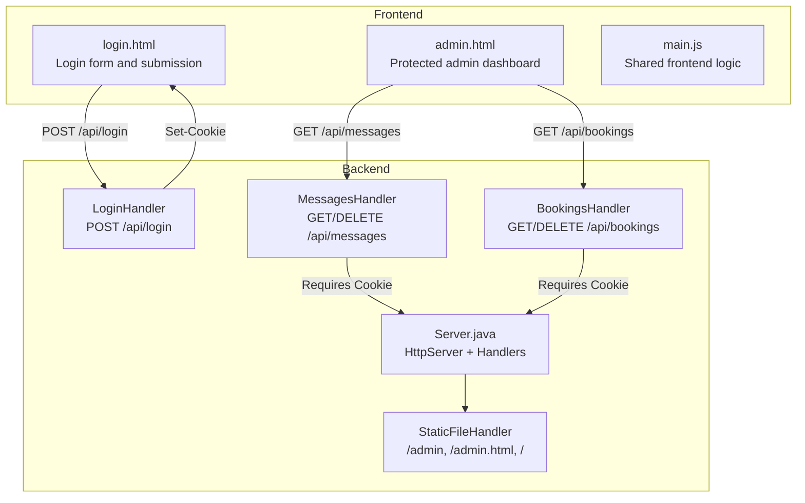
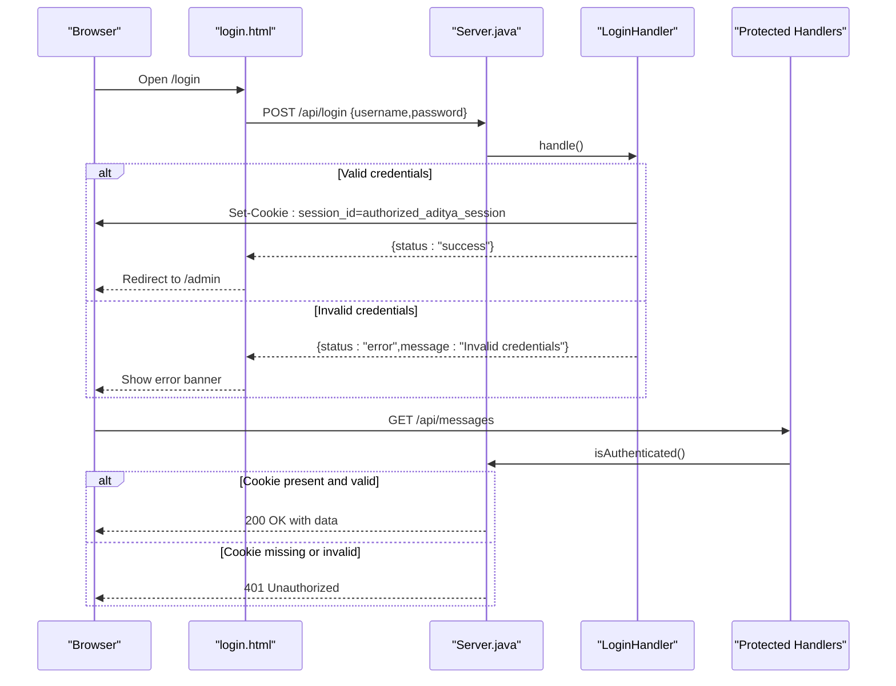
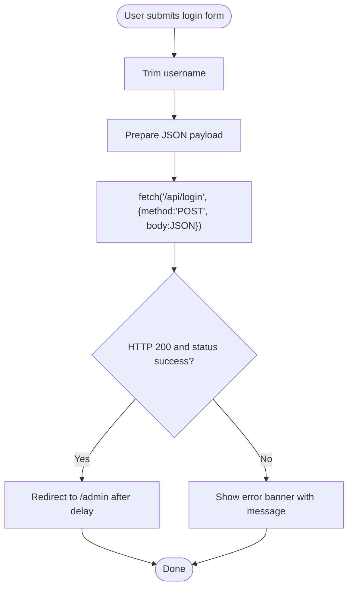
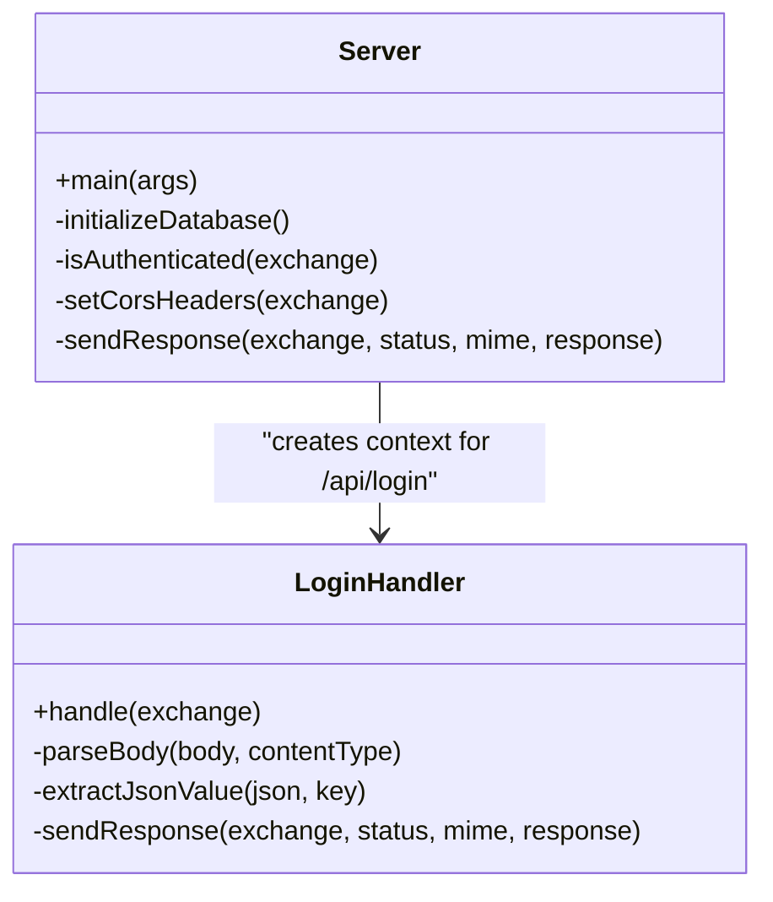
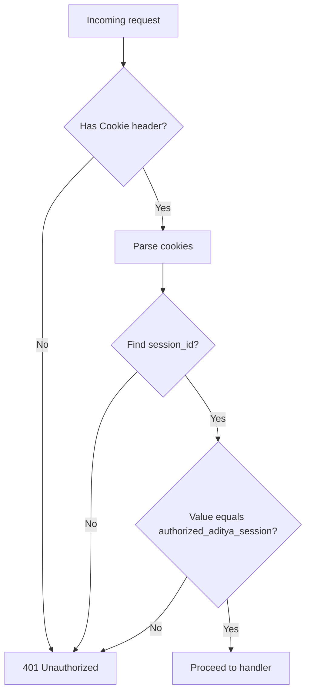
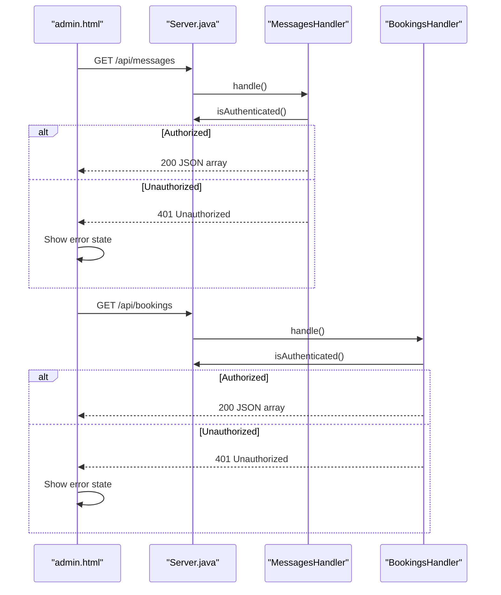
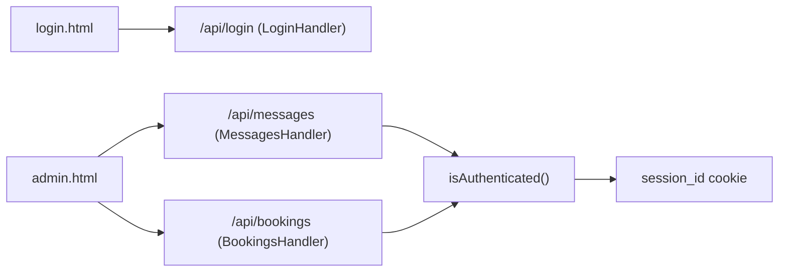

# Authentication System

<cite>
**Referenced Files in This Document**
- [login.html](file://login.html)
- [Server.java](file://Server.java)
- [admin.html](file://admin.html)
- [main.js](file://main.js)
</cite>

## Table of Contents
1. [Introduction](#introduction)
2. [Project Structure](#project-structure)
3. [Core Components](#core-components)
4. [Architecture Overview](#architecture-overview)
5. [Detailed Component Analysis](#detailed-component-analysis)
6. [Dependency Analysis](#dependency-analysis)
7. [Performance Considerations](#performance-considerations)
8. [Troubleshooting Guide](#troubleshooting-guide)
9. [Conclusion](#conclusion)

## Introduction
This document describes the authentication system for the premium portfolio project. It covers the login interface implementation, session-based authentication mechanism, and security measures. It documents the login.html page structure, form validation, and authentication flow. It explains how sessions are managed, cookie handling, and access control mechanisms. Step-by-step instructions are provided for admin login, session timeout handling, and logout procedures. Security considerations including password protection, session fixation prevention, and secure cookie configuration are addressed. Troubleshooting guidance for common authentication issues and integration with backend login handlers is included.

## Project Structure
The authentication system spans three key areas:
- Frontend login page (login.html) with client-side form submission and error handling
- Backend HTTP server (Server.java) implementing login, protected routes, and cookie-based session management
- Admin dashboard (admin.html) that requires successful authentication to access protected resources

**Diagram sources**
- [login.html](file://login.html)
- [Server.java](file://Server.java)
- [admin.html](file://admin.html)

**Section sources**
- [login.html](file://login.html)
- [Server.java](file://Server.java)
- [admin.html](file://admin.html)

## Core Components
- Login page (login.html): Provides the login form with username and password fields, client-side validation, and submission handling to the backend. Displays error messages on failure.
- Backend login handler (Server.java): Validates credentials, sets a session cookie, and returns a success response on valid credentials.
- Session verification (Server.java): Checks incoming requests for the presence and validity of the session cookie to enforce access control on protected endpoints.
- Protected admin dashboard (admin.html): Requires authentication to access administrative features and protected API endpoints.

Key implementation highlights:
- Login form posts JSON credentials to /api/login
- Successful login sets a HttpOnly, SameSite=Lax cookie named session_id with a fixed value
- Protected endpoints (/api/messages, /api/bookings) check for the session cookie before processing requests
- Admin dashboard fetches protected data only after successful authentication

**Section sources**
- [login.html](file://login.html)
- [Server.java](file://Server.java)
- [admin.html](file://admin.html)

## Architecture Overview
The authentication architecture uses a simple cookie-based session model:
- Client submits credentials to the backend
- On success, the backend sets a session cookie
- Subsequent requests include the cookie automatically
- Protected handlers verify the cookie before granting access

**Diagram sources**
- [login.html](file://login.html)
- [Server.java](file://Server.java)

## Detailed Component Analysis

### Login Interface Implementation (login.html)
- Structure: Glass-morphism card layout with animated entrance using GSAP
- Form fields: Username and password with autocomplete attributes
- Validation: Prevents default form submission, trims username, disables submit button during request, and displays errors
- Submission: Sends JSON payload to /api/login and redirects on success
- Error handling: Shows a styled error banner with the server-provided message

**Diagram sources**
- [login.html](file://login.html)

**Section sources**
- [login.html](file://login.html)

### Backend Login Handler (Server.java)
- Endpoint: POST /api/login
- Request handling: Parses JSON body, validates hardcoded credentials, and sets a secure cookie
- Cookie configuration: session_id with fixed value, HttpOnly, SameSite=Lax, Path=/
- Response: Returns success on valid credentials, otherwise returns error

**Diagram sources**
- [Server.java](file://Server.java)

**Section sources**
- [Server.java](file://Server.java)

### Session Management and Access Control (Server.java)
- Session cookie: session_id=authorized_aditya_session
- Verification: isAuthenticated() reads the Cookie header, splits into pairs, and checks for matching session_id
- Protected endpoints: MessagesHandler and BookingsHandler call isAuthenticated() and return 401 if unauthorized
- Static admin pages: /admin and /admin.html are mapped to StaticFileHandler, but access is enforced by requiring authentication upstream

**Diagram sources**
- [Server.java](file://Server.java)

**Section sources**
- [Server.java](file://Server.java)

### Admin Dashboard Integration (admin.html)
- Protected data fetching: Uses fetch() to GET /api/messages and /api/bookings after authentication
- Error logging: Displays server errors in a terminal-like widget
- Access control: Relies on backend cookie validation; if unauthorized, requests fail and show error states

**Diagram sources**
- [admin.html](file://admin.html)
- [Server.java](file://Server.java)

**Section sources**
- [admin.html](file://admin.html)
- [Server.java](file://Server.java)

## Dependency Analysis
- login.html depends on Server.java's /api/login endpoint for authentication
- admin.html depends on Server.java's /api/messages and /api/bookings endpoints, which depend on session cookie validation
- Server.java enforces access control centrally via isAuthenticated()

**Diagram sources**
- [login.html](file://login.html)
- [admin.html](file://admin.html)
- [Server.java](file://Server.java)

**Section sources**
- [login.html](file://login.html)
- [admin.html](file://admin.html)
- [Server.java](file://Server.java)

## Performance Considerations
- Cookie-based session checking is lightweight and avoids heavy cryptographic operations
- JSON parsing and cookie header splitting are O(n) with small n, suitable for typical traffic
- Consider adding rate limiting at the server level to mitigate brute-force attempts
- Minimize cookie size and avoid unnecessary headers to reduce overhead

## Troubleshooting Guide
Common issues and resolutions:
- Invalid credentials error: Ensure username and password match the hardcoded values expected by the backend
- 401 Unauthorized on admin pages: Confirm that the browser accepted and sent the session_id cookie with subsequent requests
- CORS-related failures: The server sets permissive CORS headers; verify that preflight OPTIONS requests succeed
- Server startup errors: Ensure the SQLite JDBC driver is available and the database file is writable
- Mixed content or HTTPS warnings: If served over HTTPS, ensure cookies are configured securely; current implementation uses HttpOnly and SameSite but does not set Secure flag

Step-by-step admin login procedure:
1. Navigate to the login page
2. Enter the username and password
3. Submit the form
4. On success, the browser receives a session cookie and is redirected to the admin dashboard
5. From the admin dashboard, protected endpoints are accessible

Session timeout handling:
- The current implementation does not implement server-side session expiration
- To add timeout, modify the LoginHandler to set an expiring cookie and track last activity in a server-side store

Logout procedure:
- Current implementation does not provide a dedicated logout endpoint
- To support logout, add a POST /api/logout endpoint that clears the session cookie and invalidates the session

Security considerations:
- Password protection: Credentials are validated against hardcoded values; in production, replace with hashed passwords and a proper user store
- Session fixation: The current cookie value is static; improve by regenerating the session identifier upon login
- Secure cookie configuration: Add Secure flag and consider HttpOnly and SameSite=None with CSRF protections for cross-site contexts

**Section sources**
- [login.html](file://login.html)
- [Server.java](file://Server.java)
- [admin.html](file://admin.html)

## Conclusion
The authentication system uses a straightforward cookie-based session model with a login endpoint that sets a session cookie and protected handlers that validate the cookie. While functional, the system can be hardened by adopting server-side session management, secure cookie flags, and stronger credential handling. The provided troubleshooting guide and step-by-step instructions should help administrators deploy and operate the system effectively.