# Content Management Interface

<cite>
**Referenced Files in This Document**
- [admin.html](file://admin.html)
- [main.js](file://main.js)
- [style.css](file://style.css)
- [Server.java](file://Server.java)
- [design.md](file://design.md)
- [portfolio.txt](file://portfolio.txt)
</cite>

## Table of Contents
1. [Introduction](#introduction)
2. [Project Structure](#project-structure)
3. [Core Components](#core-components)
4. [Architecture Overview](#architecture-overview)
5. [Detailed Component Analysis](#detailed-component-analysis)
6. [Dependency Analysis](#dependency-analysis)
7. [Performance Considerations](#performance-considerations)
8. [Troubleshooting Guide](#troubleshooting-guide)
9. [Conclusion](#conclusion)

## Introduction
This document describes the content management interface embedded in the premium portfolio website. The admin dashboard provides a secure, in-browser control center for managing contact messages, booking requests, visual design, and portfolio content. It features a database terminal/console widget, statistics display, real-time preview, search and filtering, view switching, CRUD operations for portfolio items, audit logging, and robust error handling. The interface emphasizes user experience with responsive design and accessibility considerations.

## Project Structure
The content management interface consists of:
- A static HTML admin dashboard with embedded styles and JavaScript logic
- A Java-based HTTP server providing protected REST APIs for data operations
- Shared CSS for consistent design tokens and responsive layout
- Supporting documentation outlining the intended product architecture

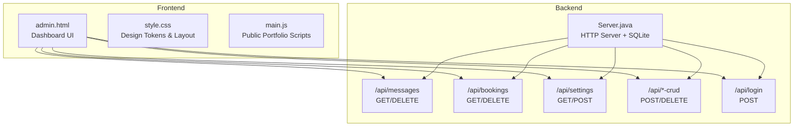

**Diagram sources**
- [admin.html](file://admin.html)
- [Server.java](file://Server.java)
- [style.css](file://style.css)

**Section sources**
- [admin.html](file://admin.html)
- [Server.java](file://Server.java)
- [style.css](file://style.css)

## Core Components
- Dashboard Layout: Responsive grid with header, stats, terminal, operations bar, and content area
- Navigation Tabs: Switch between Messages, Booked Calls, Visual Customizer, and Content Manager
- Database Terminal: Real-time audit console displaying SQL operations and status
- Statistics Cards: Live counts for messages and bookings
- Search & Filters: Text-based filtering across records
- Content Views: Grid/list rendering for messages/bookings and cards for portfolio items
- Visual Customizer: Theme presets, color pickers, typography controls, and live preview
- Content Manager: CRUD interface for projects, education, and experience timelines
- Confirmation Modals: Safe delete operations with user confirmation
- Error States: Loading, empty, and error UI states with helpful messaging

**Section sources**
- [admin.html](file://admin.html)
- [Server.java](file://Server.java)

## Architecture Overview
The admin interface communicates with a Java HTTP server that exposes REST endpoints backed by an SQLite database. Authentication is enforced via session cookies for protected routes. The dashboard renders data fetched from the backend and provides live previews for design changes.

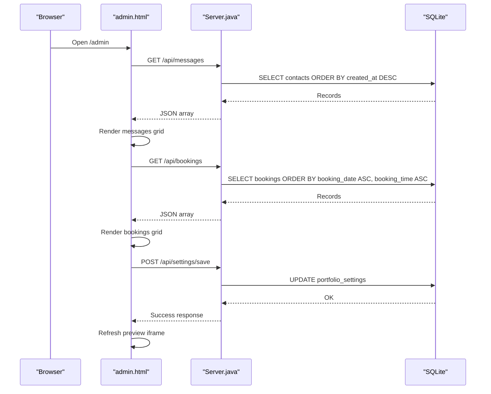

**Diagram sources**
- [admin.html](file://admin.html)
- [Server.java](file://Server.java)

## Detailed Component Analysis

### Dashboard Layout and Navigation
The admin dashboard organizes content into distinct regions:
- Header with title, subtitle, and refresh action
- Stats grid showing counts for messages, bookings, database engine, and server status
- Terminal widget for SQL audit logs
- Operations bar with view tabs, search input, and filter status
- Content area with loading, empty, and data grids

Navigation tabs enable switching between:
- Messages: Displays contact inquiries with reply and delete actions
- Booked Calls: Displays scheduled consultations with date/time badges
- Visual Customizer: Live theme editor with preview frame
- Content Manager: CRUD interface for projects, education, and experience

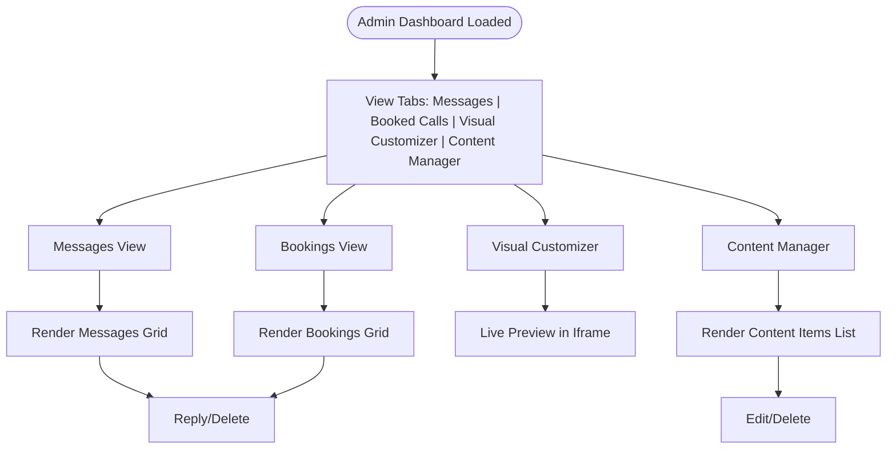

**Diagram sources**
- [admin.html](file://admin.html)

**Section sources**
- [admin.html](file://admin.html)

### Database Terminal and Audit Logging
The terminal widget logs SQL operations and server status:
- Initialization messages indicating driver connection
- Table verification and readiness notices
- Operation logs for fetches, saves, deletes
- Timestamped entries with colored status indicators

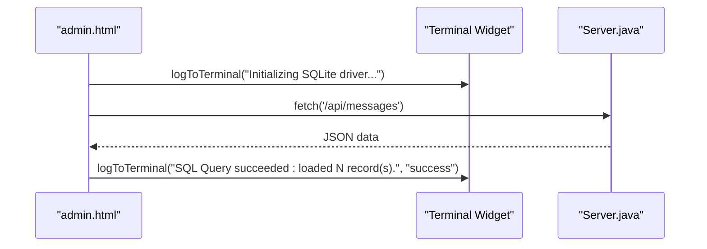

**Diagram sources**
- [admin.html](file://admin.html)
- [Server.java](file://Server.java)

**Section sources**
- [admin.html](file://admin.html)
- [Server.java](file://Server.java)

### Statistics Display
Statistics cards show:
- Inquiry Messages: Count of contact submissions
- Booked Calls: Count of scheduled consultations
- Database Engine: SQLite 3 information
- Server Status: Online indicator with pulsing dot

These values update automatically when data is refreshed.

**Section sources**
- [admin.html](file://admin.html)

### Search and Filtering
The search bar filters records in real-time:
- Input triggers filtering logic
- Filter status indicates current view
- Results update the grid without page reload

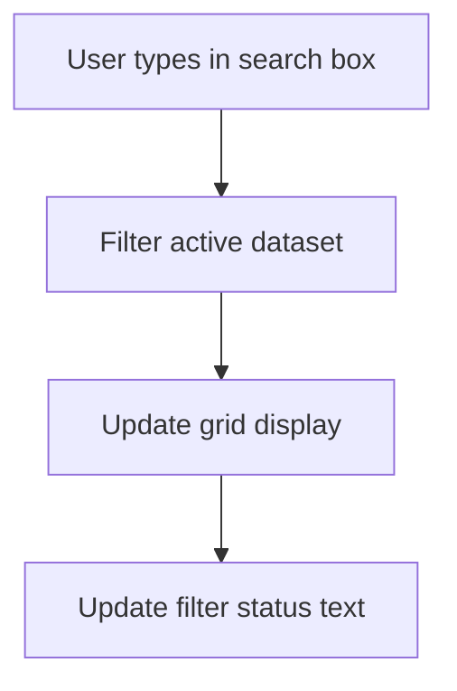

**Diagram sources**
- [admin.html](file://admin.html)

**Section sources**
- [admin.html](file://admin.html)

### View Switching Between Messages, Bookings, Design, and Content
Switching views:
- Updates active tab styling
- Resets search input
- Renders appropriate content grid or list
- Hides/shows operations bar based on view

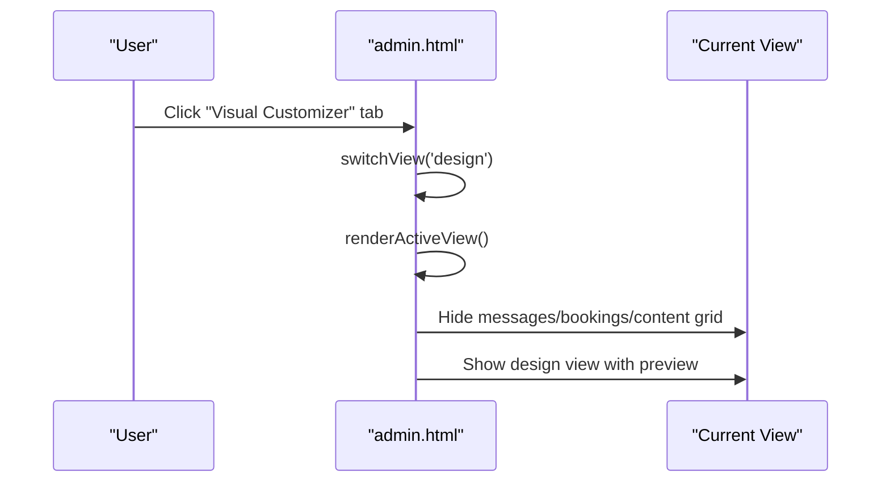

**Diagram sources**
- [admin.html](file://admin.html)

**Section sources**
- [admin.html](file://admin.html)

### Managing Portfolio Content (Projects, Education, Experience)
The Content Manager provides:
- Sub-navigation for Projects Archive, Education Timeline, Right Now Focus
- Add New Item button to open CRUD modal
- List view with edit/delete actions
- Backup/restore via JSON export/import

CRUD modal supports:
- Projects: Title, tags, GitHub/live links, description, sort order, visibility
- Education: Degree/course, institution/school board, timeline, description
- Experience: Topic/focus, institution/company, timeline, description

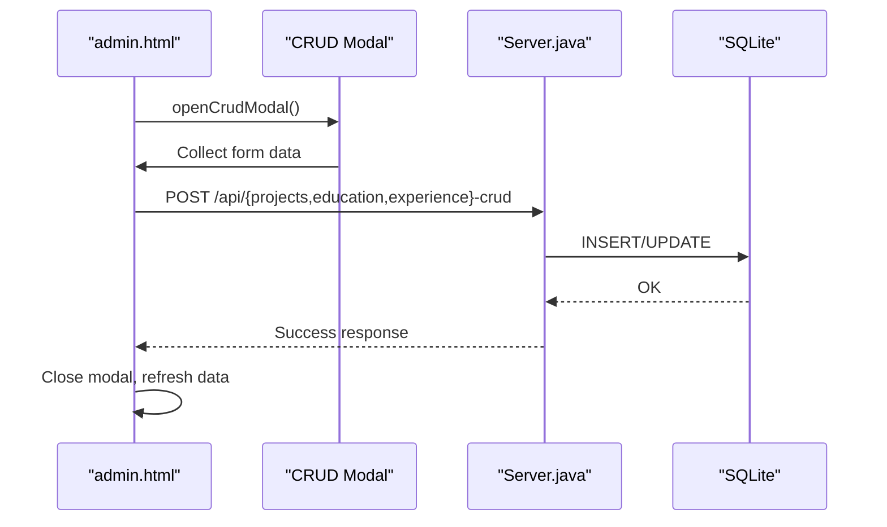

**Diagram sources**
- [admin.html](file://admin.html)
- [Server.java](file://Server.java)

**Section sources**
- [admin.html](file://admin.html)
- [Server.java](file://Server.java)

### Editing Existing Entries and Creating New Content
- Edit: Click "Edit Info" to open modal pre-populated with item data
- Create: Click "+ Add New Item" to open blank modal
- Save: Validates required fields and sends POST request
- Delete: Prompt confirmation before DELETE operation

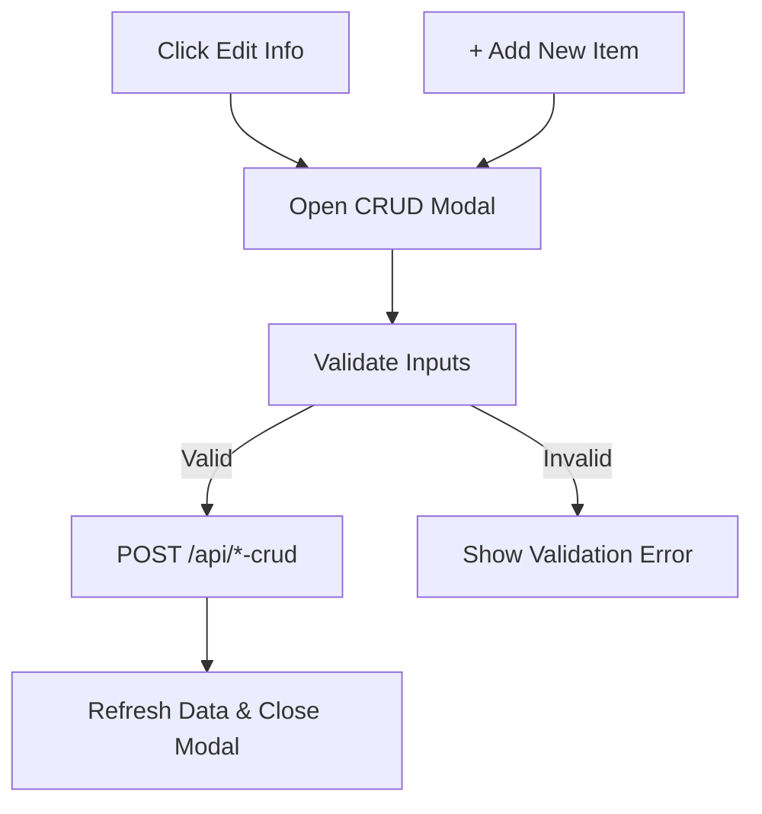

**Diagram sources**
- [admin.html](file://admin.html)

**Section sources**
- [admin.html](file://admin.html)

### Visual Customizer and Live Preview
The Visual Customizer allows:
- Theme presets selection
- Color pickers for primary, secondary, accent, background, and surface colors
- Typography controls for display and body fonts
- Animation toggle
- Live preview in iframe with device simulation (Desktop/Tablet/Mobile)

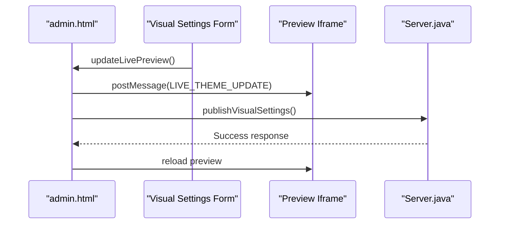

**Diagram sources**
- [admin.html](file://admin.html)
- [Server.java](file://Server.java)

**Section sources**
- [admin.html](file://admin.html)
- [Server.java](file://Server.java)

### Audit Log System and Data Validation
Audit logging:
- Terminal widget records SQL operations and errors
- Timestamped entries with colored status indicators
- Error messages surfaced to user via alerts and empty/error states

Data validation:
- Required field checks for forms
- Type casting and sanitization for API parameters
- CSRF-safe CORS headers for cross-origin requests
- Authentication enforcement for protected endpoints

**Section sources**
- [admin.html](file://admin.html)
- [Server.java](file://Server.java)

### Error Handling Mechanisms
Error handling covers:
- Network failures: Shows server connection error state with guidance
- Database errors: Logs SQL errors to terminal and displays user-friendly messages
- Empty states: Friendly placeholders when no data is available
- Confirmation modals: Prevent accidental deletions with explicit user consent

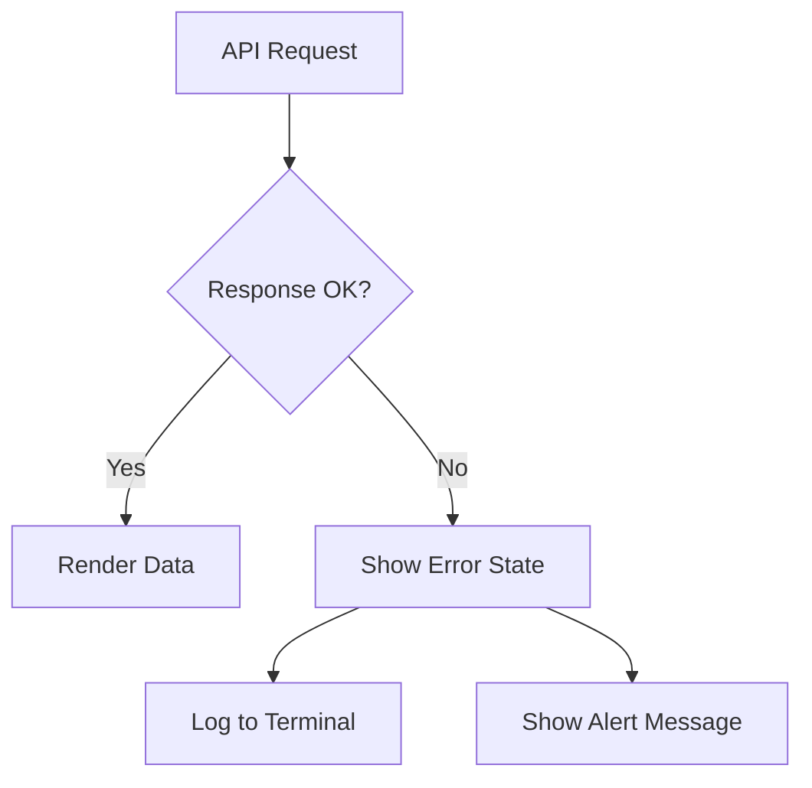

**Diagram sources**
- [admin.html](file://admin.html)

**Section sources**
- [admin.html](file://admin.html)

### User Experience Considerations
- Responsive design with mobile-first layout and flexible grids
- Consistent typography and spacing using CSS custom properties
- Interactive elements with hover effects and transitions
- Clear visual hierarchy and accessible color contrasts
- Device simulation for responsive previewing

**Section sources**
- [style.css](file://style.css)
- [admin.html](file://admin.html)

### Accessibility Features
- Semantic HTML structure and ARIA attributes
- Keyboard navigable elements
- Sufficient color contrast for text and interactive elements
- Focus management for modals and dialogs
- Screen reader friendly labels and descriptions

**Section sources**
- [style.css](file://style.css)
- [admin.html](file://admin.html)

## Dependency Analysis
The admin interface depends on:
- Server-side endpoints for data retrieval and mutations
- SQLite database for persistence
- CSS custom properties for theming
- JavaScript for UI interactions and API communication

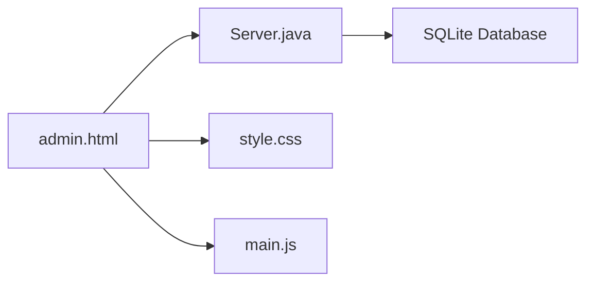

**Diagram sources**
- [admin.html](file://admin.html)
- [Server.java](file://Server.java)
- [style.css](file://style.css)
- [main.js](file://main.js)

**Section sources**
- [admin.html](file://admin.html)
- [Server.java](file://Server.java)
- [style.css](file://style.css)
- [main.js](file://main.js)

## Performance Considerations
- Minimize DOM updates by batching renders
- Debounce search input to avoid excessive filtering
- Lazy-load heavy animations and preview content
- Optimize database queries with appropriate ordering and limits
- Use CSS transforms for smooth animations

## Troubleshooting Guide
Common issues and resolutions:
- Server not responding: Verify Server.java is running and listening on configured port
- Authentication failures: Ensure session cookie is set after login
- Empty data: Check database connectivity and table creation status
- Preview not updating: Confirm postMessage bridge is established and iframe is reachable
- Backup import errors: Validate JSON format and presence of required keys

**Section sources**
- [admin.html](file://admin.html)
- [Server.java](file://Server.java)

## Conclusion
The content management interface delivers a comprehensive, secure, and user-friendly solution for managing portfolio content. Its modular design, real-time preview, and robust audit logging provide both power and safety for content creators. The responsive layout and accessibility features ensure a high-quality experience across devices and user needs.