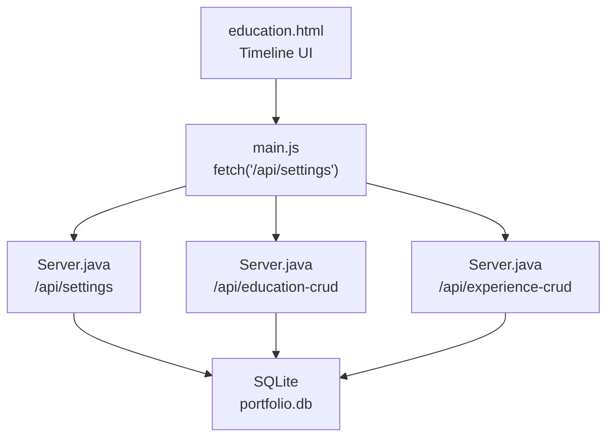
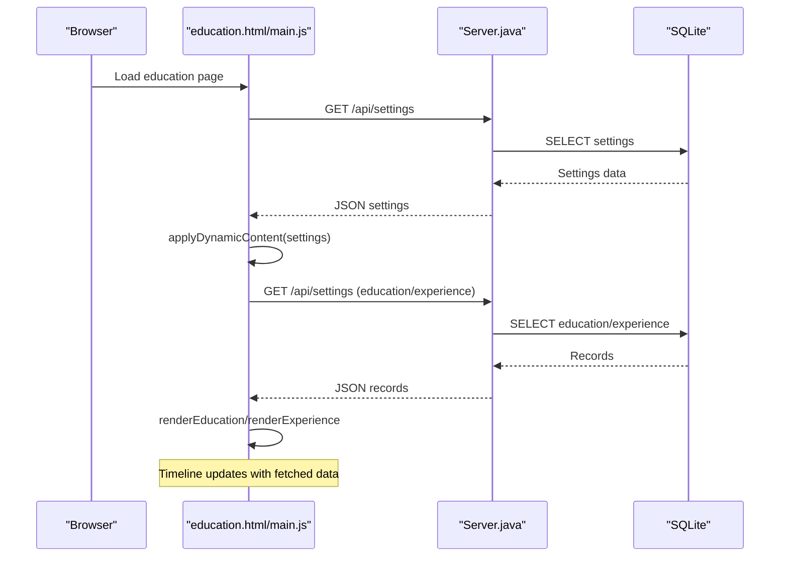
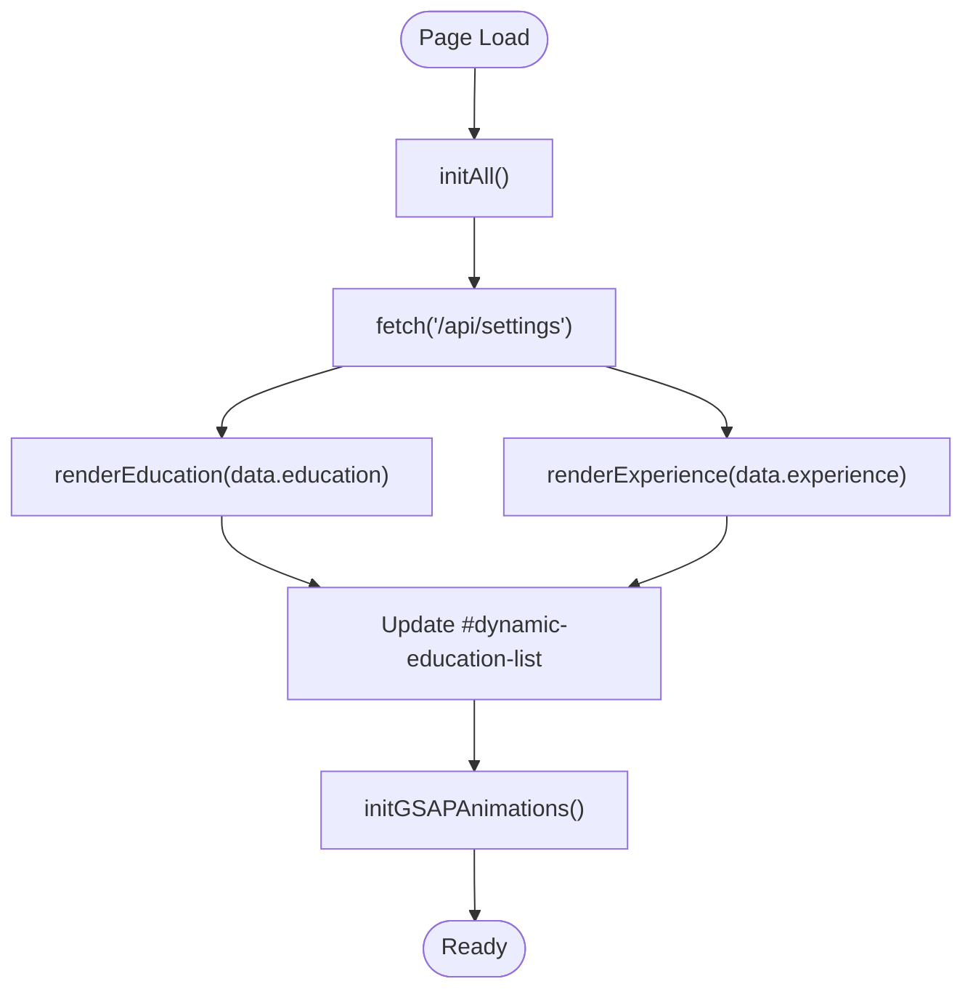
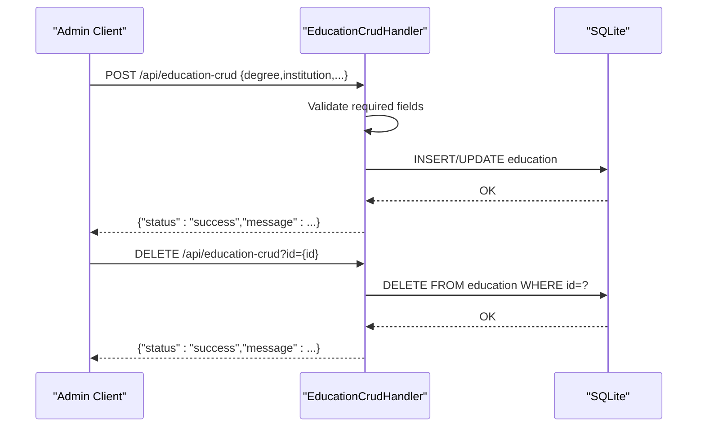
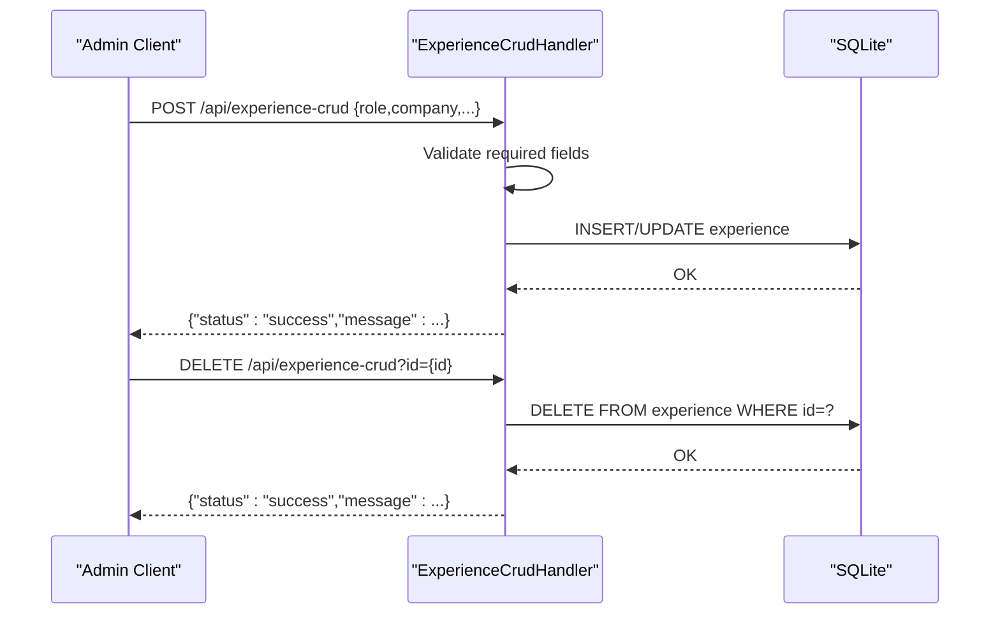
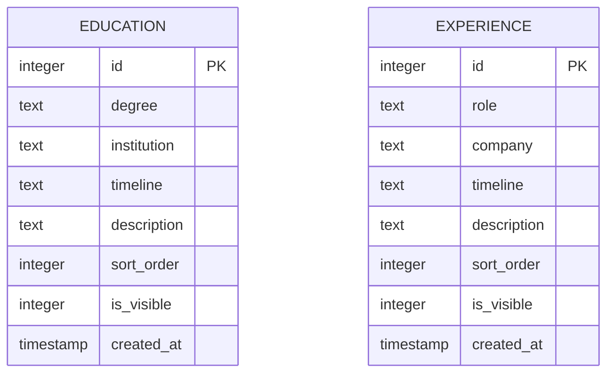
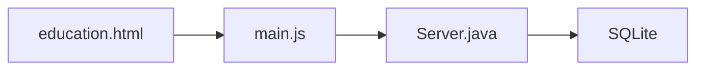

# Education & Experience Management

<cite>
**Referenced Files in This Document**
- [education.html](file://education.html)
- [main.js](file://main.js)
- [Server.java](file://Server.java)
- [style.css](file://style.css)
</cite>

## Table of Contents
1. [Introduction](#introduction)
2. [Project Structure](#project-structure)
3. [Core Components](#core-components)
4. [Architecture Overview](#architecture-overview)
5. [Detailed Component Analysis](#detailed-component-analysis)
6. [Dependency Analysis](#dependency-analysis)
7. [Performance Considerations](#performance-considerations)
8. [Troubleshooting Guide](#troubleshooting-guide)
9. [Conclusion](#conclusion)

## Introduction
This document describes the education and experience management functionality for the portfolio website. It covers how academic and professional timelines are structured, how data is entered and validated, how it is rendered on the frontend, and how administrators can manage entries through the backend API. The system supports degree programs, certifications, and work history with chronological ordering, date range management, and status indicators. It also documents duplicate prevention, data consistency checks, and integration with portfolio display sections.

## Project Structure
The education and experience management spans three primary areas:
- Frontend rendering: The education page displays a timeline-based layout with animated fill effects.
- Frontend integration: JavaScript fetches settings and renders dynamic education and experience content.
- Backend API: Java HTTP server exposes CRUD endpoints for education and experience entries with authentication.

**Diagram sources**
- [education.html:84-161](file://education.html#L84-L161)
- [main.js:76-94](file://main.js#L76-L94)
- [Server.java:56-62](file://Server.java#L56-L62)
- [Server.java:18-32](file://Server.java#L18-L32)

**Section sources**
- [education.html:84-161](file://education.html#L84-L161)
- [main.js:76-136](file://main.js#L76-L136)
- [Server.java:18-83](file://Server.java#L18-L83)

## Core Components
- Education timeline display: The education page renders a vertical timeline with period labels, institution/organization names, roles/degrees, descriptions, and tags.
- Dynamic content loading: The frontend fetches portfolio settings and renders education and experience lists dynamically.
- Backend CRUD endpoints: The server provides authenticated POST/DELETE endpoints for education and experience entries.
- Database schema: SQLite tables for education and experience include fields for degree/role, institution/company, timeline, description, sort order, visibility, and timestamps.

Key frontend elements:
- Timeline container and track with animated fill effect.
- Timeline items with left-aligned periods and organizations, and right-aligned roles and descriptions.
- Tag list for status and metadata.

Key backend elements:
- Authentication via session cookie for protected endpoints.
- Validation for required fields (degree/institution for education; role/company for experience).
- Sort order and visibility controls for ordering and display toggles.

**Section sources**
- [education.html:92-159](file://education.html#L92-L159)
- [main.js:76-94](file://main.js#L76-L94)
- [Server.java:1379-1498](file://Server.java#L1379-L1498)
- [Server.java:1500-1619](file://Server.java#L1500-L1619)

## Architecture Overview
The system follows a client-server model:
- The browser loads the education page and initializes scripts.
- The frontend requests portfolio settings and renders education/experience lists.
- Administrators interact with the backend via authenticated endpoints to create, update, or delete entries.
- The backend validates inputs, persists to SQLite, and responds with JSON.

**Diagram sources**
- [main.js:76-94](file://main.js#L76-L94)
- [Server.java:18-32](file://Server.java#L18-L32)
- [Server.java:255-292](file://Server.java#L255-L292)
- [Server.java:294-331](file://Server.java#L294-L331)

## Detailed Component Analysis

### Frontend Timeline Rendering
The education page defines a timeline layout with:
- A container with a track and animated fill.
- Multiple timeline items, each containing:
  - Left side: period and organization.
  - Right side: role/title, description, and tag list.

The frontend script fetches settings and renders education/experience lists. On successful fetch, it applies dynamic content and initializes animations.

**Diagram sources**
- [main.js:66-136](file://main.js#L66-L136)
- [education.html:92-159](file://education.html#L92-L159)

**Section sources**
- [education.html:92-159](file://education.html#L92-L159)
- [main.js:76-136](file://main.js#L76-L136)

### Backend Education CRUD API
The education endpoint supports:
- POST: Create or update an education record. Validates degree and institution presence; parses sort_order and is_visible; inserts or updates SQLite.
- DELETE: Remove an education record by ID.

**Diagram sources**
- [Server.java:1379-1498](file://Server.java#L1379-L1498)

**Section sources**
- [Server.java:1379-1498](file://Server.java#L1379-L1498)

### Backend Experience CRUD API
The experience endpoint mirrors the education API:
- POST: Create or update an experience record. Validates role and company presence; parses sort_order and is_visible; inserts or updates SQLite.
- DELETE: Remove an experience record by ID.

**Diagram sources**
- [Server.java:1500-1619](file://Server.java#L1500-L1619)

**Section sources**
- [Server.java:1500-1619](file://Server.java#L1500-L1619)

### Data Model and Schema
The backend initializes two tables with the following structure:
- education: id, degree, institution, timeline, description, sort_order, is_visible, created_at
- experience: id, role, company, timeline, description, sort_order, is_visible, created_at

Seed data is included for demonstration, showing typical entries for academic and professional experiences.

**Diagram sources**
- [Server.java:255-292](file://Server.java#L255-L292)
- [Server.java:294-331](file://Server.java#L294-L331)

**Section sources**
- [Server.java:255-292](file://Server.java#L255-L292)
- [Server.java:294-331](file://Server.java#L294-L331)

### Validation Rules and Duplicate Prevention
- Required fields:
  - Education: degree and institution must be present.
  - Experience: role and company must be present.
- Sort order and visibility:
  - sort_order is parsed as an integer; defaults to 0 if missing or invalid.
  - is_visible accepts boolean-like values or numeric; defaults to 1 if invalid.
- Duplicate prevention:
  - No explicit uniqueness constraints are defined in the schema; duplicates can occur if not prevented at the application level. To prevent duplicates, enforce uniqueness constraints (e.g., unique combinations of degree+institution or role+company+timeline) and implement pre-save checks in the API.

**Section sources**
- [Server.java:1415-1431](file://Server.java#L1415-L1431)
- [Server.java:1536-1552](file://Server.java#L1536-L1552)

### Chronological Ordering and Date Range Management
- Timeline field:
  - Both education and experience use a timeline field to represent periods (e.g., "2026 — Present", "2026 Batch", "Currently").
  - The frontend renders these as-is; no automatic sorting occurs.
- Sort order:
  - sort_order is used to control display ordering. Higher priority items should have lower sort_order values.
- Status indicators:
  - Tags (e.g., "Ongoing", "Currently") are rendered alongside entries to indicate current status.

Recommendations:
- Normalize timeline strings to ISO dates for reliable chronological sorting.
- Use separate start and end date fields for precise range management.

**Section sources**
- [education.html:100-156](file://education.html#L100-L156)
- [Server.java:1440-1442](file://Server.java#L1440-L1442)
- [Server.java:1560-1563](file://Server.java#L1560-L1563)

### Display Formatting and Print-Friendly Considerations
- Typography and layout:
  - The design uses bold headings, handwritten-style subtitles, and tag lists for metadata.
  - Timeline track and animated fill enhance visual storytelling.
- Print considerations:
  - No dedicated print stylesheet is included. For print-friendly exports, consider:
    - Adding a print media query to hide interactive elements.
    - Ensuring tag lists and timeline visuals remain readable.
    - Providing a simplified static export of the timeline for offline printing.

**Section sources**
- [education.html:86-159](file://education.html#L86-L159)
- [style.css:1-200](file://style.css#L1-L200)

### Instructions for Managing Entries

#### Adding Educational Institutions and Degrees
- Use the education CRUD endpoint to create or update entries.
- Required fields: degree and institution.
- Optional fields: timeline, description, sort_order, is_visible.
- Submit via POST with JSON payload; include id for updates.

#### Adding Professional Positions and Certifications
- Use the experience CRUD endpoint to create or update entries.
- Required fields: role and company.
- Optional fields: timeline, description, sort_order, is_visible.
- Submit via POST with JSON payload; include id for updates.

#### Deleting Entries
- Use DELETE requests with the appropriate id parameter.
- Authentication is required for both endpoints.

#### Relationship Management
- There is no explicit foreign key relationship between education and experience entries.
- To maintain consistency, avoid overlapping timeline ranges for the same person and use sort_order to reflect chronological precedence.

**Section sources**
- [Server.java:1379-1498](file://Server.java#L1379-L1498)
- [Server.java:1500-1619](file://Server.java#L1500-L1619)

### Export Capabilities and Integration with Portfolio Sections
- Current state:
  - The frontend fetches settings and renders education/experience dynamically.
  - No explicit export functionality is implemented in the provided code.
- Recommendations for export:
  - Add CSV/JSON export endpoints that return education and experience data.
  - Integrate with portfolio sections by exposing a unified timeline view that merges and sorts entries by sort_order and/or normalized date ranges.

**Section sources**
- [main.js:76-94](file://main.js#L76-L94)
- [Server.java:1379-1498](file://Server.java#L1379-L1498)
- [Server.java:1500-1619](file://Server.java#L1500-L1619)

## Dependency Analysis
The education and experience management depends on:
- Frontend: education.html for structure, main.js for fetching and rendering, style.css for presentation.
- Backend: Server.java for HTTP endpoints, SQLite for persistence.

**Diagram sources**
- [education.html:84-161](file://education.html#L84-L161)
- [main.js:76-136](file://main.js#L76-L136)
- [Server.java:18-83](file://Server.java#L18-L83)

**Section sources**
- [education.html:84-161](file://education.html#L84-L161)
- [main.js:76-136](file://main.js#L76-L136)
- [Server.java:18-83](file://Server.java#L18-L83)

## Performance Considerations
- Database queries:
  - Education and experience tables are queried on demand; consider indexing sort_order for faster retrieval.
- Frontend rendering:
  - Timeline animations rely on GSAP; ensure smooth scrolling and minimal reflows by avoiding excessive DOM mutations.
- API throughput:
  - Keep payloads minimal; only send changed fields for updates.

## Troubleshooting Guide
Common issues and resolutions:
- Authentication failures:
  - Ensure the session cookie is set and valid for protected endpoints.
- Missing required fields:
  - Verify degree/institution for education and role/company for experience are provided.
- Invalid sort_order or is_visible:
  - Confirm numeric values or boolean-like strings; otherwise defaults apply.
- Missing id in DELETE:
  - Provide a valid id query parameter for removal operations.

**Section sources**
- [Server.java:1390-1393](file://Server.java#L1390-L1393)
- [Server.java:1415-1418](file://Server.java#L1415-L1418)
- [Server.java:1536-1539](file://Server.java#L1536-L1539)
- [Server.java:1479-1482](file://Server.java#L1479-L1482)
- [Server.java:1600-1603](file://Server.java#L1600-L1603)

## Conclusion
The education and experience management system provides a robust foundation for displaying academic and professional timelines. The frontend integrates seamlessly with backend APIs to render dynamic content, while the backend enforces basic validation and persistence. Enhancements such as normalized date fields, uniqueness constraints, and export capabilities would further strengthen the system’s reliability and usability.