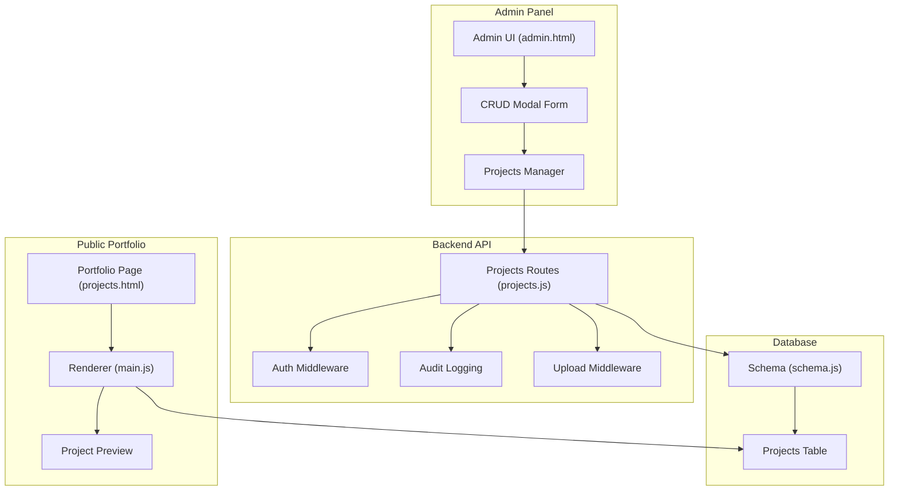
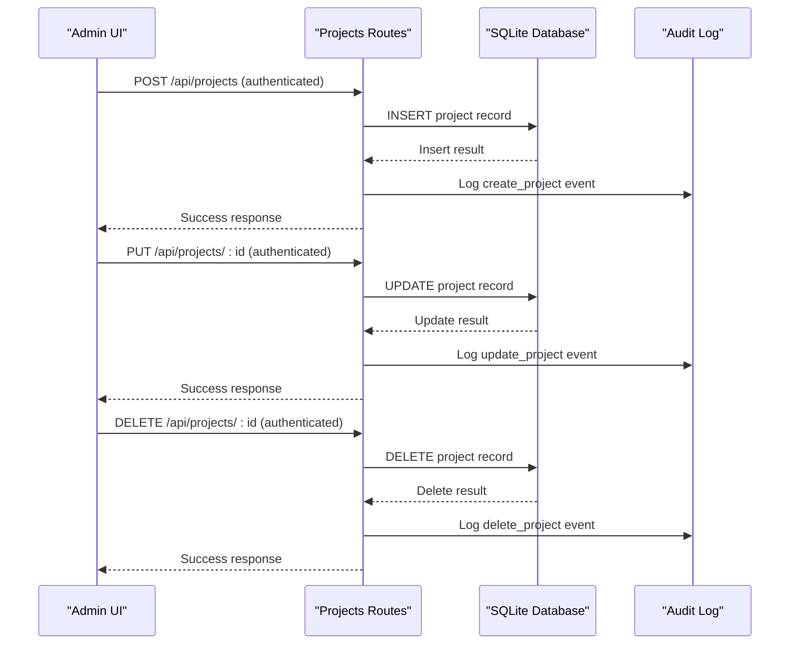
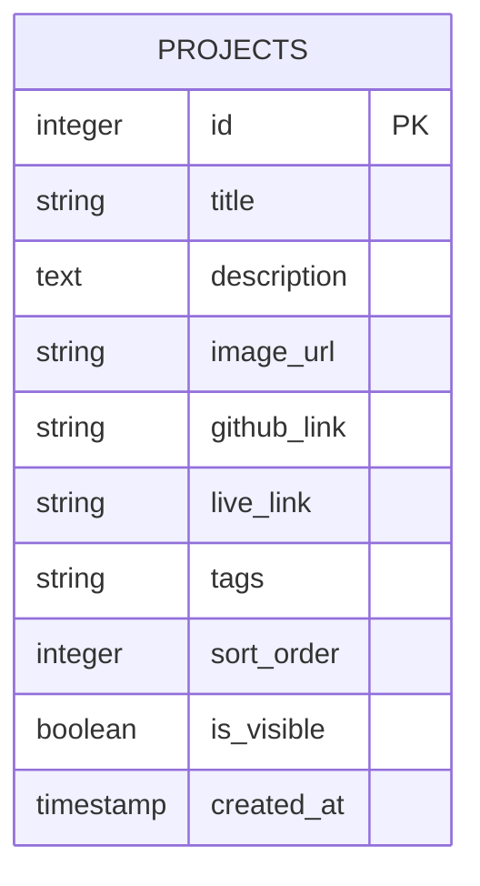
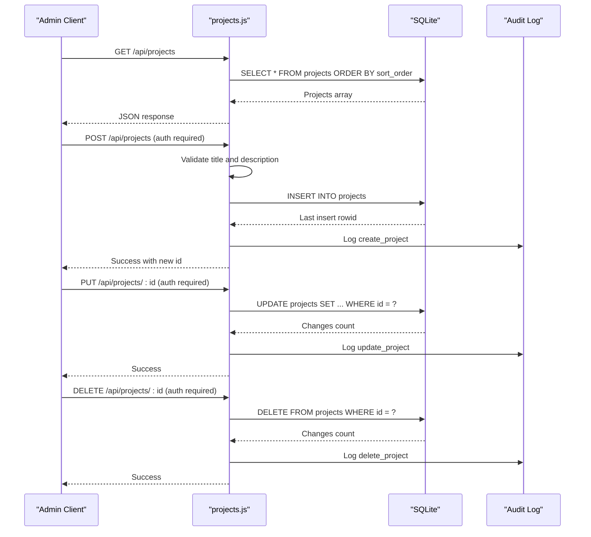
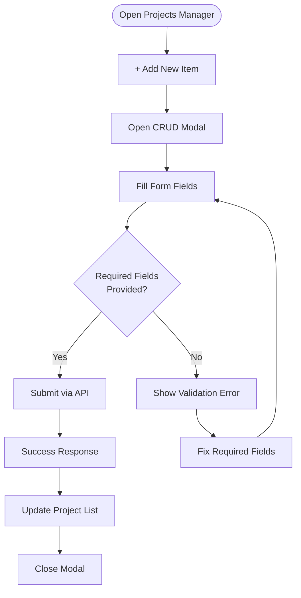
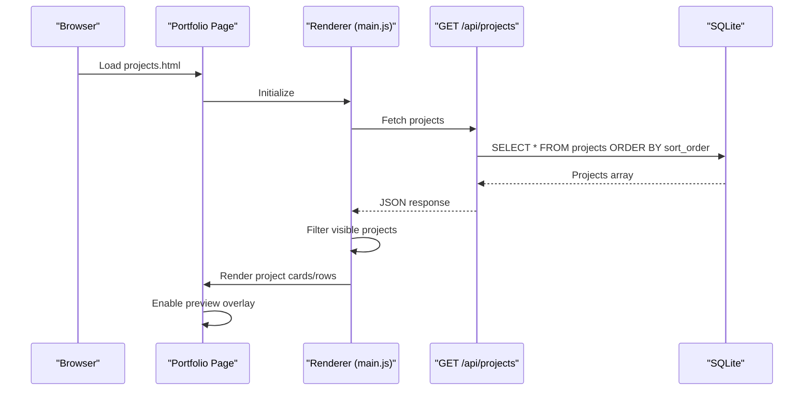
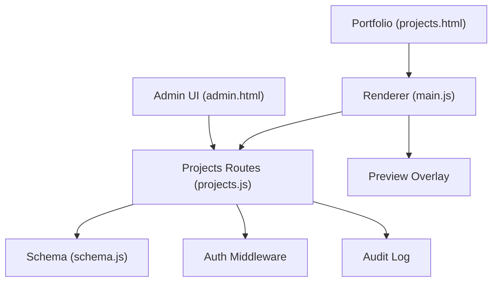

# Project Management System

<cite>
**Referenced Files in This Document**
- [projects.js](file://server/routes/projects.js)
- [schema.js](file://server/db/schema.js)
- [main.js](file://main.js)
- [projects.html](file://projects.html)
- [admin.html](file://admin.html)
- [upload.js](file://server/middleware/upload.js)
</cite>

## Table of Contents
1. [Introduction](#introduction)
2. [Project Structure](#project-structure)
3. [Core Components](#core-components)
4. [Architecture Overview](#architecture-overview)
5. [Detailed Component Analysis](#detailed-component-analysis)
6. [Dependency Analysis](#dependency-analysis)
7. [Performance Considerations](#performance-considerations)
8. [Troubleshooting Guide](#troubleshooting-guide)
9. [Conclusion](#conclusion)

## Introduction
This document provides comprehensive documentation for the project management system within the admin panel. It covers the complete lifecycle of projects: creation, listing, editing, and deletion. It also explains the underlying data model, form fields, validation rules, image upload capabilities, categorization, visibility controls, and integration with the public portfolio. Additionally, it outlines preview functionality, SEO optimization features, and operational workflows for efficient project management.

## Project Structure
The project management system spans three primary areas:
- Backend API routes for CRUD operations on projects
- Database schema defining the project data model
- Frontend integration for both the admin panel and public portfolio

**Diagram sources**
- [projects.js:1-56](file://server/routes/projects.js#L1-L56)
- [schema.js:75-86](file://server/db/schema.js#L75-L86)
- [admin.html:1059-1876](file://admin.html#L1059-L1876)
- [main.js:1270-1339](file://main.js#L1270-L1339)
- [projects.html:1-134](file://projects.html#L1-L134)

**Section sources**
- [projects.js:1-56](file://server/routes/projects.js#L1-L56)
- [schema.js:75-86](file://server/db/schema.js#L75-L86)
- [admin.html:1059-1876](file://admin.html#L1059-L1876)
- [main.js:1270-1339](file://main.js#L1270-L1339)
- [projects.html:1-134](file://projects.html#L1-L134)

## Core Components
This section outlines the essential components of the project management system, focusing on the data model, API endpoints, and frontend integration.

- **Data Model**: The `projects` table defines the structure for storing project records, including metadata, links, categorization tags, ordering, and visibility.
- **API Endpoints**: REST endpoints handle listing, creating, updating, and deleting projects with authentication and audit logging.
- **Admin UI**: A modal-driven interface allows administrators to create, edit, and delete projects with validation and immediate feedback.
- **Public Portfolio Integration**: The portfolio page renders visible projects with preview capabilities and supports SEO metadata.

Key implementation references:
- Data model definition and seeding: [schema.js:75-86](file://server/db/schema.js#L75-L86), [schema.js:229-237](file://server/db/schema.js#L229-L237)
- API routes: [projects.js:8-53](file://server/routes/projects.js#L8-L53)
- Admin UI form fields and submission: [admin.html:1078-1876](file://admin.html#L1078-L1876)
- Public portfolio rendering and preview: [main.js:1270-1339](file://main.js#L1270-L1339), [projects.html:126-129](file://projects.html#L126-L129)

**Section sources**
- [schema.js:75-86](file://server/db/schema.js#L75-L86)
- [schema.js:229-237](file://server/db/schema.js#L229-L237)
- [projects.js:8-53](file://server/routes/projects.js#L8-L53)
- [admin.html:1078-1876](file://admin.html#L1078-L1876)
- [main.js:1270-1339](file://main.js#L1270-L1339)
- [projects.html:126-129](file://projects.html#L126-L129)

## Architecture Overview
The system follows a layered architecture:
- Presentation Layer: Admin UI and public portfolio pages
- Application Layer: Express routes handling business logic
- Persistence Layer: SQLite database with a dedicated schema
- Security Layer: Authentication middleware and audit logging

**Diagram sources**
- [projects.js:15-53](file://server/routes/projects.js#L15-L53)

**Section sources**
- [projects.js:1-56](file://server/routes/projects.js#L1-L56)

## Detailed Component Analysis

### Data Model: Projects Table
The `projects` table stores all project-related information with the following fields:
- `id`: Auto-incrementing primary key
- `title`: Required field for the project name
- `description`: Required field for the project summary
- `image_url`: Optional URL for the project thumbnail
- `github_link`: Optional link to the source code repository
- `live_link`: Optional link to the deployed application
- `tags`: Optional comma-separated category tags
- `sort_order`: Integer used for ordering projects
- `is_visible`: Boolean flag controlling visibility on the portfolio
- `created_at`: Timestamp for record creation

**Diagram sources**
- [schema.js:75-86](file://server/db/schema.js#L75-L86)

**Section sources**
- [schema.js:75-86](file://server/db/schema.js#L75-L86)

### API Endpoints: CRUD Operations
The backend exposes REST endpoints for managing projects:
- GET `/api/projects`: Lists all projects ordered by `sort_order`
- POST `/api/projects`: Creates a new project with validation for required fields
- PUT `/api/projects/:id`: Updates allowed fields for a specific project
- DELETE `/api/projects/:id`: Removes a project by ID

Validation and behavior:
- Required fields: `title` and `description`
- Allowed update fields: `title`, `description`, `image_url`, `github_link`, `live_link`, `tags`, `sort_order`, `is_visible`
- Visibility defaults: `is_visible` defaults to true if not provided
- Ordering: Projects are retrieved sorted by `sort_order`

**Diagram sources**
- [projects.js:8-53](file://server/routes/projects.js#L8-L53)

**Section sources**
- [projects.js:8-53](file://server/routes/projects.js#L8-L53)

### Admin Panel: Project CRUD Interface
The admin panel provides a modal-driven interface for managing projects:
- Projects Manager tab displays a list of existing projects
- Add New Item button opens a modal form
- Modal form includes fields for title, subtitle, timeline, tags, GitHub link, live demo link, description, sort order, and visibility
- Submit saves changes via API calls and updates the UI

Form fields and behavior:
- Required fields enforced in the UI: title and description
- Optional fields: subtitle, timeline, tags, GitHub link, live link, sort order, visibility
- Validation prevents submission without required fields
- Successful operations update the project list immediately

**Diagram sources**
- [admin.html:1078-1876](file://admin.html#L1078-L1876)

**Section sources**
- [admin.html:1059-1876](file://admin.html#L1059-L1876)

### Public Portfolio Integration: Rendering and Preview
The public portfolio integrates project data and provides interactive previews:
- Portfolio page loads project data and renders visible items
- Index page uses a modern card layout; projects page uses a row-based list
- Preview overlay follows the mouse cursor and displays project titles
- SEO metadata is applied dynamically for improved discoverability

Rendering logic:
- Visible projects only: items with `is_visible` set to true
- Sorting: projects are ordered by `sort_order`
- Preview: hover effects show a floating preview with project title

**Diagram sources**
- [main.js:1270-1339](file://main.js#L1270-L1339)
- [projects.js:8-13](file://server/routes/projects.js#L8-L13)
- [projects.html:126-129](file://projects.html#L126-L129)

**Section sources**
- [main.js:1270-1339](file://main.js#L1270-L1339)
- [projects.js:8-13](file://server/routes/projects.js#L8-L13)
- [projects.html:126-129](file://projects.html#L126-L129)

### Image Upload Capabilities
The system supports file uploads for media assets:
- Upload middleware configured for disk storage with unique filenames
- Size limit: 10MB per file
- Allowed file types: images (JPG, JPEG, PNG, GIF, WebP, SVG), video (MP4), PDF, and documents (DOC, DOCX)
- Uploads directory is automatically created if missing

Integration points:
- The upload middleware can be integrated with project creation/update endpoints to manage `image_url` fields
- Media management is handled separately via the media table schema

**Section sources**
- [upload.js:1-35](file://server/middleware/upload.js#L1-L35)
- [schema.js:158-168](file://server/db/schema.js#L158-L168)

### Project Categorization, Status Management, and Priority Settings
Categorization and visibility:
- Tags: Comma-separated categories stored in the `tags` field
- Visibility: Controlled by `is_visible`; only visible projects appear on the portfolio
- Sorting: Controlled by `sort_order` for display precedence

Status and priority:
- The schema includes a `goals` table with status fields (`goal_1_status`, `goal_2_status`, `goal_3_status`)
- While not directly part of the project model, this demonstrates the pattern for status management

**Section sources**
- [schema.js:75-86](file://server/db/schema.js#L75-L86)
- [schema.js:58-66](file://server/db/schema.js#L58-L66)

### Step-by-Step Workflows

#### Adding a New Project
1. Navigate to the Projects Manager in the admin panel.
2. Click "+ Add New Item" to open the modal.
3. Fill in the required fields: title and description.
4. Optionally add tags, links, sort order, and visibility.
5. Submit the form; the system validates required fields and persists the record.
6. The new project appears in the list and is rendered on the portfolio if visible.

References:
- [admin.html:1078-1876](file://admin.html#L1078-L1876)
- [projects.js:15-29](file://server/routes/projects.js#L15-L29)

#### Editing an Existing Project
1. In the Projects Manager, locate the project row and click edit.
2. Modify fields such as title, description, tags, links, sort order, or visibility.
3. Submit the changes; the system updates only allowed fields.
4. The updated project reflects immediately in the admin list and on the portfolio.

References:
- [admin.html:1078-1876](file://admin.html#L1078-L1876)
- [projects.js:31-44](file://server/routes/projects.js#L31-L44)

#### Deleting a Project
1. In the Projects Manager, locate the project row and click delete.
2. Confirm the action in the confirmation dialog.
3. The system removes the project and logs the event.
4. The project is removed from the admin list and no longer visible on the portfolio.

References:
- [admin.html:591-606](file://admin.html#L591-L606)
- [projects.js:46-53](file://server/routes/projects.js#L46-L53)

#### Project Preview Functionality
1. On the portfolio page, hover over a project row to activate the preview overlay.
2. The overlay follows the cursor and displays the project title.
3. This enhances user experience during browsing.

References:
- [projects.html:126-129](file://projects.html#L126-L129)
- [main.js:352-393](file://main.js#L352-L393)

#### SEO Optimization Features
1. The portfolio page sets meta tags for description and Open Graph properties.
2. Dynamic SEO settings are applied from portfolio settings, including title and description.
3. These improve search engine visibility and social sharing quality.

References:
- [projects.html:8-19](file://projects.html#L8-L19)
- [main.js:1499-1510](file://main.js#L1499-L1510)

#### Integration with the Public Portfolio
1. The portfolio fetches project data from the backend API.
2. Only visible projects are rendered; sorting is applied via `sort_order`.
3. Links to live demos and GitHub repositories are included when provided.

References:
- [main.js:1270-1339](file://main.js#L1270-L1339)
- [projects.js:8-13](file://server/routes/projects.js#L8-L13)

### Bulk Operations, Sorting, and Filtering
- Sorting: Projects are ordered by `sort_order` in ascending order.
- Filtering: Only projects with `is_visible` set to true are displayed on the portfolio.
- Bulk operations: The admin panel does not expose explicit bulk actions; operations are performed individually via the modal interface.

References:
- [projects.js:11-11](file://server/routes/projects.js#L11-L11)
- [main.js:1274-1274](file://main.js#L1274-L1274)

## Dependency Analysis
The system exhibits clear separation of concerns:
- Admin UI depends on the backend API for all data operations
- Backend routes depend on the database schema and middleware for authentication and auditing
- Public portfolio depends on the backend API for dynamic content rendering

**Diagram sources**
- [admin.html:1059-1876](file://admin.html#L1059-L1876)
- [projects.js:1-56](file://server/routes/projects.js#L1-L56)
- [schema.js:75-86](file://server/db/schema.js#L75-L86)
- [main.js:1270-1339](file://main.js#L1270-L1339)
- [projects.html:126-129](file://projects.html#L126-L129)

**Section sources**
- [admin.html:1059-1876](file://admin.html#L1059-L1876)
- [projects.js:1-56](file://server/routes/projects.js#L1-L56)
- [schema.js:75-86](file://server/db/schema.js#L75-L86)
- [main.js:1270-1339](file://main.js#L1270-L1339)
- [projects.html:126-129](file://projects.html#L126-L129)

## Performance Considerations
- Database queries: The project listing endpoint performs a single query with an index-friendly sort by `sort_order`. Consider adding an index on `is_visible` if frequent filtering by visibility becomes necessary.
- Rendering: The portfolio filters visible projects client-side; ensure the dataset remains reasonably sized to maintain smooth rendering.
- Uploads: The 10MB file size limit helps prevent large payloads; consider implementing server-side resizing for images to optimize bandwidth and storage.

## Troubleshooting Guide
Common issues and resolutions:
- Missing required fields: Ensure title and description are provided when creating or updating projects.
- Not seeing projects on the portfolio: Verify `is_visible` is set to true; only visible projects are rendered.
- Sorting anomalies: Confirm `sort_order` values are integers and unique to achieve predictable ordering.
- Upload errors: Check allowed file types and size limits; ensure the uploads directory exists and is writable.

**Section sources**
- [projects.js:17-20](file://server/routes/projects.js#L17-L20)
- [upload.js:20-32](file://server/middleware/upload.js#L20-L32)

## Conclusion
The project management system provides a robust foundation for maintaining and showcasing projects. It combines a clear data model, secure API endpoints, an intuitive admin interface, and seamless integration with the public portfolio. With optional enhancements for bulk operations, advanced filtering, and optimized media handling, the system can support scalable project curation and presentation.