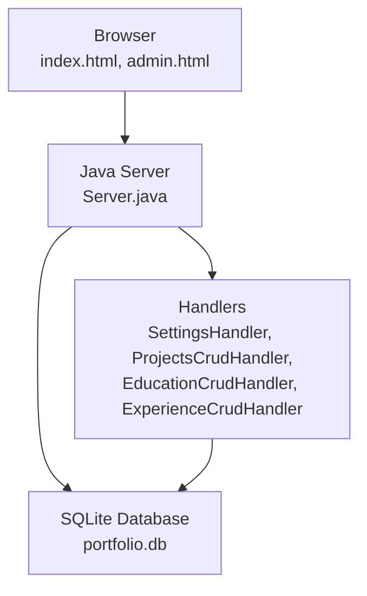
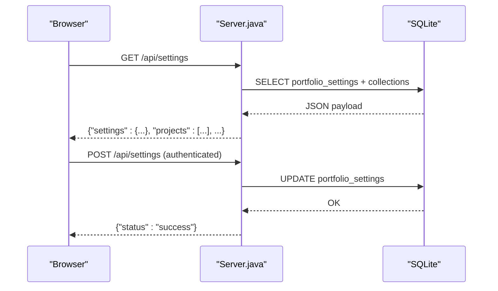
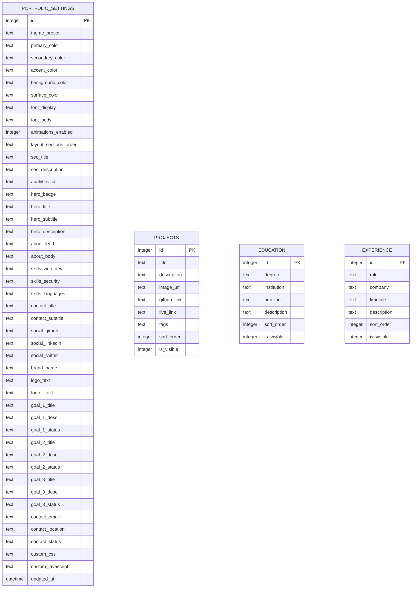
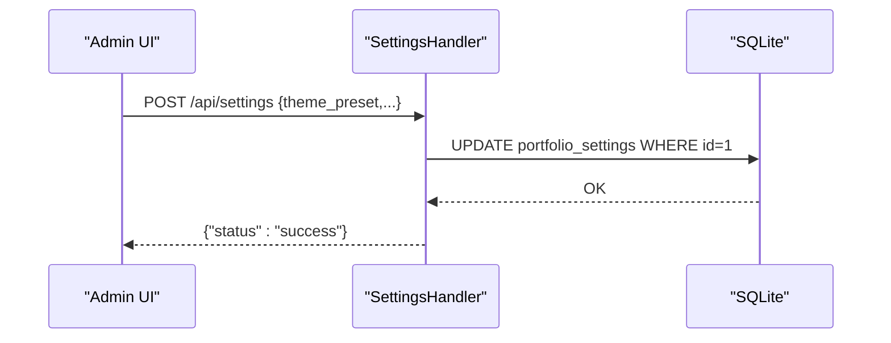
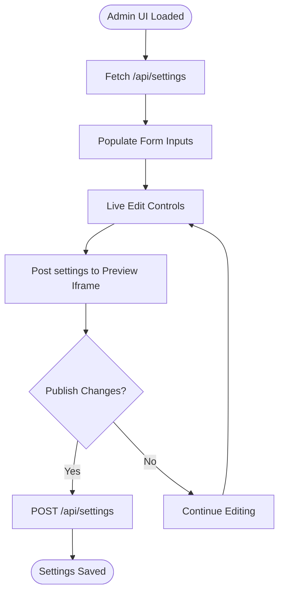
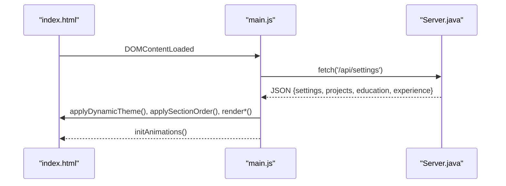
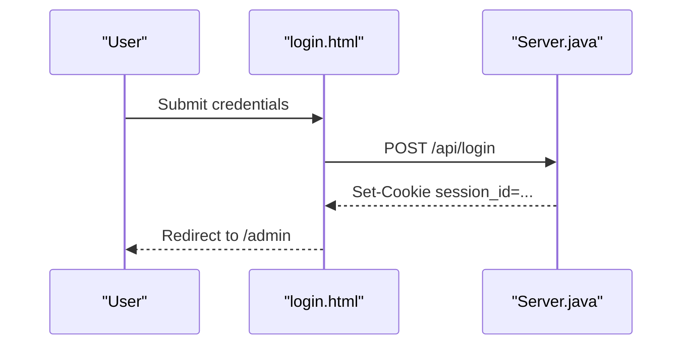
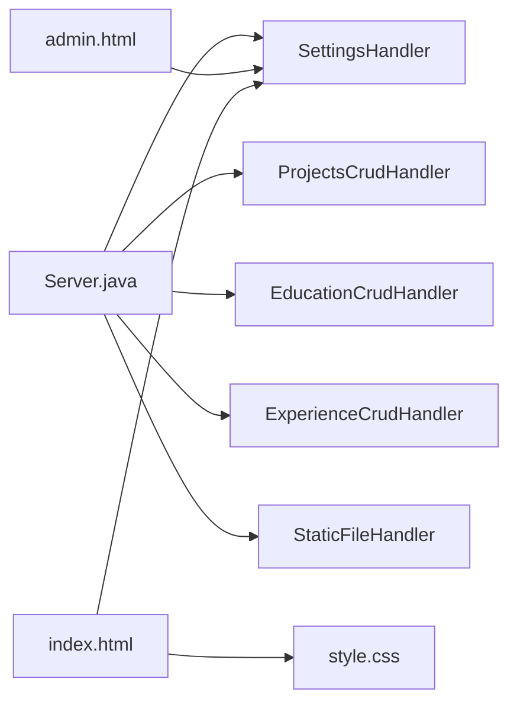

# Settings & Configuration

<cite>
**Referenced Files in This Document**
- [Server.java](file://Server.java)
- [main.js](file://main.js)
- [admin.html](file://admin.html)
- [login.html](file://login.html)
- [index.html](file://index.html)
- [style.css](file://style.css)
</cite>

## Table of Contents
1. [Introduction](#introduction)
2. [Project Structure](#project-structure)
3. [Core Components](#core-components)
4. [Architecture Overview](#architecture-overview)
5. [Detailed Component Analysis](#detailed-component-analysis)
6. [Dependency Analysis](#dependency-analysis)
7. [Performance Considerations](#performance-considerations)
8. [Troubleshooting Guide](#troubleshooting-guide)
9. [Conclusion](#conclusion)

## Introduction
This document explains the portfolio settings and configuration management system. It covers global configuration options, portfolio metadata management, system-wide preferences, the settings data model, validation rules, persistence mechanisms, and operational procedures. It also documents how admin settings relate to the public portfolio display, caching considerations, and performance implications.

## Project Structure
The portfolio is a static HTML/CSS/JS frontend served by a lightweight Java HTTP server with an embedded SQLite database. The server exposes REST endpoints for:
- Public portfolio data retrieval
- Admin authentication and protected management endpoints
- CRUD operations for projects, education, and experience
- Settings updates and persistence

**Diagram sources**
- [Server.java:34-83](file://Server.java#L34-L83)
- [Server.java:906-1250](file://Server.java#L906-L1250)

**Section sources**
- [Server.java:18-83](file://Server.java#L18-L83)

## Core Components
- Settings API: Retrieves and updates portfolio-wide configuration (themes, typography, SEO, analytics, content blocks, social links, and custom code).
- Admin Dashboard: Provides a visual interface to edit settings and manage content collections.
- Static File Serving: Serves HTML/CSS/JS and enforces authentication for admin routes.
- Database Schema: Defines portfolio_settings and content tables with default seeding and migrations.

Key responsibilities:
- SettingsHandler: Public GET for client-side rendering and POST for admin updates.
- Admin pages: Visual customization and content management with live preview.
- Frontend integration: Client fetches settings and applies them to the DOM.

**Section sources**
- [Server.java:906-1250](file://Server.java#L906-L1250)
- [admin.html:718-1038](file://admin.html#L718-L1038)
- [main.js:76-136](file://main.js#L76-L136)

## Architecture Overview
The system separates concerns between public presentation and administrative control:
- Public consumption: index.html fetches settings from /api/settings and renders dynamic content.
- Admin control: admin.html allows authorized edits; changes are persisted via /api/settings POST.
- Persistence: SQLite stores settings and content collections.

**Diagram sources**
- [Server.java:906-1250](file://Server.java#L906-L1250)
- [main.js:76-136](file://main.js#L76-L136)

## Detailed Component Analysis

### Settings Data Model
The settings table defines global configuration and content fields. It includes:
- Theme and typography controls
- Layout ordering
- SEO metadata
- Analytics identifiers
- Hero, about, skills, goals, contact, and social content
- Branding and footer text
- Custom CSS/JS injection

Persistence and defaults:
- Single-row table with id=1 enforced by a CHECK constraint.
- Default values seeded during initialization.
- Column additions are migrated for backward compatibility.

Validation and sanitization:
- SettingsHandler selectively updates non-empty values using COALESCE and NULLIF.
- Numeric booleans are normalized (true/false/1/0).
- JSON responses are escaped to avoid XSS.

**Diagram sources**
- [Server.java:122-170](file://Server.java#L122-L170)
- [Server.java:227-253](file://Server.java#L227-L253)
- [Server.java:255-291](file://Server.java#L255-L291)
- [Server.java:294-331](file://Server.java#L294-L331)

**Section sources**
- [Server.java:122-170](file://Server.java#L122-L170)
- [Server.java:906-1250](file://Server.java#L906-L1250)

### Settings API Endpoints
- GET /api/settings
  - Returns settings, projects, education, and experience as JSON.
  - Used by the client to render dynamic content.
- POST /api/settings
  - Requires authentication.
  - Updates portfolio_settings with selective field updates.
  - Supports toggling animations and reordering sections.

**Diagram sources**
- [Server.java:1062-1249](file://Server.java#L1062-L1249)

**Section sources**
- [Server.java:906-1250](file://Server.java#L906-L1250)

### Admin Dashboard and Visual Customizer
The admin interface enables:
- Theme presets and live color/font adjustments
- Layout order reconfiguration
- Branding and footer text editing
- SEO and analytics configuration
- Hero, about, skills, goals, contact, and social content editing
- Custom CSS/JS injection
- Live preview synchronized with iframe

Operational flow:
- On load, admin.html fetches settings and populates form fields.
- Real-time updates are sent to the preview iframe via postMessage.
- Publishing saves changes to the database via POST /api/settings.

**Diagram sources**
- [admin.html:1227-1254](file://admin.html#L1227-L1254)
- [admin.html:1529-1545](file://admin.html#L1529-L1545)
- [Server.java:1062-1249](file://Server.java#L1062-L1249)

**Section sources**
- [admin.html:718-1038](file://admin.html#L718-L1038)
- [admin.html:1393-1458](file://admin.html#L1393-L1458)

### Client-Side Rendering and Dynamic Content
The client loads settings and applies them to the DOM:
- Fetches /api/settings on page load.
- Applies theme variables, typography, and layout order.
- Renders projects, education, and experience lists.
- Falls back gracefully if the API is unavailable.

**Diagram sources**
- [main.js:76-136](file://main.js#L76-L136)
- [Server.java:906-1057](file://Server.java#L906-L1057)

**Section sources**
- [main.js:76-136](file://main.js#L76-L136)
- [index.html:1-187](file://index.html#L1-L187)

### Authentication and Access Control
- Admin access requires logging in via /api/login with hardcoded credentials.
- Successful login sets a session cookie; admin routes check for this cookie.
- Protected endpoints include /api/messages, /api/bookings, and content CRUD handlers.

**Diagram sources**
- [login.html:132-171](file://login.html#L132-L171)
- [Server.java:355-396](file://Server.java#L355-L396)
- [Server.java:825-832](file://Server.java#L825-L832)

**Section sources**
- [login.html:1-175](file://login.html#L1-L175)
- [Server.java:339-352](file://Server.java#L339-L352)
- [Server.java:825-832](file://Server.java#L825-L832)

### Content Management Endpoints
- Projects: CRUD for projects collection
- Education: CRUD for education timeline
- Experience: CRUD for focus/current items

Each endpoint validates required fields and supports numeric booleans for visibility toggles.

**Section sources**
- [Server.java:1252-1377](file://Server.java#L1252-L1377)
- [Server.java:1379-1497](file://Server.java#L1379-L1497)
- [Server.java:1500-1599](file://Server.java#L1500-L1599)

### Configuration Categories
- Theme and Typography: theme_preset, primary/secondary/accent/background/surface colors, font_display, font_body, animations_enabled, layout_sections_order.
- Branding and Footer: brand_name, logo_text, footer_text.
- SEO and Analytics: seo_title, seo_description, analytics_id.
- Hero Section: hero_badge, hero_title, hero_subtitle, hero_description.
- About Section: about_lead, about_body.
- Goals: goal_1_* through goal_3_*.
- Skills: skills_web_dev, skills_security, skills_languages.
- Contact and Social: contact_title, contact_subtitle, contact_email, contact_location, contact_status, social_github, social_linkedin, social_twitter.
- Custom Code: custom_css, custom_javascript.

**Section sources**
- [Server.java:122-170](file://Server.java#L122-L170)
- [admin.html:807-1012](file://admin.html#L807-L1012)

### Instructions for Updating Portfolio Details
- Use the Admin Dashboard to edit fields in the Visual Customizer or Content Manager tabs.
- For immediate changes, publish to persist to the database.
- For content items (projects, education, experience), use the CRUD modal to add/update/delete entries.

**Section sources**
- [admin.html:1040-1142](file://admin.html#L1040-L1142)
- [Server.java:1252-1377](file://Server.java#L1252-L1377)

### Managing Contact Forms and Integrations
- Public contact form posts to /api/contact; messages are stored in the contacts table.
- Admin can view and delete messages via /api/messages.
- Optional email routing uses Web3Forms when configured in main.js (access key must be set).

**Section sources**
- [Server.java:495-554](file://Server.java#L495-L554)
- [Server.java:557-644](file://Server.java#L557-L644)
- [main.js:702-800](file://main.js#L702-L800)

### External Integrations
- Google Analytics: configure analytics_id in settings.
- Email notifications: configure WEB3FORMS_KEY in main.js for Web3Forms integration.

**Section sources**
- [admin.html:828-845](file://admin.html#L828-L845)
- [main.js:6-8](file://main.js#L6-L8)

### Backup and Restore Procedures
- Download JSON backup from the Content Manager tab.
- Import JSON backup via the same tab to restore settings and content.

**Section sources**
- [admin.html:1051-1057](file://admin.html#L1051-L1057)

### Configuration Versioning and Migration Strategies
- Settings table is initialized with defaults and migrated to add missing columns.
- Single-row enforcement ensures consistent global state.

**Section sources**
- [Server.java:173-225](file://Server.java#L173-L225)

### Relationship Between Admin Settings and Public Display
- Admin changes are applied immediately in the preview iframe.
- Published settings are fetched by index.html and rendered dynamically.
- Custom CSS/JS injection allows advanced styling and behavior.

**Section sources**
- [admin.html:1529-1545](file://admin.html#L1529-L1545)
- [main.js:76-136](file://main.js#L76-L136)
- [index.html:1-187](file://index.html#L1-L187)

### Caching Considerations and Performance Implications
- Client fetches settings once per page load; consider adding cache headers or client-side caching for repeated visits.
- SQLite is embedded and suitable for small portfolios; larger deployments may require a dedicated database and caching layer.
- Animations can be toggled globally via settings to reduce CPU usage on low-powered devices.

**Section sources**
- [main.js:76-136](file://main.js#L76-L136)
- [Server.java:906-1057](file://Server.java#L906-L1057)

## Dependency Analysis
- Server.java orchestrates HTTP endpoints, database initialization, and static file serving.
- admin.html depends on SettingsHandler and content CRUD handlers for data operations.
- index.html depends on SettingsHandler for dynamic rendering.
- style.css defines design tokens consumed by both client and admin previews.

**Diagram sources**
- [Server.java:34-83](file://Server.java#L34-L83)
- [Server.java:906-1250](file://Server.java#L906-L1250)
- [admin.html:1227-1254](file://admin.html#L1227-L1254)
- [index.html:1-187](file://index.html#L1-L187)
- [style.css:1-800](file://style.css#L1-L800)

**Section sources**
- [Server.java:34-83](file://Server.java#L34-L83)
- [Server.java:906-1250](file://Server.java#L906-L1250)

## Performance Considerations
- Minimize unnecessary reflows by batching DOM updates when applying settings.
- Disable animations for devices that struggle with GPU-intensive effects.
- Keep custom CSS/JS lean to avoid blocking render.

## Troubleshooting Guide
Common issues and resolutions:
- Authentication failures: Verify credentials and session cookie presence.
- Settings not updating: Confirm POST to /api/settings and that the user is authenticated.
- Content not appearing: Check is_visible flags and sort_order values.
- Database errors: Review server logs for SQL exceptions.

**Section sources**
- [Server.java:355-396](file://Server.java#L355-L396)
- [Server.java:1062-1249](file://Server.java#L1062-L1249)
- [Server.java:1252-1377](file://Server.java#L1252-L1377)

## Conclusion
The portfolio’s settings and configuration system provides a robust foundation for managing global preferences, content, and integrations. Admins can visually customize themes, layout, and content, while the public site dynamically renders these settings. The embedded SQLite database simplifies deployment, and the modular handler architecture supports future enhancements.