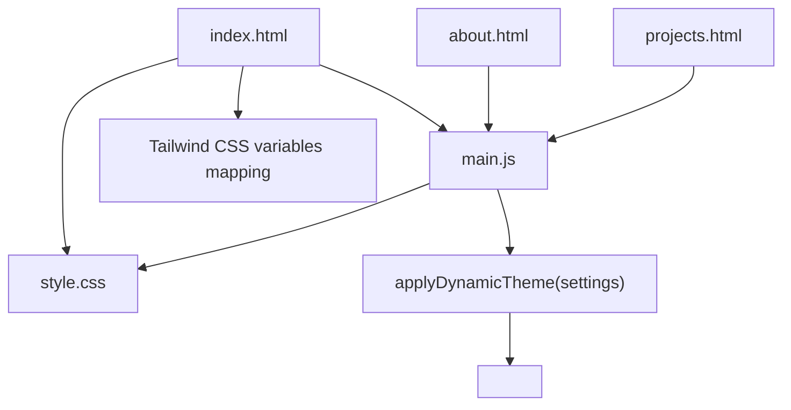
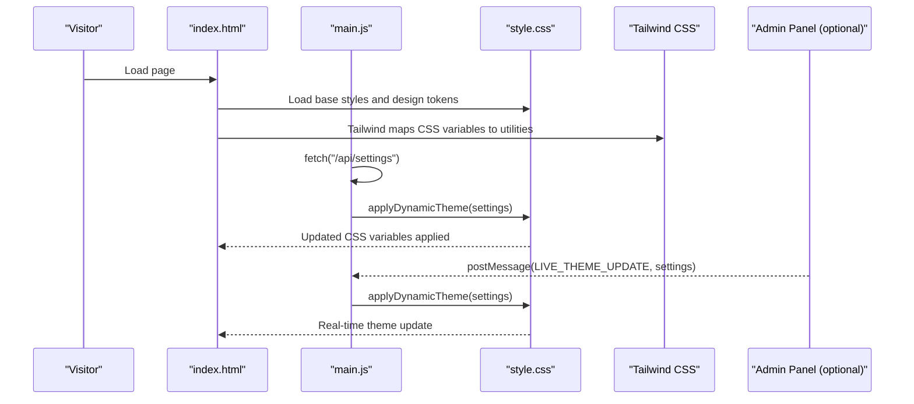
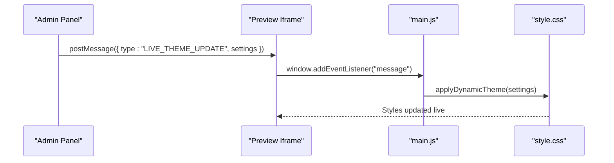
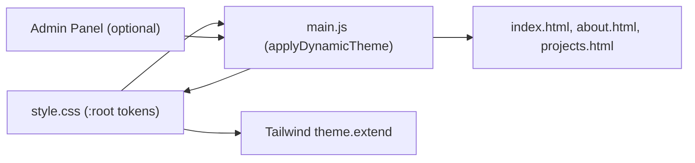

# Visual Customizer

<cite>
**Referenced Files in This Document**
- [style.css](file://style.css)
- [main.js](file://main.js)
- [index.html](file://index.html)
- [design.md](file://design.md)
- [about.html](file://about.html)
- [projects.html](file://projects.html)
</cite>

## Table of Contents
1. [Introduction](#introduction)
2. [Project Structure](#project-structure)
3. [Core Components](#core-components)
4. [Architecture Overview](#architecture-overview)
5. [Detailed Component Analysis](#detailed-component-analysis)
6. [Dependency Analysis](#dependency-analysis)
7. [Performance Considerations](#performance-considerations)
8. [Troubleshooting Guide](#troubleshooting-guide)
9. [Conclusion](#conclusion)
10. [Appendices](#appendices)

## Introduction
This document describes the visual customization system powering the portfolio. It explains the theme preset system, color palette controls, typography selection, real-time preview, live color updates, and instant theme application. It also documents the CSS variable system, custom property management, style inheritance patterns, and how the system integrates with portfolio display and responsive design. Finally, it provides guidelines for maintaining visual consistency and accessibility.

## Project Structure
The visual customization system spans a small set of files:
- A central CSS file defines design tokens and styles.
- A main JavaScript module initializes the page, loads dynamic settings, applies live theme updates, and renders dynamic content.
- The index page embeds the dynamic theme stylesheet and integrates Tailwind’s CSS variable mapping.
- Supporting pages (about, projects) demonstrate how dynamic content and styles are applied consistently.

**Diagram sources**
- [index.html:1-187](file://index.html#L1-L187)
- [style.css:1-800](file://style.css#L1-L800)
- [main.js:1102-1164](file://main.js#L1102-L1164)

**Section sources**
- [index.html:1-187](file://index.html#L1-L187)
- [style.css:1-800](file://style.css#L1-L800)
- [main.js:1102-1164](file://main.js#L1102-L1164)

## Core Components
- CSS design tokens and variables: Centralized in the root scope, enabling global theming.
- Dynamic theme application: JavaScript injects a style block with computed CSS variables and font families.
- Tailwind CSS variable mapping: Bridges CSS variables to Tailwind utilities for immediate class-based styling.
- Real-time preview and live updates: The system listens for postMessage updates and applies them instantly.
- Content rendering helpers: Functions populate dynamic sections (hero, skills, education, projects, experience) from settings.

Key responsibilities:
- Define and export design tokens via CSS variables.
- Apply theme presets and typography selections at runtime.
- Maintain responsive design and glassmorphism styling.
- Provide hooks for admin panel to send live updates.

**Section sources**
- [style.css:7-32](file://style.css#L7-L32)
- [main.js:1102-1164](file://main.js#L1102-L1164)
- [index.html:11-34](file://index.html#L11-L34)
- [main.js:1383-1391](file://main.js#L1383-L1391)

## Architecture Overview
The visual customization system is composed of:
- CSS variables in :root as the single source of truth for colors, fonts, and motion.
- A dynamic stylesheet injected by JavaScript to override defaults and apply live theme changes.
- Tailwind’s theme.extend mapping to expose CSS variables to utility classes.
- A postMessage channel for live updates from an admin panel (when present).
- Rendering helpers to populate content areas based on settings.

**Diagram sources**
- [index.html:11-34](file://index.html#L11-L34)
- [style.css:7-32](file://style.css#L7-L32)
- [main.js:76-136](file://main.js#L76-L136)
- [main.js:1102-1164](file://main.js#L1102-L1164)
- [main.js:1383-1391](file://main.js#L1383-L1391)

## Detailed Component Analysis

### CSS Variable System and Design Tokens
- Root-level tokens define background, borders, accents, text, fonts, and easing curves.
- These variables are consumed throughout the stylesheet and are the foundation for live theming.
- The dynamic theme function injects a style block that overrides these variables and cascades to derived styles (e.g., gradients, borders, typography).

Implementation highlights:
- Tokens are declared in :root and referenced via var(--token).
- Dynamic overrides target :root and several selectors to ensure consistent inheritance.
- Tailwind utilities consume these variables via theme.extend.

**Section sources**
- [style.css:7-32](file://style.css#L7-L32)
- [style.css:41-54](file://style.css#L41-L54)
- [main.js:1123-1163](file://main.js#L1123-L1163)
- [index.html:11-34](file://index.html#L11-L34)

### Dynamic Theme Application
- The applyDynamicTheme function:
  - Creates or updates a style element with ID dynamic-theme-rules.
  - Computes Google Fonts URLs from settings and injects a link element.
  - Writes CSS rules targeting :root and key selectors to apply live theme changes.
  - Uses !important sparingly to override base styles safely.

Effects:
- Instantly switches background, surfaces, accents, and typography.
- Updates gradient text and border glows.
- Ensures body and headings adopt new fonts and colors.

**Section sources**
- [main.js:1102-1164](file://main.js#L1102-L1164)

### Real-time Preview and Live Updates
- The system listens for postMessage events with type LIVE_THEME_UPDATE.
- On receipt, it applies the theme and re-applies content and section ordering.
- This enables an admin panel to preview changes without reloading the page.

**Diagram sources**
- [main.js:1383-1391](file://main.js#L1383-L1391)
- [main.js:1102-1164](file://main.js#L1102-L1164)

**Section sources**
- [main.js:1383-1391](file://main.js#L1383-L1391)
- [main.js:1102-1164](file://main.js#L1102-L1164)

### Typography Selection Options
- The dynamic theme function constructs a Google Fonts URL from display and body font settings.
- It injects a link element for the fonts and updates font-family on body and headings.
- Tailwind’s theme.extend exposes these variables to utility classes for consistent typography across components.

Practical usage:
- Choose display and body fonts from curated Google Fonts.
- The system ensures headings and body text switch seamlessly.

**Section sources**
- [main.js:1102-1164](file://main.js#L1102-L1164)
- [index.html:26-30](file://index.html#L26-L30)

### Accent Colors and Background Themes
- Accent colors are mapped to primary, secondary, and accent tokens.
- Background and surface colors are applied to :root and propagated to components.
- Gradients and border glows derive from accent tokens for cohesive visuals.

Guidelines:
- Keep accent colors distinct yet harmonious.
- Ensure sufficient contrast for text and interactive elements.
- Use accent-glow for subtle highlights.

**Section sources**
- [main.js:1123-1163](file://main.js#L1123-L1163)
- [style.css:15-17](file://style.css#L15-L17)
- [style.css:1134-1136](file://style.css#L1134-L1136)

### Preset System and Mode Switching
- The design document outlines a preset manager with curated themes (e.g., Cyberpunk Neon, Classic Dark, Glassmorphism Sleek, Minimal Light).
- The current implementation focuses on live customization via settings; preset switching would map to predefined sets of CSS variables and typography.
- Dark mode is indicated by the html class and Tailwind’s darkMode setting.

Recommendations:
- Define preset maps in the admin panel to switch groups of tokens.
- Persist preset selection alongside other settings for consistent application.

**Section sources**
- [design.md:36-47](file://design.md#L36-L47)
- [index.html:2](file://index.html#L2)
- [index.html:12-13](file://index.html#L12-L13)

### Integration with Portfolio Display
- Dynamic content rendering:
  - applyDynamicContent populates hero, about, goals, contact, and social links.
  - renderEducation, renderProjects, and renderExperience populate timeline and project grids.
- Section ordering:
  - applySectionOrder reorders sections based on a CSV list in settings.
- Responsive design:
  - CSS uses clamp and container queries for scalable typography and spacing.
  - Glassmorphism and backdrop filters adapt to theme changes.

**Section sources**
- [main.js:1393-1559](file://main.js#L1393-L1559)
- [main.js:1166-1191](file://main.js#L1166-L1191)
- [about.html:84-167](file://about.html#L84-L167)
- [projects.html:83-100](file://projects.html#L83-L100)

### Browser Compatibility and Accessibility
- CSS variables are widely supported; ensure fallbacks for older browsers if needed.
- Tailwind’s theme.extend mapping requires modern browsers; verify Tailwind builds.
- Accessibility:
  - Maintain WCAG AA contrast with dynamic color changes.
  - Provide sufficient color contrast for text, borders, and interactive elements.
  - Avoid motion-heavy effects for users sensitive to animations.

**Section sources**
- [design.md:81](file://design.md#L81)
- [style.css:1134-1136](file://style.css#L1134-L1136)

## Dependency Analysis
The visual customization system depends on:
- CSS variables for centralized theming.
- Tailwind utilities bridged via theme.extend to CSS variables.
- JavaScript to compute and inject styles and content.
- Optional postMessage channel for live updates.

**Diagram sources**
- [style.css:7-32](file://style.css#L7-L32)
- [main.js:1102-1164](file://main.js#L1102-L1164)
- [index.html:11-34](file://index.html#L11-L34)

**Section sources**
- [style.css:7-32](file://style.css#L7-L32)
- [main.js:1102-1164](file://main.js#L1102-L1164)
- [index.html:11-34](file://index.html#L11-L34)

## Performance Considerations
- Minimize reflows by batching CSS variable updates into a single style block.
- Defer heavy animations and WebGL where possible; offer toggles to disable them.
- Use CSS clamp and container queries to reduce layout thrashing on resize.
- Cache font links and avoid redundant injections when fonts do not change.

## Troubleshooting Guide
Common issues and resolutions:
- Colors not updating:
  - Ensure the dynamic-theme-rules style element exists and is appended to head.
  - Verify postMessage payload includes settings and that the listener is active.
- Fonts not applying:
  - Confirm the Google Fonts link is injected and the font-display/body families are valid.
- Contrast problems:
  - Recalculate contrast ratios for new accent colors; adjust text tokens accordingly.
- Animations causing performance issues:
  - Disable heavy WebGL or GSAP animations via settings or feature flags.

**Section sources**
- [main.js:1102-1164](file://main.js#L1102-L1164)
- [main.js:1383-1391](file://main.js#L1383-L1391)
- [design.md:77-81](file://design.md#L77-L81)

## Conclusion
The visual customization system centers on a robust CSS variable architecture, a dynamic theme application pipeline, and Tailwind’s CSS variable mapping. Together, they enable real-time previews, live color updates, and instant theme application while preserving responsive design and glassmorphism aesthetics. Extending the system with a preset manager and accessibility checks will further strengthen its usability and reliability.

## Appendices

### Customization Playbook
- Accent colors:
  - Update primary, secondary, and accent tokens; confirm gradients and border glows reflect changes.
- Background themes:
  - Change background and surface tokens; verify cards and overlays adapt.
- Typography:
  - Select display and body fonts; ensure headings and body text switch consistently.
- Presets:
  - Define preset maps and switch between them to apply coherent theme sets.
- Live preview:
  - Use postMessage to send updates from the admin panel; confirm immediate application.

**Section sources**
- [main.js:1102-1164](file://main.js#L1102-L1164)
- [design.md:36-66](file://design.md#L36-L66)