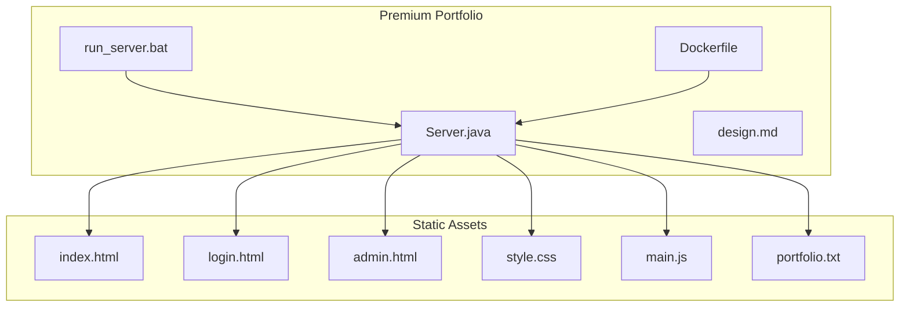
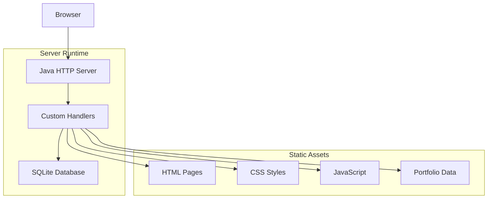
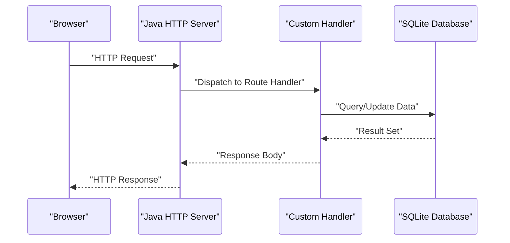
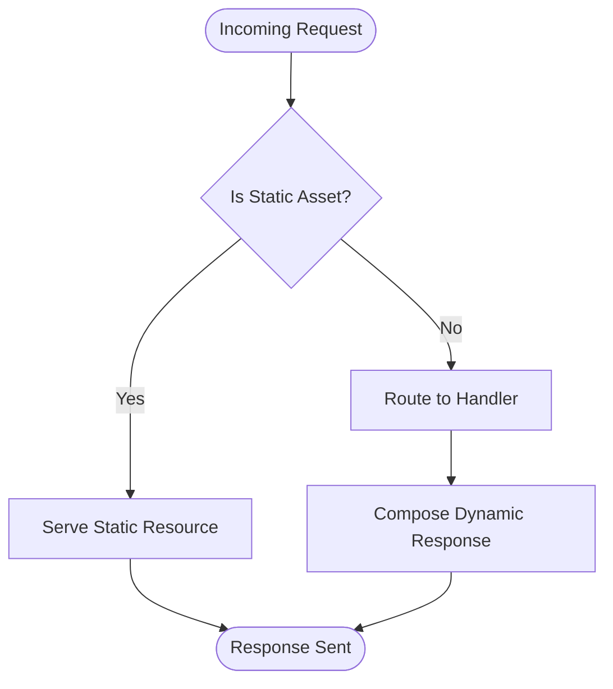
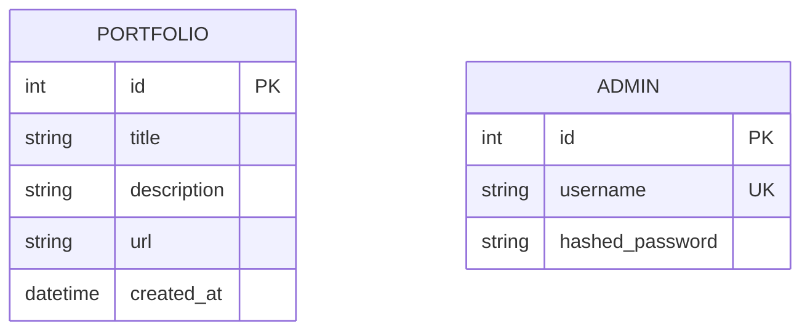
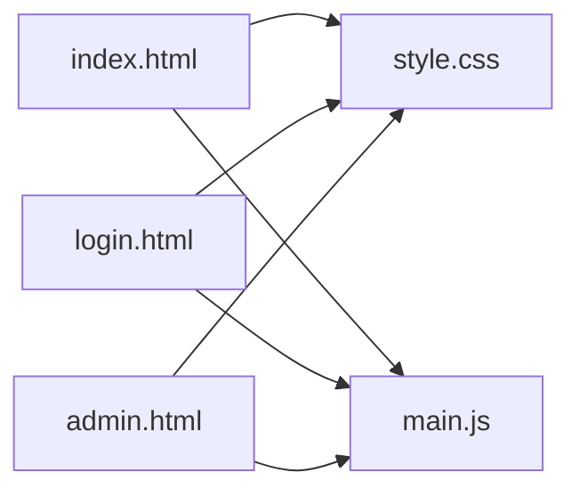
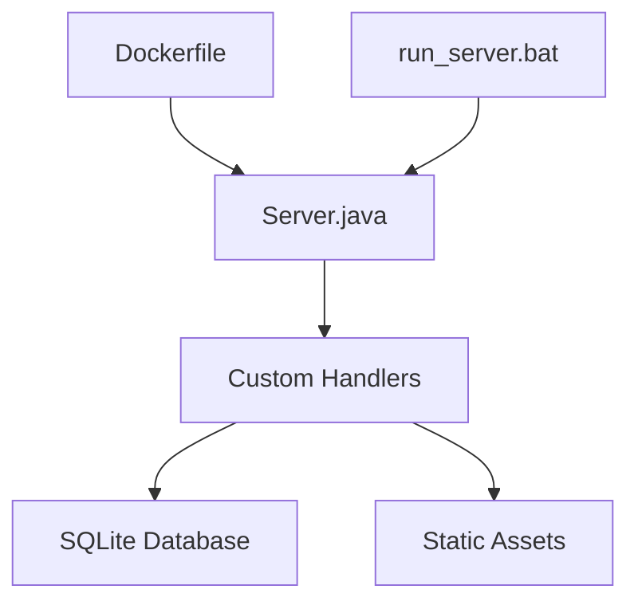
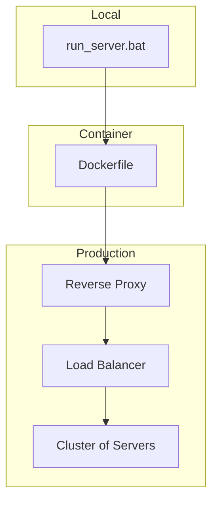

# Architecture Overview

<cite>
**Referenced Files in This Document**
- [Server.java](file://Server.java)
- [Dockerfile](file://Dockerfile)
- [design.md](file://design.md)
- [run_server.bat](file://run_server.bat)
- [index.html](file://index.html)
- [login.html](file://login.html)
- [admin.html](file://admin.html)
- [style.css](file://style.css)
- [main.js](file://main.js)
- [portfolio.txt](file://portfolio.txt)
</cite>

## Table of Contents
1. [Introduction](#introduction)
2. [Project Structure](#project-structure)
3. [Core Components](#core-components)
4. [Architecture Overview](#architecture-overview)
5. [Detailed Component Analysis](#detailed-component-analysis)
6. [Dependency Analysis](#dependency-analysis)
7. [Performance Considerations](#performance-considerations)
8. [Security and Cross-Cutting Concerns](#security-and-cross-cutting-concerns)
9. [Deployment and Infrastructure](#deployment-and-infrastructure)
10. [Technology Stack and Compatibility](#technology-stack-and-compatibility)
11. [Conclusion](#conclusion)

## Introduction
This document presents the architecture of the Premium Portfolio system. It describes the high-level design combining a Java HTTP server with custom handlers, SQLite database integration, and static frontend assets. The system emphasizes simplicity, portability, and straightforward data flow from client requests to backend processing and static asset delivery. The design leverages a built-in Java HTTP server for hosting, custom handlers for routing and response generation, and a lightweight persistence model for storing portfolio data.

## Project Structure
The repository organizes the system into:
- Backend runtime and server implementation
- Static frontend assets (HTML, CSS, JavaScript)
- Configuration and operational scripts
- Documentation and design rationale

**Diagram sources**
- [Server.java](file://Server.java)
- [Dockerfile](file://Dockerfile)
- [run_server.bat](file://run_server.bat)
- [index.html](file://index.html)
- [login.html](file://login.html)
- [admin.html](file://admin.html)
- [style.css](file://style.css)
- [main.js](file://main.js)
- [portfolio.txt](file://portfolio.txt)

**Section sources**
- [Server.java](file://Server.java)
- [Dockerfile](file://Dockerfile)
- [run_server.bat](file://run_server.bat)
- [design.md](file://design.md)

## Core Components
- Java HTTP Server: Provides the runtime host for the application, exposing HTTP endpoints and serving static resources.
- Custom Handlers: Implement routing logic and response generation tailored to the application’s needs.
- Static Frontend: HTML pages, CSS, and JavaScript deliver the user interface and client-side interactions.
- Data Persistence: Portfolio data is stored in a flat-file text resource for simplicity and portability.
- Containerization: Dockerfile defines the container image for deployment consistency.

Key implementation anchors:
- Server runtime and handler wiring are defined in the Java server entry point.
- Static assets are served alongside dynamic responses via the handler pattern.
- Operational scripts bootstrap the server locally and in containerized environments.

**Section sources**
- [Server.java](file://Server.java)
- [index.html](file://index.html)
- [login.html](file://login.html)
- [admin.html](file://admin.html)
- [style.css](file://style.css)
- [main.js](file://main.js)
- [portfolio.txt](file://portfolio.txt)
- [Dockerfile](file://Dockerfile)
- [run_server.bat](file://run_server.bat)

## Architecture Overview
The Premium Portfolio system follows a compact, monolithic architecture:
- The Java HTTP server hosts both static assets and dynamic endpoints.
- Handlers manage routing and compose responses, integrating with the static asset pipeline.
- SQLite is integrated for data persistence, enabling structured storage and retrieval of portfolio-related information.
- The frontend is delivered as static assets, with minimal client-side logic for interactivity.

**Diagram sources**
- [Server.java](file://Server.java)
- [index.html](file://index.html)
- [style.css](file://style.css)
- [main.js](file://main.js)
- [portfolio.txt](file://portfolio.txt)

## Detailed Component Analysis

### Java HTTP Server and Handler Pattern
The server initializes the HTTP server runtime and registers custom handlers for routes. Handlers encapsulate:
- Request parsing and routing decisions
- Dynamic response composition
- Integration with static asset serving
- Interaction with SQLite-backed data stores

**Diagram sources**
- [Server.java](file://Server.java)

**Section sources**
- [Server.java](file://Server.java)

### Static Asset Serving Architecture
Static assets are served directly by the server alongside dynamic responses. The handler pattern ensures:
- Correct MIME type detection for assets
- Efficient caching headers where applicable
- Path resolution for HTML, CSS, and JavaScript resources

**Diagram sources**
- [Server.java](file://Server.java)
- [index.html](file://index.html)
- [style.css](file://style.css)
- [main.js](file://main.js)

**Section sources**
- [Server.java](file://Server.java)
- [index.html](file://index.html)
- [style.css](file://style.css)
- [main.js](file://main.js)

### SQLite Integration and Data Model
SQLite is integrated for persistent storage of portfolio data. The data model centers around:
- Portfolio entries and metadata
- Administrative records for secure access
- Flat-file representation for portability

**Diagram sources**
- [portfolio.txt](file://portfolio.txt)

**Section sources**
- [portfolio.txt](file://portfolio.txt)

### Frontend Assets and Interactions
The frontend consists of:
- Landing page and navigation pages
- Styling and responsive design
- Minimal JavaScript for interactive features

**Diagram sources**
- [index.html](file://index.html)
- [login.html](file://login.html)
- [admin.html](file://admin.html)
- [style.css](file://style.css)
- [main.js](file://main.js)

**Section sources**
- [index.html](file://index.html)
- [login.html](file://login.html)
- [admin.html](file://admin.html)
- [style.css](file://style.css)
- [main.js](file://main.js)

## Dependency Analysis
The system exhibits low coupling and clear separation of concerns:
- Server runtime depends on custom handlers for routing logic
- Handlers depend on SQLite for data operations
- Handlers serve static assets directly
- Operational scripts orchestrate local and containerized deployments

**Diagram sources**
- [Server.java](file://Server.java)
- [Dockerfile](file://Dockerfile)
- [run_server.bat](file://run_server.bat)

**Section sources**
- [Server.java](file://Server.java)
- [Dockerfile](file://Dockerfile)
- [run_server.bat](file://run_server.bat)

## Performance Considerations
- Built-in HTTP server: Suitable for small-scale workloads; consider load balancing and scaling horizontally for higher traffic.
- Static asset delivery: Enable compression and caching headers to reduce bandwidth and latency.
- SQLite: Optimize queries and consider connection pooling; avoid heavy write contention.
- Handler efficiency: Minimize synchronous I/O and keep handler logic lightweight.

## Security and Cross-Cutting Concerns
- Authentication and Authorization: Implement session management or token-based authentication for administrative endpoints.
- Input Validation: Sanitize and validate all inputs to prevent injection attacks.
- CORS: Configure CORS policies for controlled cross-origin access if APIs are exposed.
- HTTPS: Terminate TLS at the edge or reverse proxy; avoid plaintext transport.
- Monitoring and Logging: Add structured logging and metrics collection for observability.
- Static Asset Integrity: Consider subresource integrity for critical scripts and styles.

## Deployment and Infrastructure
- Local Deployment: Use the provided script to launch the server locally.
- Containerized Deployment: Build and run the Docker image for consistent environments.
- Scalability: For production, deploy behind a reverse proxy and scale horizontally as needed.

**Diagram sources**
- [run_server.bat](file://run_server.bat)
- [Dockerfile](file://Dockerfile)

**Section sources**
- [run_server.bat](file://run_server.bat)
- [Dockerfile](file://Dockerfile)

## Technology Stack and Compatibility
- Java HTTP Server: Built-in HTTP server for Java runtime hosting.
- SQLite: Lightweight relational database for data persistence.
- Static Web Technologies: HTML, CSS, JavaScript for the frontend.
- Containerization: Docker for packaging and deployment.

Compatibility considerations:
- Ensure the Java runtime version supports the built-in HTTP server.
- Verify SQLite JDBC driver availability if extending database operations.
- Confirm static asset paths align with server configuration.

**Section sources**
- [Server.java](file://Server.java)
- [Dockerfile](file://Dockerfile)

## Conclusion
The Premium Portfolio system employs a pragmatic, compact architecture leveraging a Java HTTP server, custom handlers, SQLite, and static frontend assets. Its design prioritizes simplicity and portability while maintaining clear boundaries between runtime, routing, persistence, and presentation layers. For production, augment security, monitoring, and scalability controls, and consider container orchestration and horizontal scaling.