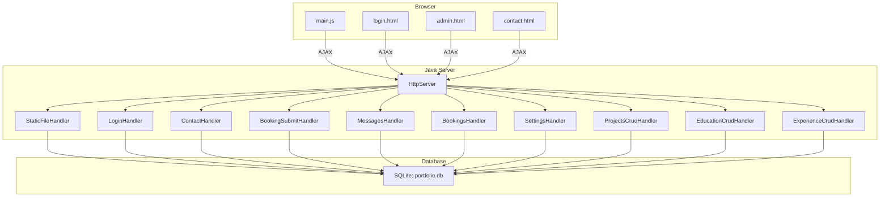
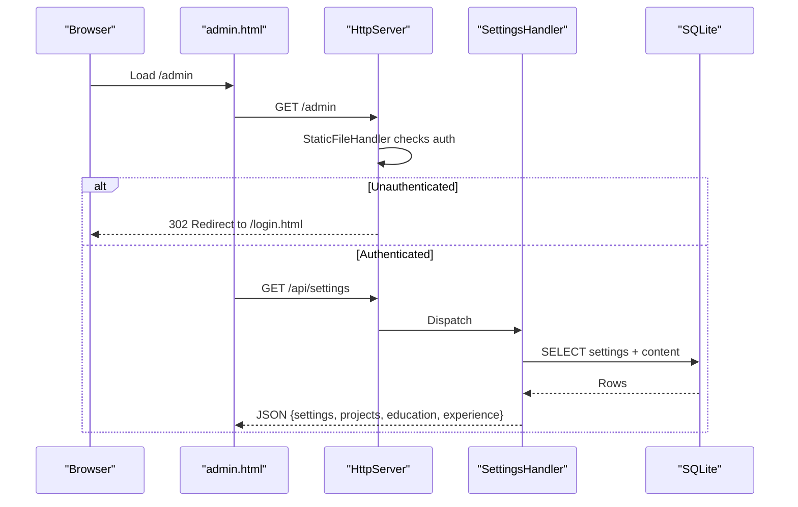
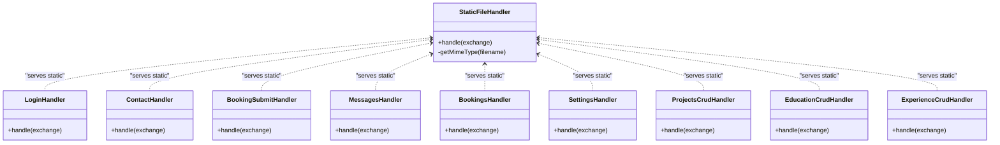
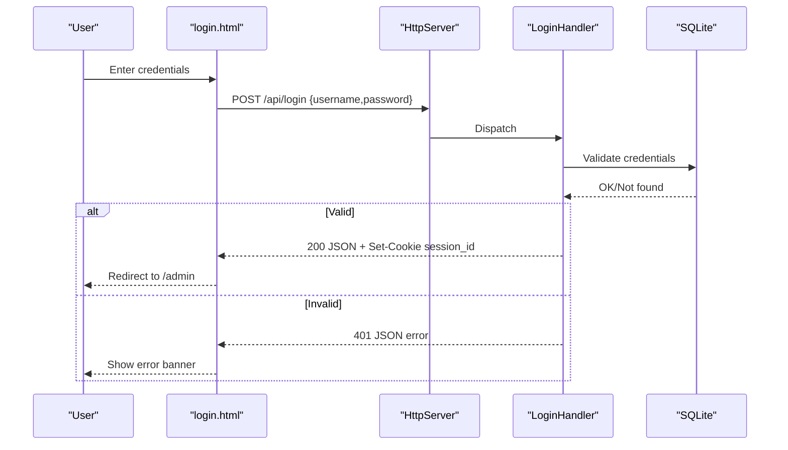
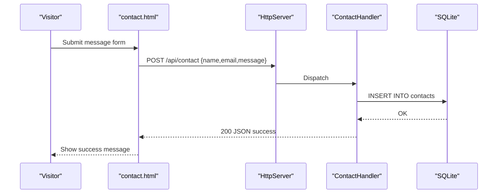
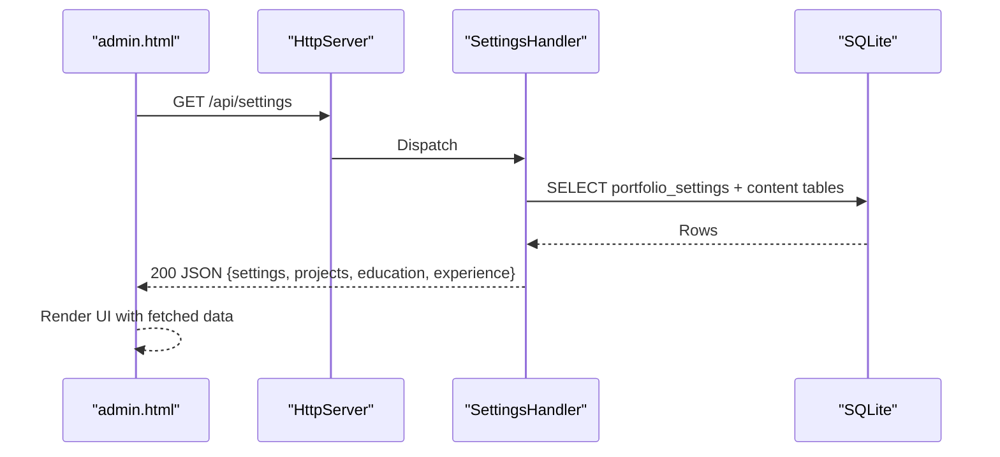
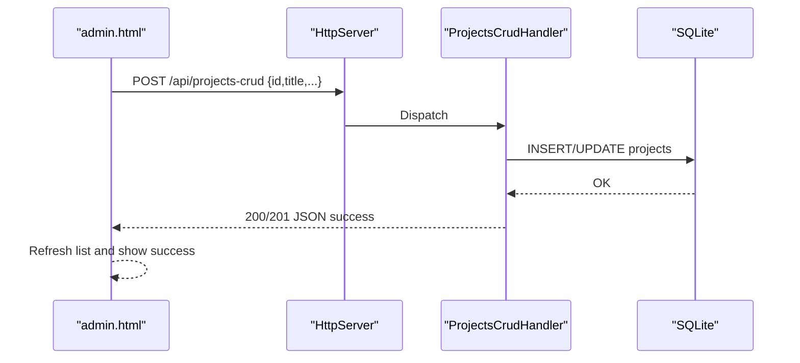
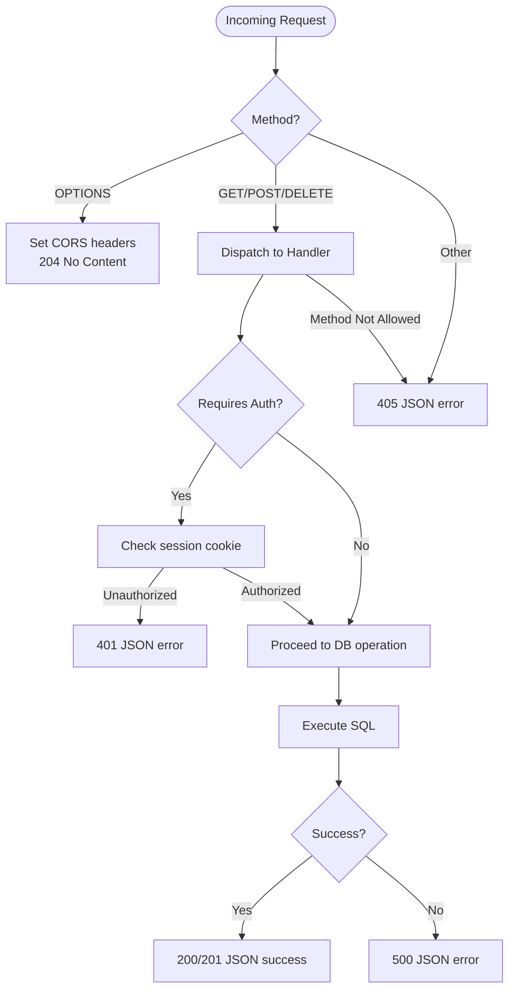
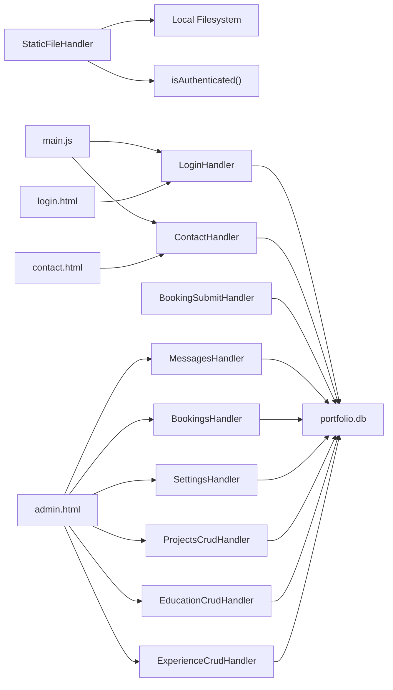

# Component Interactions

<cite>
**Referenced Files in This Document**
- [Server.java](file://Server.java)
- [main.js](file://main.js)
- [login.html](file://login.html)
- [admin.html](file://admin.html)
- [contact.html](file://contact.html)
</cite>

## Table of Contents
1. [Introduction](#introduction)
2. [Project Structure](#project-structure)
3. [Core Components](#core-components)
4. [Architecture Overview](#architecture-overview)
5. [Detailed Component Analysis](#detailed-component-analysis)
6. [Dependency Analysis](#dependency-analysis)
7. [Performance Considerations](#performance-considerations)
8. [Troubleshooting Guide](#troubleshooting-guide)
9. [Conclusion](#conclusion)

## Introduction
This document explains how the Premium Portfolio system orchestrates communication among its frontend JavaScript, Java HTTP handlers, and SQLite database. It focuses on the handler pattern, authentication via session cookies, CORS configuration, and data serialization across component boundaries. Sequence diagrams illustrate typical user workflows such as contact form submission, admin login, and content management operations.

## Project Structure
The system comprises:
- A Java HTTP server exposing REST endpoints and serving static assets
- Frontend pages (contact, login, admin) using AJAX to communicate with the server
- A SQLite database storing contacts, bookings, portfolio settings, and content items

**Diagram sources**
- [Server.java:34-83](file://Server.java#L34-L83)
- [main.js:76-136](file://main.js#L76-L136)
- [login.html:146-171](file://login.html#L146-L171)
- [admin.html:1188-1254](file://admin.html#L1188-L1254)
- [contact.html:143-150](file://contact.html#L143-L150)

**Section sources**
- [Server.java:34-83](file://Server.java#L34-L83)

## Core Components
- StaticFileHandler: Serves HTML/CSS/JS and enforces authentication for admin routes
- LoginHandler: Validates credentials and sets a session cookie
- ContactHandler: Inserts contact messages into SQLite
- BookingSubmitHandler: Inserts booking requests into SQLite
- MessagesHandler: Lists and deletes contact messages (admin protected)
- BookingsHandler: Lists and deletes booking requests (admin protected)
- SettingsHandler: Reads and updates portfolio settings and content lists
- CRUD Handlers: Manage projects, education, and experience content (admin protected)

Key behaviors:
- CORS: All API handlers set permissive CORS headers and handle OPTIONS preflight
- Authentication: Session cookie presence validated centrally; admin routes redirect unauthenticated users
- Serialization: JSON bodies parsed and escaped; responses formatted consistently

**Section sources**
- [Server.java:398-411](file://Server.java#L398-L411)
- [Server.java:339-352](file://Server.java#L339-L352)
- [Server.java:804-904](file://Server.java#L804-L904)
- [Server.java:354-396](file://Server.java#L354-L396)
- [Server.java:494-554](file://Server.java#L494-L554)
- [Server.java:738-800](file://Server.java#L738-L800)
- [Server.java:556-644](file://Server.java#L556-L644)
- [Server.java:646-736](file://Server.java#L646-L736)
- [Server.java:906-1250](file://Server.java#L906-L1250)
- [Server.java:1252-1377](file://Server.java#L1252-L1377)
- [Server.java:1379-1497](file://Server.java#L1379-L1497)
- [Server.java:1500-1599](file://Server.java#L1500-L1599)

## Architecture Overview
The server initializes SQLite, registers HTTP contexts for handlers, and streams static assets. Frontend pages use fetch to call API endpoints. Responses are JSON with consistent status and message fields. Admin pages rely on session cookies for access control.

**Diagram sources**
- [Server.java:826-832](file://Server.java#L826-L832)
- [Server.java:906-1058](file://Server.java#L906-L1058)
- [admin.html:1188-1254](file://admin.html#L1188-L1254)

**Section sources**
- [Server.java:826-832](file://Server.java#L826-L832)
- [Server.java:906-1058](file://Server.java#L906-L1058)
- [admin.html:1188-1254](file://admin.html#L1188-L1254)

## Detailed Component Analysis

### Handler Pattern and Routing
- StaticFileHandler: Rewrites URLs, enforces canonical paths, prevents directory traversal, and serves static assets
- LoginHandler: Accepts POST with JSON body, validates hardcoded credentials, sets HttpOnly session cookie, and responds with JSON
- ContactHandler: Accepts POST with JSON or form-encoded body, inserts into contacts, and responds with JSON
- BookingSubmitHandler: Accepts POST with JSON or form-encoded body, inserts into bookings, and responds with JSON
- MessagesHandler: GET returns all contacts; DELETE removes by id; requires authentication
- BookingsHandler: GET returns all bookings; DELETE removes by id; requires authentication
- SettingsHandler: GET returns combined settings and content; POST updates settings (requires authentication)
- CRUD Handlers: POST creates/updates items; DELETE removes by id; require authentication

**Diagram sources**
- [Server.java:804-904](file://Server.java#L804-L904)
- [Server.java:354-396](file://Server.java#L354-L396)
- [Server.java:494-554](file://Server.java#L494-L554)
- [Server.java:738-800](file://Server.java#L738-L800)
- [Server.java:556-644](file://Server.java#L556-L644)
- [Server.java:646-736](file://Server.java#L646-L736)
- [Server.java:906-1250](file://Server.java#L906-L1250)
- [Server.java:1252-1377](file://Server.java#L1252-L1377)
- [Server.java:1379-1497](file://Server.java#L1379-L1497)
- [Server.java:1500-1599](file://Server.java#L1500-L1599)

**Section sources**
- [Server.java:804-904](file://Server.java#L804-L904)
- [Server.java:354-396](file://Server.java#L354-L396)
- [Server.java:494-554](file://Server.java#L494-L554)
- [Server.java:738-800](file://Server.java#L738-L800)
- [Server.java:556-644](file://Server.java#L556-L644)
- [Server.java:646-736](file://Server.java#L646-L736)
- [Server.java:906-1250](file://Server.java#L906-L1250)
- [Server.java:1252-1377](file://Server.java#L1252-L1377)
- [Server.java:1379-1497](file://Server.java#L1379-L1497)
- [Server.java:1500-1599](file://Server.java#L1500-L1599)

### Authentication Flow (Admin Login)
- Frontend posts credentials to /api/login
- Server validates and sets a session cookie
- Subsequent admin requests include the cookie and are accepted

**Diagram sources**
- [login.html:146-171](file://login.html#L146-L171)
- [Server.java:354-396](file://Server.java#L354-L396)

**Section sources**
- [login.html:146-171](file://login.html#L146-L171)
- [Server.java:354-396](file://Server.java#L354-L396)

### Contact Form Submission Workflow
- Frontend gathers form data and sends JSON to /api/contact
- Server parses body, validates required fields, inserts into contacts, and responds

**Diagram sources**
- [contact.html:143-150](file://contact.html#L143-L150)
- [Server.java:494-554](file://Server.java#L494-L554)

**Section sources**
- [contact.html:143-150](file://contact.html#L143-L150)
- [Server.java:494-554](file://Server.java#L494-L554)

### Admin Dashboard Data Retrieval
- Admin page fetches settings and content lists from /api/settings
- Renders stats, messages, bookings, and manages content via CRUD endpoints

**Diagram sources**
- [admin.html:1188-1254](file://admin.html#L1188-L1254)
- [Server.java:906-1058](file://Server.java#L906-L1058)

**Section sources**
- [admin.html:1188-1254](file://admin.html#L1188-L1254)
- [Server.java:906-1058](file://Server.java#L906-L1058)

### Content Management Operations (CRUD)
- Admin UI posts updates to /api/projects-crud, /api/education-crud, /api/experience-crud
- Server validates inputs, performs INSERT/UPDATE/DELETE, and responds with JSON

**Diagram sources**
- [admin.html:1078-1138](file://admin.html#L1078-L1138)
- [Server.java:1252-1377](file://Server.java#L1252-L1377)

**Section sources**
- [admin.html:1078-1138](file://admin.html#L1078-L1138)
- [Server.java:1252-1377](file://Server.java#L1252-L1377)

### Request-Response Flow: CORS and Error Propagation
- All API handlers set CORS headers and handle OPTIONS preflight
- Errors are returned as JSON with status and message fields
- StaticFileHandler returns appropriate HTTP status codes (302, 403, 404)

**Diagram sources**
- [Server.java:398-411](file://Server.java#L398-L411)
- [Server.java:339-352](file://Server.java#L339-L352)
- [Server.java:556-644](file://Server.java#L556-L644)
- [Server.java:646-736](file://Server.java#L646-L736)
- [Server.java:906-1250](file://Server.java#L906-L1250)
- [Server.java:1252-1377](file://Server.java#L1252-L1377)
- [Server.java:1379-1497](file://Server.java#L1379-L1497)
- [Server.java:1500-1599](file://Server.java#L1500-L1599)
- [Server.java:804-904](file://Server.java#L804-L904)

**Section sources**
- [Server.java:398-411](file://Server.java#L398-L411)
- [Server.java:339-352](file://Server.java#L339-L352)
- [Server.java:556-644](file://Server.java#L556-L644)
- [Server.java:646-736](file://Server.java#L646-L736)
- [Server.java:906-1250](file://Server.java#L906-L1250)
- [Server.java:1252-1377](file://Server.java#L1252-L1377)
- [Server.java:1379-1497](file://Server.java#L1379-L1497)
- [Server.java:1500-1599](file://Server.java#L1500-L1599)
- [Server.java:804-904](file://Server.java#L804-L904)

## Dependency Analysis
- StaticFileHandler depends on filesystem and authentication gating for admin routes
- All API handlers depend on SQLite connectivity and share common utilities for CORS, response formatting, and JSON parsing/escaping
- Frontend pages depend on handlers for data and actions

**Diagram sources**
- [Server.java:804-904](file://Server.java#L804-L904)
- [Server.java:339-352](file://Server.java#L339-L352)
- [Server.java:354-396](file://Server.java#L354-L396)
- [Server.java:494-554](file://Server.java#L494-L554)
- [Server.java:738-800](file://Server.java#L738-L800)
- [Server.java:556-644](file://Server.java#L556-L644)
- [Server.java:646-736](file://Server.java#L646-L736)
- [Server.java:906-1250](file://Server.java#L906-L1250)
- [Server.java:1252-1377](file://Server.java#L1252-L1377)
- [Server.java:1379-1497](file://Server.java#L1379-L1497)
- [Server.java:1500-1599](file://Server.java#L1500-L1599)
- [main.js:76-136](file://main.js#L76-L136)
- [login.html:146-171](file://login.html#L146-L171)
- [contact.html:143-150](file://contact.html#L143-L150)
- [admin.html:1188-1254](file://admin.html#L1188-L1254)

**Section sources**
- [Server.java:804-904](file://Server.java#L804-L904)
- [Server.java:339-352](file://Server.java#L339-L352)
- [Server.java:354-396](file://Server.java#L354-L396)
- [Server.java:494-554](file://Server.java#L494-L554)
- [Server.java:738-800](file://Server.java#L738-L800)
- [Server.java:556-644](file://Server.java#L556-L644)
- [Server.java:646-736](file://Server.java#L646-L736)
- [Server.java:906-1250](file://Server.java#L906-L1250)
- [Server.java:1252-1377](file://Server.java#L1252-L1377)
- [Server.java:1379-1497](file://Server.java#L1379-L1497)
- [Server.java:1500-1599](file://Server.java#L1500-L1599)
- [main.js:76-136](file://main.js#L76-L136)
- [login.html:146-171](file://login.html#L146-L171)
- [contact.html:143-150](file://contact.html#L143-L150)
- [admin.html:1188-1254](file://admin.html#L1188-L1254)

## Performance Considerations
- Database operations use prepared statements to avoid SQL injection and improve performance
- JSON serialization uses manual concatenation with escaping; consider a lightweight JSON library for larger payloads
- Static asset serving streams files directly from disk; ensure adequate buffering for large assets
- CORS headers are set per-request; caching headers could reduce overhead for static assets

## Troubleshooting Guide
Common issues and resolutions:
- 401 Unauthorized on admin endpoints: Verify session cookie presence and correctness
- 403 Forbidden on static routes: Ensure paths do not attempt directory traversal
- 404 Not Found: Confirm file existence and canonical path resolution
- 405 Method Not Allowed: Check HTTP method used for the endpoint
- 500 Internal Server Error: Inspect server logs for SQL exceptions and malformed JSON

Operational tips:
- Use browser dev tools to inspect network requests and response bodies
- Validate JSON payloads and required fields before posting
- Monitor server logs for SQL errors during CRUD operations

**Section sources**
- [Server.java:826-832](file://Server.java#L826-L832)
- [Server.java:860-878](file://Server.java#L860-L878)
- [Server.java:556-644](file://Server.java#L556-L644)
- [Server.java:646-736](file://Server.java#L646-L736)
- [Server.java:906-1250](file://Server.java#L906-L1250)
- [Server.java:1252-1377](file://Server.java#L1252-L1377)
- [Server.java:1379-1497](file://Server.java#L1379-L1497)
- [Server.java:1500-1599](file://Server.java#L1500-L1599)

## Conclusion
The Premium Portfolio system employs a straightforward handler-based architecture with clear separation between static asset serving, authentication, and API operations. Session cookies enforce admin access, CORS enables cross-origin requests, and consistent JSON responses simplify frontend integration. The design supports incremental enhancements such as structured logging, input validation libraries, and improved JSON serialization.