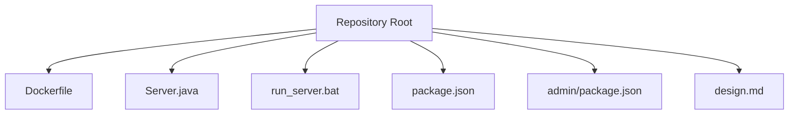
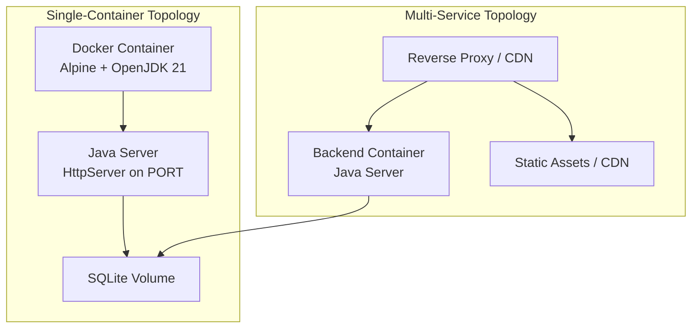
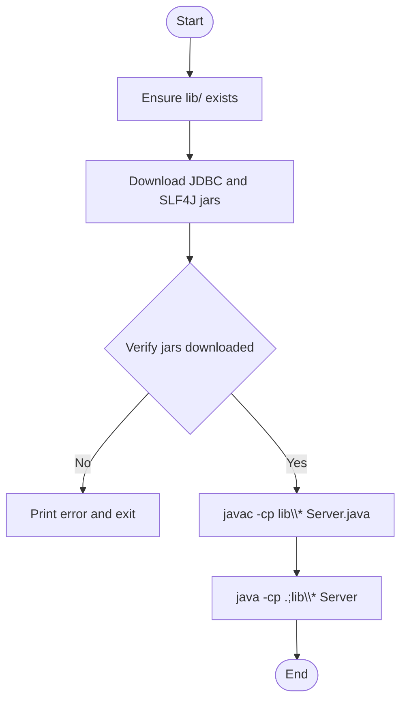
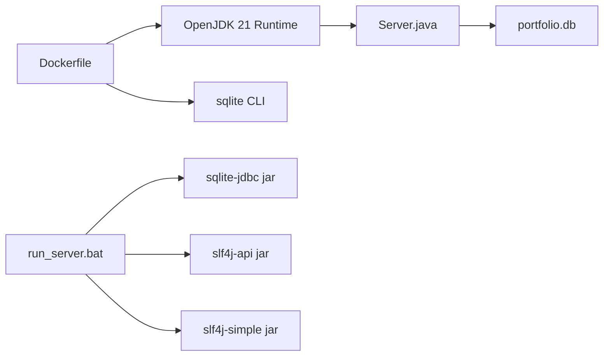

# Deployment Architecture

<cite>
**Referenced Files in This Document**
- [Dockerfile](file://Dockerfile)
- [Server.java](file://Server.java)
- [run_server.bat](file://run_server.bat)
- [package.json](file://package.json)
- [admin/package.json](file://admin/package.json)
- [design.md](file://design.md)
</cite>

## Table of Contents
1. [Introduction](#introduction)
2. [Project Structure](#project-structure)
3. [Core Components](#core-components)
4. [Architecture Overview](#architecture-overview)
5. [Detailed Component Analysis](#detailed-component-analysis)
6. [Dependency Analysis](#dependency-analysis)
7. [Performance Considerations](#performance-considerations)
8. [Security Hardening](#security-hardening)
9. [Resource Limits and Health Checks](#resource-limits-and-health-checks)
10. [Monitoring Integration](#monitoring-integration)
11. [CI/CD Pipeline Considerations](#cicd-pipeline-considerations)
12. [Automated Deployment Strategies](#automated-deployment-strategies)
13. [Troubleshooting Guide](#troubleshooting-guide)
14. [Conclusion](#conclusion)

## Introduction
This document describes the deployment architecture for a containerized Java-based portfolio backend. The system runs a standalone HTTP server packaged in a Docker image using an Alpine Linux base with OpenJDK 21. It exposes a configurable port via an environment variable, persists data using an SQLite file, and supports both single-container and multi-service deployment topologies. Cross-platform startup is supported through a Windows batch script for local development. The document also covers production readiness topics including security hardening, resource limits, health checks, monitoring, and CI/CD automation.

## Project Structure
The repository includes:
- A Dockerfile defining the container image
- A Java server implementation with SQLite persistence
- A Windows batch script for local startup
- A Node.js-based frontend/admin project (for completeness)
- Design documentation outlining tech stack and deployment guidance



**Diagram sources**
- [Dockerfile](file://Dockerfile)
- [Server.java](file://Server.java)
- [run_server.bat](file://run_server.bat)
- [package.json](file://package.json)
- [admin/package.json](file://admin/package.json)
- [design.md](file://design.md)

**Section sources**
- [Dockerfile](file://Dockerfile)
- [Server.java](file://Server.java)
- [run_server.bat](file://run_server.bat)
- [package.json](file://package.json)
- [admin/package.json](file://admin/package.json)
- [design.md](file://design.md)

## Core Components
- Container Image: Alpine Linux with Eclipse Temurin OpenJDK 21, SQLite CLI for diagnostics, compiled Java server, and exposed port 3000 by default.
- Runtime: Java HttpServer listening on a port determined by the PORT environment variable, with SQLite database stored as a file.
- Local Startup: Windows batch script downloads required JDBC dependencies, compiles, and runs the server locally.
- Frontend/Admin: Separate Node/Vite project intended for administration and content management (not part of the Java runtime image).

Key deployment-relevant behaviors:
- Port configuration: The server reads PORT from environment variables; defaults to 3000 if unspecified.
- Persistence: SQLite database file is created and migrated automatically at startup.
- Classpath: The Docker CMD uses a colon-separated classpath for Linux; the Windows script uses a semicolon-separated classpath.

**Section sources**
- [Dockerfile](file://Dockerfile)
- [Server.java:18-32](file://Server.java#L18-L32)
- [Server.java:85-337](file://Server.java#L85-L337)
- [run_server.bat:14-56](file://run_server.bat#L14-L56)

## Architecture Overview
The deployment supports multiple topologies:
- Single-container: Java server + static assets served by the same process, packaged in one container.
- Multi-service: Java backend container with a separate static file server or CDN for assets; optional reverse proxy for TLS termination and routing.



**Diagram sources**
- [Dockerfile](file://Dockerfile)
- [Server.java:18-32](file://Server.java#L18-L32)
- [Server.java:85-337](file://Server.java#L85-L337)

## Detailed Component Analysis

### Dockerfile Analysis
- Base Image: eclipse-temurin:21-jdk-alpine
- Working Directory: /app
- Dependencies: Installs sqlite for verification/debugging
- Build Steps: Copies project files, compiles Java with classpath pointing to lib/*
- Ports: EXPOSE 3000
- Entrypoint: CMD java -cp ".:lib/*" Server

Operational implications:
- The server expects a lib/ directory with JDBC drivers at runtime.
- The classpath separator differs between OSes; Linux uses ":" while Windows uses ";".

**Section sources**
- [Dockerfile](file://Dockerfile)

### Java Server Behavior
- Port Resolution: Reads PORT environment variable; falls back to 3000 if missing or invalid.
- Database Initialization: Automatically creates and migrates SQLite tables, seeds defaults, and ensures schema consistency.
- Handlers: Exposes REST endpoints for contact submissions, bookings, admin login, protected management endpoints, and static file serving.

```mermaid
sequenceDiagram
participant U as "Client"
participant S as "Server.java"
participant DB as "SQLite"
U->>S : "POST /api/contact"
S->>DB : "INSERT INTO contacts"
DB-->>S : "OK"
S-->>U : "200 OK JSON"
U->>S : "POST /api/login"
S-->>U : "Set-Cookie session_id=...; HttpOnly; SameSite=Lax"
```

**Diagram sources**
- [Server.java:355-396](file://Server.java#L355-L396)
- [Server.java:495-554](file://Server.java#L495-L554)
- [Server.java:85-337](file://Server.java#L85-L337)

**Section sources**
- [Server.java:18-32](file://Server.java#L18-L32)
- [Server.java:355-396](file://Server.java#L355-L396)
- [Server.java:495-554](file://Server.java#L495-L554)
- [Server.java:85-337](file://Server.java#L85-L337)

### Windows Startup Script
- Creates lib/ if missing
- Downloads SQLite JDBC and SLF4J jars via PowerShell
- Compiles and runs the server with a Windows-style classpath separator
- Provides user feedback and error handling



**Diagram sources**
- [run_server.bat:8-56](file://run_server.bat#L8-L56)

**Section sources**
- [run_server.bat:8-56](file://run_server.bat#L8-L56)

### Cross-Platform Considerations
- Classpath Separator: Linux uses ":"; Windows uses ";"
- File Separators: The Java code uses forward slashes in paths; this is compatible with both OSes
- Environment Variables: PORT is read uniformly across platforms

Recommendations:
- Keep the lib/ directory synchronized across environments
- Use a shared build artifact or CI job to produce a portable distribution

**Section sources**
- [Dockerfile](file://Dockerfile)
- [run_server.bat:43-56](file://run_server.bat#L43-L56)
- [Server.java:18-32](file://Server.java#L18-L32)

## Dependency Analysis
Runtime dependencies and their roles:
- Eclipse Temurin 21 JDK (Alpine) for Java execution
- SQLite JDBC driver (downloaded by script or provided in lib/)
- SLF4J API and Simple logger (downloaded by script)
- SQLite CLI for verification/debugging inside the container



**Diagram sources**
- [Dockerfile](file://Dockerfile)
- [run_server.bat:14-33](file://run_server.bat#L14-L33)
- [Server.java:85-337](file://Server.java#L85-L337)

**Section sources**
- [Dockerfile](file://Dockerfile)
- [run_server.bat:14-33](file://run_server.bat#L14-L33)
- [Server.java:85-337](file://Server.java#L85-L337)

## Performance Considerations
- Container Size: Alpine base keeps image small; SQLite CLI adds minimal overhead
- JVM Tuning: Consider adding JVM options for containerized environments (e.g., heap sizing) if traffic increases
- Static Assets: For multi-service deployments, serve static assets via CDN or a dedicated static server to reduce backend load
- Concurrency: The server uses the default executor; monitor for blocking operations and consider tuning if needed

## Security Hardening
- Authentication: The server sets HttpOnly cookies for session management; ensure HTTPS termination is enforced in production
- CORS: Configured per-handler; verify allowed origins and methods align with production requirements
- Input Validation: Handlers validate presence of required fields and sanitize JSON extraction; ensure schema validation is maintained
- Secrets: Store sensitive configuration in environment variables; avoid embedding secrets in the image
- Network Exposure: Bind the container to internal networks and expose only necessary ports

**Section sources**
- [Server.java:398-402](file://Server.java#L398-L402)
- [Server.java:355-396](file://Server.java#L355-L396)

## Resource Limits and Health Checks
- CPU/Memory: Configure container resource limits and requests in orchestrator manifests
- Health Checks: Implement a simple HTTP probe against a non-sensitive endpoint (e.g., a static route) to verify liveness
- Readiness: Ensure the database is initialized before marking the pod ready
- Logging: Redirect stdout/stderr to the orchestrator for centralized logging

## Monitoring Integration
- Metrics: Expose metrics endpoints or integrate with application performance monitoring tools
- Tracing: Add distributed tracing for cross-service visibility
- Alerts: Monitor error rates, latency, and resource utilization thresholds

## CI/CD Pipeline Considerations
- Build Stage: Compile Java with the lib/ dependencies and package into a Docker image
- Test Stage: Run unit and integration tests against the containerized server
- Scan Stage: Perform container image vulnerability scanning and secret detection
- Release Stage: Tag and push images to a registry; promote to staging and production environments
- Rollback: Maintain immutable tags and enable quick rollbacks

## Automated Deployment Strategies
- Infrastructure as Code: Define Kubernetes Deployments, Services, PersistentVolumeClaims, and Secrets
- Blue-Green or Canary: Use rollout strategies to minimize downtime and risk
- GitOps: Use ArgoCD or Flux to reconcile desired state from a Git repository
- Registry: Store images in a private registry with access policies and retention

## Troubleshooting Guide
Common issues and resolutions:
- Port Conflicts: Ensure PORT is set appropriately and not blocked by the host
- Missing Dependencies: Verify lib/ contains JDBC and SLF4J jars; the Windows script automates this
- Database File Permissions: Ensure the container user can write to the mounted volume for portfolio.db
- Classpath Errors: Confirm classpath separators match the OS (":" for Linux, ";" for Windows)
- Startup Failures: Review container logs for initialization errors and missing environment variables

**Section sources**
- [run_server.bat:14-56](file://run_server.bat#L14-L56)
- [Server.java:85-337](file://Server.java#L85-L337)

## Conclusion
The portfolio backend is designed for straightforward containerized deployment with a small footprint and clear operational boundaries. By leveraging environment variables for configuration, persisting data to a mounted volume, and applying security and observability best practices, teams can reliably operate this system in production. The provided Dockerfile and Windows startup script offer practical entry points for local development and automated CI/CD pipelines.