# System Design

<cite>
**Referenced Files in This Document**
- [Server.java](file://Server.java)
- [design.md](file://design.md)
- [admin.html](file://admin.html)
- [login.html](file://login.html)
- [index.html](file://index.html)
- [style.css](file://style.css)
- [main.js](file://main.js)
- [run_server.bat](file://run_server.bat)
- [Dockerfile](file://Dockerfile)
</cite>

## Table of Contents
1. [Introduction](#introduction)
2. [Project Structure](#project-structure)
3. [Core Components](#core-components)
4. [Architecture Overview](#architecture-overview)
5. [Detailed Component Analysis](#detailed-component-analysis)
6. [Dependency Analysis](#dependency-analysis)
7. [Performance Considerations](#performance-considerations)
8. [Troubleshooting Guide](#troubleshooting-guide)
9. [Conclusion](#conclusion)
10. [Appendices](#appendices)

## Introduction
This document describes the system design of the Premium Portfolio, focusing on the hybrid MVC architecture that combines a Java HTTP server with a custom handler pattern, static file serving with MIME type detection, and an embedded SQLite database. The system topology demonstrates how client browsers interact with backend handlers and the database, and how the admin panel integrates with the public portfolio. We also address scalability considerations, performance characteristics, and resource utilization patterns, and explain key design decisions such as using the embedded Java HTTP server, handler-based routing, and file-based SQLite storage.

## Project Structure
The repository is organized around a single Java application that embeds a minimal HTTP server and serves static assets alongside API endpoints. The structure supports:
- A Java-based HTTP server with custom handler classes for routing and processing requests
- Static file serving for HTML, CSS, JS, and related assets
- An embedded SQLite database for storing contact messages, bookings, and portfolio settings
- An admin panel integrated into the public site, protected by session-based authentication

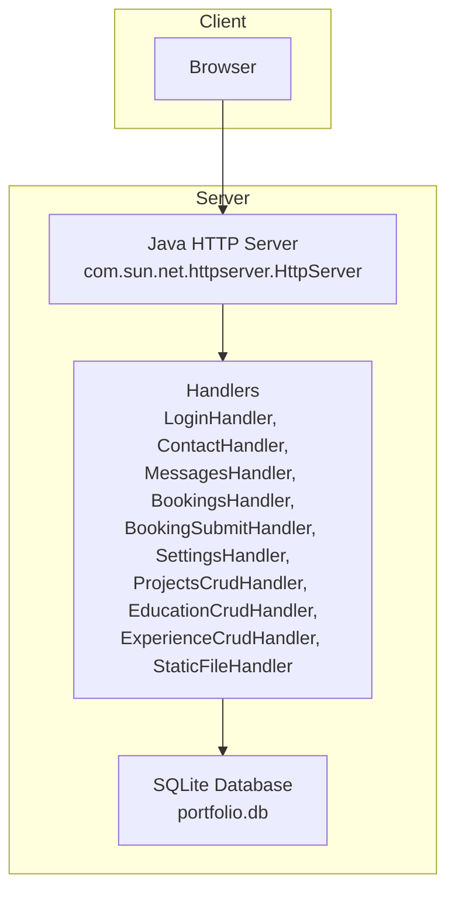

**Diagram sources**
- [Server.java:34-83](file://Server.java#L34-L83)
- [Server.java:354-396](file://Server.java#L354-L396)
- [Server.java:494-554](file://Server.java#L494-L554)
- [Server.java:556-644](file://Server.java#L556-L644)
- [Server.java:646-736](file://Server.java#L646-L736)
- [Server.java:738-800](file://Server.java#L738-L800)
- [Server.java:804-903](file://Server.java#L804-L903)
- [Server.java:906-1251](file://Server.java#L906-L1251)
- [Server.java:1252-1378](file://Server.java#L1252-L1378)
- [Server.java:1379-1500](file://Server.java#L1379-L1500)
- [Server.java:19-20](file://Server.java#L19-L20)

**Section sources**
- [Server.java:34-83](file://Server.java#L34-L83)
- [Server.java:19-20](file://Server.java#L19-L20)

## Core Components
- Java HTTP Server: Creates and starts the embedded HTTP server bound to a configurable port, registers contexts for API endpoints and static file serving, and delegates request handling to custom handler classes.
- Handler Classes: Implement the HttpHandler interface to process requests for authentication, contact submissions, booking submissions, admin data retrieval and modification, and static file serving.
- Static File Serving: Serves HTML, CSS, JS, and other assets with appropriate MIME types derived from file extensions.
- SQLite Database: Provides persistence for contact messages, bookings, and portfolio settings with schema initialization and migrations.

Key implementation references:
- Server startup and context registration: [Server.java:34-83](file://Server.java#L34-L83)
- Database initialization and schema creation: [Server.java:85-337](file://Server.java#L85-L337)
- Authentication cookie handling: [Server.java:339-352](file://Server.java#L339-L352)
- Static file serving: [Server.java:804-903](file://Server.java#L804-L903)
- Contact submission handler: [Server.java:494-554](file://Server.java#L494-L554)
- Messages administration handler: [Server.java:556-644](file://Server.java#L556-L644)
- Bookings administration handler: [Server.java:646-736](file://Server.java#L646-L736)
- Booking submission handler: [Server.java:738-800](file://Server.java#L738-L800)
- Settings handler: [Server.java:906-1251](file://Server.java#L906-L1251)
- CRUD handlers for projects, education, and experience: [Server.java:1252-1500](file://Server.java#L1252-L1500)

**Section sources**
- [Server.java:34-83](file://Server.java#L34-L83)
- [Server.java:85-337](file://Server.java#L85-L337)
- [Server.java:339-352](file://Server.java#L339-L352)
- [Server.java:804-903](file://Server.java#L804-L903)
- [Server.java:494-554](file://Server.java#L494-L554)
- [Server.java:556-644](file://Server.java#L556-L644)
- [Server.java:646-736](file://Server.java#L646-L736)
- [Server.java:738-800](file://Server.java#L738-L800)
- [Server.java:906-1251](file://Server.java#L906-L1251)
- [Server.java:1252-1500](file://Server.java#L1252-L1500)

## Architecture Overview
The system follows a hybrid MVC-like pattern:
- Model: SQLite database tables for contacts, bookings, and portfolio settings
- View: Static HTML pages and the admin panel rendered from the public site
- Controller: Custom HttpHandler implementations that validate requests, interact with the database, and produce responses

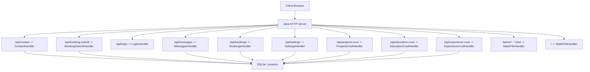

**Diagram sources**
- [Server.java:34-83](file://Server.java#L34-L83)
- [Server.java:494-554](file://Server.java#L494-L554)
- [Server.java:738-800](file://Server.java#L738-L800)
- [Server.java:354-396](file://Server.java#L354-L396)
- [Server.java:556-644](file://Server.java#L556-L644)
- [Server.java:646-736](file://Server.java#L646-L736)
- [Server.java:906-1251](file://Server.java#L906-L1251)
- [Server.java:1252-1500](file://Server.java#L1252-L1500)
- [Server.java:804-903](file://Server.java#L804-L903)

## Detailed Component Analysis

### Request Flow: Public Portfolio Access
The public portfolio is served statically. If an authenticated session cookie is present, the admin shortcut is shown.

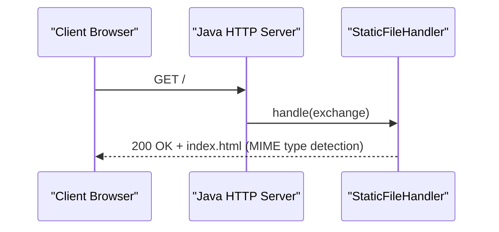

**Diagram sources**
- [Server.java:804-903](file://Server.java#L804-L903)
- [index.html](file://index.html)

**Section sources**
- [Server.java:804-903](file://Server.java#L804-L903)
- [index.html](file://index.html)

### Request Flow: Admin Login
Authentication is handled via a dedicated handler that validates credentials and sets a session cookie.

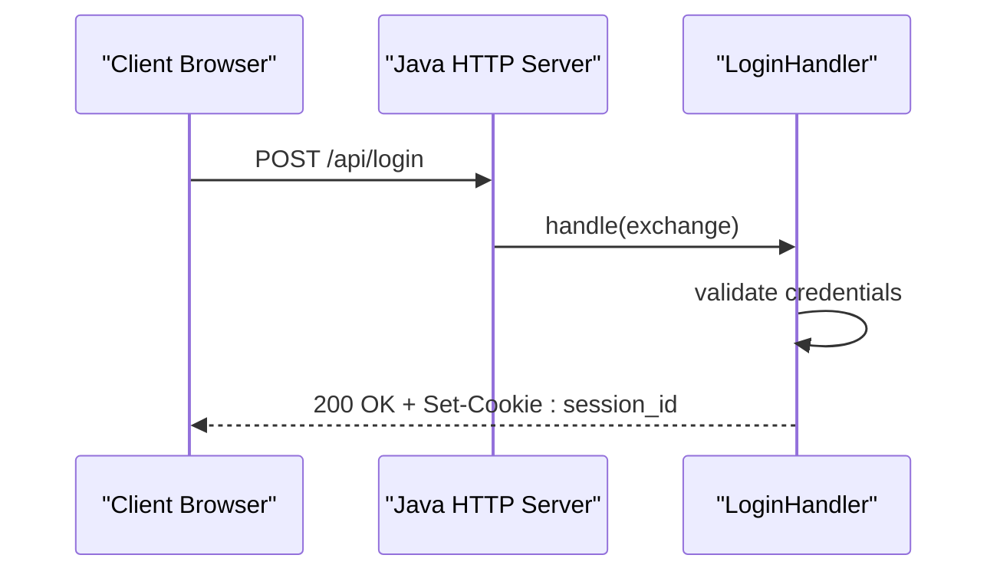

**Diagram sources**
- [Server.java:354-396](file://Server.java#L354-L396)

**Section sources**
- [Server.java:354-396](file://Server.java#L354-L396)

### Request Flow: Contact Submission
Contact messages are inserted into the SQLite database after validating the request body.

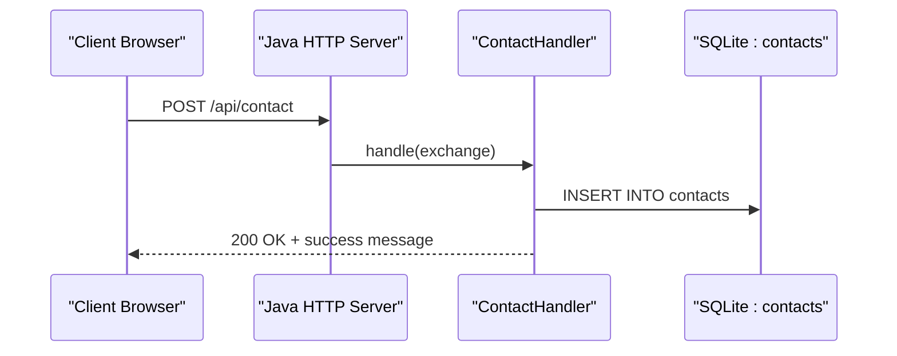

**Diagram sources**
- [Server.java:494-554](file://Server.java#L494-L554)
- [Server.java:533-541](file://Server.java#L533-L541)

**Section sources**
- [Server.java:494-554](file://Server.java#L494-L554)
- [Server.java:533-541](file://Server.java#L533-L541)

### Request Flow: Booking Submission
Public booking submissions are accepted and persisted to the database.

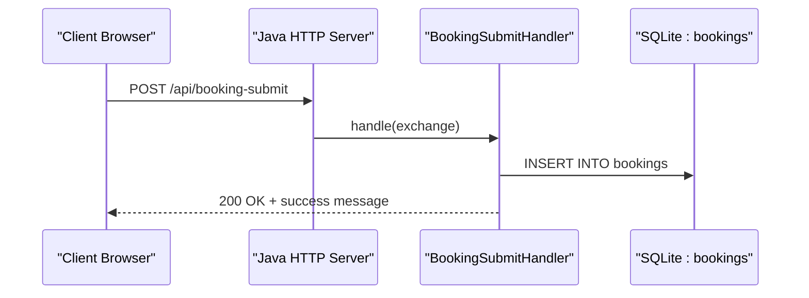

**Diagram sources**
- [Server.java:738-800](file://Server.java#L738-L800)
- [Server.java:779-789](file://Server.java#L779-L789)

**Section sources**
- [Server.java:738-800](file://Server.java#L738-L800)
- [Server.java:779-789](file://Server.java#L779-L789)

### Request Flow: Admin Data Retrieval and Deletion
Protected endpoints allow administrators to list and delete messages and bookings after verifying the session cookie.

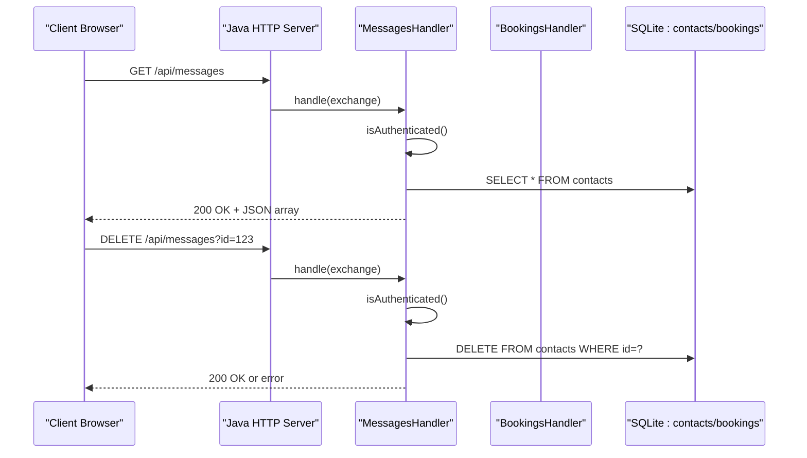

**Diagram sources**
- [Server.java:556-644](file://Server.java#L556-L644)
- [Server.java:339-352](file://Server.java#L339-L352)
- [Server.java:575-596](file://Server.java#L575-L596)
- [Server.java:624-635](file://Server.java#L624-L635)

**Section sources**
- [Server.java:556-644](file://Server.java#L556-L644)
- [Server.java:339-352](file://Server.java#L339-L352)
- [Server.java:575-596](file://Server.java#L575-L596)
- [Server.java:624-635](file://Server.java#L624-L635)

### Request Flow: Settings Management
The settings handler retrieves and updates portfolio configuration, supporting both public configuration reads and protected updates.

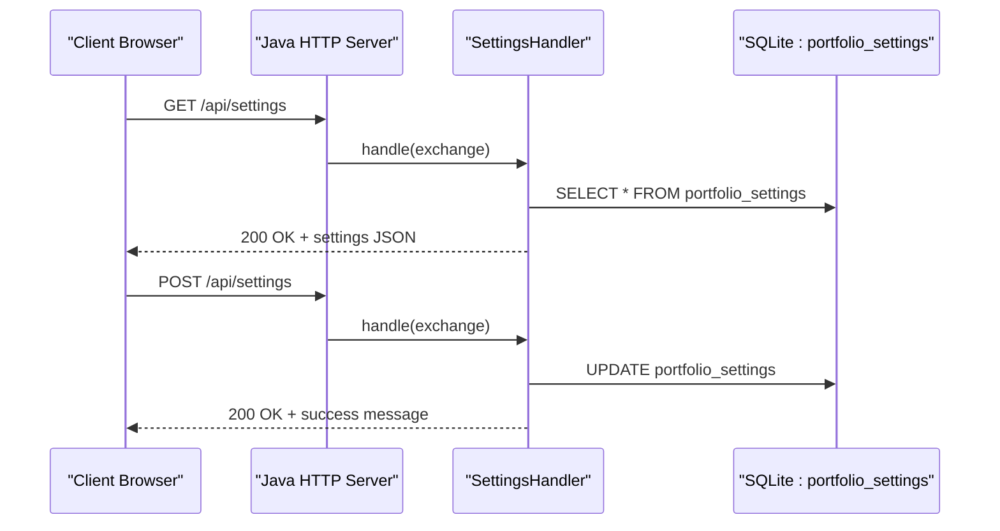

**Diagram sources**
- [Server.java:906-1251](file://Server.java#L906-L1251)
- [Server.java:1170-1210](file://Server.java#L1170-L1210)
- [Server.java:1211-1251](file://Server.java#L1211-L1251)

**Section sources**
- [Server.java:906-1251](file://Server.java#L906-L1251)
- [Server.java:1170-1210](file://Server.java#L1170-L1210)
- [Server.java:1211-1251](file://Server.java#L1211-L1251)

### Static File Serving and MIME Type Detection
Static resources are served with appropriate MIME types inferred from file extensions. The handler reads files from the filesystem and responds with proper headers.

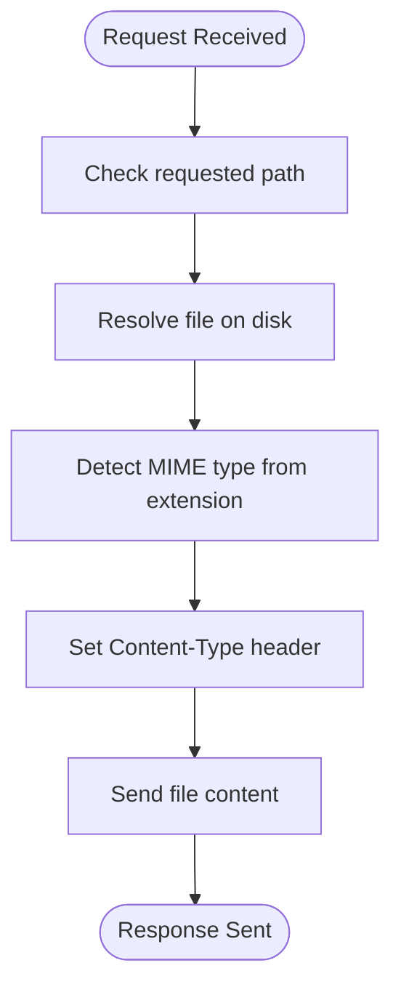

**Diagram sources**
- [Server.java:804-903](file://Server.java#L804-L903)

**Section sources**
- [Server.java:804-903](file://Server.java#L804-L903)

### Admin Panel Integration
The admin panel is integrated into the public site. When authenticated, a floating admin widget appears, allowing access to the admin area. The admin interface references the SQLite database and interacts with backend handlers.

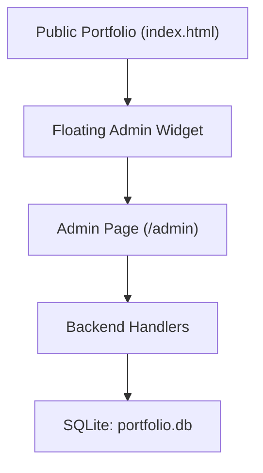

**Diagram sources**
- [index.html](file://index.html)
- [admin.html](file://admin.html)
- [Server.java:19-20](file://Server.java#L19-L20)

**Section sources**
- [index.html](file://index.html)
- [admin.html](file://admin.html)
- [Server.java:19-20](file://Server.java#L19-L20)

## Dependency Analysis
The system exhibits a clear separation of concerns:
- The HTTP server depends on handler classes for request processing
- Handlers depend on the SQLite database for persistence
- Static file serving is decoupled from business logic
- Authentication relies on session cookies validated by the server

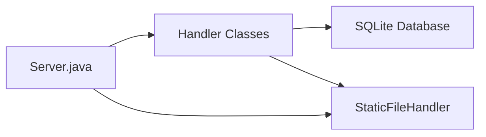

**Diagram sources**
- [Server.java:34-83](file://Server.java#L34-L83)
- [Server.java:804-903](file://Server.java#L804-L903)

**Section sources**
- [Server.java:34-83](file://Server.java#L34-L83)
- [Server.java:804-903](file://Server.java#L804-L903)

## Performance Considerations
- Embedded HTTP Server: Using the built-in Java HTTP server avoids external dependencies and reduces startup overhead, but offers fewer tuning knobs compared to full frameworks.
- Handler-Based Routing: Custom handlers keep routing logic explicit and lightweight, minimizing overhead for small-scale deployments.
- SQLite Storage: File-based SQLite is efficient for small to medium workloads and eliminates the need for external database services.
- Static Serving: Serving static assets directly from the filesystem reduces latency for public pages.
- Concurrency: The default executor is used; for higher concurrency, consider configuring a thread pool or switching to a more robust server.
- CORS and Headers: Responses include CORS headers and UTF-8 charset; ensure clients handle preflight OPTIONS efficiently.

[No sources needed since this section provides general guidance]

## Troubleshooting Guide
Common issues and resolutions:
- Port Binding Failures: Ensure the PORT environment variable is set correctly or falls back to the default. The server prints the effective URL on startup.
  - Reference: [Server.java:22-32](file://Server.java#L22-L32), [Server.java:72-77](file://Server.java#L72-L77)
- Database Initialization Errors: Verify the SQLite JDBC driver is available and the database file path is writable.
  - Reference: [Server.java:85-92](file://Server.java#L85-L92), [Server.java:94-96](file://Server.java#L94-L96)
- Authentication Failures: Confirm the session cookie is set and matches the expected value.
  - Reference: [Server.java:354-396](file://Server.java#L354-L396), [Server.java:339-352](file://Server.java#L339-L352)
- Static File 404s: Ensure requested paths resolve to files in the current working directory and that MIME types are supported.
  - Reference: [Server.java:804-903](file://Server.java#L804-L903)
- API Method Not Allowed: Handlers enforce strict HTTP methods; verify client requests use the correct method.
  - Reference: [Server.java:494-554](file://Server.java#L494-L554), [Server.java:556-644](file://Server.java#L556-L644), [Server.java:646-736](file://Server.java#L646-L736), [Server.java:738-800](file://Server.java#L738-L800), [Server.java:906-1251](file://Server.java#L906-L1251), [Server.java:1252-1500](file://Server.java#L1252-L1500)

**Section sources**
- [Server.java:22-32](file://Server.java#L22-L32)
- [Server.java:72-77](file://Server.java#L72-L77)
- [Server.java:85-92](file://Server.java#L85-L92)
- [Server.java:94-96](file://Server.java#L94-L96)
- [Server.java:354-396](file://Server.java#L354-L396)
- [Server.java:339-352](file://Server.java#L339-L352)
- [Server.java:804-903](file://Server.java#L804-L903)
- [Server.java:494-554](file://Server.java#L494-L554)
- [Server.java:556-644](file://Server.java#L556-L644)
- [Server.java:646-736](file://Server.java#L646-L736)
- [Server.java:738-800](file://Server.java#L738-L800)
- [Server.java:906-1251](file://Server.java#L906-L1251)
- [Server.java:1252-1500](file://Server.java#L1252-L1500)

## Conclusion
The Premium Portfolio employs a pragmatic hybrid MVC architecture centered on a Java HTTP server with custom handlers, static file serving, and an embedded SQLite database. This design prioritizes simplicity, low operational overhead, and rapid iteration, suitable for a personal portfolio with modest traffic. The admin panel is seamlessly integrated into the public site and protected by session-based authentication. While the embedded server and file-based SQLite are appropriate for small-scale usage, careful monitoring and potential scaling strategies should be considered as traffic grows.

[No sources needed since this section summarizes without analyzing specific files]

## Appendices

### Scalability Considerations
- Horizontal Scaling: The current design is single-process. For increased load, consider deploying behind a reverse proxy or container orchestration platform.
- Database Scaling: SQLite is file-based and not ideal for concurrent writes at scale. For higher throughput, migrate to a client-server database with connection pooling and read replicas.
- Caching: Introduce an in-memory cache for frequently accessed settings and static assets to reduce database and filesystem overhead.
- Asynchronous Processing: Offload long-running tasks (e.g., analytics, backups) to background workers.

[No sources needed since this section provides general guidance]

### Deployment Notes
- Environment Variables: Ensure PORT is configured appropriately for the runtime environment.
  - Reference: [Server.java:22-32](file://Server.java#L22-L32)
- Docker: Use the provided Dockerfile to containerize the application for consistent deployment.
  - Reference: [Dockerfile](file://Dockerfile)
- Windows Script: The batch script demonstrates starting the server locally.
  - Reference: [run_server.bat](file://run_server.bat)

**Section sources**
- [Server.java:22-32](file://Server.java#L22-L32)
- [Dockerfile](file://Dockerfile)
- [run_server.bat](file://run_server.bat)

### Admin Panel Context
The admin panel is part of the public site and connects to the SQLite database via the backend handlers. It provides a live preview and configuration management interface.

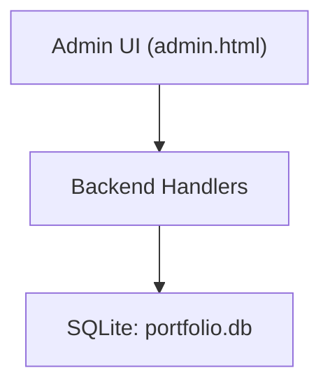

**Diagram sources**
- [admin.html](file://admin.html)
- [Server.java:906-1251](file://Server.java#L906-L1251)

**Section sources**
- [admin.html](file://admin.html)
- [Server.java:906-1251](file://Server.java#L906-L1251)