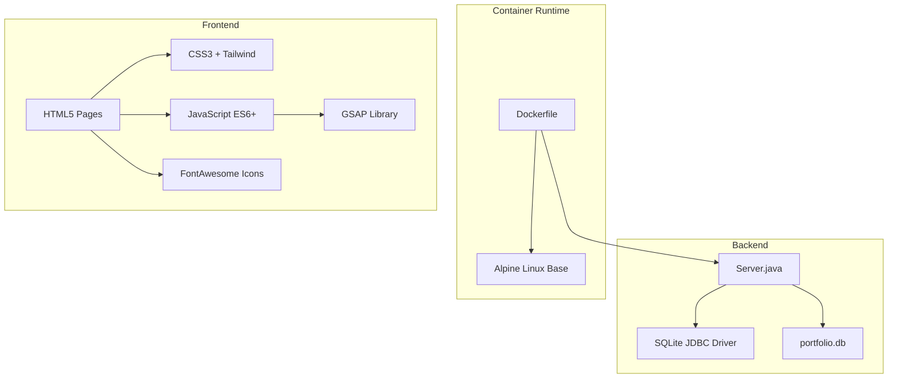
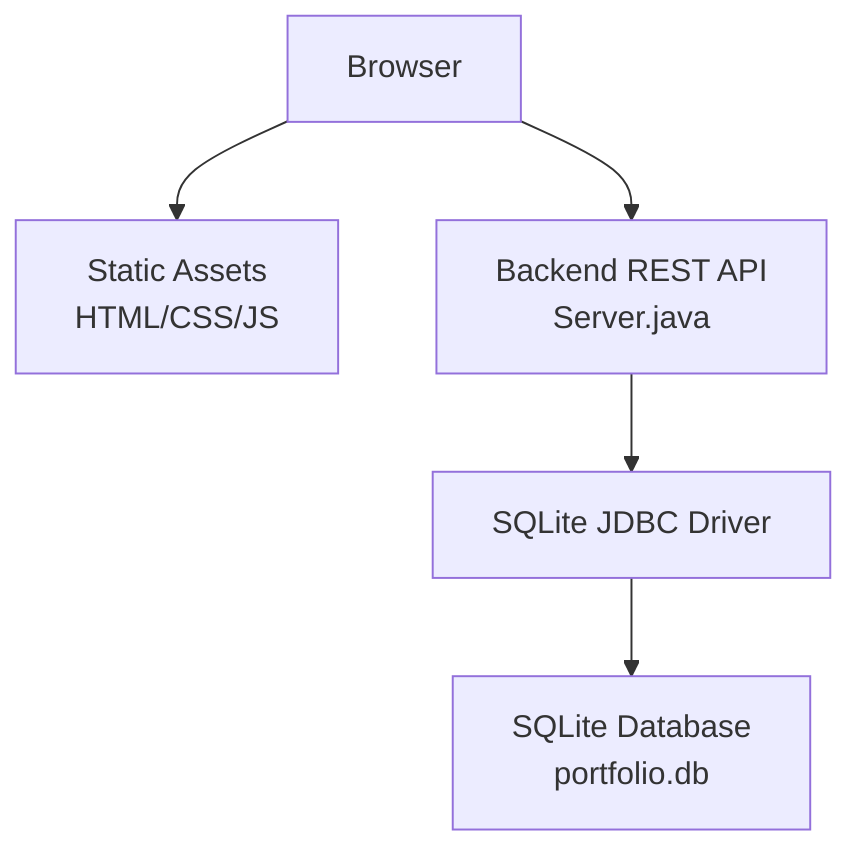
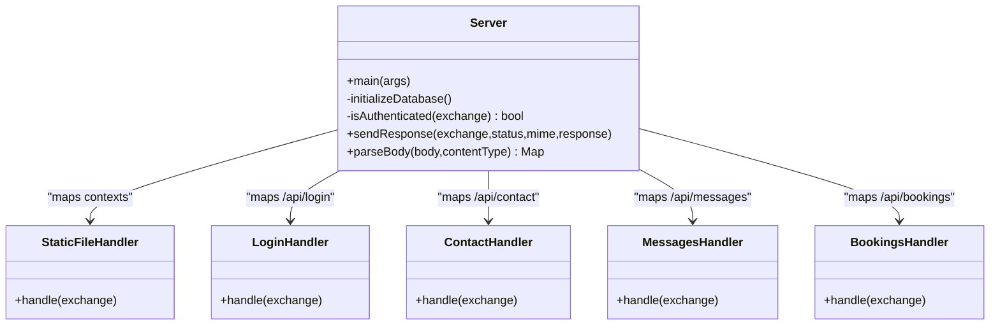
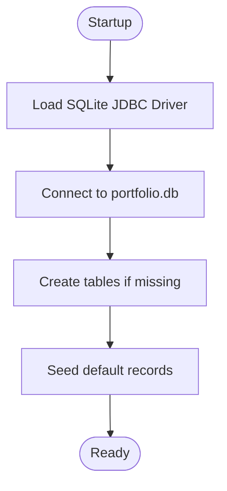
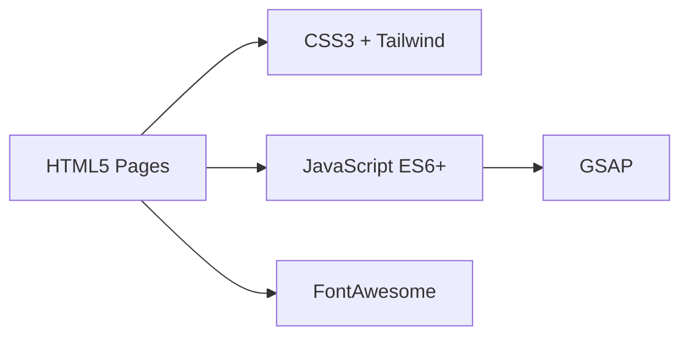
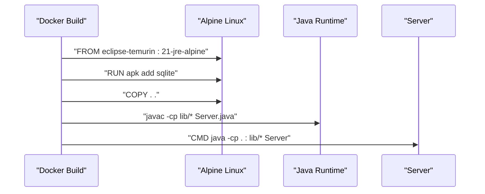
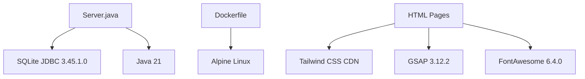

# Technology Stack

<cite>
**Referenced Files in This Document**
- [Server.java](file://Server.java)
- [Dockerfile](file://Dockerfile)
- [run_server.bat](file://run_server.bat)
- [main.js](file://main.js)
- [style.css](file://style.css)
- [index.html](file://index.html)
- [login.html](file://login.html)
- [admin.html](file://admin.html)
- [about.html](file://about.html)
- [contact.html](file://contact.html)
- [projects.html](file://projects.html)
- [education.html](file://education.html)
- [goals.html](file://goals.html)
</cite>

## Table of Contents
1. [Introduction](#introduction)
2. [Project Structure](#project-structure)
3. [Core Components](#core-components)
4. [Architecture Overview](#architecture-overview)
5. [Detailed Component Analysis](#detailed-component-analysis)
6. [Dependency Analysis](#dependency-analysis)
7. [Performance Considerations](#performance-considerations)
8. [Troubleshooting Guide](#troubleshooting-guide)
9. [Conclusion](#conclusion)

## Introduction
This document provides a comprehensive technology stack overview for the Premium Portfolio system. It covers the backend Java HTTP server with built-in HTTP server implementation, SQLite database with JDBC driver, and the frontend technologies including HTML5, CSS3, JavaScript ES6+, GSAP animation library, Tailwind CSS framework, and FontAwesome icons. It also documents the Docker containerization setup using an Alpine Linux base image, version requirements, compatibility considerations, licensing, upgrade paths, and rationale for technology choices.

## Project Structure
The project is organized into:
- Backend: Single-file Java application using the built-in HTTP server and SQLite database
- Frontend: Static HTML pages with shared CSS and JavaScript assets
- Containerization: Dockerfile for packaging and deployment
- Windows launcher: Batch script to compile and run the backend locally

**Diagram sources**
- [Dockerfile:1-18](file://Dockerfile#L1-L18)
- [Server.java:1-120](file://Server.java#L1-L120)

**Section sources**
- [Dockerfile:1-18](file://Dockerfile#L1-L18)
- [Server.java:1-120](file://Server.java#L1-L120)

## Core Components
- Backend Java HTTP Server
  - Built-in com.sun.net.httpserver package
  - Handlers for REST endpoints and static file serving
  - SQLite database integration via JDBC
- Database
  - SQLite relational database file
  - JDBC driver included in lib/ and downloaded by the Windows launcher
- Frontend
  - HTML5 semantic markup
  - CSS3 with Tailwind CSS utility classes
  - JavaScript ES6+ for interactivity and animations
  - GSAP for advanced scroll-triggered animations
  - FontAwesome for social media and UI icons
- Containerization
  - Dockerfile using Eclipse Temurin 21 JRE Alpine base image
  - Alpine Linux for minimal footprint

**Section sources**
- [Server.java:1-120](file://Server.java#L1-L120)
- [Dockerfile:1-18](file://Dockerfile#L1-L18)
- [run_server.bat:1-62](file://run_server.bat#L1-L62)

## Architecture Overview
The system follows a thin-client architecture:
- Clients (browsers) request static HTML/CSS/JS resources
- JavaScript communicates with backend REST endpoints
- Backend handles authentication, persists data to SQLite, and serves dynamic content
- Docker encapsulates the runtime environment

**Diagram sources**
- [Server.java:34-83](file://Server.java#L34-L83)
- [Dockerfile:1-18](file://Dockerfile#L1-L18)

## Detailed Component Analysis

### Backend Java HTTP Server
- Built-in HTTP server with multiple contexts:
  - Static file serving for admin and general pages
  - Protected admin endpoints requiring session cookie
  - Public endpoints for contact and booking
- Authentication
  - Basic login endpoint sets a session cookie
  - Authentication enforced for admin data retrieval and deletions
- Database initialization
  - Automatic creation of tables and seeding defaults
  - Schema migration support for existing databases
- Request handling
  - JSON and form-encoded bodies parsed
  - CORS enabled for cross-origin requests
  - UTF-8 encoding enforced

**Diagram sources**
- [Server.java:34-83](file://Server.java#L34-L83)
- [Server.java:355-396](file://Server.java#L355-L396)
- [Server.java:495-554](file://Server.java#L495-L554)
- [Server.java:557-644](file://Server.java#L557-L644)
- [Server.java:647-736](file://Server.java#L647-L736)

**Section sources**
- [Server.java:18-83](file://Server.java#L18-L83)
- [Server.java:339-352](file://Server.java#L339-L352)
- [Server.java:355-396](file://Server.java#L355-L396)
- [Server.java:495-554](file://Server.java#L495-L554)
- [Server.java:557-644](file://Server.java#L557-L644)
- [Server.java:647-736](file://Server.java#L647-L736)

### Database Layer
- SQLite relational database
- JDBC driver bundled in lib/ and downloaded by the Windows launcher
- Initialization script creates tables and seeds defaults
- Supports migrations for new columns

**Diagram sources**
- [Server.java:85-337](file://Server.java#L85-L337)
- [run_server.bat:14-39](file://run_server.bat#L14-L39)

**Section sources**
- [Server.java:85-337](file://Server.java#L85-L337)
- [run_server.bat:14-39](file://run_server.bat#L14-L39)

### Frontend Technologies
- HTML5
  - Semantic structure across pages
  - Responsive navigation and interactive elements
- CSS3
  - Custom design tokens and variables
  - Tailwind CSS utility classes for rapid styling
- JavaScript ES6+
  - Modular scripts for animations, forms, and data fetching
  - GSAP for scroll-triggered animations
- Icons
  - FontAwesome CDN for social and UI icons

**Diagram sources**
- [index.html:9-49](file://index.html#L9-L49)
- [style.css:1-60](file://style.css#L1-L60)
- [main.js:1-20](file://main.js#L1-L20)
- [login.html:8-39](file://login.html#L8-L39)

**Section sources**
- [index.html:9-49](file://index.html#L9-L49)
- [style.css:1-60](file://style.css#L1-L60)
- [main.js:1-20](file://main.js#L1-L20)
- [login.html:8-39](file://login.html#L8-L39)

### Containerization
- Base image: Eclipse Temurin 21 JRE Alpine
- Adds SQLite client for debugging
- Copies project files and compiles Java with classpath pointing to lib/*
- Exposes port 3000 and runs the server with classpath separator appropriate for Linux (:)

**Diagram sources**
- [Dockerfile:1-18](file://Dockerfile#L1-L18)

**Section sources**
- [Dockerfile:1-18](file://Dockerfile#L1-L18)

## Dependency Analysis
- Internal dependencies
  - Server.java depends on built-in HTTP server and JDBC driver
  - Frontend pages depend on external CDNs for Tailwind, GSAP, and FontAwesome
- External dependencies
  - SQLite JDBC driver (downloaded by Windows launcher)
  - Eclipse Temurin 21 JRE Alpine for container runtime
- Version requirements
  - Java 21 (Eclipse Temurin 21 JRE)
  - SQLite JDBC 3.45.1.0
  - Alpine Linux base image
  - Tailwind CSS via CDN
  - GSAP 3.12.2 via CDN
  - FontAwesome 6.4.0 via CDN

**Diagram sources**
- [run_server.bat:14-39](file://run_server.bat#L14-L39)
- [Dockerfile:1-18](file://Dockerfile#L1-L18)
- [index.html:9-49](file://index.html#L9-L49)
- [login.html:8-39](file://login.html#L8-L39)
- [admin.html:20-26](file://admin.html#L20-L26)

**Section sources**
- [run_server.bat:14-39](file://run_server.bat#L14-L39)
- [Dockerfile:1-18](file://Dockerfile#L1-L18)
- [index.html:9-49](file://index.html#L9-L49)
- [login.html:8-39](file://login.html#L8-L39)
- [admin.html:20-26](file://admin.html#L20-L26)

## Performance Considerations
- Built-in HTTP server is lightweight and suitable for small-scale deployments
- SQLite is file-based and efficient for low to moderate loads
- CDN-hosted libraries reduce local bandwidth and improve caching
- Minimize DOM manipulation and use requestAnimationFrame for smooth animations
- Consider enabling compression and cache headers for static assets

## Troubleshooting Guide
- Port conflicts
  - Backend listens on PORT environment variable or defaults to 3000
- Missing dependencies
  - Ensure SQLite JDBC driver is present in lib/ or let the Windows launcher download it
- Authentication failures
  - Verify credentials match the hardcoded values and session cookie is set
- CORS issues
  - Cross-origin requests are permitted; check browser console for errors
- Database connectivity
  - Confirm database file permissions and path resolution

**Section sources**
- [Server.java:22-32](file://Server.java#L22-L32)
- [run_server.bat:14-39](file://run_server.bat#L14-L39)
- [login.html:147-170](file://login.html#L147-L170)

## Conclusion
The Premium Portfolio system combines a minimal Java backend with a modern frontend stack and containerized deployment. The technology choices emphasize simplicity, portability, and maintainability while leveraging proven libraries for animations and styling. The stack is well-suited for a personal portfolio with administrative capabilities and can be easily upgraded or adapted as requirements evolve.