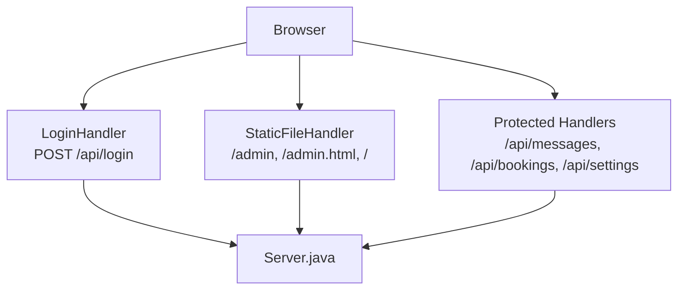
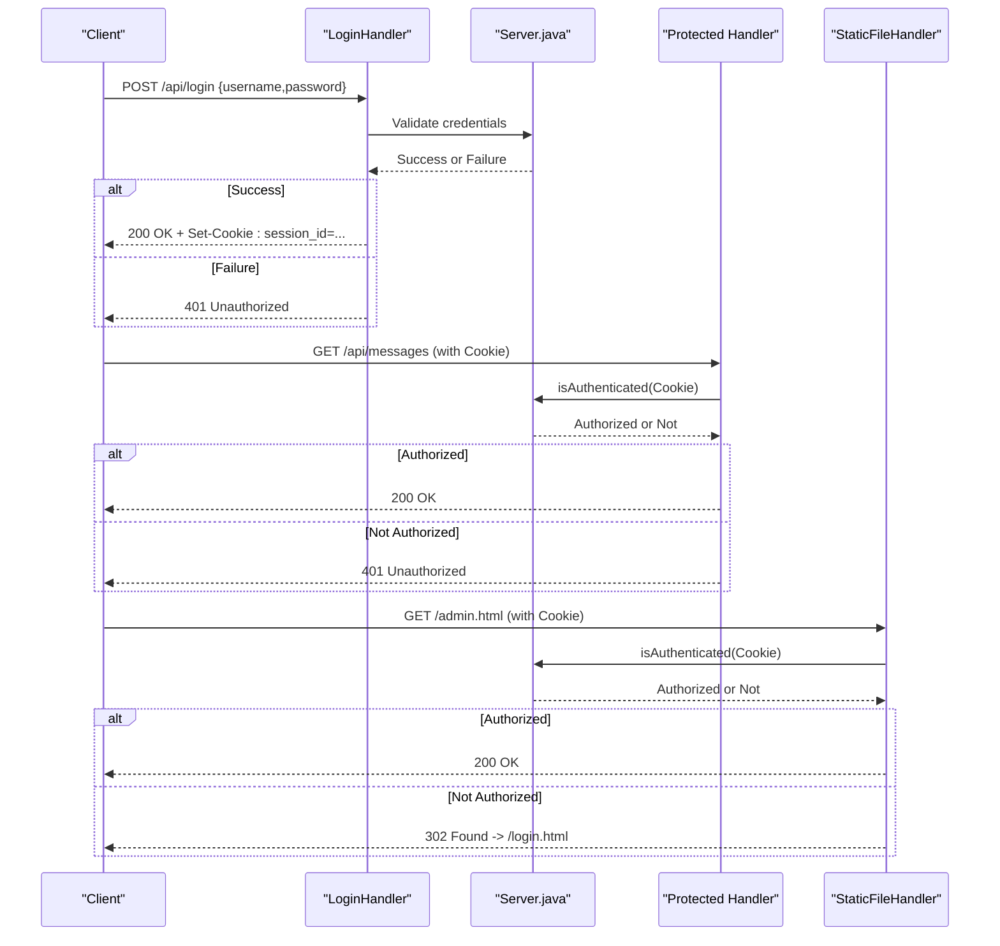
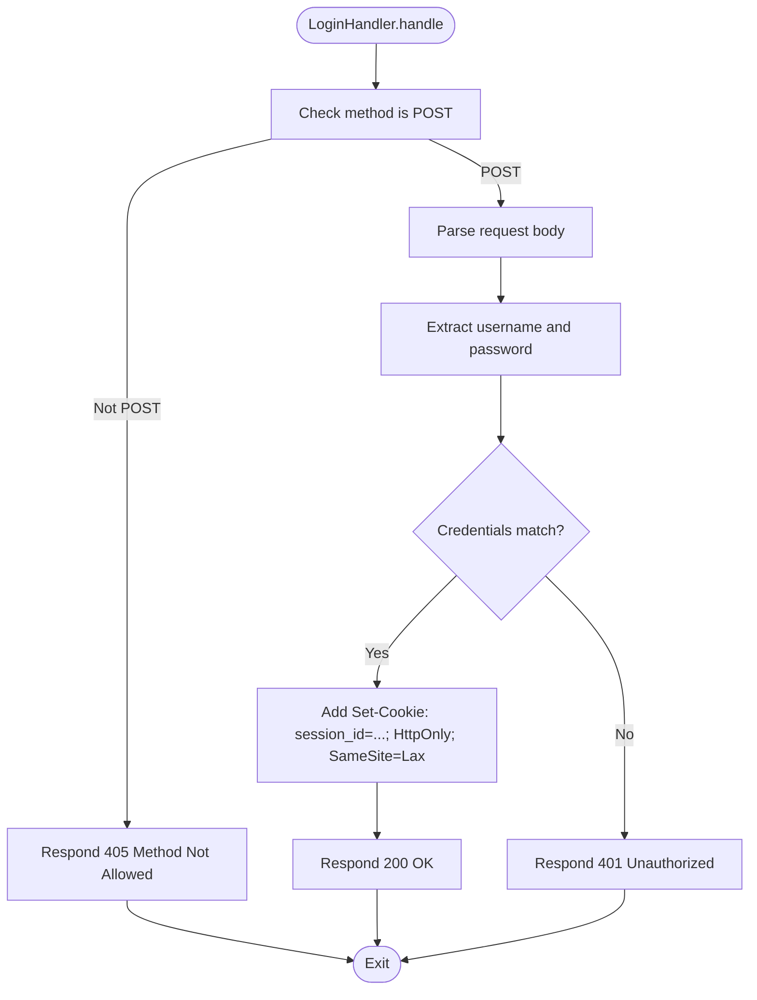
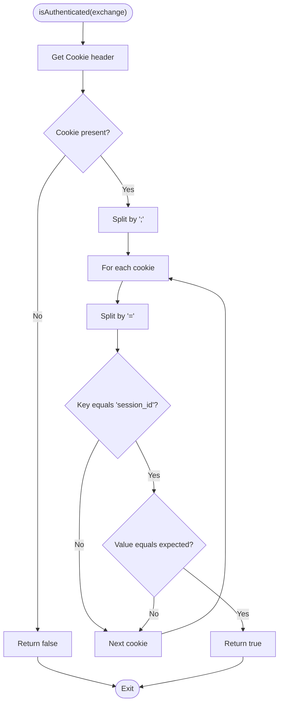
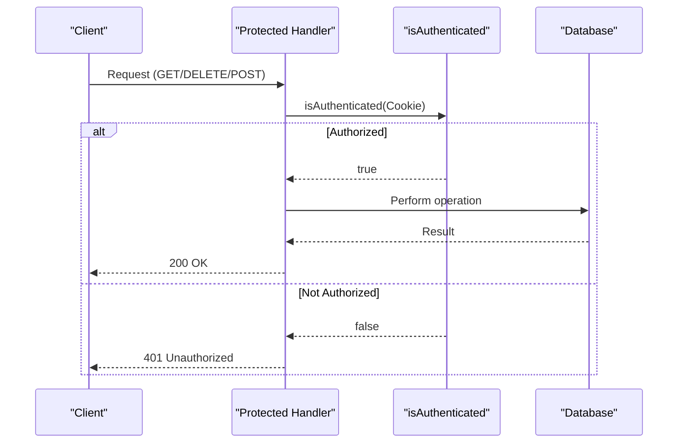
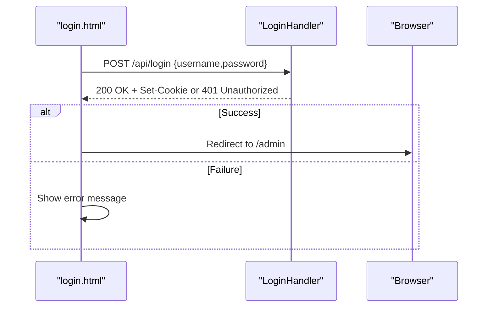
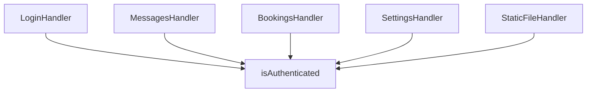

# Authentication System

<cite>
**Referenced Files in This Document**
- [Server.java](file://Server.java)
- [login.html](file://login.html)
- [design.md](file://design.md)
</cite>

## Table of Contents
1. [Introduction](#introduction)
2. [Project Structure](#project-structure)
3. [Core Components](#core-components)
4. [Architecture Overview](#architecture-overview)
5. [Detailed Component Analysis](#detailed-component-analysis)
6. [Dependency Analysis](#dependency-analysis)
7. [Performance Considerations](#performance-considerations)
8. [Troubleshooting Guide](#troubleshooting-guide)
9. [Conclusion](#conclusion)

## Introduction
This document explains the authentication system used by the portfolio backend. It focuses on the session-based authentication mechanism, cookie management, and security implementation. It documents the LoginHandler class, the authentication flow, session cookie creation and validation, authentication middleware for protected routes, and unauthorized access handling. It also covers security considerations, cookie attributes, potential vulnerabilities, authentication state management, and logout procedures.

## Project Structure
The authentication system is implemented in a single Java server file that exposes several HTTP endpoints and serves static pages. The relevant parts include:
- A LoginHandler that accepts credentials and sets a session cookie
- An isAuthenticated helper that validates the session cookie
- Protected endpoints that check authentication before processing requests
- A static file server that enforces authentication for admin resources

**Diagram sources**
- [Server.java:355-396](file://Server.java#L355-L396)
- [Server.java:805-890](file://Server.java#L805-L890)
- [Server.java:557-644](file://Server.java#L557-L644)
- [Server.java:647-736](file://Server.java#L647-L736)
- [Server.java:907-1250](file://Server.java#L907-L1250)

**Section sources**
- [Server.java:34-83](file://Server.java#L34-L83)
- [Server.java:805-890](file://Server.java#L805-L890)

## Core Components
- LoginHandler: Validates credentials and sets a session cookie when successful.
- isAuthenticated: Reads the Cookie header and checks for a matching session cookie value.
- Protected endpoints: Require a valid session cookie before allowing access.
- StaticFileHandler: Enforces authentication for admin pages.

Key implementation references:
- LoginHandler and cookie setting: [Server.java:355-396](file://Server.java#L355-L396)
- Session validation: [Server.java:339-352](file://Server.java#L339-L352)
- Protected API handlers: [Server.java:557-644](file://Server.java#L557-L644), [Server.java:647-736](file://Server.java#L647-L736), [Server.java:907-1250](file://Server.java#L907-L1250)
- Admin page authentication enforcement: [Server.java:826-832](file://Server.java#L826-L832)

**Section sources**
- [Server.java:339-396](file://Server.java#L339-L396)
- [Server.java:557-644](file://Server.java#L557-L644)
- [Server.java:647-736](file://Server.java#L647-L736)
- [Server.java:907-1250](file://Server.java#L907-L1250)
- [Server.java:826-832](file://Server.java#L826-L832)

## Architecture Overview
The authentication flow is session-based:
- The client submits credentials to the login endpoint.
- On success, the server responds with a Set-Cookie header that includes a session cookie.
- Subsequent requests carry the session cookie in the Cookie header.
- Protected endpoints and admin pages validate the presence and value of the session cookie.

**Diagram sources**
- [Server.java:355-396](file://Server.java#L355-L396)
- [Server.java:339-352](file://Server.java#L339-L352)
- [Server.java:557-644](file://Server.java#L557-L644)
- [Server.java:826-832](file://Server.java#L826-L832)

## Detailed Component Analysis

### LoginHandler
The LoginHandler processes POST requests to the login endpoint:
- Validates the HTTP method and CORS preflight handling
- Parses the request body to extract username and password
- Compares credentials against hard-coded values
- On success, sets a session cookie with HttpOnly and SameSite attributes
- On failure, returns an error response

**Diagram sources**
- [Server.java:355-396](file://Server.java#L355-L396)

**Section sources**
- [Server.java:355-396](file://Server.java#L355-L396)

### Session Validation
The isAuthenticated helper reads the Cookie header and checks for a specific session cookie:
- Splits the Cookie header by semicolon
- Iterates through cookies to find session_id
- Compares the value to an expected authorized value

**Diagram sources**
- [Server.java:339-352](file://Server.java#L339-L352)

**Section sources**
- [Server.java:339-352](file://Server.java#L339-L352)

### Protected Routes and Middleware
Protected endpoints and admin pages rely on the isAuthenticated helper:
- MessagesHandler and BookingsHandler check authentication for GET and DELETE
- SettingsHandler checks authentication for POST /api/settings/save
- StaticFileHandler redirects unauthenticated users to the login page for admin.html

**Diagram sources**
- [Server.java:557-644](file://Server.java#L557-L644)
- [Server.java:647-736](file://Server.java#L647-L736)
- [Server.java:907-1250](file://Server.java#L907-L1250)
- [Server.java:339-352](file://Server.java#L339-L352)

**Section sources**
- [Server.java:557-644](file://Server.java#L557-L644)
- [Server.java:647-736](file://Server.java#L647-L736)
- [Server.java:907-1250](file://Server.java#L907-L1250)
- [Server.java:826-832](file://Server.java#L826-L832)

### Frontend Login Flow
The login page sends credentials to the backend and handles responses:
- Collects username and password from the form
- Sends a POST request to the login endpoint
- On success, redirects to the admin page

**Diagram sources**
- [login.html:146-171](file://login.html#L146-L171)
- [Server.java:355-396](file://Server.java#L355-L396)

**Section sources**
- [login.html:146-171](file://login.html#L146-L171)

## Dependency Analysis
- LoginHandler depends on the request method and body parsing to validate credentials.
- isAuthenticated depends on the Cookie header and a fixed expected session value.
- Protected handlers depend on isAuthenticated to gate access.
- StaticFileHandler depends on isAuthenticated to enforce admin access.

**Diagram sources**
- [Server.java:355-396](file://Server.java#L355-L396)
- [Server.java:339-352](file://Server.java#L339-L352)
- [Server.java:557-644](file://Server.java#L557-L644)
- [Server.java:647-736](file://Server.java#L647-L736)
- [Server.java:907-1250](file://Server.java#L907-L1250)
- [Server.java:805-890](file://Server.java#L805-L890)

**Section sources**
- [Server.java:339-396](file://Server.java#L339-L396)
- [Server.java:557-736](file://Server.java#L557-L736)
- [Server.java:907-1250](file://Server.java#L907-L1250)
- [Server.java:805-890](file://Server.java#L805-L890)

## Performance Considerations
- Authentication checks are lightweight string comparisons and header parsing.
- Cookies are small and validated quickly.
- Protected endpoints perform database operations after authentication; ensure database queries are efficient and use prepared statements as implemented.

## Troubleshooting Guide
Common issues and resolutions:
- 401 Unauthorized on login
  - Ensure the request method is POST and the body contains username and password fields.
  - Verify the credentials match the expected values.
  - Check that the browser accepts the Set-Cookie response.
  - Reference: [Server.java:355-396](file://Server.java#L355-L396)

- 401 Unauthorized on protected endpoints
  - Confirm the session cookie is present in the Cookie header.
  - Verify the cookie value matches the expected authorized value.
  - Reference: [Server.java:339-352](file://Server.java#L339-L352), [Server.java:557-644](file://Server.java#L557-L644)

- 302 redirect to login for admin page
  - Unauthenticated requests to admin pages are redirected to the login page.
  - Reference: [Server.java:826-832](file://Server.java#L826-L832)

- CORS errors
  - Ensure the server sets appropriate CORS headers for preflight and actual requests.
  - Reference: [Server.java:398-402](file://Server.java#L398-L402)

**Section sources**
- [Server.java:355-396](file://Server.java#L355-L396)
- [Server.java:339-352](file://Server.java#L339-L352)
- [Server.java:557-644](file://Server.java#L557-L644)
- [Server.java:826-832](file://Server.java#L826-L832)
- [Server.java:398-402](file://Server.java#L398-L402)

## Conclusion
The authentication system uses a straightforward session-based approach with a single session cookie. LoginHandler validates credentials and sets a cookie with HttpOnly and SameSite attributes. isAuthenticated performs a simple check on incoming requests to gate protected endpoints and admin pages. While functional, the implementation uses hardcoded credentials and a simple cookie value, which introduces security risks that should be addressed in production environments.