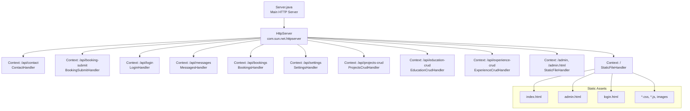
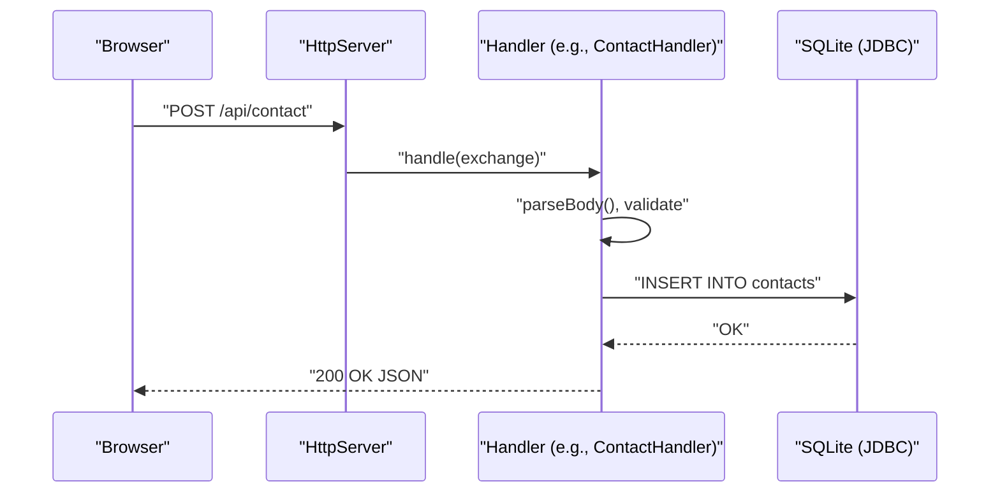
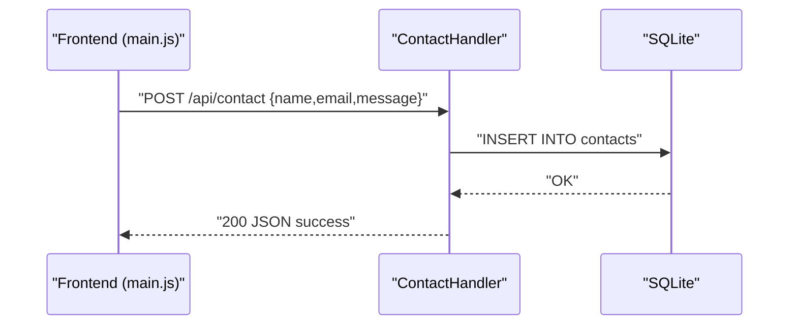
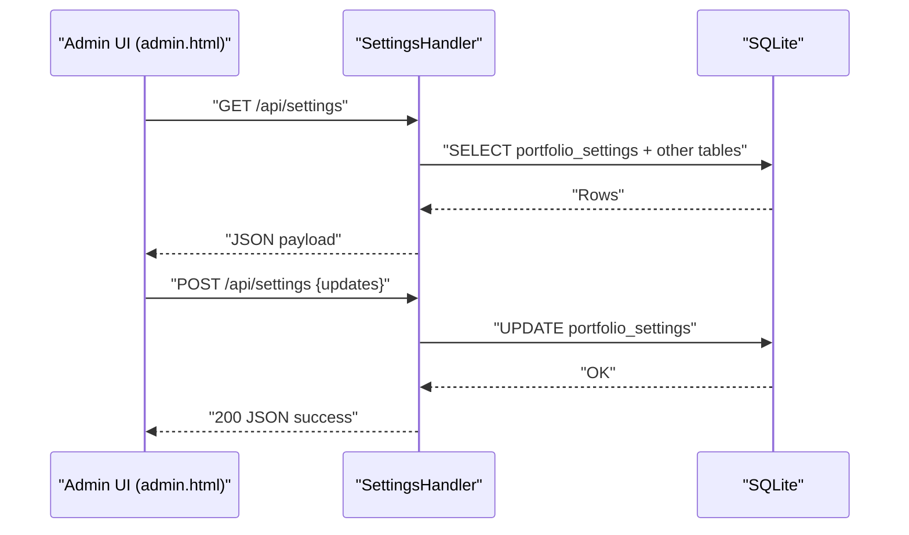
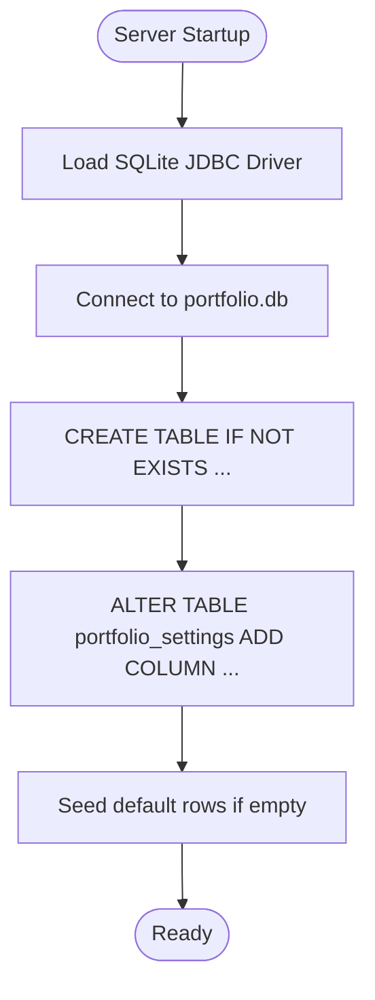
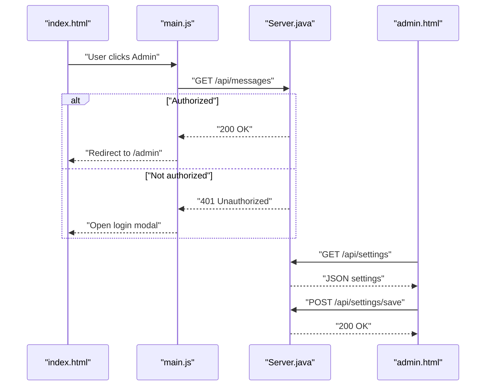
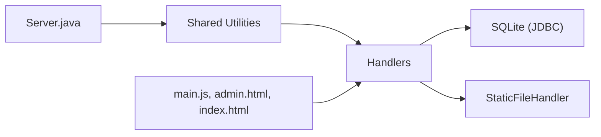

# Backend Implementation

<cite>
**Referenced Files in This Document**
- [Server.java](file://Server.java)
- [main.js](file://main.js)
- [admin.html](file://admin.html)
- [index.html](file://index.html)
- [Dockerfile](file://Dockerfile)
- [run_server.bat](file://run_server.bat)
</cite>

## Table of Contents
1. [Introduction](#introduction)
2. [Project Structure](#project-structure)
3. [Core Components](#core-components)
4. [Architecture Overview](#architecture-overview)
5. [Detailed Component Analysis](#detailed-component-analysis)
6. [Dependency Analysis](#dependency-analysis)
7. [Performance Considerations](#performance-considerations)
8. [Troubleshooting Guide](#troubleshooting-guide)
9. [Conclusion](#conclusion)
10. [Appendices](#appendices)

## Introduction
This document explains the backend implementation of the portfolio project, focusing on the Java HTTP server, handler pattern architecture, and database integration. It covers the main Server class, HTTP handler implementations, API endpoint routing, configuration options, authentication mechanisms, CORS handling, and the relationship with frontend JavaScript and static file serving. The goal is to make the backend approach understandable for beginners while providing sufficient technical depth for experienced developers.

## Project Structure
The backend is implemented in a single Java class that doubles as a self-contained HTTP server. It initializes a local SQLite database, registers multiple HTTP contexts for API endpoints and static file serving, and exposes a small set of protected administrative endpoints.

**Diagram sources**
- [Server.java:34-83](file://Server.java#L34-L83)
- [Server.java:804-904](file://Server.java#L804-L904)

**Section sources**
- [Server.java:34-83](file://Server.java#L34-L83)
- [Server.java:804-904](file://Server.java#L804-L904)

## Core Components
- Main server bootstrap and configuration
  - Port selection from environment variable with fallback
  - Database initialization and schema migration
  - Context registration for all endpoints and static file serving
- Handler pattern
  - Each endpoint is implemented as a separate inner static class implementing HttpHandler
  - Shared utilities: CORS headers, response sending, body parsing, JSON escaping, authentication check
- Database integration
  - SQLite via JDBC
  - Tables: contacts, bookings, portfolio_settings, projects, education, experience
  - Schema creation/migration and seeding during startup
- Frontend integration
  - Static file serving for HTML, CSS, JS, and images
  - Frontend JavaScript consumes /api/settings and posts to /api/contact and /api/booking-submit
  - Admin page interacts with protected endpoints and cookies

**Section sources**
- [Server.java:18-32](file://Server.java#L18-L32)
- [Server.java:85-337](file://Server.java#L85-L337)
- [Server.java:398-411](file://Server.java#L398-L411)
- [Server.java:413-466](file://Server.java#L413-L466)
- [Server.java:339-352](file://Server.java#L339-L352)

## Architecture Overview
The backend follows a simple, monolithic architecture:
- A single HttpServer instance hosts all routes
- Handlers encapsulate business logic per endpoint
- StaticFileHandler serves frontend assets and enforces safe file access
- Protected endpoints rely on a cookie-based session check

**Diagram sources**
- [Server.java:494-554](file://Server.java#L494-L554)
- [Server.java:533-541](file://Server.java#L533-L541)

## Detailed Component Analysis

### Main Server Bootstrap
- Port resolution: reads PORT environment variable; defaults to 3000
- Database initialization: ensures SQLite driver is present, connects, creates tables if missing, seeds defaults, and migrates schema
- Endpoint registration: maps all API endpoints and static contexts
- Startup logging: prints server address and database info

Key responsibilities:
- Centralized configuration and lifecycle
- Database schema management
- Routing registration

**Section sources**
- [Server.java:18-32](file://Server.java#L18-L32)
- [Server.java:85-337](file://Server.java#L85-L337)
- [Server.java:34-83](file://Server.java#L34-L83)

### Static File Serving
- Serves HTML, CSS, JS, and images from the project root
- Rewrites root to index.html and admin to admin.html
- Enforces canonicalization to prevent directory traversal
- Sets appropriate MIME types
- Redirects unauthenticated users to login for admin pages

Security and UX highlights:
- Prevents directory traversal by checking canonical paths
- Returns 404 for missing files
- Uses 302 redirect for admin access denial

**Section sources**
- [Server.java:804-904](file://Server.java#L804-L904)

### Authentication and Session Management
- Login endpoint accepts credentials and sets a session cookie
- Authentication check inspects Cookie header for a specific session_id value
- Protected endpoints enforce authentication before processing requests

Implementation notes:
- Cookie is HttpOnly and uses SameSite=Lax
- Authentication is enforced centrally via a shared method

**Section sources**
- [Server.java:354-396](file://Server.java#L354-L396)
- [Server.java:339-352](file://Server.java#L339-L352)

### CORS Handling
- All handlers set Access-Control-Allow-Origin to "*" for development convenience
- Allow methods: GET, POST, DELETE, OPTIONS
- Allow headers: Content-Type
- Special handling for preflight OPTIONS requests

**Section sources**
- [Server.java:398-402](file://Server.java#L398-L402)
- [Server.java:498](file://Server.java#L498)
- [Server.java:562](file://Server.java#L562)
- [Server.java:651](file://Server.java#L651)
- [Server.java:742](file://Server.java#L742)

### API Endpoints and Handlers

#### Contact Form Submission
- Endpoint: POST /api/contact
- Validates presence of name, email, message
- Inserts into contacts table
- Returns JSON success/error

**Diagram sources**
- [Server.java:494-554](file://Server.java#L494-L554)
- [Server.java:533-541](file://Server.java#L533-L541)

**Section sources**
- [Server.java:494-554](file://Server.java#L494-L554)

#### Public Booking Submission
- Endpoint: POST /api/booking-submit
- Validates presence of name, email, date, time, topic
- Inserts into bookings table
- Returns JSON success/error

**Section sources**
- [Server.java:738-802](file://Server.java#L738-L802)

#### Admin Message Listing and Deletion
- Endpoint: GET /api/messages lists all contacts
- Endpoint: DELETE /api/messages?id=123 deletes by ID
- Requires authentication via session cookie

**Section sources**
- [Server.java:556-644](file://Server.java#L556-L644)

#### Admin Booking Listing and Deletion
- Endpoint: GET /api/bookings lists all bookings
- Endpoint: DELETE /api/bookings?id=123 deletes by ID
- Requires authentication

**Section sources**
- [Server.java:646-736](file://Server.java#L646-L736)

#### Settings Management
- GET /api/settings returns combined settings, projects, education, experience
- POST /api/settings saves updates to portfolio_settings
- Requires authentication for POST

**Diagram sources**
- [Server.java:906-1250](file://Server.java#L906-L1250)
- [Server.java:1124-1239](file://Server.java#L1124-L1239)

**Section sources**
- [Server.java:906-1250](file://Server.java#L906-L1250)

#### CRUD Handlers for Admin Content
- Projects CRUD: POST /api/projects-crud (create/update), DELETE /api/projects-crud?id=123
- Education CRUD: POST /api/education-crud (create/update), DELETE /api/education-crud?id=123
- Experience CRUD: POST /api/experience-crud (create/update), DELETE /api/experience-crud?id=123
- All require authentication

**Section sources**
- [Server.java:1252-1377](file://Server.java#L1252-L1377)
- [Server.java:1379-1497](file://Server.java#L1379-L1497)
- [Server.java:1500-1619](file://Server.java#L1500-L1619)

### Database Integration
- JDBC SQLite driver is loaded and used
- Database URL is a file-based SQLite connection
- Initialization performs:
  - Table creation for contacts, bookings, portfolio_settings, projects, education, experience
  - Column migration for portfolio_settings
  - Seeding default rows when tables are empty
- Handlers use PreparedStatement for safe SQL operations

**Diagram sources**
- [Server.java:85-337](file://Server.java#L85-L337)

**Section sources**
- [Server.java:18-21](file://Server.java#L18-L21)
- [Server.java:85-337](file://Server.java#L85-L337)

### Frontend Integration
- Frontend JavaScript (main.js) fetches settings from /api/settings and renders content dynamically
- Contact and booking forms submit to /api/contact and /api/booking-submit respectively
- Admin page (admin.html) uses /api/messages and /api/settings/save to manage content
- Index page triggers login modal and admin redirection based on API availability

**Diagram sources**
- [Server.java:354-396](file://Server.java#L354-L396)
- [Server.java:556-644](file://Server.java#L556-L644)
- [Server.java:906-1250](file://Server.java#L906-L1250)
- [index.html:1153-1166](file://index.html#L1153-L1166)
- [admin.html:1606-1627](file://admin.html#L1606-L1627)

**Section sources**
- [main.js:76-136](file://main.js#L76-L136)
- [index.html:1153-1166](file://index.html#L1153-L1166)
- [admin.html:1606-1627](file://admin.html#L1606-L1627)

## Dependency Analysis
- Internal dependencies
  - Shared utilities: CORS, response sending, body parsing, JSON escaping, authentication check
  - Database operations: centralized via JDBC connections in handlers
- External dependencies
  - Java HTTP server package for HTTP handling
  - SQLite JDBC driver for database connectivity
  - Frontend assets served statically

**Diagram sources**
- [Server.java:398-466](file://Server.java#L398-L466)
- [Server.java:494-1619](file://Server.java#L494-L1619)

**Section sources**
- [Server.java:398-466](file://Server.java#L398-L466)
- [Server.java:494-1619](file://Server.java#L494-L1619)

## Performance Considerations
- Connection-per-request model: Handlers open and close database connections per request; suitable for low-to-moderate traffic
- Prepared statements: Used consistently to mitigate SQL injection and improve performance
- Minimal overhead: Single-threaded executor by default; acceptable for development and small-scale usage
- Recommendations for production:
  - Pool database connections
  - Add rate limiting and input validation
  - Consider asynchronous I/O or a lightweight framework
  - Enable HTTPS and stricter CORS policies

[No sources needed since this section provides general guidance]

## Troubleshooting Guide
Common issues and resolutions:
- SQLite driver not found
  - Symptom: Error indicating JDBC driver not found
  - Resolution: Ensure sqlite-jdbc is on the classpath
- Database initialization failures
  - Symptom: Errors during table creation or seeding
  - Resolution: Verify file permissions for portfolio.db and disk space
- CORS errors in browser
  - Symptom: Preflight failures or blocked cross-origin requests
  - Resolution: Confirm Access-Control headers are set; adjust origins for production
- Authentication failures
  - Symptom: 401 Unauthorized on protected endpoints
  - Resolution: Ensure login succeeds and session cookie is set; verify cookie name and value
- Directory traversal attempts
  - Symptom: 403 Forbidden on static files
  - Resolution: Avoid requesting paths outside the project root; use canonical checks
- Port conflicts
  - Symptom: Server fails to start
  - Resolution: Set PORT environment variable to an available port

**Section sources**
- [Server.java:87-92](file://Server.java#L87-L92)
- [Server.java:334-337](file://Server.java#L334-L337)
- [Server.java:398-402](file://Server.java#L398-L402)
- [Server.java:354-396](file://Server.java#L354-L396)
- [Server.java:860-867](file://Server.java#L860-L867)
- [Server.java:22-32](file://Server.java#L22-L32)

## Conclusion
The backend is a compact, self-contained Java HTTP server that integrates SQLite for persistence and serves static assets. It uses a clear handler pattern, centralizes shared utilities, and exposes a small set of protected endpoints for administration. While suitable for development and small deployments, production readiness would benefit from connection pooling, stricter security, and improved error handling.

[No sources needed since this section summarizes without analyzing specific files]

## Appendices

### Configuration Options
- Environment variables
  - PORT: TCP port for the HTTP server (defaults to 3000)
- Database
  - JDBC URL: file-based SQLite database named portfolio.db
- Cookies
  - session_id: HttpOnly, SameSite=Lax cookie used for authentication

**Section sources**
- [Server.java:18-32](file://Server.java#L18-L32)
- [Server.java:18-21](file://Server.java#L18-L21)
- [Server.java:386](file://Server.java#L386)

### Deployment Notes
- Dockerfile and run_server.bat are included for containerization and Windows startup scripts
- Ensure the SQLite JDBC driver is available on the classpath when running the server

**Section sources**
- [Dockerfile](file://Dockerfile)
- [run_server.bat](file://run_server.bat)