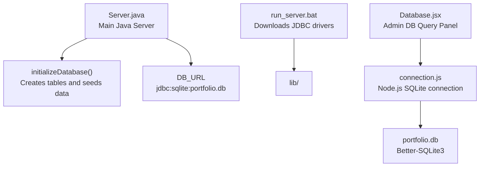
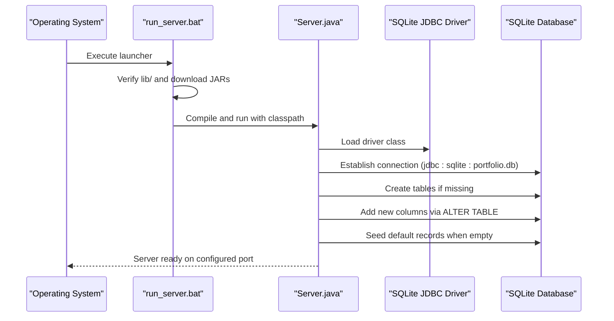
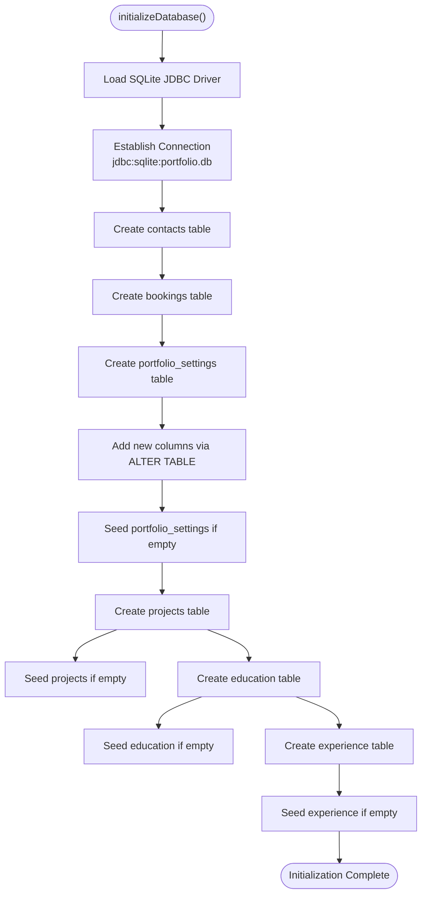
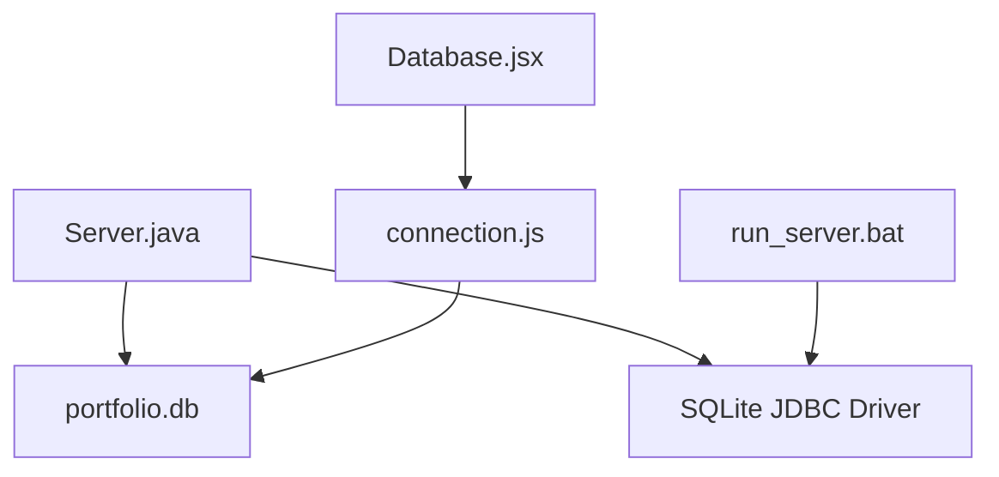

# Database Initialization

<cite>
**Referenced Files in This Document**
- [Server.java](file://Server.java)
- [run_server.bat](file://run_server.bat)
- [connection.js](file://server/db/connection.js)
- [schema.js](file://server/db/schema.js)
- [Database.jsx](file://admin/src/pages/Database.jsx)
</cite>

## Table of Contents
1. [Introduction](#introduction)
2. [Project Structure](#project-structure)
3. [Core Components](#core-components)
4. [Architecture Overview](#architecture-overview)
5. [Detailed Component Analysis](#detailed-component-analysis)
6. [Dependency Analysis](#dependency-analysis)
7. [Performance Considerations](#performance-considerations)
8. [Troubleshooting Guide](#troubleshooting-guide)
9. [Conclusion](#conclusion)

## Introduction
This document explains the database initialization process for the portfolio application. It covers how the SQLite database is established, the JDBC driver loading mechanism, automatic table creation, schema migration for existing databases, data seeding procedures, error handling, and environment configuration. It also documents the database file location and permissions requirements.

## Project Structure
The database initialization spans multiple components:
- Java-based server initializes SQLite tables and seeds default data during startup
- A Windows batch script ensures JDBC dependencies are present
- A separate Node.js-based database module manages a different SQLite connection for administrative queries
- An admin interface provides a database query panel for manual operations

**Diagram sources**
- [Server.java:85-337](file://Server.java#L85-L337)
- [run_server.bat:14-39](file://run_server.bat#L14-L39)
- [connection.js:1-24](file://server/db/connection.js#L1-L24)
- [Database.jsx:14-37](file://admin/src/pages/Database.jsx#L14-L37)

**Section sources**
- [Server.java:18-83](file://Server.java#L18-L83)
- [run_server.bat:1-61](file://run_server.bat#L1-L61)
- [connection.js:1-24](file://server/db/connection.js#L1-L24)
- [Database.jsx:14-37](file://admin/src/pages/Database.jsx#L14-L37)

## Core Components
- Database URL and JDBC Driver Loading
  - The Java server defines a JDBC URL pointing to a local SQLite database file and loads the SQLite JDBC driver class at runtime.
  - The batch script ensures required JDBC JARs are downloaded into a local lib directory before compilation and execution.

- Table Creation and Seeding
  - On startup, the server creates six tables if they do not exist and seeds default records for specific tables when empty.

- Schema Migration
  - For an existing portfolio_settings table, the server adds new columns incrementally using ALTER TABLE statements and ignores errors if columns already exist.

- Environment Configuration
  - The server reads the PORT environment variable to configure the HTTP server port.
  - The Node.js database module respects DB_PATH for locating the SQLite database file.

**Section sources**
- [Server.java:19-32](file://Server.java#L19-L32)
- [Server.java:85-337](file://Server.java#L85-L337)
- [run_server.bat:14-39](file://run_server.bat#L14-L39)
- [connection.js:4](file://server/db/connection.js#L4)

## Architecture Overview
The initialization flow connects the Java server to SQLite, ensuring the database is ready before the HTTP server starts accepting requests.

**Diagram sources**
- [run_server.bat:14-56](file://run_server.bat#L14-L56)
- [Server.java:85-337](file://Server.java#L85-L337)

## Detailed Component Analysis

### Database Initialization Method
The initializeDatabase() method orchestrates:
- Driver loading
- Connection establishment
- Table creation for six entities
- Schema migration for existing databases
- Data seeding for specific tables

**Diagram sources**
- [Server.java:85-337](file://Server.java#L85-L337)

**Section sources**
- [Server.java:85-337](file://Server.java#L85-L337)

### SQLite Connection Establishment
- JDBC URL Format
  - The Java server uses a JDBC URL that points to a local SQLite database file named portfolio.db.
  - The URL scheme is jdbc:sqlite with a relative path to the database file.

- JDBC Driver Loading
  - The driver class is dynamically loaded using Class.forName().
  - The batch script ensures the required JAR files are present in the lib directory before compilation and execution.

- Connection Pooling
  - The current implementation opens and closes connections per operation.
  - No explicit connection pool is configured in the Java server.

**Section sources**
- [Server.java:19-32](file://Server.java#L19-L32)
- [Server.java:85-96](file://Server.java#L85-L96)
- [run_server.bat:14-39](file://run_server.bat#L14-L39)

### Automatic Table Creation
The following CREATE TABLE statements are executed if the tables do not exist:

- contacts
  - Columns: id (PK, autoincrement), name, email, message, created_at (timestamp)
  - SQL syntax: [Server.java:99-105](file://Server.java#L99-L105)

- bookings
  - Columns: id (PK, autoincrement), name, email, booking_date, booking_time, topic, created_at (timestamp)
  - SQL syntax: [Server.java:110-118](file://Server.java#L110-L118)

- portfolio_settings
  - Columns: id (PK, constrained to 1), plus numerous theme and content fields, plus timestamps
  - SQL syntax: [Server.java:123-170](file://Server.java#L123-L170)

- projects
  - Columns: id (PK, autoincrement), title, description, image_url, github_link, live_link, tags, sort_order, is_visible, created_at (timestamp)
  - SQL syntax: [Server.java:228-239](file://Server.java#L228-L239)

- education
  - Columns: id (PK, autoincrement), degree, institution, timeline, description, sort_order, is_visible, created_at (timestamp)
  - SQL syntax: [Server.java:256-266](file://Server.java#L256-L266)

- experience
  - Columns: id (PK, autoincrement), role, company, timeline, description, sort_order, is_visible, created_at (timestamp)
  - SQL syntax: [Server.java:295-305](file://Server.java#L295-L305)

**Section sources**
- [Server.java:99-105](file://Server.java#L99-L105)
- [Server.java:110-118](file://Server.java#L110-L118)
- [Server.java:123-170](file://Server.java#L123-L170)
- [Server.java:228-239](file://Server.java#L228-L239)
- [Server.java:256-266](file://Server.java#L256-L266)
- [Server.java:295-305](file://Server.java#L295-L305)

### Schema Migration for Existing Databases
To support updates to portfolio_settings, the server iterates through a predefined list of new columns and attempts to add them using ALTER TABLE. Duplicate column errors are caught and ignored.

- Migration Steps
  - Define an array of new column definitions
  - For each definition, execute ALTER TABLE ... ADD COLUMN
  - Catch and ignore SQLException indicating the column already exists

- Implementation Reference
  - Column definitions and loop: [Server.java:174-214](file://Server.java#L174-L214)

**Section sources**
- [Server.java:174-214](file://Server.java#L174-L214)

### Data Seeding Procedures
The server seeds default records when target tables are empty:

- portfolio_settings
  - Inserts a single record with id=1 to bootstrap settings
  - Reference: [Server.java:217-224](file://Server.java#L217-L224)

- projects
  - Inserts a default portfolio project entry
  - Reference: [Server.java:243-253](file://Server.java#L243-L253)

- education
  - Inserts three default educational entries
  - Reference: [Server.java:269-292](file://Server.java#L269-L292)

- experience
  - Inserts three default experience entries
  - Reference: [Server.java:308-331](file://Server.java#L308-L331)

**Section sources**
- [Server.java:217-224](file://Server.java#L217-L224)
- [Server.java:243-253](file://Server.java#L243-L253)
- [Server.java:269-292](file://Server.java#L269-L292)
- [Server.java:308-331](file://Server.java#L308-L331)

### Error Handling Mechanisms
- Driver Loading Failure
  - If the SQLite JDBC driver class cannot be found, the server logs an error and skips initialization
  - Reference: [Server.java:87-92](file://Server.java#L87-L92)

- Database Initialization Errors
  - General SQL exceptions during initialization are caught and logged
  - Reference: [Server.java:334-336](file://Server.java#L334-L336)

- Runtime SQL Errors
  - Handlers for API endpoints catch SQL exceptions and return structured error responses
  - References:
    - Contact handler: [Server.java:546-552](file://Server.java#L546-L552)
    - Messages handler: [Server.java:597-600](file://Server.java#L597-L600)
    - Bookings handler: [Server.java:689-692](file://Server.java#L689-L692)
    - Settings handler: [Server.java:1058-1061](file://Server.java#L1058-L1061)

**Section sources**
- [Server.java:87-92](file://Server.java#L87-L92)
- [Server.java:334-336](file://Server.java#L334-L336)
- [Server.java:546-552](file://Server.java#L546-L552)
- [Server.java:597-600](file://Server.java#L597-L600)
- [Server.java:689-692](file://Server.java#L689-L692)
- [Server.java:1058-1061](file://Server.java#L1058-L1061)

### Environment Variable Configuration
- PORT
  - The HTTP server port is configurable via the PORT environment variable. If unset or invalid, the server falls back to 3000
  - Reference: [Server.java:22-32](file://Server.java#L22-L32)

- DB_PATH (Node.js Module)
  - The Node.js database module supports configuring the SQLite file path via DB_PATH
  - Reference: [connection.js:4](file://server/db/connection.js#L4)

**Section sources**
- [Server.java:22-32](file://Server.java#L22-L32)
- [connection.js:4](file://server/db/connection.js#L4)

### Database File Location and Permissions
- Java Server
  - The JDBC URL references a relative path portfolio.db, meaning the database file is created in the working directory from which the server runs
  - Reference: [Server.java:19-20](file://Server.java#L19-L20)

- Node.js Module
  - The database path resolves to portfolio.db by default, or to DB_PATH if set
  - Reference: [connection.js:4](file://server/db/connection.js#L4)

- Permissions
  - The server does not explicitly set file permissions
  - Ensure the working directory is writable by the user running the server process

**Section sources**
- [Server.java:19-20](file://Server.java#L19-L20)
- [connection.js:4](file://server/db/connection.js#L4)

## Dependency Analysis
The initialization process depends on:
- JDBC driver availability (ensured by the batch script)
- Local filesystem write access for the database file
- Correct environment variable configuration for port and database path

**Diagram sources**
- [Server.java:85-337](file://Server.java#L85-L337)
- [run_server.bat:14-39](file://run_server.bat#L14-L39)
- [connection.js:1-24](file://server/db/connection.js#L1-L24)
- [Database.jsx:14-37](file://admin/src/pages/Database.jsx#L14-L37)

**Section sources**
- [Server.java:85-337](file://Server.java#L85-L337)
- [run_server.bat:14-39](file://run_server.bat#L14-L39)
- [connection.js:1-24](file://server/db/connection.js#L1-L24)
- [Database.jsx:14-37](file://admin/src/pages/Database.jsx#L14-L37)

## Performance Considerations
- Connection Management
  - The Java server opens and closes connections per operation. While simple, this approach avoids connection pooling overhead but may increase connection setup costs under high concurrency.
  - Consider implementing a lightweight connection pool if throughput increases significantly.

- Statement Execution
  - Table creation and seeding use straightforward SQL statements. For bulk inserts, batching could reduce overhead.

- WAL Mode (Node.js)
  - The Node.js database module enables WAL mode, which improves concurrent read/write performance. This setting is independent of the Java server’s initialization.

**Section sources**
- [connection.js:10-12](file://server/db/connection.js#L10-L12)

## Troubleshooting Guide
- JDBC Driver Not Found
  - Symptom: Initialization logs indicate the driver is missing and skips database setup
  - Resolution: Ensure the batch script successfully downloads and verifies the JAR files in lib/, then recompile and run the server
  - Reference: [Server.java:87-92](file://Server.java#L87-L92), [run_server.bat:14-39](file://run_server.bat#L14-L39)

- Database Initialization Error
  - Symptom: A general SQL error is logged during startup
  - Resolution: Check filesystem permissions for the working directory and verify the JDBC URL points to a valid location
  - Reference: [Server.java:334-336](file://Server.java#L334-L336)

- Port Already in Use
  - Symptom: Server fails to start with a binding error
  - Resolution: Set the PORT environment variable to an available port
  - Reference: [Server.java:22-32](file://Server.java#L22-L32)

- Admin DB Query Panel Issues
  - Symptom: The admin panel cannot execute queries
  - Resolution: Confirm the Node.js database module is configured with the correct DB_PATH and that the database file exists
  - Reference: [connection.js:4](file://server/db/connection.js#L4), [Database.jsx:14-37](file://admin/src/pages/Database.jsx#L14-L37)

**Section sources**
- [Server.java:87-92](file://Server.java#L87-L92)
- [Server.java:334-336](file://Server.java#L334-L336)
- [Server.java:22-32](file://Server.java#L22-L32)
- [connection.js:4](file://server/db/connection.js#L4)
- [Database.jsx:14-37](file://admin/src/pages/Database.jsx#L14-L37)

## Conclusion
The database initialization process establishes a local SQLite database, creates all required tables, migrates schema changes for existing installations, and seeds default content. It relies on a JDBC driver loaded at runtime and environment variables for configuration. The Node.js module provides an alternative connection with WAL mode enabled, while the admin UI offers a query panel for database inspection and maintenance.