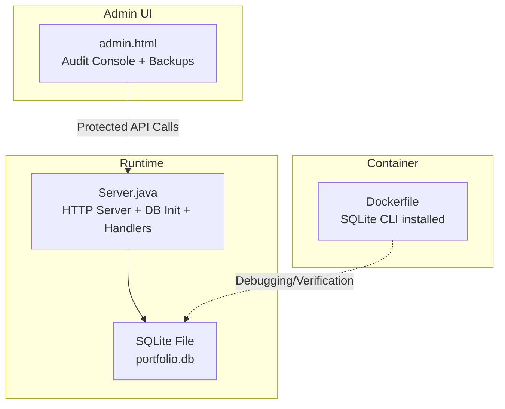
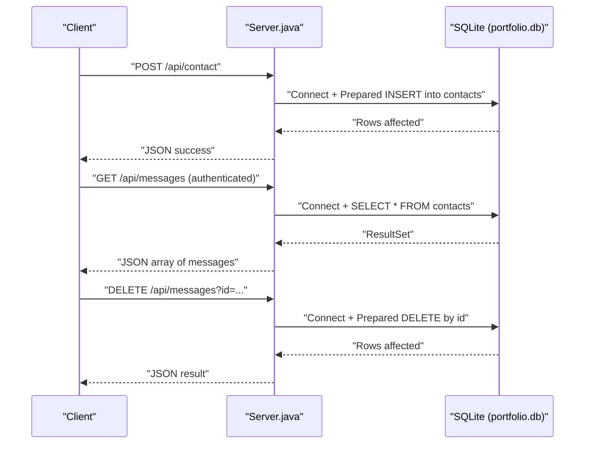
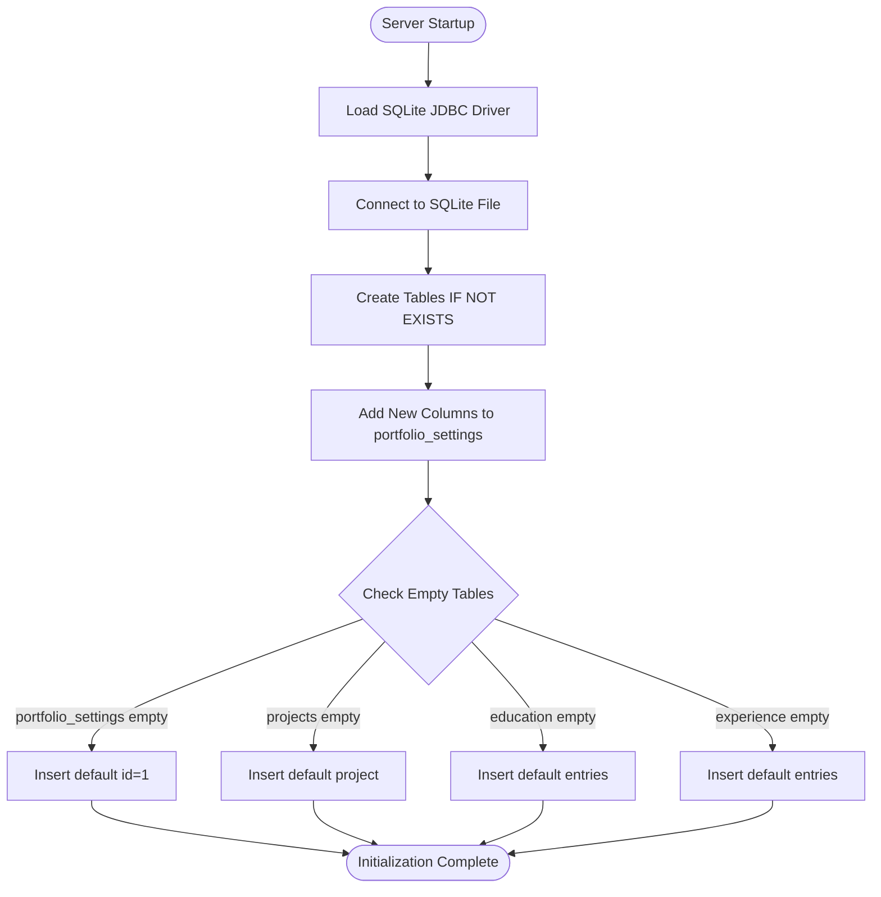
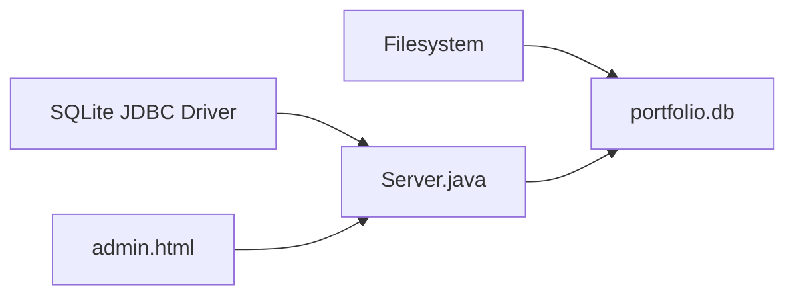

# Database Integration

<cite>
**Referenced Files in This Document**
- [Server.java](file://Server.java)
- [design.md](file://design.md)
- [admin.html](file://admin.html)
- [Dockerfile](file://Dockerfile)
</cite>

## Table of Contents
1. [Introduction](#introduction)
2. [Project Structure](#project-structure)
3. [Core Components](#core-components)
4. [Architecture Overview](#architecture-overview)
5. [Detailed Component Analysis](#detailed-component-analysis)
6. [Dependency Analysis](#dependency-analysis)
7. [Performance Considerations](#performance-considerations)
8. [Troubleshooting Guide](#troubleshooting-guide)
9. [Conclusion](#conclusion)
10. [Appendices](#appendices)

## Introduction
This document explains the database integration for the portfolio application, focusing on SQLite connectivity, schema initialization, migrations, and operational tasks. It covers how the backend initializes tables, seeds default data, and exposes protected endpoints to manage messages and bookings. It also documents the schema design, relationships, and practical guidance for backup, import/export, and maintenance. The content is accessible to beginners while providing sufficient technical depth for experienced developers.

## Project Structure
The database integration is implemented in a single Java HTTP server that embeds SQLite. Initialization and CRUD operations are handled by the main server class. The design document describes an extended schema and API that complements the current implementation.



**Diagram sources**
- [Server.java:34-83](file://Server.java#L34-L83)
- [admin.html:652-668](file://admin.html#L652-L668)
- [Dockerfile:3-4](file://Dockerfile#L3-L4)

**Section sources**
- [Server.java:18-83](file://Server.java#L18-L83)
- [admin.html:652-668](file://admin.html#L652-L668)
- [Dockerfile:3-4](file://Dockerfile#L3-L4)

## Core Components
- Database initialization routine that ensures the JDBC driver is available, connects to the SQLite file, creates tables, runs migrations, and seeds default data.
- Protected endpoints for retrieving and deleting messages and bookings, using prepared statements and result set processing.
- Public endpoint for submitting bookings, using prepared statements.
- Admin UI terminal that surfaces database connection status and logs.

Key implementation references:
- Initialization and schema creation: [initializeDatabase:85-337](file://Server.java#L85-L337)
- Contact submission (insert): [ContactHandler.handle:495-554](file://Server.java#L495-L554)
- Messages retrieval and deletion: [MessagesHandler.handle:557-644](file://Server.java#L557-L644)
- Bookings retrieval and deletion: [BookingsHandler.handle:647-736](file://Server.java#L647-L736)
- Booking submission (public): [BookingSubmitHandler.handle:739-800](file://Server.java#L739-L800)
- Admin terminal logs: [admin.html terminal:652-668](file://admin.html#L652-L668)

**Section sources**
- [Server.java:85-337](file://Server.java#L85-L337)
- [Server.java:495-554](file://Server.java#L495-L554)
- [Server.java:557-644](file://Server.java#L557-L644)
- [Server.java:647-736](file://Server.java#L647-L736)
- [Server.java:739-800](file://Server.java#L739-L800)
- [admin.html:652-668](file://admin.html#L652-L668)

## Architecture Overview
The backend uses a minimal embedded approach:
- On startup, the server initializes the SQLite database and ensures all tables exist.
- Handlers connect to the database per-request to perform inserts, selects, and deletes.
- Authentication is cookie-based; protected endpoints require a valid session cookie.



**Diagram sources**
- [Server.java:495-554](file://Server.java#L495-L554)
- [Server.java:557-644](file://Server.java#L557-L644)

## Detailed Component Analysis

### Database Initialization and Schema
The initialization routine performs:
- Driver loading for SQLite JDBC.
- Connection to the SQLite file.
- Creation of core tables: contacts, bookings, portfolio_settings, projects, education, experience.
- Column migration for portfolio_settings by adding new columns safely.
- Seeding default rows when tables are empty.



**Diagram sources**
- [Server.java:85-337](file://Server.java#L85-L337)

**Section sources**
- [Server.java:85-337](file://Server.java#L85-L337)

### Schema Design and Relationships
The current runtime schema used by the server includes:
- contacts: Stores inbound messages with timestamps.
- bookings: Stores consultation requests with date/time/topic.
- portfolio_settings: Single-row configuration table enforcing id=1.
- projects: Portfolio project entries with visibility and ordering.
- education: Educational timeline entries.
- experience: Professional experience timeline entries.

```mermaid
erDiagram
CONTACTS {
integer id PK
string name
string email
string message
timestamp created_at
}
BOOKINGS {
integer id PK
string name
string email
string booking_date
string booking_time
string topic
timestamp created_at
}
PORTFOLIO_SETTINGS {
integer id PK CK
string theme_preset
string primary_color
string secondary_color
string accent_color
string background_color
string surface_color
string font_display
string font_body
integer animations_enabled
string layout_sections_order
string seo_title
string seo_description
string analytics_id
string hero_badge
string hero_title
string hero_subtitle
string hero_description
string about_lead
string about_body
string skills_web_dev
string skills_security
string skills_languages
string contact_title
string contact_subtitle
string social_github
string social_linkedin
string social_twitter
string brand_name
string logo_text
string footer_text
string goal_1_title
string goal_1_desc
string goal_1_status
string goal_2_title
string goal_2_desc
string goal_2_status
string goal_3_title
string goal_3_desc
string goal_3_status
string contact_email
string contact_location
string contact_status
string custom_css
string custom_javascript
timestamp updated_at
}
PROJECTS {
integer id PK
string title
string description
string image_url
string github_link
string live_link
string tags
integer sort_order
integer is_visible
timestamp created_at
}
EDUCATION {
integer id PK
string degree
string institution
string timeline
string description
integer sort_order
integer is_visible
timestamp created_at
}
EXPERIENCE {
integer id PK
string role
string company
string timeline
string description
integer sort_order
integer is_visible
timestamp created_at
}
```

**Diagram sources**
- [Server.java:98-331](file://Server.java#L98-L331)

**Section sources**
- [Server.java:98-331](file://Server.java#L98-L331)

### Connection Establishment and Prepared Statements
- Connections are established per-request using the JDBC URL for SQLite.
- Prepared statements are used for inserts and deletes to prevent SQL injection.
- Result sets are processed to build JSON responses.

Concrete references:
- Connection and insert in ContactHandler: [Server.java:532-541](file://Server.java#L532-L541)
- Prepared statement usage: [Server.java:534-539](file://Server.java#L534-L539)
- Result set iteration and JSON construction: [Server.java:577-596](file://Server.java#L577-L596)
- Prepared delete with parameter binding: [Server.java:625-636](file://Server.java#L625-L636)

**Section sources**
- [Server.java:532-541](file://Server.java#L532-L541)
- [Server.java:534-539](file://Server.java#L534-L539)
- [Server.java:577-596](file://Server.java#L577-L596)
- [Server.java:625-636](file://Server.java#L625-L636)

### Result Set Processing and JSON Serialization
- Handlers execute queries and iterate over result sets.
- Values are escaped and serialized into JSON arrays for responses.
- Error handling wraps SQL exceptions and returns sanitized messages.

References:
- Messages retrieval and JSON assembly: [Server.java:574-596](file://Server.java#L574-L596)
- Booking retrieval and JSON assembly: [Server.java:664-688](file://Server.java#L664-L688)
- Error handling wrappers: [Server.java:597-600](file://Server.java#L597-L600), [Server.java:689-692](file://Server.java#L689-L692)

**Section sources**
- [Server.java:574-596](file://Server.java#L574-L596)
- [Server.java:664-688](file://Server.java#L664-L688)
- [Server.java:597-600](file://Server.java#L597-L600)
- [Server.java:689-692](file://Server.java#L689-L692)

### Authentication and Authorization
- Login endpoint sets an HttpOnly session cookie upon successful credentials.
- Protected endpoints check for the presence and value of the session cookie before responding.

References:
- Login handler and cookie setting: [Server.java:355-396](file://Server.java#L355-L396)
- Authentication check: [Server.java:339-352](file://Server.java#L339-L352)
- Protected endpoints gated by authentication: [Server.java:557-644](file://Server.java#L557-L644), [Server.java:647-736](file://Server.java#L647-L736)

**Section sources**
- [Server.java:355-396](file://Server.java#L355-L396)
- [Server.java:339-352](file://Server.java#L339-L352)
- [Server.java:557-644](file://Server.java#L557-L644)
- [Server.java:647-736](file://Server.java#L647-L736)

### Migration Handling
- The initialization routine adds new columns to portfolio_settings if missing, avoiding failures when upgrading existing databases.
- It iterates through a predefined list of new columns and executes ALTER TABLE for each.

References:
- Migration loop and column additions: [Server.java:173-214](file://Server.java#L173-L214)

**Section sources**
- [Server.java:173-214](file://Server.java#L173-L214)

### Data Seeding Procedures
- After table creation, the routine checks counts and inserts default rows when tables are empty:
  - portfolio_settings: inserts id=1 to bootstrap configuration.
  - projects: inserts a default portfolio project.
  - education: inserts multiple default entries.
  - experience: inserts multiple default entries.

References:
- Seeding logic: [Server.java:216-331](file://Server.java#L216-L331)

**Section sources**
- [Server.java:216-331](file://Server.java#L216-L331)

### Backup, Import/Export, and Maintenance
- The admin UI provides a terminal that logs database connection status and readiness.
- The admin UI includes controls for exporting and importing JSON backups.
- The design document outlines a broader schema with a dedicated history table and backup table for versioning and restoration.

References:
- Admin terminal logs: [admin.html terminal:652-668](file://admin.html#L652-L668)
- Backup UI elements: [admin.html backups section:1051-1056](file://admin.html#L1051-L1056)
- Extended schema (history and backups): [design.md schema:204-276](file://design.md#L204-L276)

**Section sources**
- [admin.html:652-668](file://admin.html#L652-L668)
- [admin.html:1051-1056](file://admin.html#L1051-L1056)
- [design.md:204-276](file://design.md#L204-L276)

## Dependency Analysis
- The server depends on the SQLite JDBC driver for connectivity.
- The server uses the local filesystem for the SQLite database file.
- The admin UI communicates with the server’s protected endpoints to manage data and perform backups.



**Diagram sources**
- [Server.java:87-92](file://Server.java#L87-L92)
- [Server.java:19](file://Server.java#L19)
- [admin.html:652-668](file://admin.html#L652-L668)

**Section sources**
- [Server.java:87-92](file://Server.java#L87-L92)
- [Server.java:19](file://Server.java#L19)
- [admin.html:652-668](file://admin.html#L652-L668)

## Performance Considerations
- Connection-per-request model is suitable for small-scale usage and simplicity.
- For higher concurrency, consider connection pooling or a lightweight pool library.
- Prepared statements are already used, which helps with performance and security.
- Keep queries simple and indexed only if needed; current tables are small and primarily used for admin operations.

[No sources needed since this section provides general guidance]

## Troubleshooting Guide
Common issues and resolutions:
- Driver not found: Ensure the SQLite JDBC driver is on the classpath. The server logs a clear message if the driver is missing.
  - Reference: [Server.java:87-92](file://Server.java#L87-L92)
- Database initialization errors: Review logs for SQL exceptions during table creation or seeding.
  - Reference: [Server.java:334-337](file://Server.java#L334-L337)
- Authentication failures: Verify the session cookie is set and matches the expected value.
  - Reference: [Server.java:355-396](file://Server.java#L355-L396), [Server.java:339-352](file://Server.java#L339-L352)
- Protected endpoint errors: Confirm the request method and that required parameters are present.
  - References: [Server.java:557-644](file://Server.java#L557-L644), [Server.java:647-736](file://Server.java#L647-L736)
- Admin UI connectivity: The terminal logs show driver and connection status; if it fails, confirm the server is running and the database file is writable.
  - Reference: [admin.html terminal:652-668](file://admin.html#L652-L668)

**Section sources**
- [Server.java:87-92](file://Server.java#L87-L92)
- [Server.java:334-337](file://Server.java#L334-L337)
- [Server.java:355-396](file://Server.java#L355-L396)
- [Server.java:339-352](file://Server.java#L339-L352)
- [Server.java:557-644](file://Server.java#L557-L644)
- [Server.java:647-736](file://Server.java#L647-L736)
- [admin.html:652-668](file://admin.html#L652-L668)

## Conclusion
The database integration uses a straightforward embedded SQLite approach with robust initialization, migrations, and seeded defaults. Protected endpoints provide secure access to admin data, while the admin UI offers operational visibility and backup controls. For production scaling, consider connection pooling and additional monitoring, but the current design is well-suited for a small-scale portfolio application.

[No sources needed since this section summarizes without analyzing specific files]

## Appendices

### Appendix A: Example References
- Connection establishment and table creation: [Server.java:94-120](file://Server.java#L94-L120)
- Migration loop: [Server.java:173-214](file://Server.java#L173-L214)
- Seeding defaults: [Server.java:216-331](file://Server.java#L216-L331)
- Prepared insert for contacts: [Server.java:532-541](file://Server.java#L532-L541)
- Result set to JSON: [Server.java:574-596](file://Server.java#L574-L596)
- Prepared delete for messages: [Server.java:625-636](file://Server.java#L625-L636)
- Public booking submit: [Server.java:739-800](file://Server.java#L739-L800)
- Admin terminal logs: [admin.html:652-668](file://admin.html#L652-L668)

**Section sources**
- [Server.java:94-120](file://Server.java#L94-L120)
- [Server.java:173-214](file://Server.java#L173-L214)
- [Server.java:216-331](file://Server.java#L216-L331)
- [Server.java:532-541](file://Server.java#L532-L541)
- [Server.java:574-596](file://Server.java#L574-L596)
- [Server.java:625-636](file://Server.java#L625-L636)
- [Server.java:739-800](file://Server.java#L739-L800)
- [admin.html:652-668](file://admin.html#L652-L668)