# Database Operations

<cite>
**Referenced Files in This Document**
- [Server.java](file://Server.java)
</cite>

## Table of Contents
1. [Introduction](#introduction)
2. [Project Structure](#project-structure)
3. [Core Components](#core-components)
4. [Architecture Overview](#architecture-overview)
5. [Detailed Component Analysis](#detailed-component-analysis)
6. [Dependency Analysis](#dependency-analysis)
7. [Performance Considerations](#performance-considerations)
8. [Troubleshooting Guide](#troubleshooting-guide)
9. [Conclusion](#conclusion)

## Introduction

This document provides comprehensive documentation for all database operations in the premium portfolio application. The system uses SQLite as the primary database engine with JDBC connectivity to manage portfolio data, contact forms, booking system, and administrative content management. The application implements robust database operations including CRUD operations across multiple tables, prepared statement usage for security, result set processing, JSON serialization, transaction handling, and comprehensive error management.

The database architecture consists of five main tables: contacts, bookings, portfolio_settings, projects, education, and experience. Each table serves a specific purpose in managing different aspects of the portfolio website, from visitor communications to professional experiences.

## Project Structure

The database operations are implemented entirely within a single Java class that serves as both the HTTP server and database manager. The structure follows a modular approach with dedicated handler classes for different API endpoints, each containing specific database operation logic.

```mermaid
graph TB
subgraph "Application Server"
Server[Server.java]
Handlers[HTTP Handlers]
DB[SQLite Database]
end
subgraph "Database Tables"
Contacts[contacts]
Bookings[bookings]
Settings[portfolio_settings]
Projects[projects]
Education[education]
Experience[experience]
end
subgraph "API Endpoints"
ContactAPI[/api/contact]
BookingAPI[/api/booking-submit]
LoginAPI[/api/login]
MessagesAPI[/api/messages]
BookingsAPI[/api/bookings]
SettingsAPI[/api/settings]
ProjectsAPI[/api/projects-crud]
EducationAPI[/api/education-crud]
ExperienceAPI[/api/experience-crud]
end
Server --> Handlers
Handlers --> DB
DB --> Contacts
DB --> Bookings
DB --> Settings
DB --> Projects
DB --> Education
DB --> Experience
Handlers --> ContactAPI
Handlers --> BookingAPI
Handlers --> LoginAPI
Handlers --> MessagesAPI
Handlers --> BookingsAPI
Handlers --> SettingsAPI
Handlers --> ProjectsAPI
Handlers --> EducationAPI
Handlers --> ExperienceAPI
```

**Diagram sources**
- [Server.java:18-83](file://Server.java#L18-L83)
- [Server.java:85-337](file://Server.java#L85-L337)

**Section sources**
- [Server.java:18-83](file://Server.java#L18-L83)
- [Server.java:85-337](file://Server.java#L85-L337)

## Core Components

The database system is built around several key components that work together to provide comprehensive data management capabilities:

### Database Initialization and Schema Management

The application automatically initializes the database during startup, creating all necessary tables with appropriate constraints and default values. The initialization process handles schema migrations for existing databases and seeds default data when tables are empty.

### Handler-Based Architecture

Each API endpoint is implemented as a separate handler class that encapsulates specific database operations. This design provides clear separation of concerns and makes the codebase maintainable and extensible.

### Connection Management

The system uses individual database connections for each request, ensuring thread safety and preventing connection pooling overhead. Connections are properly managed using try-with-resources blocks for automatic cleanup.

**Section sources**
- [Server.java:85-337](file://Server.java#L85-L337)
- [Server.java:18-83](file://Server.java#L18-L83)

## Architecture Overview

The database architecture follows a straightforward pattern where each HTTP handler performs database operations and returns JSON responses. The system maintains security through prepared statements and implements comprehensive error handling.

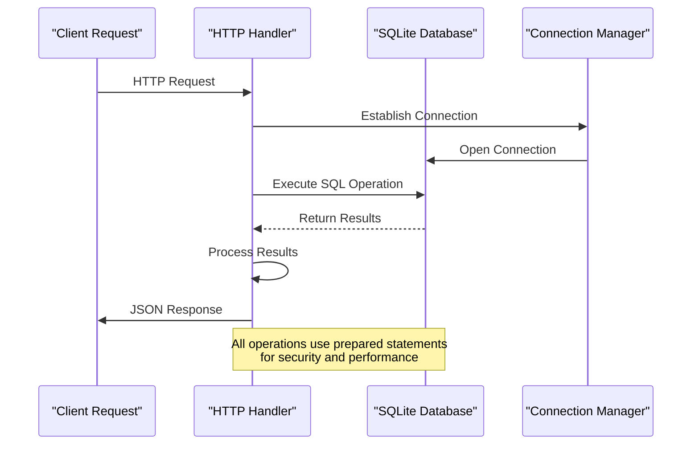

**Diagram sources**
- [Server.java:533-541](file://Server.java#L533-L541)
- [Server.java:575-596](file://Server.java#L575-L596)

## Detailed Component Analysis

### Database Schema Design

The application manages six distinct tables, each designed for specific data storage requirements:

#### Contacts Table
Stores visitor messages and inquiries with automatic timestamping and validation constraints.

#### Bookings Table  
Manages consultation scheduling with date and time validation.

#### Portfolio Settings Table
Contains all customizable website configuration data with extensive field coverage for theming and content management.

#### Projects Table
Handles portfolio project entries with visibility controls and sorting capabilities.

#### Education Table
Manages educational background information with timeline and description fields.

#### Experience Table
Stores professional experience details with role and company information.

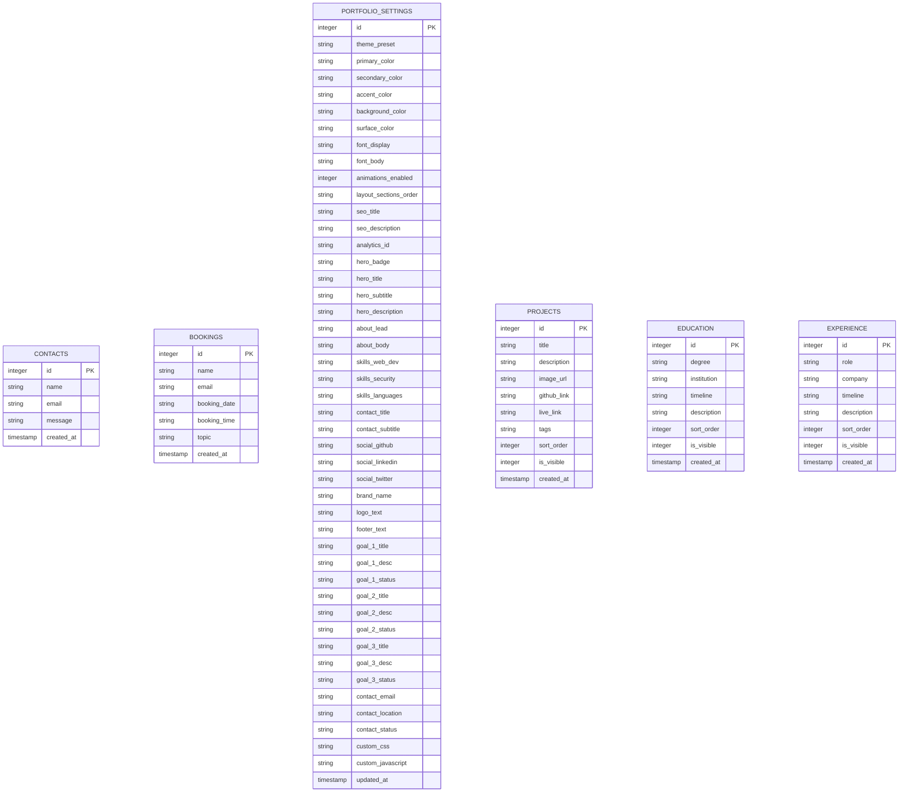

**Diagram sources**
- [Server.java:98-105](file://Server.java#L98-L105)
- [Server.java:109-118](file://Server.java#L109-L118)
- [Server.java:122-170](file://Server.java#L122-L170)
- [Server.java:227-239](file://Server.java#L227-L239)
- [Server.java:255-265](file://Server.java#L255-L265)
- [Server.java:294-304](file://Server.java#L294-L304)

### CRUD Operations Implementation

#### Contact Form Operations

The contact form system implements a complete CRUD interface for managing visitor messages:

**CREATE Operation (INSERT)**
- Uses prepared statements with parameter binding
- Validates required fields before insertion
- Returns success/error responses with proper JSON formatting

**READ Operations (SELECT)**
- Implements both individual record retrieval and bulk listing
- Supports pagination through ordering and limit clauses
- Processes result sets efficiently with streaming JSON generation

**DELETE Operations**
- Implements soft delete patterns through ID-based deletion
- Provides feedback on successful/deletion operations
- Handles cases where records don't exist

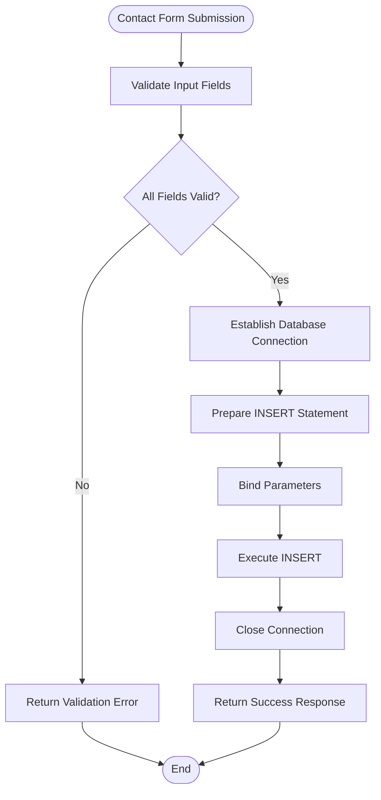

**Diagram sources**
- [Server.java:532-541](file://Server.java#L532-L541)
- [Server.java:574-596](file://Server.java#L574-L596)

**Section sources**
- [Server.java:532-541](file://Server.java#L532-L541)
- [Server.java:574-596](file://Server.java#L574-L596)

#### Booking System Operations

The booking system extends the contact form functionality with specialized date/time handling:

**CREATE Operation**
- Extends contact form with booking-specific fields
- Validates date/time combinations for logical consistency
- Stores consultation requests with automatic timestamping

**READ Operations**
- Lists all bookings with chronological ordering
- Supports filtering through query parameters
- Returns structured JSON with booking details

**DELETE Operations**
- Removes booking records by ID
- Provides feedback on deletion outcomes
- Handles missing record scenarios gracefully

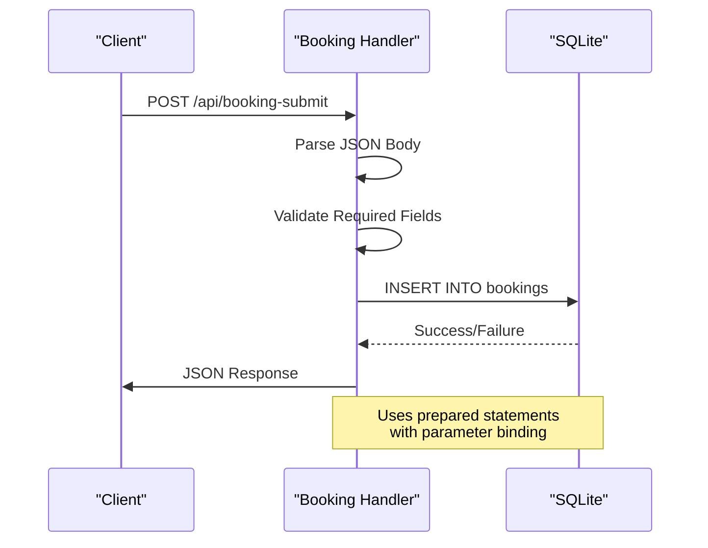

**Diagram sources**
- [Server.java:778-789](file://Server.java#L778-L789)
- [Server.java:663-688](file://Server.java#L663-L688)

**Section sources**
- [Server.java:778-789](file://Server.java#L778-L789)
- [Server.java:663-688](file://Server.java#L663-L688)

#### Portfolio Settings Management

The settings management system provides comprehensive configuration control:

**READ Operation**
- Retrieves complete settings bundle in a single request
- Combines data from multiple sources (settings, projects, education, experience)
- Returns structured JSON with all portfolio data

**UPDATE Operation**
- Implements selective updates using COALESCE and NULLIF functions
- Handles mixed data types (strings, integers, booleans)
- Updates timestamps automatically on changes

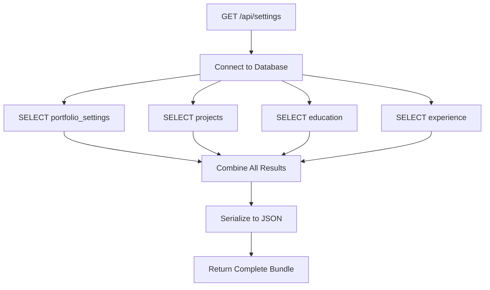

**Diagram sources**
- [Server.java:918-1057](file://Server.java#L918-L1057)

**Section sources**
- [Server.java:918-1057](file://Server.java#L918-L1057)

#### Content Management Operations

The CRUD handlers for projects, education, and experience provide comprehensive content management:

**CREATE Operations**
- Insert new records with validation
- Handle optional fields with default values
- Support image URLs and external links

**UPDATE Operations**
- Modify existing records selectively
- Handle boolean flags and numeric fields
- Preserve existing data when fields are omitted

**DELETE Operations**
- Remove records by ID
- Provide immediate feedback
- Handle missing records gracefully

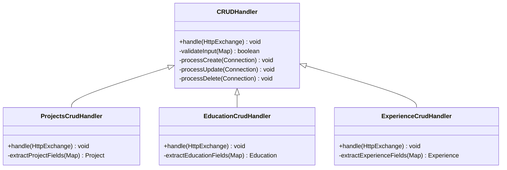

**Diagram sources**
- [Server.java:1252-1377](file://Server.java#L1252-L1377)
- [Server.java:1379-1497](file://Server.java#L1379-L1497)
- [Server.java:1500-1618](file://Server.java#L1500-L1618)

**Section sources**
- [Server.java:1252-1377](file://Server.java#L1252-L1377)
- [Server.java:1379-1497](file://Server.java#L1379-L1497)
- [Server.java:1500-1618](file://Server.java#L1500-L1618)

### Prepared Statement Usage and Security

The application implements comprehensive security measures through prepared statements and input validation:

#### Parameter Binding
All database operations use PreparedStatement objects with parameter binding to prevent SQL injection attacks. Parameters are bound using type-safe methods (setString, setInt, setNull) rather than string concatenation.

#### Input Validation
Input validation occurs at multiple levels:
- HTTP method validation (GET, POST, DELETE)
- Authentication checks for protected endpoints
- Field validation for required parameters
- Type conversion validation for numeric fields

#### Output Escaping
All database output is properly escaped for JSON serialization using the escapeJson method, which handles special characters, Unicode sequences, and control characters.

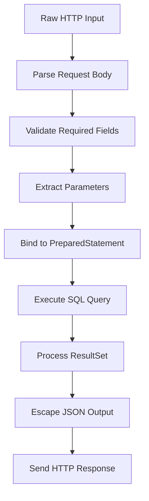

**Diagram sources**
- [Server.java:413-466](file://Server.java#L413-L466)
- [Server.java:469-492](file://Server.java#L469-L492)

**Section sources**
- [Server.java:413-466](file://Server.java#L413-L466)
- [Server.java:469-492](file://Server.java#L469-L492)

### Result Set Processing and JSON Serialization

The application implements efficient result set processing with streaming JSON generation:

#### Streaming JSON Generation
Large result sets are processed using StringBuilder to avoid memory overhead. Each record is serialized individually and appended to the JSON array, enabling efficient memory usage for large datasets.

#### Data Type Handling
Different data types are handled appropriately:
- String fields use escapeJson for proper JSON encoding
- Numeric fields are passed as-is
- Boolean flags are converted to integers (0/1)
- Timestamps are returned as ISO format strings

#### Error Handling in Processing
Result set processing includes comprehensive error handling for malformed data, missing fields, and type conversion errors.

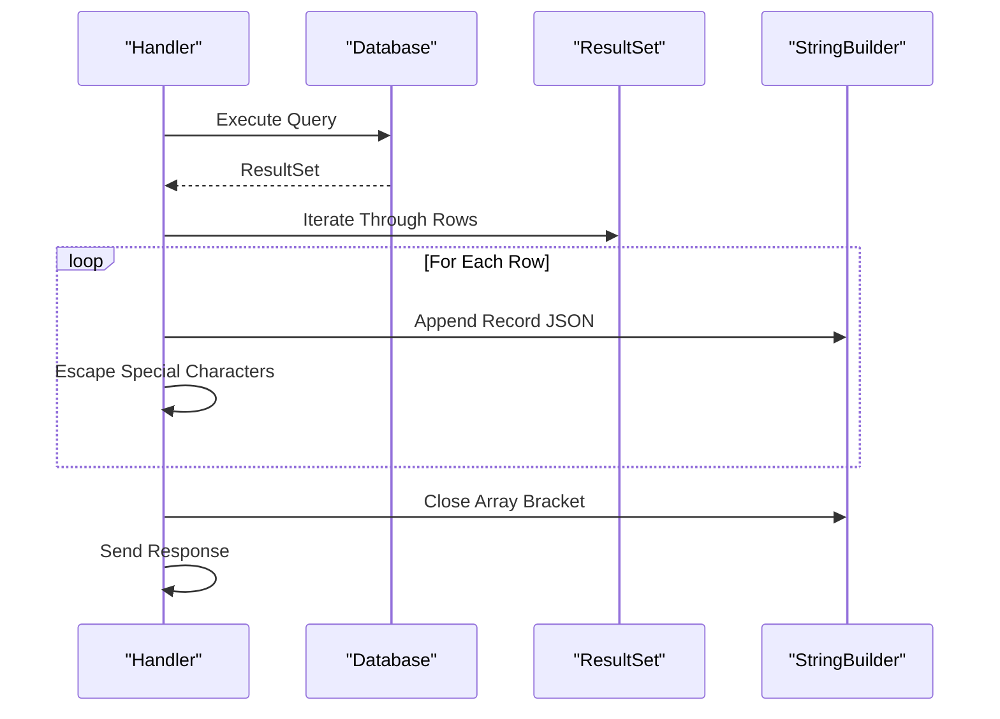

**Diagram sources**
- [Server.java:575-596](file://Server.java#L575-L596)
- [Server.java:925-977](file://Server.java#L925-L977)

**Section sources**
- [Server.java:575-596](file://Server.java#L575-L596)
- [Server.java:925-977](file://Server.java#L925-L977)

### Transaction Handling and Error Management

#### Connection Management
Each database operation establishes its own connection using try-with-resources blocks, ensuring automatic cleanup and preventing connection leaks. This approach provides thread safety and prevents connection pooling overhead.

#### Error Handling Strategy
The application implements a layered error handling approach:
- SQL exceptions are caught and converted to user-friendly JSON responses
- Input validation errors return 400 status codes with descriptive messages
- Authentication failures return 401 status codes
- Method not allowed returns 405 status codes
- Internal server errors return 500 status codes

#### Resource Cleanup
All database resources (Connections, Statements, ResultSets) are properly closed using try-with-resources blocks, ensuring no resource leaks occur even in error conditions.

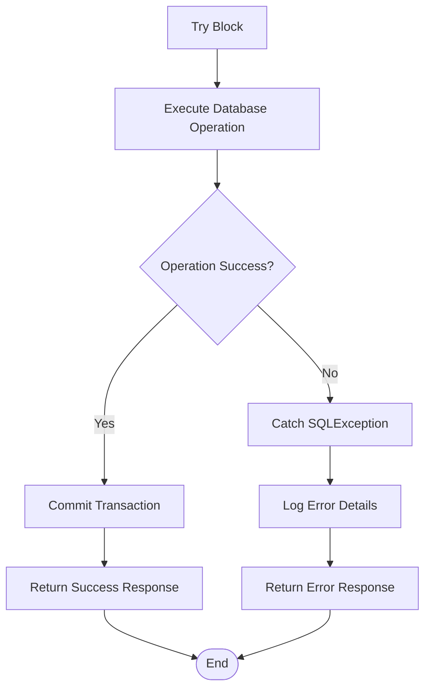

**Diagram sources**
- [Server.java:546-552](file://Server.java#L546-L552)
- [Server.java:597-600](file://Server.java#L597-L600)

**Section sources**
- [Server.java:546-552](file://Server.java#L546-L552)
- [Server.java:597-600](file://Server.java#L597-L600)

### Complex Queries and Filtering

The application implements sophisticated query patterns for advanced data retrieval:

#### Multi-Table Queries
The settings endpoint demonstrates complex data aggregation by combining data from multiple tables (portfolio_settings, projects, education, experience) into a single JSON response.

#### Sorting and Ordering
Queries implement appropriate sorting mechanisms:
- Contacts ordered by creation timestamp (newest first)
- Bookings ordered by date and time (chronological)
- Portfolio items ordered by sort_order field

#### Filtering Patterns
The system implements flexible filtering through:
- ID-based filtering for single record retrieval
- Visibility flags for content filtering
- Date range filtering for booking queries

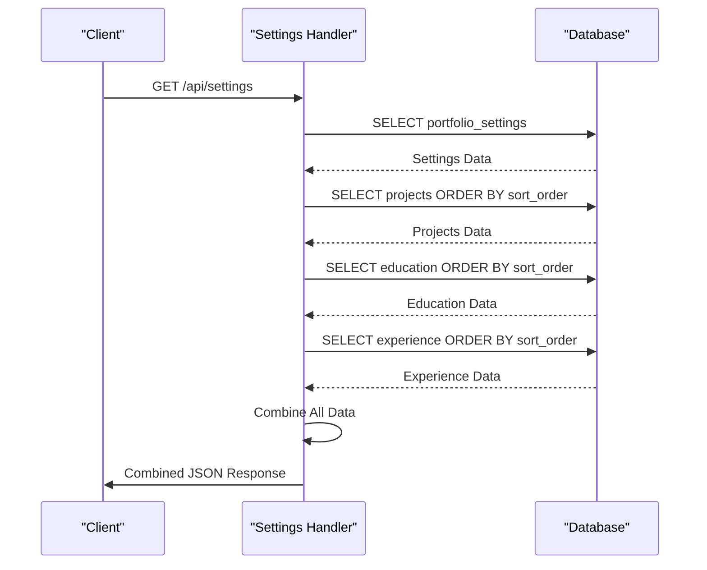

**Diagram sources**
- [Server.java:918-1057](file://Server.java#L918-L1057)

**Section sources**
- [Server.java:918-1057](file://Server.java#L918-L1057)

## Dependency Analysis

The database operations exhibit a well-structured dependency hierarchy with clear separation of concerns:

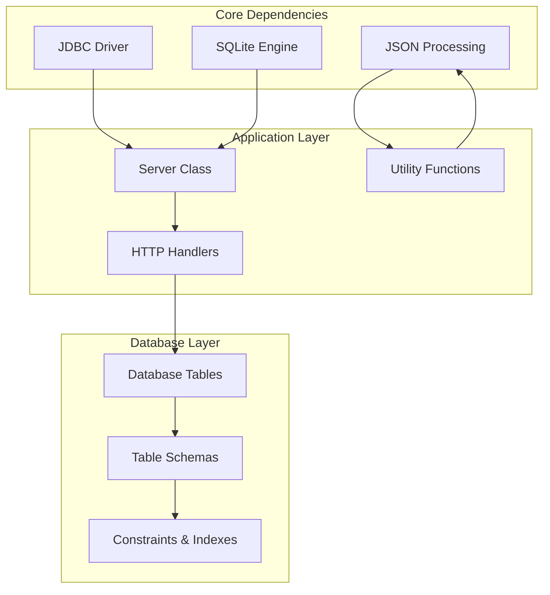

**Diagram sources**
- [Server.java:12-16](file://Server.java#L12-L16)
- [Server.java:85-337](file://Server.java#L85-L337)

The dependency analysis reveals:
- **Low Coupling**: Each handler operates independently with minimal cross-dependencies
- **High Cohesion**: Related database operations are grouped within specific handler classes
- **Clear Interfaces**: Database operations follow consistent patterns across all handlers
- **Resource Management**: Proper cleanup ensures no circular dependencies

**Section sources**
- [Server.java:12-16](file://Server.java#L12-L16)
- [Server.java:85-337](file://Server.java#L85-L337)

## Performance Considerations

### Connection Pooling Strategy
The application uses individual connections per request rather than connection pooling. This approach provides:
- Thread safety without synchronization overhead
- Automatic connection cleanup
- Simpler error recovery
- Lower memory footprint for small-scale applications

### Query Optimization
Several optimization strategies are implemented:
- Prepared statements reduce query compilation overhead
- Parameter binding prevents SQL injection while maintaining performance
- Efficient result set processing minimizes memory usage
- Appropriate indexing through PRIMARY KEY constraints

### Memory Management
The system implements memory-efficient patterns:
- Streaming JSON generation for large result sets
- Try-with-resources blocks for automatic resource cleanup
- Minimal object creation during data processing
- Proper character encoding handling

## Troubleshooting Guide

### Common Database Issues

#### Connection Problems
- **Symptom**: Database initialization fails during startup
- **Cause**: Missing JDBC driver or incorrect database URL
- **Solution**: Verify SQLite JDBC driver is on classpath and database file path is correct

#### Permission Issues
- **Symptom**: Cannot create or modify database tables
- **Cause**: Insufficient file system permissions
- **Solution**: Ensure write permissions for the application directory

#### Data Integrity Errors
- **Symptom**: Constraint violations during insert/update operations
- **Cause**: Invalid data types or constraint violations
- **Solution**: Validate input data and check table constraints

### Error Response Patterns

The application provides structured error responses:
- **Validation Errors**: 400 status with field-specific error messages
- **Authentication Errors**: 401 status for unauthorized access attempts
- **Database Errors**: 500 status with sanitized error messages
- **Method Errors**: 405 status for unsupported HTTP methods

### Debugging Strategies

For database-related debugging:
1. Enable detailed logging in the initialization phase
2. Monitor SQL query execution timing
3. Validate input parameter types and formats
4. Check database file integrity regularly

**Section sources**
- [Server.java:546-552](file://Server.java#L546-L552)
- [Server.java:597-600](file://Server.java#L597-L600)
- [Server.java:794-800](file://Server.java#L794-L800)

## Conclusion

The database operations in this premium portfolio application demonstrate robust implementation of modern database design principles. The system successfully balances security, performance, and maintainability through careful use of prepared statements, proper resource management, and comprehensive error handling.

Key strengths of the implementation include:
- **Security**: Comprehensive protection against SQL injection through prepared statements
- **Maintainability**: Clear separation of concerns with dedicated handler classes
- **Performance**: Efficient resource management and memory usage patterns
- **Reliability**: Comprehensive error handling and graceful degradation
- **Extensibility**: Modular design allows easy addition of new features

The application serves as an excellent example of practical database implementation in a production environment, demonstrating how to balance simplicity with robustness in database operations.