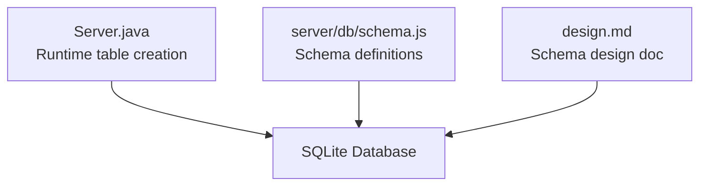
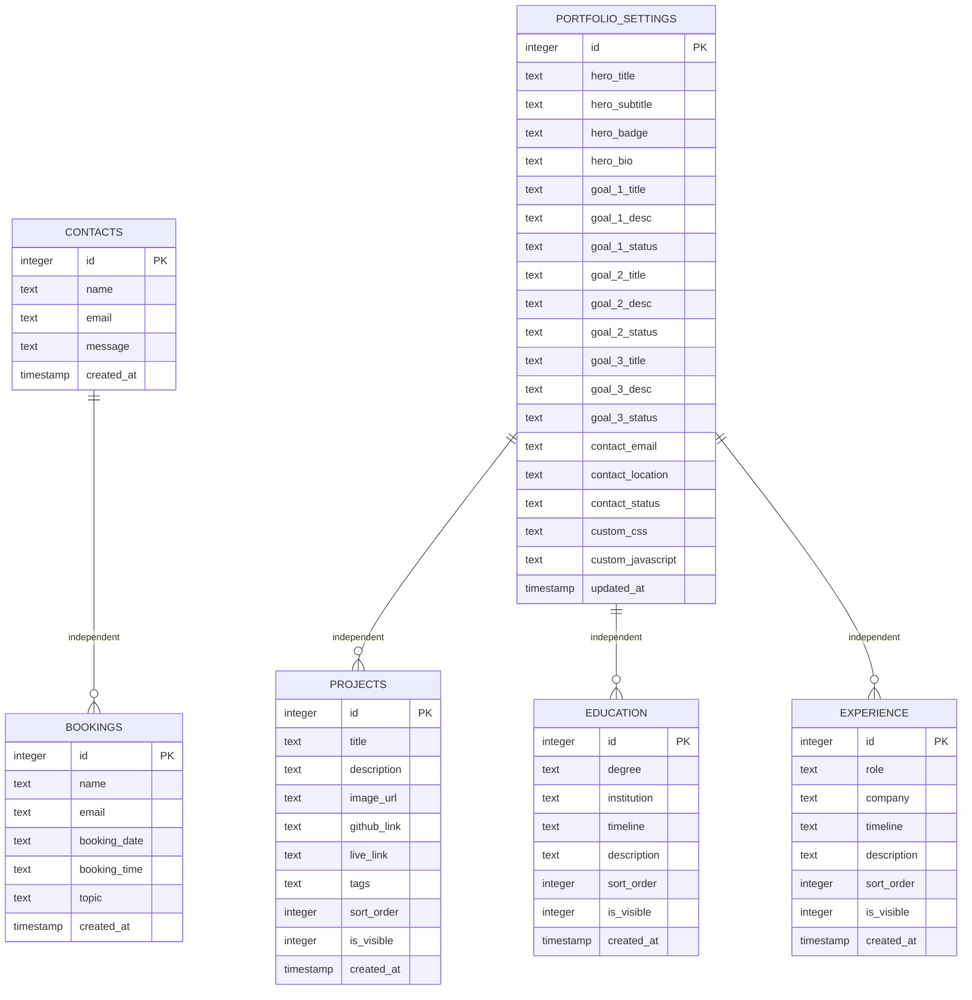
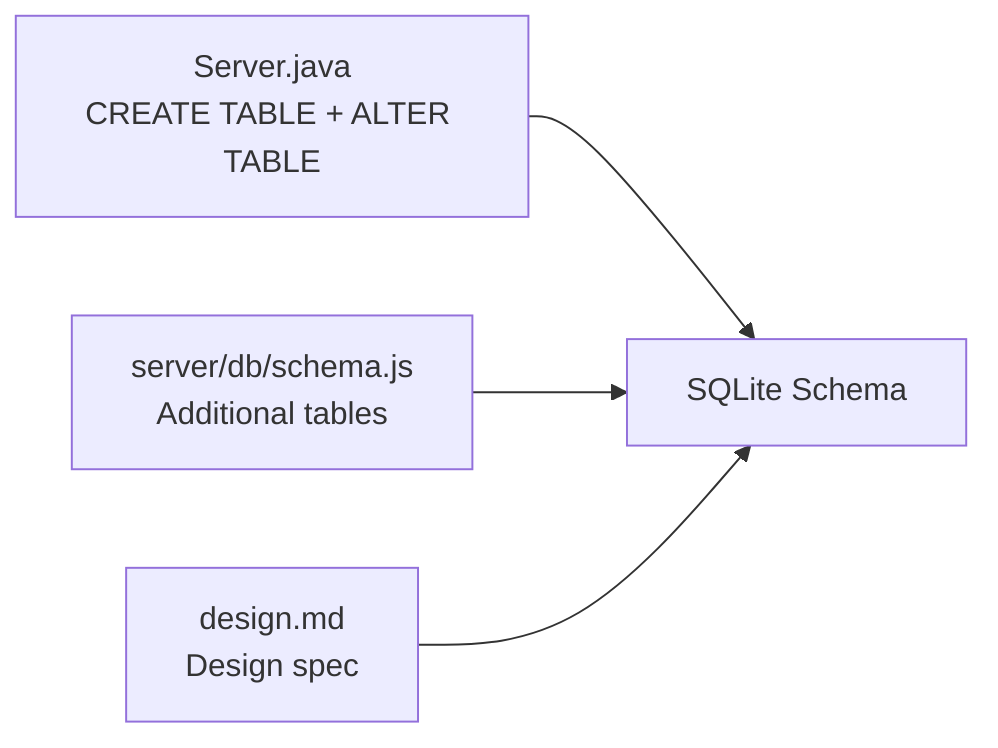

# Database Schema Design

<cite>
**Referenced Files in This Document**
- [Server.java](file://Server.java)
- [design.md](file://design.md)
- [schema.js](file://server/db/schema.js)
</cite>

## Table of Contents
1. [Introduction](#introduction)
2. [Project Structure](#project-structure)
3. [Core Components](#core-components)
4. [Architecture Overview](#architecture-overview)
5. [Detailed Component Analysis](#detailed-component-analysis)
6. [Dependency Analysis](#dependency-analysis)
7. [Performance Considerations](#performance-considerations)
8. [Troubleshooting Guide](#troubleshooting-guide)
9. [Conclusion](#conclusion)

## Introduction
This document describes the SQLite database schema used by the portfolio application. It focuses on the core tables that support the portfolio ecosystem: contacts, bookings, portfolio_settings, projects, education, and experience. For each table, we define structure, fields, data types, constraints, defaults, and relationships. We also explain the purpose of each table, validation rules, and provide examples of typical entries. Where applicable, we include the table creation SQL statements derived from the repository.

## Project Structure
The schema is primarily defined in two locations:
- Java server initialization script that creates tables at runtime
- JavaScript schema file that defines additional tables and migration steps
- Design document that outlines the intended schema and additional entities

**Diagram sources**
- [Server.java:94-266](file://Server.java#L94-L266)
- [schema.js:1-200](file://server/db/schema.js#L1-L200)
- [design.md:200-270](file://design.md#L200-L270)

**Section sources**
- [Server.java:94-266](file://Server.java#L94-L266)
- [schema.js:1-200](file://server/db/schema.js#L1-L200)
- [design.md:200-270](file://design.md#L200-L270)

## Core Components
This section documents the six core tables used by the portfolio application.

### Contacts
Purpose: Store incoming messages from visitors via the contact form.

Fields:
- id: INTEGER PRIMARY KEY AUTOINCREMENT
- name: TEXT NOT NULL
- email: TEXT NOT NULL
- message: TEXT NOT NULL
- created_at: TIMESTAMP DEFAULT CURRENT_TIMESTAMP

Constraints and Defaults:
- All core fields are required (NOT NULL)
- created_at defaults to current timestamp

Typical Entry Example:
- name: "Alex Johnson"
- email: "alex.johnson@example.com"
- message: "Looking forward to collaborating!"

Validation Rules:
- Enforced by NOT NULL constraints
- Email format is not validated at the database level

**Section sources**
- [Server.java:98-107](file://Server.java#L98-L107)
- [schema.js:7-12](file://server/db/schema.js#L7-L12)

### Bookings
Purpose: Manage appointment requests with date, time, and topic.

Fields:
- id: INTEGER PRIMARY KEY AUTOINCREMENT
- name: TEXT NOT NULL
- email: TEXT NOT NULL
- booking_date: TEXT NOT NULL
- booking_time: TEXT NOT NULL
- topic: TEXT NOT NULL
- created_at: TIMESTAMP DEFAULT CURRENT_TIMESTAMP

Constraints and Defaults:
- All core fields are required (NOT NULL)
- created_at defaults to current timestamp

Typical Entry Example:
- name: "Sam Smith"
- email: "sam.smith@example.com"
- booking_date: "2025-06-15"
- booking_time: "14:30"
- topic: "Consultation"

Validation Rules:
- Enforced by NOT NULL constraints
- Date/time are stored as TEXT; validation occurs at application level

**Section sources**
- [Server.java:110-119](file://Server.java#L110-L119)
- [schema.js:15-22](file://server/db/schema.js#L15-L22)

### Portfolio Settings
Purpose: Centralized configuration and theming for the portfolio site.

Fields:
- id: INTEGER PRIMARY KEY AUTOINCREMENT
- hero_title: TEXT DEFAULT "Welcome to My Portfolio"
- hero_subtitle: TEXT DEFAULT "Full Stack Developer & UI/UX Designer"
- hero_badge: TEXT DEFAULT "First-year CSE student · Bhilai, CG"
- hero_bio: TEXT DEFAULT "Passionate about building scalable web applications and intuitive user experiences."
- goal_1_title: TEXT DEFAULT "Goal #1"
- goal_1_desc: TEXT DEFAULT "🌍 Explore the world. See cultures, taste cuisines, and broaden my horizons."
- goal_1_status: TEXT DEFAULT "Dreaming Big"
- goal_2_title: TEXT DEFAULT "Goal #2"
- goal_2_desc: TEXT DEFAULT "💻 Build impactful software. Create solutions that improve lives and streamline workflows."
- goal_2_status: TEXT DEFAULT "In Progress"
- goal_3_title: TEXT DEFAULT "Goal #3"
- goal_3_desc: TEXT DEFAULT "🇮🇳 Serve the Nation. Use my skills in cybersecurity and software development to contribute to India's digital safety and infrastructure. Code is my weapon; protection is my purpose."
- goal_3_status: TEXT DEFAULT "The Why"
- contact_email: TEXT DEFAULT "mradityasoni.cse@gmail.com"
- contact_location: TEXT DEFAULT "Bhilai, Chhattisgarh 🇮🇳"
- contact_status: TEXT DEFAULT "Open to Opportunities"
- custom_css: TEXT DEFAULT ""
- custom_javascript: TEXT DEFAULT ""
- updated_at: TIMESTAMP DEFAULT CURRENT_TIMESTAMP

Constraints and Defaults:
- All fields are optional except id
- Many fields have sensible defaults for quick setup
- updated_at defaults to current timestamp

Typical Entry Example:
- hero_title: "Welcome to My Portfolio"
- contact_email: "hire@youremail.com"
- custom_css: ".hero { background-color: blue; }"

Validation Rules:
- Enforced by defaults; application-level validation may apply for formats (e.g., email)

**Section sources**
- [Server.java:122-171](file://Server.java#L122-L171)
- [design.md:214-232](file://design.md#L214-L232)

### Projects
Purpose: Showcase personal and professional work with metadata and links.

Fields:
- id: INTEGER PRIMARY KEY AUTOINCREMENT
- title: TEXT NOT NULL
- description: TEXT NOT NULL
- image_url: TEXT DEFAULT ""
- github_link: TEXT DEFAULT ""
- live_link: TEXT DEFAULT ""
- tags: TEXT DEFAULT ""
- sort_order: INTEGER DEFAULT 0
- is_visible: INTEGER DEFAULT 1
- created_at: TIMESTAMP DEFAULT CURRENT_TIMESTAMP

Constraints and Defaults:
- title and description are required
- Visibility controlled by is_visible (1 visible, 0 hidden)
- sort_order enables ordering
- created_at defaults to current timestamp

Typical Entry Example:
- title: "E-commerce Platform"
- description: "Full-stack online shopping solution with payment integration."
- github_link: "https://github.com/user/project"
- live_link: "https://demo.example.com"
- tags: "React, Node.js, PostgreSQL"
- sort_order: 1
- is_visible: 1

Validation Rules:
- Enforced by NOT NULL and DEFAULT constraints

**Section sources**
- [Server.java:227-240](file://Server.java#L227-L240)
- [schema.js:74-86](file://server/db/schema.js#L74-L86)

### Education
Purpose: Record academic qualifications and training history.

Fields:
- id: INTEGER PRIMARY KEY AUTOINCREMENT
- degree: TEXT NOT NULL
- institution: TEXT NOT NULL
- timeline: TEXT NOT NULL
- description: TEXT DEFAULT ""
- sort_order: INTEGER DEFAULT 0
- is_visible: INTEGER DEFAULT 1
- created_at: TIMESTAMP DEFAULT CURRENT_TIMESTAMP

Constraints and Defaults:
- degree, institution, and timeline are required
- description is optional
- visibility controlled by is_visible
- created_at defaults to current timestamp

Typical Entry Example:
- degree: "Bachelor of Computer Science"
- institution: "University Name"
- timeline: "2020 – 2024"
- description: "Specialized in Software Engineering"
- sort_order: 1
- is_visible: 1

Validation Rules:
- Enforced by NOT NULL and DEFAULT constraints

**Section sources**
- [Server.java:255-266](file://Server.java#L255-L266)
- [schema.js:87-97](file://server/db/schema.js#L87-L97)

### Experience
Purpose: Capture professional work history and roles.

Fields:
- id: INTEGER PRIMARY KEY AUTOINCREMENT
- role: TEXT NOT NULL
- company: TEXT NOT NULL
- timeline: TEXT NOT NULL
- description: TEXT DEFAULT ""
- sort_order: INTEGER DEFAULT 0
- is_visible: INTEGER DEFAULT 1
- created_at: TIMESTAMP DEFAULT CURRENT_TIMESTAMP

Constraints and Defaults:
- role, company, and timeline are required
- description is optional
- visibility controlled by is_visible
- created_at defaults to current timestamp

Typical Entry Example:
- role: "Software Engineer Intern"
- company: "Tech Corp"
- timeline: "Summer 2023"
- description: "Developed internal tools and improved CI/CD pipelines."
- sort_order: 1
- is_visible: 1

Validation Rules:
- Enforced by NOT NULL and DEFAULT constraints

**Section sources**
- [Server.java:294-305](file://Server.java#L294-L305)
- [schema.js:98-110](file://server/db/schema.js#L98-L110)

## Architecture Overview
The schema supports a static portfolio website with dynamic content managed through settings and collections (projects, education, experience). There are no explicit foreign keys among the core tables documented here, indicating a denormalized design optimized for simplicity and single-table operations.

**Diagram sources**
- [Server.java:98-107](file://Server.java#L98-L107)
- [Server.java:110-119](file://Server.java#L110-L119)
- [Server.java:122-171](file://Server.java#L122-L171)
- [Server.java:227-240](file://Server.java#L227-L240)
- [Server.java:255-266](file://Server.java#L255-L266)
- [Server.java:294-305](file://Server.java#L294-L305)

## Detailed Component Analysis

### Table Creation Scripts
Below are the complete table creation statements as implemented in the repository. These reflect the current schema and defaults.

- Contacts
  - [Server.java:98-107](file://Server.java#L98-L107)
  - [schema.js:7-12](file://server/db/schema.js#L7-L12)

- Bookings
  - [Server.java:110-119](file://Server.java#L110-L119)
  - [schema.js:15-22](file://server/db/schema.js#L15-L22)

- Portfolio Settings
  - [Server.java:122-171](file://Server.java#L122-L171)
  - [design.md:214-232](file://design.md#L214-L232)

- Projects
  - [Server.java:227-240](file://Server.java#L227-L240)
  - [schema.js:74-86](file://server/db/schema.js#L74-L86)

- Education
  - [Server.java:255-266](file://Server.java#L255-L266)
  - [schema.js:87-97](file://server/db/schema.js#L87-L97)

- Experience
  - [Server.java:294-305](file://Server.java#L294-L305)
  - [schema.js:98-110](file://server/db/schema.js#L98-L110)

### Data Validation Rules and Business Logic Constraints
- NOT NULL constraints ensure required fields are populated at insert time.
- DEFAULT values provide sensible fallbacks for optional fields, reducing configuration overhead.
- Visibility toggles (is_visible) enable content curation without deletion.
- Sort orders (sort_order) allow deterministic presentation.
- Timestamps (created_at, updated_at) track record lifecycle.
- No explicit foreign keys imply loose coupling between entities; referential integrity is not enforced at the database level for these core tables.

### Typical Data Entries
- Contacts: name, email, message
- Bookings: name, email, booking_date, booking_time, topic
- Portfolio Settings: hero_title, contact_email, custom_css, etc.
- Projects: title, description, links, tags, sort_order, is_visible
- Education: degree, institution, timeline, description, sort_order, is_visible
- Experience: role, company, timeline, description, sort_order, is_visible

**Section sources**
- [Server.java:98-107](file://Server.java#L98-L107)
- [Server.java:110-119](file://Server.java#L110-L119)
- [Server.java:122-171](file://Server.java#L122-L171)
- [Server.java:227-240](file://Server.java#L227-L240)
- [Server.java:255-266](file://Server.java#L255-L266)
- [Server.java:294-305](file://Server.java#L294-L305)

## Dependency Analysis
- Runtime creation: The Java server initializes and verifies tables at startup, ensuring schema consistency.
- Additional tables: The JavaScript schema file defines supplementary entities (users, sessions, pages, sections, media, etc.) that extend the system but are outside the scope of this document’s objective.
- Migration steps: The Java server includes ALTER TABLE commands to add new columns to existing databases, preserving backward compatibility.

**Diagram sources**
- [Server.java:94-266](file://Server.java#L94-L266)
- [schema.js:1-200](file://server/db/schema.js#L1-L200)
- [design.md:200-270](file://design.md#L200-L270)

**Section sources**
- [Server.java:94-266](file://Server.java#L94-L266)
- [schema.js:1-200](file://server/db/schema.js#L1-L200)
- [design.md:200-270](file://design.md#L200-L270)

## Performance Considerations
- Denormalized design simplifies queries and reduces joins.
- DEFAULT values minimize storage overhead for optional fields.
- Timestamps enable efficient sorting and filtering.
- Consider adding indexes on frequently filtered columns (e.g., is_visible, sort_order) if query volume grows.

## Troubleshooting Guide
- Missing tables: The Java server recreates missing tables on startup. Verify connectivity and permissions.
- Data type mismatches: Bookings store dates/times as TEXT; ensure consistent formatting in client code.
- Visibility issues: Toggle is_visible to hide/show records without altering content.
- Schema drift: Use ALTER TABLE steps to add new columns; preserve existing data.

**Section sources**
- [Server.java:94-266](file://Server.java#L94-L266)

## Conclusion
The portfolio schema emphasizes simplicity and flexibility, with clear separation of concerns across contacts, bookings, settings, projects, education, and experience. While no foreign keys are present among the core tables, defaults, visibility flags, and timestamps provide robust operational controls. The design supports rapid iteration and easy maintenance, with explicit migration steps to evolve the schema over time.