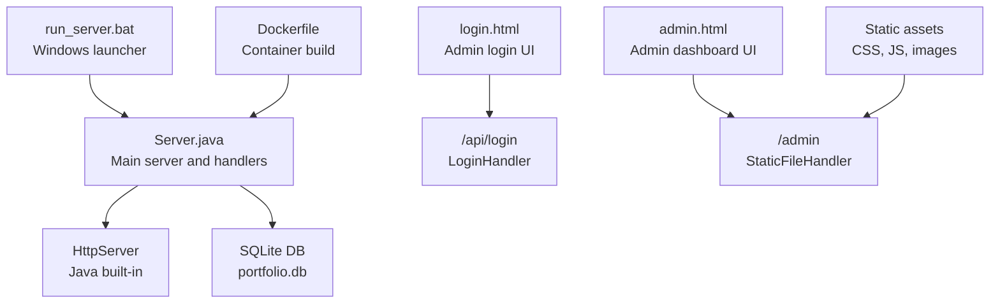
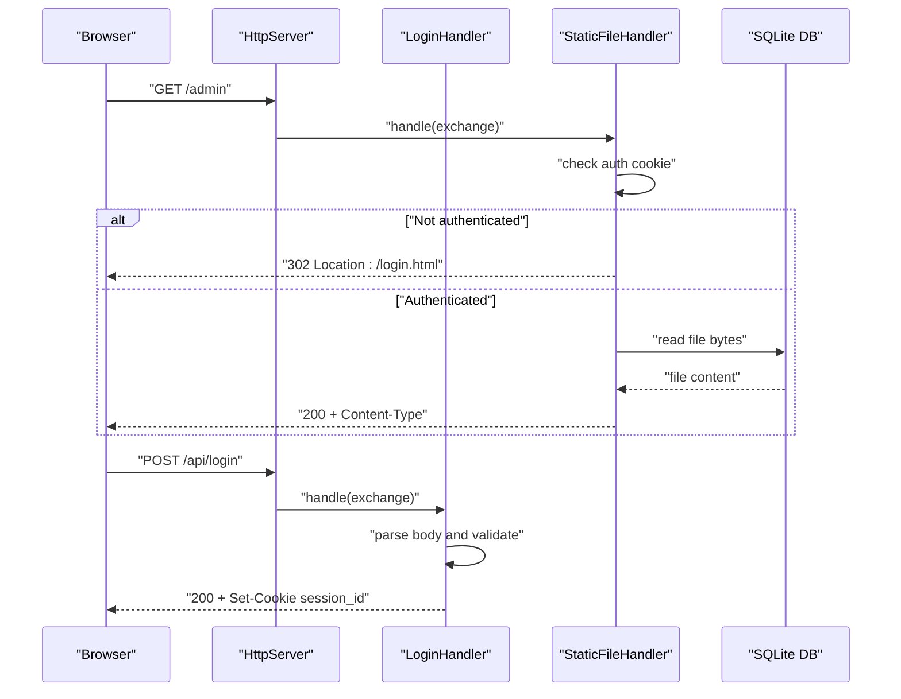
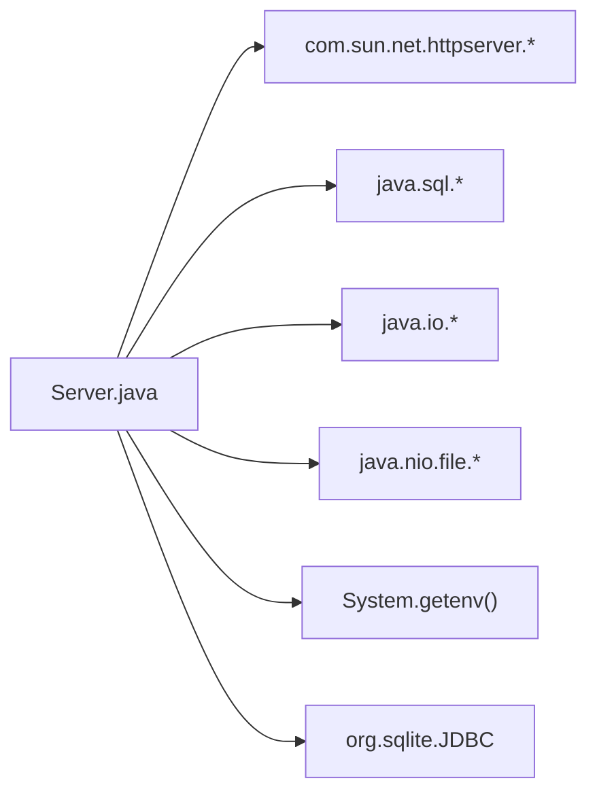

# HTTP Server Architecture

<cite>
**Referenced Files in This Document**
- [Server.java](file://Server.java)
- [run_server.bat](file://run_server.bat)
- [Dockerfile](file://Dockerfile)
- [login.html](file://login.html)
- [admin.html](file://admin.html)
</cite>

## Table of Contents
1. [Introduction](#introduction)
2. [Project Structure](#project-structure)
3. [Core Components](#core-components)
4. [Architecture Overview](#architecture-overview)
5. [Detailed Component Analysis](#detailed-component-analysis)
6. [Dependency Analysis](#dependency-analysis)
7. [Performance Considerations](#performance-considerations)
8. [Troubleshooting Guide](#troubleshooting-guide)
9. [Conclusion](#conclusion)

## Introduction
This document explains the HTTP server architecture built with Java’s built-in HttpServer. It covers server initialization, port configuration, endpoint routing, CORS policy, authentication, static file serving, and deployment topology. It also documents configuration options, security considerations, and common operational issues such as port conflicts and environment variable handling.

## Project Structure
The server is implemented in a single Java class with embedded handlers for dynamic endpoints and static file serving. Supporting scripts and containers enable local development and containerized deployment.

**Diagram sources**
- [Server.java:34-83](file://Server.java#L34-L83)
- [run_server.bat:56](file://run_server.bat#L56)
- [Dockerfile:17](file://Dockerfile#L17)
- [login.html:147-160](file://login.html#L147-L160)

**Section sources**
- [Server.java:34-83](file://Server.java#L34-L83)
- [run_server.bat:56](file://run_server.bat#L56)
- [Dockerfile:17](file://Dockerfile#L17)

## Core Components
- Main server bootstrap and port detection
- Endpoint context mapping
- Handler classes for dynamic endpoints
- Static file handler with authentication gating
- CORS configuration
- Database initialization and CRUD handlers

Key implementation references:
- Port detection and server creation: [Server.java:19-83](file://Server.java#L19-L83)
- Context mapping: [Server.java:41-69](file://Server.java#L41-L69)
- CORS header helper: [Server.java:398-402](file://Server.java#L398-L402)
- Static file serving: [Server.java:805-904](file://Server.java#L805-L904)
- Authentication cookie check: [Server.java:339-352](file://Server.java#L339-L352)

**Section sources**
- [Server.java:19-83](file://Server.java#L19-L83)
- [Server.java:398-402](file://Server.java#L398-L402)
- [Server.java:805-904](file://Server.java#L805-L904)
- [Server.java:339-352](file://Server.java#L339-L352)

## Architecture Overview
The server initializes an HttpServer bound to a configurable port, registers contexts for both dynamic endpoints and static resources, and serves responses with CORS headers. Handlers encapsulate business logic and database operations.

**Diagram sources**
- [Server.java:826-832](file://Server.java#L826-L832)
- [Server.java:355-396](file://Server.java#L355-L396)
- [Server.java:805-904](file://Server.java#L805-L904)

## Detailed Component Analysis

### Server Initialization and Port Configuration
- Port detection:
  - Reads environment variable PORT; falls back to default 3000 if missing or invalid.
  - Invalid numeric values log an error and continue with default.
- Server creation:
  - Creates HttpServer bound to the selected port.
  - Registers contexts for endpoints and static files.
  - Starts the server and prints startup banner.

References:
- Port detection: [Server.java:22-32](file://Server.java#L22-L32)
- Server creation and context mapping: [Server.java:34-83](file://Server.java#L34-L83)

**Section sources**
- [Server.java:22-32](file://Server.java#L22-L32)
- [Server.java:34-83](file://Server.java#L34-L83)

### Endpoint Context Mapping
Endpoints mapped:
- Public:
  - POST /api/contact
  - POST /api/booking-submit
- Protected:
  - POST /api/login (sets session cookie)
  - GET/DELETE /api/messages
  - GET/DELETE /api/bookings
  - GET/POST /api/settings
  - POST/DELETE /api/projects-crud
  - POST/DELETE /api/education-crud
  - POST/DELETE /api/experience-crud
- Static:
  - /admin and /admin.html (protected)
  - Root “/” and all static assets

References:
- Context registration: [Server.java:41-69](file://Server.java#L41-L69)

**Section sources**
- [Server.java:41-69](file://Server.java#L41-L69)

### CORS Policy Configuration
- Global CORS headers are set on all dynamic endpoints:
  - Allow-Origin: *
  - Allow-Methods: GET, POST, DELETE, OPTIONS
  - Allow-Headers: Content-Type
- Handlers also short-circuit preflight OPTIONS requests.

References:
- CORS helper: [Server.java:398-402](file://Server.java#L398-L402)
- Options handling in handlers: [Server.java:360-363](file://Server.java#L360-L363), [Server.java:500-503](file://Server.java#L500-L503), [Server.java:652-655](file://Server.java#L652-L655), [Server.java:744-747](file://Server.java#L744-L747), [Server.java:912-915](file://Server.java#L912-L915)

**Section sources**
- [Server.java:398-402](file://Server.java#L398-L402)
- [Server.java:360-363](file://Server.java#L360-L363)
- [Server.java:500-503](file://Server.java#L500-L503)
- [Server.java:652-655](file://Server.java#L652-L655)
- [Server.java:744-747](file://Server.java#L744-L747)
- [Server.java:912-915](file://Server.java#L912-L915)

### Authentication and Session Management
- Cookie-based session:
  - Validates presence and value of session_id cookie.
  - Only admin pages require authentication.
- Login endpoint:
  - Accepts username/password.
  - On success, sets HttpOnly session cookie and responds with success.

References:
- Session check: [Server.java:339-352](file://Server.java#L339-L352)
- Admin redirect: [Server.java:826-832](file://Server.java#L826-L832)
- Login handler: [Server.java:355-396](file://Server.java#L355-L396)

**Section sources**
- [Server.java:339-352](file://Server.java#L339-L352)
- [Server.java:826-832](file://Server.java#L826-L832)
- [Server.java:355-396](file://Server.java#L355-L396)

### Static File Serving
- Rewrites:
  - “/” -> index.html
  - “/admin” or “/admin/” -> admin.html
- Authentication gating:
  - admin.html requires valid session cookie.
- Security:
  - Canonical path resolution prevents directory traversal.
  - Returns 403 for out-of-root paths, 404 for missing files.
- MIME types:
  - html, css, js, png, jpg/jpeg, gif, svg, ico, fallback octet-stream.

References:
- Static file handler: [Server.java:805-904](file://Server.java#L805-L904)

**Section sources**
- [Server.java:805-904](file://Server.java#L805-L904)

### Dynamic Endpoints and Handlers
- Contact form submission:
  - POST /api/contact inserts into contacts table.
- Booking submission:
  - POST /api/booking-submit inserts into bookings table.
- Messages and bookings listing/deletion:
  - GET /api/messages and DELETE /api/messages?id
  - GET /api/bookings and DELETE /api/bookings?id
- Settings:
  - GET /api/settings returns combined JSON for settings, projects, education, experience.
  - POST /api/settings saves updates to portfolio_settings.
- Admin CRUD:
  - Projects, education, and experience with POST (create/update) and DELETE endpoints.

References:
- Contact handler: [Server.java:495-554](file://Server.java#L495-L554)
- Booking submit handler: [Server.java:739-802](file://Server.java#L739-L802)
- Messages handler: [Server.java:557-644](file://Server.java#L557-L644)
- Bookings handler: [Server.java:647-736](file://Server.java#L647-L736)
- Settings handler: [Server.java:907-1250](file://Server.java#L907-L1250)
- Projects CRUD handler: [Server.java:1253-1377](file://Server.java#L1253-L1377)
- Education CRUD handler: [Server.java:1380-1498](file://Server.java#L1380-L1498)
- Experience CRUD handler: [Server.java:1501-1619](file://Server.java#L1501-L1619)

**Section sources**
- [Server.java:495-554](file://Server.java#L495-L554)
- [Server.java:739-802](file://Server.java#L739-L802)
- [Server.java:557-644](file://Server.java#L557-L644)
- [Server.java:647-736](file://Server.java#L647-L736)
- [Server.java:907-1250](file://Server.java#L907-L1250)
- [Server.java:1253-1377](file://Server.java#L1253-L1377)
- [Server.java:1380-1498](file://Server.java#L1380-L1498)
- [Server.java:1501-1619](file://Server.java#L1501-L1619)

### Database Initialization and Schema
- Initializes SQLite driver and creates tables if missing.
- Seeds default rows for settings, projects, education, and experience.
- Adds new columns via ALTER TABLE migrations.

References:
- Database init: [Server.java:85-337](file://Server.java#L85-L337)

**Section sources**
- [Server.java:85-337](file://Server.java#L85-L337)

### Deployment Topology
- Local Windows launcher:
  - Downloads required JDBC jars, compiles, and runs the server.
- Containerization:
  - Alpine-based JDK image, exposes port 3000, runs server with classpath separator appropriate for Linux.

References:
- Windows launcher: [run_server.bat:56](file://run_server.bat#L56)
- Container build: [Dockerfile:17](file://Dockerfile#L17)

**Section sources**
- [run_server.bat:56](file://run_server.bat#L56)
- [Dockerfile:17](file://Dockerfile#L17)

## Dependency Analysis
The server depends on:
- Java HttpServer API
- SQLite JDBC driver (downloaded and placed in lib/)
- Standard Java libraries for IO, SQL, and HTTP handling

**Diagram sources**
- [Server.java:1-16](file://Server.java#L1-L16)
- [Server.java:88](file://Server.java#L88)
- [run_server.bat:15-33](file://run_server.bat#L15-L33)

**Section sources**
- [Server.java:1-16](file://Server.java#L1-L16)
- [Server.java:88](file://Server.java#L88)
- [run_server.bat:15-33](file://run_server.bat#L15-L33)

## Performance Considerations
- Threading model:
  - Uses default executor; requests are handled concurrently by the platform thread pool.
- I/O:
  - Static file serving streams entire files; consider chunked transfer for very large assets.
- Database:
  - Each request opens/closes connections; consider pooling for high concurrency.
- CORS:
  - Preflight OPTIONS is short-circuited; keep headers minimal to reduce overhead.

[No sources needed since this section provides general guidance]

## Troubleshooting Guide

### Port Conflicts
- Symptom: Server fails to start with bind error.
- Cause: Another process occupies the configured port.
- Resolution:
  - Change PORT environment variable to an available port.
  - Verify port availability using netstat or equivalent.

References:
- Port detection: [Server.java:22-32](file://Server.java#L22-L32)
- Server startup: [Server.java:38-82](file://Server.java#L38-L82)

**Section sources**
- [Server.java:22-32](file://Server.java#L22-L32)
- [Server.java:38-82](file://Server.java#L38-L82)

### Environment Variable Handling
- Symptom: Server ignores custom port.
- Cause: PORT is not a valid integer or is empty.
- Resolution:
  - Ensure PORT is a positive integer.
  - Confirm environment propagation in your shell/container.

References:
- Port parsing: [Server.java:22-32](file://Server.java#L22-L32)

**Section sources**
- [Server.java:22-32](file://Server.java#L22-L32)

### Authentication Failures
- Symptom: 302 redirect to login or 401 Unauthorized on protected endpoints.
- Causes:
  - Missing or incorrect session_id cookie.
  - Cookie not marked as HttpOnly or SameSite policy mismatch.
- Resolution:
  - Use the login page to obtain a valid session cookie.
  - Ensure browser accepts third-party cookies if applicable.

References:
- Admin redirect: [Server.java:826-832](file://Server.java#L826-L832)
- Session check: [Server.java:339-352](file://Server.java#L339-L352)
- Login handler: [Server.java:355-396](file://Server.java#L355-L396)

**Section sources**
- [Server.java:826-832](file://Server.java#L826-L832)
- [Server.java:339-352](file://Server.java#L339-L352)
- [Server.java:355-396](file://Server.java#L355-L396)

### Static File Issues
- Symptom: 403 Forbidden or 404 Not Found.
- Causes:
  - Requested path attempts directory traversal.
  - File does not exist or is a directory.
- Resolution:
  - Use canonical paths and avoid ../ sequences.
  - Ensure files are present in the working directory.

References:
- Static file handler: [Server.java:805-904](file://Server.java#L805-L904)

**Section sources**
- [Server.java:805-904](file://Server.java#L805-L904)

### Database Connectivity
- Symptom: Database initialization errors or SQL exceptions.
- Causes:
  - SQLite JDBC driver not on classpath.
  - File permissions preventing DB creation.
- Resolution:
  - Ensure JDBC driver is downloaded and on classpath.
  - Verify write permissions in the working directory.

References:
- JDBC load: [Server.java:88](file://Server.java#L88)
- DB init: [Server.java:85-337](file://Server.java#L85-L337)

**Section sources**
- [Server.java:88](file://Server.java#L88)
- [Server.java:85-337](file://Server.java#L85-L337)

## Conclusion
The server architecture combines a compact Java HttpServer with embedded handlers and static file serving. It supports a clear separation between public and protected endpoints, robust CORS handling, and a simple authentication scheme. Deployment is straightforward via a Windows launcher or container image, with environment-driven port configuration. For production hardening, consider adding request timeouts, rate limiting, and HTTPS termination.