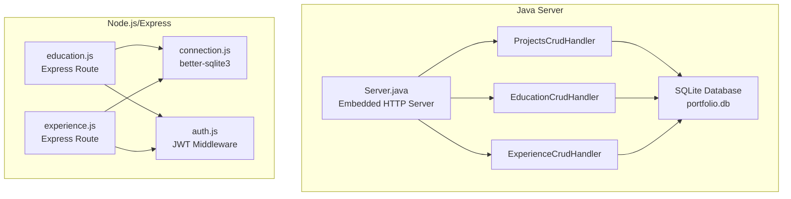
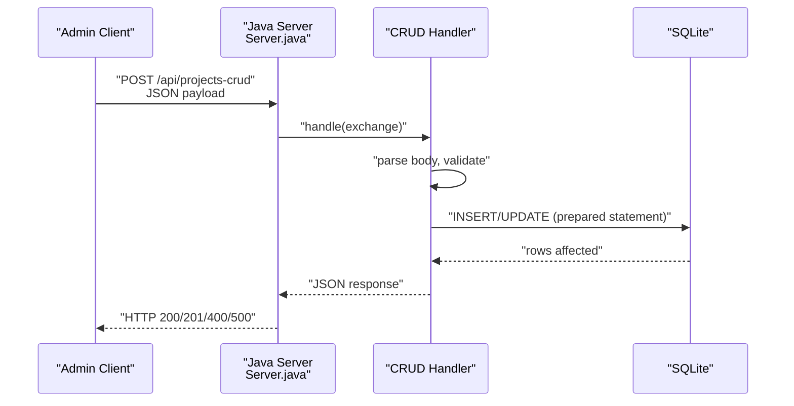
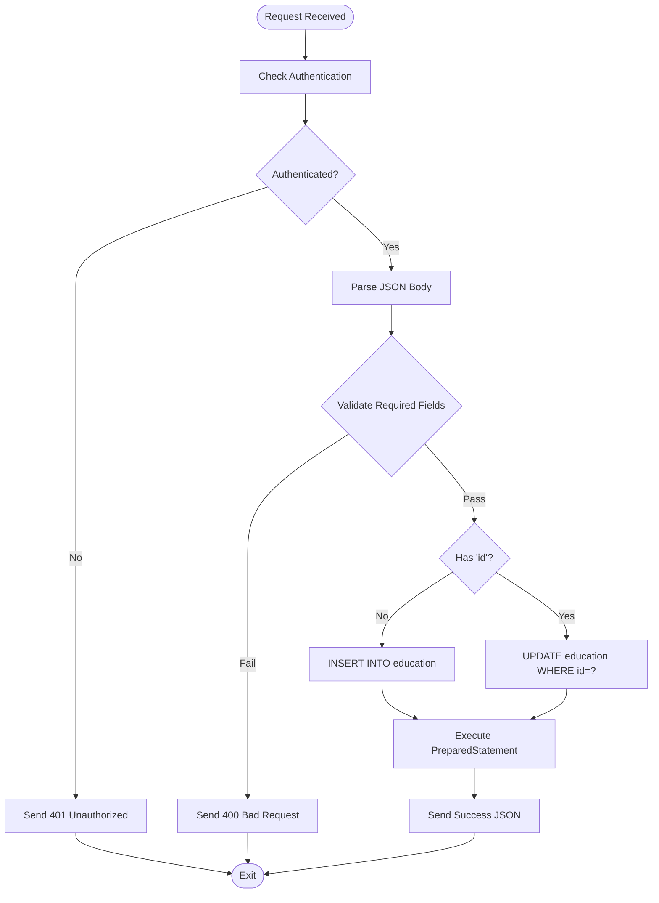
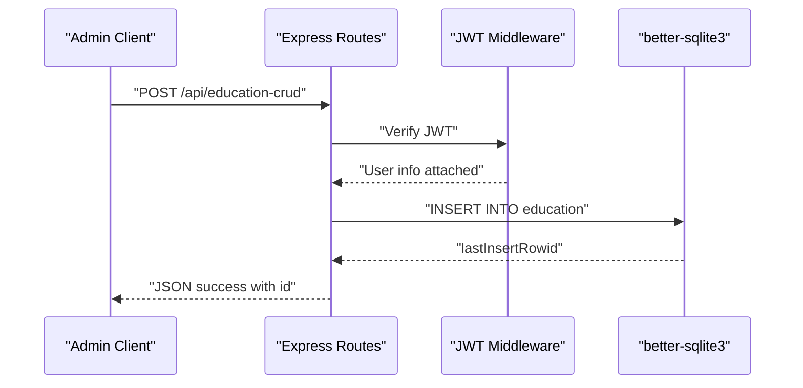
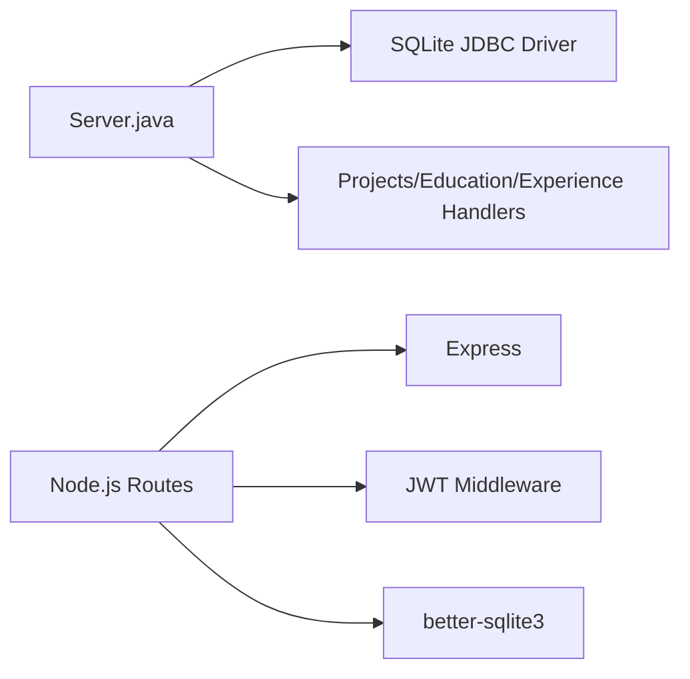

# CRUD Operation Handlers

<cite>
**Referenced Files in This Document**
- [Server.java](file://Server.java)
- [education.js](file://server/routes/education.js)
- [experience.js](file://server/routes/experience.js)
- [auth.js](file://server/middleware/auth.js)
- [connection.js](file://server/db/connection.js)
</cite>

## Table of Contents
1. [Introduction](#introduction)
2. [Project Structure](#project-structure)
3. [Core Components](#core-components)
4. [Architecture Overview](#architecture-overview)
5. [Detailed Component Analysis](#detailed-component-analysis)
6. [Dependency Analysis](#dependency-analysis)
7. [Performance Considerations](#performance-considerations)
8. [Troubleshooting Guide](#troubleshooting-guide)
9. [Conclusion](#conclusion)

## Introduction
This document explains the CRUD operation handlers that manage three content types in the portfolio system:
- ProjectsCrudHandler: manages project entries
- EducationCrudHandler: manages educational background entries
- ExperienceCrudHandler: manages professional experience entries

Each handler supports create, read, update, and delete operations via HTTP endpoints. The handlers enforce authentication, parse request bodies, validate required fields, construct SQL queries safely, and return structured JSON responses. The document also covers routing, parameter extraction, SQL query construction, response generation, error handling, and security considerations.

## Project Structure
The CRUD handlers are implemented in two complementary environments:
- Java-based embedded HTTP server with SQLite for core portfolio data
- Node.js/Express routes with better-sqlite3 for education and experience management

**Diagram sources**
- [Server.java:1252-1377](file://Server.java#L1252-L1377)
- [Server.java:1379-1498](file://Server.java#L1379-L1498)
- [Server.java:1500-1619](file://Server.java#L1500-L1619)
- [education.js:1-48](file://server/routes/education.js#L1-L48)
- [experience.js:1-48](file://server/routes/experience.js#L1-L48)
- [auth.js:1-62](file://server/middleware/auth.js#L1-L62)
- [connection.js:1-25](file://server/db/connection.js#L1-L25)

**Section sources**
- [Server.java:59-62](file://Server.java#L59-L62)
- [Server.java:1252-1377](file://Server.java#L1252-L1377)
- [Server.java:1379-1498](file://Server.java#L1379-L1498)
- [Server.java:1500-1619](file://Server.java#L1500-L1619)
- [education.js:1-48](file://server/routes/education.js#L1-L48)
- [experience.js:1-48](file://server/routes/experience.js#L1-L48)
- [auth.js:1-62](file://server/middleware/auth.js#L1-L62)
- [connection.js:1-25](file://server/db/connection.js#L1-L25)

## Core Components
This section documents the three specialized CRUD handlers and their shared patterns.

- ProjectsCrudHandler
  - Endpoint: POST /api/projects-crud (create/update), DELETE /api/projects-crud?id={id} (delete)
  - Authentication: Required (401 Unauthorized if missing)
  - Request body: JSON with fields for project metadata and visibility
  - Validation: Title is required; numeric fields sanitized
  - SQL: INSERT or UPDATE with prepared statements; DELETE by id
  - Response: Success messages and appropriate HTTP status codes

- EducationCrudHandler
  - Endpoint: POST /api/education-crud (create/update), DELETE /api/education-crud?id={id} (delete)
  - Authentication: Required (401 Unauthorized if missing)
  - Request body: JSON with degree, institution, timeline, and optional metadata
  - Validation: Degree and institution are required; numeric fields sanitized
  - SQL: INSERT or UPDATE with prepared statements; DELETE by id
  - Response: Success messages and appropriate HTTP status codes

- ExperienceCrudHandler
  - Endpoint: POST /api/experience-crud (create/update), DELETE /api/experience-crud?id={id} (delete)
  - Authentication: Required (401 Unauthorized if missing)
  - Request body: JSON with role, company, timeline, and optional metadata
  - Validation: Role and company are required; numeric fields sanitized
  - SQL: INSERT or UPDATE with prepared statements; DELETE by id
  - Response: Success messages and appropriate HTTP status codes

Security highlights:
- Authentication enforced via session cookie check in Java handlers
- Additional JWT middleware available in Node.js routes for education and experience
- Parameterized SQL prevents injection
- CORS configured per endpoint

**Section sources**
- [Server.java:1252-1377](file://Server.java#L1252-L1377)
- [Server.java:1379-1498](file://Server.java#L1379-L1498)
- [Server.java:1500-1619](file://Server.java#L1500-L1619)

## Architecture Overview
The Java server initializes SQLite tables and exposes CRUD endpoints. The Node.js routes complement the Java implementation for education and experience, using better-sqlite3 and JWT-based authentication.

**Diagram sources**
- [Server.java:1252-1377](file://Server.java#L1252-L1377)

## Detailed Component Analysis

### ProjectsCrudHandler
Implementation pattern:
- Authentication check ensures only authorized requests proceed
- Body parsing extracts JSON fields and trims whitespace
- Validation enforces required fields (e.g., title)
- Conditional logic determines insert vs. update based on presence of id
- Prepared statements bind validated values safely
- Response indicates success or returns error JSON

Key steps:
- Extract id, title, description, links, tags, sort order, visibility
- Validate required fields
- Convert sort order and visibility to integers with safe fallbacks
- Insert or update via PreparedStatement
- Delete by id with parameterized query

**Diagram sources**
- [Server.java:1252-1377](file://Server.java#L1252-L1377)

**Section sources**
- [Server.java:1252-1377](file://Server.java#L1252-L1377)

### EducationCrudHandler
Implementation pattern:
- Authentication enforced
- Body parsing and trimming
- Validation requires degree and institution
- Safe integer conversion for sort order and visibility
- Insert or update via PreparedStatement
- Delete by id with parameterized query

**Diagram sources**
- [Server.java:1379-1498](file://Server.java#L1379-L1498)

**Section sources**
- [Server.java:1379-1498](file://Server.java#L1379-L1498)

### ExperienceCrudHandler
Implementation pattern:
- Authentication enforced
- Body parsing and trimming
- Validation requires role and company
- Safe integer conversion for sort order and visibility
- Insert or update via PreparedStatement
- Delete by id with parameterized query

**Diagram sources**
- [Server.java:1500-1619](file://Server.java#L1500-L1619)

**Section sources**
- [Server.java:1500-1619](file://Server.java#L1500-L1619)

### Node.js Routes for Education and Experience (Complementary Implementation)
While the Java server provides the primary CRUD handlers, the Node.js routes demonstrate an alternative implementation using Express and better-sqlite3:
- education.js: GET all, POST create, PUT update, DELETE by id
- experience.js: GET all, POST create, PUT update, DELETE by id
- auth.js: JWT middleware for authentication
- connection.js: better-sqlite3 connection management

These routes share similar patterns:
- Authentication middleware validates JWT tokens
- Body validation ensures required fields
- Dynamic field updates restrict allowed columns
- Audit logging records create/update/delete actions

**Diagram sources**
- [education.js:14-23](file://server/routes/education.js#L14-L23)
- [auth.js:23-40](file://server/middleware/auth.js#L23-L40)
- [connection.js:8-15](file://server/db/connection.js#L8-L15)

**Section sources**
- [education.js:1-48](file://server/routes/education.js#L1-L48)
- [experience.js:1-48](file://server/routes/experience.js#L1-L48)
- [auth.js:1-62](file://server/middleware/auth.js#L1-L62)
- [connection.js:1-25](file://server/db/connection.js#L1-L25)

## Dependency Analysis
The Java handlers depend on:
- Embedded HTTP server and request/response utilities
- SQLite JDBC for database connectivity
- Session-based authentication for admin endpoints

The Node.js routes depend on:
- Express for routing
- better-sqlite3 for database access
- JWT middleware for authentication
- Audit logging middleware

**Diagram sources**
- [Server.java:18-20](file://Server.java#L18-L20)
- [education.js:1-48](file://server/routes/education.js#L1-L48)
- [experience.js:1-48](file://server/routes/experience.js#L1-L48)
- [auth.js:1-62](file://server/middleware/auth.js#L1-L62)
- [connection.js:1-25](file://server/db/connection.js#L1-L25)

**Section sources**
- [Server.java:18-20](file://Server.java#L18-L20)
- [education.js:1-48](file://server/routes/education.js#L1-L48)
- [experience.js:1-48](file://server/routes/experience.js#L1-L48)
- [auth.js:1-62](file://server/middleware/auth.js#L1-L62)
- [connection.js:1-25](file://server/db/connection.js#L1-L25)

## Performance Considerations
- Prepared statements minimize parsing overhead and prevent injection
- Integer conversions with safe fallbacks avoid exceptions during numeric parsing
- Sorting by sort_order reduces client-side ordering costs
- Using SQLite with WAL mode improves concurrency (as seen in Node.js implementation)
- Limit response payloads to essential fields to reduce bandwidth

## Troubleshooting Guide
Common issues and resolutions:
- Authentication failures
  - Symptom: 401 Unauthorized responses
  - Cause: Missing or invalid session cookie/token
  - Resolution: Ensure admin login succeeds and cookies/tokens are included in subsequent requests

- Validation errors
  - Symptom: 400 Bad Request with field-specific messages
  - Causes: Missing required fields (title, degree/institution, role/company)
  - Resolution: Include all required fields in the request body

- Database errors
  - Symptom: 500 Internal Server Error with error message
  - Causes: SQL exceptions or connection issues
  - Resolution: Verify database connectivity and table schemas; check logs for detailed error messages

- Parameter extraction issues
  - Symptom: Unexpected nulls or incorrect values
  - Causes: Malformed JSON or wrong Content-Type
  - Resolution: Ensure Content-Type is application/json and payload is valid JSON

**Section sources**
- [Server.java:1252-1377](file://Server.java#L1252-L1377)
- [Server.java:1379-1498](file://Server.java#L1379-L1498)
- [Server.java:1500-1619](file://Server.java#L1500-L1619)

## Conclusion
The CRUD handlers provide a consistent, secure, and maintainable foundation for managing projects, education, and experience content. They enforce authentication, validate inputs, and use parameterized SQL to prevent injection. The Java server offers a compact, self-contained implementation, while the Node.js routes demonstrate an alternative architecture using Express and better-sqlite3. Together, they illustrate robust patterns for request routing, parameter extraction, SQL query construction, and response generation.