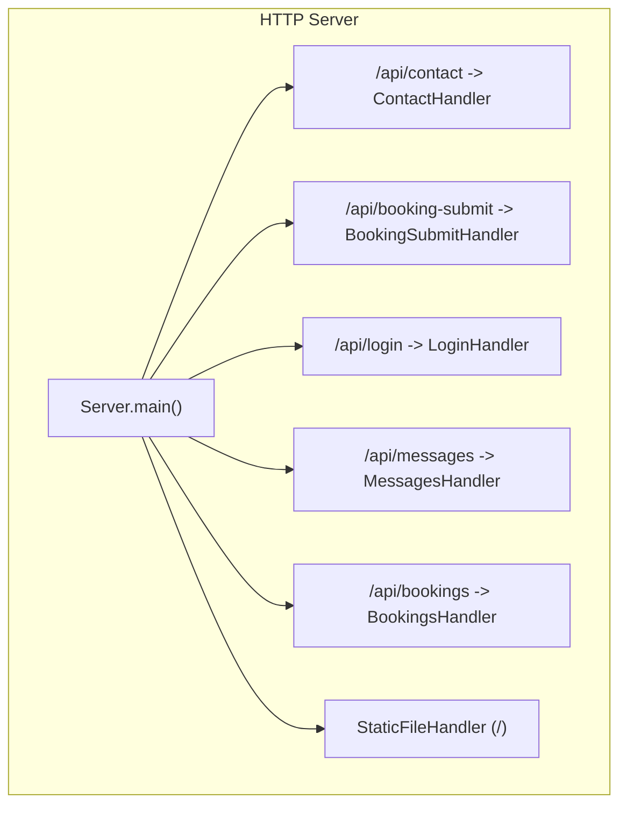
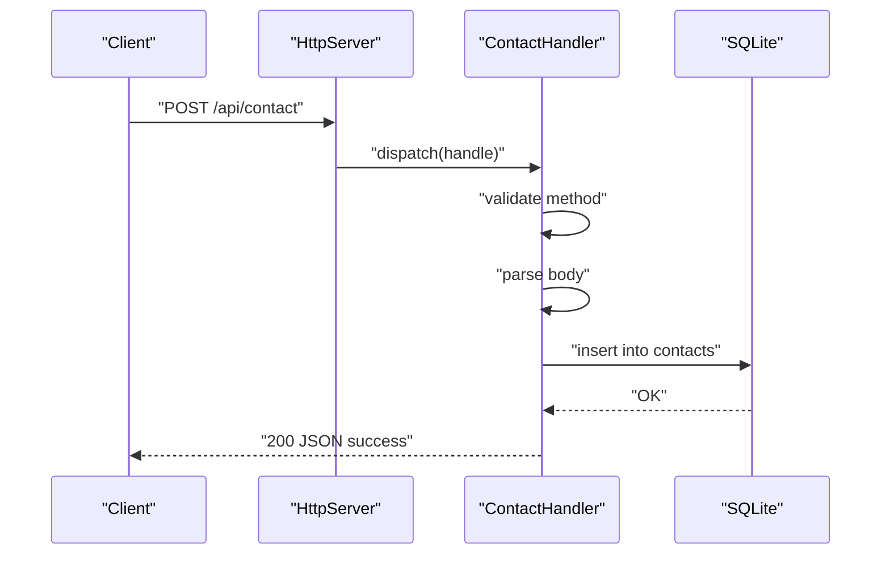
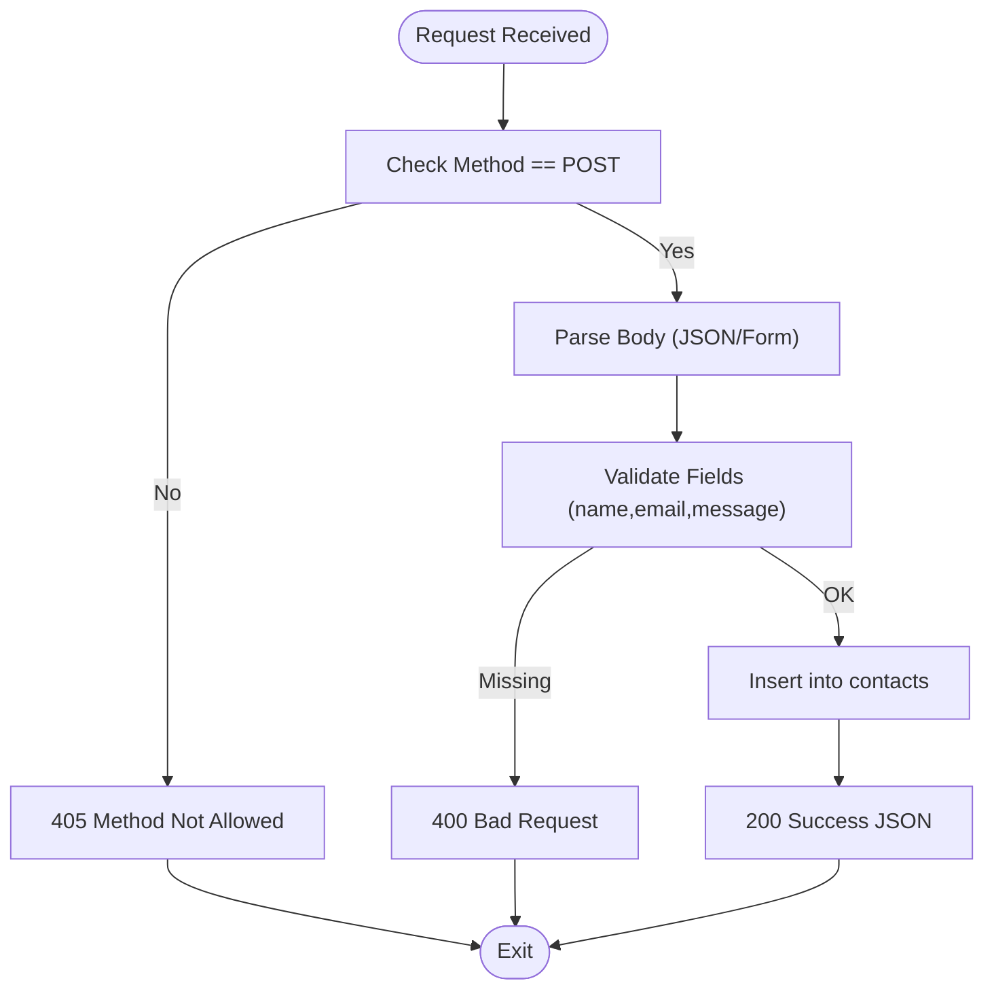
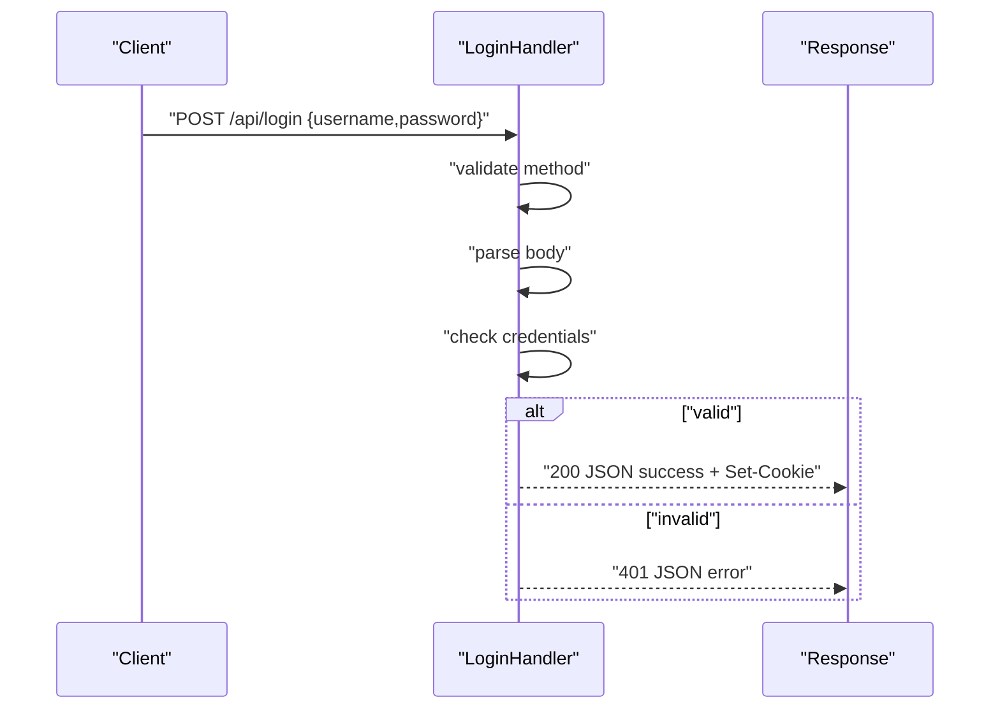
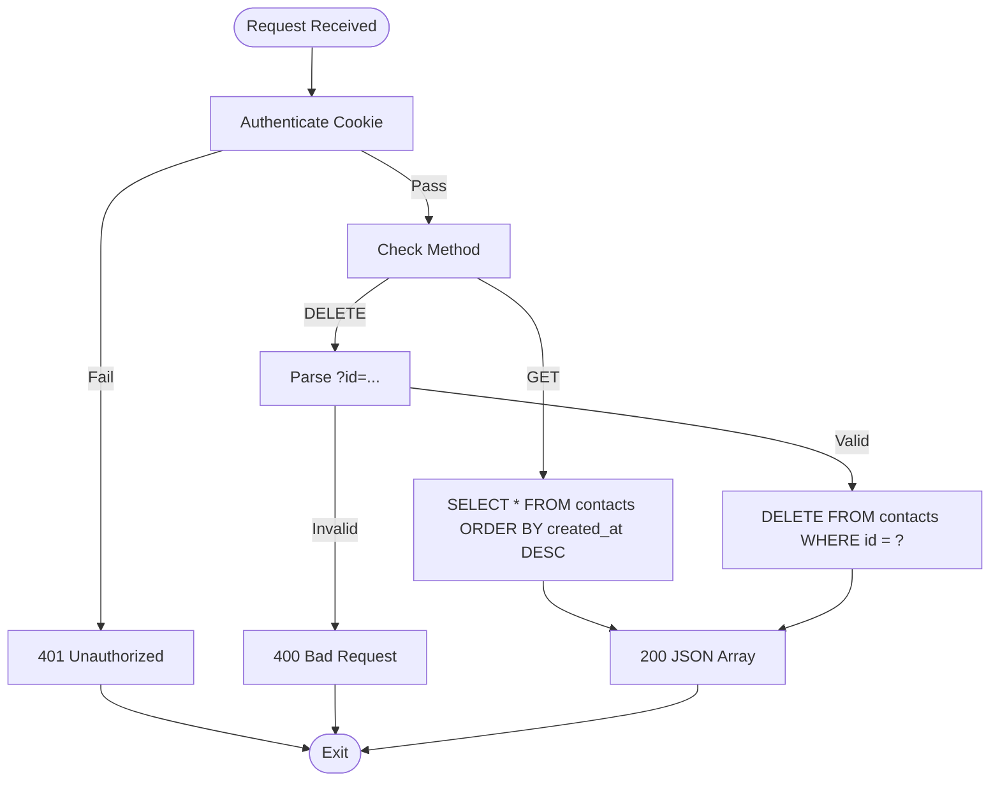
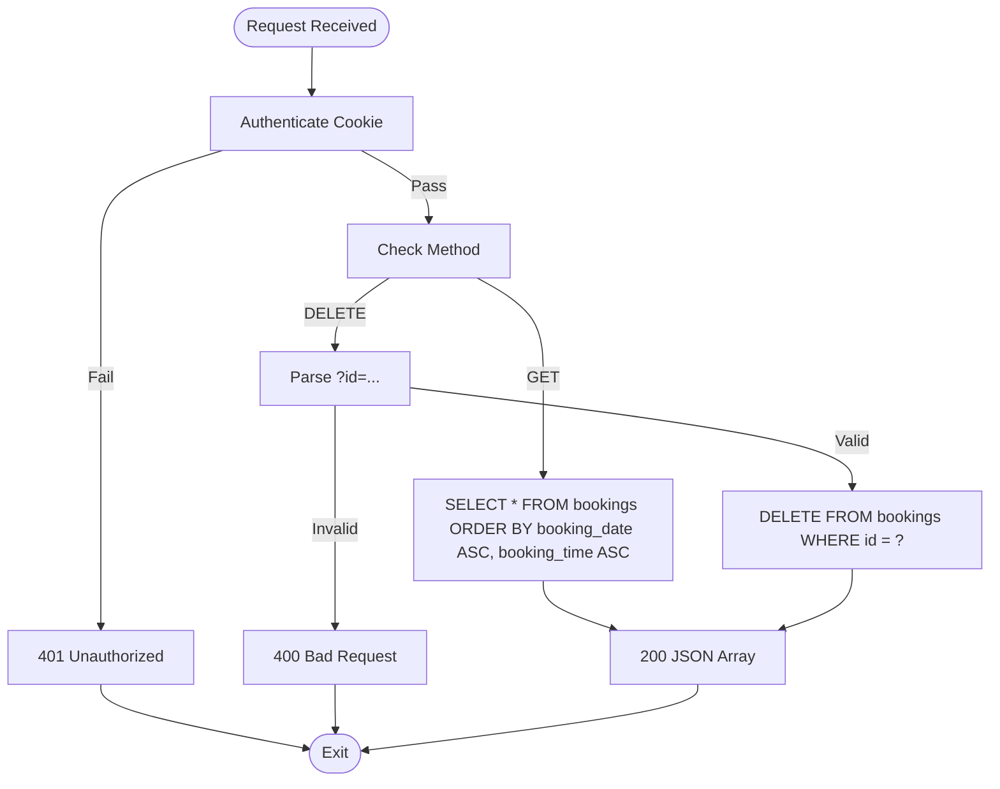
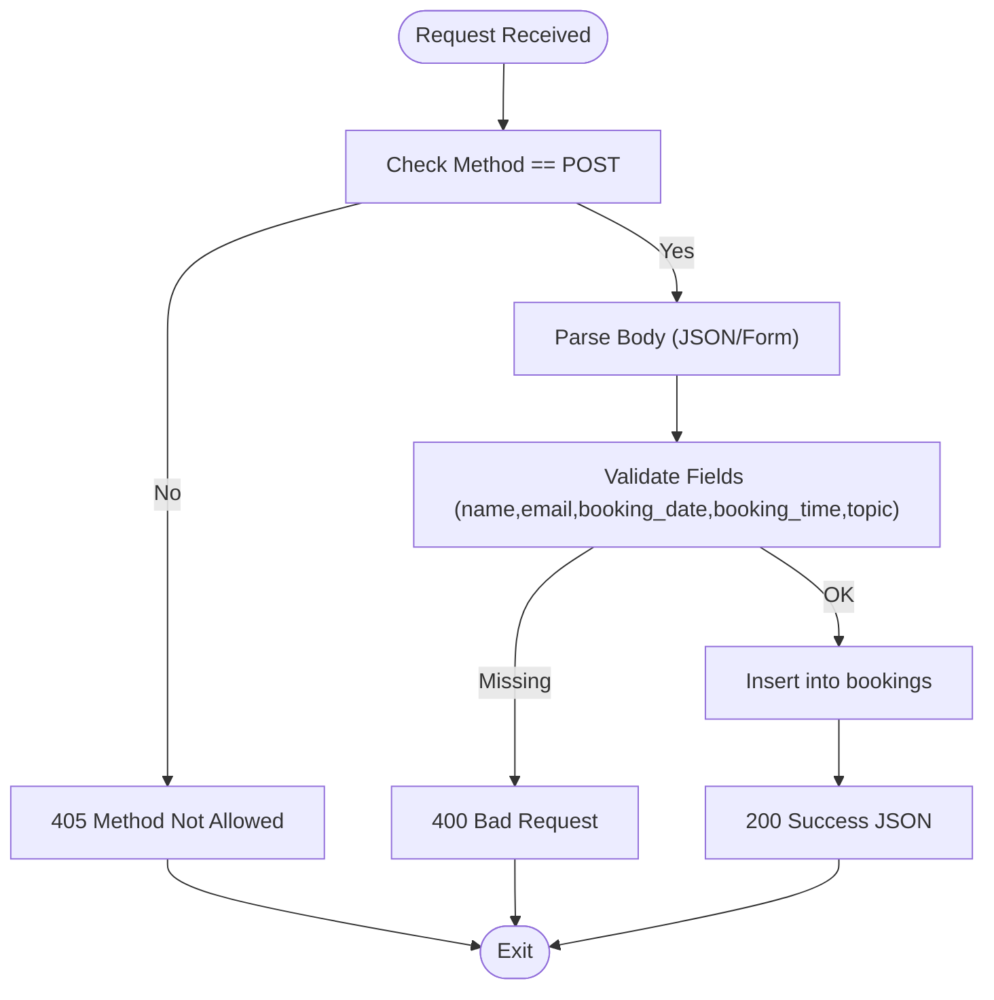
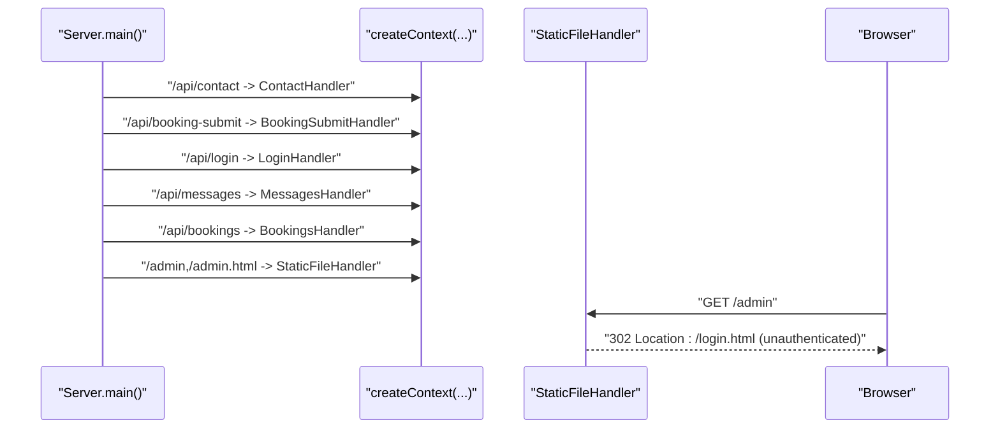
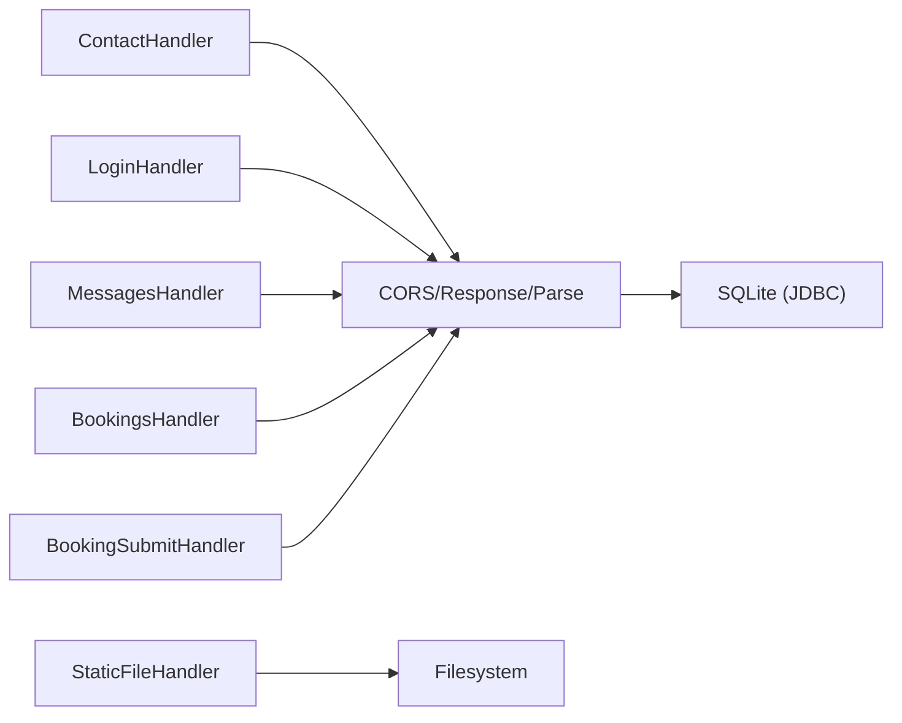

# Core API Handlers

<cite>
**Referenced Files in This Document**
- [Server.java](file://Server.java)
- [index.html](file://index.html)
- [admin.html](file://admin.html)
</cite>

## Table of Contents
1. [Introduction](#introduction)
2. [Project Structure](#project-structure)
3. [Core Components](#core-components)
4. [Architecture Overview](#architecture-overview)
5. [Detailed Component Analysis](#detailed-component-analysis)
6. [Dependency Analysis](#dependency-analysis)
7. [Performance Considerations](#performance-considerations)
8. [Troubleshooting Guide](#troubleshooting-guide)
9. [Conclusion](#conclusion)

## Introduction
This document explains the core API handlers powering the portfolio backend. It focuses on four primary handlers:
- ContactHandler: processes inbound contact form submissions and persists them to the database.
- LoginHandler: authenticates administrators and sets a session cookie.
- MessagesHandler: lists and deletes contact messages (admin-protected).
- BookingsHandler: lists and deletes scheduled appointments (admin-protected).
- BookingSubmitHandler: public endpoint for visitors to schedule consultations.

It covers request/response processing, method validation, body parsing, authentication, CORS, error handling, and operational characteristics such as lifecycle and performance.

## Project Structure
The server is implemented as a single-file Java application using the built-in HTTP server. Handler registration occurs during server startup, mapping endpoints to handler classes. Static file serving and admin routing are handled by dedicated handlers.

**Diagram sources**
- [Server.java:34-83](file://Server.java#L34-L83)
- [Server.java:805-890](file://Server.java#L805-L890)

**Section sources**
- [Server.java:34-83](file://Server.java#L34-L83)

## Core Components
This section documents the four core handlers and their responsibilities.

- ContactHandler
  - Purpose: Accepts contact form submissions and stores them in the contacts table.
  - Methods: POST only.
  - Validation: Ensures required fields are present.
  - Persistence: Inserts into SQLite.
  - Response: JSON with status and message.

- LoginHandler
  - Purpose: Authenticates administrators and sets a session cookie.
  - Methods: POST only.
  - Validation: Checks username/password against hardcoded credentials.
  - Response: JSON success or error; sets a cookie on success.

- MessagesHandler
  - Purpose: Lists and deletes contact messages (admin-protected).
  - Methods: GET and DELETE.
  - Authentication: Requires a valid session cookie.
  - Persistence: Reads/writes from the contacts table.

- BookingsHandler
  - Purpose: Lists and deletes scheduled appointments (admin-protected).
  - Methods: GET and DELETE.
  - Authentication: Requires a valid session cookie.
  - Persistence: Reads/writes from the bookings table.

- BookingSubmitHandler
  - Purpose: Public endpoint for visitors to schedule consultations.
  - Methods: POST only.
  - Validation: Ensures required fields are present.
  - Persistence: Inserts into SQLite.
  - Response: JSON with status and message.

**Section sources**
- [Server.java:495-554](file://Server.java#L495-L554)
- [Server.java:355-396](file://Server.java#L355-L396)
- [Server.java:557-644](file://Server.java#L557-L644)
- [Server.java:647-736](file://Server.java#L647-L736)
- [Server.java:739-802](file://Server.java#L739-L802)

## Architecture Overview
The server initializes the SQLite database, registers endpoints, and routes requests to handlers. Handlers share common utilities for CORS, response formatting, and request body parsing. Authentication relies on a simple cookie-based mechanism.

**Diagram sources**
- [Server.java:495-554](file://Server.java#L495-L554)

**Section sources**
- [Server.java:34-83](file://Server.java#L34-L83)
- [Server.java:398-411](file://Server.java#L398-L411)
- [Server.java:413-466](file://Server.java#L413-L466)

## Detailed Component Analysis

### ContactHandler
- Endpoint: POST /api/contact
- Responsibilities:
  - Validates HTTP method.
  - Parses request body (JSON or form-encoded).
  - Extracts name, email, message.
  - Validates presence of required fields.
  - Inserts into contacts table.
  - Returns standardized JSON response.
- Error handling:
  - Method Not Allowed for non-POST.
  - Bad Request for missing fields.
  - Internal Server Error for unexpected exceptions.
  - Database errors reported with sanitized messages.

**Diagram sources**
- [Server.java:495-554](file://Server.java#L495-L554)

**Section sources**
- [Server.java:495-554](file://Server.java#L495-L554)
- [Server.java:413-466](file://Server.java#L413-L466)

### LoginHandler
- Endpoint: POST /api/login
- Responsibilities:
  - Validates HTTP method.
  - Parses request body.
  - Validates credentials against hardcoded values.
  - Sets a session cookie on success.
  - Returns JSON success or error.
- Security considerations:
  - Credentials are validated in-process.
  - On success, sets a cookie with HttpOnly and SameSite attributes.
  - No CSRF protection is implemented in this handler.

**Diagram sources**
- [Server.java:355-396](file://Server.java#L355-L396)

**Section sources**
- [Server.java:355-396](file://Server.java#L355-L396)

### MessagesHandler
- Endpoints: GET /api/messages, DELETE /api/messages?id=123
- Responsibilities:
  - Validates HTTP method.
  - Enforces authentication via cookie.
  - GET: Returns all messages ordered by creation time.
  - DELETE: Removes a message by ID.
- Error handling:
  - Method Not Allowed for unsupported methods.
  - Unauthorized for missing/invalid session.
  - Bad Request for missing/invalid ID.
  - Database errors reported with sanitized messages.

**Diagram sources**
- [Server.java:557-644](file://Server.java#L557-L644)

**Section sources**
- [Server.java:557-644](file://Server.java#L557-L644)

### BookingsHandler
- Endpoints: GET /api/bookings, DELETE /api/bookings?id=123
- Responsibilities:
  - Validates HTTP method.
  - Enforces authentication via cookie.
  - GET: Returns all bookings ordered by date/time.
  - DELETE: Removes a booking by ID.
- Error handling:
  - Method Not Allowed for unsupported methods.
  - Unauthorized for missing/invalid session.
  - Bad Request for missing/invalid ID.
  - Database errors reported with sanitized messages.

**Diagram sources**
- [Server.java:647-736](file://Server.java#L647-L736)

**Section sources**
- [Server.java:647-736](file://Server.java#L647-L736)

### BookingSubmitHandler
- Endpoint: POST /api/booking-submit
- Responsibilities:
  - Validates HTTP method.
  - Parses request body (JSON or form-encoded).
  - Extracts name, email, booking_date, booking_time, topic.
  - Validates presence of required fields.
  - Inserts into bookings table.
  - Returns standardized JSON response.
- Error handling:
  - Method Not Allowed for non-POST.
  - Bad Request for missing fields.
  - Internal Server Error for unexpected exceptions.
  - Database errors reported with sanitized messages.

**Diagram sources**
- [Server.java:739-802](file://Server.java#L739-L802)

**Section sources**
- [Server.java:739-802](file://Server.java#L739-L802)

### Handler Registration and Routing
- Registration occurs in the server’s main method, mapping endpoints to handler classes.
- Static file serving is handled by a dedicated handler for root and admin paths.
- Admin pages redirect unauthenticated users to the login page.

**Diagram sources**
- [Server.java:34-83](file://Server.java#L34-L83)
- [Server.java:805-890](file://Server.java#L805-L890)

**Section sources**
- [Server.java:34-83](file://Server.java#L34-L83)
- [Server.java:825-832](file://Server.java#L825-L832)

## Dependency Analysis
- Handler-to-utility dependencies:
  - All handlers call shared helpers for CORS, response formatting, and body parsing.
  - Authentication is centralized in a cookie-check utility.
- Database:
  - Handlers use JDBC to connect to an SQLite database.
  - Prepared statements are used to prevent SQL injection.
- Static file serving:
  - A dedicated handler serves static assets and enforces path safety.

**Diagram sources**
- [Server.java:398-411](file://Server.java#L398-L411)
- [Server.java:413-466](file://Server.java#L413-L466)
- [Server.java:339-352](file://Server.java#L339-L352)
- [Server.java:805-890](file://Server.java#L805-L890)

**Section sources**
- [Server.java:398-411](file://Server.java#L398-L411)
- [Server.java:413-466](file://Server.java#L413-L466)
- [Server.java:339-352](file://Server.java#L339-L352)
- [Server.java:805-890](file://Server.java#L805-L890)

## Performance Considerations
- Concurrency: The server uses the default executor; handlers are invoked synchronously per request.
- I/O: Handlers stream request bodies and write responses efficiently.
- Database: Prepared statements minimize overhead; ensure the database remains on local storage for low latency.
- Recommendations:
  - Add connection pooling for higher throughput.
  - Consider asynchronous dispatching for CPU-bound tasks.
  - Add caching for frequently accessed settings or static assets.
  - Monitor response sizes; large lists should be paginated.

[No sources needed since this section provides general guidance]

## Troubleshooting Guide
Common issues and resolutions:
- Method Not Allowed
  - Cause: Handler received a method other than the supported one.
  - Resolution: Ensure clients use the correct HTTP verb for each endpoint.
  - Evidence: Handlers check method and return 405 accordingly.
- Unauthorized
  - Cause: Missing or invalid session cookie for protected endpoints.
  - Resolution: Authenticate via the login endpoint and ensure cookies are sent.
  - Evidence: Authentication check verifies a specific cookie value.
- Missing or Invalid ID Parameter
  - Cause: DELETE endpoints require a numeric id query parameter.
  - Resolution: Provide a valid integer id.
  - Evidence: Handlers parse query parameters and validate IDs.
- Database Errors
  - Cause: SQL exceptions during insert/update/delete.
  - Resolution: Inspect logs and verify table schemas and constraints.
  - Evidence: Handlers catch SQLException and return sanitized messages.
- CORS Issues
  - Cause: Cross-origin requests blocked by browser policies.
  - Resolution: Ensure preflight OPTIONS are handled and headers are set.
  - Evidence: Shared CORS helper sets Allow-Origin and Allow-Methods.

**Section sources**
- [Server.java:355-396](file://Server.java#L355-L396)
- [Server.java:495-554](file://Server.java#L495-L554)
- [Server.java:557-644](file://Server.java#L557-L644)
- [Server.java:647-736](file://Server.java#L647-L736)
- [Server.java:739-802](file://Server.java#L739-L802)
- [Server.java:398-402](file://Server.java#L398-L402)

## Conclusion
The core API handlers provide a straightforward, synchronous HTTP service backed by SQLite. They demonstrate robust request validation, consistent response formatting, and centralized CORS and authentication logic. For production, consider adding middleware for logging, rate limiting, and CSRF protection, along with connection pooling and pagination for large datasets.

[No sources needed since this section summarizes without analyzing specific files]