# Handler Pattern Implementation

<cite>
**Referenced Files in This Document**
- [Server.java](file://Server.java)
- [login.html](file://login.html)
- [contact.html](file://contact.html)
- [main.js](file://main.js)
</cite>

## Table of Contents
1. [Introduction](#introduction)
2. [Project Structure](#project-structure)
3. [Core Components](#core-components)
4. [Architecture Overview](#architecture-overview)
5. [Detailed Component Analysis](#detailed-component-analysis)
6. [Dependency Analysis](#dependency-analysis)
7. [Performance Considerations](#performance-considerations)
8. [Troubleshooting Guide](#troubleshooting-guide)
9. [Conclusion](#conclusion)

## Introduction
This document explains the handler pattern implementation used by the backend server. It focuses on the HttpHandler interface and the concrete handler classes that serve different endpoints. You will learn how requests are validated, parsed, processed, and responded to, including authentication, CORS, and error handling. The document also covers handler registration, lifecycle, and performance considerations, with practical examples mapped to the actual codebase.

## Project Structure
The backend is a single-file Java application that embeds a lightweight HTTP server and serves both static assets and dynamic API endpoints. The server registers multiple contexts, each backed by a dedicated handler class implementing the HttpHandler interface.

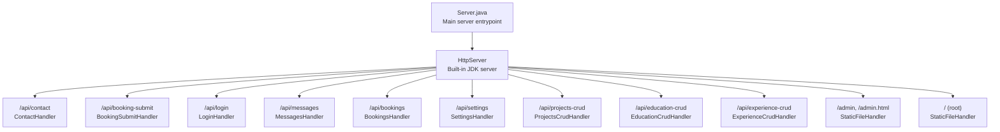

**Diagram sources**
- [Server.java:34-83](file://Server.java#L34-L83)

**Section sources**
- [Server.java:34-83](file://Server.java#L34-L83)

## Core Components
- HttpHandler interface: Implemented by each endpoint handler to process incoming requests.
- Concrete handlers:
  - ContactHandler: Processes POST requests to persist contact messages.
  - LoginHandler: Authenticates users and sets a session cookie.
  - MessagesHandler: Lists and deletes contact messages (protected).
  - BookingsHandler: Lists and deletes booking records (protected).
  - BookingSubmitHandler: Public endpoint to submit consultations.
  - SettingsHandler: Reads and updates portfolio settings (protected).
  - CRUD handlers: ProjectsCrudHandler, EducationCrudHandler, ExperienceCrudHandler for admin-managed content.
  - StaticFileHandler: Serves static assets and enforces authentication for admin pages.

Key shared utilities:
- CORS handling via setCorsHeaders.
- Request body parsing via parseBody and JSON extraction helpers.
- Response formatting via sendResponse.
- Authentication via cookie inspection via isAuthenticated.

**Section sources**
- [Server.java:354-396](file://Server.java#L354-L396)
- [Server.java:398-411](file://Server.java#L398-L411)
- [Server.java:413-466](file://Server.java#L413-L466)
- [Server.java:494-554](file://Server.java#L494-L554)
- [Server.java:646-736](file://Server.java#L646-L736)
- [Server.java:738-802](file://Server.java#L738-L802)
- [Server.java:906-1250](file://Server.java#L906-L1250)
- [Server.java:1252-1377](file://Server.java#L1252-L1377)
- [Server.java:1379-1498](file://Server.java#L1379-L1498)
- [Server.java:1500-1619](file://Server.java#L1500-L1619)
- [Server.java:804-904](file://Server.java#L804-L904)

## Architecture Overview
The server initializes the database, creates an HttpServer, and registers contexts with their respective handlers. Each handler validates the HTTP method, parses the request body, performs business logic (database operations), and sends a structured JSON response. Authentication is enforced for protected endpoints, and CORS is enabled for cross-origin requests.

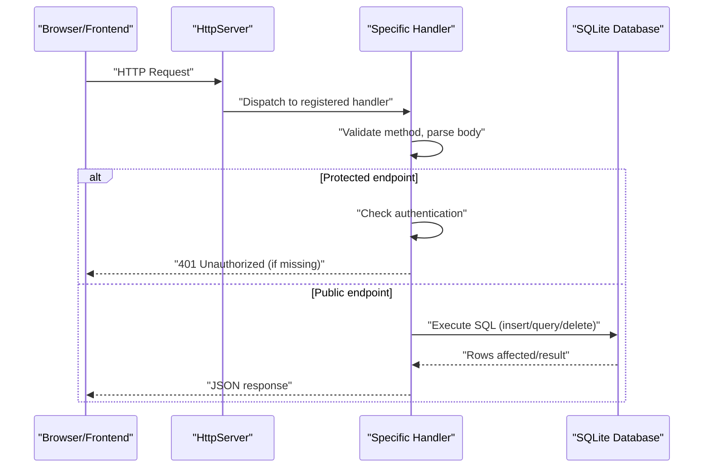

**Diagram sources**
- [Server.java:34-83](file://Server.java#L34-L83)
- [Server.java:354-396](file://Server.java#L354-L396)
- [Server.java:494-554](file://Server.java#L494-L554)
- [Server.java:646-736](file://Server.java#L646-L736)
- [Server.java:738-802](file://Server.java#L738-L802)
- [Server.java:906-1250](file://Server.java#L906-L1250)
- [Server.java:1252-1377](file://Server.java#L1252-L1377)
- [Server.java:1379-1498](file://Server.java#L1379-L1498)
- [Server.java:1500-1619](file://Server.java#L1500-L1619)

## Detailed Component Analysis

### HttpHandler Interface and Shared Utilities
- HttpHandler contract: Each handler implements the handle method to process HttpExchange.
- CORS: setCorsHeaders adds standard headers for origin, methods, and headers.
- Response: sendResponse writes headers, status, and body safely.
- Body parsing: parseBody supports JSON and form-encoded bodies; extractJsonValue extracts values from JSON strings.
- Authentication: isAuthenticated inspects the Cookie header for a session cookie.

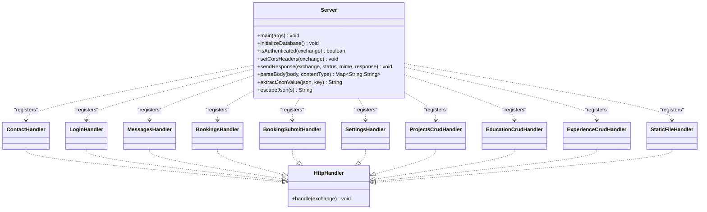

**Diagram sources**
- [Server.java:354-396](file://Server.java#L354-L396)
- [Server.java:398-411](file://Server.java#L398-L411)
- [Server.java:413-466](file://Server.java#L413-L466)
- [Server.java:494-554](file://Server.java#L494-L554)
- [Server.java:646-736](file://Server.java#L646-L736)
- [Server.java:738-802](file://Server.java#L738-L802)
- [Server.java:906-1250](file://Server.java#L906-L1250)
- [Server.java:1252-1377](file://Server.java#L1252-L1377)
- [Server.java:1379-1498](file://Server.java#L1379-L1498)
- [Server.java:1500-1619](file://Server.java#L1500-L1619)
- [Server.java:804-904](file://Server.java#L804-L904)

**Section sources**
- [Server.java:354-396](file://Server.java#L354-L396)
- [Server.java:398-411](file://Server.java#L398-L411)
- [Server.java:413-466](file://Server.java#L413-L466)
- [Server.java:804-904](file://Server.java#L804-L904)

### ContactHandler
Purpose: Persist contact messages submitted via POST.

Processing workflow:
- Apply CORS headers.
- Handle OPTIONS preflight.
- Validate method is POST.
- Parse body (JSON/form).
- Extract name, email, message.
- Validate presence of required fields.
- Insert into SQLite contacts table.
- Respond with success or error.

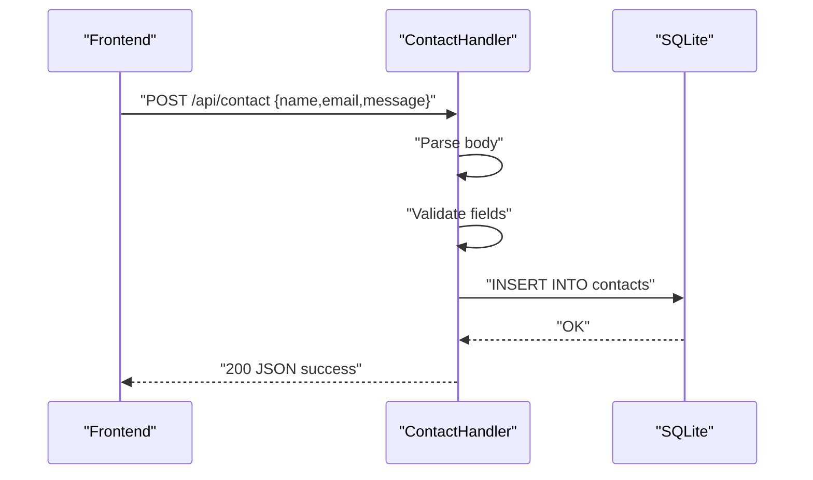

**Diagram sources**
- [Server.java:494-554](file://Server.java#L494-L554)

**Section sources**
- [Server.java:494-554](file://Server.java#L494-L554)

### LoginHandler
Purpose: Authenticate admin credentials and set a session cookie.

Processing workflow:
- Apply CORS headers.
- Handle OPTIONS preflight.
- Validate method is POST.
- Parse body for username/password.
- Compare with hardcoded credentials.
- On success: set session cookie and respond success.
- On failure: respond unauthorized.

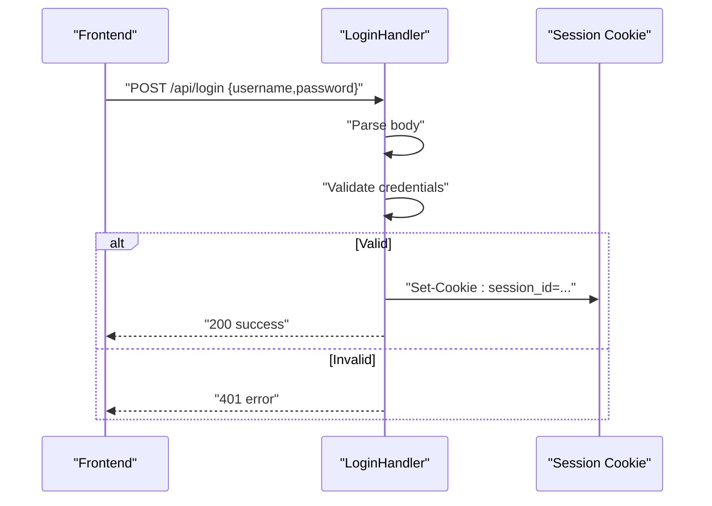

**Diagram sources**
- [Server.java:354-396](file://Server.java#L354-L396)

**Section sources**
- [Server.java:354-396](file://Server.java#L354-L396)

### MessagesHandler
Purpose: Retrieve and delete contact messages (protected).

Processing workflow:
- Apply CORS headers.
- Handle OPTIONS preflight.
- Authenticate via cookie.
- GET: Query contacts table, stream JSON response.
- DELETE: Parse id from query string, delete row, respond success or not-found.

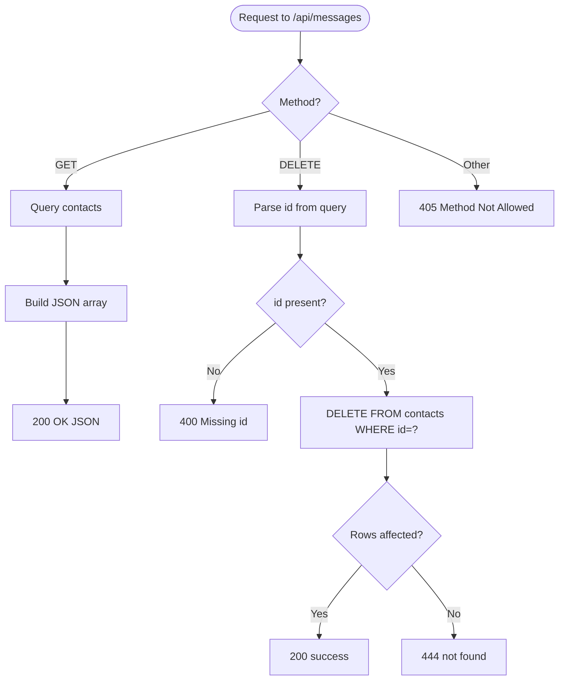

**Diagram sources**
- [Server.java:556-644](file://Server.java#L556-L644)

**Section sources**
- [Server.java:556-644](file://Server.java#L556-L644)

### BookingsHandler
Purpose: Retrieve and delete booking records (protected).

Processing workflow:
- Apply CORS headers.
- Handle OPTIONS preflight.
- Authenticate via cookie.
- GET: Query bookings table ordered by date/time, stream JSON response.
- DELETE: Parse id from query string, delete row, respond success or not-found.

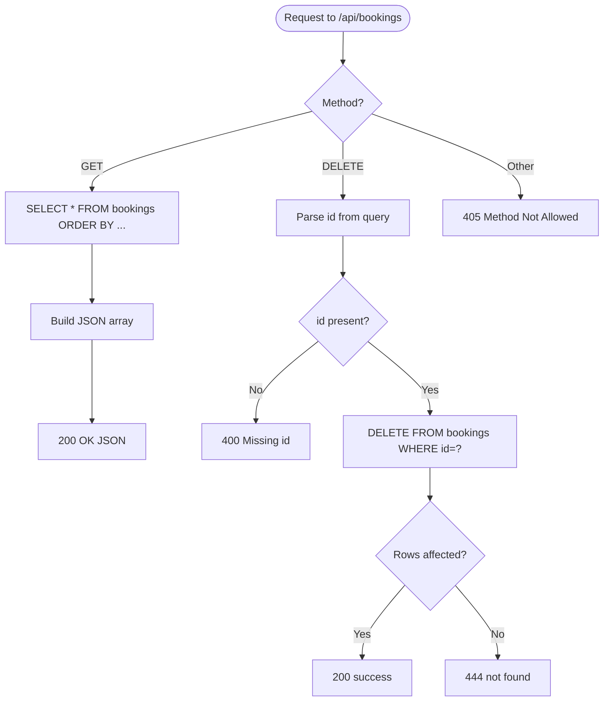

**Diagram sources**
- [Server.java:646-736](file://Server.java#L646-L736)

**Section sources**
- [Server.java:646-736](file://Server.java#L646-L736)

### BookingSubmitHandler
Purpose: Public endpoint to submit consultation bookings.

Processing workflow:
- Apply CORS headers.
- Handle OPTIONS preflight.
- Validate method is POST.
- Parse body for name, email, date, time, topic.
- Validate presence of required fields.
- Insert into SQLite bookings table.
- Respond with success or error.

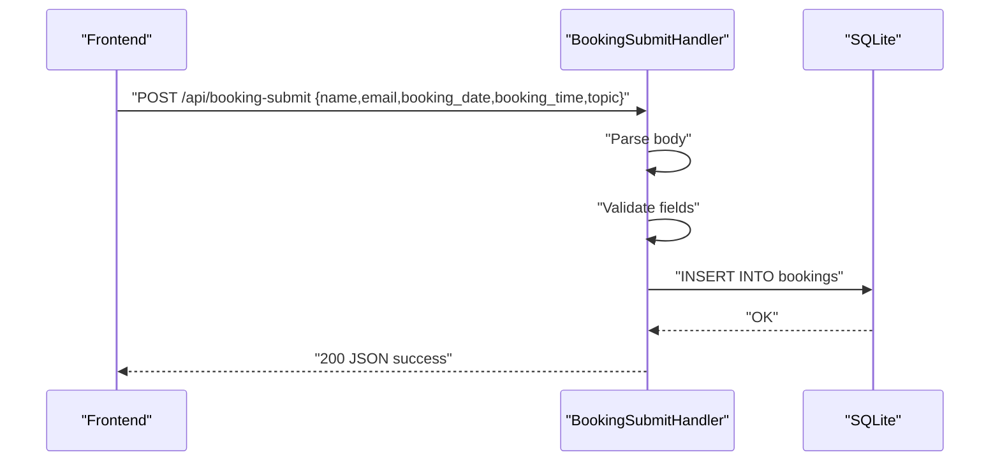

**Diagram sources**
- [Server.java:738-802](file://Server.java#L738-L802)

**Section sources**
- [Server.java:738-802](file://Server.java#L738-L802)

### SettingsHandler
Purpose: Serve portfolio settings and accept updates (protected).

Processing workflow:
- Apply CORS headers.
- Handle OPTIONS preflight.
- GET: Load settings, projects, education, experience from SQLite and return combined JSON.
- POST: Authenticate, parse JSON payload, update portfolio_settings with COALESCE logic, respond success or error.

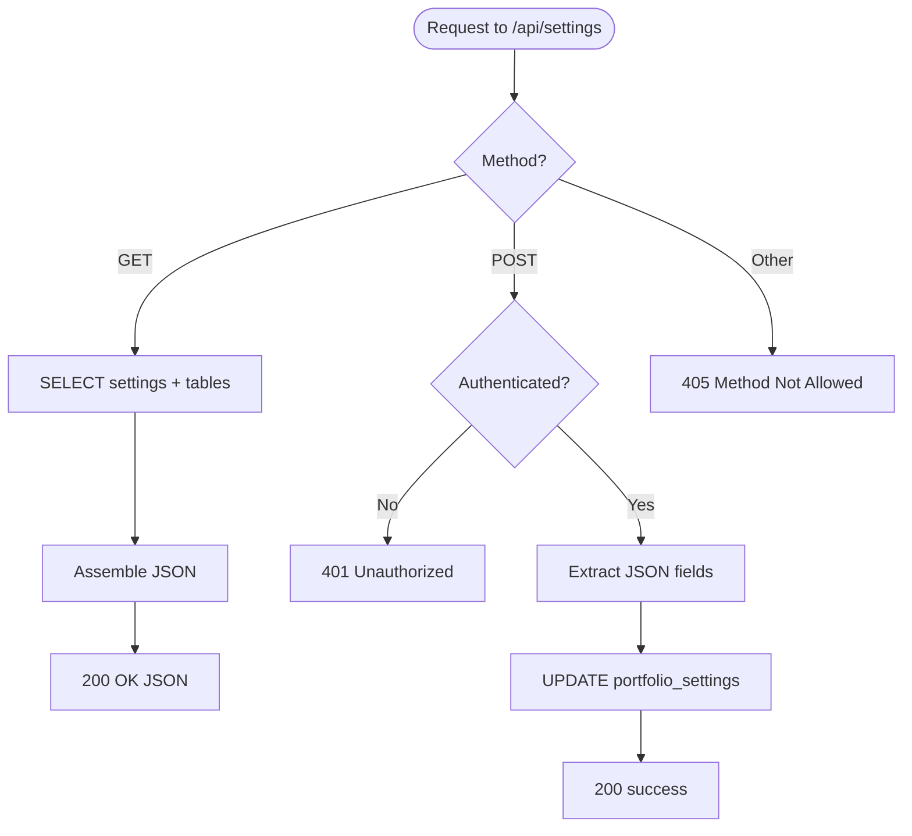

**Diagram sources**
- [Server.java:906-1250](file://Server.java#L906-L1250)

**Section sources**
- [Server.java:906-1250](file://Server.java#L906-L1250)

### CRUD Handlers
Purpose: Manage admin-managed content (projects, education, experience).

- ProjectsCrudHandler: POST to create/update by id; DELETE by id.
- EducationCrudHandler: POST to create/update by id; DELETE by id.
- ExperienceCrudHandler: POST to create/update by id; DELETE by id.

Each handler:
- Applies CORS headers.
- Handles OPTIONS preflight.
- Requires authentication.
- Parses JSON body and validates required fields.
- Performs INSERT or UPDATE for POST; DELETE for DELETE.
- Responds with success or error.

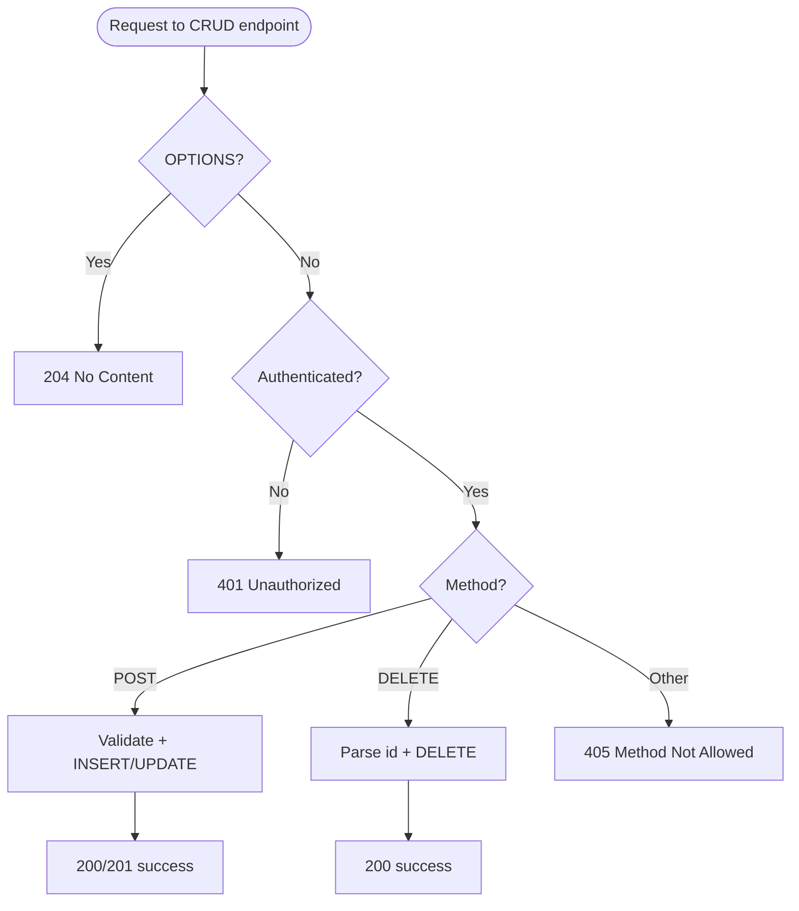

**Diagram sources**
- [Server.java:1252-1377](file://Server.java#L1252-L1377)
- [Server.java:1379-1498](file://Server.java#L1379-L1498)
- [Server.java:1500-1619](file://Server.java#L1500-L1619)

**Section sources**
- [Server.java:1252-1377](file://Server.java#L1252-L1377)
- [Server.java:1379-1498](file://Server.java#L1379-L1498)
- [Server.java:1500-1619](file://Server.java#L1500-L1619)

### StaticFileHandler
Purpose: Serve static assets and enforce authentication for admin routes.

Behavior:
- Only accepts GET.
- Rewrites root to index.html and admin to admin.html.
- Validates authentication for admin.html.
- Prevents directory traversal via canonical checks.
- Streams files with appropriate MIME types.

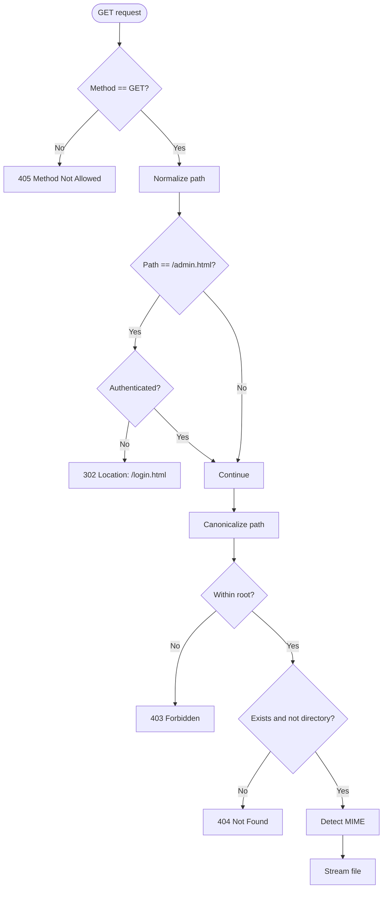

**Diagram sources**
- [Server.java:804-904](file://Server.java#L804-L904)

**Section sources**
- [Server.java:804-904](file://Server.java#L804-L904)

## Dependency Analysis
- Registration: The server registers each handler with HttpServer.createContext.
- Coupling: Handlers depend on shared utilities (CORS, response formatting, body parsing, authentication).
- External dependencies: SQLite JDBC driver and embedded HttpServer.
- Frontend integration: The frontend (main.js) calls the API endpoints and expects JSON responses.

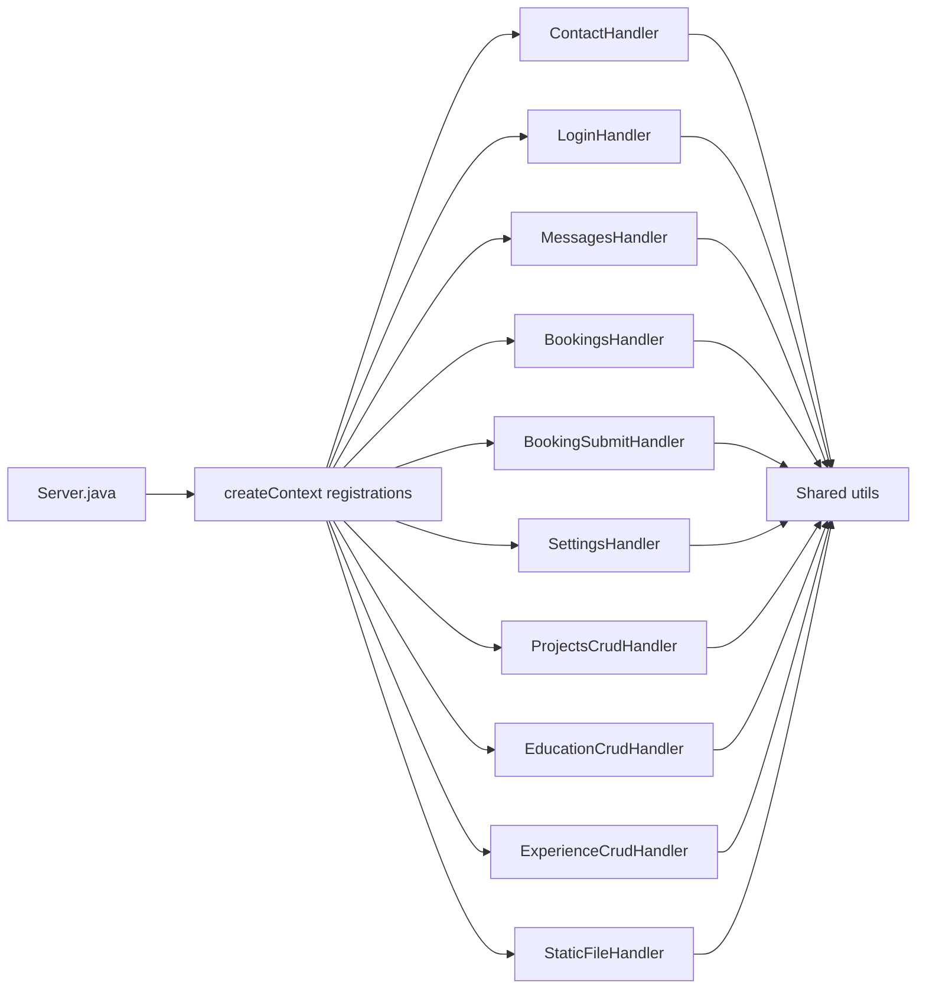

**Diagram sources**
- [Server.java:34-83](file://Server.java#L34-L83)
- [Server.java:354-396](file://Server.java#L354-L396)
- [Server.java:398-411](file://Server.java#L398-L411)
- [Server.java:413-466](file://Server.java#L413-L466)
- [Server.java:494-554](file://Server.java#L494-L554)
- [Server.java:646-736](file://Server.java#L646-L736)
- [Server.java:738-802](file://Server.java#L738-L802)
- [Server.java:906-1250](file://Server.java#L906-L1250)
- [Server.java:1252-1377](file://Server.java#L1252-L1377)
- [Server.java:1379-1498](file://Server.java#L1379-L1498)
- [Server.java:1500-1619](file://Server.java#L1500-L1619)
- [Server.java:804-904](file://Server.java#L804-L904)

**Section sources**
- [Server.java:34-83](file://Server.java#L34-L83)

## Performance Considerations
- Connection pooling: Each handler opens a new connection per request. For higher throughput, consider reusing connections or adding a simple pool.
- Streaming: Responses are streamed; ensure large payloads are handled efficiently.
- Body parsing: The parser reads the entire body into memory; consider streaming parsers for very large payloads.
- Authentication: Cookie parsing is O(n) over cookie list; keep the number of cookies small.
- CORS overhead: Headers are set per request; minimal cost but avoid unnecessary OPTIONS requests by configuring clients appropriately.
- Static file serving: Canonical checks prevent traversal but add filesystem checks; cache frequently accessed files if needed.

## Troubleshooting Guide
Common issues and resolutions:
- Method Not Allowed: Ensure the client uses the correct HTTP verb (e.g., POST for login/contact/booking-submit; GET/DELETE for messages/bookings; GET/POST for settings; POST/DELETE for CRUD).
- Missing or invalid id parameter: For DELETE endpoints (/api/messages?id=..., /api/bookings?id=..., CRUD), ensure the id query parameter is present and numeric.
- Unauthorized: Protected endpoints require a valid session cookie. Verify the login flow and cookie presence.
- Database errors: Inspect SQL exceptions and ensure the database is initialized and tables exist.
- CORS errors: Confirm that the client includes the correct Content-Type and that preflight OPTIONS requests are handled.

Operational tips:
- Use the terminal-like audit log in the admin dashboard to monitor SQL activity.
- Check server logs for uncaught exceptions during handler execution.

**Section sources**
- [Server.java:556-644](file://Server.java#L556-L644)
- [Server.java:646-736](file://Server.java#L646-L736)
- [Server.java:906-1250](file://Server.java#L906-L1250)
- [Server.java:1252-1377](file://Server.java#L1252-L1377)
- [Server.java:1379-1498](file://Server.java#L1379-L1498)
- [Server.java:1500-1619](file://Server.java#L1500-L1619)
- [Server.java:804-904](file://Server.java#L804-L904)

## Conclusion
The handler pattern in this project cleanly separates concerns across endpoint-specific handlers while sharing common utilities for CORS, authentication, request parsing, and response formatting. The design is straightforward, easy to extend, and suitable for small to medium-sized applications. For production scaling, consider connection pooling, streaming parsers, and centralized error handling middleware.