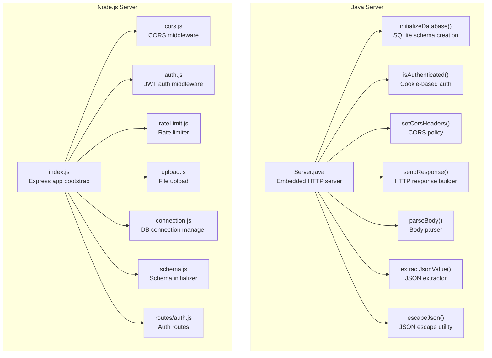
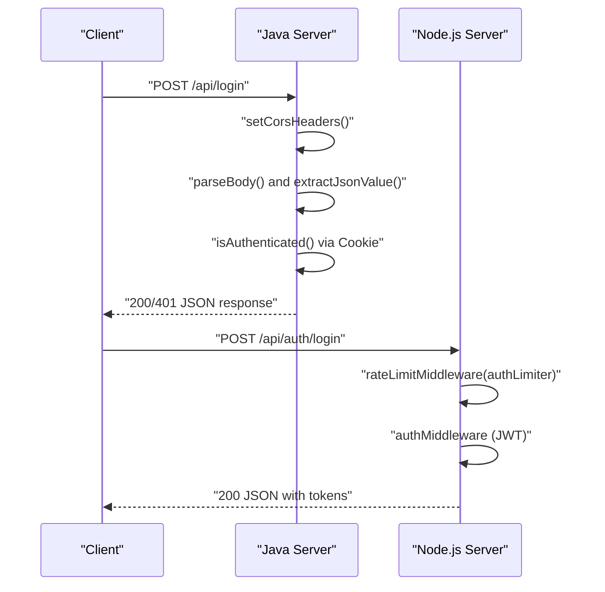
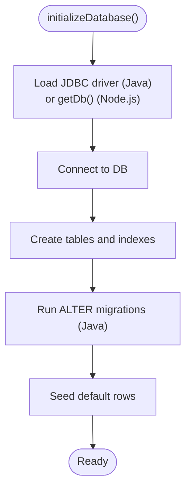
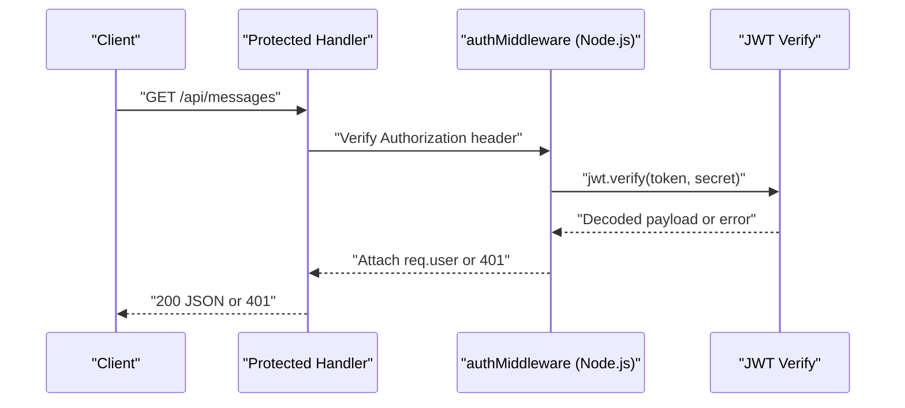
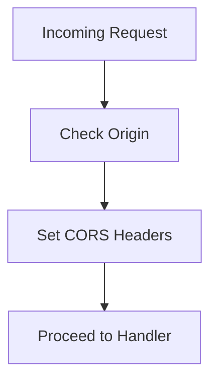
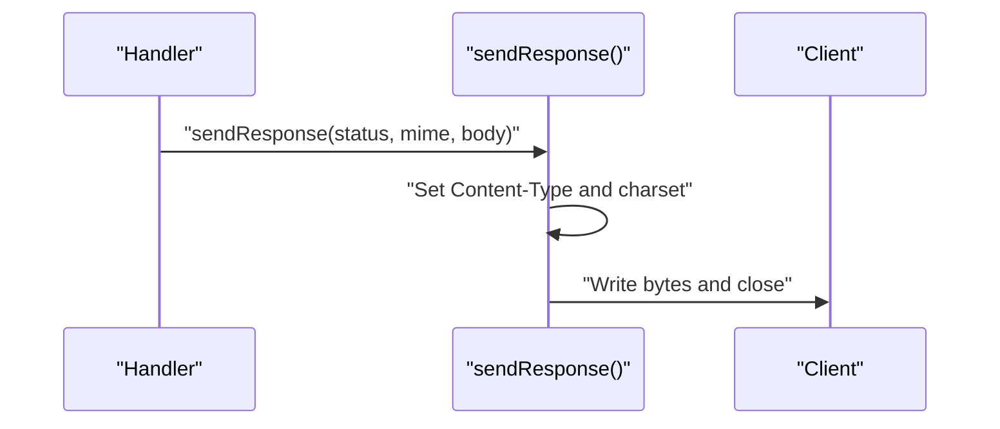
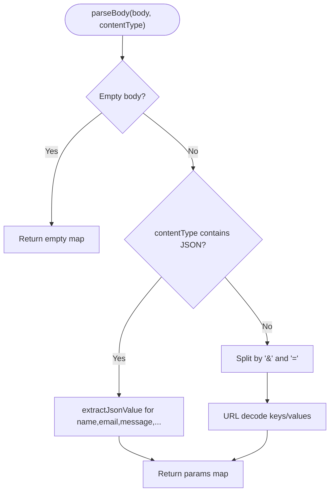
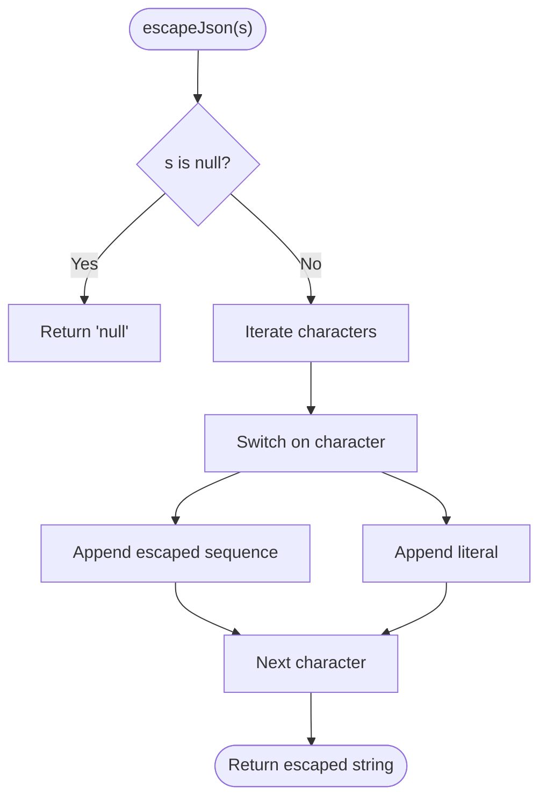
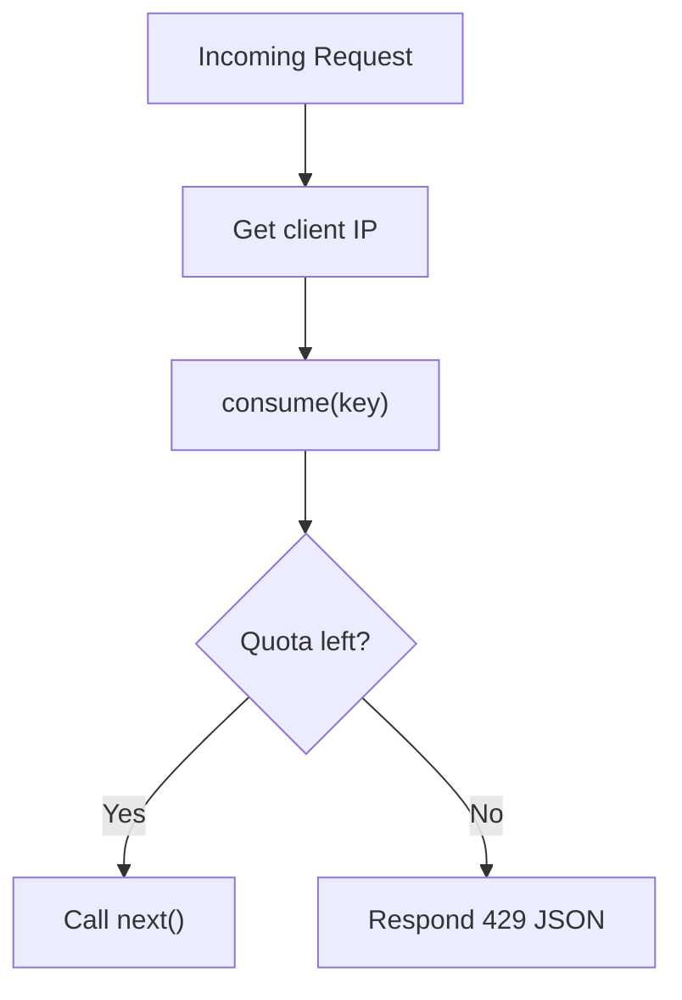
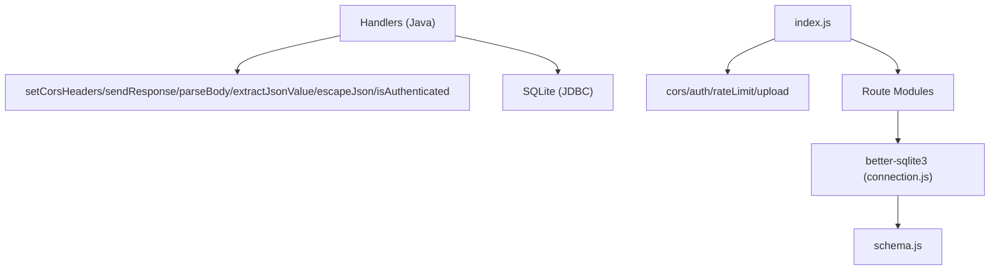

# Utility Methods and Helpers

<cite>
**Referenced Files in This Document**
- [Server.java](file://Server.java)
- [index.js](file://server/index.js)
- [cors.js](file://server/middleware/cors.js)
- [auth.js](file://server/middleware/auth.js)
- [rateLimit.js](file://server/middleware/rateLimit.js)
- [upload.js](file://server/middleware/upload.js)
- [connection.js](file://server/db/connection.js)
- [schema.js](file://server/db/schema.js)
- [auth.js](file://server/routes/auth.js)
</cite>

## Table of Contents
1. [Introduction](#introduction)
2. [Project Structure](#project-structure)
3. [Core Components](#core-components)
4. [Architecture Overview](#architecture-overview)
5. [Detailed Component Analysis](#detailed-component-analysis)
6. [Dependency Analysis](#dependency-analysis)
7. [Performance Considerations](#performance-considerations)
8. [Troubleshooting Guide](#troubleshooting-guide)
9. [Conclusion](#conclusion)

## Introduction
This document focuses on the utility methods and helper functions that support the backend’s database initialization, authentication verification, CORS header configuration, response formatting, request body parsing, JSON escaping, and value extraction. It explains how these helpers are implemented, how they are used across handlers and middleware, and how they contribute to security, reliability, and maintainability. Examples are grounded in the actual codebase to help both beginners and experienced developers understand patterns, error handling, and optimization strategies.

## Project Structure
The backend consists of two primary server implementations:
- A Java-based embedded HTTP server that handles static files, contact/bookings submissions, and admin endpoints with basic authentication and cookie-based sessions.
- A Node.js/Express-based server that provides a modernized API with JWT-based authentication, CORS, rate limiting, uploads, and richer admin capabilities.

Key utility areas:
- Database initialization and schema seeding
- Authentication verification and token generation
- CORS policy enforcement
- Response construction and error messaging
- Request body parsing and JSON value extraction
- JSON escaping for safe output
- Middleware composition and error handling

**Diagram sources**
- [Server.java:85-337](file://Server.java#L85-L337)
- [Server.java:339-492](file://Server.java#L339-L492)
- [index.js:1-143](file://server/index.js#L1-L143)
- [cors.js:1-26](file://server/middleware/cors.js#L1-L26)
- [auth.js:1-62](file://server/middleware/auth.js#L1-L62)
- [rateLimit.js:1-29](file://server/middleware/rateLimit.js#L1-L29)
- [upload.js:1-35](file://server/middleware/upload.js#L1-L35)
- [connection.js:1-25](file://server/db/connection.js#L1-L25)
- [schema.js:1-287](file://server/db/schema.js#L1-L287)
- [auth.js:1-141](file://server/routes/auth.js#L1-L141)

**Section sources**
- [Server.java:34-83](file://Server.java#L34-L83)
- [index.js:25-52](file://server/index.js#L25-L52)

## Core Components
This section outlines the core utility methods and their roles:

- Database initialization and schema management
  - Java: initializeDatabase creates tables, seeds defaults, and migrates schema.
  - Node.js: initializeDatabase ensures tables exist, seeds defaults, and adds admin/user/session tables.
- Authentication verification and token utilities
  - Java: isAuthenticated checks a session cookie for admin access.
  - Node.js: authMiddleware verifies JWT Authorization headers; optionalAuth allows optional token presence.
- CORS policy enforcement
  - Java: setCorsHeaders sets permissive headers for cross-origin requests.
  - Node.js: cors middleware defines allowed origins/methods/headers and credentials.
- Response construction and error handling
  - Java: sendResponse sets Content-Type, status, and writes UTF-8 payloads.
  - Node.js: centralized error handler responds consistently; routes return structured JSON.
- Request body parsing and JSON extraction
  - Java: parseBody supports JSON and form-encoded bodies; extractJsonValue retrieves values safely.
  - Node.js: Express middleware parses JSON and URL-encoded bodies; routes consume parsed data.
- JSON escaping
  - Java: escapeJson escapes special characters for safe inclusion in JSON strings.
  - Node.js: similar concerns are addressed via safe serialization and escaping in templates/logs.

**Section sources**
- [Server.java:85-337](file://Server.java#L85-L337)
- [Server.java:339-492](file://Server.java#L339-L492)
- [index.js:105-112](file://server/index.js#L105-L112)
- [cors.js:3-23](file://server/middleware/cors.js#L3-L23)
- [auth.js:23-53](file://server/middleware/auth.js#L23-L53)
- [schema.js:4-284](file://server/db/schema.js#L4-L284)

## Architecture Overview
The Java server initializes SQLite, registers handlers for public/admin endpoints, and applies CORS and authentication checks per request. The Node.js server composes middleware for CORS, rate limiting, uploads, and JWT-based authentication, then routes requests to modular route handlers.

**Diagram sources**
- [Server.java:355-396](file://Server.java#L355-L396)
- [Server.java:398-411](file://Server.java#L398-L411)
- [Server.java:413-466](file://Server.java#L413-L466)
- [index.js:30-37](file://server/index.js#L30-L37)
- [auth.js:11-50](file://server/routes/auth.js#L11-L50)

## Detailed Component Analysis

### Database Initialization Utilities
- Purpose: Ensure SQLite schema exists, create tables, seed defaults, and migrate older schemas.
- Implementation highlights:
  - Java: initializeDatabase loads the JDBC driver, connects to DB, executes DDL statements, runs ALTER migrations for new columns, and seeds default rows for contacts, bookings, portfolio_settings, projects, education, and experience.
  - Node.js: initializeDatabase uses better-sqlite3, creates admin/user/session/sections/pages/media/api_keys/activity_logs/backups/analytics_events/component_templates tables, and seeds defaults for portfolio_settings, projects, education, experience, and a default admin user with hashed password.
- Error handling: Java logs SQL exceptions during initialization; Node.js logs successful schema creation and seeding steps.
- Performance considerations: Uses WAL mode and foreign keys in Node.js; migrations are idempotent to avoid repeated errors.

**Diagram sources**
- [Server.java:85-337](file://Server.java#L85-L337)
- [schema.js:4-284](file://server/db/schema.js#L4-L284)

**Section sources**
- [Server.java:85-337](file://Server.java#L85-L337)
- [schema.js:4-284](file://server/db/schema.js#L4-L284)
- [connection.js:8-22](file://server/db/connection.js#L8-L22)

### Authentication Verification and JWT Utilities
- Cookie-based authentication (Java):
  - isAuthenticated reads the Cookie header, splits by semicolon, trims whitespace, and compares the session_id=value against a fixed authorized value.
  - Used to gate protected endpoints like /api/messages and /api/bookings.
- JWT-based authentication (Node.js):
  - authMiddleware validates Authorization: Bearer <token>, decodes JWT, attaches user info to request, and handles token expiration and invalid tokens.
  - optionalAuth allows requests to proceed even if token is missing or invalid, useful for read-only endpoints.
  - generateAccessToken and generateRefreshToken produce short-lived and long-lived tokens respectively.
- Security considerations:
  - Prefer JWT over cookies for stateless APIs.
  - Validate token issuer/audience if extended.
  - Use HTTPS and secure cookies for cookie-based auth.
  - Enforce strict rate limits on auth endpoints.

**Diagram sources**
- [auth.js:23-40](file://server/middleware/auth.js#L23-L40)
- [auth.js:11-50](file://server/routes/auth.js#L11-L50)

**Section sources**
- [Server.java:339-352](file://Server.java#L339-L352)
- [auth.js:23-61](file://server/middleware/auth.js#L23-L61)
- [auth.js:11-141](file://server/routes/auth.js#L11-L141)

### CORS Policy Implementation
- Java:
  - setCorsHeaders sets Access-Control-Allow-Origin to wildcard, methods to GET/POST/DELETE/OPTIONS, and headers to Content-Type.
- Node.js:
  - cors middleware defines allowedOrigins (including SITE_URL and localhost ports), methods, allowedHeaders, and credentials.
- Best practices:
  - Restrict Access-Control-Allow-Origin to known domains in production.
  - Align allowedHeaders with actual request headers.
  - Use preflight handling for complex requests.

**Diagram sources**
- [Server.java:398-402](file://Server.java#L398-L402)
- [cors.js:3-23](file://server/middleware/cors.js#L3-L23)

**Section sources**
- [Server.java:398-402](file://Server.java#L398-L402)
- [cors.js:3-23](file://server/middleware/cors.js#L3-L23)

### Response Sending and Error Handling
- Java:
  - sendResponse sets Content-Type with UTF-8 charset, sends status code, writes response bytes to OutputStream.
  - Handlers call sendResponse with appropriate status codes and JSON payloads.
- Node.js:
  - Centralized error handler responds with structured JSON and logs errors.
  - Routes return consistent JSON responses for success/error scenarios.
- Debugging tips:
  - Log request method, URI, and status before responding.
  - Include requestId or correlationId for tracing.

**Diagram sources**
- [Server.java:404-411](file://Server.java#L404-L411)

**Section sources**
- [Server.java:404-411](file://Server.java#L404-L411)
- [index.js:105-112](file://server/index.js#L105-L112)

### Request Body Parsing and JSON Value Extraction
- Java:
  - parseBody supports application/json and application/x-www-form-urlencoded:
    - For JSON, it extracts values using extractJsonValue.
    - For form-encoded, it splits by "&" and "=" and URL-decodes keys/values.
  - extractJsonValue uses regex to match "key":"value" or "key":value, then unescapes common sequences.
- Node.js:
  - Express middleware parses JSON and URL-encoded bodies automatically.
  - Routes consume req.body directly.
- Security and robustness:
  - Validate content-type and sanitize extracted values.
  - Reject malformed JSON and oversized payloads.

**Diagram sources**
- [Server.java:413-446](file://Server.java#L413-L446)
- [Server.java:448-466](file://Server.java#L448-L466)

**Section sources**
- [Server.java:413-466](file://Server.java#L413-L466)

### JSON Escaping Utility
- Java:
  - escapeJson replaces quotes, backslashes, and control characters with escaped equivalents and encodes control characters below ASCII 32 as \uXXXX.
- Node.js:
  - Similar concerns are mitigated by using JSON.stringify and careful templating/logging.

**Diagram sources**
- [Server.java:469-492](file://Server.java#L469-L492)

**Section sources**
- [Server.java:469-492](file://Server.java#L469-L492)

### Rate Limiting and Upload Utilities
- Rate limiting (Node.js):
  - rateLimitMiddleware wraps a limiter to enforce points/duration quotas per IP.
  - Separate authLimiter is stricter for sensitive endpoints.
- Upload handling (Node.js):
  - upload middleware stores files in uploads/, generates unique filenames, enforces size limits, and filters allowed extensions.

**Diagram sources**
- [rateLimit.js:16-26](file://server/middleware/rateLimit.js#L16-L26)

**Section sources**
- [rateLimit.js:1-29](file://server/middleware/rateLimit.js#L1-L29)
- [upload.js:1-35](file://server/middleware/upload.js#L1-L35)

## Dependency Analysis
- Java server:
  - Handlers depend on setCorsHeaders, sendResponse, parseBody, extractJsonValue, escapeJson, and isAuthenticated.
  - Database operations depend on JDBC and SQLite.
- Node.js server:
  - index.js composes middleware and routes; routes depend on auth middleware, rate limiter, upload middleware, and database connection/schema.
  - Database connection uses better-sqlite3 with WAL and foreign keys enabled.

**Diagram sources**
- [Server.java:355-800](file://Server.java#L355-L800)
- [index.js:1-143](file://server/index.js#L1-L143)
- [connection.js:1-25](file://server/db/connection.js#L1-L25)
- [schema.js:1-287](file://server/db/schema.js#L1-L287)

**Section sources**
- [Server.java:355-800](file://Server.java#L355-L800)
- [index.js:1-143](file://server/index.js#L1-L143)

## Performance Considerations
- Database
  - Use WAL mode and foreign keys for concurrency and integrity (Node.js).
  - Keep migrations idempotent to avoid repeated overhead (Java).
- Parsing and escaping
  - Prefer streaming body reads only when necessary; reuse buffers for large payloads.
  - Minimize regex complexity in extractJsonValue; cache compiled patterns if reused frequently.
- Responses
  - Reuse byte arrays for small, static responses.
  - Avoid unnecessary string concatenations; use builders for large JSON payloads.
- Middleware
  - Place rate limiting before heavy handlers to reduce load.
  - Compress responses where applicable (Node.js uses compression middleware).

## Troubleshooting Guide
- Database initialization failures (Java)
  - Symptoms: SQLite JDBC driver not found or SQL exceptions during schema creation.
  - Actions: Verify driver availability and DB URL; check logs for specific SQL errors.
- Authentication errors (Node.js)
  - Symptoms: 401 responses for protected endpoints.
  - Actions: Confirm Authorization header format, token validity, and that sessions exist for refresh tokens.
- CORS errors (Both servers)
  - Symptoms: Preflight failures or blocked requests.
  - Actions: Ensure Access-Control-Allow-Origin matches the requesting origin; align allowed methods/headers.
- Body parsing issues (Java)
  - Symptoms: Missing fields in JSON/form submissions.
  - Actions: Validate Content-Type; confirm extractJsonValue matches expected keys; log raw body for debugging.
- JSON escaping issues
  - Symptoms: Malformed JSON responses or injection risks.
  - Actions: Use escapeJson for dynamic values; sanitize inputs before insertion.

**Section sources**
- [Server.java:85-337](file://Server.java#L85-L337)
- [Server.java:339-492](file://Server.java#L339-L492)
- [index.js:105-112](file://server/index.js#L105-L112)
- [cors.js:3-23](file://server/middleware/cors.js#L3-L23)
- [auth.js:23-61](file://server/middleware/auth.js#L23-L61)

## Conclusion
The utility methods and helpers in this backend provide a solid foundation for database initialization, authentication, CORS, response handling, request parsing, and JSON escaping. By leveraging these patterns—consistent error handling, explicit CORS policies, robust parsing, and safe output escaping—the system remains maintainable, secure, and performant. Adopting these practices across handlers and middleware ensures predictable behavior and simplifies debugging and extension.