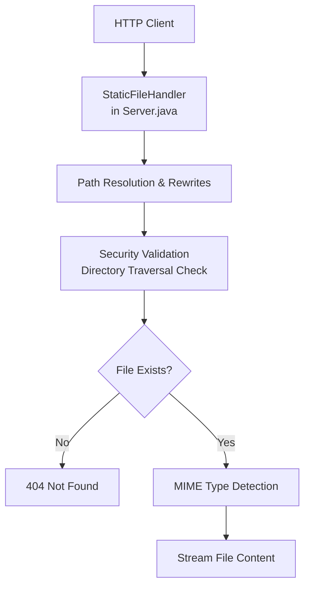
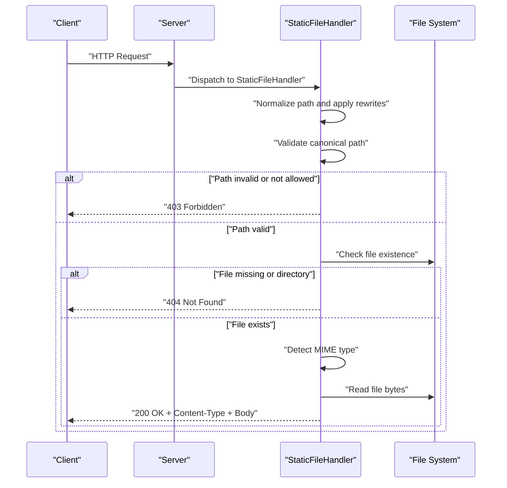
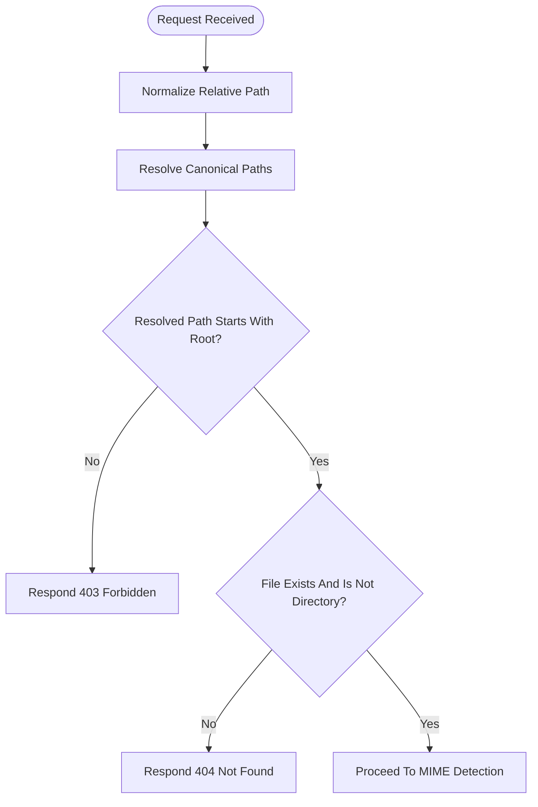
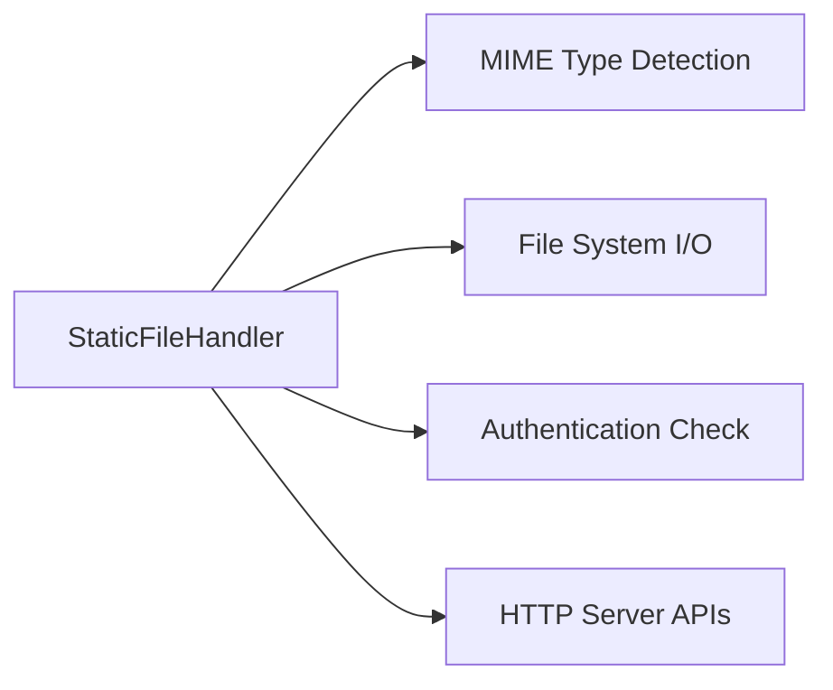

# Static File Serving

<cite>
**Referenced Files in This Document**
- [Server.java](file://Server.java)
</cite>

## Table of Contents
1. [Introduction](#introduction)
2. [Project Structure](#project-structure)
3. [Core Components](#core-components)
4. [Architecture Overview](#architecture-overview)
5. [Detailed Component Analysis](#detailed-component-analysis)
6. [Dependency Analysis](#dependency-analysis)
7. [Performance Considerations](#performance-considerations)
8. [Troubleshooting Guide](#troubleshooting-guide)
9. [Conclusion](#conclusion)

## Introduction
This document explains the static file serving implementation in the project’s embedded HTTP server. It covers how requests are routed to the StaticFileHandler, how file paths are resolved and validated, how content types are determined, and how security controls prevent unauthorized access and directory traversal. It also documents fallback behavior for missing files, and provides guidance on performance and security considerations.

## Project Structure
The static file serving logic resides in a single Java class that implements the HTTP handler interface. The server exposes a StaticFileHandler that serves files from the current working directory and enforces strict path validation and access control.

**Diagram sources**
- [Server.java](file://Server.java)

**Section sources**
- [Server.java](file://Server.java)

## Core Components
- StaticFileHandler: Implements the HTTP handler that serves static assets from the file system.
- Path resolution and rewrites: Handles root and admin route rewrites, and clean URL mapping to HTML files.
- Security validation: Enforces canonical path checks to prevent directory traversal.
- MIME type detection: Determines the appropriate Content-Type header for responses.
- Access control: Redirects unauthenticated users attempting to access admin pages.
- Error handling: Returns 403 for forbidden paths and 404 for missing files.

**Section sources**
- [Server.java](file://Server.java)

## Architecture Overview
The StaticFileHandler participates in the server’s request routing pipeline. It receives incoming HTTP requests, normalizes the requested path, validates access and safety, determines the content type, and streams the file content back to the client.

**Diagram sources**
- [Server.java](file://Server.java)

## Detailed Component Analysis

### StaticFileHandler Implementation
The StaticFileHandler encapsulates the logic to serve static files. It performs:
- Root and admin route rewriting to HTML files.
- Clean URL resolution to .html files when applicable.
- Canonical path validation against the server’s root directory.
- Existence and type checks to ensure a file is served safely.
- MIME type detection and streaming of file content.

Key behaviors:
- Root path rewrite to index.html.
- Admin path rewrite to admin.html.
- Authentication check for admin.html.
- Canonical path normalization and traversal prevention.
- Existence and directory checks with 404 fallback.
- MIME type detection and Content-Type header setting.
- Streaming of file bytes with 200 OK status.

**Section sources**
- [Server.java](file://Server.java)

### Path Resolution and Rewrites
- Root path (/) and empty path are rewritten to index.html.
- Admin path (/admin or /admin/) is rewritten to admin.html.
- Clean URLs (no dot in path and not ending with /) are checked for a corresponding .html file; if present, the path is extended to include the .html suffix.

These steps ensure that simple URLs map to HTML files without exposing the filesystem structure.

**Section sources**
- [Server.java](file://Server.java)

### Security Validation and Directory Traversal Prevention
- The requested relative path is normalized using canonical resolution.
- The resolved file path is compared against the server’s root directory path (also canonicalized).
- If the resolved file path does not start with the root path, the request is rejected with 403 Forbidden.
- If the file does not exist or is a directory, the server responds with 404 Not Found.

This mechanism prevents attackers from accessing files outside the intended directory by using sequences like ../ or absolute paths.

**Diagram sources**
- [Server.java](file://Server.java)

**Section sources**
- [Server.java](file://Server.java)

### Content Type Determination (MIME Types)
- The handler detects the MIME type based on the file name.
- The Content-Type header is set accordingly before sending the response.
- The response body is streamed as bytes.

Supported file types depend on the MIME type mapping logic. While the exact mapping is internal to the MIME detection routine, the handler sets the Content-Type header based on the detected type.

**Section sources**
- [Server.java](file://Server.java)

### Access Control for Static Resources
- Requests to admin.html are subject to authentication.
- Unauthenticated clients attempting to access admin.html are redirected to login.html with a 302 status.
- Other static files are served without additional authentication checks.

**Section sources**
- [Server.java](file://Server.java)

### Error Handling for Missing Files
- If the canonical path check fails, the server returns 403 Forbidden.
- If the file does not exist or is a directory, the server returns 404 Not Found.
- The handler avoids falling back to index.html for missing files; it treats such cases as 404.

**Section sources**
- [Server.java](file://Server.java)

### Example Workflows

#### Serving index.html from root
- Request path: /
- Rewritten to: /index.html
- Canonical path validated and file checked
- MIME type detected and file streamed

**Section sources**
- [Server.java](file://Server.java)

#### Serving admin.html with authentication
- Request path: /admin.html
- Authentication verified
- On success: MIME type detected and file streamed
- On failure: 302 redirect to /login.html

**Section sources**
- [Server.java](file://Server.java)

#### Serving a clean URL mapped to an HTML file
- Request path: /about
- Resolved to: /about.html (if about.html exists)
- Canonical path validated and file streamed

**Section sources**
- [Server.java](file://Server.java)

#### Handling a non-existent resource
- Request path: /nonexistent
- After clean URL mapping, file does not exist
- Respond 404 Not Found

**Section sources**
- [Server.java](file://Server.java)

#### Preventing directory traversal
- Request path: /../../../etc/passwd
- Canonical path resolves outside the server root
- Respond 403 Forbidden

**Section sources**
- [Server.java](file://Server.java)

## Dependency Analysis
The StaticFileHandler depends on:
- Java’s built-in HTTP server APIs for request/response handling.
- File system APIs for path resolution, existence checks, and reading file bytes.
- A MIME type detection routine to set the Content-Type header.
- An authentication routine for protecting admin.html.

**Diagram sources**
- [Server.java](file://Server.java)

**Section sources**
- [Server.java](file://Server.java)

## Performance Considerations
- Current implementation reads entire files into memory before sending them to the client. This is simple but can increase memory usage for large files.
- For production deployments, consider:
  - Streaming file content in chunks to reduce memory footprint.
  - Adding ETag or Last-Modified support to enable client-side caching.
  - Implementing gzip/brotli compression for text-based assets (HTML, CSS, JS, JSON).
  - Using a reverse proxy or CDN for static assets to offload CPU and improve latency.
  - Pre-generating cache-control headers per file type to avoid repeated computation.

[No sources needed since this section provides general guidance]

## Troubleshooting Guide
Common issues and resolutions:
- 403 Forbidden:
  - Cause: Requested path resolves outside the server root.
  - Resolution: Verify the request path and ensure it stays within the intended directory.
- 404 Not Found:
  - Cause: File does not exist or is a directory.
  - Resolution: Confirm the file exists and is not a directory; ensure clean URL mapping is correct.
- Unexpected MIME type:
  - Cause: MIME detection relies on file name extensions.
  - Resolution: Ensure files have correct extensions; verify the MIME mapping logic.
- Admin access denied:
  - Cause: Missing or invalid authentication.
  - Resolution: Complete the login flow to obtain required credentials.

**Section sources**
- [Server.java](file://Server.java)

## Conclusion
The StaticFileHandler provides a straightforward and secure way to serve static assets. Its canonical path validation and strict access checks mitigate common vulnerabilities like directory traversal and unauthorized access. For enhanced performance and scalability, consider adopting streaming, compression, and caching strategies suitable for production environments.