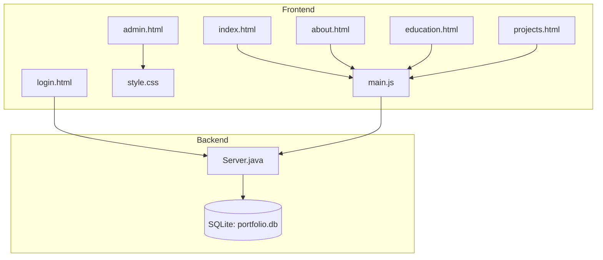
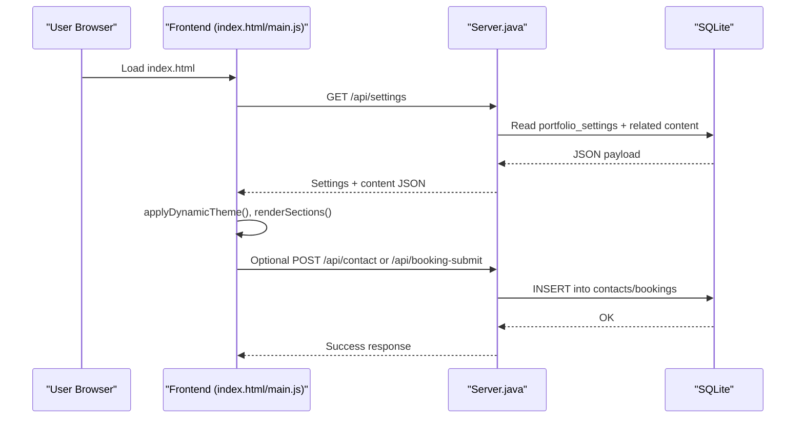
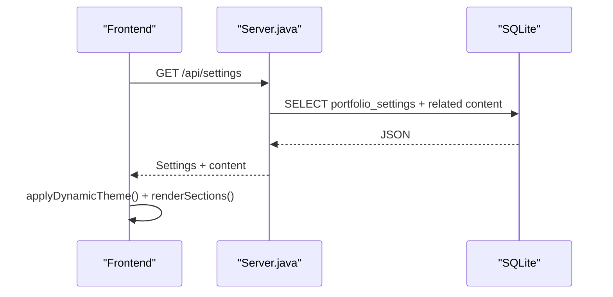
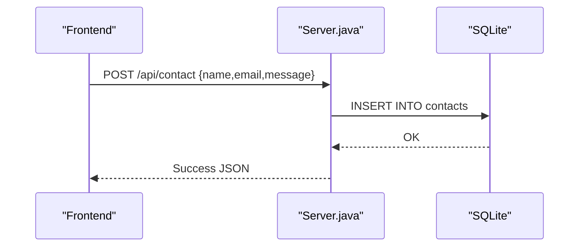
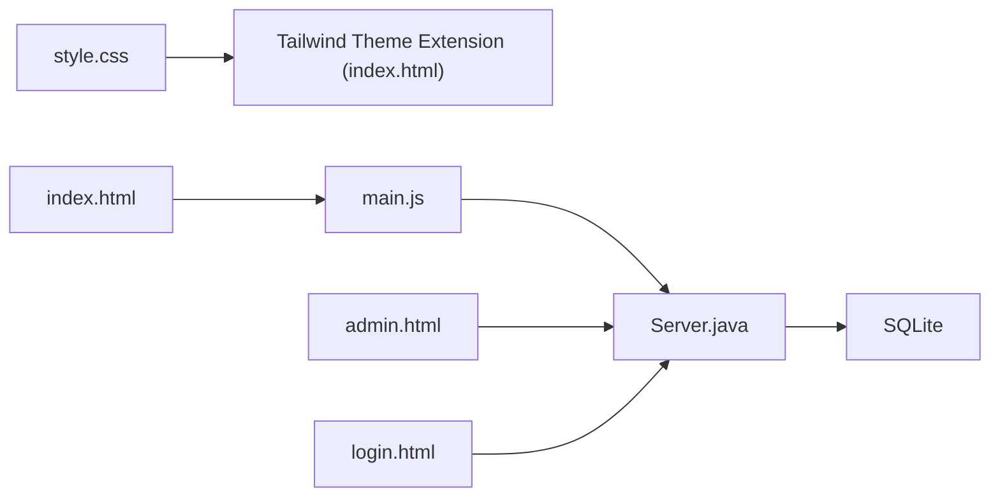

# Customization Guide

<cite>
**Referenced Files in This Document**
- [index.html](file://index.html)
- [style.css](file://style.css)
- [main.js](file://main.js)
- [Server.java](file://Server.java)
- [admin.html](file://admin.html)
- [login.html](file://login.html)
- [about.html](file://about.html)
- [education.html](file://education.html)
- [projects.html](file://projects.html)
- [design.md](file://design.md)
</cite>

## Table of Contents
1. [Introduction](#introduction)
2. [Project Structure](#project-structure)
3. [Core Components](#core-components)
4. [Architecture Overview](#architecture-overview)
5. [Detailed Component Analysis](#detailed-component-analysis)
6. [Dependency Analysis](#dependency-analysis)
7. [Performance Considerations](#performance-considerations)
8. [Troubleshooting Guide](#troubleshooting-guide)
9. [Conclusion](#conclusion)
10. [Appendices](#appendices)

## Introduction
This guide documents how to customize the Premium Portfolio application across theme and visual design, typography, layout configuration, content management, branding, performance, SEO, and responsive behavior. It also covers integration points with the backend and extension possibilities for future enhancements.

## Project Structure
The application consists of:
- A static front-end with HTML pages and shared CSS/JS
- A Java-based HTTP server providing a REST API and managing SQLite-backed content
- An embedded admin panel for live customization and content management

**Diagram sources**
- [index.html](file://index.html)
- [about.html](file://about.html)
- [education.html](file://education.html)
- [projects.html](file://projects.html)
- [admin.html](file://admin.html)
- [login.html](file://login.html)
- [style.css](file://style.css)
- [main.js](file://main.js)
- [Server.java](file://Server.java)

**Section sources**
- [index.html](file://index.html)
- [style.css](file://style.css)
- [main.js](file://main.js)
- [Server.java](file://Server.java)
- [admin.html](file://admin.html)
- [login.html](file://login.html)
- [about.html](file://about.html)
- [education.html](file://education.html)
- [projects.html](file://projects.html)
- [design.md](file://design.md)

## Core Components
- Theme and visual system: CSS custom properties define brand colors, surfaces, fonts, and motion tokens. Tailwind integrates with CSS variables for dynamic theming.
- Dynamic content pipeline: The front-end fetches settings and content from the backend and renders sections dynamically.
- Admin panel: Provides live customization of theme, typography, layout order, and content via the backend API.
- Backend API: Exposes endpoints for settings, content CRUD, authentication, and data retrieval.

Key customization touchpoints:
- CSS variables in [style.css](file://style.css)
- Tailwind theme extension and dynamic rules in [index.html](file://index.html)
- Dynamic rendering and API calls in [main.js](file://main.js)
- Backend routes and schema in [Server.java](file://Server.java)
- Admin controls and live preview in [admin.html](file://admin.html)

**Section sources**
- [style.css](file://style.css)
- [index.html](file://index.html)
- [main.js](file://main.js)
- [Server.java](file://Server.java)
- [admin.html](file://admin.html)

## Architecture Overview
The system follows a static HTML/CSS/JS front-end with a Java HTTP server acting as a CMS-like backend. The front-end initializes animations and dynamic content, while the backend manages persistence and exposes a REST API.

**Diagram sources**
- [index.html](file://index.html)
- [main.js](file://main.js)
- [Server.java](file://Server.java)

## Detailed Component Analysis

### Theme and Visual Customization
- CSS custom properties: Centralize brand colors, surfaces, and typography in [style.css](file://style.css). These drive Tailwind’s theme extension in [index.html](file://index.html).
- Tailwind theme extension: Adds brand aliases mapped to CSS variables for seamless design tokens.
- Dynamic theme application: The front-end reads settings and updates CSS variables and Tailwind classes at runtime.

Practical steps:
- Change brand colors by editing CSS variables in [style.css](file://style.css).
- Update font families via Tailwind’s theme extension in [index.html](file://index.html).
- Use the admin panel to preview and persist theme changes.

**Section sources**
- [style.css](file://style.css)
- [index.html](file://index.html)
- [admin.html](file://admin.html)

### Typography Selection
- Display and body fonts are configured in [index.html](file://index.html) via Tailwind’s theme extension and loaded from Google Fonts.
- Body and heading fonts are defined in [style.css](file://style.css) and applied consistently across components.

Best practices:
- Keep font choices legible and performant; limit font variants to avoid extra network requests.
- Use CSS custom properties for font families to enable live switching.

**Section sources**
- [index.html](file://index.html)
- [style.css](file://style.css)

### Layout Configuration
- Section ordering is persisted in the settings table and consumed by the front-end to render sections in the desired order.
- The admin panel allows drag-and-drop reordering of sections and live preview.

Implementation highlights:
- Settings include a layout order field that determines the sequence of rendered sections.
- The front-end applies the order when rendering content.

**Section sources**
- [Server.java](file://Server.java)
- [admin.html](file://admin.html)
- [main.js](file://main.js)

### Content Management Best Practices
- Use the admin panel to manage:
  - Hero, About, Skills, Education, Experience, Projects
  - Contact and social links
  - SEO metadata and analytics identifiers
- Content is stored in SQLite tables and fetched via the settings endpoint.

Guidelines:
- Keep content concise and scannable.
- Use tags and descriptions to categorize projects and experiences.
- Maintain consistent tone and voice across sections.

**Section sources**
- [Server.java](file://Server.java)
- [admin.html](file://admin.html)
- [main.js](file://main.js)

### Portfolio Personalization Techniques
- Dynamic hero text, subtitle, and description are rendered from settings.
- Skills and experience lists are populated from database tables.
- The admin panel supports live preview and publishing of changes.

**Section sources**
- [main.js](file://main.js)
- [Server.java](file://Server.java)
- [admin.html](file://admin.html)

### Branding Customization
- Brand name, logo text, and footer text are configurable in settings.
- Social links and contact details are managed centrally.

**Section sources**
- [Server.java](file://Server.java)
- [admin.html](file://admin.html)

### Step-by-Step Guides

#### Modify Portfolio Content
1. Navigate to the admin panel and select the “Content Manager” tab.
2. Edit the relevant section (e.g., About, Education, Projects).
3. Use the preview pane to verify changes.
4. Click “Publish” to persist changes to the database.

**Section sources**
- [admin.html](file://admin.html)
- [Server.java](file://Server.java)

#### Add a New Project
1. In the admin panel, go to the “Content Manager” → “Projects.”
2. Use the “Add Project” form to enter title, description, tags, and links.
3. Save and publish; the project will appear on the Projects page.

**Section sources**
- [admin.html](file://admin.html)
- [Server.java](file://Server.java)
- [projects.html](file://projects.html)

#### Update Educational Background
1. In the admin panel, navigate to “Content Manager” → “Education.”
2. Add or edit timeline entries with degree, institution, period, and description.
3. Publish to update the Education page.

**Section sources**
- [admin.html](file://admin.html)
- [Server.java](file://Server.java)
- [education.html](file://education.html)

#### Update Hero Copy and Messaging
1. In the admin panel, open the “Content Manager” → “Hero.”
2. Update hero badge, title, subtitle, and description.
3. Publish to refresh the homepage.

**Section sources**
- [admin.html](file://admin.html)
- [Server.java](file://Server.java)
- [index.html](file://index.html)

### API Workflows

#### Settings Fetch and Render

**Diagram sources**
- [main.js](file://main.js)
- [Server.java](file://Server.java)

#### Contact Submission

**Diagram sources**
- [main.js](file://main.js)
- [Server.java](file://Server.java)

## Dependency Analysis
- Front-end depends on Tailwind CSS variables and GSAP for animations.
- The front-end fetches settings and content from the backend.
- The backend depends on SQLite for persistence and exposes protected endpoints for admin operations.

**Diagram sources**
- [style.css](file://style.css)
- [index.html](file://index.html)
- [main.js](file://main.js)
- [Server.java](file://Server.java)
- [admin.html](file://admin.html)
- [login.html](file://login.html)
- [index.html](file://index.html)

**Section sources**
- [style.css](file://style.css)
- [index.html](file://index.html)
- [main.js](file://main.js)
- [Server.java](file://Server.java)
- [admin.html](file://admin.html)
- [login.html](file://login.html)

## Performance Considerations
- Minimize heavy animations for lower-end devices by toggling animation settings in the admin panel.
- Keep font subsets small; prefer system fonts where possible.
- Use lazy loading for images and defer non-critical scripts.
- Cache static assets and leverage browser caching headers.

[No sources needed since this section provides general guidance]

## Troubleshooting Guide
Common issues and resolutions:
- Settings not applying:
  - Verify the admin panel is authenticated and publishing changes.
  - Check the browser console for fetch errors to the settings endpoint.
- Animations not playing:
  - Ensure animations are enabled in the admin panel.
  - Confirm GSAP resources are loading.
- Content not updating:
  - Confirm the backend is reachable and SQLite tables are initialized.
  - Clear browser cache and reload the page.
- Login failures:
  - Verify credentials and session cookie handling.

**Section sources**
- [admin.html](file://admin.html)
- [login.html](file://login.html)
- [main.js](file://main.js)
- [Server.java](file://Server.java)

## Conclusion
The Premium Portfolio offers a flexible, database-backed customization experience. By leveraging the admin panel, CSS variables, and the backend API, you can tailor themes, typography, layout, and content to reflect your personal brand while maintaining performance and responsiveness.

[No sources needed since this section summarizes without analyzing specific files]

## Appendices

### SEO Customization
- Update SEO title and description in the admin panel under settings.
- Ensure each page has unique meta descriptions and keywords.
- Use semantic headings and structured content for accessibility and SEO.

**Section sources**
- [admin.html](file://admin.html)
- [Server.java](file://Server.java)

### Responsive Design Adjustments
- Use Tailwind’s responsive utilities and breakpoints.
- Test across desktop, tablet, and mobile views in the admin panel’s preview.
- Keep font sizes and spacing scalable using clamp() and relative units.

**Section sources**
- [style.css](file://style.css)
- [index.html](file://index.html)
- [admin.html](file://admin.html)

### Extension Points and Integrations
- Additional REST endpoints can be added in the backend to support new content types or integrations.
- The admin panel can be extended to include new customization controls and previews.
- Consider integrating analytics, forms, or booking systems via the existing API patterns.

**Section sources**
- [Server.java](file://Server.java)
- [design.md](file://design.md)