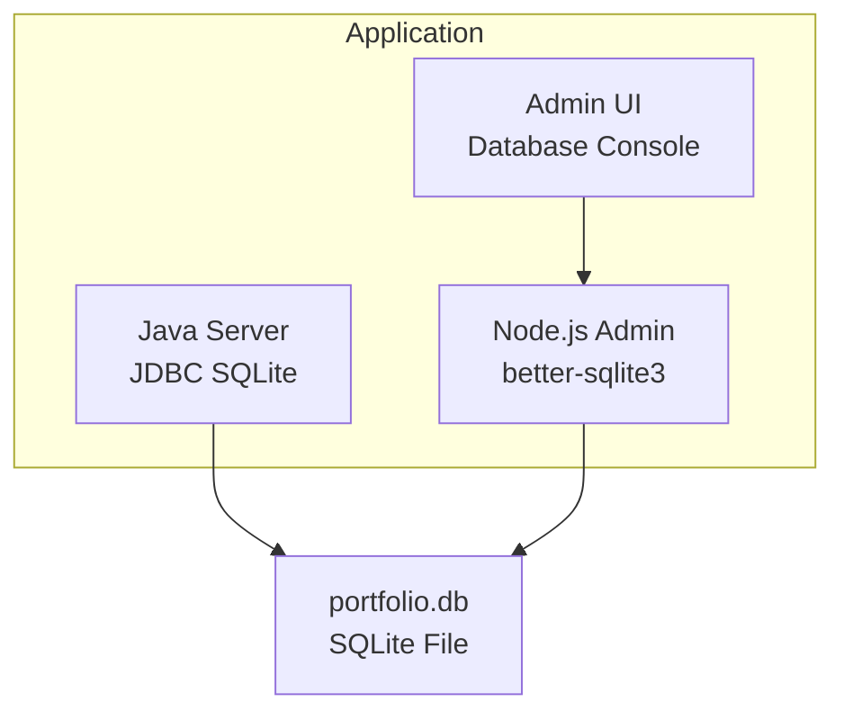
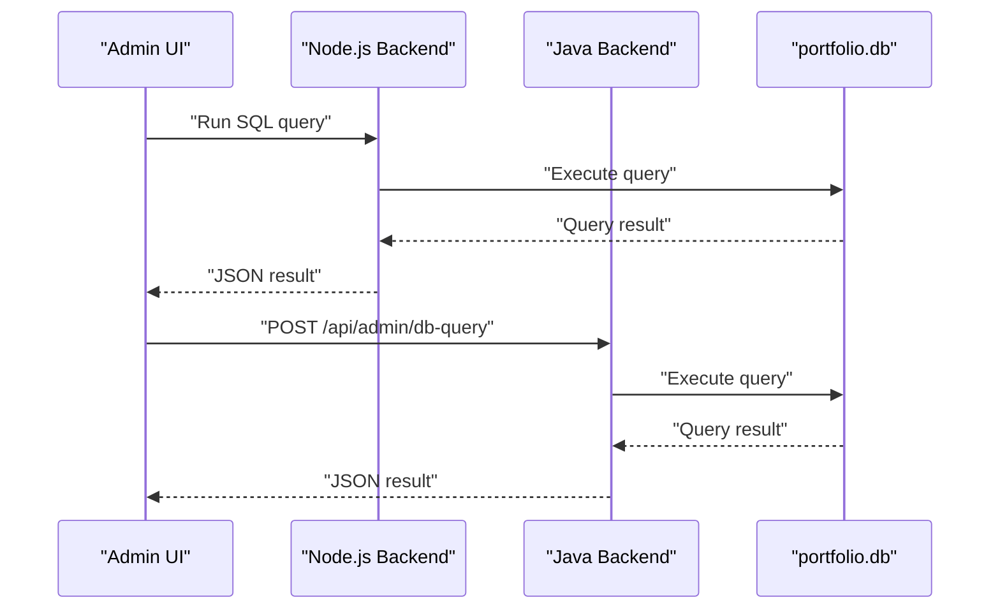
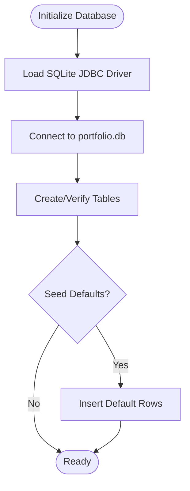
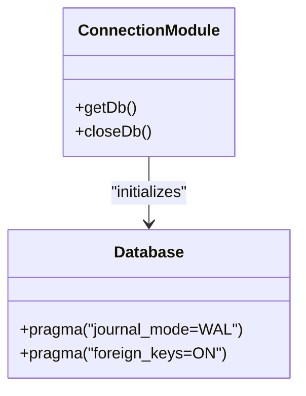
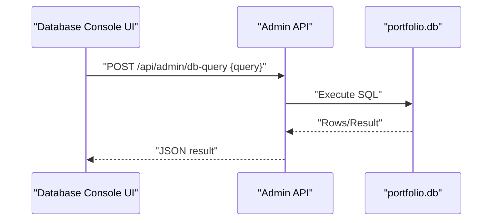
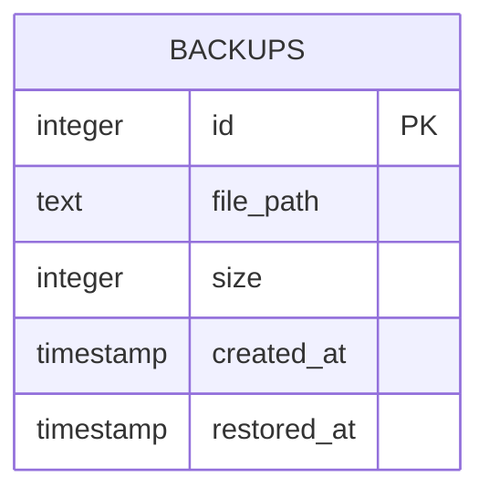
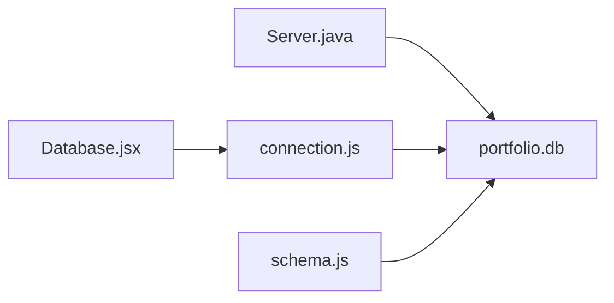

# Backup and Recovery Procedures

<cite>
**Referenced Files in This Document**
- [Server.java](file://Server.java)
- [connection.js](file://server/db/connection.js)
- [schema.js](file://server/db/schema.js)
- [Database.jsx](file://admin/src/pages/Database.jsx)
- [admin.html](file://admin.html)
- [portfolio.db](file://portfolio.db)
- [portfolio.txt](file://portfolio.txt)
</cite>

## Table of Contents
1. [Introduction](#introduction)
2. [Project Structure](#project-structure)
3. [Core Components](#core-components)
4. [Architecture Overview](#architecture-overview)
5. [Detailed Component Analysis](#detailed-component-analysis)
6. [Dependency Analysis](#dependency-analysis)
7. [Performance Considerations](#performance-considerations)
8. [Troubleshooting Guide](#troubleshooting-guide)
9. [Conclusion](#conclusion)
10. [Appendices](#appendices)

## Introduction
This document defines comprehensive backup and recovery procedures for the SQLite database used by the portfolio application. It explains the file-based nature of SQLite, emphasizes direct file copying as the primary backup method, and documents automated and manual strategies. It also covers recovery procedures for common issues such as database locking, corruption, and accidental deletions, along with best practices for integrity checks, maintenance, and production disaster recovery planning.

## Project Structure
The application uses two distinct database implementations:
- A Java-based HTTP server that initializes and manages SQLite tables via JDBC.
- A Node.js-based admin backend that uses better-sqlite3 to manage the same SQLite database.

Both implementations target the same database file, portfolio.db, located at the repository root. The admin panel includes a database console and references to backup/restore capabilities.

**Diagram sources**
- [Server.java:18-83](file://Server.java#L18-L83)
- [connection.js:1-25](file://server/db/connection.js#L1-L25)
- [schema.js:1-287](file://server/db/schema.js#L1-L287)
- [Database.jsx:1-75](file://admin/src/pages/Database.jsx#L1-L75)

**Section sources**
- [Server.java:18-83](file://Server.java#L18-L83)
- [connection.js:1-25](file://server/db/connection.js#L1-L25)
- [schema.js:1-287](file://server/db/schema.js#L1-L287)
- [Database.jsx:1-75](file://admin/src/pages/Database.jsx#L1-L75)

## Core Components
- Database file: portfolio.db (SQLite)
- Java server initialization and table creation (JDBC)
- Node.js connection and PRAGMA configuration (better-sqlite3)
- Admin database console for raw SQL execution
- Backup table definition for tracking backups/restorations

Key implementation references:
- Java JDBC URL and table creation: [Server.java:20](file://Server.java#L20), [Server.java:94-337](file://Server.java#L94-L337)
- Node.js DB path and PRAGMA settings: [connection.js:4-13](file://server/db/connection.js#L4-L13)
- Admin database console endpoint: [Database.jsx:27](file://admin/src/pages/Database.jsx#L27)
- Backups table schema: [schema.js:192-198](file://server/db/schema.js#L192-L198)

**Section sources**
- [Server.java:20](file://Server.java#L20)
- [Server.java:94-337](file://Server.java#L94-L337)
- [connection.js:4-13](file://server/db/connection.js#L4-L13)
- [Database.jsx:27](file://admin/src/pages/Database.jsx#L27)
- [schema.js:192-198](file://server/db/schema.js#L192-L198)

## Architecture Overview
The backup and recovery architecture centers on the single SQLite file, portfolio.db. Both the Java server and Node.js admin backend connect to this file. The admin UI exposes a database console for advanced operations, and a dedicated backups table supports backup metadata tracking.

**Diagram sources**
- [Database.jsx:21-37](file://admin/src/pages/Database.jsx#L21-L37)
- [Server.java:532-544](file://Server.java#L532-L544)

## Detailed Component Analysis

### Database Initialization and Schema
The Java server initializes the database and creates essential tables, including contacts, bookings, portfolio_settings, projects, education, and experience. It also seeds default data when tables are empty.

**Diagram sources**
- [Server.java:85-337](file://Server.java#L85-L337)

**Section sources**
- [Server.java:85-337](file://Server.java#L85-L337)

### Node.js Database Connection and PRAGMA
The Node.js backend connects to portfolio.db and applies PRAGMA settings for journal mode and foreign keys. This ensures consistent transaction behavior and referential integrity.

**Diagram sources**
- [connection.js:8-13](file://server/db/connection.js#L8-L13)

**Section sources**
- [connection.js:8-13](file://server/db/connection.js#L8-L13)

### Admin Database Console
The admin UI provides a database console that executes raw SQL against the database. It posts queries to the backend and displays results or errors.

**Diagram sources**
- [Database.jsx:21-37](file://admin/src/pages/Database.jsx#L21-L37)

**Section sources**
- [Database.jsx:21-37](file://admin/src/pages/Database.jsx#L21-L37)

### Backup Tracking Table
A backups table is defined to track backup metadata, including file path, size, creation time, and restoration timestamps. This supports manual and automated backup verification and recovery auditing.

**Diagram sources**
- [schema.js:192-198](file://server/db/schema.js#L192-L198)

**Section sources**
- [schema.js:192-198](file://server/db/schema.js#L192-L198)

## Dependency Analysis
The Java server and Node.js backend both depend on the presence of portfolio.db. The Node.js module sets PRAGMA options that influence database behavior, while the Java server performs schema initialization and seeding.

**Diagram sources**
- [Server.java:18-83](file://Server.java#L18-L83)
- [connection.js:1-25](file://server/db/connection.js#L1-L25)
- [schema.js:1-287](file://server/db/schema.js#L1-L287)
- [Database.jsx:1-75](file://admin/src/pages/Database.jsx#L1-L75)

**Section sources**
- [Server.java:18-83](file://Server.java#L18-L83)
- [connection.js:1-25](file://server/db/connection.js#L1-L25)
- [schema.js:1-287](file://server/db/schema.js#L1-L287)
- [Database.jsx:1-75](file://admin/src/pages/Database.jsx#L1-L75)

## Performance Considerations
- Journal Mode: The Node.js backend sets WAL mode, which improves concurrency and reduces write contention compared to DELETE journal mode.
- Foreign Keys: Enabling foreign keys enforces referential integrity, preventing orphaned records and maintaining data consistency.
- Connection Lifecycle: Properly closing connections prevents file locks and resource leaks.

Best practices:
- Use WAL mode for production environments to improve concurrent reads/writes.
- Keep transactions short to minimize lock duration.
- Periodically run integrity checks and optimize as needed.

**Section sources**
- [connection.js:11-12](file://server/db/connection.js#L11-L12)

## Troubleshooting Guide

### Automated Backup Strategies
- Schedule regular file copies of portfolio.db to a secure offsite location.
- Use cron or Windows Task Scheduler to automate daily or hourly backups depending on write frequency.
- Store multiple generations (e.g., daily for a week, weekly for a month) to enable point-in-time recovery.

### Manual Backup Procedures
- Stop the application servers to avoid file locks.
- Copy portfolio.db to a safe location.
- Restart the servers after confirming the copy integrity.

### Recovery Procedures
- Database Locking:
  - Ensure no server process holds a lock on portfolio.db.
  - On Windows, check Task Manager for running Java or Node processes.
  - After stopping the servers, verify the file is unlocked and retry the copy.
- File Corruption:
  - Use SQLite’s integrity checks to assess corruption.
  - Restore from the most recent clean backup.
  - If corruption persists, rebuild the database from scratch using schema.js and seed data.
- Accidental Deletion:
  - Restore from the backups table or filesystem snapshots.
  - Re-seed default data if necessary using the initialization routines.

### Integrity Checks Using PRAGMA
- Run PRAGMA integrity_check to validate database structure.
- Use PRAGMA foreign_key_check to detect referential integrity violations.
- Monitor PRAGMA wal_checkpoint to ensure WAL files are being managed properly.

### Preventive Measures Against Data Loss
- Enable WAL mode and foreign keys (already configured).
- Maintain multiple backup copies in geographically separated locations.
- Test restore procedures periodically to validate backup integrity.
- Limit destructive operations and use the database console cautiously.

**Section sources**
- [connection.js:11-12](file://server/db/connection.js#L11-L12)
- [schema.js:192-198](file://server/db/schema.js#L192-L198)
- [Database.jsx:61-64](file://admin/src/pages/Database.jsx#L61-L64)

## Conclusion
The portfolio application relies on a single SQLite file, portfolio.db, accessed by both Java and Node.js components. Robust backup and recovery hinges on reliable file-level backups, integrity checks, and disciplined operational procedures. By combining automated scheduling, WAL mode, foreign key enforcement, and periodic testing, teams can achieve strong data protection and resilient disaster recovery.

## Appendices

### Production Deployment Considerations
- Environment variables: Set DB_PATH to control the database location for Node.js.
- Access control: Restrict file system access to portfolio.db to authorized administrators only.
- Monitoring: Log backup operations and integrity check outcomes.
- Disaster recovery: Maintain cold backups offsite and document recovery playbooks with step-by-step instructions.

**Section sources**
- [connection.js:4](file://server/db/connection.js#L4)
- [portfolio.txt:1-237](file://portfolio.txt#L1-L237)