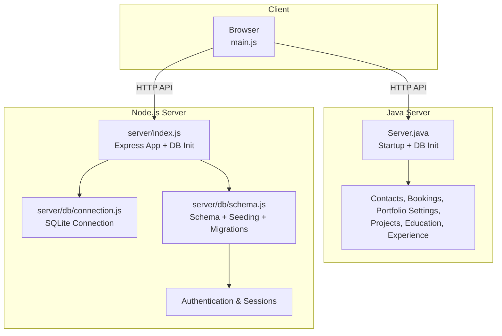
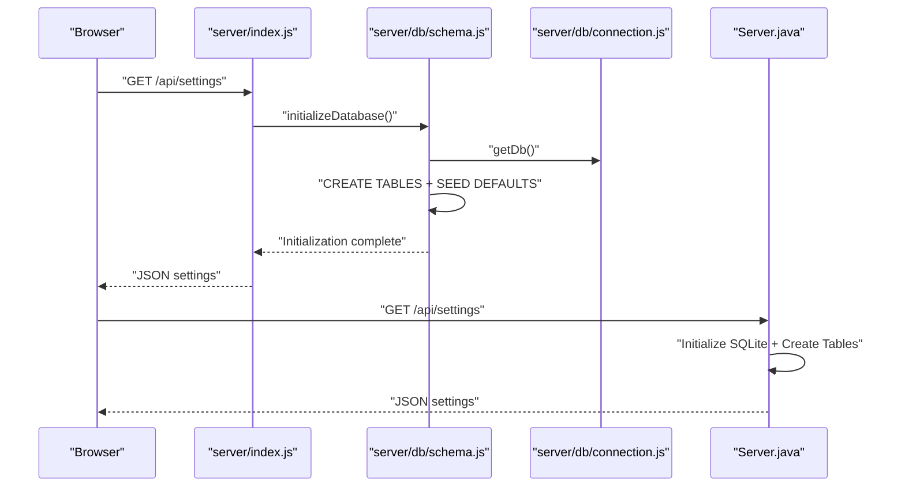
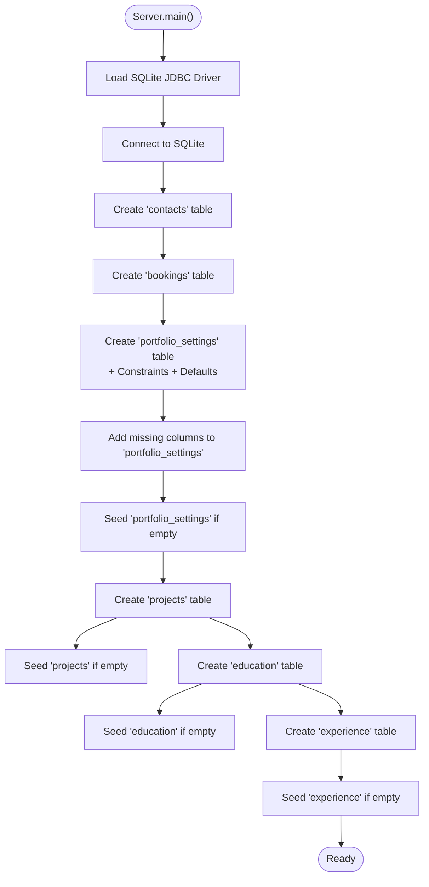
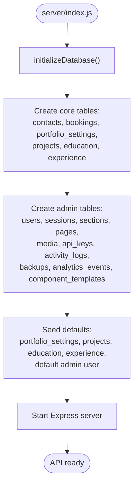
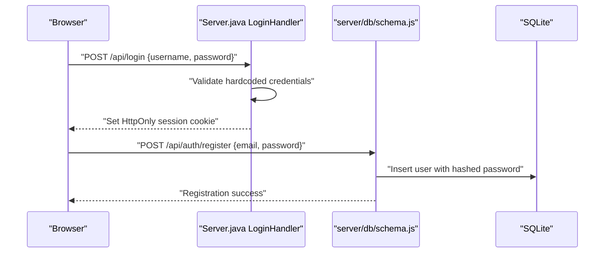
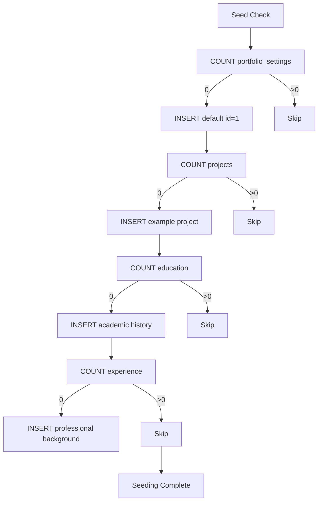
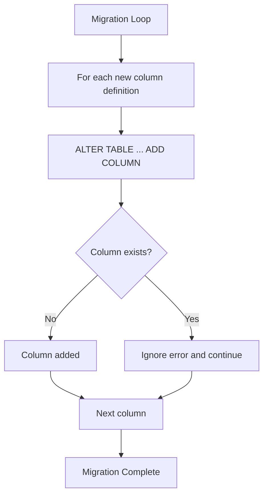
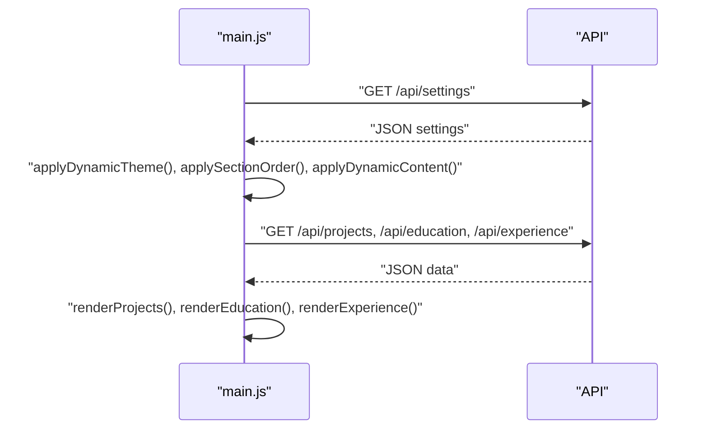
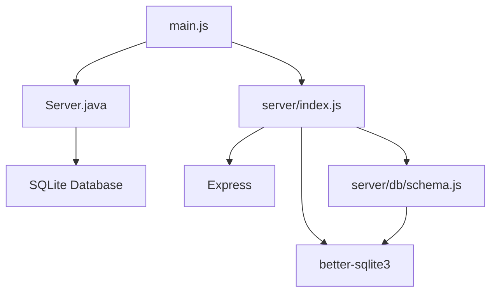

# Data Seeding and Initialization

<cite>
**Referenced Files in This Document**
- [Server.java](file://Server.java)
- [server/index.js](file://server/index.js)
- [server/db/connection.js](file://server/db/connection.js)
- [server/db/schema.js](file://server/db/schema.js)
- [main.js](file://main.js)
</cite>

## Table of Contents
1. [Introduction](#introduction)
2. [Project Structure](#project-structure)
3. [Core Components](#core-components)
4. [Architecture Overview](#architecture-overview)
5. [Detailed Component Analysis](#detailed-component-analysis)
6. [Dependency Analysis](#dependency-analysis)
7. [Performance Considerations](#performance-considerations)
8. [Troubleshooting Guide](#troubleshooting-guide)
9. [Conclusion](#conclusion)

## Introduction
This document explains the database initialization and data seeding procedures for the portfolio application. It covers:
- Automatic database creation during server startup
- Table creation with constraints and default values
- Seeding logic for portfolio_settings, projects, education, and experience
- Migration system for adding new columns to existing databases
- Authentication setup with hardcoded credentials and session management
- Troubleshooting guidance for initialization failures and database corruption

## Project Structure
The project includes both a Java-based server and a Node.js server. The database initialization and seeding logic is implemented in two places:
- Java server: creates SQLite tables and seeds default data
- Node.js server: initializes SQLite with additional tables and seeds default data, plus manages authentication and session storage

**Diagram sources**
- [Server.java:34-83](file://Server.java#L34-L83)
- [server/index.js:25-26](file://server/index.js#L25-L26)
- [server/db/connection.js:1-25](file://server/db/connection.js#L1-L25)
- [server/db/schema.js:4-286](file://server/db/schema.js#L4-L286)
- [main.js:77-136](file://main.js#L77-L136)

**Section sources**
- [Server.java:34-83](file://Server.java#L34-L83)
- [server/index.js:25-26](file://server/index.js#L25-L26)
- [server/db/connection.js:1-25](file://server/db/connection.js#L1-L25)
- [server/db/schema.js:4-286](file://server/db/schema.js#L4-L286)
- [main.js:77-136](file://main.js#L77-L136)

## Core Components
- Java server initialization: Creates SQLite tables and seeds default data for portfolio_settings, projects, education, and experience. Includes a migration loop to add new columns to existing databases.
- Node.js server initialization: Initializes SQLite with additional admin-related tables, seeds default data, and sets up authentication and session management.
- Client-side integration: The frontend fetches settings and renders dynamic content, relying on the backend APIs.

Key responsibilities:
- Database creation and migrations
- Default data seeding
- Authentication and session handling
- Frontend-backend integration

**Section sources**
- [Server.java:85-337](file://Server.java#L85-L337)
- [server/db/schema.js:4-286](file://server/db/schema.js#L4-L286)
- [server/index.js:25-26](file://server/index.js#L25-L26)

## Architecture Overview
The system initializes the database at startup and exposes REST endpoints for data management. The Node.js server also manages authentication and session persistence.

**Diagram sources**
- [server/index.js:25-26](file://server/index.js#L25-L26)
- [server/db/schema.js:4-286](file://server/db/schema.js#L4-L286)
- [server/db/connection.js:8-15](file://server/db/connection.js#L8-L15)
- [Server.java:85-337](file://Server.java#L85-L337)

## Detailed Component Analysis

### Java Server Database Initialization
The Java server performs the following steps at startup:
- Loads the SQLite JDBC driver
- Establishes a connection to the SQLite database
- Creates tables if they do not exist:
  - contacts
  - bookings
  - portfolio_settings (with strict constraints and extensive defaults)
  - projects
  - education
  - experience
- Runs a migration loop to add new columns to the portfolio_settings table if missing
- Seeds default data if tables are empty

**Diagram sources**
- [Server.java:85-337](file://Server.java#L85-L337)

**Section sources**
- [Server.java:85-337](file://Server.java#L85-L337)

### Node.js Server Database Initialization
The Node.js server initializes the database using a separate module:
- Ensures the SQLite connection is established with journal mode WAL and foreign keys enabled
- Creates tables including contacts, bookings, portfolio_settings, projects, education, experience, and additional admin tables (users, sessions, sections, pages, media, api_keys, activity_logs, backups, analytics_events, component_templates)
- Seeds default data for portfolio_settings, projects, education, experience, and a default admin user
- Starts the Express server and exposes API routes

**Diagram sources**
- [server/index.js:25-26](file://server/index.js#L25-L26)
- [server/db/schema.js:4-286](file://server/db/schema.js#L4-L286)
- [server/db/connection.js:8-15](file://server/db/connection.js#L8-L15)

**Section sources**
- [server/index.js:25-26](file://server/index.js#L25-L26)
- [server/db/schema.js:4-286](file://server/db/schema.js#L4-L286)
- [server/db/connection.js:8-15](file://server/db/connection.js#L8-L15)

### Authentication Setup and Session Management
The system supports two authentication approaches:
- Hardcoded credentials for the legacy Java login endpoint
- Default admin user with hashed password for the Node.js admin panel

**Diagram sources**
- [Server.java:355-396](file://Server.java#L355-L396)
- [server/db/schema.js:273-281](file://server/db/schema.js#L273-L281)

**Section sources**
- [Server.java:355-396](file://Server.java#L355-L396)
- [server/db/schema.js:273-281](file://server/db/schema.js#L273-L281)

### Data Seeding Logic
Default data seeding ensures the application displays meaningful content out-of-the-box:
- portfolio_settings: Single-row table with a primary key constraint and numerous default fields for theme, SEO, branding, and content
- projects: Example portfolio project with metadata and visibility flags
- education: Academic history with multiple entries
- experience: Professional and learning background entries
- Additional admin tables: Users, sessions, sections, pages, media, API keys, activity logs, backups, analytics events, and component templates

**Diagram sources**
- [Server.java:216-331](file://Server.java#L216-L331)
- [server/db/schema.js:222-281](file://server/db/schema.js#L222-L281)

**Section sources**
- [Server.java:216-331](file://Server.java#L216-L331)
- [server/db/schema.js:222-281](file://server/db/schema.js#L222-L281)

### Migration System
The Java server includes a migration system that:
- Iterates through a predefined list of new columns for portfolio_settings
- Attempts to add each column with its default value
- Ignores errors if the column already exists, ensuring backward compatibility

**Diagram sources**
- [Server.java:173-214](file://Server.java#L173-L214)

**Section sources**
- [Server.java:173-214](file://Server.java#L173-L214)

### Frontend Integration
The client-side script fetches settings and renders dynamic content:
- Retrieves settings from the backend
- Applies dynamic theme, fonts, and content
- Renders projects, education, and experience lists
- Provides fallback rendering if the backend is unavailable

**Diagram sources**
- [main.js:77-136](file://main.js#L77-L136)
- [main.js:1193-1381](file://main.js#L1193-L1381)

**Section sources**
- [main.js:77-136](file://main.js#L77-L136)
- [main.js:1193-1381](file://main.js#L1193-L1381)

## Dependency Analysis
The initialization process depends on:
- SQLite JDBC driver (Java)
- Better-sqlite3 library (Node.js)
- Express framework (Node.js)
- Frontend scripts (main.js)

**Diagram sources**
- [Server.java:85-92](file://Server.java#L85-L92)
- [server/index.js:1-10](file://server/index.js#L1-L10)
- [server/db/connection.js:1-2](file://server/db/connection.js#L1-L2)
- [main.js:77-136](file://main.js#L77-L136)

**Section sources**
- [Server.java:85-92](file://Server.java#L85-L92)
- [server/index.js:1-10](file://server/index.js#L1-L10)
- [server/db/connection.js:1-2](file://server/db/connection.js#L1-L2)
- [main.js:77-136](file://main.js#L77-L136)

## Performance Considerations
- SQLite is lightweight and suitable for small-scale deployments
- WAL mode improves concurrent read performance
- Prepared statements and parameterized queries reduce overhead
- Default data seeding runs only when tables are empty, minimizing unnecessary writes

## Troubleshooting Guide
Common issues and resolutions:
- Database initialization fails
  - Verify SQLite JDBC driver is available (Java) or better-sqlite3 is installed (Node.js)
  - Check file permissions for the database file location
  - Review server logs for specific SQL errors
- Port conflicts
  - Set the PORT environment variable to a free port
- Authentication failures
  - Java login requires hardcoded credentials
  - Node.js admin registration creates a default admin user with a hashed password
- Database corruption
  - Back up the database file before attempting repairs
  - Recreate tables and re-seed defaults if necessary
  - Use SQLite pragma commands to check integrity

**Section sources**
- [Server.java:85-92](file://Server.java#L85-L92)
- [server/db/connection.js:8-15](file://server/db/connection.js#L8-L15)
- [server/db/schema.js:273-281](file://server/db/schema.js#L273-L281)

## Conclusion
The portfolio application initializes its database automatically at startup, creates all necessary tables with appropriate constraints and defaults, and seeds default content for immediate usability. The Java server focuses on core portfolio data and migrations, while the Node.js server extends the schema for administrative features and includes robust authentication and session management. The frontend integrates seamlessly with both backend APIs to render dynamic content.