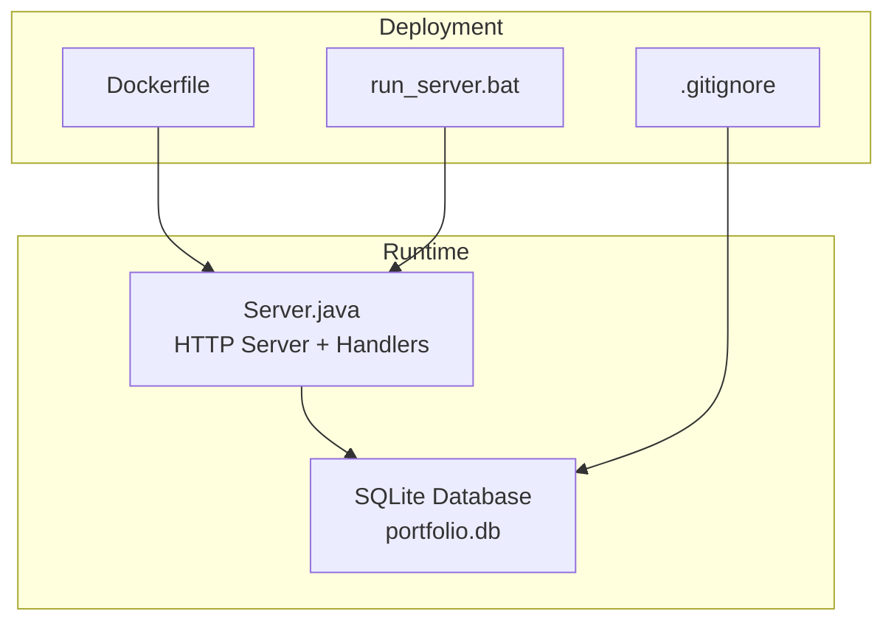
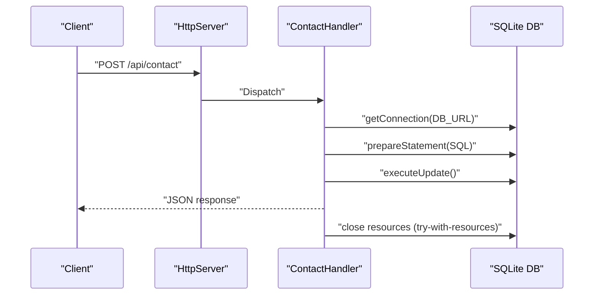
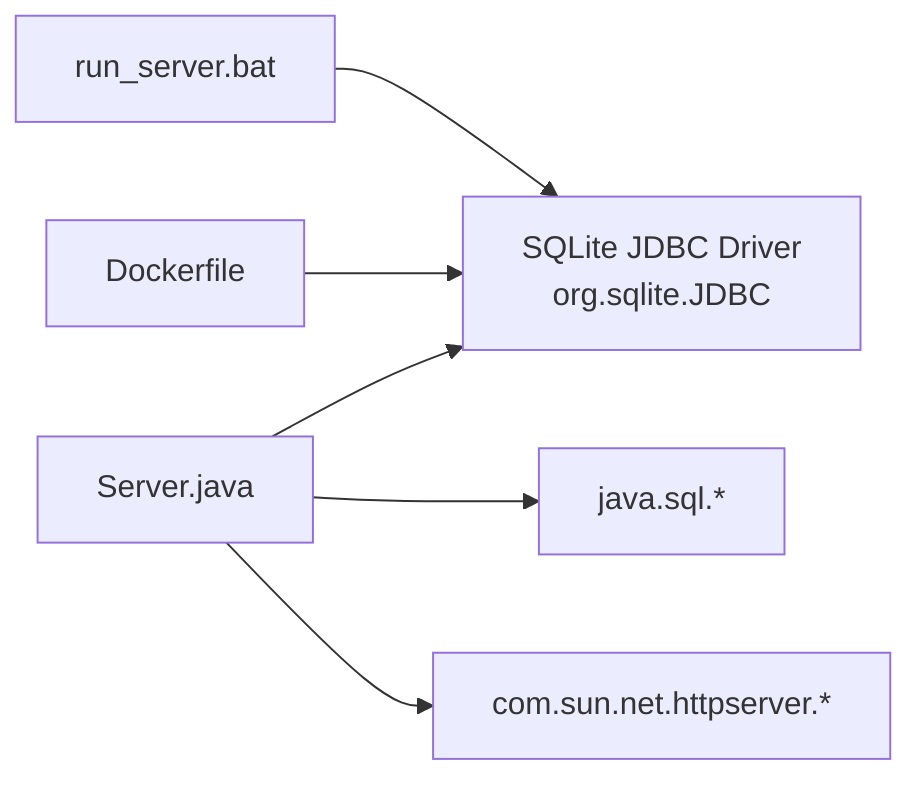

# Database Connection Management

<cite>
**Referenced Files in This Document**
- [Server.java](file://Server.java)
- [Dockerfile](file://Dockerfile)
- [run_server.bat](file://run_server.bat)
- [.gitignore](file://.gitignore)
</cite>

## Table of Contents
1. [Introduction](#introduction)
2. [Project Structure](#project-structure)
3. [Core Components](#core-components)
4. [Architecture Overview](#architecture-overview)
5. [Detailed Component Analysis](#detailed-component-analysis)
6. [Dependency Analysis](#dependency-analysis)
7. [Performance Considerations](#performance-considerations)
8. [Troubleshooting Guide](#troubleshooting-guide)
9. [Conclusion](#conclusion)

## Introduction
This document explains how the application manages SQLite connections and database access patterns. It covers connection URL configuration, JDBC driver loading, connection lifecycle across handlers, error handling strategies, SQL injection prevention using PreparedStatement, schema operations with Statement, transaction handling, timeouts, resource cleanup, concurrency considerations, and common connection issues with debugging techniques.

## Project Structure
The project is a single-file Java application that embeds an HTTP server and uses SQLite for persistence. The database is initialized on startup and accessed by multiple handlers for contact submissions, bookings, settings, and CRUD operations for portfolio content.

**Diagram sources**
- [Server.java:34-83](file://Server.java#L34-L83)
- [Dockerfile:1-18](file://Dockerfile#L1-L18)
- [run_server.bat:14-56](file://run_server.bat#L14-L56)
- [.gitignore:4](file://.gitignore#L4)

**Section sources**
- [Server.java:34-83](file://Server.java#L34-L83)
- [Dockerfile:1-18](file://Dockerfile#L1-L18)
- [run_server.bat:14-56](file://run_server.bat#L14-L56)
- [.gitignore:4](file://.gitignore#L4)

## Core Components
- Database URL and driver: The application uses a local SQLite database file and loads the SQLite JDBC driver at runtime.
- Initialization routine: On startup, the application ensures the JDBC driver is present and creates/updates tables and seeds default data.
- Handler classes: Each HTTP endpoint initializes its own database connection, executes statements, and closes resources automatically using try-with-resources.
- Error handling: SQL exceptions are caught and mapped to JSON responses with appropriate HTTP status codes.

Key implementation references:
- Connection URL and driver loading: [Server.java:20](file://Server.java#L20), [Server.java:87-92](file://Server.java#L87-L92)
- Database initialization: [Server.java:85-337](file://Server.java#L85-L337)
- Handler connection lifecycle: [Server.java:533](file://Server.java#L533), [Server.java:575](file://Server.java#L575), [Server.java:665](file://Server.java#L665), [Server.java:779](file://Server.java#L779), [Server.java:919](file://Server.java#L919), [Server.java:1308](file://Server.java#L1308), [Server.java:1433](file://Server.java#L1433), [Server.java:1605](file://Server.java#L1605)

**Section sources**
- [Server.java:20](file://Server.java#L20)
- [Server.java:87-92](file://Server.java#L87-L92)
- [Server.java:85-337](file://Server.java#L85-L337)
- [Server.java:533](file://Server.java#L533)
- [Server.java:575](file://Server.java#L575)
- [Server.java:665](file://Server.java#L665)
- [Server.java:779](file://Server.java#L779)
- [Server.java:919](file://Server.java#L919)
- [Server.java:1308](file://Server.java#L1308)
- [Server.java:1433](file://Server.java#L1433)
- [Server.java:1605](file://Server.java#L1605)

## Architecture Overview
The application follows a simple embedded architecture:
- An embedded HTTP server exposes REST endpoints.
- Each handler opens a transient database connection, performs the operation, and closes it immediately.
- Schema creation and migrations are performed during server startup.

**Diagram sources**
- [Server.java:42](file://Server.java#L42)
- [Server.java:495-554](file://Server.java#L495-L554)
- [Server.java:533](file://Server.java#L533)

**Section sources**
- [Server.java:42](file://Server.java#L42)
- [Server.java:495-554](file://Server.java#L495-L554)
- [Server.java:533](file://Server.java#L533)

## Detailed Component Analysis

### Connection URL Configuration
- The database URL is defined as a constant and used across all handlers.
- The URL points to a local SQLite file named portfolio.db.
- Environment variable PORT controls the HTTP server port; the database URL is independent of HTTP port.

References:
- [Server.java:20](file://Server.java#L20)
- [Server.java:19](file://Server.java#L19)

**Section sources**
- [Server.java:20](file://Server.java#L20)
- [Server.java:19](file://Server.java#L19)

### JDBC Driver Loading
- The application explicitly loads the SQLite JDBC driver class at startup to ensure availability.
- If the driver is missing, initialization logs an error and exits early.

References:
- [Server.java:87-92](file://Server.java#L87-L92)

**Section sources**
- [Server.java:87-92](file://Server.java#L87-L92)

### Connection Pooling Considerations
- No connection pool is configured. Each handler opens and closes a connection per request.
- This is acceptable for a small embedded server but may limit throughput under heavy load.

References:
- [Server.java:533](file://Server.java#L533)
- [Server.java:575](file://Server.java#L575)
- [Server.java:665](file://Server.java#L665)
- [Server.java:779](file://Server.java#L779)
- [Server.java:919](file://Server.java#L919)
- [Server.java:1308](file://Server.java#L1308)
- [Server.java:1433](file://Server.java#L1433)
- [Server.java:1605](file://Server.java#L1605)

**Section sources**
- [Server.java:533](file://Server.java#L533)
- [Server.java:575](file://Server.java#L575)
- [Server.java:665](file://Server.java#L665)
- [Server.java:779](file://Server.java#L779)
- [Server.java:919](file://Server.java#L919)
- [Server.java:1308](file://Server.java#L1308)
- [Server.java:1433](file://Server.java#L1433)
- [Server.java:1605](file://Server.java#L1605)

### Connection Lifecycle Across Handlers
- Each handler uses try-with-resources to open a connection, execute statements, and close resources automatically.
- This pattern prevents leaks and ensures deterministic cleanup.

References:
- [Server.java:533](file://Server.java#L533)
- [Server.java:575](file://Server.java#L575)
- [Server.java:665](file://Server.java#L665)
- [Server.java:779](file://Server.java#L779)
- [Server.java:919](file://Server.java#L919)
- [Server.java:1308](file://Server.java#L1308)
- [Server.java:1433](file://Server.java#L1433)
- [Server.java:1605](file://Server.java#L1605)

**Section sources**
- [Server.java:533](file://Server.java#L533)
- [Server.java:575](file://Server.java#L575)
- [Server.java:665](file://Server.java#L665)
- [Server.java:779](file://Server.java#L779)
- [Server.java:919](file://Server.java#L919)
- [Server.java:1308](file://Server.java#L1308)
- [Server.java:1433](file://Server.java#L1433)
- [Server.java:1605](file://Server.java#L1605)

### Error Handling Strategies
- SQL exceptions are caught and mapped to JSON responses with HTTP 500 status.
- Validation errors (missing fields, invalid IDs) return HTTP 4xx with descriptive messages.
- General exceptions are handled with HTTP 500 responses.

References:
- [Server.java:546-552](file://Server.java#L546-L552)
- [Server.java:597-600](file://Server.java#L597-L600)
- [Server.java:689-692](file://Server.java#L689-L692)
- [Server.java:794-800](file://Server.java#L794-L800)
- [Server.java:1058-1061](file://Server.java#L1058-L1061)
- [Server.java:1341-1344](file://Server.java#L1341-L1344)
- [Server.java:1462-1465](file://Server.java#L1462-L1465)
- [Server.java:1612-1614](file://Server.java#L1612-L1614)

**Section sources**
- [Server.java:546-552](file://Server.java#L546-L552)
- [Server.java:597-600](file://Server.java#L597-L600)
- [Server.java:689-692](file://Server.java#L689-L692)
- [Server.java:794-800](file://Server.java#L794-L800)
- [Server.java:1058-1061](file://Server.java#L1058-L1061)
- [Server.java:1341-1344](file://Server.java#L1341-L1344)
- [Server.java:1462-1465](file://Server.java#L1462-L1465)
- [Server.java:1612-1614](file://Server.java#L1612-L1614)

### SQL Injection Prevention with PreparedStatement
- All dynamic queries use PreparedStatement with parameter placeholders.
- This prevents SQL injection by separating SQL logic from user input.

References:
- [Server.java:534-539](file://Server.java#L534-L539)
- [Server.java:625-628](file://Server.java#L625-L628)
- [Server.java:780-787](file://Server.java#L780-L787)
- [Server.java:1125-1171](file://Server.java#L1125-L1171)
- [Server.java:1310-1320](file://Server.java#L1310-L1320)
- [Server.java:1325-1336](file://Server.java#L1325-L1336)
- [Server.java:1364-1367](file://Server.java#L1364-L1367)
- [Server.java:1435-1443](file://Server.java#L1435-L1443)
- [Server.java:1448-1457](file://Server.java#L1448-L1457)
- [Server.java:1606-1609](file://Server.java#L1606-L1609)

**Section sources**
- [Server.java:534-539](file://Server.java#L534-L539)
- [Server.java:625-628](file://Server.java#L625-L628)
- [Server.java:780-787](file://Server.java#L780-L787)
- [Server.java:1125-1171](file://Server.java#L1125-L1171)
- [Server.java:1310-1320](file://Server.java#L1310-L1320)
- [Server.java:1325-1336](file://Server.java#L1325-L1336)
- [Server.java:1364-1367](file://Server.java#L1364-L1367)
- [Server.java:1435-1443](file://Server.java#L1435-L1443)
- [Server.java:1448-1457](file://Server.java#L1448-L1457)
- [Server.java:1606-1609](file://Server.java#L1606-L1609)

### Schema Operations with Statement
- Schema creation and migrations are executed using Statement.
- This is appropriate for DDL operations and one-time initialization.

References:
- [Server.java:97](file://Server.java#L97)
- [Server.java:106](file://Server.java#L106)
- [Server.java:119](file://Server.java#L119)
- [Server.java:173-214](file://Server.java#L173-L214)
- [Server.java:240](file://Server.java#L240)
- [Server.java:266](file://Server.java#L266)
- [Server.java:305](file://Server.java#L305)

**Section sources**
- [Server.java:97](file://Server.java#L97)
- [Server.java:106](file://Server.java#L106)
- [Server.java:119](file://Server.java#L119)
- [Server.java:173-214](file://Server.java#L173-L214)
- [Server.java:240](file://Server.java#L240)
- [Server.java:266](file://Server.java#L266)
- [Server.java:305](file://Server.java#L305)

### Transaction Handling
- Transactions are not explicitly used. Each operation runs in auto-commit mode.
- For multi-step operations requiring atomicity, wrap statements in a transaction block using Connection.setTransactionIsolation and commit/rollback.

References:
- [Server.java:533](file://Server.java#L533)
- [Server.java:575](file://Server.java#L575)
- [Server.java:665](file://Server.java#L665)
- [Server.java:779](file://Server.java#L779)
- [Server.java:919](file://Server.java#L919)
- [Server.java:1308](file://Server.java#L1308)
- [Server.java:1433](file://Server.java#L1433)
- [Server.java:1605](file://Server.java#L1605)

**Section sources**
- [Server.java:533](file://Server.java#L533)
- [Server.java:575](file://Server.java#L575)
- [Server.java:665](file://Server.java#L665)
- [Server.java:779](file://Server.java#L779)
- [Server.java:919](file://Server.java#L919)
- [Server.java:1308](file://Server.java#L1308)
- [Server.java:1433](file://Server.java#L1433)
- [Server.java:1605](file://Server.java#L1605)

### Connection Timeout Management
- No explicit connection or query timeouts are configured.
- For production, configure connection and query timeouts to avoid hanging operations.

References:
- [Server.java:20](file://Server.java#L20)

**Section sources**
- [Server.java:20](file://Server.java#L20)

### Resource Cleanup Procedures
- Try-with-resources ensures automatic closure of Connection, PreparedStatement, and Statement.
- This prevents resource leaks and ensures cleanup even on exceptions.

References:
- [Server.java:533](file://Server.java#L533)
- [Server.java:575](file://Server.java#L575)
- [Server.java:665](file://Server.java#L665)
- [Server.java:779](file://Server.java#L779)
- [Server.java:919](file://Server.java#L919)
- [Server.java:1308](file://Server.java#L1308)
- [Server.java:1433](file://Server.java#L1433)
- [Server.java:1605](file://Server.java#L1605)

**Section sources**
- [Server.java:533](file://Server.java#L533)
- [Server.java:575](file://Server.java#L575)
- [Server.java:665](file://Server.java#L665)
- [Server.java:779](file://Server.java#L779)
- [Server.java:919](file://Server.java#L919)
- [Server.java:1308](file://Server.java#L1308)
- [Server.java:1433](file://Server.java#L1433)
- [Server.java:1605](file://Server.java#L1605)

### Performance Considerations for Concurrent Access
- Current design opens a new connection per request; this is lightweight for SQLite but can be improved.
- Recommendations:
  - Introduce a lightweight connection pool (e.g., HikariCP) for higher concurrency.
  - Reuse PreparedStatements where possible to reduce parsing overhead.
  - Batch inserts/updates for bulk operations.
  - Use connection timeouts and query timeouts to prevent resource starvation.

[No sources needed since this section provides general guidance]

### Best Practices for Connection Reuse
- Prefer a singleton connection pool initialized at startup.
- Use a single connection per thread or a thread-safe pool.
- Avoid long-lived connections; close idle connections periodically.

[No sources needed since this section provides general guidance]

### Common Connection Issues and Debugging Techniques
- Missing JDBC driver:
  - Symptom: Initialization fails with a driver-not-found error.
  - Fix: Ensure the SQLite JDBC JAR is present in the lib directory and included in the classpath.
  - References: [Server.java:87-92](file://Server.java#L87-L92), [run_server.bat:14-39](file://run_server.bat#L14-L39)
- Database file locked:
  - Symptom: SQLite reports database is locked.
  - Causes: Multiple writers or long-running transactions.
  - Fixes: Reduce concurrent writes, avoid long transactions, or enable WAL mode.
  - References: [Server.java:533](file://Server.java#L533)
- Port conflicts:
  - Symptom: Server fails to start on the configured port.
  - Fix: Set the PORT environment variable to an available port.
  - References: [Server.java:19](file://Server.java#L19)
- CORS and preflight:
  - Symptom: Browser blocks cross-origin requests.
  - Fix: Ensure OPTIONS handling and CORS headers are set.
  - References: [Server.java:398-402](file://Server.java#L398-L402)
- Unauthorized access:
  - Symptom: Protected endpoints return 401.
  - Fix: Ensure the session cookie is set and valid.
  - References: [Server.java:339-352](file://Server.java#L339-L352)

**Section sources**
- [Server.java:87-92](file://Server.java#L87-L92)
- [run_server.bat:14-39](file://run_server.bat#L14-L39)
- [Server.java:533](file://Server.java#L533)
- [Server.java:19](file://Server.java#L19)
- [Server.java:398-402](file://Server.java#L398-L402)
- [Server.java:339-352](file://Server.java#L339-L352)

## Dependency Analysis
The application depends on:
- SQLite JDBC driver (downloaded and placed in lib/)
- Embedded HTTP server (com.sun.net.httpserver)
- Standard JDBC API (java.sql)

**Diagram sources**
- [Server.java:12](file://Server.java#L12)
- [Server.java:87-92](file://Server.java#L87-L92)
- [run_server.bat:14-39](file://run_server.bat#L14-L39)
- [Dockerfile:11](file://Dockerfile#L11)

**Section sources**
- [Server.java:12](file://Server.java#L12)
- [Server.java:87-92](file://Server.java#L87-L92)
- [run_server.bat:14-39](file://run_server.bat#L14-L39)
- [Dockerfile:11](file://Dockerfile#L11)

## Performance Considerations
- Connection reuse: Open a pool of connections and reuse them across requests.
- Statement reuse: Cache frequently used PreparedStatements.
- Concurrency: Limit simultaneous writes to avoid database locking.
- Indexes: Add indexes on frequently queried columns (e.g., created_at, id).
- Batch operations: Combine multiple inserts/updates into batches.

[No sources needed since this section provides general guidance]

## Troubleshooting Guide
- Verify JDBC driver presence:
  - Check lib directory for sqlite-jdbc JAR.
  - Confirm classpath includes lib/*.
  - References: [run_server.bat:14-39](file://run_server.bat#L14-L39), [Dockerfile:11](file://Dockerfile#L11)
- Inspect database file:
  - The SQLite file is named portfolio.db and is ignored by git.
  - References: [.gitignore:4](file://.gitignore#L4)
- Enable logging:
  - Review console output for initialization and SQL errors.
  - References: [Server.java:96](file://Server.java#L96), [Server.java:546-552](file://Server.java#L546-L552)

**Section sources**
- [run_server.bat:14-39](file://run_server.bat#L14-L39)
- [Dockerfile:11](file://Dockerfile#L11)
- [.gitignore:4](file://.gitignore#L4)
- [Server.java:96](file://Server.java#L96)
- [Server.java:546-552](file://Server.java#L546-L552)

## Conclusion
The application implements straightforward SQLite connection management with explicit driver loading, per-request connection lifecycles, and robust error handling. While suitable for small-scale usage, consider introducing a connection pool, enabling transaction control, and adding timeouts for production deployments. The use of PreparedStatement consistently prevents SQL injection, and schema operations are handled safely during initialization.