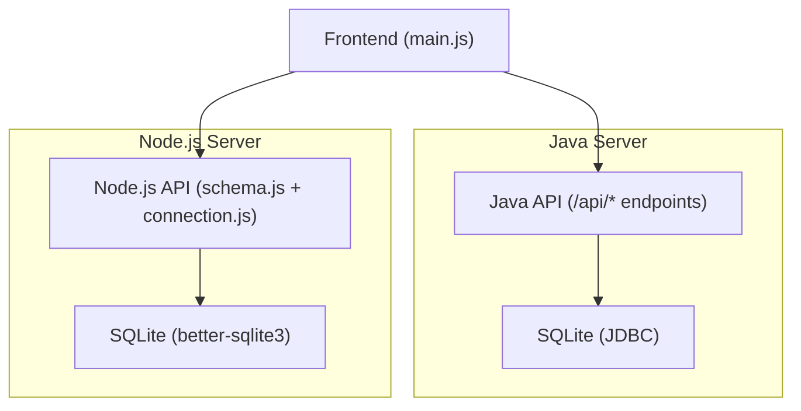
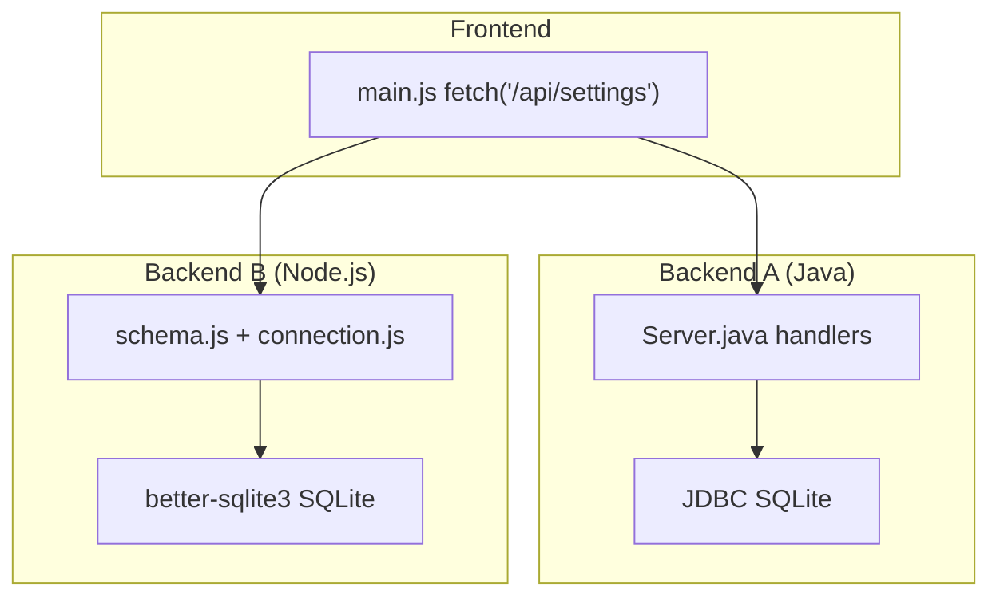
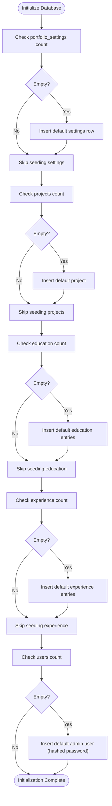
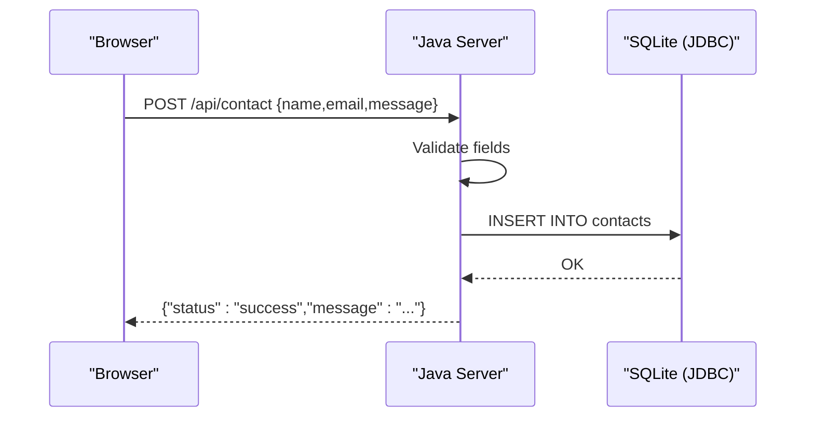
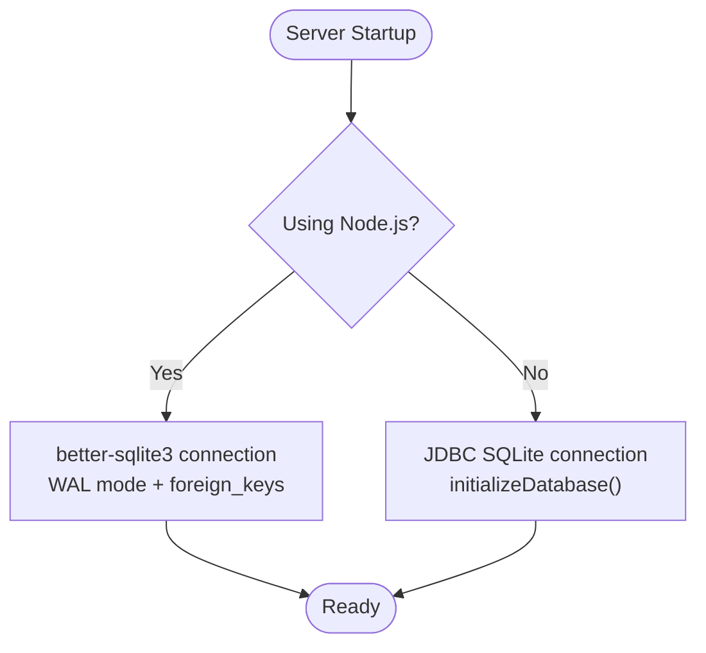
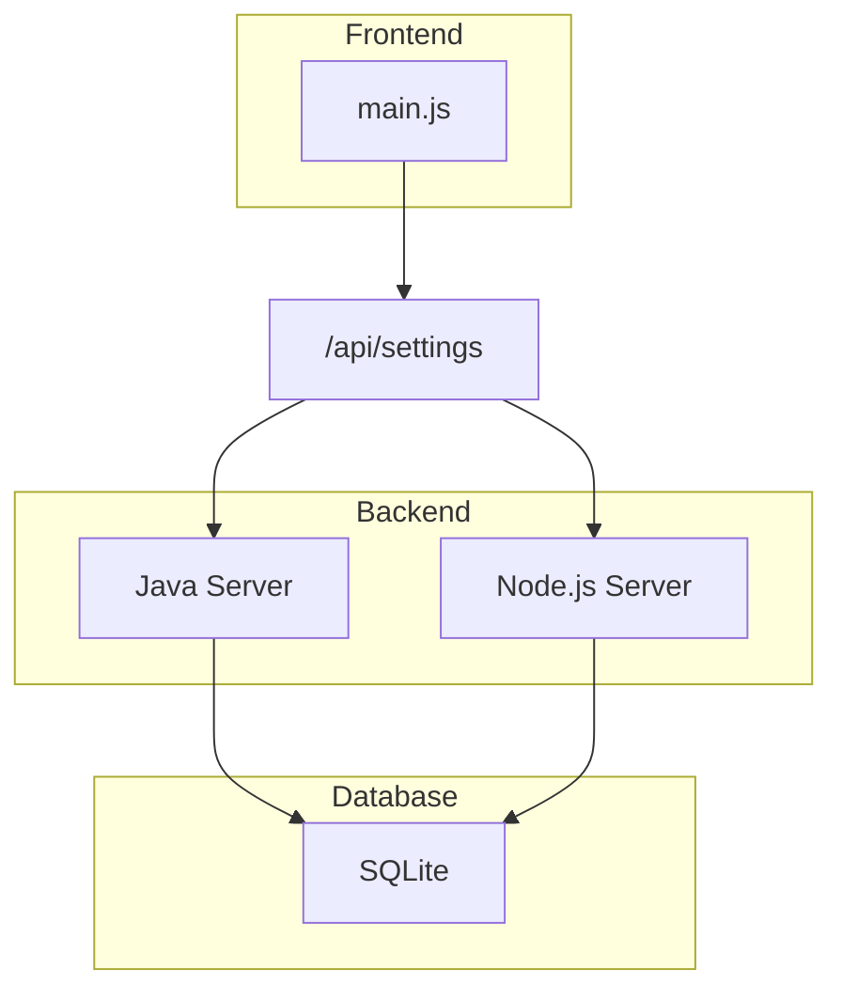

# Database Management

<cite>
**Referenced Files in This Document**
- [Server.java](file://Server.java)
- [schema.js](file://server/db/schema.js)
- [connection.js](file://server/db/connection.js)
- [main.js](file://main.js)
- [design.md](file://design.md)
</cite>

## Table of Contents
1. [Introduction](#introduction)
2. [Project Structure](#project-structure)
3. [Core Components](#core-components)
4. [Architecture Overview](#architecture-overview)
5. [Detailed Component Analysis](#detailed-component-analysis)
6. [Dependency Analysis](#dependency-analysis)
7. [Performance Considerations](#performance-considerations)
8. [Troubleshooting Guide](#troubleshooting-guide)
9. [Conclusion](#conclusion)
10. [Appendices](#appendices)

## Introduction
This document provides comprehensive database management documentation for the SQLite-backed portfolio application. It covers the database schema for contacts, bookings, portfolio_settings, projects, education, and experience tables, including entity relationships, field definitions, data types, primary/foreign keys, indexes, constraints, and validation rules. It also documents data access patterns, connection management, migration procedures, data lifecycle and retention, backup strategies, seeding procedures, default configurations, and security considerations.

## Project Structure
The database is implemented using two backend stacks:
- Java-based HTTP server with JDBC for SQLite
- Node.js-based server with better-sqlite3 for SQLite

Both implementations define the same core tables and seed default data. The frontend JavaScript fetches settings and content from the backend and renders the UI.



**Diagram sources**
- [Server.java:18-83](file://Server.java#L18-L83)
- [schema.js:1-287](file://server/db/schema.js#L1-L287)
- [connection.js:1-25](file://server/db/connection.js#L1-L25)
- [main.js:76-136](file://main.js#L76-L136)

**Section sources**
- [Server.java:18-83](file://Server.java#L18-L83)
- [schema.js:1-287](file://server/db/schema.js#L1-L287)
- [connection.js:1-25](file://server/db/connection.js#L1-L25)
- [main.js:76-136](file://main.js#L76-L136)

## Core Components
This section documents the core database schema and associated behaviors.

- Contacts table
  - Purpose: Stores inbound messages from visitors.
  - Fields: id (INTEGER, PK, AI), name (TEXT, NOT NULL), email (TEXT, NOT NULL), message (TEXT, NOT NULL), created_at (TIMESTAMP, DEFAULT CURRENT_TIMESTAMP).
  - Constraints: NOT NULL enforced at insert; auto-increment primary key.
  - Indexes: None declared; typically covered by implicit PK index.
  - Validation: Frontend and backend check for missing fields before insertion.

- Bookings table
  - Purpose: Stores consultation booking requests.
  - Fields: id (INTEGER, PK, AI), name (TEXT, NOT NULL), email (TEXT, NOT NULL), booking_date (TEXT, NOT NULL), booking_time (TEXT, NOT NULL), topic (TEXT, NOT NULL), created_at (TIMESTAMP, DEFAULT CURRENT_TIMESTAMP).
  - Constraints: NOT NULL enforced at insert; auto-increment primary key.
  - Indexes: None declared.
  - Validation: Frontend and backend check for missing fields before insertion.

- Portfolio settings table
  - Purpose: Single-row configuration for theme, SEO, branding, and content defaults.
  - Fields: id (INTEGER, PK, CHECK id=1), theme_preset (TEXT, DEFAULT 'dark'), primary_color (TEXT, DEFAULT '#f43f5e'), secondary_color (TEXT, DEFAULT '#8b5cf6'), accent_color (TEXT, DEFAULT '#f59e0b'), background_color (TEXT, DEFAULT '#050811'), surface_color (TEXT, DEFAULT '#0c1122'), font_display (TEXT, DEFAULT 'Oswald'), font_body (TEXT, DEFAULT 'Inter'), animations_enabled (INTEGER, DEFAULT 1), layout_sections_order (TEXT, DEFAULT 'about,education,skills,now,projects,contact'), seo_title (TEXT, DEFAULT 'Aditya Soni | Developer & Security Enthusiast'), seo_description (TEXT, DEFAULT 'B.Tech CSE Undergrad at Rungta Skill University. Full-stack developer & ethical hacker.'), analytics_id (TEXT, DEFAULT ''), hero_badge (TEXT, DEFAULT 'First-year CSE student · Bhilai, CG'), hero_title (TEXT, DEFAULT 'I BUILD WEB THINGS.\nTHEN I TRY TO\nBREAK THEM.'), hero_subtitle (TEXT, DEFAULT '— Aditya Soni'), hero_description (TEXT, DEFAULT 'I''m a CS undergrad at Rungta University, Bhilai who spends most of his time writing MERN stack apps and then poking holes in them on Kali Linux.'), about_lead (TEXT, DEFAULT 'A first-year CS undergrad trying to bridge the gap between building things and breaking them.'), about_body (TEXT, DEFAULT 'I''m Aditya Soni, a Computer Science student currently in my first year at Rungta International Skill University, Bhilai.'), skills_web_dev (TEXT, DEFAULT 'MongoDB, Express.js, React.js, Node.js, REST APIs'), skills_security (TEXT, DEFAULT 'Kali Linux, Nmap, Wireshark, Metasploit, Pen Testing'), skills_languages (TEXT, DEFAULT 'C / C++, HTML5 / CSS3, JavaScript, Git & GitHub'), contact_title (TEXT, DEFAULT 'LET''S COLLABORATE ON THE FUTURE'), contact_subtitle (TEXT, DEFAULT 'Have a project in mind, need a security audit, or just want to chat about CS?'), social_github (TEXT, DEFAULT 'https://github.com'), social_linkedin (TEXT, DEFAULT 'https://linkedin.com'), social_twitter (TEXT, DEFAULT 'https://twitter.com'), brand_name (TEXT, DEFAULT 'Aditya Soni'), logo_text (TEXT, DEFAULT 'ADITYA.DEV'), footer_text (TEXT, DEFAULT '© 2026 Aditya Soni. All Rights Reserved.'), goal_1_title (TEXT, DEFAULT 'Goal #1'), goal_1_desc (TEXT, DEFAULT 'Master Cybersecurity.'), goal_1_status (TEXT, DEFAULT 'Priority'), goal_2_title (TEXT, DEFAULT 'Goal #2'), goal_2_desc (TEXT, DEFAULT 'Become a MERN Developer.'), goal_2_status (TEXT, DEFAULT 'In Progress'), goal_3_title (TEXT, DEFAULT 'Goal #3'), goal_3_desc (TEXT, DEFAULT 'Serve the Nation.'), goal_3_status (TEXT, DEFAULT 'The Why'), contact_email (TEXT, DEFAULT 'mradityasoni.cse@gmail.com'), contact_location (TEXT, DEFAULT 'Bhilai, Chhattisgarh'), contact_status (TEXT, DEFAULT 'Open to Opportunities'), custom_css (TEXT, DEFAULT ''), custom_javascript (TEXT, DEFAULT ''), updated_at (TIMESTAMP, DEFAULT CURRENT_TIMESTAMP).
  - Constraints: CHECK (id = 1) enforces a single configuration row; DEFAULT values populate missing fields.
  - Indexes: Implicit PK index on id.
  - Validation: Single-row constraint ensures atomic configuration updates.

- Projects table
  - Purpose: Manages portfolio projects with visibility and ordering controls.
  - Fields: id (INTEGER, PK, AI), title (TEXT, NOT NULL), description (TEXT, NOT NULL), image_url (TEXT, DEFAULT ''), github_link (TEXT, DEFAULT ''), live_link (TEXT, DEFAULT ''), tags (TEXT, DEFAULT ''), sort_order (INTEGER, DEFAULT 0), is_visible (INTEGER, DEFAULT 1), created_at (TIMESTAMP, DEFAULT CURRENT_TIMESTAMP).
  - Constraints: NOT NULL on title and description; booleans represented as 0/1 via INTEGER; auto-increment primary key.
  - Indexes: None declared.
  - Validation: is_visible and sort_order enable content curation.

- Education table
  - Purpose: Stores educational timeline entries.
  - Fields: id (INTEGER, PK, AI), degree (TEXT, NOT NULL), institution (TEXT, NOT NULL), timeline (TEXT, NOT NULL), description (TEXT, DEFAULT ''), sort_order (INTEGER, DEFAULT 0), is_visible (INTEGER, DEFAULT 1), created_at (TIMESTAMP, DEFAULT CURRENT_TIMESTAMP).
  - Constraints: NOT NULL on degree, institution, timeline; booleans represented as 0/1 via INTEGER; auto-increment primary key.
  - Indexes: None declared.
  - Validation: is_visible and sort_order enable content curation.

- Experience table
  - Purpose: Stores professional experience timeline entries.
  - Fields: id (INTEGER, PK, AI), role (TEXT, NOT NULL), company (TEXT, NOT NULL), timeline (TEXT, NOT NULL), description (TEXT, DEFAULT ''), sort_order (INTEGER, DEFAULT 0), is_visible (INTEGER, DEFAULT 1), created_at (TIMESTAMP, DEFAULT CURRENT_TIMESTAMP).
  - Constraints: NOT NULL on role, company, timeline; booleans represented as 0/1 via INTEGER; auto-increment primary key.
  - Indexes: None declared.
  - Validation: is_visible and sort_order enable content curation.

Entity relationships
- No explicit foreign keys exist among the core tables documented here.
- The portfolio_settings table uses a CHECK constraint to enforce a single configuration row.
- The Java and Node implementations both seed default rows for projects, education, experience, and a single portfolio_settings row.

Constraints and defaults summary
- Primary keys: Autoincrement for all tables except portfolio_settings (CHECK id=1).
- Defaults: Many TEXT fields have sensible defaults; timestamps default to CURRENT_TIMESTAMP.
- Booleans: Represented as INTEGER (0/1) for is_visible and animations_enabled.

**Section sources**
- [Server.java:98-331](file://Server.java#L98-L331)
- [schema.js:8-108](file://server/db/schema.js#L8-L108)
- [schema.js:222-281](file://server/db/schema.js#L222-L281)

## Architecture Overview
The database architecture supports two backend implementations that share identical core tables and seeding logic. The frontend fetches settings and content from the backend, which reads/writes to SQLite.



**Diagram sources**
- [Server.java:18-83](file://Server.java#L18-L83)
- [schema.js:1-287](file://server/db/schema.js#L1-L287)
- [connection.js:1-25](file://server/db/connection.js#L1-L25)
- [main.js:76-136](file://main.js#L76-L136)

## Detailed Component Analysis

### Database Initialization and Seeding
Both backend implementations initialize tables and seed default data if empty:
- Portfolio settings: Inserts a single-row configuration with defaults.
- Projects: Seeds a default project entry.
- Education: Seeds three default entries representing academic history.
- Experience: Seeds three default entries representing current and past roles.
- Node implementation additionally seeds a default admin user with hashed password.



**Diagram sources**
- [schema.js:222-281](file://server/db/schema.js#L222-L281)
- [Server.java:216-331](file://Server.java#L216-L331)

**Section sources**
- [schema.js:222-281](file://server/db/schema.js#L222-L281)
- [Server.java:216-331](file://Server.java#L216-L331)

### Data Access Patterns
- Java server
  - Public endpoints: POST /api/contact, POST /api/booking-submit.
  - Protected endpoints: GET/DELETE /api/messages, GET/DELETE /api/bookings (requires session cookie).
  - Data retrieval: SELECT with ORDER BY clauses for chronological sorting.
  - Deletion: DELETE by id with validation of id parameter.

- Node server
  - Database initialization and table creation handled by schema.js.
  - Seeding logic mirrors Java implementation.



**Diagram sources**
- [Server.java:494-554](file://Server.java#L494-L554)

**Section sources**
- [Server.java:494-554](file://Server.java#L494-L554)
- [Server.java:556-736](file://Server.java#L556-L736)
- [schema.js:1-287](file://server/db/schema.js#L1-L287)

### Connection Management
- Node implementation
  - Uses better-sqlite3 with a singleton connection.
  - Sets journal_mode=WAL and foreign_keys=ON pragmas.
  - DB path resolved from environment or defaults to portfolio.db.

- Java implementation
  - Uses JDBC SQLite driver.
  - Creates tables and seeds data during server startup.



**Diagram sources**
- [connection.js:4-15](file://server/db/connection.js#L4-L15)
- [Server.java:85-92](file://Server.java#L85-L92)

**Section sources**
- [connection.js:4-15](file://server/db/connection.js#L4-L15)
- [Server.java:85-92](file://Server.java#L85-L92)

### Data Lifecycle, Retention, and Backup
- Data lifecycle
  - Contacts and bookings are inserted upon user actions and retrieved for administrative review.
  - Portfolio settings are updated periodically by administrators.
  - Projects, education, and experience are managed via CRUD endpoints.

- Retention
  - No explicit retention policies are defined in the schema or initialization code.

- Backup
  - The schema defines a backups table, indicating awareness of backup needs.
  - No automated backup procedure is implemented in the provided code.

Recommendations
- Implement periodic logical backups of portfolio.db.
- Consider WAL checkpointing and offsite storage for disaster recovery.
- Add backup metadata (size, restore timestamps) to the backups table.

**Section sources**
- [schema.js:192-198](file://server/db/schema.js#L192-L198)
- [Server.java:216-331](file://Server.java#L216-L331)

### Security, Access Control, and Integrity
- Authentication
  - Java server uses a hardcoded session cookie check for protected endpoints.
  - Node server does not implement authentication in the shown schema; however, seeding includes a default admin user.

- Integrity constraints
  - Single-row portfolio_settings enforced via CHECK (id=1).
  - NOT NULL constraints on critical fields.
  - Timestamps default to CURRENT_TIMESTAMP for auditability.

- Recommendations
  - Enforce HTTPS and secure cookie attributes in production.
  - Add database encryption at rest for sensitive data.
  - Implement rate limiting and input sanitization for public endpoints.

**Section sources**
- [Server.java:339-352](file://Server.java#L339-L352)
- [schema.js:273-281](file://server/db/schema.js#L273-L281)

## Dependency Analysis
The frontend depends on backend endpoints to fetch settings and content. The backend implementations independently manage database initialization and seeding.



**Diagram sources**
- [main.js:76-136](file://main.js#L76-L136)
- [Server.java:18-83](file://Server.java#L18-L83)
- [schema.js:1-287](file://server/db/schema.js#L1-L287)

**Section sources**
- [main.js:76-136](file://main.js#L76-L136)
- [Server.java:18-83](file://Server.java#L18-L83)
- [schema.js:1-287](file://server/db/schema.js#L1-L287)

## Performance Considerations
- Journal mode WAL: The Node implementation enables WAL mode, improving concurrency and read performance.
- Foreign keys: Enabled in Node implementation; consider enabling in Java if needed.
- Indexes: No explicit indexes are defined for the core tables. For large datasets, consider adding indexes on frequently filtered/sorted columns (e.g., created_at, is_visible).
- Prepared statements: Both implementations use prepared statements for inserts and deletes, reducing SQL injection risk and improving performance.

[No sources needed since this section provides general guidance]

## Troubleshooting Guide
Common issues and resolutions:
- Database not found
  - Verify DB_PATH environment variable or default path resolution.
  - Ensure portfolio.db exists and is writable.

- Initialization errors
  - Confirm SQLite driver availability (Java) and proper initialization sequence.
  - Check for exceptions during CREATE TABLE and seeding steps.

- Authentication failures
  - Java protected endpoints rely on a specific session cookie value; ensure clients set the expected cookie.

- Data not appearing
  - Confirm frontend fetches /api/settings and that backend endpoints are reachable.
  - Verify seeding executed successfully for empty tables.

**Section sources**
- [connection.js:4-15](file://server/db/connection.js#L4-L15)
- [Server.java:85-92](file://Server.java#L85-L92)
- [Server.java:339-352](file://Server.java#L339-L352)

## Conclusion
The SQLite schema supports a straightforward portfolio application with core tables for contacts, bookings, settings, projects, education, and experience. Both Java and Node implementations initialize the database, enforce integrity constraints, and seed default data. While the schema is minimal and effective, production deployments should add indexes, retention policies, automated backups, and stronger authentication/security measures.

[No sources needed since this section summarizes without analyzing specific files]

## Appendices

### Appendix A: Entity Relationship Diagram
```mermaid
erDiagram
CONTACTS {
integer id PK
text name
text email
text message
timestamp created_at
}
BOOKINGS {
integer id PK
text name
text email
text booking_date
text booking_time
text topic
timestamp created_at
}
PORTFOLIO_SETTINGS {
integer id PK CK
text theme_preset
text primary_color
text secondary_color
text accent_color
text background_color
text surface_color
text font_display
text font_body
integer animations_enabled
text layout_sections_order
text seo_title
text seo_description
text analytics_id
text hero_badge
text hero_title
text hero_subtitle
text hero_description
text about_lead
text about_body
text skills_web_dev
text skills_security
text skills_languages
text contact_title
text contact_subtitle
text social_github
text social_linkedin
text social_twitter
text brand_name
text logo_text
text footer_text
text goal_1_title
text goal_1_desc
text goal_1_status
text goal_2_title
text goal_2_desc
text goal_2_status
text goal_3_title
text goal_3_desc
text goal_3_status
text contact_email
text contact_location
text contact_status
text custom_css
text custom_javascript
timestamp updated_at
}
PROJECTS {
integer id PK
text title
text description
text image_url
text github_link
text live_link
text tags
integer sort_order
integer is_visible
timestamp created_at
}
EDUCATION {
integer id PK
text degree
text institution
text timeline
text description
integer sort_order
integer is_visible
timestamp created_at
}
EXPERIENCE {
integer id PK
text role
text company
text timeline
text description
integer sort_order
integer is_visible
timestamp created_at
}
CONTACTS ||--o{ BOOKINGS : "not linked"
PORTFOLIO_SETTINGS ||--|| PROJECTS : "not linked"
PORTFOLIO_SETTINGS ||--|| EDUCATION : "not linked"
PORTFOLIO_SETTINGS ||--|| EXPERIENCE : "not linked"
```

**Diagram sources**
- [Server.java:98-331](file://Server.java#L98-L331)
- [schema.js:8-108](file://server/db/schema.js#L8-L108)

### Appendix B: Sample Data Rows
- Portfolio settings
  - Single row with id=1 and default values for theme, colors, fonts, SEO, and content placeholders.

- Projects
  - Example: title "This Portfolio", description reflecting the tech stack, tags, sort_order 0, is_visible 1.

- Education
  - Example entries for B.Tech, Higher Secondary, and Secondary School with appropriate timelines and descriptions.

- Experience
  - Example entries for current learning and university studies.

**Section sources**
- [schema.js:222-281](file://server/db/schema.js#L222-L281)
- [Server.java:242-331](file://Server.java#L242-L331)