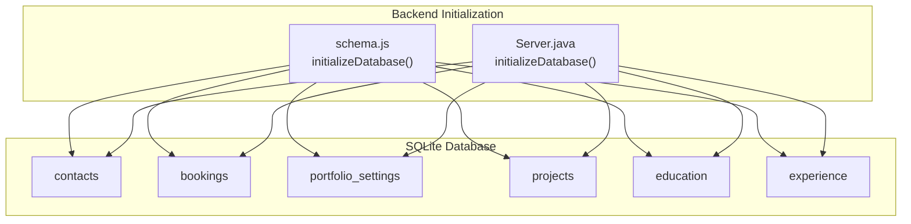
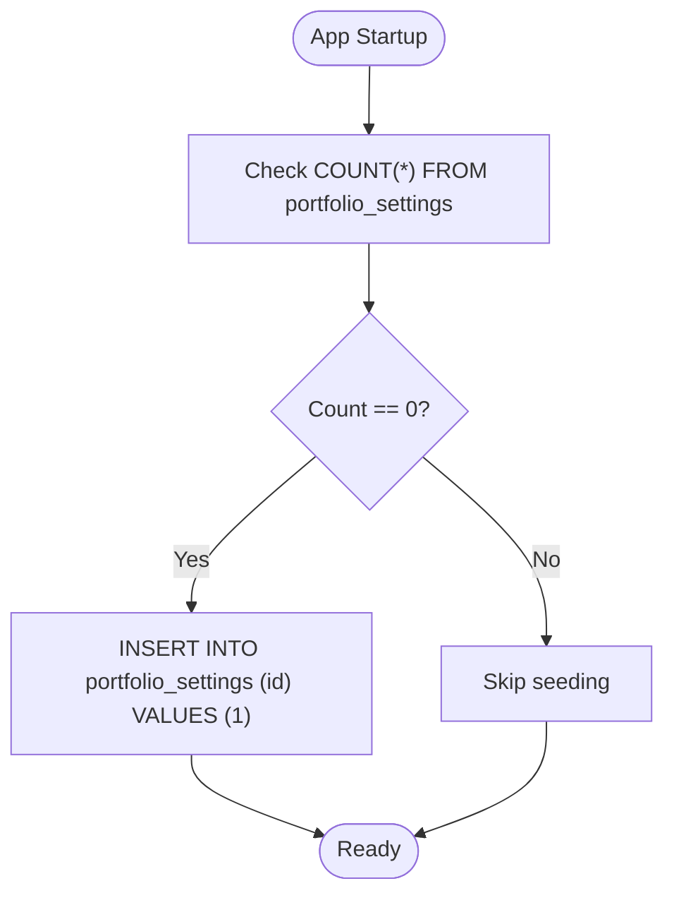
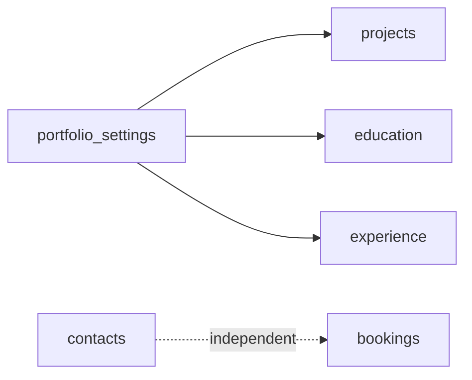

# Database Schema Design

<cite>
**Referenced Files in This Document**
- [design.md](file://design.md)
- [schema.js](file://server/db/schema.js)
- [Server.java](file://Server.java)
- [settings.js](file://server/routes/settings.js)
</cite>

## Table of Contents
1. [Introduction](#introduction)
2. [Project Structure](#project-structure)
3. [Core Components](#core-components)
4. [Architecture Overview](#architecture-overview)
5. [Detailed Component Analysis](#detailed-component-analysis)
6. [Dependency Analysis](#dependency-analysis)
7. [Performance Considerations](#performance-considerations)
8. [Troubleshooting Guide](#troubleshooting-guide)
9. [Conclusion](#conclusion)
10. [Appendices](#appendices)

## Introduction
This document provides comprehensive data model documentation for the SQLite database schema used by the premium portfolio application. It focuses on five core content tables: contacts, bookings, portfolio_settings, projects, education, and experience. The documentation covers entity relationships, field definitions, data types, primary keys, auto-increment constraints, default values, and check constraints. It also explains the singleton pattern used in the portfolio_settings table enforced via a check constraint and documents embedded validation rules and business rules expressed through column definitions. Finally, it includes schema diagrams and references to complete CREATE TABLE statements.

## Project Structure
The database schema is initialized and maintained by the backend initialization logic. Two implementations exist:
- A JavaScript-based initialization script that creates and seeds tables.
- A Java-based initialization routine that performs similar tasks for the contact and booking forms.



**Diagram sources**
- [schema.js:3-286](file://server/db/schema.js#L3-L286)
- [Server.java:122-337](file://Server.java#L122-L337)

**Section sources**
- [schema.js:3-286](file://server/db/schema.js#L3-L286)
- [Server.java:122-337](file://Server.java#L122-L337)

## Core Components
This section documents the five core content tables and their constraints. Each table’s fields, data types, and constraints are described, along with business rules embedded in the schema.

- contacts
  - Purpose: Stores inbound messages from visitors.
  - Primary key: id (INTEGER, AUTOINCREMENT)
  - Fields and constraints:
    - name: TEXT NOT NULL
    - email: TEXT NOT NULL
    - message: TEXT NOT NULL
    - created_at: TIMESTAMP DEFAULT CURRENT_TIMESTAMP
  - Business rules:
    - All fields required for submission.
    - Timestamp recorded upon insertion.

- bookings
  - Purpose: Stores appointment requests.
  - Primary key: id (INTEGER, AUTOINCREMENT)
  - Fields and constraints:
    - name: TEXT NOT NULL
    - email: TEXT NOT NULL
    - booking_date: TEXT NOT NULL
    - booking_time: TEXT NOT NULL
    - topic: TEXT NOT NULL
    - created_at: TIMESTAMP DEFAULT CURRENT_TIMESTAMP
  - Business rules:
    - All fields required for a booking request.
    - Timestamp recorded upon insertion.

- portfolio_settings
  - Purpose: Singleton configuration table for global UI and SEO settings.
  - Primary key: id (INTEGER, PRIMARY KEY)
  - Singleton enforcement: CHECK (id = 1)
  - Fields and constraints:
    - theme_preset: TEXT DEFAULT 'dark'
    - primary_color: TEXT DEFAULT '#f43f5e'
    - secondary_color: TEXT DEFAULT '#8b5cf6'
    - accent_color: TEXT DEFAULT '#f59e0b'
    - background_color: TEXT DEFAULT '#050811'
    - surface_color: TEXT DEFAULT '#0c1122'
    - font_display: TEXT DEFAULT 'Oswald'
    - font_body: TEXT DEFAULT 'Inter'
    - animations_enabled: INTEGER DEFAULT 1 (Boolean-like 0 or 1)
    - layout_sections_order: TEXT DEFAULT 'about,education,skills,now,projects,contact'
    - seo_title: TEXT DEFAULT 'Portfolio'
    - seo_description: TEXT DEFAULT 'Developer Portfolio'
    - analytics_id: TEXT DEFAULT ''
    - updated_at: TIMESTAMP DEFAULT CURRENT_TIMESTAMP
  - Business rules:
    - Enforced as a single-row table via id=1 constraint.
    - Defaults provide sensible out-of-the-box configuration.
    - Updated timestamp tracks last modification.

- projects
  - Purpose: Timeline of projects with visibility and ordering controls.
  - Primary key: id (INTEGER, AUTOINCREMENT)
  - Fields and constraints:
    - title: TEXT NOT NULL
    - description: TEXT NOT NULL
    - image_url: TEXT
    - github_link: TEXT
    - live_link: TEXT
    - tags: TEXT DEFAULT '' (comma-separated list)
    - sort_order: INTEGER DEFAULT 0
    - is_visible: INTEGER DEFAULT 1 (Boolean-like 0 or 1)
    - created_at: TIMESTAMP DEFAULT CURRENT_TIMESTAMP
  - Business rules:
    - Visibility controlled via is_visible flag.
    - Sort order supports custom presentation.
    - Timestamp recorded upon insertion.

- education
  - Purpose: Educational milestones timeline.
  - Primary key: id (INTEGER, AUTOINCREMENT)
  - Fields and constraints:
    - degree: TEXT NOT NULL
    - institution: TEXT NOT NULL
    - timeline: TEXT NOT NULL
    - description: TEXT DEFAULT ''
    - sort_order: INTEGER DEFAULT 0
    - is_visible: INTEGER DEFAULT 1 (Boolean-like 0 or 1)
    - created_at: TIMESTAMP DEFAULT CURRENT_TIMESTAMP
  - Business rules:
    - Visibility controlled via is_visible flag.
    - Sort order supports custom presentation.
    - Timestamp recorded upon insertion.

- experience
  - Purpose: Professional experience timeline.
  - Primary key: id (INTEGER, AUTOINCREMENT)
  - Fields and constraints:
    - role: TEXT NOT NULL
    - company: TEXT NOT NULL
    - timeline: TEXT NOT NULL
    - description: TEXT DEFAULT ''
    - sort_order: INTEGER DEFAULT 0
    - is_visible: INTEGER DEFAULT 1 (Boolean-like 0 or 1)
    - created_at: TIMESTAMP DEFAULT CURRENT_TIMESTAMP
  - Business rules:
    - Visibility controlled via is_visible flag.
    - Sort order supports custom presentation.
    - Timestamp recorded upon insertion.

**Section sources**
- [design.md:204-276](file://design.md#L204-L276)
- [schema.js:7-108](file://server/db/schema.js#L7-L108)
- [Server.java:122-209](file://Server.java#L122-L209)

## Architecture Overview
The schema is intentionally simple and flat, with no explicit foreign keys among the five core content tables. The portfolio_settings table acts as a singleton configuration anchor, while projects, education, and experience are independent timelines. contacts and bookings are separate from the portfolio content tables, reflecting distinct concerns.

```mermaid
erDiagram
CONTACTS {
integer id PK
text name
text email
text message
timestamp created_at
}
BOOKINGS {
integer id PK
text name
text email
text booking_date
text booking_date
text booking_time
text topic
timestamp created_at
}
PORTFOLIO_SETTINGS {
integer id PK CK
text theme_preset
text primary_color
text secondary_color
text accent_color
text background_color
text surface_color
text font_display
text font_body
integer animations_enabled
text layout_sections_order
text seo_title
text seo_description
text analytics_id
timestamp updated_at
}
PROJECTS {
integer id PK
text title
text description
text image_url
text github_link
text live_link
text tags
integer sort_order
integer is_visible
timestamp created_at
}
EDUCATION {
integer id PK
text degree
text institution
text timeline
text description
integer sort_order
integer is_visible
timestamp created_at
}
EXPERIENCE {
integer id PK
text role
text company
text timeline
text description
integer sort_order
integer is_visible
timestamp created_at
}
CONTACTS ||--o{ BOOKINGS : "independent"
PORTFOLIO_SETTINGS ||--o{ PROJECTS : "content"
PORTFOLIO_SETTINGS ||--o{ EDUCATION : "content"
PORTFOLIO_SETTINGS ||--o{ EXPERIENCE : "content"
```

**Diagram sources**
- [design.md:204-276](file://design.md#L204-L276)
- [schema.js:7-108](file://server/db/schema.js#L7-L108)
- [Server.java:122-209](file://Server.java#L122-L209)

## Detailed Component Analysis

### portfolio_settings singleton pattern
The portfolio_settings table enforces a singleton pattern using a check constraint on the primary key id. Only a single row with id=1 is permitted. This ensures that the application reads and writes a single configuration record without needing to manage multiple rows.

- Implementation details:
  - Primary key id with CHECK (id = 1) ensures exactly one row exists.
  - Defaults populate initial values for all configuration fields.
  - An initialization routine inserts id=1 if the table is empty.
  - Routes target updates using WHERE id = 1 to maintain the singleton contract.



**Diagram sources**
- [schema.js:222-227](file://server/db/schema.js#L222-L227)
- [settings.js:10-10](file://server/routes/settings.js#L10-L10)
- [settings.js:62-62](file://server/routes/settings.js#L62-L62)

**Section sources**
- [schema.js:222-227](file://server/db/schema.js#L222-L227)
- [settings.js:10-10](file://server/routes/settings.js#L10-L10)
- [settings.js:62-62](file://server/routes/settings.js#L62-L62)

### Data validation rules embedded in schema
Several validation rules are embedded directly in the schema definitions:
- NOT NULL constraints ensure required fields cannot be empty.
- DEFAULT values provide fallbacks for optional or configuration fields.
- INTEGER DEFAULT 1 and INTEGER DEFAULT 0 act as booleans for flags like animations_enabled and is_visible.
- CHECK (id = 1) enforces a singleton row in portfolio_settings.
- UNIQUE constraints exist on users.email for identity management (not part of the five requested tables but relevant to the broader schema).

These rules prevent invalid states at the database level and reduce application-side validation overhead.

**Section sources**
- [design.md:204-276](file://design.md#L204-L276)
- [schema.js:7-108](file://server/db/schema.js#L7-L108)
- [Server.java:122-209](file://Server.java#L122-L209)

### Business rules enforced through column definitions
- Visibility control:
  - is_visible flag (INTEGER DEFAULT 1) governs whether items appear in rendered timelines.
- Ordering control:
  - sort_order (INTEGER DEFAULT 0) allows administrators to customize presentation order.
- Timestamp auditing:
  - created_at and updated_at/timestamp fields capture audit trails for content creation and modifications.
- Color and theme presets:
  - Color fields and theme_preset defaults provide immediate visual configuration.

**Section sources**
- [design.md:204-276](file://design.md#L204-L276)
- [schema.js:7-108](file://server/db/schema.js#L7-L108)
- [Server.java:122-209](file://Server.java#L122-L209)

### Complete CREATE TABLE statements
The following references point to the exact CREATE TABLE statements used by the backend initialization routines:

- contacts
  - [schema.js:8-14](file://server/db/schema.js#L8-L14)
  - [Server.java:122-124](file://Server.java#L122-L124)

- bookings
  - [schema.js:16-24](file://server/db/schema.js#L16-L24)
  - [Server.java:122-124](file://Server.java#L122-L124)

- portfolio_settings
  - [schema.js:26-39](file://server/db/schema.js#L26-L39)
  - [Server.java:123-135](file://Server.java#L123-L135)

- projects
  - [schema.js:74-86](file://server/db/schema.js#L74-L86)
  - [Server.java:246-251](file://Server.java#L246-L251)

- education
  - [schema.js:88-97](file://server/db/schema.js#L88-L97)
  - [Server.java:314-321](file://Server.java#L314-L321)

- experience
  - [schema.js:99-108](file://server/db/schema.js#L99-L108)
  - [Server.java:322-330](file://Server.java#L322-L330)

**Section sources**
- [schema.js:7-108](file://server/db/schema.js#L7-L108)
- [Server.java:122-337](file://Server.java#L122-L337)

## Dependency Analysis
There are no explicit foreign key relationships among the five core content tables. Instead, the system relies on:
- The singleton pattern in portfolio_settings to centralize configuration.
- Application-level logic to assemble content for rendering (as indicated by design documentation).



**Diagram sources**
- [design.md:204-276](file://design.md#L204-L276)
- [schema.js:7-108](file://server/db/schema.js#L7-L108)

**Section sources**
- [design.md:204-276](file://design.md#L204-L276)
- [schema.js:7-108](file://server/db/schema.js#L7-L108)

## Performance Considerations
- Indexes: No explicit indexes are defined in the core schema. For high-volume queries on is_visible or sort_order, consider adding indexes on frequently filtered/sorted columns.
- Data types: TEXT is used for many fields; ensure appropriate normalization only if storage or query performance becomes a concern.
- Singleton maintenance: The portfolio_settings singleton avoids JOINs and simplifies reads/writes, reducing query complexity.

[No sources needed since this section provides general guidance]

## Troubleshooting Guide
- Singleton violations:
  - Symptom: Attempting to insert id != 1 into portfolio_settings fails.
  - Resolution: Ensure all writes target WHERE id = 1 and rely on the seeded id=1 row.
  - Reference: [schema.js:222-227](file://server/db/schema.js#L222-L227), [settings.js:62-62](file://server/routes/settings.js#L62-L62)

- Missing configuration defaults:
  - Symptom: Empty configuration after fresh install.
  - Resolution: Confirm initialization seeds id=1 and default values.
  - Reference: [schema.js:222-227](file://server/db/schema.js#L222-L227)

- Content visibility issues:
  - Symptom: Items not appearing despite existing.
  - Resolution: Verify is_visible flag is set to 1; confirm sort_order values for desired ordering.
  - Reference: [design.md:204-276](file://design.md#L204-L276), [schema.js:74-108](file://server/db/schema.js#L74-L108)

**Section sources**
- [schema.js:222-227](file://server/db/schema.js#L222-L227)
- [settings.js:62-62](file://server/routes/settings.js#L62-L62)
- [design.md:204-276](file://design.md#L204-L276)
- [schema.js:74-108](file://server/db/schema.js#L74-L108)

## Conclusion
The SQLite schema for the premium portfolio is designed for simplicity and clarity. The five core content tables support independent timelines and straightforward configuration via a singleton portfolio_settings table. Embedded constraints and defaults enforce essential business rules, while application logic orchestrates content assembly. This design balances maintainability with flexibility for future enhancements.

[No sources needed since this section summarizes without analyzing specific files]

## Appendices

### Appendix A: Relationship and Constraint Summary
- Primary keys: All tables except portfolio_settings define id as INTEGER PRIMARY KEY AUTOINCREMENT; portfolio_settings defines id as INTEGER PRIMARY KEY CHECK (id = 1).
- Auto-increment: contacts, bookings, projects, education, experience, and portfolio_settings (except singleton id).
- Defaults: Many TEXT and INTEGER fields carry sensible defaults for configuration and content.
- Check constraints: portfolio_settings enforces singleton via CHECK (id = 1).
- Foreign keys: None among the five core content tables.

**Section sources**
- [design.md:204-276](file://design.md#L204-L276)
- [schema.js:7-108](file://server/db/schema.js#L7-L108)
- [Server.java:122-209](file://Server.java#L122-L209)