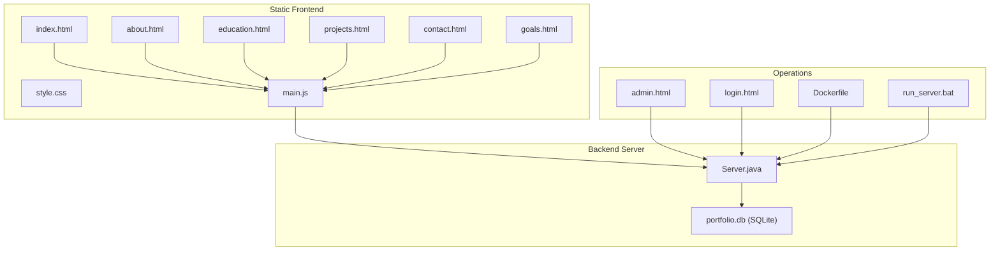
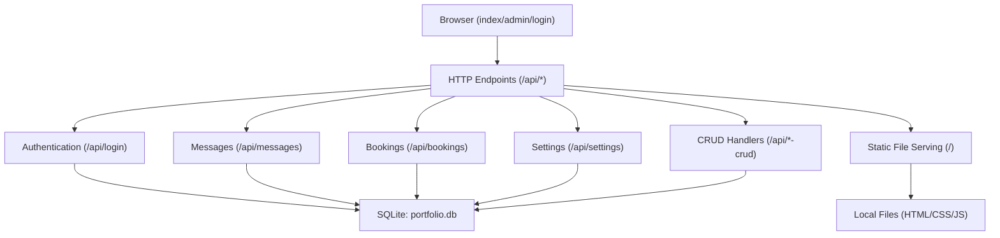
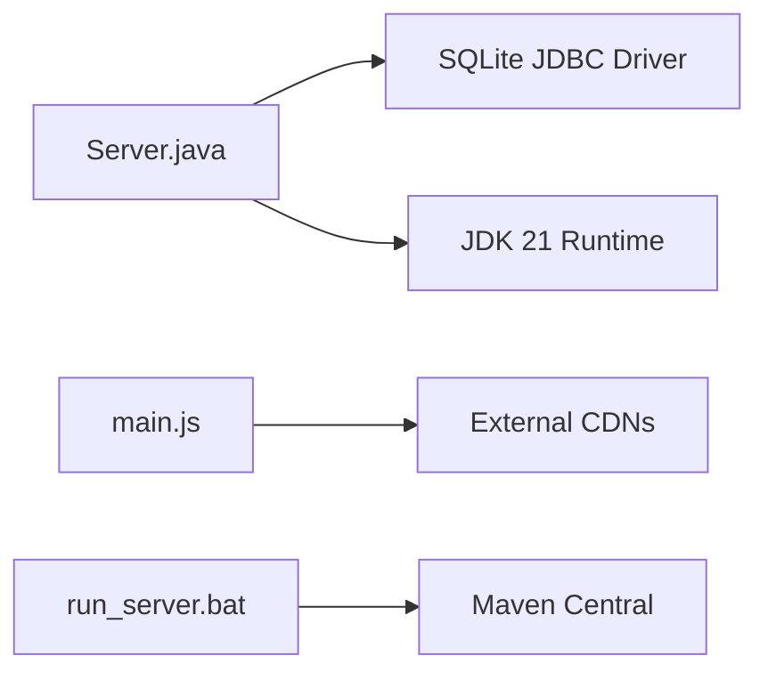

# Deployment and Operations

<cite>
**Referenced Files in This Document**
- [Dockerfile](file://Dockerfile)
- [run_server.bat](file://run_server.bat)
- [Server.java](file://Server.java)
- [main.js](file://main.js)
- [style.css](file://style.css)
- [index.html](file://index.html)
- [admin.html](file://admin.html)
- [login.html](file://login.html)
- [about.html](file://about.html)
- [contact.html](file://contact.html)
- [education.html](file://education.html)
- [goals.html](file://goals.html)
- [projects.html](file://projects.html)
</cite>

## Table of Contents
1. [Introduction](#introduction)
2. [Project Structure](#project-structure)
3. [Core Components](#core-components)
4. [Architecture Overview](#architecture-overview)
5. [Detailed Component Analysis](#detailed-component-analysis)
6. [Dependency Analysis](#dependency-analysis)
7. [Performance Considerations](#performance-considerations)
8. [Troubleshooting Guide](#troubleshooting-guide)
9. [Conclusion](#conclusion)
10. [Appendices](#appendices)

## Introduction
This document provides comprehensive deployment and operations guidance for the Premium Portfolio application. It covers containerization with Docker using Eclipse Temurin JDK 21 on Alpine Linux, production deployment procedures, environment variable management, Windows startup scripts, infrastructure and scaling considerations, monitoring approaches, security hardening, backup procedures, maintenance tasks, troubleshooting, performance optimization, log analysis, and CI/CD integration strategies.

## Project Structure
The Premium Portfolio is a static frontend application enhanced by a lightweight Java HTTP server that serves dynamic content and manages a local SQLite database. The server exposes REST endpoints for contact submissions, booking consultations, administration, and content customization. The frontend is composed of multiple HTML pages, a shared stylesheet, and a single JavaScript module that orchestrates animations and dynamic content rendering.

**Diagram sources**
- [Dockerfile:1-18](file://Dockerfile#L1-L18)
- [run_server.bat:1-62](file://run_server.bat#L1-L62)
- [Server.java:1-120](file://Server.java#L1-L120)
- [main.js:1-120](file://main.js#L1-L120)
- [style.css:1-60](file://style.css#L1-L60)
- [index.html:1-60](file://index.html#L1-L60)
- [admin.html:1-60](file://admin.html#L1-L60)
- [login.html:1-60](file://login.html#L1-L60)

**Section sources**
- [Dockerfile:1-18](file://Dockerfile#L1-L18)
- [run_server.bat:1-62](file://run_server.bat#L1-L62)
- [Server.java:1-120](file://Server.java#L1-L120)
- [main.js:1-120](file://main.js#L1-L120)
- [style.css:1-60](file://style.css#L1-L60)
- [index.html:1-60](file://index.html#L1-L60)
- [admin.html:1-60](file://admin.html#L1-L60)
- [login.html:1-60](file://login.html#L1-L60)

## Core Components
- Java HTTP Server (embedded): Provides REST endpoints for contact submissions, booking, admin authentication, and content management. It initializes SQLite tables and seeds default data on startup.
- Static Frontend: HTML pages with shared CSS and a centralized JavaScript module that fetches dynamic content from the backend and renders animations.
- Administration Dashboard: A protected interface to view, filter, and delete messages and bookings, and to customize visual settings persisted in the database.
- Windows Startup Script: Automates dependency retrieval and server launch on Windows environments.

Key implementation references:
- Server initialization and port binding: [Server.java:18-83](file://Server.java#L18-L83)
- Database initialization and migrations: [Server.java:85-337](file://Server.java#L85-L337)
- Admin authentication and protected routes: [Server.java:339-396](file://Server.java#L339-L396)
- Frontend dynamic content fetching: [main.js:76-135](file://main.js#L76-L135)
- Admin dashboard UI and controls: [admin.html:608-800](file://admin.html#L608-L800)
- Windows launcher script: [run_server.bat:1-62](file://run_server.bat#L1-L62)

**Section sources**
- [Server.java:18-337](file://Server.java#L18-L337)
- [main.js:76-135](file://main.js#L76-L135)
- [admin.html:608-800](file://admin.html#L608-L800)
- [run_server.bat:1-62](file://run_server.bat#L1-L62)

## Architecture Overview
The application follows a thin-server architecture:
- The Java server runs a built-in HTTP server, exposing endpoints for admin and client-facing features.
- The frontend communicates with the server via REST calls and updates content dynamically.
- SQLite persists configuration, messages, bookings, and related metadata.

**Diagram sources**
- [Server.java:34-83](file://Server.java#L34-L83)
- [main.js:76-135](file://main.js#L76-L135)
- [admin.html:608-800](file://admin.html#L608-L800)

**Section sources**
- [Server.java:34-83](file://Server.java#L34-L83)
- [main.js:76-135](file://main.js#L76-L135)
- [admin.html:608-800](file://admin.html#L608-L800)

## Detailed Component Analysis

### Docker Containerization
- Base image: Eclipse Temurin JDK 21 on Alpine Linux.
- SQLite utility installed for verification/debugging.
- Application compiled and executed with classpath pointing to a lib directory and current directory.
- Port exposure configured to 3000; runtime uses environment variable PORT if present.

Operational notes:
- Ensure the lib directory is populated with required JARs (e.g., SQLite JDBC) prior to building.
- The CMD instruction uses a classpath separator appropriate for Linux.

**Section sources**
- [Dockerfile:1-18](file://Dockerfile#L1-L18)

### Windows Startup Script (run_server.bat)
Purpose:
- Creates a lib directory if missing.
- Downloads required JARs (SQLite JDBC, SLF4J API/simple) using PowerShell.
- Verifies dependencies and compiles the Java application.
- Launches the server with a classpath compatible with Windows.

Key behaviors:
- Uses TLS 1.2 for downloads.
- Provides user feedback and exits with error codes on failure.

**Section sources**
- [run_server.bat:1-62](file://run_server.bat#L1-L62)

### Java HTTP Server (Server.java)
Responsibilities:
- Initializes SQLite driver and database schema.
- Registers HTTP contexts for endpoints:
  - Public: POST /api/contact, POST /api/booking-submit
  - Protected: GET/DELETE /api/messages, GET/DELETE /api/bookings, POST /api/login, GET/POST /api/settings, CRUD endpoints for projects/education/experience
  - Static: /admin and /admin.html protected by session cookie check
- Implements CORS headers and JSON parsing helpers.
- Uses a session cookie for admin access.

Environment variables:
- PORT: Overrides default port 3000; invalid values fall back to 3000.

Security considerations:
- Basic admin credentials are embedded in the login handler.
- Cookie attributes include HttpOnly and SameSite=Lax.

**Section sources**
- [Server.java:18-83](file://Server.java#L18-L83)
- [Server.java:85-337](file://Server.java#L85-L337)
- [Server.java:339-396](file://Server.java#L339-L396)

### Frontend (main.js, style.css, HTML pages)
- main.js orchestrates page loading, dynamic content fetching, animations, and form submissions.
- style.css defines the design system and responsive layout.
- HTML pages provide navigation and content areas; the admin page integrates with the backend for data management.

**Section sources**
- [main.js:76-135](file://main.js#L76-L135)
- [style.css:1-60](file://style.css#L1-L60)
- [index.html:1-60](file://index.html#L1-L60)
- [admin.html:608-800](file://admin.html#L608-L800)
- [login.html:120-172](file://login.html#L120-L172)

### Administration Dashboard (admin.html)
- Provides stats, a terminal-like audit log, tabs for messages/bookings/design/content, filtering/search, and destructive actions with confirmation modals.
- Communicates with backend endpoints to manage data and settings.

**Section sources**
- [admin.html:608-800](file://admin.html#L608-L800)

## Dependency Analysis
Runtime dependencies:
- Java runtime (Eclipse Temurin JDK 21).
- SQLite JDBC driver for database connectivity.
- Optional logging libraries (SLF4J) as packaged in the Windows launcher.

Build-time dependencies:
- Java compiler for Server.java.
- Maven Central for downloading JARs during Windows setup.

External integrations:
- Frontend loads external resources (CDNs) for Tailwind, fonts, icons, and GSAP.

**Diagram sources**
- [run_server.bat:14-33](file://run_server.bat#L14-L33)
- [Server.java:85-92](file://Server.java#L85-L92)

**Section sources**
- [run_server.bat:14-33](file://run_server.bat#L14-L33)
- [Server.java:85-92](file://Server.java#L85-L92)

## Performance Considerations
- Concurrency: The server uses the default executor; for production, consider tuning thread pools and request handling.
- Static assets: Serve via a reverse proxy or CDN to reduce JVM overhead.
- Database: SQLite is suitable for small workloads; consider migration to a server-based relational database for higher concurrency.
- Memory: Monitor heap usage and tune JVM options in container/runtime configurations.
- Logging: Reduce verbosity in production; avoid excessive console output.

[No sources needed since this section provides general guidance]

## Troubleshooting Guide
Common deployment issues and resolutions:
- Missing dependencies on Windows:
  - Symptom: Compilation or runtime errors due to missing JARs.
  - Resolution: Ensure lib directory contains SQLite JDBC and SLF4J JARs; rerun the launcher script.
  - Section sources
    - [run_server.bat:14-33](file://run_server.bat#L14-L33)
- Invalid PORT environment variable:
  - Symptom: Server binds to default port instead of expected value.
  - Resolution: Set PORT to a valid integer; otherwise, the server falls back to 3000.
  - Section sources
    - [Server.java:22-32](file://Server.java#L22-L32)
- Admin authentication failures:
  - Symptom: Login endpoint returns unauthorized.
  - Resolution: Verify hardcoded credentials match the login form submission.
  - Section sources
    - [Server.java:385-394](file://Server.java#L385-L394)
    - [login.html:146-170](file://login.html#L146-L170)
- Database connectivity errors:
  - Symptom: SQL exceptions during insert/retrieve operations.
  - Resolution: Confirm SQLite JDBC driver is on the classpath and the database file is writable.
  - Section sources
    - [Server.java:85-92](file://Server.java#L85-L92)
    - [Server.java:533-541](file://Server.java#L533-L541)
- CORS-related issues:
  - Symptom: Browser blocks cross-origin requests.
  - Resolution: Verify CORS headers are set for endpoints.
  - Section sources
    - [Server.java:398-402](file://Server.java#L398-L402)

Log analysis:
- Server logs: Inspect console output for initialization messages, SQL errors, and startup failures.
- Frontend logs: Use browser developer tools to review network requests and console errors.
- Admin terminal: Review the audit log widget for SQL operation feedback.

**Section sources**
- [run_server.bat:14-33](file://run_server.bat#L14-L33)
- [Server.java:22-32](file://Server.java#L22-L32)
- [Server.java:385-394](file://Server.java#L385-L394)
- [login.html:146-170](file://login.html#L146-L170)
- [Server.java:85-92](file://Server.java#L85-L92)
- [Server.java:533-541](file://Server.java#L533-L541)
- [Server.java:398-402](file://Server.java#L398-L402)

## Conclusion
The Premium Portfolio combines a static frontend with a minimal Java HTTP server and SQLite persistence. Its containerized deployment model and Windows startup script simplify local development and production rollout. By following the operational guidance herein—covering environment variables, security hardening, backups, monitoring, and CI/CD—you can reliably deploy and maintain the application at scale.

[No sources needed since this section summarizes without analyzing specific files]

## Appendices

### Environment Variables
- PORT: TCP port for the HTTP server (default 3000). Non-numeric values are ignored and treated as unset.

**Section sources**
- [Server.java:22-32](file://Server.java#L22-L32)

### Infrastructure Requirements
- Compute: Lightweight container or VM sufficient for static hosting plus a small Java process.
- Storage: Write access to the working directory for SQLite database file.
- Networking: Ingress to expose port 3000 (or custom PORT) externally.

**Section sources**
- [Dockerfile:13-14](file://Dockerfile#L13-L14)
- [Server.java:18-32](file://Server.java#L18-L32)

### Scaling Considerations
- Horizontal scaling: Stateless static assets can be served behind a load balancer; the server is single-instance per pod/process.
- Database: For concurrent writes, migrate from SQLite to a managed relational database.
- Caching: Introduce CDN caching for static assets and consider in-memory caches for frequently accessed settings.

**Section sources**
- [Server.java:85-337](file://Server.java#L85-L337)

### Monitoring Approaches
- Health checks: Expose a simple GET endpoint to verify server readiness.
- Metrics: Track request latency, error rates, and database query durations.
- Logs: Centralize container logs and configure structured logging for the server.

**Section sources**
- [Server.java:34-83](file://Server.java#L34-L83)

### Security Hardening
- Authentication: Replace hardcoded credentials with a configurable secret and secure session storage.
- Transport: Enforce HTTPS termination at ingress or reverse proxy.
- Headers: Add security headers (e.g., Content-Security-Policy) and disable unnecessary CORS.
- Secrets: Store sensitive configuration outside the container image using environment injection.

**Section sources**
- [Server.java:385-394](file://Server.java#L385-L394)

### Backup Procedures
- Database: Back up portfolio.db regularly; consider WAL mode for improved durability.
- Configuration: Persist settings in the database; treat them as part of the backup rotation.
- Artifacts: Archive static assets and Docker images for reproducible deployments.

**Section sources**
- [Server.java:85-337](file://Server.java#L85-L337)

### Maintenance Tasks
- Dependency updates: Periodically refresh JARs and verify compatibility with JDK 21.
- Schema migrations: Add ALTER TABLE statements for evolving requirements.
- Frontend updates: Validate animations and API endpoints after CSS/JS changes.

**Section sources**
- [Server.java:173-214](file://Server.java#L173-L214)
- [main.js:76-135](file://main.js#L76-L135)

### CI/CD Integration
- Build pipeline: Compile Java sources, package dependencies, and build the Docker image.
- Test pipeline: Validate server startup, endpoint responses, and database initialization.
- Release pipeline: Push images to a registry and deploy to staging/production environments.
- Rollback: Maintain immutable tags and enable quick rollbacks to previous image versions.

**Section sources**
- [Dockerfile:1-18](file://Dockerfile#L1-L18)
- [run_server.bat:43-56](file://run_server.bat#L43-L56)