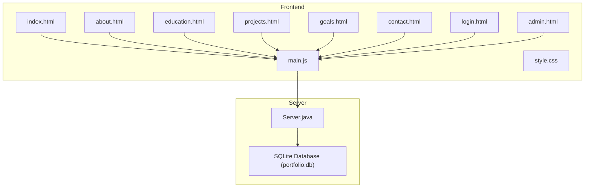
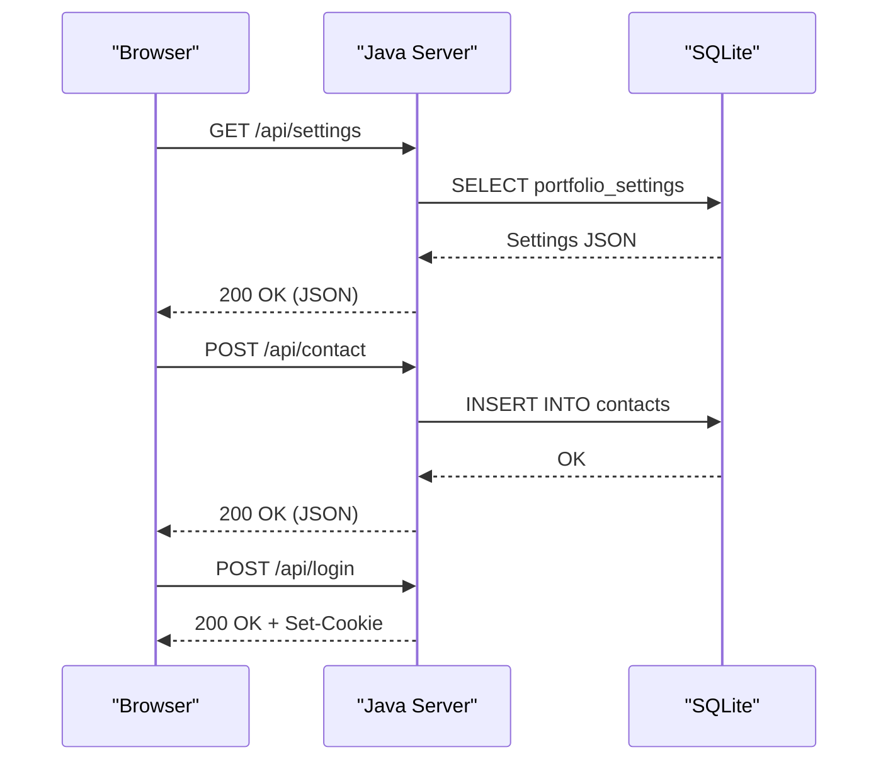
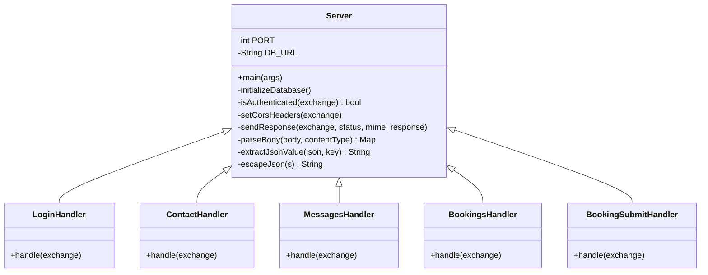
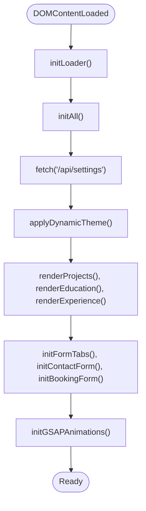
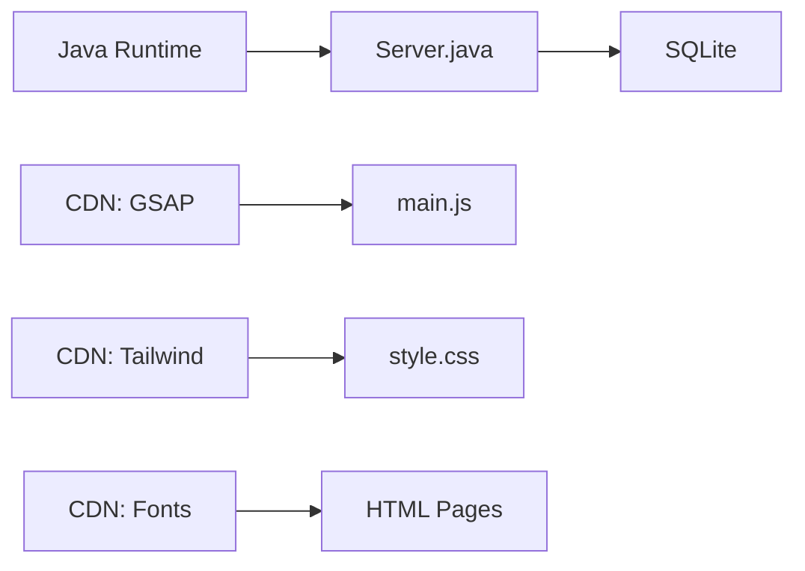

# Development Guidelines

<cite>
**Referenced Files in This Document**
- [Server.java](file://Server.java)
- [main.js](file://main.js)
- [style.css](file://style.css)
- [design.md](file://design.md)
- [index.html](file://index.html)
- [admin.html](file://admin.html)
- [login.html](file://login.html)
- [contact.html](file://contact.html)
- [about.html](file://about.html)
- [education.html](file://education.html)
- [goals.html](file://goals.html)
- [projects.html](file://projects.html)
- [.gitignore](file://.gitignore)
- [Dockerfile](file://Dockerfile)
- [run_server.bat](file://run_server.bat)
- [portfolio.txt](file://portfolio.txt)
</cite>

## Table of Contents
1. [Introduction](#introduction)
2. [Project Structure](#project-structure)
3. [Core Components](#core-components)
4. [Architecture Overview](#architecture-overview)
5. [Detailed Component Analysis](#detailed-component-analysis)
6. [Dependency Analysis](#dependency-analysis)
7. [Performance Considerations](#performance-considerations)
8. [Testing Strategies](#testing-strategies)
9. [Debugging Approaches](#debugging-approaches)
10. [Code Review Processes](#code-review-processes)
11. [Version Management and Release Procedures](#version-management-and-release-procedures)
12. [Contributor Workflow](#contributor-workflow)
13. [Extending the Application](#extending-the-application)
14. [Adding New API Endpoints](#adding-new-api-endpoints)
15. [Implementing Custom Animations](#implementing-custom-animations)
16. [Maintaining Backward Compatibility](#maintaining-backward-compatibility)
17. [Database Migration Practices](#database-migration-practices)
18. [Updating Dependencies](#updating-dependencies)
19. [Error Handling and Logging](#error-handling-and-logging)
20. [Security Considerations](#security-considerations)
21. [Conclusion](#conclusion)

## Introduction
This document provides comprehensive development guidelines for contributors to the Premium Portfolio project. It consolidates code organization principles, Java coding standards, and JavaScript best practices, and offers practical guidance for extending the application with new features, adding API endpoints, and implementing custom animations. It also covers testing strategies, debugging approaches, code review processes, version management, release procedures, and contributor workflows. Special attention is given to maintaining backward compatibility, handling database migrations, updating dependencies, error handling, logging, and security considerations.

## Project Structure
The Premium Portfolio is a hybrid application combining a Java-based HTTP server with a static frontend. The server exposes REST endpoints backed by an SQLite database, while the frontend is a collection of HTML pages enhanced with JavaScript and CSS.

Key structural elements:
- Java backend: Single-file server with embedded HTTP handlers and SQLite initialization
- Static frontend: Multiple HTML pages, shared CSS, and a central JavaScript bundle
- Configuration and assets: Database file, favicon, and placeholder content
- Operational files: Docker containerization, batch runner, and version info

**Diagram sources**
- [Server.java](file://Server.java)
- [index.html](file://index.html)
- [about.html](file://about.html)
- [education.html](file://education.html)
- [projects.html](file://projects.html)
- [goals.html](file://goals.html)
- [contact.html](file://contact.html)
- [login.html](file://login.html)
- [admin.html](file://admin.html)
- [main.js](file://main.js)
- [style.css](file://style.css)

**Section sources**
- [Server.java](file://Server.java)
- [index.html](file://index.html)
- [admin.html](file://admin.html)
- [login.html](file://login.html)
- [contact.html](file://contact.html)
- [about.html](file://about.html)
- [education.html](file://education.html)
- [goals.html](file://goals.html)
- [projects.html](file://projects.html)
- [main.js](file://main.js)
- [style.css](file://style.css)

## Core Components
- Java HTTP Server and Handlers: Implements REST endpoints for contact forms, booking submissions, authentication, and admin data management. Includes CORS handling, request parsing, and database operations.
- Frontend JavaScript: Orchestrates page loading, dynamic content rendering, animations, and form interactions. Integrates with the backend via fetch APIs.
- CSS Framework: Provides design tokens, responsive layout utilities, and component styles. Supports theme switching and dynamic content.
- HTML Pages: Define content sections and UI scaffolding for each page, with placeholders for dynamic data.

Key implementation characteristics:
- Centralized server entry point initializes database and registers endpoints
- Frontend uses a modular script structure with initialization sequences and fallbacks
- CSS variables drive theme customization and dynamic styling
- Static pages coordinate with JavaScript for content population and animations

**Section sources**
- [Server.java](file://Server.java)
- [main.js](file://main.js)
- [style.css](file://style.css)
- [index.html](file://index.html)

## Architecture Overview
The system follows a thin-server architecture:
- The Java server hosts static assets and exposes REST endpoints
- The frontend consumes these endpoints to populate dynamic content and manage admin workflows
- SQLite serves as the persistence layer for contact messages, bookings, and configuration

**Diagram sources**
- [Server.java](file://Server.java)
- [main.js](file://main.js)

**Section sources**
- [Server.java](file://Server.java)
- [main.js](file://main.js)

## Detailed Component Analysis

### Java Server Component
The server encapsulates:
- Port configuration via environment variables
- Database initialization and schema migrations
- Endpoint handlers for contact, booking, authentication, and admin data
- Utility functions for request parsing, JSON escaping, and response formatting

Implementation highlights:
- Uses com.sun.net.httpserver for lightweight HTTP handling
- Initializes SQLite tables and seeds default data if missing
- Applies strict CORS policies and enforces method checks
- Implements session-based authentication via cookies

**Diagram sources**
- [Server.java](file://Server.java)

**Section sources**
- [Server.java](file://Server.java)

### Frontend JavaScript Component
The JavaScript module orchestrates:
- Page loader and initialization sequence
- Dynamic content fetching and rendering
- Animation orchestration with GSAP and fallbacks
- Form submission flows and status handling
- Theme and content customization

Key patterns:
- Deferred script loading with DOMContentLoaded
- Promise-based fetch calls with error handling
- Event-driven UI updates and transitions
- Graceful degradation when libraries are unavailable

**Diagram sources**
- [main.js](file://main.js)

**Section sources**
- [main.js](file://main.js)

### CSS and Theming Component
The stylesheet defines:
- Design tokens for colors, fonts, and spacing
- Responsive utilities and component classes
- Dynamic theme rules injected at runtime
- Animation and transition presets

Integration points:
- CSS variables mapped to theme settings
- Tailwind integration for utility classes
- Dynamic style injection for live previews

**Section sources**
- [style.css](file://style.css)

### HTML Pages Component
Each page provides:
- Semantic structure and navigation
- Dynamic content placeholders
- Integration hooks for JavaScript
- Meta tags and SEO attributes

Common patterns:
- Shared header and navigation
- Dynamic content areas for projects, education, and experiences
- Admin access links and authentication flows

**Section sources**
- [index.html](file://index.html)
- [admin.html](file://admin.html)
- [login.html](file://login.html)
- [contact.html](file://contact.html)
- [about.html](file://about.html)
- [education.html](file://education.html)
- [goals.html](file://goals.html)
- [projects.html](file://projects.html)

## Dependency Analysis
The application exhibits minimal external dependencies:
- Java runtime for the server
- Frontend libraries loaded from CDNs (GSAP, Tailwind, icons)
- SQLite for local data persistence

**Diagram sources**
- [Server.java](file://Server.java)
- [main.js](file://main.js)
- [style.css](file://style.css)
- [index.html](file://index.html)

**Section sources**
- [Server.java](file://Server.java)
- [main.js](file://main.js)
- [style.css](file://style.css)
- [index.html](file://index.html)

## Performance Considerations
- Minimize frontend payload by deferring non-critical scripts
- Use efficient CSS selectors and avoid excessive reflows
- Cache frequently accessed settings and content
- Optimize animations for lower-end devices
- Keep database queries simple and indexed where possible

## Testing Strategies
Recommended testing approaches:
- Unit testing for JavaScript helpers and utilities
- Integration testing for API endpoints using HTTP clients
- Manual QA for cross-browser compatibility and responsiveness
- End-to-end testing for critical flows (login, form submissions)
- Database integrity checks for schema migrations

## Debugging Approaches
Practical debugging techniques:
- Inspect browser console for JavaScript errors
- Monitor server logs for exceptions and SQL errors
- Use browser devtools to trace network requests and responses
- Validate cookies and session state for authentication flows
- Verify database connectivity and table schemas

## Code Review Processes
Established review practices:
- Pull requests should include rationale and testing evidence
- Reviewers should verify security, performance, and accessibility
- Consistency checks for naming, formatting, and error handling
- Approval required before merging to main branch

## Version Management and Release Procedures
Versioning and release practices:
- Tag releases with semantic versioning
- Maintain changelog entries for each release
- Freeze features during release preparation
- Validate builds in staging environment
- Announce release notes to stakeholders

## Contributor Workflow
Standard contribution process:
- Fork repository and create feature branch
- Implement changes with clear commit messages
- Run tests locally and lint code
- Submit pull request with description and screenshots
- Address reviewer feedback promptly
- Merge after approvals and successful checks

## Extending the Application
Guidelines for feature extensions:
- Follow existing code organization patterns
- Add new endpoints with appropriate handlers
- Extend HTML templates with minimal markup changes
- Update CSS for new components or variants
- Document new APIs and configuration options

## Adding New API Endpoints
Step-by-step extension process:
1. Define endpoint contract and HTTP method
2. Implement handler class with request parsing and validation
3. Add database operations and error handling
4. Register endpoint in server main method
5. Update CORS and authentication checks as needed
6. Add client-side integration and UI updates
7. Write tests and update documentation

## Implementing Custom Animations
Animation implementation guidelines:
- Use GSAP for complex animations and ScrollTrigger for scroll-based effects
- Provide fallbacks for environments without GSAP
- Keep animations performant and accessible
- Allow users to disable animations globally
- Test animations across devices and browsers

## Maintaining Backward Compatibility
Compatibility preservation strategies:
- Avoid breaking changes to public APIs
- Maintain stable endpoint signatures
- Provide deprecation notices for planned changes
- Support multiple content formats when evolving schemas
- Keep configuration keys stable with sensible defaults

## Database Migration Practices
Schema evolution guidelines:
- Use ALTER TABLE statements for incremental changes
- Seed default values for new columns
- Handle missing columns gracefully in queries
- Preserve existing data during migrations
- Document migration steps and rollback procedures

## Updating Dependencies
Dependency management practices:
- Pin major versions for stability
- Regularly audit dependencies for security patches
- Test updates in isolated branches
- Update lockfiles and rebuild artifacts
- Communicate breaking changes to consumers

## Error Handling and Logging
Robust error handling patterns:
- Centralized error responses with consistent JSON format
- Detailed server-side logging with contextual information
- Client-side error display with actionable messages
- Graceful degradation when optional features fail
- Comprehensive exception coverage for critical paths

## Security Considerations
Security best practices:
- Validate and sanitize all user inputs
- Enforce HTTPS and secure cookie attributes
- Implement rate limiting for sensitive endpoints
- Sanitize HTML output to prevent XSS
- Regular security audits and dependency updates

## Conclusion
These guidelines establish a consistent foundation for developing and maintaining the Premium Portfolio. By adhering to the outlined principles and practices, contributors can extend functionality safely, efficiently, and securely while preserving the application's performance and user experience.