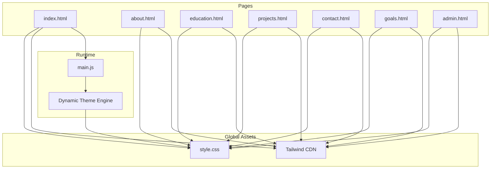
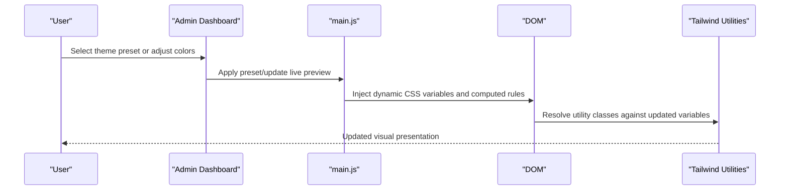
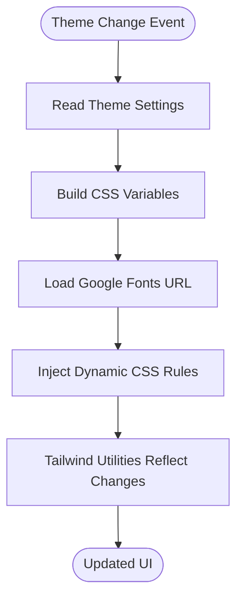
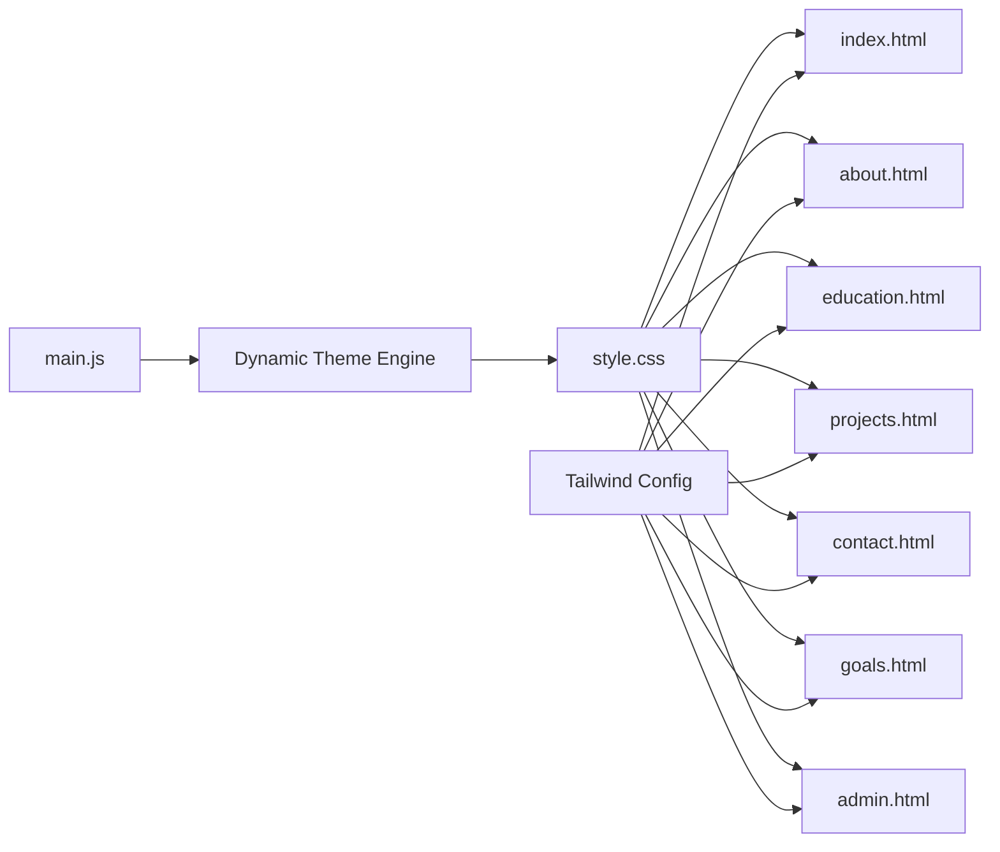

# CSS Styling and Theming

<cite>
**Referenced Files in This Document**
- [style.css](file://style.css)
- [index.html](file://index.html)
- [main.js](file://main.js)
- [admin.html](file://admin.html)
- [about.html](file://about.html)
- [contact.html](file://contact.html)
- [education.html](file://education.html)
- [projects.html](file://projects.html)
- [goals.html](file://goals.html)
</cite>

## Table of Contents
1. [Introduction](#introduction)
2. [Project Structure](#project-structure)
3. [Core Components](#core-components)
4. [Architecture Overview](#architecture-overview)
5. [Detailed Component Analysis](#detailed-component-analysis)
6. [Dependency Analysis](#dependency-analysis)
7. [Performance Considerations](#performance-considerations)
8. [Troubleshooting Guide](#troubleshooting-guide)
9. [Conclusion](#conclusion)

## Introduction
This document explains the CSS styling and theming system used across the premium portfolio website. It covers the integration of Tailwind CSS, the custom design token system, the dynamic theming engine that enables real-time color scheme and typography changes, responsive design patterns, and modern UI effects such as glass morphism and gradients. It also documents how theme settings relate to visual presentation and how the system maintains consistency across different pages.

## Project Structure
The styling system is organized around a single global stylesheet and per-page HTML templates. The global stylesheet defines design tokens, resets, and reusable components. Tailwind CSS is integrated via CDN with a custom configuration that exposes CSS variables as Tailwind colors and fonts. A dynamic theming script updates CSS variables and injects computed styles at runtime, enabling live theme switching and typography customization.

**Diagram sources**
- [style.css:1-800](file://style.css#L1-L800)
- [index.html:1-186](file://index.html#L1-L186)
- [main.js:1100-1164](file://main.js#L1100-L1164)

**Section sources**
- [style.css:1-800](file://style.css#L1-L800)
- [index.html:1-186](file://index.html#L1-L186)
- [main.js:1100-1164](file://main.js#L1100-L1164)

## Core Components
- Design tokens: Centralized CSS variables define colors, typography, easing curves, and spacing. These tokens are consumed by both global styles and Tailwind utilities.
- Tailwind integration: Tailwind is configured to expose CSS variables as named colors and fonts, allowing utility classes to reflect dynamic themes.
- Dynamic theming: A JavaScript engine reads theme settings and injects computed CSS rules, updating fonts, colors, and gradients in real time.
- Modern UI effects: Glass morphism, gradients, and subtle animations are implemented using backdrop filters, pseudo-elements, and CSS transitions.
- Responsive patterns: Flexbox, CSS Grid, and clamp-based typography ensure adaptive layouts across devices.

**Section sources**
- [style.css:7-32](file://style.css#L7-L32)
- [index.html:9-34](file://index.html#L9-L34)
- [main.js:1100-1164](file://main.js#L1100-L1164)

## Architecture Overview
The theming architecture combines static CSS variables with dynamic runtime updates. Tailwind utilities consume the CSS variables, ensuring that utility classes remain consistent with the current theme. The dynamic engine updates variables and computed styles, while per-page templates leverage Tailwind classes and custom components.

**Diagram sources**
- [admin.html:1470-1511](file://admin.html#L1470-L1511)
- [main.js:1100-1164](file://main.js#L1100-L1164)
- [index.html:9-34](file://index.html#L9-L34)

## Detailed Component Analysis

### Tailwind CSS Integration
- CDN configuration: Tailwind is loaded via CDN with plugins enabled and dark mode set to class-based. The theme extends colors and fonts to match CSS variables.
- Variable exposure: Tailwind colors and fonts are mapped to CSS variables, ensuring utility classes reflect the current theme.
- Utility usage: Pages use Tailwind classes for layout, spacing, and typography, which automatically adapt to theme changes.

**Section sources**
- [index.html:9-34](file://index.html#L9-L34)
- [admin.html:10-31](file://admin.html#L10-L31)

### Dynamic Theming System
- Variable injection: The dynamic engine constructs CSS variable assignments and injects them into a dedicated style element. It also updates computed properties like gradient text and border glows.
- Font loading: The engine dynamically loads Google Fonts URLs based on selected display and body fonts.
- Real-time updates: Changes propagate instantly across the interface, including gradients, borders, and typography.

**Diagram sources**
- [main.js:1100-1164](file://main.js#L1100-L1164)
- [index.html:1114-1121](file://index.html#L1114-L1121)

**Section sources**
- [main.js:1100-1164](file://main.js#L1100-L1164)
- [index.html:1114-1121](file://index.html#L1114-L1121)

### Design Token System
- Colors: Background, surface, accents, borders, and text tokens are defined and used consistently across components.
- Typography: Display and body fonts are defined as CSS variables and applied globally and to specific components.
- Easing and spacing: Cubic-bezier timing functions and clamp-based spacing ensure smooth motion and responsive sizing.

**Section sources**
- [style.css:7-32](file://style.css#L7-L32)

### Responsive Design Patterns
- Flexbox and Grid: Sections use CSS Grid for structured layouts and Flexbox for alignment and spacing.
- Clamp-based typography: Fluid sizing ensures readable text across breakpoints.
- Mobile navigation: A hamburger menu transforms into a full-screen radial menu with animated transitions.

**Section sources**
- [style.css:521-547](file://style.css#L521-L547)
- [style.css:303-325](file://style.css#L303-L325)

### Glass Morphism Effects
- Backdrop blur: Glass cards use backdrop-filter with blur and semi-transparent borders.
- Hover enhancements: Transforms and subtle shadows improve interactivity.
- Pseudo-element borders: Gradient overlays are implemented via pseudo-elements for glow effects.

**Section sources**
- [index.html:58-97](file://index.html#L58-L97)
- [style.css:600-612](file://style.css#L600-L612)

### Gradient Backgrounds and Typography
- Gradient text: Dynamic gradient text is generated from current accent colors.
- Border glows: Gradient borders use pseudo-elements with controlled opacity.
- Timeline highlights: Gradients animate along scroll-driven progress indicators.

**Section sources**
- [main.js:1148-1161](file://main.js#L1148-L1161)
- [index.html:73-97](file://index.html#L73-L97)

### Animation Timing Functions
- Custom easings: Predefined cubic-bezier curves are used for smooth transitions and motion.
- Scroll-triggered animations: GSAP integrates with scroll positions for parallax and reveal effects.

**Section sources**
- [style.css:27-29](file://style.css#L27-L29)
- [main.js:398-621](file://main.js#L398-L621)

### Styling Consistency Across Pages
- Shared stylesheet: All pages import the same global stylesheet, ensuring consistent baseline styles.
- Tailwind utilities: Pages rely on Tailwind classes, maintaining uniform spacing, typography, and component styles.
- Dynamic content rendering: The dynamic engine updates content and styles consistently across pages.

**Section sources**
- [about.html:31-40](file://about.html#L31-L40)
- [contact.html:25-34](file://contact.html#L25-L34)
- [education.html:31-40](file://education.html#L31-L40)
- [projects.html:31-40](file://projects.html#L31-L40)
- [goals.html:31-40](file://goals.html#L31-L40)

## Dependency Analysis
The system exhibits low coupling between pages and a centralized theming dependency. Global styles and Tailwind utilities are shared, while dynamic theming depends on the theme settings and injected CSS rules.

**Diagram sources**
- [style.css:1-800](file://style.css#L1-L800)
- [index.html:9-34](file://index.html#L9-L34)
- [main.js:1100-1164](file://main.js#L1100-L1164)

**Section sources**
- [style.css:1-800](file://style.css#L1-L800)
- [index.html:9-34](file://index.html#L9-L34)
- [main.js:1100-1164](file://main.js#L1100-L1164)

## Performance Considerations
- CSS variable usage: Centralized variables reduce duplication and enable efficient theme switching.
- Minimal JavaScript: Dynamic theming runs once per change, avoiding continuous reflows.
- Efficient animations: Motion uses predefined easing curves and scroll-driven animations to minimize layout thrash.
- Tailwind purging: While not explicitly configured, Tailwind’s utility-first approach reduces unused CSS footprint.

## Troubleshooting Guide
- Theme not updating: Verify that the dynamic CSS style element exists and that the theme settings are being passed correctly.
- Fonts not loading: Confirm the dynamically injected Google Fonts link is present and accessible.
- Tailwind utilities inconsistent: Ensure the Tailwind configuration matches CSS variable names and that the page reloads after theme changes.
- Glass morphism issues: Check browser support for backdrop-filter and verify pseudo-element gradients are applied.

**Section sources**
- [main.js:1100-1164](file://main.js#L1100-L1164)
- [index.html:1114-1121](file://index.html#L1114-L1121)

## Conclusion
The styling and theming system blends a robust design token foundation with Tailwind’s utility classes and a powerful dynamic engine. This combination delivers a cohesive, adaptive, and highly customizable visual experience that scales across multiple pages and supports real-time personalization.