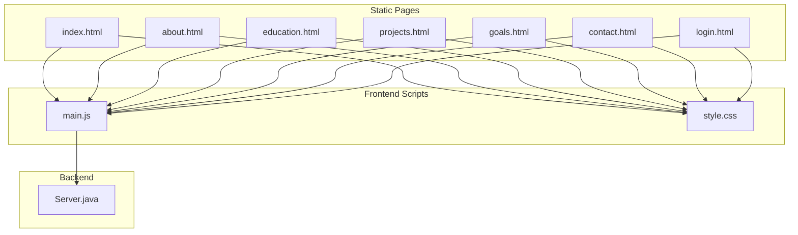
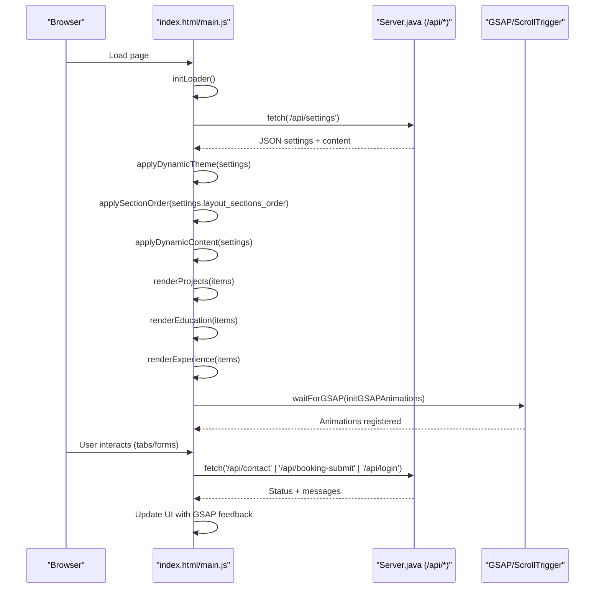
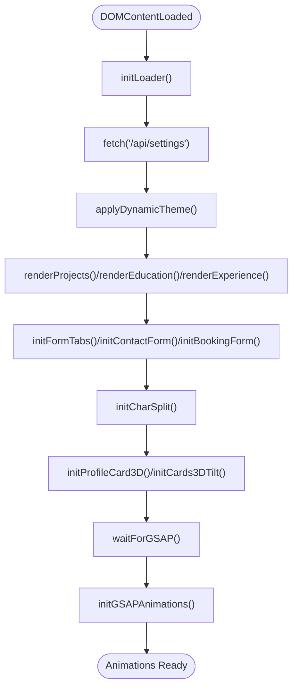
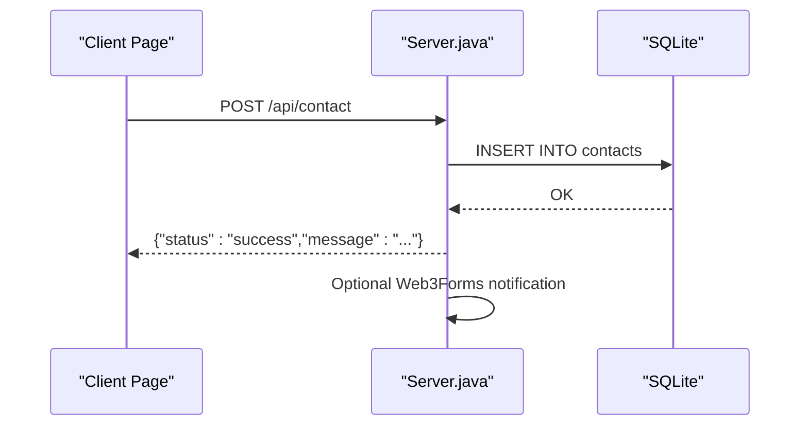
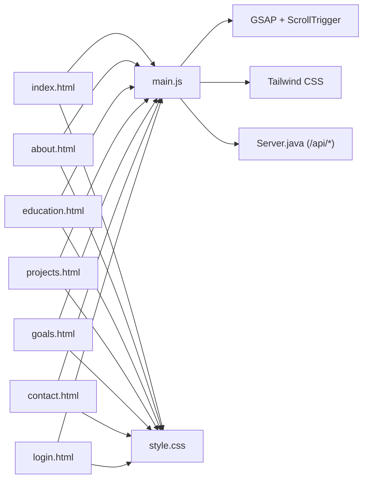

# Frontend Implementation

<cite>
**Referenced Files in This Document**
- [index.html](file://index.html)
- [main.js](file://main.js)
- [style.css](file://style.css)
- [Server.java](file://Server.java)
- [about.html](file://about.html)
- [projects.html](file://projects.html)
- [contact.html](file://contact.html)
- [education.html](file://education.html)
- [goals.html](file://goals.html)
- [login.html](file://login.html)
</cite>

## Table of Contents
1. [Introduction](#introduction)
2. [Project Structure](#project-structure)
3. [Core Components](#core-components)
4. [Architecture Overview](#architecture-overview)
5. [Detailed Component Analysis](#detailed-component-analysis)
6. [Dependency Analysis](#dependency-analysis)
7. [Performance Considerations](#performance-considerations)
8. [Troubleshooting Guide](#troubleshooting-guide)
9. [Conclusion](#conclusion)

## Introduction
This document explains the frontend implementation of a modern portfolio website built with HTML, CSS, JavaScript, and integrated animations powered by GSAP. It covers the HTML structure and templates, the JavaScript animation engine, CSS styling with Tailwind, responsive design patterns, DOM manipulation techniques, event handling, dynamic content rendering, styling approaches and theme system, customization options, backend API integration, browser compatibility, performance optimization, and accessibility considerations. The goal is to make the implementation approachable for beginners while providing sufficient technical depth for experienced developers.

## Project Structure
The frontend is organized into a single-page application plus several static subpages, each sharing a cohesive design system and animation pipeline:
- index.html: Main landing page with hero, skills, education timeline, “now” focus areas, projects, and contact sections.
- about.html, education.html, projects.html, goals.html, contact.html: Dedicated pages for specific content areas.
- main.js: Central JavaScript module orchestrating animations, dynamic rendering, forms, and theme updates.
- style.css: Global CSS with design tokens, reusable components, and responsive utilities.
- Server.java: Java-based backend exposing REST endpoints for settings, content, and forms.

**Diagram sources**
- [index.html](file://index.html)
- [main.js](file://main.js)
- [style.css](file://style.css)
- [Server.java](file://Server.java)

**Section sources**
- [index.html](file://index.html)
- [main.js](file://main.js)
- [style.css](file://style.css)
- [Server.java](file://Server.java)

## Core Components
- HTML Templates: Each page defines semantic sections and placeholders for dynamic content (e.g., skill tags, education items, project cards). The index page also includes interactive elements like the hero canvas and navigation.
- JavaScript Animation Engine: GSAP timelines and ScrollTrigger drive scroll-based animations, character splitting, magnetic effects, and form transitions.
- CSS Styling with Tailwind: Utility-first CSS via CDN for rapid prototyping, complemented by a custom design system in style.css with CSS variables and reusable components.
- Responsive Design Patterns: Mobile-first approach with breakpoint-aware layouts, flexible typography, and adaptive navigation.
- DOM Manipulation and Event Handling: Dynamic content rendering, form submissions, theme switching, and interactive hover effects.
- Backend Integration: Fetch-based API calls to the Java backend for settings, content, and form submissions.

**Section sources**
- [index.html](file://index.html)
- [main.js](file://main.js)
- [style.css](file://style.css)
- [Server.java](file://Server.java)

## Architecture Overview
The frontend follows a modular architecture:
- Initialization: On DOMContentLoaded, the loader sequence runs, then settings are fetched and applied.
- Dynamic Rendering: Content placeholders are filled from the backend, and layout orders are adjusted.
- Animation Pipeline: GSAP timelines and ScrollTrigger are registered after DOM updates.
- Forms and Interactions: Tabbed forms, submission flows, and visual feedback are coordinated with animations.

**Diagram sources**
- [main.js](file://main.js)
- [Server.java](file://Server.java)

**Section sources**
- [main.js](file://main.js)
- [Server.java](file://Server.java)

## Detailed Component Analysis

### HTML Structure and Templates
- Shared Layout: All pages include a header with navigation, mobile menu, and footer. Sections reuse consistent class names for styling and animation targeting.
- Dynamic Placeholders: Containers like dynamic-projects-list, dynamic-education-list, and dynamic-experience-list are populated at runtime.
- Interactive Elements: Hero canvas, magnetic links, 3D profile card, and form tabs enhance interactivity.

Key template patterns:
- Section wrappers with labels and titles for consistent rhythm.
- Grid and flex layouts for responsive content arrangement.
- Semantic elements for accessibility (landmarks, headings, lists).

**Section sources**
- [index.html](file://index.html)
- [about.html](file://about.html)
- [projects.html](file://projects.html)
- [contact.html](file://contact.html)
- [education.html](file://education.html)
- [goals.html](file://goals.html)
- [login.html](file://login.html)

### JavaScript Animation Engine (GSAP)
- Loader and Entry: The loader animates brand characters and progress, then reveals the main interface and initializes all features.
- Character Splitting: Headlines are split into individual characters for staggered entrance animations.
- Scroll-Based Animations: ScrollTrigger powers section reveals, timeline fills, and parallax effects.
- Magnetic Effects: Navigation and logo links respond to mouse movement with subtle transforms.
- 3D Interactions: Profile cards and generic cards tilt based on mouse position for immersive depth.
- Form Transitions: Tab switching uses GSAP tweens for smooth cross-fade transitions.

**Diagram sources**
- [main.js](file://main.js)

**Section sources**
- [main.js](file://main.js)

### CSS Styling with Tailwind and Custom Design System
- Tailwind Integration: CDN-based Tailwind with plugins for forms and container queries enables utility-first styling.
- Custom Design Tokens: CSS variables define brand colors, fonts, and spacing, ensuring consistent theming across pages.
- Component Classes: Reusable classes encapsulate common patterns (e.g., glass-card, gradient-text, nav-link).
- Responsive Utilities: Flexible grids, clamp-based typography, and media queries adapt layouts for all screen sizes.
- Dark Mode: Tailwind’s dark mode class integrates with the theme system for seamless light/dark switching.

**Section sources**
- [index.html](file://index.html)
- [style.css](file://style.css)

### Responsive Design Patterns
- Mobile-First Approach: Base styles target small screens, with progressively enhanced layouts at larger breakpoints.
- Adaptive Navigation: Desktop navigation collapses into a hamburger menu with animated transitions.
- Flexible Typography: clamp() ensures readable scales across devices.
- Grid and Flex Layouts: Sections use responsive grids and flex alignment to maintain visual balance.

**Section sources**
- [index.html](file://index.html)
- [style.css](file://style.css)

### DOM Manipulation and Event Handling
- Dynamic Rendering: Functions replace innerHTML for lists and update textContent for hero and metadata.
- Event Listeners: Click handlers for navigation, form submissions, and tab toggles; mousemove for 3D tilts and magnetic effects.
- State Management: Classes like active and menu-active control visibility and styling during interactions.
- Accessibility: Proper labels, roles, and keyboard-friendly navigation are implemented.

**Section sources**
- [main.js](file://main.js)
- [index.html](file://index.html)

### Dynamic Content Rendering
- Settings Endpoint: /api/settings supplies theme presets, layout order, and content overrides.
- Content Endpoints: /api/projects-crud, /api/education-crud, /api/experience-crud provide structured data for dynamic lists.
- Rendering Functions: renderProjects(), renderEducation(), renderExperience() generate HTML from backend-provided arrays.
- Live Updates: postMessage handling supports live theme updates in admin contexts.

**Section sources**
- [main.js](file://main.js)
- [Server.java](file://Server.java)

### Styling Approaches, Theme System, and Customization
- Dynamic Theme Application: applyDynamicTheme() injects CSS rules to override design tokens and reflows dependent styles.
- Font Customization: Dynamic Google Fonts injection adjusts display and body fonts based on settings.
- Layout Ordering: applySectionOrder() reorders sections in the main container according to backend preferences.
- SEO and Analytics: applyDynamicContent() updates meta tags and injects analytics scripts.
- Custom CSS/JS: Optional injection of custom styles and scripts for advanced customization.

**Section sources**
- [main.js](file://main.js)

### Backend API Integration and Data Fetching
- Settings and Content: fetch('/api/settings') returns configuration and content arrays for rendering.
- Contact Form: POST /api/contact stores messages in SQLite and optionally notifies via Web3Forms.
- Booking Form: POST /api/booking-submit records consultations; optional Web3Forms alert.
- Admin Login: POST /api/login validates credentials and sets a session cookie for protected routes.
- Protected Routes: GET/DELETE endpoints for /api/messages and /api/bookings require authentication.

**Diagram sources**
- [main.js](file://main.js)
- [Server.java](file://Server.java)

**Section sources**
- [main.js](file://main.js)
- [Server.java](file://Server.java)

### Browser Compatibility, Performance Optimization, and Accessibility
- Browser Compatibility: ES6+ features are used; polyfills or transpilation can be added if targeting older browsers. GSAP and Tailwind are loaded via CDNs.
- Performance Optimization: 
  - requestAnimationFrame-based animations minimize layout thrashing.
  - ScrollTrigger throttles scroll events for smooth performance.
  - Conditional initialization avoids unnecessary work when elements are absent.
  - Dynamic loading of assets (fonts, scripts) reduces initial payload.
- Accessibility:
  - Semantic HTML and proper heading hierarchy.
  - Focus management and keyboard navigation support.
  - ARIA attributes and labels for interactive elements.
  - Sufficient color contrast and readable typography.

**Section sources**
- [main.js](file://main.js)
- [style.css](file://style.css)

## Dependency Analysis
The frontend depends on external libraries and internal modules:
- GSAP: Core animation library and ScrollTrigger plugin.
- Tailwind: Utility-first CSS framework via CDN.
- Local Modules: main.js orchestrates initialization, rendering, and interactions; style.css provides global styles and design tokens.

**Diagram sources**
- [index.html](file://index.html)
- [main.js](file://main.js)
- [style.css](file://style.css)
- [Server.java](file://Server.java)

**Section sources**
- [index.html](file://index.html)
- [main.js](file://main.js)
- [style.css](file://style.css)
- [Server.java](file://Server.java)

## Performance Considerations
- Minimize DOM Reads/Writes: Batch updates and use transforms for animations.
- Optimize Animations: Prefer transform and opacity; avoid layout-affecting properties.
- Lazy Loading: Defer non-critical scripts and images.
- Efficient List Rendering: Use innerHTML concatenation for large lists; consider virtualization for very long lists.
- Asset Delivery: Use CDNs for libraries; cache static assets appropriately.

## Troubleshooting Guide
- Animations Not Playing:
  - Ensure GSAP and ScrollTrigger are loaded before initialization.
  - Verify waitForGSAP resolves and initGSAPAnimations runs after DOM updates.
- Dynamic Content Not Updating:
  - Confirm /api/settings returns expected keys and arrays.
  - Check applyDynamicContent() paths match element IDs.
- Forms Fail to Submit:
  - Verify backend endpoints are reachable and CORS headers are set.
  - Inspect console errors for network failures or malformed responses.
- Theme Changes Not Applied:
  - Confirm applyDynamicTheme() injects styles and CSS variables are updated.
  - Check for !important overrides conflicting with theme rules.

**Section sources**
- [main.js](file://main.js)
- [Server.java](file://Server.java)

## Conclusion
The frontend combines a robust HTML structure, a powerful GSAP-driven animation engine, a flexible Tailwind-based styling system, and a cohesive theme and customization pipeline. It integrates seamlessly with a Java backend via REST endpoints to deliver dynamic, personalized content. By following the responsive patterns, performance guidelines, and accessibility practices outlined here, developers can maintain and extend the site effectively while delivering a polished user experience across devices and browsers.