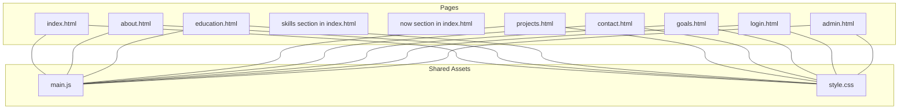
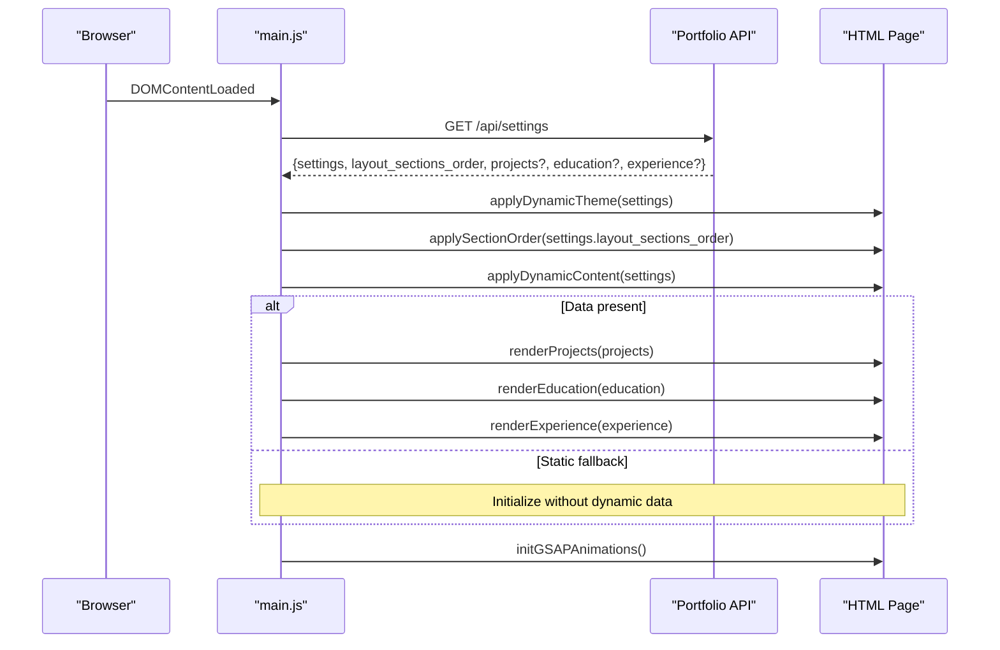
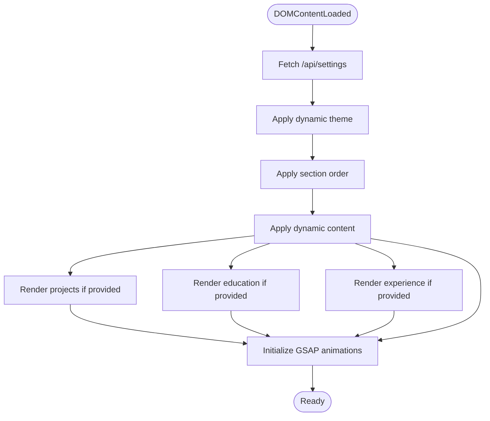
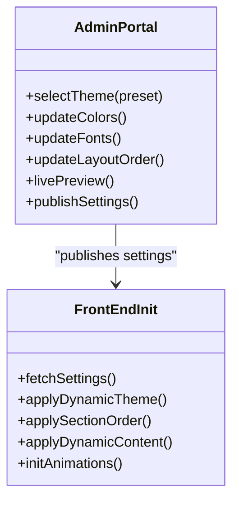
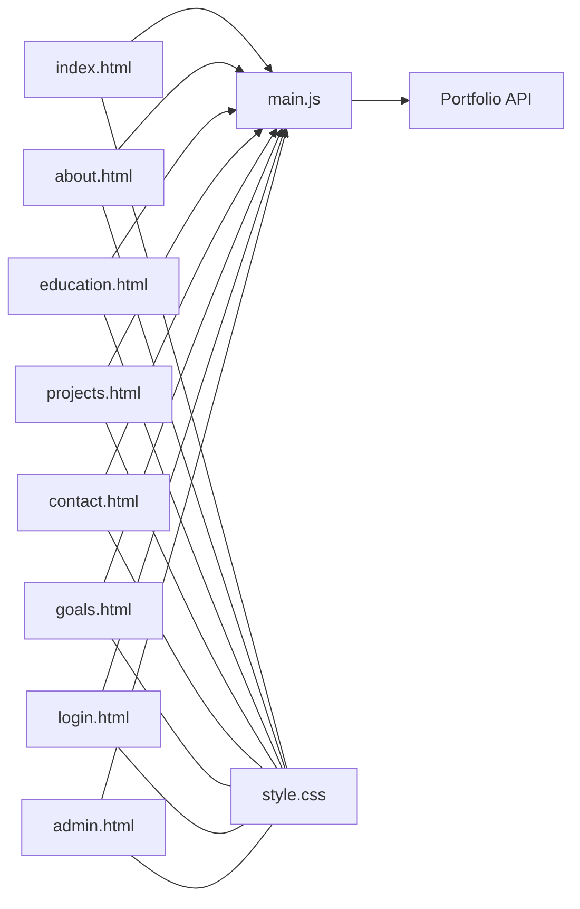

# HTML Structure and Templates

<cite>
**Referenced Files in This Document**
- [index.html](file://index.html)
- [about.html](file://about.html)
- [projects.html](file://projects.html)
- [education.html](file://education.html)
- [goals.html](file://goals.html)
- [contact.html](file://contact.html)
- [login.html](file://login.html)
- [admin.html](file://admin.html)
- [main.js](file://main.js)
- [style.css](file://style.css)
</cite>

## Table of Contents
1. [Introduction](#introduction)
2. [Project Structure](#project-structure)
3. [Core Components](#core-components)
4. [Architecture Overview](#architecture-overview)
5. [Detailed Component Analysis](#detailed-component-analysis)
6. [Dependency Analysis](#dependency-analysis)
7. [Performance Considerations](#performance-considerations)
8. [Troubleshooting Guide](#troubleshooting-guide)
9. [Conclusion](#conclusion)

## Introduction
This document explains the HTML structure and templating patterns used across the portfolio website. It covers semantic HTML5 structure, dynamic content insertion via data attributes and placeholders, responsive design and mobile-first approach, accessibility features, SEO-friendly markup, and modular design patterns that enable dynamic content loading and theme switching.

## Project Structure
The site comprises multiple standalone HTML pages, each with a consistent header, navigation, and footer scaffold. Pages share common styling and script initialization, while individual pages host page-specific sections and dynamic content areas.

**Diagram sources**
- [index.html](file://index.html)
- [about.html](file://about.html)
- [projects.html](file://projects.html)
- [education.html](file://education.html)
- [goals.html](file://goals.html)
- [contact.html](file://contact.html)
- [login.html](file://login.html)
- [admin.html](file://admin.html)
- [main.js](file://main.js)
- [style.css](file://style.css)

**Section sources**
- [index.html](file://index.html)
- [about.html](file://about.html)
- [projects.html](file://projects.html)
- [education.html](file://education.html)
- [goals.html](file://goals.html)
- [contact.html](file://contact.html)
- [login.html](file://login.html)
- [admin.html](file://admin.html)
- [main.js](file://main.js)
- [style.css](file://style.css)

## Core Components
- Semantic HTML5 structure: Each page uses appropriate sectioning elements (header, main, section, footer) to define content hierarchy.
- Dynamic content placeholders: Many sections include elements with IDs designed for dynamic population (e.g., dynamic hero copy, skill lists, project grids).
- Responsive scaffolding: Shared CSS establishes a mobile-first grid and typography system; page-specific sections adapt layout via Tailwind utilities.
- Accessibility: ARIA roles and labels are applied where needed (e.g., aria-label on menu toggle), and semantic elements improve screen reader support.
- SEO: Pages include meta tags for description, keywords, author, and Open Graph properties where applicable.

**Section sources**
- [index.html](file://index.html)
- [about.html](file://about.html)
- [projects.html](file://projects.html)
- [education.html](file://education.html)
- [goals.html](file://goals.html)
- [contact.html](file://contact.html)
- [login.html](file://login.html)
- [admin.html](file://admin.html)
- [main.js](file://main.js)
- [style.css](file://style.css)

## Architecture Overview
The front-end architecture centers on a shared initialization routine that loads dynamic settings and renders content asynchronously. The admin portal exposes controls to modify visual themes, layout order, and content, which are persisted and applied at runtime.

**Diagram sources**
- [main.js](file://main.js)
- [index.html](file://index.html)
- [about.html](file://about.html)
- [projects.html](file://projects.html)
- [education.html](file://education.html)
- [goals.html](file://goals.html)
- [contact.html](file://contact.html)
- [admin.html](file://admin.html)

## Detailed Component Analysis

### Semantic HTML5 Structure and Sections
- Global scaffolding: Each page defines a header with navigation, a main content area, and a footer. These landmarks help assistive technologies navigate the page.
- Page-specific sections: The index page organizes content into distinct semantic sections (hero, skills, education, right now, projects, contact), each identified by an ID for navigation and animations.
- Consistent typography and layout: Shared CSS establishes baseline fonts, spacing, and responsive breakpoints, while page-specific sections use Tailwind utilities for grid and composition.

**Section sources**
- [index.html](file://index.html)
- [about.html](file://about.html)
- [projects.html](file://projects.html)
- [education.html](file://education.html)
- [goals.html](file://goals.html)
- [contact.html](file://contact.html)
- [style.css](file://style.css)

### Template Patterns and Dynamic Content Insertion
- Placeholder IDs: Pages include elements with IDs intended for dynamic updates (e.g., dynamic hero badge/title/description, dynamic skills lists, dynamic project list).
- Admin-driven content: The admin interface allows editing of content blocks (hero copy, skills, goals, contact info), which are then serialized and consumed by the front-end initialization routine.
- Data attribute usage: Some interactive elements rely on data-* attributes for previews and toggles (e.g., project row preview data attributes).
- Initialization flow: On DOMContentLoaded, main.js fetches settings and renders dynamic content, then initializes animations and interactions.

**Diagram sources**
- [main.js](file://main.js)
- [index.html](file://index.html)
- [about.html](file://about.html)
- [projects.html](file://projects.html)
- [education.html](file://education.html)
- [goals.html](file://goals.html)
- [contact.html](file://contact.html)

**Section sources**
- [main.js](file://main.js)
- [index.html](file://index.html)
- [about.html](file://about.html)
- [projects.html](file://projects.html)
- [education.html](file://education.html)
- [goals.html](file://goals.html)
- [contact.html](file://contact.html)
- [admin.html](file://admin.html)

### Responsive Design and Mobile-First Approach
- Viewport configuration: All pages include a viewport meta tag ensuring proper scaling on mobile devices.
- Mobile-first CSS: Shared CSS establishes a mobile baseline with progressively enhanced layouts for larger screens.
- Grid and spacing: Tailwind utilities are used extensively for responsive grids and spacing, enabling flexible layouts across breakpoints.
- Navigation: Mobile navigation toggles are integrated into the header, revealing a slide-in menu on smaller screens.

**Section sources**
- [index.html](file://index.html)
- [about.html](file://about.html)
- [projects.html](file://projects.html)
- [education.html](file://education.html)
- [goals.html](file://goals.html)
- [contact.html](file://contact.html)
- [style.css](file://style.css)

### Accessibility Features
- ARIA labels: The mobile menu toggle includes an aria-label for screen reader compatibility.
- Semantic elements: Proper use of header, nav, main, section, and footer improves comprehension for assistive technologies.
- Focus management: Interactive elements (buttons, forms) maintain visible focus states through shared styles.
- Alt text and labels: Images and icons include descriptive alternatives or associated labels where applicable.

**Section sources**
- [index.html](file://index.html)
- [about.html](file://about.html)
- [projects.html](file://projects.html)
- [education.html](file://education.html)
- [goals.html](file://goals.html)
- [contact.html](file://contact.html)
- [login.html](file://login.html)
- [admin.html](file://admin.html)
- [style.css](file://style.css)

### SEO-Friendly Markup
- Meta tags: Pages include meta description, keywords, author, and Open Graph properties to enhance search visibility and social sharing.
- Structured headings: Clear heading hierarchy (H1–H6) supports both readability and SEO.
- Canonical and structured data: While not implemented in the current code, adding canonical URLs and structured data would further improve SEO.

**Section sources**
- [about.html](file://about.html)
- [projects.html](file://projects.html)
- [education.html](file://education.html)
- [goals.html](file://goals.html)
- [contact.html](file://contact.html)

### Modular Design Patterns and Theme Switching
- Theme presets: The admin interface provides preset themes and live color pickers for primary, secondary, accent, background, and surface colors.
- Typography controls: Separate selectors for display and body fonts allow modular customization.
- Layout ordering: The admin enables reordering of homepage sections via a comma-separated list of section IDs.
- Live preview: Changes are reflected in a preview iframe, allowing immediate validation before publishing.
- Persistence: Settings are applied to the front-end initialization routine, which applies theme rules and content blocks accordingly.

**Diagram sources**
- [admin.html](file://admin.html)
- [main.js](file://main.js)
- [index.html](file://index.html)

**Section sources**
- [admin.html](file://admin.html)
- [main.js](file://main.js)
- [index.html](file://index.html)

## Dependency Analysis
- Initialization dependency: main.js orchestrates dynamic rendering and animations; pages depend on it for runtime content updates.
- Asset dependency: All pages link to shared CSS and scripts, ensuring consistent styling and behavior.
- Admin dependency: The admin portal depends on the Java backend for API endpoints (/api/settings, /api/messages, /api/bookings, /api/login) to manage content and authentication.

**Diagram sources**
- [index.html](file://index.html)
- [about.html](file://about.html)
- [projects.html](file://projects.html)
- [education.html](file://education.html)
- [goals.html](file://goals.html)
- [contact.html](file://contact.html)
- [login.html](file://login.html)
- [admin.html](file://admin.html)
- [main.js](file://main.js)
- [style.css](file://style.css)

**Section sources**
- [main.js](file://main.js)
- [index.html](file://index.html)
- [about.html](file://about.html)
- [projects.html](file://projects.html)
- [education.html](file://education.html)
- [goals.html](file://goals.html)
- [contact.html](file://contact.html)
- [login.html](file://login.html)
- [admin.html](file://admin.html)
- [style.css](file://style.css)

## Performance Considerations
- Deferred scripts: main.js and analytics libraries are deferred to avoid blocking render.
- Lazy loading: Consider lazy-loading images and videos to reduce initial payload.
- Minimized CSS: Keep shared styles scoped and avoid unnecessary specificity to reduce cascade cost.
- Efficient animations: GSAP animations are initialized after content is rendered; ensure heavy animations are throttled on lower-end devices.

## Troubleshooting Guide
- Dynamic content not updating: Verify that /api/settings returns expected keys and that main.js is executing DOMContentLoaded handlers.
- Animations not playing: Confirm that GSAP and ScrollTrigger are loaded before initializing animations; the initialization routine includes a fallback path if libraries are unavailable.
- Admin changes not reflected: Ensure the admin publishes settings and that the preview iframe reloads the site to apply changes.
- Mobile navigation issues: Check that the mobile toggle button exists and that click handlers are attached; ensure body overflow is reset after closing the menu.

**Section sources**
- [main.js](file://main.js)
- [admin.html](file://admin.html)
- [index.html](file://index.html)

## Conclusion
The portfolio employs a robust, modular HTML structure with semantic semantics, responsive design, and accessibility best practices. Dynamic content insertion and theme customization are powered by a centralized initialization routine and an admin-controlled settings pipeline, enabling flexible, future-proof updates without manual code changes.