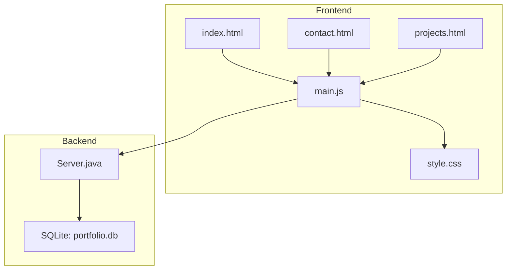
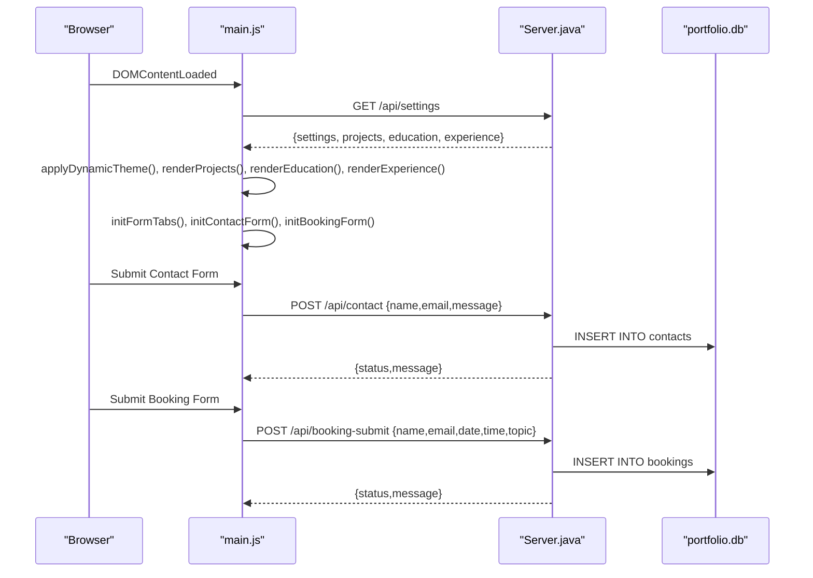
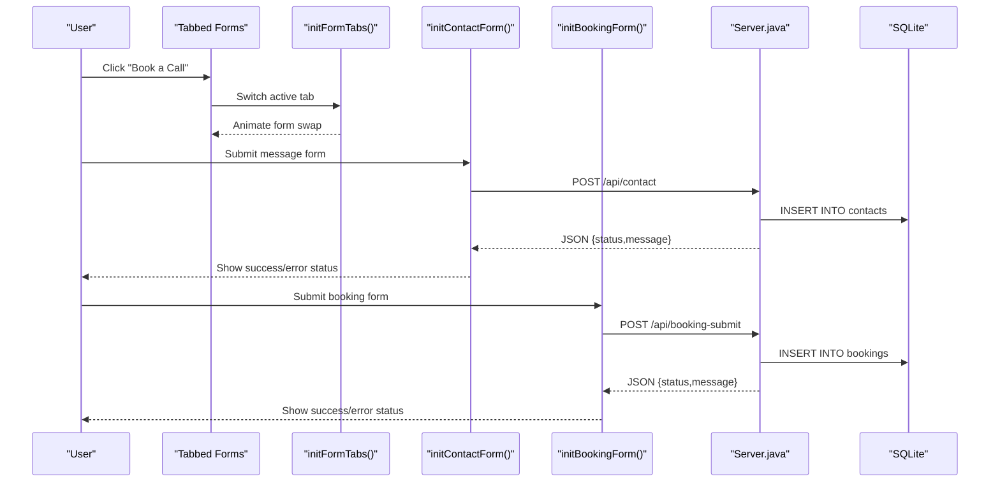
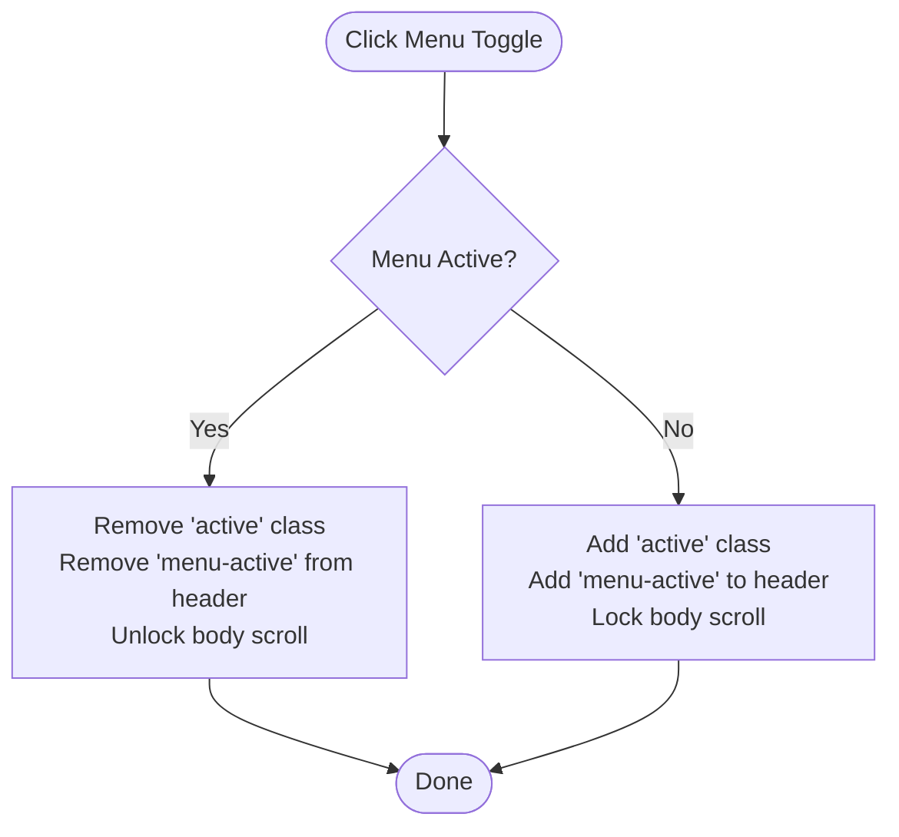
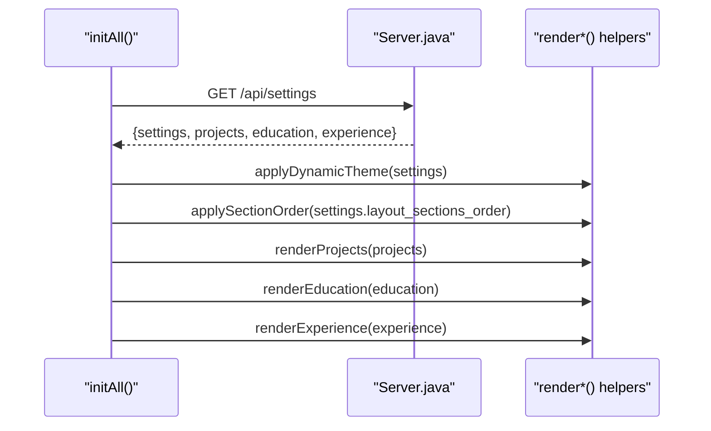
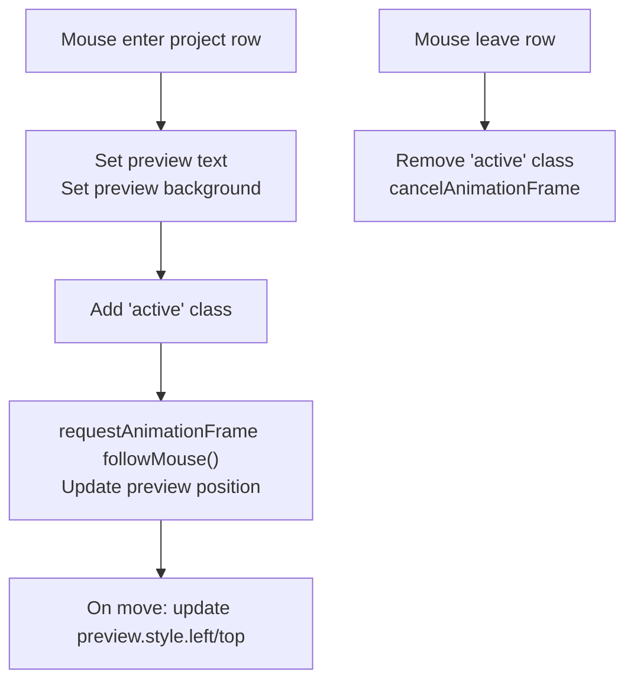
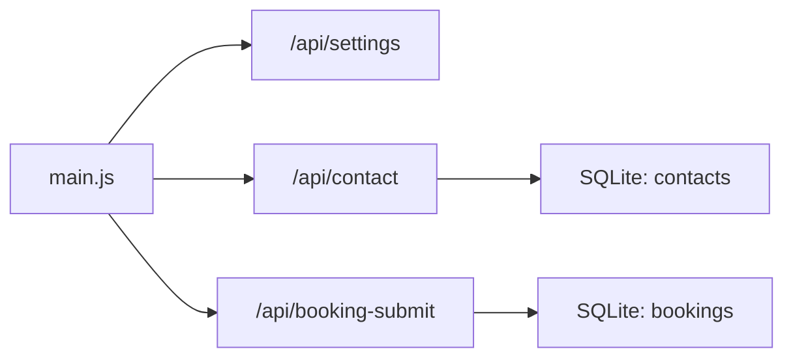

# Interactive Components

<cite>
**Referenced Files in This Document**
- [main.js](file://main.js)
- [contact.html](file://contact.html)
- [projects.html](file://projects.html)
- [index.html](file://index.html)
- [style.css](file://style.css)
- [Server.java](file://Server.java)
</cite>

## Table of Contents
1. [Introduction](#introduction)
2. [Project Structure](#project-structure)
3. [Core Components](#core-components)
4. [Architecture Overview](#architecture-overview)
5. [Detailed Component Analysis](#detailed-component-analysis)
6. [Dependency Analysis](#dependency-analysis)
7. [Performance Considerations](#performance-considerations)
8. [Troubleshooting Guide](#troubleshooting-guide)
9. [Conclusion](#conclusion)

## Introduction
This document focuses on the interactive components of the portfolio website, covering form handling (contact and booking), tabbed interfaces, mobile navigation, dynamic content loading, and project preview systems. It also explains how frontend JavaScript integrates with backend API endpoints and outlines accessibility features and keyboard navigation support.

## Project Structure
The interactive behavior is primarily implemented in a single JavaScript module that initializes loaders, animations, navigation, forms, and dynamic content rendering. HTML pages define the markup and structure for each section, while CSS provides styling and transitions. The backend is a Java HTTP server exposing REST endpoints for forms, admin, and dynamic content.

**Diagram sources**
- [main.js](file://main.js)
- [contact.html](file://contact.html)
- [projects.html](file://projects.html)
- [index.html](file://index.html)
- [style.css](file://style.css)
- [Server.java](file://Server.java)

**Section sources**
- [main.js](file://main.js)
- [contact.html](file://contact.html)
- [projects.html](file://projects.html)
- [index.html](file://index.html)
- [style.css](file://style.css)
- [Server.java](file://Server.java)

## Core Components
- Page loader and initialization sequence
- Mobile navigation toggle and backdrop behavior
- Tabbed interface for switching between contact and booking forms
- Contact form submission with validation and feedback
- Booking form submission with validation and feedback
- Dynamic content rendering from backend settings and database
- Project preview system with mouse tracking and hover effects
- Magnetic navigation and interactive cards
- Scroll-triggered animations via GSAP

**Section sources**
- [main.js](file://main.js)
- [contact.html](file://contact.html)
- [projects.html](file://projects.html)
- [index.html](file://index.html)
- [style.css](file://style.css)

## Architecture Overview
The frontend initializes by fetching settings and dynamic content from the backend, then renders lists and applies themes. Forms submit to backend endpoints, which persist data to SQLite and optionally notify via external services. Animations and interactions are coordinated through centralized initialization functions.

**Diagram sources**
- [main.js](file://main.js)
- [Server.java](file://Server.java)

**Section sources**
- [main.js](file://main.js)
- [Server.java](file://Server.java)

## Detailed Component Analysis

### Form Handling System
- Tabbed interface switching between “Send Message” and “Book a Call”
- Contact form validation and submission to backend endpoint
- Booking form validation and submission to backend endpoint
- Visual feedback during submission (buttons, spinners, status messages)
- Optional external email notifications via third-party service

**Diagram sources**
- [main.js](file://main.js)
- [contact.html](file://contact.html)
- [Server.java](file://Server.java)

Implementation highlights:
- Tab switching uses GSAP for smooth transitions and toggles active classes.
- Forms prevent concurrent submissions and disable controls during requests.
- Status messages are styled and animated for emphasis.
- Submission errors are surfaced with user-friendly messages.

**Section sources**
- [main.js](file://main.js)
- [contact.html](file://contact.html)
- [Server.java](file://Server.java)

### Mobile Navigation Implementation
- Toggle button opens/closes a full-screen menu with animated entrance
- Body scroll locking prevents background movement when menu is open
- Links close the menu and reset scroll lock on click

**Diagram sources**
- [main.js](file://main.js)
- [contact.html](file://contact.html)
- [projects.html](file://projects.html)
- [index.html](file://index.html)

**Section sources**
- [main.js](file://main.js)
- [contact.html](file://contact.html)
- [projects.html](file://projects.html)
- [index.html](file://index.html)

### Dynamic Content Loading Mechanisms
- On initialization, frontend fetches settings and dynamic content from backend
- Applies theme tokens and reorders sections
- Renders education, projects, and experience lists
- Updates contact coordinates and skill tags

**Diagram sources**
- [main.js](file://main.js)
- [Server.java](file://Server.java)

**Section sources**
- [main.js](file://main.js)
- [Server.java](file://Server.java)

### Project Preview System with Mouse Tracking and Hover Effects
- Project rows trigger a floating preview that follows the mouse
- Preview displays project name and colored background
- Uses requestAnimationFrame for smooth tracking
- Removes preview and cancels animation on mouse leave

**Diagram sources**
- [main.js](file://main.js)
- [projects.html](file://projects.html)

**Section sources**
- [main.js](file://main.js)
- [projects.html](file://projects.html)

### Accessibility and Keyboard Navigation Support
- Focusable elements include buttons, links, and form inputs
- Keyboard focus indicators are visible via default browser styles
- Interactive elements expose semantic roles and labels:
  - Buttons and links are native elements with accessible names
  - Form inputs include associated labels
  - Animated elements rely on reduced-motion-safe fallbacks where applicable

Recommendations:
- Ensure skip links for main content
- Add ARIA attributes for live regions (status updates)
- Provide visible focus rings and avoid hiding focus styles
- Test tab order and ensure logical navigation flow across pages

**Section sources**
- [contact.html](file://contact.html)
- [projects.html](file://projects.html)
- [index.html](file://index.html)

## Dependency Analysis
- Frontend depends on:
  - GSAP for scroll-triggered and micro-interactions
  - Local storage of Web3Forms key for optional email notifications
  - Backend endpoints for settings and form submissions
- Backend exposes:
  - Public endpoints for forms
  - Protected endpoints for admin data retrieval and deletion
  - Authentication via cookie-based session

**Diagram sources**
- [main.js](file://main.js)
- [Server.java](file://Server.java)

**Section sources**
- [main.js](file://main.js)
- [Server.java](file://Server.java)

## Performance Considerations
- Use requestAnimationFrame for smooth mouse-following previews
- Debounce or throttle resize handlers for canvas and grids
- Avoid layout thrashing by batching DOM reads/writes
- Lazy-load heavy assets and defer non-critical scripts
- Minimize reflows by animating transform/opacity instead of layout-affecting properties

## Troubleshooting Guide
Common issues and resolutions:
- Forms fail silently
  - Verify backend is running and reachable
  - Check CORS headers and content-type
  - Inspect browser console for network errors
- Animations not playing
  - Confirm GSAP availability and proper initialization
  - Ensure DOM elements exist before applying ScrollTrigger
- Dynamic content not updating
  - Confirm /api/settings returns expected JSON
  - Check for missing keys in settings payload
- Mobile menu not closing
  - Ensure body scroll unlock occurs on link click
  - Verify active class toggling on toggle click

**Section sources**
- [main.js](file://main.js)
- [Server.java](file://Server.java)

## Conclusion
The interactive components combine robust form handling, dynamic content rendering, and polished UI behaviors. The frontend integrates seamlessly with backend endpoints, while maintaining accessibility and performance best practices. Extending the system involves adding new tabs/forms, expanding backend endpoints, and ensuring consistent user feedback and accessibility.