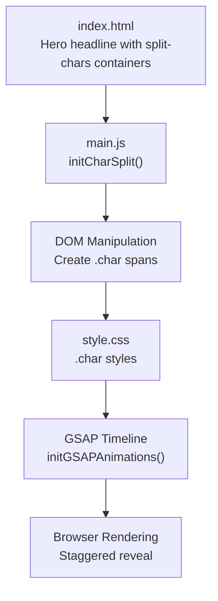
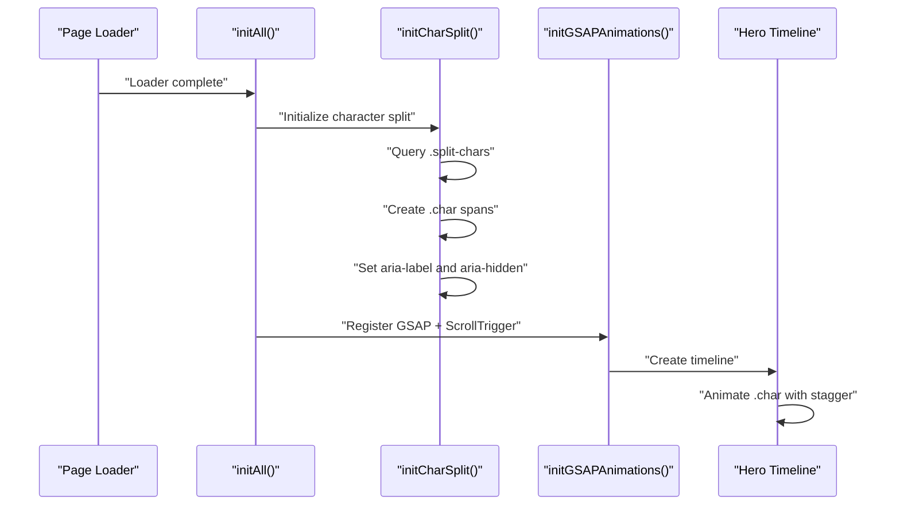
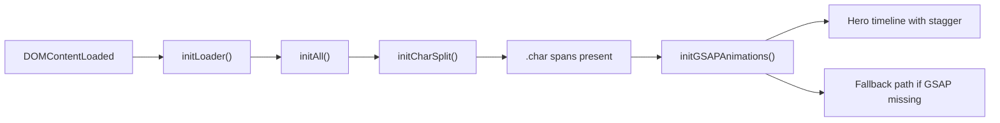

# Character Split Animations

<cite>
**Referenced Files in This Document**
- [main.js](file://main.js)
- [style.css](file://style.css)
- [index.html](file://index.html)
</cite>

## Table of Contents
1. [Introduction](#introduction)
2. [Project Structure](#project-structure)
3. [Core Components](#core-components)
4. [Architecture Overview](#architecture-overview)
5. [Detailed Component Analysis](#detailed-component-analysis)
6. [Dependency Analysis](#dependency-analysis)
7. [Performance Considerations](#performance-considerations)
8. [Troubleshooting Guide](#troubleshooting-guide)
9. [Conclusion](#conclusion)

## Introduction
This document explains the character split animation system used to create a staggered reveal effect for text in the hero headline. It covers how individual characters are extracted and wrapped in spans, how accessibility attributes are applied, and how GSAP timelines orchestrate the animation sequence. It also documents browser compatibility and performance implications when splitting large amounts of text.

## Project Structure
The character split system is implemented in the main script and styled via CSS. The hero headline is processed during initialization after the page loader completes, and the resulting character spans are animated by GSAP.

**Diagram sources**
- [index.html](file://index.html)
- [main.js](file://main.js)
- [style.css](file://style.css)

**Section sources**
- [main.js:328-347](file://main.js#L328-L347)
- [style.css:401-414](file://style.css#L401-L414)
- [index.html](file://index.html)

## Core Components
- Character split initializer: Extracts text from split-chars containers and replaces them with individual character spans.
- Accessibility attributes: Sets aria-label on the container and aria-hidden on each character span.
- GSAP integration: Uses a timeline to animate character transforms with a staggered delay.
- Fallback behavior: If GSAP is unavailable, characters are shown immediately.

Key implementation references:
- Character split and span creation: [main.js:328-347](file://main.js#L328-L347)
- GSAP animation trigger and stagger: [main.js:406-416](file://main.js#L406-L416)
- Fallback immediate reveal: [main.js:626-630](file://main.js#L626-L630)
- Character styles and initial transform: [style.css:409-414](file://style.css#L409-L414)

**Section sources**
- [main.js:328-347](file://main.js#L328-L347)
- [main.js:406-416](file://main.js#L406-L416)
- [main.js:626-630](file://main.js#L626-L630)
- [style.css:409-414](file://style.css#L409-L414)

## Architecture Overview
The system follows a deterministic flow: DOMContentLoaded initializes the loader, which then calls initialization routines. After dynamic content is loaded, the character split runs, and then GSAP animations are registered. The hero timeline animates character transforms with a staggered delay.

**Diagram sources**
- [main.js:9-136](file://main.js#L9-L136)
- [main.js:328-347](file://main.js#L328-L347)
- [main.js:398-416](file://main.js#L398-L416)

## Detailed Component Analysis

### Character Split Mechanism
- Target elements: The initializer looks for elements with the split-chars class inside the hero headline.
- Processing steps:
  - Clear the container’s innerHTML.
  - Set the container’s aria-label to the original text.
  - Iterate over each character in the text and create a span with class char.
  - Preserve spaces by replacing them with a non-breaking space entity.
  - Mark each character span as aria-hidden to prevent redundant announcements.
- Result: Each character becomes a separate DOM node that can be individually animated.

Implementation references:
- Query and loop: [main.js:332-333](file://main.js#L332-L333)
- Clear and aria-label: [main.js:335-337](file://main.js#L335-L337)
- Span creation and attributes: [main.js:339-345](file://main.js#L339-L345)

Accessibility considerations:
- The container exposes the full text via aria-label for assistive technologies.
- Individual character spans are marked aria-hidden to avoid double-articulation.

**Section sources**
- [main.js:328-347](file://main.js#L328-L347)

### DOM Manipulation for Individual Characters
- Each character is wrapped in a span with class char.
- Initial transform and origin are defined in CSS to position characters off-screen and rotated for a reveal effect.
- Non-breaking spaces are used to preserve spacing in the DOM.

CSS references:
- Character styles and initial transform: [style.css:409-414](file://style.css#L409-L414)

**Section sources**
- [main.js:339-345](file://main.js#L339-L345)
- [style.css:409-414](file://style.css#L409-L414)

### Animation Sequencing with GSAP
- Trigger: The hero timeline checks for the presence of .char elements before animating.
- Animation: Translates characters to their final positions and removes rotation.
- Stagger: Characters animate with a small delay between each, creating a wave-like effect.
- Timeline placement: The animation starts slightly after other hero elements.

References:
- Conditional animation: [main.js:406-416](file://main.js#L406-L416)
- Staggered delay: [main.js:412](file://main.js#L412)

**Section sources**
- [main.js:406-416](file://main.js#L406-L416)

### Fallback Behavior Without GSAP
- If GSAP is not available, characters are immediately shown by applying transform and rotation resets.
- A simple IntersectionObserver is used for other reveal effects when GSAP is absent.

References:
- Immediate reveal: [main.js:626-630](file://main.js#L626-L630)
- Fallback observer: [main.js:632-645](file://main.js#L632-L645)

**Section sources**
- [main.js:626-630](file://main.js#L626-L630)
- [main.js:632-645](file://main.js#L632-L645)

### Integration with GSAP Timeline
- The hero timeline is created and configured with easing defaults.
- The character animation is appended to the timeline with a small offset to layer it after other hero elements.
- Scroll-triggered animations coexist with the character split animation.

References:
- Timeline creation and defaults: [main.js:398-402](file://main.js#L398-L402)
- Character animation appended to timeline: [main.js:406-416](file://main.js#L406-L416)

**Section sources**
- [main.js:398-402](file://main.js#L398-L402)
- [main.js:406-416](file://main.js#L406-L416)

### Browser Compatibility and Performance Implications
- DOM manipulation: Creating spans for each character is supported across modern browsers. Older browsers may require polyfills for spread operators or querySelectorAll.
- GSAP availability: The system gracefully falls back to immediate character visibility and basic intersection observers if GSAP is missing.
- Large text performance: Splitting thousands of characters into individual spans can increase DOM size and layout cost. Consider limiting the amount of text or batching updates to reduce layout thrashing.

References:
- Fallback detection: [main.js:138-146](file://main.js#L138-L146)
- Immediate reveal fallback: [main.js:626-630](file://main.js#L626-L630)

**Section sources**
- [main.js:138-146](file://main.js#L138-L146)
- [main.js:626-630](file://main.js#L626-L630)

## Dependency Analysis
The character split system depends on:
- DOM readiness and loader completion to ensure the hero headline exists.
- Presence of split-chars containers within the hero headline.
- GSAP availability for staggered animation; otherwise, a fallback is used.

**Diagram sources**
- [main.js:9-136](file://main.js#L9-L136)
- [main.js:328-347](file://main.js#L328-L347)
- [main.js:398-416](file://main.js#L398-L416)
- [main.js:138-146](file://main.js#L138-L146)

**Section sources**
- [main.js:9-136](file://main.js#L9-L136)
- [main.js:328-347](file://main.js#L328-L347)
- [main.js:398-416](file://main.js#L398-L416)
- [main.js:138-146](file://main.js#L138-L146)

## Performance Considerations
- DOM size: Each character becomes a separate span, increasing DOM nodes. For long headlines, consider truncation or limiting split regions.
- Layout and paint: Transforming many elements can cause layout and paint costs. Prefer transform and opacity for GPU acceleration.
- Staggered delays: Small delays per character are efficient, but excessive delays or very large staggertimes can impact perceived performance.
- Fallback path: Using immediate transforms avoids heavy animation overhead when GSAP is unavailable.

[No sources needed since this section provides general guidance]

## Troubleshooting Guide
Common issues and resolutions:
- Characters not animating:
  - Ensure split-chars containers exist within the hero headline.
  - Verify that GSAP is loaded and initialized before the timeline runs.
  - Confirm that the hero timeline checks for .char elements before animating.
- Incorrect spacing:
  - Spaces are replaced with non-breaking spaces in the split process; verify the original text and CSS line-height/letter-spacing.
- Accessibility concerns:
  - The container’s aria-label reflects the full text; ensure it matches the intended announcement.
  - Individual character spans are aria-hidden to avoid duplication.

References:
- Split logic and aria attributes: [main.js:335-345](file://main.js#L335-L345)
- GSAP fallback: [main.js:626-630](file://main.js#L626-L630)

**Section sources**
- [main.js:335-345](file://main.js#L335-L345)
- [main.js:626-630](file://main.js#L626-L630)

## Conclusion
The character split animation system cleanly separates text into individual spans, applies accessibility attributes, and orchestrates a smooth staggered reveal using GSAP. It gracefully degrades when GSAP is unavailable and can be tuned for performance depending on content length and device capabilities. By understanding the split process, DOM structure, and animation pipeline, developers can adapt and optimize the effect for various use cases.