# GSAP Timelines and ScrollTrigger

<cite>
**Referenced Files in This Document**
- [main.js](file://main.js)
- [index.html](file://index.html)
- [style.css](file://style.css)
</cite>

## Table of Contents
1. [Introduction](#introduction)
2. [Project Structure](#project-structure)
3. [Core Components](#core-components)
4. [Architecture Overview](#architecture-overview)
5. [Detailed Component Analysis](#detailed-component-analysis)
6. [Dependency Analysis](#dependency-analysis)
7. [Performance Considerations](#performance-considerations)
8. [Troubleshooting Guide](#troubleshooting-guide)
9. [Conclusion](#conclusion)

## Introduction
This document explains the GSAP animation system powering the portfolio’s motion design. It covers timeline creation patterns, ScrollTrigger integration, staggered animations, scrubbed parallax effects, and fallback mechanisms. It also documents the hero animation timeline, section reveal animations, and homepage-specific scroll-triggered effects, with concrete references to the implementation in main.js and index.html.

## Project Structure
The animation system is primarily implemented in main.js and integrated into the index.html page. GSAP and ScrollTrigger are loaded via CDN in index.html, while style.css defines motion-related CSS classes and transitions.

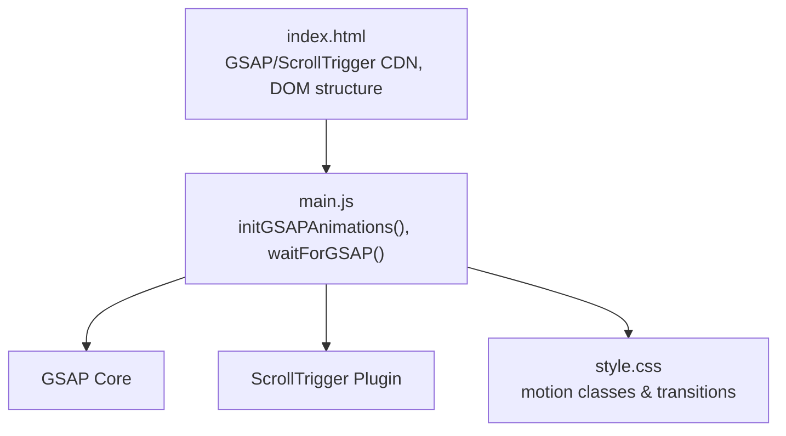

**Diagram sources**
- [index.html:44-47](file://index.html#L44-L47)
- [main.js:398-621](file://main.js#L398-L621)
- [style.css:1-200](file://style.css#L1-L200)

**Section sources**
- [index.html:44-47](file://index.html#L44-L47)
- [main.js:398-621](file://main.js#L398-L621)
- [style.css:1-200](file://style.css#L1-L200)

## Core Components
- Timeline orchestration for hero animations and staggered reveals
- Scroll-triggered animations for section titles, content blocks, and homepage-specific effects
- Scrubbed parallax for hero headline
- Fallback animations when GSAP is unavailable
- Magnetic navigation and profile card 3D effects

Key implementation references:
- Hero timeline and staggered character reveal: [main.js:402-434](file://main.js#L402-L434)
- Section title and label reveals: [main.js:437-458](file://main.js#L437-L458)
- About section reveals: [main.js:461-484](file://main.js#L461-L484)
- Project rows staggered reveal: [main.js:487-499](file://main.js#L487-L499)
- Timeline fill progress: [main.js:502-514](file://main.js#L502-L514)
- Timeline items reveal: [main.js:517-526](file://main.js#L517-L526)
- Testimonials staggered reveal: [main.js:529-534](file://main.js#L529-L534)
- Contact section reveals: [main.js:537-552](file://main.js#L537-L552)
- Scrubbed parallax hero headline: [main.js:555-566](file://main.js#L555-L566)
- Footer social links reveal: [main.js:569-574](file://main.js#L569-L574)
- Homepage-specific ScrollTriggers: [main.js:577-614](file://main.js#L577-L614)
- Fallback animations: [main.js:626-650](file://main.js#L626-L650)

**Section sources**
- [main.js:402-434](file://main.js#L402-L434)
- [main.js:437-458](file://main.js#L437-L458)
- [main.js:461-484](file://main.js#L461-L484)
- [main.js:487-499](file://main.js#L487-L499)
- [main.js:502-514](file://main.js#L502-L514)
- [main.js:517-526](file://main.js#L517-L526)
- [main.js:529-534](file://main.js#L529-L534)
- [main.js:537-552](file://main.js#L537-L552)
- [main.js:555-566](file://main.js#L555-L566)
- [main.js:569-574](file://main.js#L569-L574)
- [main.js:577-614](file://main.js#L577-L614)
- [main.js:626-650](file://main.js#L626-L650)

## Architecture Overview
The animation pipeline initializes after the page loader and dynamic content rendering. It waits for GSAP and ScrollTrigger availability, then registers ScrollTrigger globally and applies timelines and triggers. On the homepage, additional ScrollTriggers coordinate timeline elements and skills glow effects.

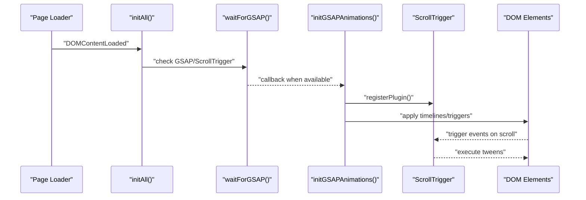

**Diagram sources**
- [main.js:9-136](file://main.js#L9-L136)
- [main.js:138-146](file://main.js#L138-L146)
- [main.js:398-621](file://main.js#L398-L621)

**Section sources**
- [main.js:9-136](file://main.js#L9-L136)
- [main.js:138-146](file://main.js#L138-L146)
- [main.js:398-621](file://main.js#L398-L621)

## Detailed Component Analysis

### Hero Animation Timeline
The hero timeline orchestrates staggered character reveals and complementary header/footer animations. It uses a shared defaults configuration and staggered timing for smooth entrance.

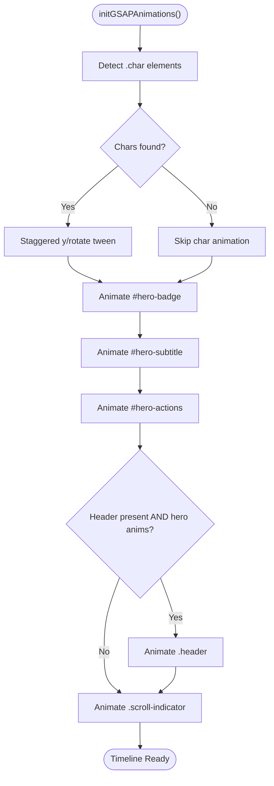

**Diagram sources**
- [main.js:402-434](file://main.js#L402-L434)

**Section sources**
- [main.js:402-434](file://main.js#L402-L434)

### Section Reveal Animations
Section titles and labels use ScrollTrigger to reveal with skew and fade effects. These are applied consistently across the portfolio.

```mermaid
sequenceDiagram
participant ST as "ScrollTrigger"
participant Title as ".section-title"
participant Label as ".section-label"
ST->>Title : "trigger : top 88%"
Title-->>ST : "fade/skew reveal"
ST->>Label : "trigger : top 88%"
Label-->>ST : "slide-in reveal"
```

**Diagram sources**
- [main.js:437-458](file://main.js#L437-L458)

**Section sources**
- [main.js:437-458](file://main.js#L437-L458)

### About Section Reveal
The About section combines staggered paragraph reveals with card and skill tag animations, coordinated by ScrollTrigger.

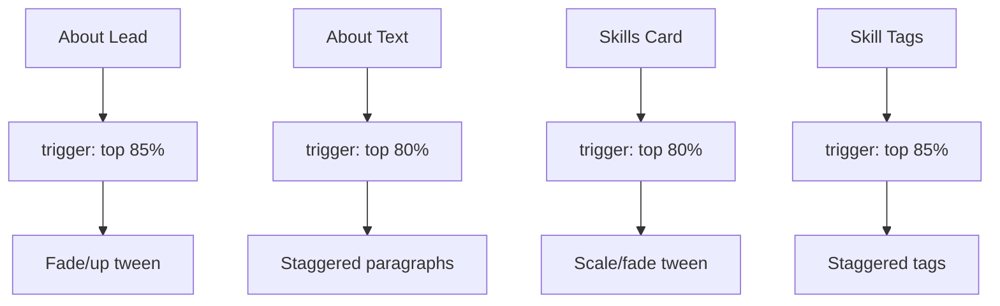

**Diagram sources**
- [main.js:461-484](file://main.js#L461-L484)

**Section sources**
- [main.js:461-484](file://main.js#L461-L484)

### Project Rows Staggered Reveal
Project rows animate in sequence using per-row delays, creating a cascading effect.

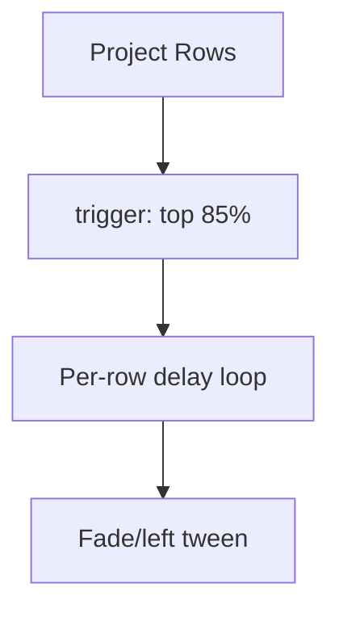

**Diagram sources**
- [main.js:487-499](file://main.js#L487-L499)

**Section sources**
- [main.js:487-499](file://main.js#L487-L499)

### Timeline Fill Progress
The education timeline’s progress bar fills as the user scrolls through the section, using ScrollTrigger with toggleActions to play once.

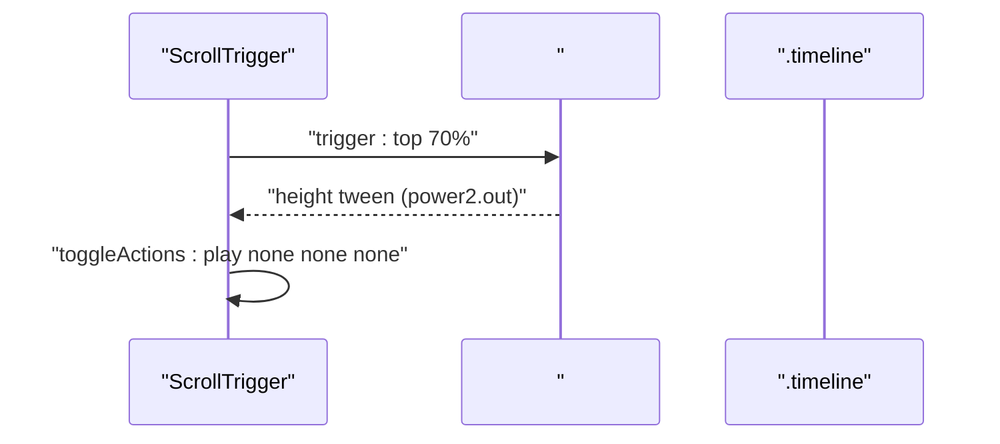

**Diagram sources**
- [main.js:502-514](file://main.js#L502-L514)

**Section sources**
- [main.js:502-514](file://main.js#L502-L514)

### Timeline Items Reveal
Each timeline item slides in with ScrollTrigger.

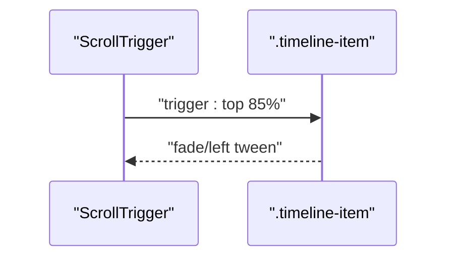

**Diagram sources**
- [main.js:517-526](file://main.js#L517-L526)

**Section sources**
- [main.js:517-526](file://main.js#L517-L526)

### Testimonials Staggered Reveal
Testimonial cards enter in sequence with a staggered delay.

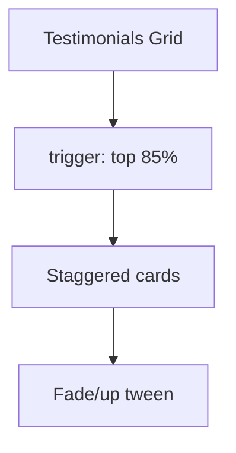

**Diagram sources**
- [main.js:529-534](file://main.js#L529-L534)

**Section sources**
- [main.js:529-534](file://main.js#L529-L534)

### Contact Section Reveal
Contact content uses layered reveals for left-side children and the form box.

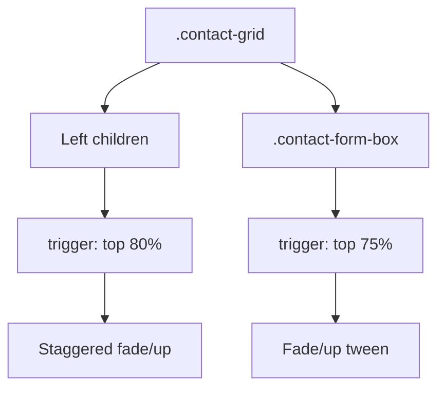

**Diagram sources**
- [main.js:537-552](file://main.js#L537-L552)

**Section sources**
- [main.js:537-552](file://main.js#L537-L552)

### Scrubbed Parallax on Hero Headline
The hero headline moves vertically during scroll using a scrubbed ScrollTrigger.

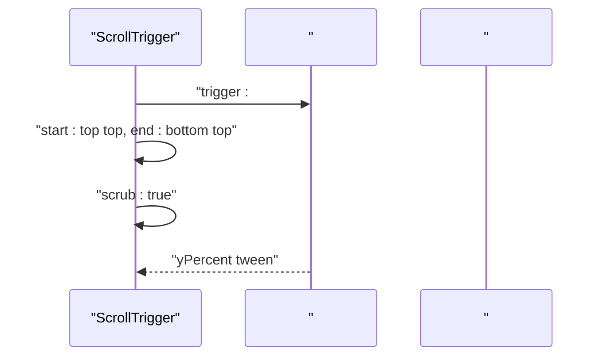

**Diagram sources**
- [main.js:555-566](file://main.js#L555-L566)

**Section sources**
- [main.js:555-566](file://main.js#L555-L566)

### Footer Social Links Reveal
Footer social links animate in with a staggered effect.

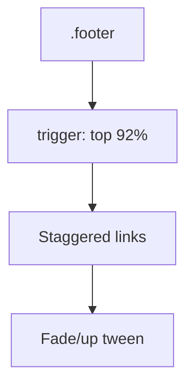

**Diagram sources**
- [main.js:569-574](file://main.js#L569-L574)

**Section sources**
- [main.js:569-574](file://main.js#L569-L574)

### Homepage-Specific ScrollTriggers
On the homepage, additional ScrollTriggers enhance the timeline and skills sections.

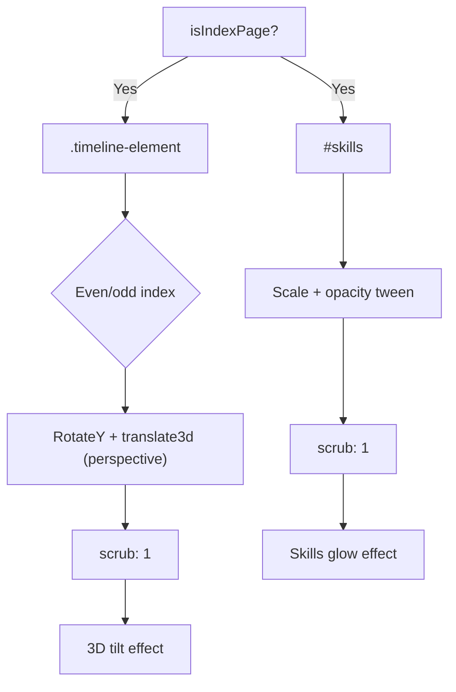

**Diagram sources**
- [main.js:577-614](file://main.js#L577-L614)

**Section sources**
- [main.js:577-614](file://main.js#L577-L614)

### Fallback Animations
When GSAP is unavailable, the system falls back to immediate character transforms and IntersectionObserver-based reveals.

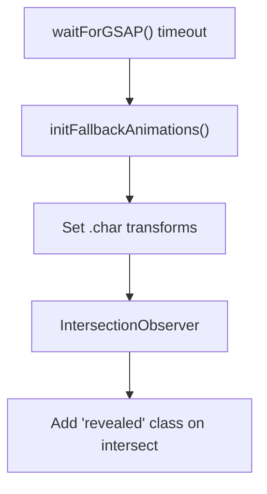

**Diagram sources**
- [main.js:138-146](file://main.js#L138-L146)
- [main.js:626-650](file://main.js#L626-L650)

**Section sources**
- [main.js:138-146](file://main.js#L138-L146)
- [main.js:626-650](file://main.js#L626-L650)

### Magnetic Navigation and Profile Card 3D Effects
These are separate from the main ScrollTrigger-driven animations but complement the motion design.

- Magnetic navigation links: [main.js:966-991](file://main.js#L966-L991)
- Profile card 3D parallax: [main.js:996-1056](file://main.js#L996-L1056)

**Section sources**
- [main.js:966-991](file://main.js#L966-L991)
- [main.js:996-1056](file://main.js#L996-L1056)

## Dependency Analysis
The animation system depends on GSAP and ScrollTrigger being available. The loader ensures the DOM is ready before initializing, and a polling mechanism checks for GSAP presence.

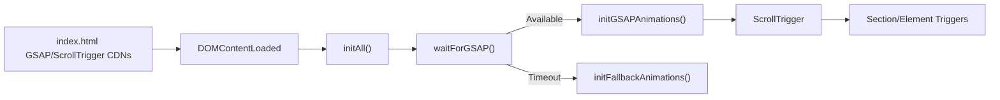

**Diagram sources**
- [index.html:44-47](file://index.html#L44-L47)
- [main.js:9-136](file://main.js#L9-L136)
- [main.js:138-146](file://main.js#L138-L146)
- [main.js:398-621](file://main.js#L398-L621)

**Section sources**
- [index.html:44-47](file://index.html#L44-L47)
- [main.js:9-136](file://main.js#L9-L136)
- [main.js:138-146](file://main.js#L138-L146)
- [main.js:398-621](file://main.js#L398-L621)

## Performance Considerations
- Prefer scrubbed ScrollTrigger for parallax to reduce layout thrashing.
- Use stagger sparingly; tune delay and duration to balance smoothness and CPU usage.
- Avoid animating heavy DOM nodes; prefer transform/opacity where possible.
- Defer non-critical animations until after initial load.
- Keep ScrollTrigger instances minimal; reuse triggers where feasible.

## Troubleshooting Guide
Common issues and resolutions:
- GSAP not loading: The system polls for availability and falls back to basic CSS and IntersectionObserver. Verify CDN URLs and network connectivity.
- ScrollTrigger not firing: Ensure ScrollTrigger is registered and triggers are placed within viewport bounds.
- Staggered animations stuttering: Reduce stagger amount or increase duration; consider disabling on low-power devices.
- Parallax feels sluggish: Increase scrub value or reduce transform intensity.

**Section sources**
- [main.js:138-146](file://main.js#L138-L146)
- [main.js:626-650](file://main.js#L626-L650)

## Conclusion
The portfolio’s animation system leverages GSAP timelines and ScrollTrigger to deliver polished, performant motion. The hero timeline sets the stage, section reveals guide the user’s attention, and homepage-specific effects elevate the storytelling. Fallback mechanisms ensure graceful degradation when dependencies are missing. By tuning durations, delays, and scrubbing, the system balances visual impact with performance across devices.