# JavaScript Animation Engine

<cite>
**Referenced Files in This Document**
- [main.js](file://main.js)
- [style.css](file://style.css)
- [index.html](file://index.html)
- [admin.html](file://admin.html)
- [Server.java](file://Server.java)
</cite>

## Table of Contents
1. [Introduction](#introduction)
2. [Project Structure](#project-structure)
3. [Core Components](#core-components)
4. [Architecture Overview](#architecture-overview)
5. [Detailed Component Analysis](#detailed-component-analysis)
6. [Dependency Analysis](#dependency-analysis)
7. [Performance Considerations](#performance-considerations)
8. [Troubleshooting Guide](#troubleshooting-guide)
9. [Conclusion](#conclusion)

## Introduction
This document explains the JavaScript animation engine powering the Premium Portfolio. It focuses on the GSAP-based animation system, ScrollTrigger integration, and performance optimization techniques. It also documents the character split animation system, blob cursor implementation, and canvas-based particle effects. Concrete examples from main.js illustrate animation initialization, event handling, and fallback mechanisms. The document covers animation dependency management, coordination between systems, magnetic link effects, 3D card parallax, scroll-triggered animations, browser compatibility, and graceful degradation strategies.

## Project Structure
The animation engine is primarily implemented in main.js with supporting styles in style.css and HTML scaffolding in index.html. Dynamic theming and content rendering are coordinated via a settings API handled by Server.java, and the admin interface in admin.html updates live previews.

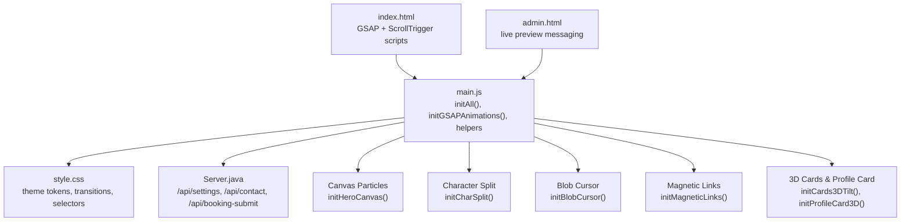

**Diagram sources**
- [index.html:44-49](file://index.html#L44-L49)
- [main.js:66-136](file://main.js#L66-L136)
- [style.css:7-32](file://style.css#L7-L32)
- [admin.html:1529-1544](file://admin.html#L1529-L1544)
- [Server.java:907-923](file://Server.java#L907-L923)

**Section sources**
- [index.html:44-49](file://index.html#L44-L49)
- [main.js:66-136](file://main.js#L66-L136)
- [style.css:7-32](file://style.css#L7-L32)
- [admin.html:1529-1544](file://admin.html#L1529-L1544)
- [Server.java:907-923](file://Server.java#L907-L923)

## Core Components
- GSAP + ScrollTrigger orchestration: Centralized in initGSAPAnimations(), registering plugins and defining timelines and scroll-driven animations.
- Character split animation: initCharSplit() transforms hero text into individual spans for per-character GSAP animations.
- Blob cursor: Smooth, animated cursor with hover/click states and mouse-follow behavior.
- Canvas particle network: initHeroCanvas() renders a particle system with proximity-based connections.
- Magnetic effects: Magnetic navigation links and 3D card tilts with subtle parallax glides.
- Fallback animations: initFallbackAnimations() ensures minimal motion for environments without GSAP.

Key initialization flow:
- Page loader runs first, then initAll() coordinates dynamic content rendering and animation setup.
- waitForGSAP() ensures GSAP and ScrollTrigger are available before initializing animations.

**Section sources**
- [main.js:66-146](file://main.js#L66-L146)
- [main.js:328-347](file://main.js#L328-L347)
- [main.js:151-185](file://main.js#L151-L185)
- [main.js:190-287](file://main.js#L190-L287)
- [main.js:966-991](file://main.js#L966-L991)
- [main.js:1061-1097](file://main.js#L1061-L1097)
- [main.js:626-650](file://main.js#L626-L650)

## Architecture Overview
The animation engine integrates multiple systems:
- GSAP timelines and ScrollTrigger define scroll-linked animations and hero reveals.
- Canvas renders interactive particle networks in the hero area.
- CSS variables and dynamic theme injection adapt visuals at runtime.
- Event-driven handlers manage mouse interactions for magnetic effects and cursor behavior.
- Fallback mechanisms ensure accessibility and performance on constrained devices.

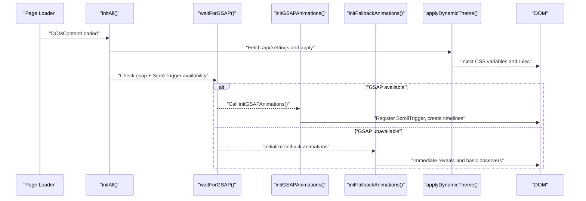

**Diagram sources**
- [main.js:9-136](file://main.js#L9-L136)
- [main.js:138-146](file://main.js#L138-L146)
- [main.js:398-621](file://main.js#L398-L621)
- [main.js:626-650](file://main.js#L626-L650)
- [main.js:1102-1164](file://main.js#L1102-L1164)

## Detailed Component Analysis

### GSAP-Based Animation System
- Timeline creation: A central hero timeline orchestrates entrance animations for hero elements. Staggered character animations are applied to split characters.
- ScrollTrigger integration: Numerous scroll-driven animations target section titles, labels, content blocks, testimonials, and contact areas. Parallax is applied to hero headline text during viewport movement.
- Homepage-specific effects: 3D perspective tilts for timeline cards and a paper overlay glow scale effect are triggered while scrolling.
- Magnetic and 3D interactions: Magnetic link behavior and 3D card tilts are implemented alongside GSAP for smooth transitions.

```mermaid
flowchart TD
Start(["initGSAPAnimations"]) --> Register["Register ScrollTrigger plugin"]
Register --> HeroTL["Create hero timeline with defaults"]
HeroTL --> Chars["Animate split characters with stagger"]
HeroTL --> Badges["Animate badges, subtitles, actions"]
HeroTL --> Header["Reveal header after hero animations"]
HeroTL --> ScrollInd["Reveal scroll indicator"]
Start --> Sections["Attach ScrollTrigger to section titles/labels"]
Start --> About["About lead and skills cards"]
Start --> Projects["Project rows with staggered delays"]
Start --> TimelineFill["Timeline fill height animation"]
Start --> TimelineItems["Timeline items reveal"]
Start --> Testimonials["Testimonial cards grid"]
Start --> Contact["Contact big text and form area"]
Start --> Parallax["Hero headline parallax (scrubbed)"]
Start --> FooterSocials["Footer social links"]
Start --> Homepage["Homepage-specific effects"]
Homepage --> Cards3DTilt["3D perspective tilts for timeline cards"]
Homepage --> PaperGlow["Paper overlay scale/opacity glow"]
Start --> Magnetic["Magnetic navigation links"]
Start --> Cards3D["Profile card 3D and card-3d-tilt"]
```

**Diagram sources**
- [main.js:398-621](file://main.js#L398-L621)

**Section sources**
- [main.js:398-621](file://main.js#L398-L621)

### Character Split Animation System
- Purpose: Enable per-character animations for dramatic hero text reveals.
- Implementation: initCharSplit() replaces hero text with spans for each character, preserving spaces and setting aria attributes for accessibility.
- GSAP integration: The hero timeline applies y/rotate transforms with staggered timing to create cascading reveals.

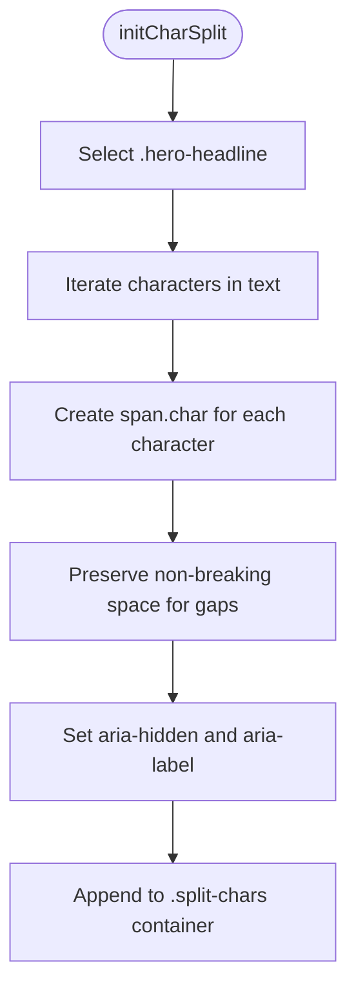

**Diagram sources**
- [main.js:328-347](file://main.js#L328-L347)

**Section sources**
- [main.js:328-347](file://main.js#L328-L347)

### Blob Cursor Implementation
- Smooth following: Mousemove updates target position; requestAnimationFrame interpolates blob toward the target using a low-pass filter.
- Interaction states: Adds/removes hovering/clicking classes on mouseenter/mousedown and mouseleave/mouseup.
- Element targeting: Applies hover classes to links, buttons, cards, and tags.
- Opacity handling: Adjusts visibility on document mouseenter/mouseleave.

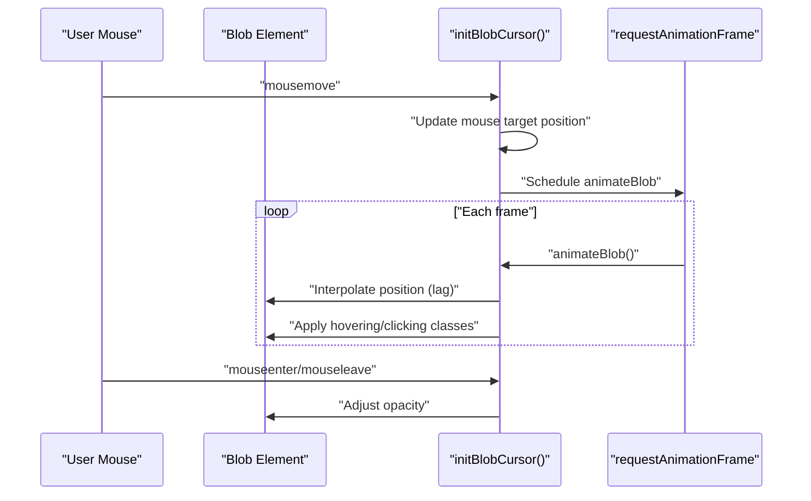

**Diagram sources**
- [main.js:151-185](file://main.js#L151-L185)

**Section sources**
- [main.js:151-185](file://main.js#L151-L185)
- [style.css:132-156](file://style.css#L132-L156)

### Canvas-Based Particle Effects
- Canvas setup: Initializes 2D context, sets dimensions, and spawns particles based on viewport size.
- Physics: Particles bounce off edges and are repelled by mouse proximity with force falloff.
- Connections: Draws translucent lines between nearby particles based on distance thresholds.
- Visual grid: Renders a subtle dotted grid for depth cues.

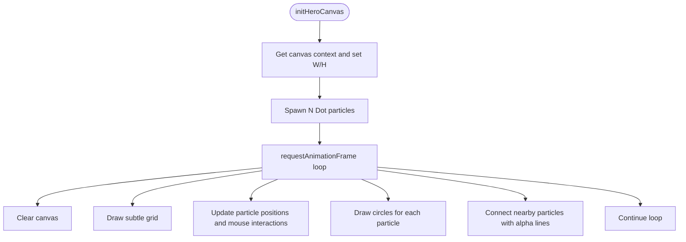

**Diagram sources**
- [main.js:190-287](file://main.js#L190-L287)

**Section sources**
- [main.js:190-287](file://main.js#L190-L287)

### Magnetic Link Effects
- Behavior: On mousemove, calculates relative position within the element bounds and applies GSAP tweens with power-based easing. On mouseleave, tweens back to neutral.
- Scope: Targets navigation items, logo link, and social links.

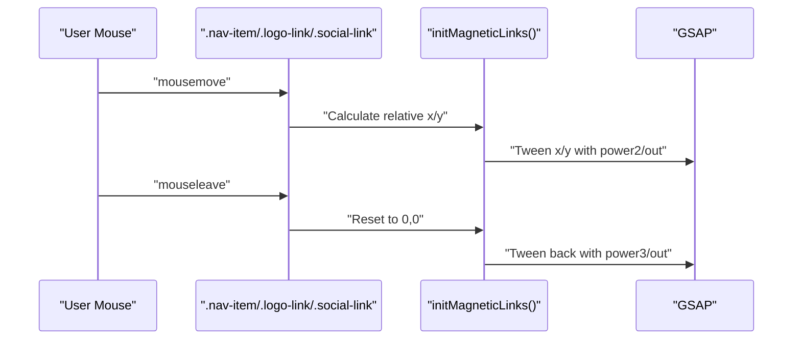

**Diagram sources**
- [main.js:966-991](file://main.js#L966-L991)

**Section sources**
- [main.js:966-991](file://main.js#L966-L991)

### 3D Card Parallax and Magnetic Interactions
- Profile card 3D: Two modes—modern portrait card with pure CSS transforms and legacy card with inner/glow layers animated via GSAP. Mousemove computes tilt angles and translates inner layers slightly for a magnetic effect; leave resets transforms.
- Card 3D tilt: Applies to generic .card-3d-tilt elements with similar calculations and easing.

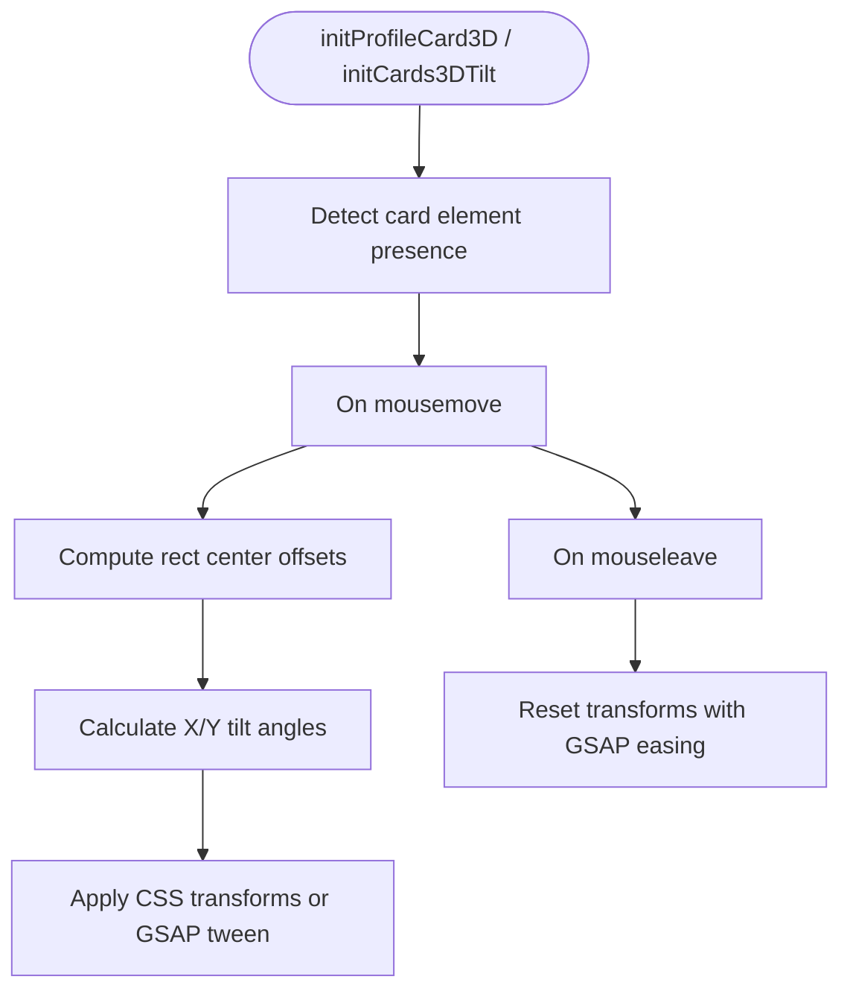

**Diagram sources**
- [main.js:996-1056](file://main.js#L996-L1056)
- [main.js:1061-1097](file://main.js#L1061-L1097)

**Section sources**
- [main.js:996-1056](file://main.js#L996-L1056)
- [main.js:1061-1097](file://main.js#L1061-L1097)

### Scroll-Triggered Animations
- Section reveals: Titles and labels fade in with skew and y transforms when scrolled into view.
- Content blocks: About lead, skill tags, testimonials, and project rows animate in with staggered delays.
- Timeline: Fill height animates once; items slide in progressively.
- Footer: Social links cascade in at page end.

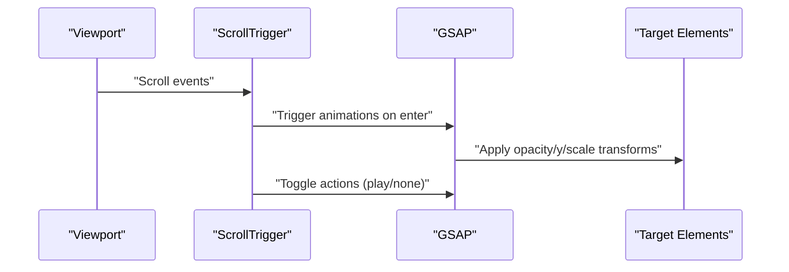

**Diagram sources**
- [main.js:437-574](file://main.js#L437-L574)

**Section sources**
- [main.js:437-574](file://main.js#L437-L574)

### Animation Initialization, Event Handling, and Fallback Mechanisms
- Initialization: initAll() coordinates dynamic content rendering, then waits for GSAP availability before calling initGSAPAnimations().
- Fallback: If GSAP is unavailable after retries, initFallbackAnimations() immediately reveals characters and uses IntersectionObserver for basic reveals.
- Form transitions: Tab switching uses GSAP killTweens and smooth transitions for contact/booking forms.

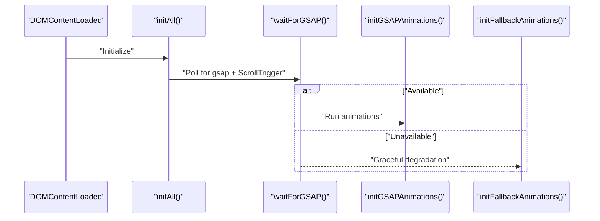

**Diagram sources**
- [main.js:9-136](file://main.js#L9-L136)
- [main.js:138-146](file://main.js#L138-L146)
- [main.js:626-650](file://main.js#L626-L650)

**Section sources**
- [main.js:9-136](file://main.js#L9-L136)
- [main.js:138-146](file://main.js#L138-L146)
- [main.js:626-650](file://main.js#L626-L650)

## Dependency Analysis
- Runtime dependencies: index.html loads GSAP and ScrollTrigger scripts before main.js.
- Theming: applyDynamicTheme() injects CSS variables and rules into the head, affecting all animations’ color and typography.
- Live preview: admin.html sends LIVE_THEME_UPDATE messages to the iframe, which main.js listens to and re-applies.
- Backend: Server.java serves /api/settings and handles contact/booking submissions, enabling dynamic content and form feedback animations.

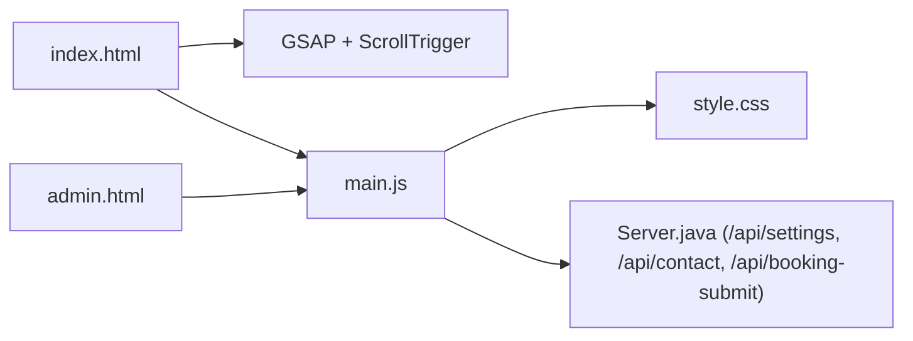

**Diagram sources**
- [index.html:44-49](file://index.html#L44-L49)
- [main.js:1102-1164](file://main.js#L1102-L1164)
- [admin.html:1529-1544](file://admin.html#L1529-L1544)
- [Server.java:907-923](file://Server.java#L907-L923)

**Section sources**
- [index.html:44-49](file://index.html#L44-L49)
- [main.js:1102-1164](file://main.js#L1102-L1164)
- [admin.html:1529-1544](file://admin.html#L1529-L1544)
- [Server.java:907-923](file://Server.java#L907-L923)

## Performance Considerations
- Prefer ScrollTrigger scrubbed animations for heavy transforms to reduce per-frame work.
- Use requestAnimationFrame loops sparingly; leverage GSAP’s internal optimization for repeated updates.
- Limit particle counts on small screens (N scaling based on viewport).
- Avoid layout thrashing by batching DOM reads/writes and using transform/opacity where possible.
- Defer non-critical animations until after initial load and ensure fallbacks for constrained environments.

## Troubleshooting Guide
- GSAP not loading: waitForGSAP() falls back to initFallbackAnimations() after a short timeout. Verify script inclusion in index.html.
- ScrollTrigger not working: Ensure registerPlugin is called before creating ScrollTrigger instances.
- Blob cursor missing: Confirm #blob exists and initBlobCursor() runs on DOMContentLoaded.
- Canvas not rendering: Check canvas element presence and that initHeroCanvas() executes after DOM ready.
- Magnetic effects not smooth: Reduce tween durations or easing strength; verify mousemove handlers are attached.
- Dynamic theme not applying: Confirm LIVE_THEME_UPDATE message is sent and main.js receives it; ensure style injection targets exist.

**Section sources**
- [main.js:138-146](file://main.js#L138-L146)
- [main.js:626-650](file://main.js#L626-L650)
- [index.html:44-49](file://index.html#L44-L49)
- [admin.html:1529-1544](file://admin.html#L1529-L1544)

## Conclusion
The animation engine combines GSAP timelines, ScrollTrigger-driven reveals, and interactive effects to deliver a polished, motion-first experience. Robust fallbacks ensure graceful degradation, while dynamic theming and live preview capabilities enable rapid iteration. By coordinating initialization, managing dependencies, and optimizing performance, the system balances visual richness with accessibility and responsiveness.