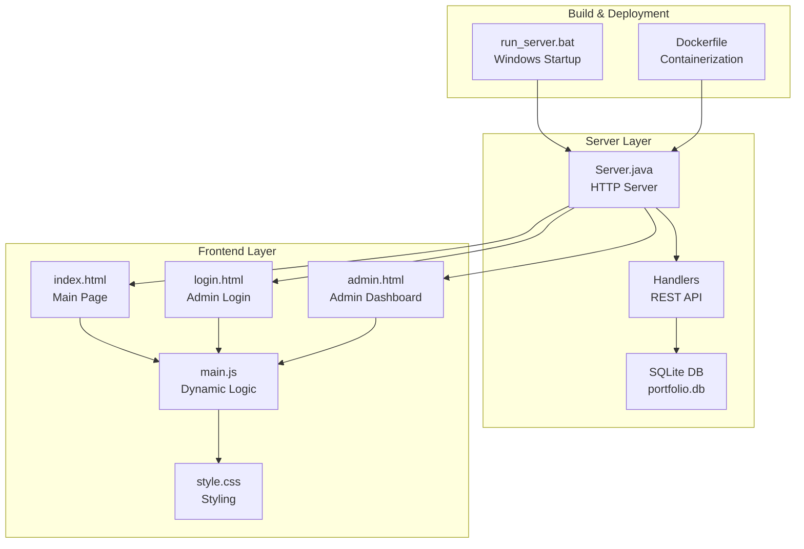
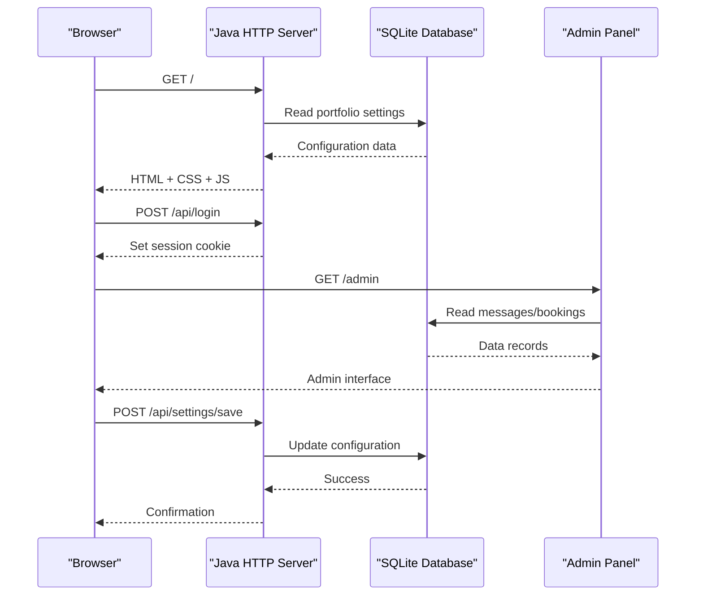
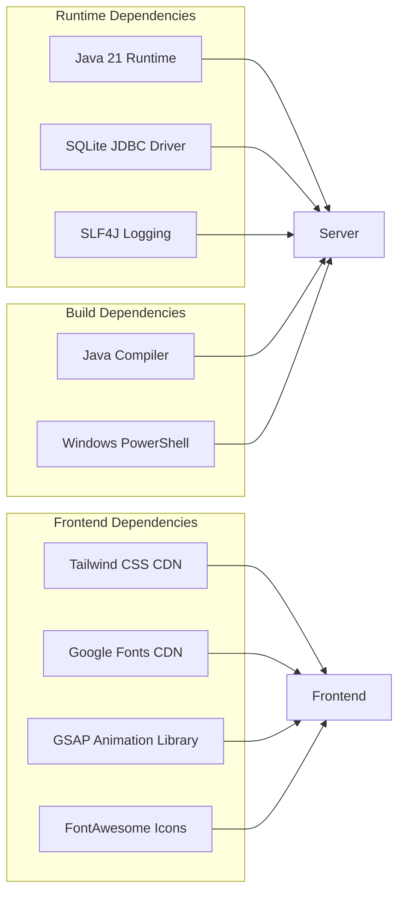

# Getting Started

<cite>
**Referenced Files in This Document**
- [Server.java](file://Server.java)
- [run_server.bat](file://run_server.bat)
- [Dockerfile](file://Dockerfile)
- [main.js](file://main.js)
- [index.html](file://index.html)
- [style.css](file://style.css)
- [login.html](file://login.html)
- [admin.html](file://admin.html)
- [design.md](file://design.md)
</cite>

## Table of Contents
1. [Introduction](#introduction)
2. [Prerequisites](#prerequisites)
3. [Installation and Setup](#installation-and-setup)
4. [First Run and Local Access](#first-run-and-local-access)
5. [Development Environment Setup](#development-environment-setup)
6. [Project Structure Overview](#project-structure-overview)
7. [Core Components](#core-components)
8. [Architecture Overview](#architecture-overview)
9. [Dependency Analysis](#dependency-analysis)
10. [Performance Considerations](#performance-considerations)
11. [Troubleshooting Guide](#troubleshooting-guide)
12. [Conclusion](#conclusion)

## Introduction
Premium Portfolio is a modern, database-backed portfolio website featuring a Java-based HTTP server, SQLite database, and a dynamic frontend. It includes a protected admin panel for managing content, themes, and configuration without touching code. The application demonstrates full-stack engineering with a focus on performance, security, and developer experience.

## Prerequisites
Before installing Premium Portfolio, ensure your system meets these requirements:

- **Java JDK 21**: Required for compiling and running the Java HTTP server. The application targets Java 21 and uses the built-in com.sun.net.httpserver package.
- **Windows Environment**: The project includes Windows-specific batch scripts for dependency management and server startup.
- **Internet Access**: Required for downloading dependencies (SQLite JDBC driver) and loading frontend resources from CDNs.
- **Basic Understanding**: Familiarity with command-line interfaces and HTTP servers will help during setup and troubleshooting.

**Section sources**
- [Server.java:18-32](file://Server.java#L18-L32)
- [Dockerfile:1](file://Dockerfile#L1)

## Installation and Setup
Follow these steps to install and set up Premium Portfolio:

### Step 1: Verify Java JDK 21
Ensure Java 21 is installed and accessible in your PATH:
- Open Command Prompt and run: `java -version`
- Expected output should indicate Java 21.x.x
- If missing, download and install OpenJDK 21 from the official Oracle or Eclipse Temurin site

### Step 2: Prepare Dependencies
The project automatically manages dependencies using the Windows batch script:
- Navigate to the project root directory
- Run: `run_server.bat`
- The script will:
  - Create a `lib` directory if it doesn't exist
  - Download SQLite JDBC driver (v3.45.1.0) and SLF4J libraries
  - Verify dependencies are present
  - Compile the Java server
  - Start the server on port 3000

### Step 3: Database Initialization
On first run, the server automatically initializes the SQLite database:
- Creates tables for contacts, bookings, portfolio settings, projects, education, and experience
- Seeds default data for demonstration
- Applies schema migrations for existing databases

### Step 4: Verify Installation
Check the console output for success indicators:
- "Connected to SQL database successfully"
- "Web Server running at: http://localhost:3000"
- "Press Ctrl+C to stop the server"

**Section sources**
- [run_server.bat:1-62](file://run_server.bat#L1-L62)
- [Server.java:85-337](file://Server.java#L85-L337)

## First Run and Local Access
After successful installation, access the portfolio locally:

### Access the Public Portfolio
- Open your browser and navigate to: http://localhost:3000
- The homepage loads with dynamic content fetched from the database
- Features include animated sections, interactive elements, and responsive design

### Access the Admin Panel
- Navigate to: http://localhost:3000/admin
- You will be prompted to log in with credentials:
  - Username: aditya
  - Password: soni123
- Upon successful authentication, you gain access to:
  - Database dashboard for managing messages and bookings
  - Visual customization controls for themes, colors, fonts, and animations
  - Content management for projects, education, and experience sections

### Initial Configuration
The admin panel provides immediate customization options:
- Theme presets (Dark, Light, Emerald Cyber, Sunset Gold)
- Color pickers for primary, secondary, accent, background, and surface colors
- Font selection for display and body text
- Animation toggles and layout controls
- Real-time preview of changes

**Section sources**
- [login.html:146-171](file://login.html#L146-L171)
- [admin.html:717-800](file://admin.html#L717-L800)

## Development Environment Setup
Configure your development environment for optimal productivity:

### Recommended IDE
- **IntelliJ IDEA Community Edition** (free) or **Eclipse IDE**
- Enable automatic formatting and code inspections
- Configure Java 21 SDK in project settings

### Debugging Tips
- **Server-side debugging**: Use IDE breakpoints in Server.java handlers
- **Client-side debugging**: Inspect network requests in browser DevTools
- **Database inspection**: Use SQLite Browser to view portfolio.db contents
- **Logging**: Monitor console output for SQL operations and error messages

### Development Workflow
1. Start the server using `run_server.bat`
2. Make changes to HTML/CSS/JavaScript files
3. Refresh the browser to see changes
4. Use the admin panel for content and theme modifications
5. Stop the server with Ctrl+C when finished

**Section sources**
- [Server.java:34-83](file://Server.java#L34-L83)
- [main.js:1-136](file://main.js#L1-L136)

## Project Structure Overview
Premium Portfolio follows a clean separation of concerns:

**Diagram sources**
- [Server.java:18-83](file://Server.java#L18-L83)
- [index.html:1-50](file://index.html#L1-L50)
- [login.html:1-50](file://login.html#L1-L50)
- [admin.html:1-50](file://admin.html#L1-L50)
- [run_server.bat:1-62](file://run_server.bat#L1-L62)
- [Dockerfile:1-18](file://Dockerfile#L1-L18)

## Core Components
The application consists of several interconnected components:

### Java HTTP Server
- Built-in com.sun.net.httpserver package
- Handles static file serving and REST API endpoints
- Manages authentication and session cookies
- Provides CORS support for cross-origin requests

### Database Layer
- SQLite database with automatic schema management
- Tables for contacts, bookings, portfolio settings, projects, education, and experience
- Automatic seeding of default content
- Schema migration support for backward compatibility

### Frontend Architecture
- Modern HTML5/CSS3/JavaScript stack
- Dynamic content loading via fetch API
- GSAP animations and interactive elements
- Responsive design with Tailwind CSS utilities
- Real-time theme and content customization

### Admin Panel
- Protected dashboard with authentication
- Visual customization controls
- Database management interface
- Live preview capabilities
- Export/import functionality

**Section sources**
- [Server.java:494-800](file://Server.java#L494-L800)
- [main.js:66-136](file://main.js#L66-L136)
- [admin.html:608-716](file://admin.html#L608-L716)

## Architecture Overview
The system follows a client-server architecture with clear separation between presentation and data layers:

**Diagram sources**
- [Server.java:354-396](file://Server.java#L354-L396)
- [login.html:146-171](file://login.html#L146-L171)
- [admin.html:619-622](file://admin.html#L619-L622)

## Dependency Analysis
The project maintains minimal external dependencies for simplicity and reliability:

**Diagram sources**
- [run_server.bat:14-33](file://run_server.bat#L14-L33)
- [index.html:9-47](file://index.html#L9-L47)
- [Dockerfile:11](file://Dockerfile#L11)

**Section sources**
- [run_server.bat:14-33](file://run_server.bat#L14-L33)
- [Dockerfile:11](file://Dockerfile#L11)

## Performance Considerations
Premium Portfolio is optimized for performance and responsiveness:

- **Static Asset Serving**: Efficient delivery of HTML, CSS, and JavaScript files
- **Database Optimization**: SQLite provides excellent performance for small to medium workloads
- **Client-Side Caching**: Browser caching of static resources reduces server load
- **Minimal Dependencies**: Few external libraries reduce bundle size and potential conflicts
- **Responsive Design**: Mobile-first approach ensures smooth performance across devices

## Troubleshooting Guide
Common issues and their solutions:

### Server Fails to Start
**Symptoms**: Error messages about missing dependencies or compilation failures
**Solutions**:
- Verify Java 21 is installed and in PATH
- Check antivirus/firewall blocking the process
- Ensure sufficient disk space and permissions
- Review console error messages for specific details

### Database Connection Issues
**Symptoms**: "Database initialization error" or "SQLite JDBC Driver not found"
**Solutions**:
- Re-run `run_server.bat` to redownload dependencies
- Check firewall settings allowing file downloads
- Verify disk write permissions for the project directory
- Clear temporary files and retry

### Port Conflicts
**Symptoms**: "Failed to start server: Address already in use"
**Solutions**:
- Change the PORT environment variable
- Close applications using port 3000
- Restart your system to release the port

### Admin Authentication Problems
**Symptoms**: Login fails despite correct credentials
**Solutions**:
- Verify credentials match exactly: username "aditya", password "soni123"
- Check browser cookies and localStorage
- Clear browser cache and cookies
- Ensure HTTPS is not blocking cookies

### Frontend Loading Issues
**Symptoms**: Blank pages or missing animations
**Solutions**:
- Check browser console for CDN errors
- Verify internet connectivity
- Try incognito mode to bypass cache
- Check browser extensions blocking resources

**Section sources**
- [Server.java:79-82](file://Server.java#L79-L82)
- [run_server.bat:35-39](file://run_server.bat#L35-L39)
- [login.html:164-169](file://login.html#L164-L169)

## Conclusion
Premium Portfolio provides a robust foundation for a modern, database-backed portfolio website. Its architecture balances simplicity with powerful features, offering both technical depth for developers and intuitive controls for content management. The combination of Java-based backend, SQLite database, and modern frontend technologies creates a reliable platform that's easy to understand, modify, and extend.

Key benefits include:
- Zero-code deployment with automatic dependency management
- Secure admin panel with authentication and session management
- Real-time customization capabilities without rebuilding
- Lightweight architecture suitable for various hosting environments
- Comprehensive documentation and troubleshooting guidance

The project serves as an excellent example of full-stack development while maintaining accessibility for beginners and extensibility for advanced users.