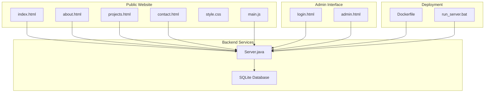
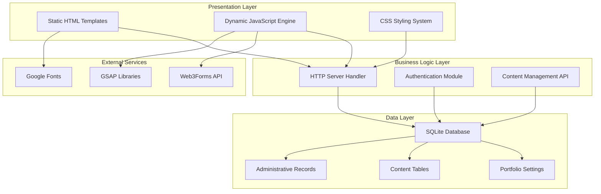
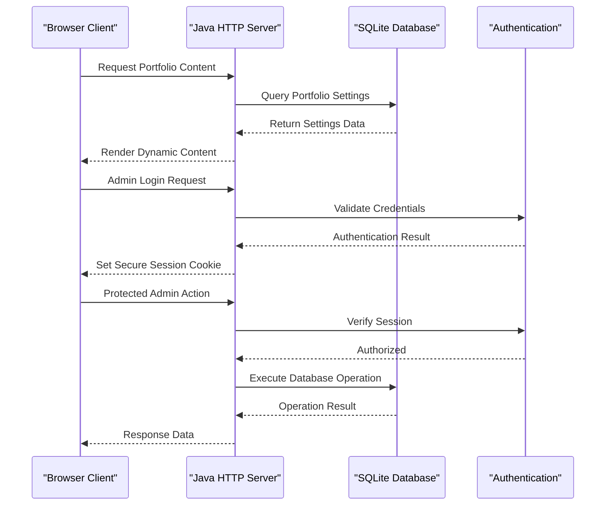
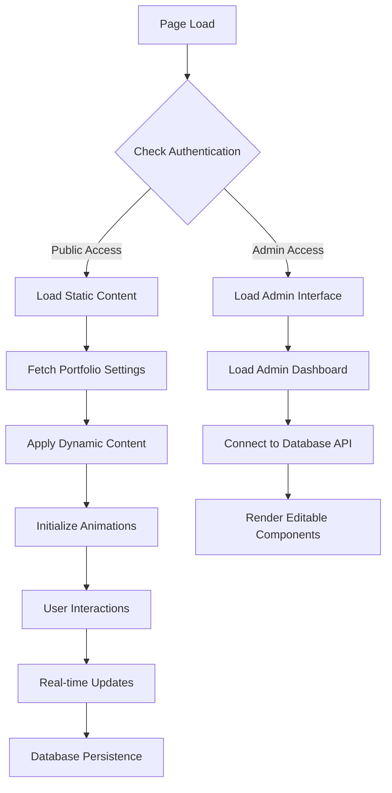
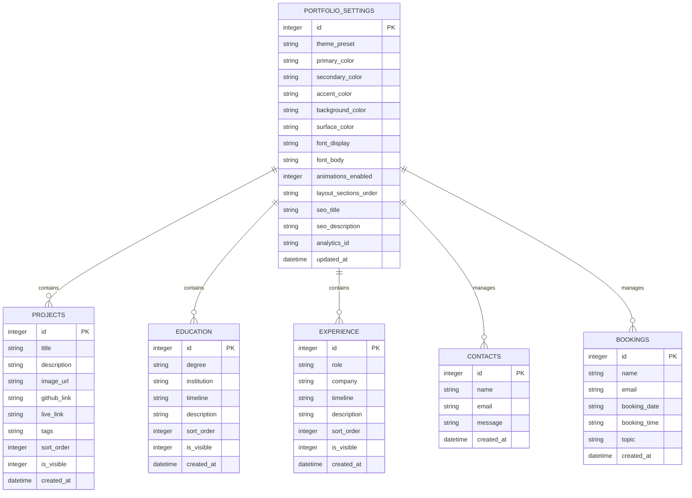
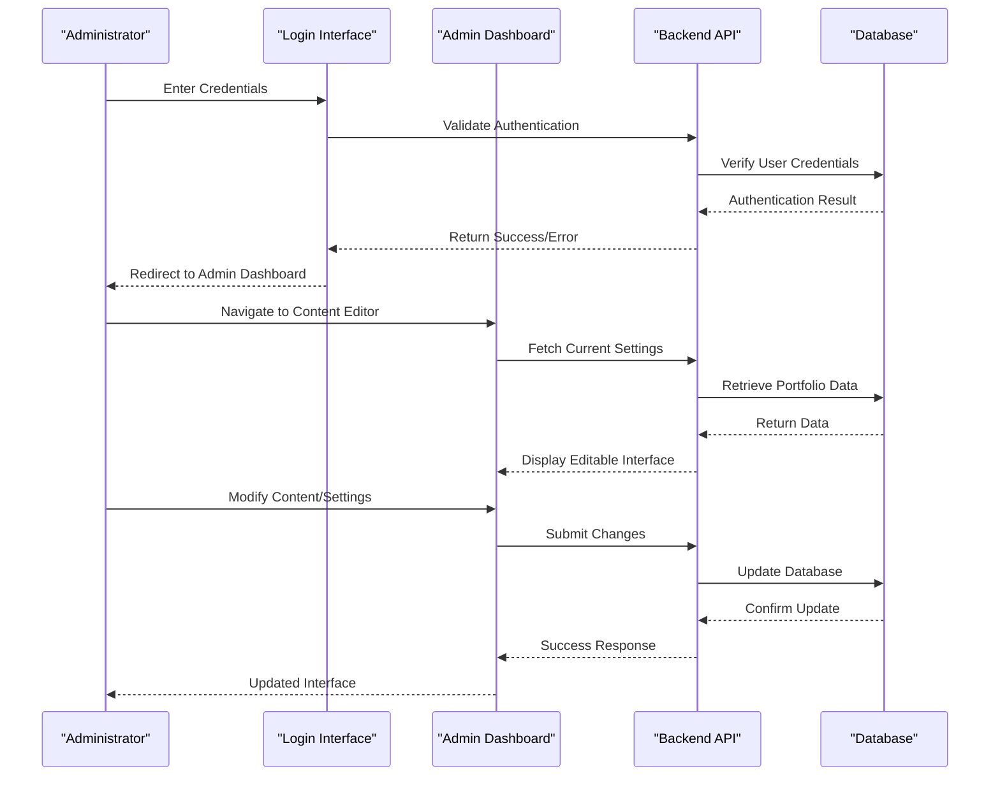
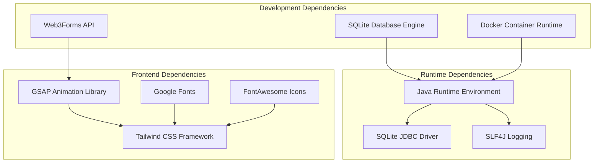

# Introduction and Purpose

<cite>
**Referenced Files in This Document**
- [Server.java](file://Server.java)
- [main.js](file://main.js)
- [index.html](file://index.html)
- [admin.html](file://admin.html)
- [login.html](file://login.html)
- [style.css](file://style.css)
- [run_server.bat](file://run_server.bat)
- [Dockerfile](file://Dockerfile)
- [design.md](file://design.md)
- [portfolio.txt](file://portfolio.txt)
- [about.html](file://about.html)
- [projects.html](file://projects.html)
- [contact.html](file://contact.html)
</cite>

## Table of Contents
1. [Introduction](#introduction)
2. [Project Structure](#project-structure)
3. [Core Components](#core-components)
4. [Architecture Overview](#architecture-overview)
5. [Detailed Component Analysis](#detailed-component-analysis)
6. [Dependency Analysis](#dependency-analysis)
7. [Performance Considerations](#performance-considerations)
8. [Troubleshooting Guide](#troubleshooting-guide)
9. [Conclusion](#conclusion)

## Introduction
Premium Portfolio is a professional developer portfolio that doubles as a content management system. It presents a modern, interactive public-facing website for developers and content creators while integrating a secure admin panel for real-time updates. The application demonstrates full-stack engineering with a Java backend, SQLite database, and a feature-rich frontend powered by modern JavaScript and animation libraries.

The project serves multiple audiences:
- Developers seeking a polished, customizable portfolio that showcases technical skills and personality
- Content creators who need a flexible, editable website without coding knowledge
- Educators and students learning full-stack development through a practical, real-world example

The vision extends beyond a simple portfolio: it combines technical demonstration with practical portfolio management functionality. The admin panel allows live editing of themes, content, projects, and layout structures, turning the portfolio into both a presentation tool and a functional content management system.

## Project Structure
The project follows a hybrid architecture with static HTML/CSS/JavaScript for the public-facing site and a Java-based HTTP server for dynamic content management and database operations.

**Diagram sources**
- [index.html](file://index.html)
- [login.html](file://login.html)
- [admin.html](file://admin.html)
- [Server.java](file://Server.java)
- [Dockerfile](file://Dockerfile)
- [run_server.bat](file://run_server.bat)

**Section sources**
- [Server.java:34-83](file://Server.java#L34-L83)
- [Dockerfile:1-18](file://Dockerfile#L1-L18)
- [run_server.bat:1-62](file://run_server.bat#L1-L62)

## Core Components
The application consists of several interconnected components that work together to deliver both public presentation and administrative functionality.

### Public Website Components
The frontend delivers a modern, animated portfolio experience with dynamic content loading from the database. Key components include:
- **Static HTML pages** ([index.html](file://index.html), [about.html](file://about.html), [projects.html](file://projects.html), [contact.html](file://contact.html)) providing structured content
- **Dynamic JavaScript engine** ([main.js](file://main.js)) handling content loading, animations, and user interactions
- **Styling system** ([style.css](file://style.css)) implementing a cohesive design language with theme support
- **Animation framework** utilizing GSAP for smooth, engaging user experiences

### Administrative Components
The admin system provides comprehensive content management capabilities:
- **Authentication interface** ([login.html](file://login.html)) securing access to administrative functions
- **Dashboard interface** ([admin.html](file://admin.html)) offering visual content management tools
- **Backend API** ([Server.java](file://Server.java)) handling database operations and content updates
- **Database layer** managing portfolio content, settings, and administrative data

### Educational Value
The project serves as an excellent learning resource for full-stack development students, demonstrating:
- Real-time content management through AJAX and RESTful APIs
- Database design and migration strategies
- Modern frontend architecture with modular JavaScript
- Cross-platform deployment using Docker and batch scripts
- Security considerations including authentication and session management

**Section sources**
- [main.js:66-136](file://main.js#L66-L136)
- [index.html:1-800](file://index.html#L1-L800)
- [admin.html:1-800](file://admin.html#L1-L800)
- [login.html:1-175](file://login.html#L1-L175)

## Architecture Overview
The system employs a layered architecture separating presentation, business logic, and data persistence concerns.

**Diagram sources**
- [Server.java:18-83](file://Server.java#L18-L83)
- [main.js:76-115](file://main.js#L76-L115)
- [index.html:36-49](file://index.html#L36-L49)

The architecture supports both public access and administrative functions through a unified server instance that routes requests appropriately based on authentication status and endpoint requirements.

**Section sources**
- [Server.java:41-69](file://Server.java#L41-L69)
- [main.js:76-115](file://main.js#L76-L115)

## Detailed Component Analysis

### Backend Server Architecture
The Java-based HTTP server serves as the central hub for all application functionality, implementing a comprehensive RESTful API with proper authentication and authorization mechanisms.

**Diagram sources**
- [Server.java:354-396](file://Server.java#L354-L396)
- [Server.java:556-644](file://Server.java#L556-L644)

The server implements multiple handler classes for different functional areas:
- **Authentication handlers** managing user login and session validation
- **Content management handlers** supporting CRUD operations for portfolio data
- **Static file serving** delivering the public website and admin interface
- **Database initialization** ensuring proper schema setup and data seeding

**Section sources**
- [Server.java:354-396](file://Server.java#L354-L396)
- [Server.java:556-800](file://Server.java#L556-L800)

### Frontend Content Delivery System
The frontend architecture emphasizes dynamic content loading and real-time updates, enabling seamless integration between static presentation and database-driven content.

**Diagram sources**
- [main.js:66-136](file://main.js#L66-L136)
- [index.html:76-115](file://index.html#L76-L115)

The content delivery system utilizes a sophisticated approach to dynamic content loading, allowing administrators to modify content without requiring full page reloads or redeployment.

**Section sources**
- [main.js:66-136](file://main.js#L66-L136)
- [index.html:76-115](file://index.html#L76-L115)

### Database Schema and Content Management
The SQLite-based data layer supports comprehensive content management with structured tables for different portfolio elements and robust administrative controls.

**Diagram sources**
- [Server.java:85-337](file://Server.java#L85-L337)

The database design supports both public content presentation and administrative management, with separate tables for different content types and a centralized settings table for theme and configuration management.

**Section sources**
- [Server.java:85-337](file://Server.java#L85-L337)

### Administrative Interface and Workflow
The admin interface provides a comprehensive content management system with intuitive controls for modifying portfolio content, themes, and structural elements.

**Diagram sources**
- [login.html:122-171](file://login.html#L122-L171)
- [admin.html:608-716](file://admin.html#L608-L716)

The administrative workflow emphasizes security and usability, with proper authentication, authorization, and data validation throughout the content management process.

**Section sources**
- [login.html:122-171](file://login.html#L122-L171)
- [admin.html:608-716](file://admin.html#L608-L716)

## Dependency Analysis
The project maintains clear separation of concerns through well-defined dependencies between components.

**Diagram sources**
- [run_server.bat:14-33](file://run_server.bat#L14-L33)
- [Dockerfile:1-18](file://Dockerfile#L1-18)

The dependency structure supports both local development and production deployment scenarios, with clear pathways for adding new features and maintaining system stability.

**Section sources**
- [run_server.bat:14-33](file://run_server.bat#L14-L33)
- [Dockerfile:1-18](file://Dockerfile#L1-18)

## Performance Considerations
The application is designed with performance optimization in mind, particularly for the public-facing portfolio experience.

Key performance strategies include:
- **Lazy loading** of non-critical resources until after initial page load
- **Efficient database queries** with proper indexing and minimal round trips
- **Static asset optimization** through CDN-ready delivery
- **Memory-efficient animations** using hardware acceleration
- **Progressive enhancement** ensuring graceful degradation

The system balances the need for real-time administrative updates with the requirement for fast, responsive public access, implementing caching strategies and optimized data structures throughout the architecture.

## Troubleshooting Guide
Common issues and their resolutions:

### Server Startup Issues
- **Problem**: Server fails to start due to missing dependencies
- **Solution**: Ensure SQLite JDBC driver and SLF4J libraries are downloaded and placed in the lib directory

### Database Connection Problems
- **Problem**: Applications cannot connect to SQLite database
- **Solution**: Verify database file permissions and check for proper JDBC driver loading

### Authentication Failures
- **Problem**: Admin login fails despite correct credentials
- **Solution**: Check session cookie configuration and verify authentication handler implementation

### Frontend Content Loading Issues
- **Problem**: Dynamic content does not load or update
- **Solution**: Verify API endpoint accessibility and check browser console for JavaScript errors

**Section sources**
- [run_server.bat:14-39](file://run_server.bat#L14-L39)
- [Server.java:354-396](file://Server.java#L354-L396)

## Conclusion
Premium Portfolio represents a sophisticated blend of technical demonstration and practical application. By combining a modern, interactive frontend with a robust Java backend and SQLite database, it creates a versatile platform that serves both as a professional portfolio showcase and a functional content management system.

The project's educational value extends beyond its immediate functionality, providing developers with a comprehensive example of full-stack architecture, security implementation, and deployment strategies. Its modular design and clear separation of concerns make it an excellent foundation for learning modern web development practices while delivering real business value.

Through its integrated admin panel, the application demonstrates how technical capabilities can be combined with practical usability, creating solutions that are both impressive demonstrations of engineering skill and effective tools for content management and presentation.