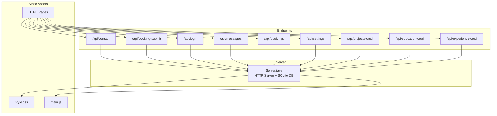
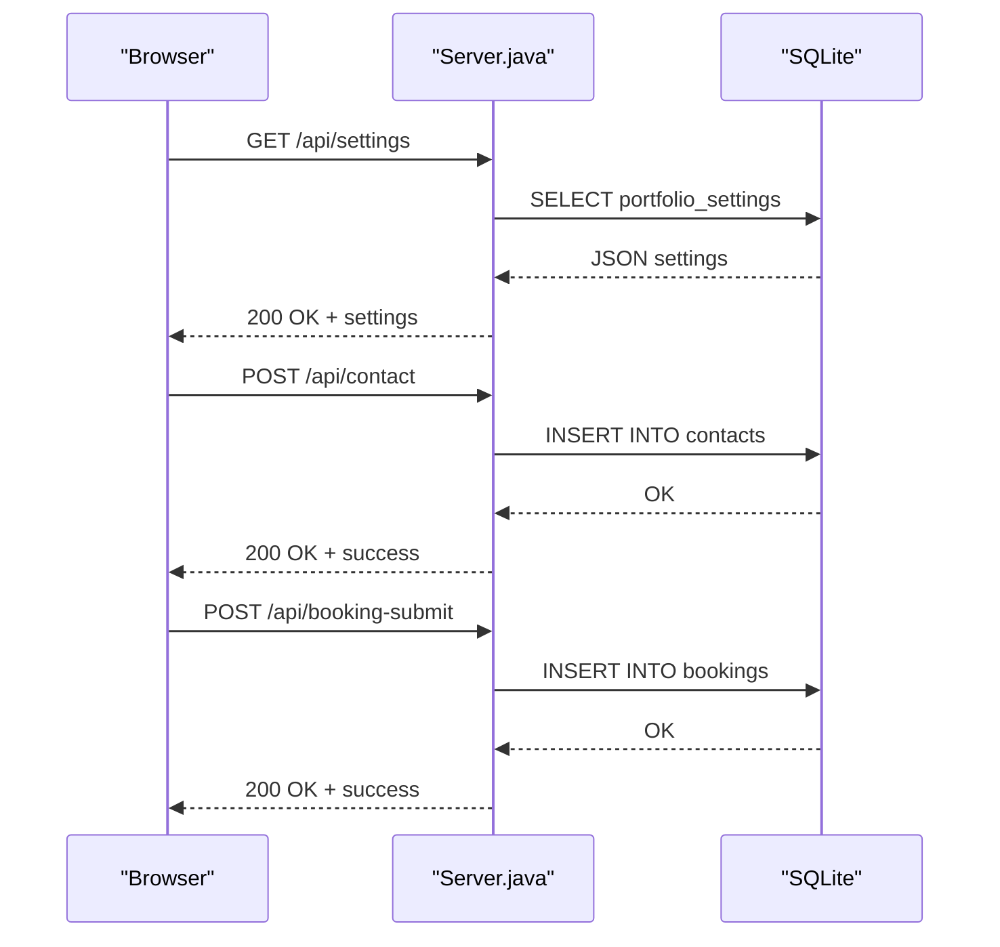
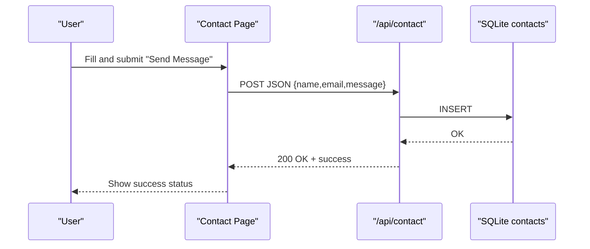
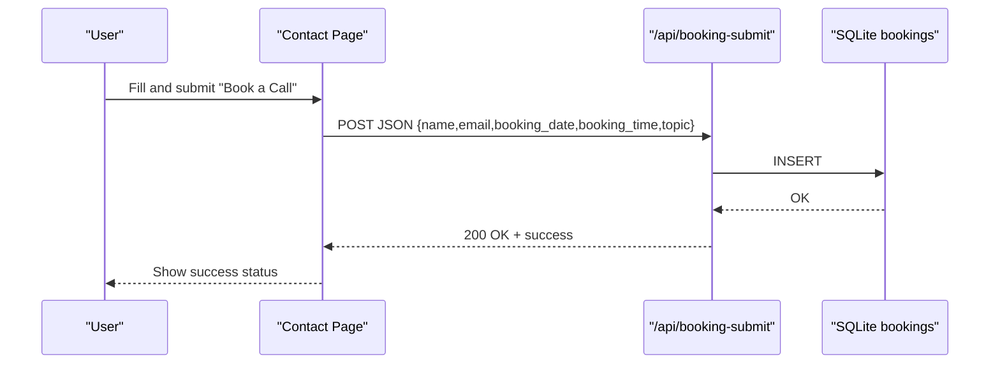
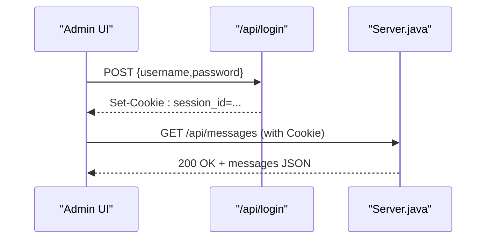
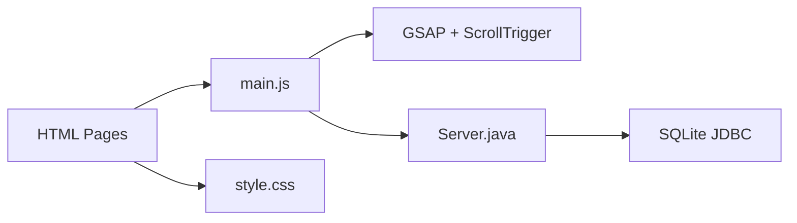

# Key Features and Capabilities

<cite>
**Referenced Files in This Document**
- [Server.java](file://Server.java)
- [main.js](file://main.js)
- [style.css](file://style.css)
- [index.html](file://index.html)
- [contact.html](file://contact.html)
- [projects.html](file://projects.html)
- [education.html](file://education.html)
- [goals.html](file://goals.html)
- [admin.html](file://admin.html)
- [login.html](file://login.html)
</cite>

## Table of Contents
1. [Introduction](#introduction)
2. [Project Structure](#project-structure)
3. [Core Components](#core-components)
4. [Architecture Overview](#architecture-overview)
5. [Detailed Component Analysis](#detailed-component-analysis)
6. [Dependency Analysis](#dependency-analysis)
7. [Performance Considerations](#performance-considerations)
8. [Troubleshooting Guide](#troubleshooting-guide)
9. [Conclusion](#conclusion)
10. [Appendices](#appendices)

## Introduction
This document details the Premium Portfolio application’s major features and capabilities. It covers the responsive public portfolio with animated transitions and dynamic content loading, the comprehensive admin panel with real-time content editing and authentication, contact form processing, appointment booking, database-driven content management, theme customization, and automated database initialization, migrations, and seeding.

## Project Structure
The application consists of:
- A Java-based HTTP server that initializes SQLite, exposes REST endpoints, and serves static assets.
- A client-side JavaScript runtime that orchestrates page loaders, animations, dynamic content fetching, and interactive UI.
- Shared CSS for design tokens, responsive layout, and theme customization.
- Multiple HTML pages for public views and admin dashboards.

**Diagram sources**
- [Server.java:34-83](file://Server.java#L34-L83)
- [main.js:76-135](file://main.js#L76-L135)

**Section sources**
- [Server.java:34-83](file://Server.java#L34-L83)
- [main.js:76-135](file://main.js#L76-L135)

## Core Components
- Public portfolio rendering and animations powered by GSAP and custom scripts.
- Real-time content editing via admin panel with live preview and database CRUD endpoints.
- Authentication and protected endpoints guarded by session cookies.
- Contact form submission and booking system backed by SQLite.
- Theme customization via design tokens and dynamic CSS injection.
- Automated database initialization, migrations, and seeding.

**Section sources**
- [main.js:66-136](file://main.js#L66-L136)
- [Server.java:85-337](file://Server.java#L85-L337)
- [admin.html:717-800](file://admin.html#L717-L800)

## Architecture Overview
The system follows a thin-server architecture:
- The Java server initializes SQLite, exposes REST endpoints, and serves static files.
- The browser loads HTML pages and executes main.js to fetch settings and content, then applies animations and interactivity.
- Admin pages communicate with protected endpoints to manage content and themes.

**Diagram sources**
- [Server.java:494-554](file://Server.java#L494-L554)
- [Server.java:738-800](file://Server.java#L738-L800)
- [main.js:740-800](file://main.js#L740-L800)

## Detailed Component Analysis

### Public Portfolio Rendering and Animations
- Page loader with animated brand letters and progress bar.
- Dynamic content hydration via /api/settings to populate hero, skills, goals, and metadata.
- GSAP-powered scroll-triggered animations and fallbacks.
- Responsive navigation, hero canvas particle effect, and project preview overlays.

Implementation highlights:
- Loader and initialization: [initLoader:16-61](file://main.js#L16-L61), [initAll:66-136](file://main.js#L66-L136)
- Dynamic content fetch and render: [fetch('/api/settings'):76-94](file://main.js#L76-L94)
- GSAP animations: [initGSAPAnimations:398-621](file://main.js#L398-L621)
- Fallback animations: [initFallbackAnimations:626-650](file://main.js#L626-L650)
- Hero canvas: [initHeroCanvas:190-287](file://main.js#L190-L287)

Responsive design and theme tokens:
- CSS design tokens and responsive units: [style.css:7-32](file://style.css#L7-L32)
- Tailwind-based responsive classes in HTML pages: [index.html:1-50](file://index.html#L1-L50)

**Section sources**
- [main.js:16-136](file://main.js#L16-L136)
- [main.js:398-650](file://main.js#L398-L650)
- [style.css:7-32](file://style.css#L7-L32)
- [index.html:1-50](file://index.html#L1-L50)

### Contact Form Processing
- Tabbed interface for “Send Message” and “Book a Call.”
- Client-side validation and visual feedback.
- Submission to /api/contact and /api/booking-submit with JSON payloads.
- Optional Web3Forms routing for email notifications.

Key flows:
- Contact form submission: [initContactForm:702-800](file://main.js#L702-L800)
- Booking form submission: [initBookingForm:1-1562](file://main.js#L1-L1562) (invoked during initAll)
- Server endpoint: [ContactHandler:494-554](file://Server.java#L494-L554)
- Server endpoint: [BookingSubmitHandler:738-800](file://Server.java#L738-L800)

**Diagram sources**
- [main.js:702-800](file://main.js#L702-L800)
- [Server.java:494-554](file://Server.java#L494-L554)

**Section sources**
- [main.js:702-800](file://main.js#L702-L800)
- [Server.java:494-554](file://Server.java#L494-L554)

### Appointment Booking System
- Dedicated booking form with date/time/topic fields.
- Submission to /api/booking-submit.
- Admin dashboard lists and deletes bookings.

Key flows:
- Booking form UI: [contact.html:153-198](file://contact.html#L153-L198)
- Client submission: [initContactForm:702-800](file://main.js#L702-L800) (booking branch)
- Server endpoint: [BookingSubmitHandler:738-800](file://Server.java#L738-L800)
- Admin listing and deletion: [BookingsHandler:646-735](file://Server.java#L646-L735)

**Diagram sources**
- [main.js:702-800](file://main.js#L702-L800)
- [Server.java:738-800](file://Server.java#L738-L800)

**Section sources**
- [contact.html:153-198](file://contact.html#L153-L198)
- [Server.java:738-800](file://Server.java#L738-L800)

### Admin Panel: Authentication and Protected Endpoints
- Login page with credential submission to /api/login and session cookie handling.
- Protected endpoints for messages and bookings.
- Admin dashboard with live preview, search, and operation tabs.

Authentication flow:
- Login UI: [login.html:121-171](file://login.html#L121-L171)
- Login endpoint: [LoginHandler:355-396](file://Server.java#L355-L396)
- Session guard: [isAuthenticated:339-352](file://Server.java#L339-L352)

Protected endpoints:
- Messages: [MessagesHandler:557-644](file://Server.java#L557-L644)
- Bookings: [BookingsHandler:646-735](file://Server.java#L646-L735)

Admin dashboard:
- Views: [admin.html:671-716](file://admin.html#L671-L716)
- Live preview controls: [admin.html:717-800](file://admin.html#L717-L800)

**Diagram sources**
- [login.html:121-171](file://login.html#L121-L171)
- [Server.java:355-396](file://Server.java#L355-L396)
- [Server.java:557-644](file://Server.java#L557-L644)

**Section sources**
- [login.html:121-171](file://login.html#L121-L171)
- [Server.java:339-396](file://Server.java#L339-L396)
- [Server.java:557-644](file://Server.java#L557-L644)
- [admin.html:671-800](file://admin.html#L671-L800)

### Database-Driven Content Management
- Automated initialization of SQLite tables and seeding defaults.
- Migrations to add new columns to portfolio_settings.
- CRUD endpoints for projects, education, and experience.

Initialization and seeding:
- [initializeDatabase:85-337](file://Server.java#L85-337)

CRUD endpoints:
- Projects: [ProjectsCrudHandler:1-1621](file://Server.java#L1-L1621) (mapped at /api/projects-crud)
- Education: [EducationCrudHandler:1-1621](file://Server.java#L1-L1621) (mapped at /api/education-crud)
- Experience: [ExperienceCrudHandler:1-1621](file://Server.java#L1-L1621) (mapped at /api/experience-crud)

Public content hydration:
- [fetch('/api/settings'):76-94](file://main.js#L76-L94) populates dynamic content across pages.

**Section sources**
- [Server.java:85-337](file://Server.java#L85-L337)
- [main.js:76-94](file://main.js#L76-L94)

### Theme Customization
- Design tokens in CSS define colors, fonts, easing, and spacing.
- Admin live preview updates CSS variables and injects rules.
- Public pages consume dynamic theme via CSS variables and Tailwind theme extension.

Theme tokens:
- [style.css:7-32](file://style.css#L7-L32)

Live preview and controls:
- [admin.html:717-800](file://admin.html#L717-L800)

Tailwind theme integration:
- [index.html:11-34](file://index.html#L11-L34)

**Section sources**
- [style.css:7-32](file://style.css#L7-L32)
- [admin.html:717-800](file://admin.html#L717-L800)
- [index.html:11-34](file://index.html#L11-L34)

### Responsive Design and Animated Transitions
- Mobile navigation toggles and scroll-aware header.
- Hero canvas particle system and magnetic effects.
- GSAP scroll-triggered reveals and parallax.
- Fallback animations when GSAP is unavailable.

Components:
- Mobile nav: [initMobileNav:292-313](file://main.js#L292-313)
- Scroll header: [initScrollHeader:318-323](file://main.js#L318-323)
- Hero canvas: [initHeroCanvas:190-287](file://main.js#L190-287)
- GSAP animations: [initGSAPAnimations:398-621](file://main.js#L398-621)
- Fallbacks: [initFallbackAnimations:626-650](file://main.js#L626-650)

**Section sources**
- [main.js:292-323](file://main.js#L292-L323)
- [main.js:190-287](file://main.js#L190-L287)
- [main.js:398-650](file://main.js#L398-L650)

## Dependency Analysis
- Frontend depends on GSAP and Tailwind for animations and responsive utilities.
- Backend depends on com.sun.net.httpserver and SQLite JDBC for HTTP and persistence.
- Admin UI communicates with protected endpoints guarded by session cookies.

**Diagram sources**
- [main.js:398-621](file://main.js#L398-L621)
- [Server.java:1-20](file://Server.java#L1-L20)

**Section sources**
- [main.js:398-621](file://main.js#L398-L621)
- [Server.java:1-20](file://Server.java#L1-L20)

## Performance Considerations
- Client-side animations are optimized with GSAP and throttled via ScrollTrigger; fallbacks prevent heavy animations when unavailable.
- Static asset delivery is efficient via the embedded HTTP server.
- Database operations use prepared statements and minimal queries per request.
- Consider enabling caching headers for static assets and optimizing image sizes for production deployment.

## Troubleshooting Guide
Common issues and resolutions:
- Database initialization errors: Verify SQLite JDBC driver availability and permissions for portfolio.db creation.
  - [initializeDatabase:85-337](file://Server.java#L85-337)
- Authentication failures: Confirm username/password match and session cookie presence.
  - [LoginHandler:355-396](file://Server.java#L355-396)
- CORS errors: Ensure Access-Control-Allow-* headers are present for cross-origin requests.
  - [setCorsHeaders:398-402](file://Server.java#L398-L402)
- Missing required form fields: Server validates presence of required fields and returns 400.
  - [ContactHandler:505-530](file://Server.java#L505-L530)
  - [BookingSubmitHandler:749-776](file://Server.java#L749-L776)
- Protected endpoint access denied: Check session cookie and authentication guard.
  - [isAuthenticated:339-352](file://Server.java#L339-L352)
  - [MessagesHandler:567-570](file://Server.java#L567-L570)
  - [BookingsHandler:657-660](file://Server.java#L657-L660)

**Section sources**
- [Server.java:85-337](file://Server.java#L85-L337)
- [Server.java:355-396](file://Server.java#L355-L396)
- [Server.java:398-402](file://Server.java#L398-L402)
- [Server.java:505-530](file://Server.java#L505-L530)
- [Server.java:749-776](file://Server.java#L749-L776)
- [Server.java:339-352](file://Server.java#L339-L352)
- [Server.java:567-570](file://Server.java#L567-L570)
- [Server.java:657-660](file://Server.java#L657-L660)

## Conclusion
Premium Portfolio delivers a modern, responsive, and highly customizable personal showcase with robust backend support. Its admin panel enables real-time content editing, while the contact and booking systems integrate seamlessly with SQLite-backed storage. Theme customization and advanced animations enhance user engagement, and the automated database initialization ensures a smooth setup experience.

## Appendices
- Example usage patterns:
  - Public content hydration: [main.js:76-94](file://main.js#L76-L94)
  - Contact form submission: [main.js:740-752](file://main.js#L740-L752)
  - Booking submission: [main.js:740-752](file://main.js#L740-L752)
  - Admin login: [login.html:146-170](file://login.html#L146-L170)
  - Admin dashboard controls: [admin.html:717-800](file://admin.html#L717-L800)