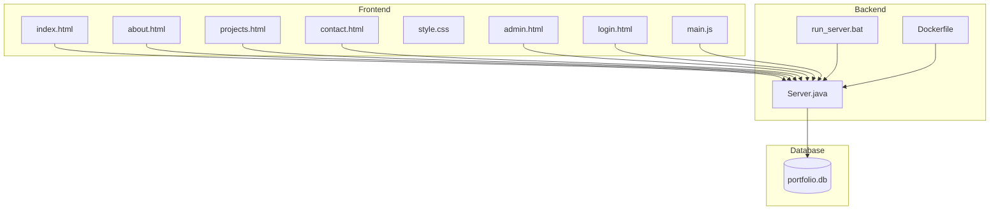
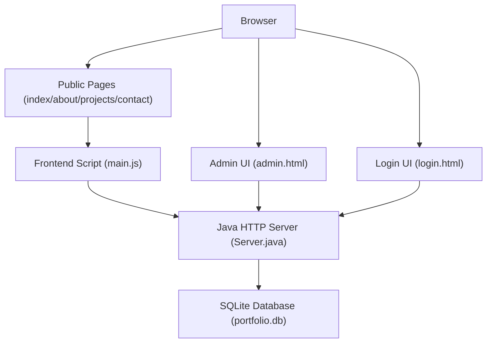
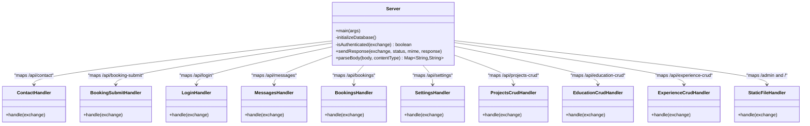
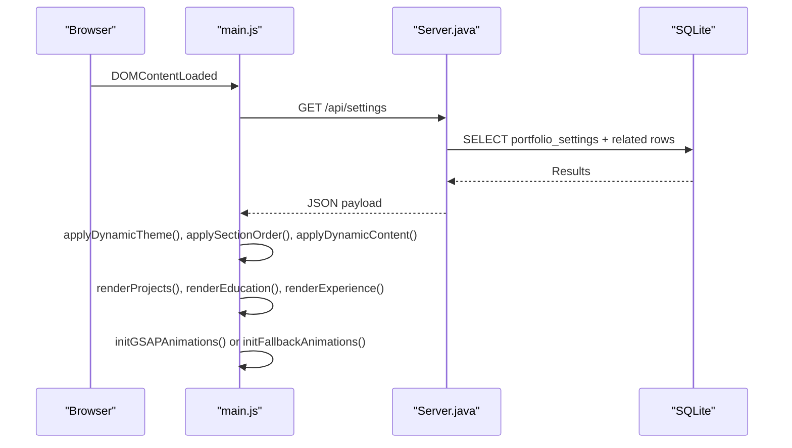
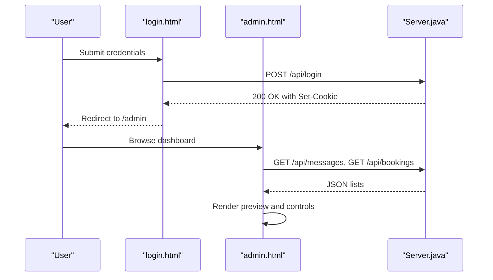

# Project Overview

<cite>
**Referenced Files in This Document**
- [Server.java](file://Server.java)
- [main.js](file://main.js)
- [index.html](file://index.html)
- [admin.html](file://admin.html)
- [login.html](file://login.html)
- [style.css](file://style.css)
- [run_server.bat](file://run_server.bat)
- [Dockerfile](file://Dockerfile)
- [design.md](file://design.md)
- [portfolio.txt](file://portfolio.txt)
- [about.html](file://about.html)
- [projects.html](file://projects.html)
- [contact.html](file://contact.html)
</cite>

## Table of Contents
1. [Introduction](#introduction)
2. [Project Structure](#project-structure)
3. [Core Components](#core-components)
4. [Architecture Overview](#architecture-overview)
5. [Detailed Component Analysis](#detailed-component-analysis)
6. [Dependency Analysis](#dependency-analysis)
7. [Performance Considerations](#performance-considerations)
8. [Troubleshooting Guide](#troubleshooting-guide)
9. [Conclusion](#conclusion)
10. [Appendices](#appendices)

## Introduction
Premium Portfolio is a professional developer portfolio with an integrated admin panel. It combines a modern, motion-rich frontend with a lightweight Java-based HTTP server backed by SQLite for dynamic content management. The admin panel allows authorized users to manage themes, typography, layout ordering, and content (including projects, education, and experience) without touching code. The system is designed to be easy to deploy locally or in containers, with a focus on rapid iteration and live previews.

## Project Structure
The repository is organized into:
- Backend: Java server (single-file implementation) with HTTP endpoints for admin and public content
- Database: SQLite file-backed storage for contacts, bookings, and portfolio settings
- Frontend: Static HTML/CSS/JS pages with dynamic content hydration via the backend
- Admin: Dedicated login and dashboard pages for managing content and settings
- Packaging: Windows batch launcher and Dockerfile for deployment



**Diagram sources**
- [Server.java:34-83](file://Server.java#L34-L83)
- [run_server.bat:43-56](file://run_server.bat#L43-L56)
- [Dockerfile:10-17](file://Dockerfile#L10-L17)

**Section sources**
- [Server.java:18-83](file://Server.java#L18-L83)
- [run_server.bat:1-62](file://run_server.bat#L1-L62)
- [Dockerfile:1-18](file://Dockerfile#L1-L18)

## Core Components
- Java HTTP Server: Single-class server exposing REST endpoints for contact submissions, booking management, admin login, and content retrieval. It initializes SQLite tables and seeds default data.
- SQLite Database: Stores contacts, bookings, and portfolio settings (with migrations and defaults).
- Frontend Scripts: Dynamic hydration of content, animations, and forms powered by main.js and index.html.
- Admin Dashboard: Secure login and admin pages for viewing and managing content and settings.
- Packaging: Windows launcher and Dockerfile for easy deployment.

Key implementation highlights:
- Endpoint mapping and context registration in the server’s main method
- Database initialization and schema migrations
- Static file serving and protected admin routes
- Frontend hydration via fetch('/api/settings') and subsequent dynamic rendering

**Section sources**
- [Server.java:34-83](file://Server.java#L34-L83)
- [Server.java:85-337](file://Server.java#L85-L337)
- [main.js:66-136](file://main.js#L66-L136)
- [admin.html:608-716](file://admin.html#L608-L716)

## Architecture Overview
The system follows a thin-server architecture:
- Public pages (index/about/projects/contact) are static HTML enhanced by main.js
- The server exposes REST endpoints for admin and public consumption
- Admin access requires a session cookie; protected endpoints manage messages and bookings
- Settings are fetched by the frontend and rendered dynamically



**Diagram sources**
- [Server.java:34-83](file://Server.java#L34-L83)
- [main.js:76-114](file://main.js#L76-L114)
- [admin.html:608-716](file://admin.html#L608-L716)
- [login.html:121-171](file://login.html#L121-L171)

## Detailed Component Analysis

### Backend Server (Java)
The server initializes SQLite, registers HTTP contexts, and implements handlers for:
- Public contact submissions
- Public booking submissions
- Admin login (sets session cookie)
- Protected admin endpoints for messages and bookings
- Settings retrieval and updates
- CRUD endpoints for projects, education, and experience



**Diagram sources**
- [Server.java:34-83](file://Server.java#L34-L83)
- [Server.java:355-396](file://Server.java#L355-L396)
- [Server.java:495-554](file://Server.java#L495-L554)
- [Server.java:739-800](file://Server.java#L739-L800)
- [Server.java:557-644](file://Server.java#L557-L644)
- [Server.java:647-736](file://Server.java#L647-L736)

Implementation details:
- Port resolution from environment variable with fallback
- SQLite driver class loading and connection
- Table creation and seeding for contacts, bookings, portfolio settings, projects, education, and experience
- CORS handling and response formatting helpers
- Body parsing for JSON and form-encoded payloads
- Authentication via cookie presence and value matching

**Section sources**
- [Server.java:18-32](file://Server.java#L18-L32)
- [Server.java:85-337](file://Server.java#L85-L337)
- [Server.java:398-411](file://Server.java#L398-L411)
- [Server.java:413-466](file://Server.java#L413-L466)
- [Server.java:339-352](file://Server.java#L339-L352)

### Frontend Hydration and Rendering (main.js)
The frontend script orchestrates:
- Page loader and initial animations
- Fetching settings from the backend and applying dynamic content
- Rendering projects, education, and experience lists
- Initializing animations (GSAP) and fallbacks
- Form submission flows for contact and booking



**Diagram sources**
- [main.js:66-136](file://main.js#L66-L136)
- [Server.java:557-644](file://Server.java#L557-L644)

Practical examples:
- Dynamic content updates: The frontend fetches settings and populates hero, about, skills, and contact sections.
- Project rendering: Projects are rendered from the database into cards.
- Booking flow: The contact page supports a dual-tab form switching between message and booking.

**Section sources**
- [main.js:76-114](file://main.js#L76-L114)
- [main.js:138-146](file://main.js#L138-L146)
- [main.js:655-800](file://main.js#L655-L800)

### Admin Panel (login.html, admin.html)
The admin panel provides:
- Secure login with session cookie management
- Dashboard tabs for messages, bookings, visual customization, and content management
- Live preview and audit log simulation



**Diagram sources**
- [login.html:121-171](file://login.html#L121-L171)
- [admin.html:608-716](file://admin.html#L608-L716)
- [Server.java:557-644](file://Server.java#L557-L644)

**Section sources**
- [login.html:121-171](file://login.html#L121-L171)
- [admin.html:608-716](file://admin.html#L608-L716)

### Public Pages (index.html, about.html, projects.html, contact.html)
These pages are static HTML enhanced by main.js and styled via style.css. They include:
- Navigation and responsive design
- Dynamic content placeholders populated by the backend
- Interactive elements and animations

**Section sources**
- [index.html:1-800](file://index.html#L1-L800)
- [about.html:1-196](file://about.html#L1-L196)
- [projects.html:1-134](file://projects.html#L1-L134)
- [contact.html:1-221](file://contact.html#L1-L221)
- [style.css:1-800](file://style.css#L1-L800)

## Dependency Analysis
- Java runtime and SQLite JDBC driver are required for the server
- The Windows launcher downloads dependencies and runs the server
- Docker builds a minimal Alpine-based image with Eclipse Temurin JDK and SQLite CLI

```mermaid
graph TB
SRV[Server.java]
BAT[run_server.bat]
DKR[Dockerfile]
LIB[lib/* (SQLite JDBC, SLF4J)]
DB[(portfolio.db)]
BAT --> LIB
BAT --> SRV
DKR --> SRV
DKR --> LIB
SRV --> DB
```

**Diagram sources**
- [run_server.bat:14-49](file://run_server.bat#L14-L49)
- [Dockerfile:1-18](file://Dockerfile#L1-L18)
- [Server.java:87-89](file://Server.java#L87-L89)

**Section sources**
- [run_server.bat:14-49](file://run_server.bat#L14-L49)
- [Dockerfile:1-18](file://Dockerfile#L1-L18)
- [Server.java:87-89](file://Server.java#L87-L89)

## Performance Considerations
- Lightweight server: Uses the built-in HttpServer to minimize overhead
- Static assets: HTML/CSS/JS served as-is; dynamic content fetched via REST
- Animations: Optional; fallbacks provided when GSAP is unavailable
- Database: SQLite file-based; migrations and seeding occur on startup

[No sources needed since this section provides general guidance]

## Troubleshooting Guide
Common issues and resolutions:
- SQLite driver not found: Ensure lib directory contains sqlite-jdbc and SLF4J jars; the launcher downloads them automatically
- Server fails to start: Verify JDK installation and PATH; check port availability
- Admin access denied: Confirm correct username/password and that the session cookie is set
- CORS errors: The server sets permissive CORS headers for development; adjust for production

**Section sources**
- [run_server.bat:14-49](file://run_server.bat#L14-L49)
- [Server.java:398-402](file://Server.java#L398-L402)
- [login.html:146-170](file://login.html#L146-L170)

## Conclusion
Premium Portfolio delivers a modern, dynamic developer portfolio with an integrated admin panel. Its Java-based backend and SQLite storage enable rapid content iteration without code changes, while the frontend provides a polished, animated user experience. The project is straightforward to launch locally or deploy via Docker, making it ideal for showcasing full-stack capabilities and maintaining a professional online presence.

[No sources needed since this section summarizes without analyzing specific files]

## Appendices

### API Surface (Public and Admin)
- GET /api/settings
  - Purpose: Retrieve active portfolio configuration and related content
  - Response: JSON object containing settings, projects, education, and experience
- POST /api/contact
  - Purpose: Submit contact form data
  - Request: JSON with name, email, message
  - Response: JSON status and message
- POST /api/booking-submit
  - Purpose: Submit booking form data
  - Request: JSON with name, email, booking_date, booking_time, topic
  - Response: JSON status and message
- POST /api/login
  - Purpose: Authenticate admin
  - Request: JSON with username, password
  - Response: JSON status; sets session cookie on success
- GET /api/messages
  - Purpose: Retrieve all contact messages (admin)
  - Response: JSON array of messages
- DELETE /api/messages?id=N
  - Purpose: Delete a message by ID (admin)
  - Response: JSON status
- GET /api/bookings
  - Purpose: Retrieve all bookings (admin)
  - Response: JSON array of bookings
- DELETE /api/bookings?id=N
  - Purpose: Delete a booking by ID (admin)
  - Response: JSON status

**Section sources**
- [Server.java:557-644](file://Server.java#L557-L644)
- [Server.java:647-736](file://Server.java#L647-L736)
- [Server.java:495-554](file://Server.java#L495-L554)
- [Server.java:739-800](file://Server.java#L739-L800)
- [Server.java:355-396](file://Server.java#L355-L396)

### Database Schema Overview
- contacts: id, name, email, message, created_at
- bookings: id, name, email, booking_date, booking_time, topic, created_at
- portfolio_settings: id (PK, constrained to 1), theme presets, colors, fonts, animations flag, layout order, SEO/analytics fields, timestamps
- projects: id, title, description, image_url, github_link, live_link, tags, sort_order, is_visible, created_at
- education: id, degree, institution, timeline, description, sort_order, is_visible, created_at
- experience: id, role, company, timeline, description, sort_order, is_visible, created_at

**Section sources**
- [Server.java:98-331](file://Server.java#L98-L331)

### Deployment Options
- Local: run run_server.bat to compile and start the server
- Containerized: build and run the Docker image; the server listens on the configured port

**Section sources**
- [run_server.bat:43-56](file://run_server.bat#L43-L56)
- [Dockerfile:10-17](file://Dockerfile#L10-L17)