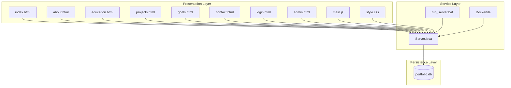
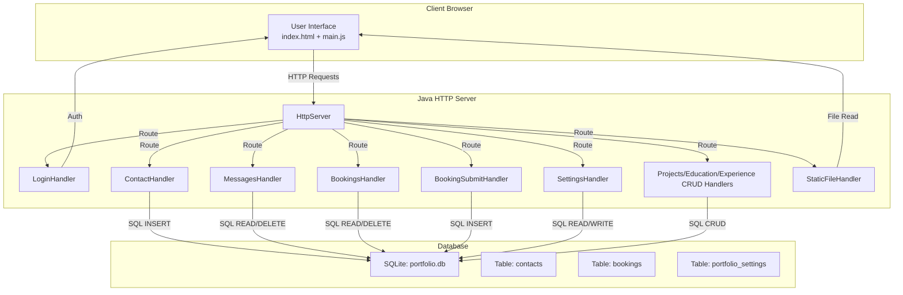
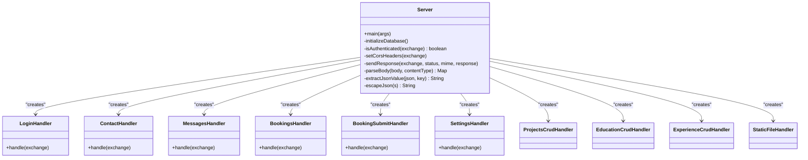
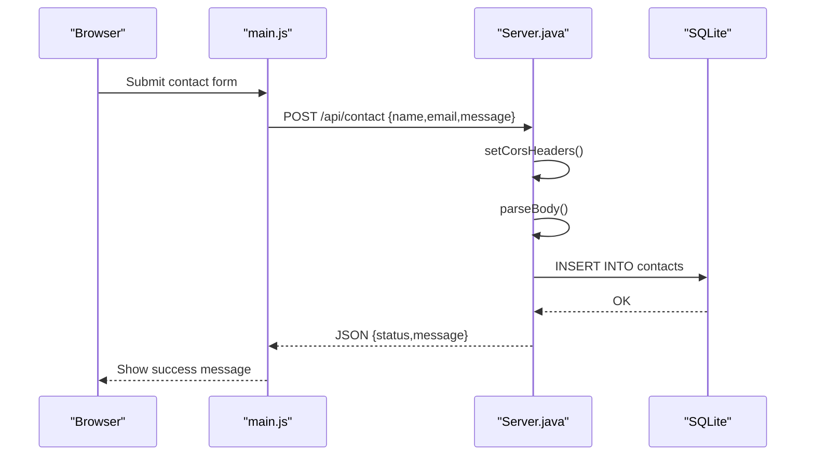
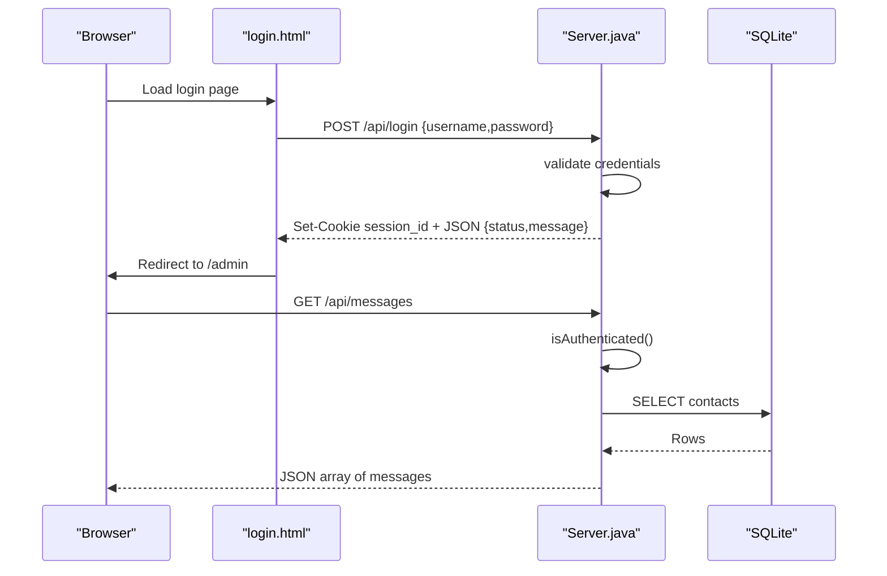
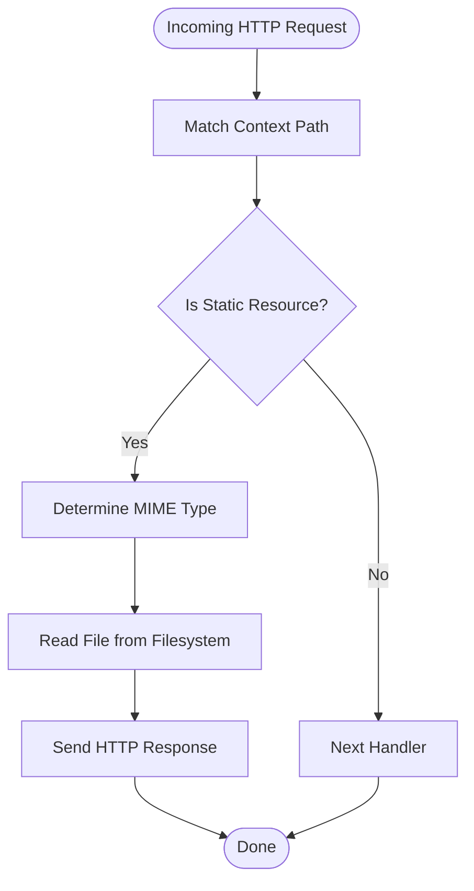
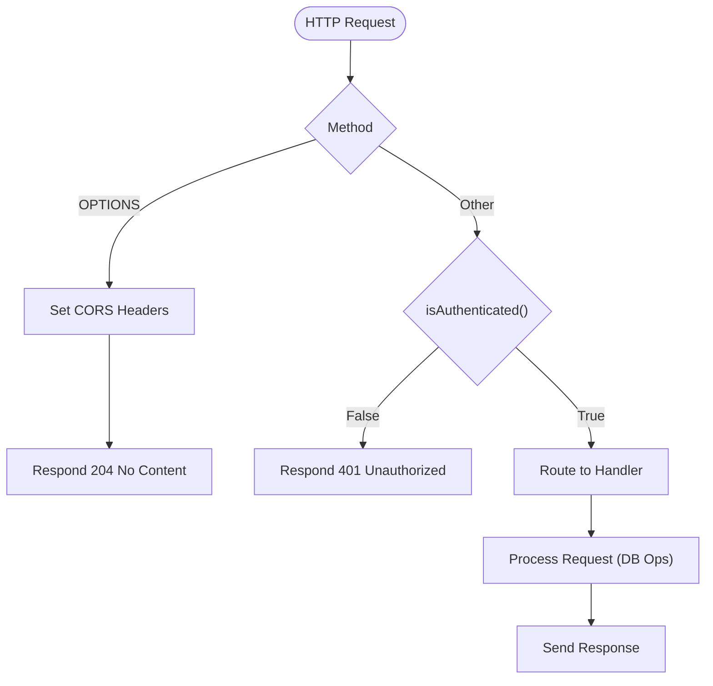
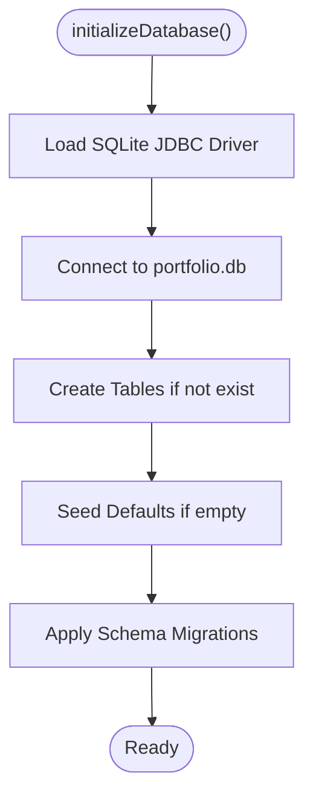
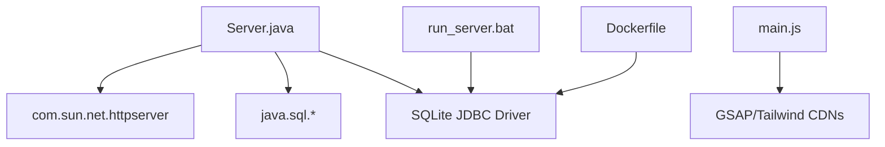

# System Architecture Diagram

<cite>
**Referenced Files in This Document**
- [Server.java](file://Server.java)
- [main.js](file://main.js)
- [index.html](file://index.html)
- [login.html](file://login.html)
- [admin.html](file://admin.html)
- [style.css](file://style.css)
- [run_server.bat](file://run_server.bat)
- [Dockerfile](file://Dockerfile)
</cite>

## Table of Contents
1. [Introduction](#introduction)
2. [Project Structure](#project-structure)
3. [Core Components](#core-components)
4. [Architecture Overview](#architecture-overview)
5. [Detailed Component Analysis](#detailed-component-analysis)
6. [Dependency Analysis](#dependency-analysis)
7. [Performance Considerations](#performance-considerations)
8. [Troubleshooting Guide](#troubleshooting-guide)
9. [Conclusion](#conclusion)

## Introduction
This document presents the complete technical architecture of the Premium Portfolio application. It describes the layered architecture spanning the frontend presentation layer (HTML/CSS/JavaScript), the backend service layer (Java HTTP server), and the data persistence layer (SQLite database). The document explains the request-response flow from client browsers through the Java HTTP server to database operations, documents the handler pattern implementation, static file serving mechanism, and API endpoint routing. It also covers security considerations including authentication, authorization, and CORS policies, along with component interactions, data flow patterns, and integration points.

## Project Structure
The Premium Portfolio application is organized into distinct layers:
- Frontend presentation layer: HTML pages, CSS styling, and JavaScript logic for dynamic rendering and user interactions.
- Backend service layer: A Java HTTP server implementing a handler pattern to manage API endpoints and static file serving.
- Data persistence layer: SQLite database with tables for contacts, bookings, and portfolio settings.

**Diagram sources**
- [Server.java:34-83](file://Server.java#L34-L83)
- [index.html:1-1465](file://index.html#L1-L1465)
- [login.html:1-175](file://login.html#L1-L175)
- [admin.html:1-2106](file://admin.html#L1-L2106)
- [style.css:1-2329](file://style.css#L1-L2329)
- [main.js:1-1562](file://main.js#L1-L1562)
- [run_server.bat:1-62](file://run_server.bat#L1-L62)
- [Dockerfile:1-18](file://Dockerfile#L1-L18)

**Section sources**
- [Server.java:34-83](file://Server.java#L34-L83)
- [index.html:1-1465](file://index.html#L1-L1465)
- [login.html:1-175](file://login.html#L1-L175)
- [admin.html:1-2106](file://admin.html#L1-L2106)
- [style.css:1-2329](file://style.css#L1-L2329)
- [main.js:1-1562](file://main.js#L1-L1562)
- [run_server.bat:1-62](file://run_server.bat#L1-L62)
- [Dockerfile:1-18](file://Dockerfile#L1-L18)

## Core Components
- Java HTTP Server: Implements a minimal embedded HTTP server using the built-in com.sun.net.httpserver package. It initializes the SQLite database, registers handlers for API endpoints and static resources, and manages CORS and authentication.
- Handler Pattern: Each API endpoint and static resource is mapped to a dedicated HttpHandler implementation. Handlers encapsulate request processing logic, including request validation, database operations, and response generation.
- Static File Serving: A StaticFileHandler serves HTML, CSS, and JavaScript files from the filesystem. It determines the appropriate MIME type and reads files from the project root.
- Database Layer: SQLite database with tables for contacts, bookings, and portfolio settings. The server initializes tables, seeds default data, and performs CRUD operations via JDBC.
- Frontend Scripts: main.js orchestrates dynamic content loading, form submissions, animations, and UI interactions. It communicates with backend endpoints to fetch settings and submit forms.

**Section sources**
- [Server.java:18-83](file://Server.java#L18-L83)
- [Server.java:85-337](file://Server.java#L85-L337)
- [Server.java:355-396](file://Server.java#L355-L396)
- [Server.java:495-554](file://Server.java#L495-L554)
- [Server.java:557-644](file://Server.java#L557-L644)
- [Server.java:647-736](file://Server.java#L647-L736)
- [Server.java:739-800](file://Server.java#L739-L800)
- [main.js:66-136](file://main.js#L66-L136)

## Architecture Overview
The Premium Portfolio follows a layered architecture:
- Presentation Layer: HTML/CSS/JavaScript deliver a responsive, animated user interface. The main.js script dynamically renders content, handles forms, and interacts with backend endpoints.
- Service Layer: The Java HTTP server exposes REST-like endpoints and serves static assets. It enforces CORS, authentication, and authorization policies.
- Persistence Layer: SQLite stores contact messages, booking requests, and portfolio configuration.

**Diagram sources**
- [Server.java:34-83](file://Server.java#L34-L83)
- [Server.java:355-396](file://Server.java#L355-L396)
- [Server.java:495-554](file://Server.java#L495-L554)
- [Server.java:557-644](file://Server.java#L557-L644)
- [Server.java:647-736](file://Server.java#L647-L736)
- [Server.java:739-800](file://Server.java#L739-L800)
- [Server.java:85-337](file://Server.java#L85-L337)

## Detailed Component Analysis

### Java HTTP Server and Handler Pattern
The Java HTTP server initializes the SQLite database and registers handlers for:
- Public API endpoints: /api/contact, /api/booking-submit, /api/settings
- Protected API endpoints: /api/login, /api/messages, /api/bookings, and CRUD endpoints for projects, education, and experience
- Static file serving: /admin, /admin.html, and default "/" context

**Diagram sources**
- [Server.java:18-83](file://Server.java#L18-L83)
- [Server.java:355-396](file://Server.java#L355-L396)
- [Server.java:495-554](file://Server.java#L495-L554)
- [Server.java:557-644](file://Server.java#L557-L644)
- [Server.java:647-736](file://Server.java#L647-L736)
- [Server.java:739-800](file://Server.java#L739-L800)

**Section sources**
- [Server.java:18-83](file://Server.java#L18-L83)
- [Server.java:339-352](file://Server.java#L339-L352)
- [Server.java:398-411](file://Server.java#L398-L411)
- [Server.java:413-466](file://Server.java#L413-L466)

### Request-Response Flow: Contact Form Submission
This sequence illustrates how a browser sends a contact message to the backend and receives a response.

**Diagram sources**
- [main.js:739-799](file://main.js#L739-L799)
- [Server.java:495-554](file://Server.java#L495-L554)
- [Server.java:533-544](file://Server.java#L533-L544)

**Section sources**
- [main.js:739-799](file://main.js#L739-L799)
- [Server.java:495-554](file://Server.java#L495-L554)

### Request-Response Flow: Admin Login and Protected Routes
This sequence demonstrates authentication, session cookie setting, and protected route access.

**Diagram sources**
- [login.html:121-172](file://login.html#L121-L172)
- [Server.java:355-396](file://Server.java#L355-L396)
- [Server.java:339-352](file://Server.java#L339-L352)
- [Server.java:557-644](file://Server.java#L557-L644)

**Section sources**
- [login.html:121-172](file://login.html#L121-L172)
- [Server.java:355-396](file://Server.java#L355-L396)
- [Server.java:339-352](file://Server.java#L339-L352)
- [Server.java:557-644](file://Server.java#L557-L644)

### Static File Serving Mechanism
StaticFileHandler serves HTML, CSS, and JavaScript files. It determines MIME types and reads files from the project root.

**Diagram sources**
- [Server.java:69](file://Server.java#L69)
- [Server.java:398-411](file://Server.java#L398-L411)

**Section sources**
- [Server.java:69](file://Server.java#L69)
- [Server.java:398-411](file://Server.java#L398-L411)

### API Endpoint Routing and Security Policies
- CORS: setCorsHeaders enables cross-origin requests with Allow-Origin *, Allow-Methods GET, POST, DELETE, OPTIONS, and Allow-Headers Content-Type.
- Authentication: isAuthenticated checks for a session cookie named session_id with a fixed value to authorize protected routes.
- Authorization: Protected endpoints (/api/messages, /api/bookings, CRUD handlers) enforce authentication before processing requests.

**Diagram sources**
- [Server.java:398-402](file://Server.java#L398-L402)
- [Server.java:339-352](file://Server.java#L339-L352)
- [Server.java:557-644](file://Server.java#L557-L644)

**Section sources**
- [Server.java:398-402](file://Server.java#L398-L402)
- [Server.java:339-352](file://Server.java#L339-L352)
- [Server.java:557-644](file://Server.java#L557-L644)

### Database Initialization and Schema
The server initializes SQLite tables for contacts, bookings, and portfolio_settings, seeds default data, and applies schema migrations.

**Diagram sources**
- [Server.java:85-337](file://Server.java#L85-L337)

**Section sources**
- [Server.java:85-337](file://Server.java#L85-L337)

## Dependency Analysis
- Internal dependencies:
  - Server.java depends on com.sun.net.httpserver.* for HTTP handling and java.sql.* for database operations.
  - main.js depends on DOM APIs, fetch, and external libraries (GSAP, Tailwind CDN) loaded by HTML pages.
- External dependencies:
  - SQLite JDBC driver (downloaded by run_server.bat and Dockerfile).
  - Runtime dependencies: Java 21+ and SQLite CLI for verification.

**Diagram sources**
- [Server.java:1-17](file://Server.java#L1-L17)
- [run_server.bat:14-33](file://run_server.bat#L14-L33)
- [Dockerfile:1-18](file://Dockerfile#L1-18)

**Section sources**
- [Server.java:1-17](file://Server.java#L1-L17)
- [run_server.bat:14-33](file://run_server.bat#L14-L33)
- [Dockerfile:1-18](file://Dockerfile#L1-18)

## Performance Considerations
- Single-threaded HTTP server: The default executor is used, which can limit concurrency. For production, consider configuring a thread pool or migrating to a higher-performance server framework.
- Database operations: All database queries are executed synchronously within request handling. Consider connection pooling and asynchronous processing for improved throughput.
- Static file serving: Reading files from disk for each request can be optimized with caching headers and a reverse proxy.
- Frontend performance: main.js initializes animations and fetches data on load. Minimizing payload sizes and deferring non-critical scripts can improve perceived performance.

## Troubleshooting Guide
- Server startup failures:
  - Verify Java installation and PATH. The launcher script compiles and runs the server using the classpath separator appropriate for Windows.
  - Ensure lib/ contains the required SQLite JDBC driver and SLF4J jars.
- Database connectivity:
  - Confirm the SQLite JDBC driver is present in lib/. The Dockerfile copies and compiles using lib/*.
  - Check that portfolio.db is writable and accessible.
- Authentication issues:
  - The hardcoded credentials for /api/login are aditya/soni123. Ensure the browser receives the session_id cookie and that subsequent requests include it.
- CORS errors:
  - The server sets permissive CORS headers. If cross-origin requests fail, verify the client is sending the correct Content-Type and that preflight OPTIONS requests are handled.
- Static assets not loading:
  - Confirm the StaticFileHandler is registered for the "/" context and that file paths match the project structure.

**Section sources**
- [run_server.bat:14-56](file://run_server.bat#L14-L56)
- [Dockerfile:10-17](file://Dockerfile#L10-L17)
- [Server.java:355-396](file://Server.java#L355-L396)
- [Server.java:398-402](file://Server.java#L398-L402)
- [Server.java:69](file://Server.java#L69)

## Conclusion
The Premium Portfolio application demonstrates a clean, layered architecture with a Java HTTP server implementing a handler pattern, robust static file serving, and a SQLite-backed persistence layer. The frontend leverages modern JavaScript and animations to deliver an engaging user experience. Security is enforced through CORS policies, basic authentication with session cookies, and protected routes. While suitable for development and small-scale deployment, production readiness would benefit from concurrency improvements, connection pooling, and enhanced security controls.