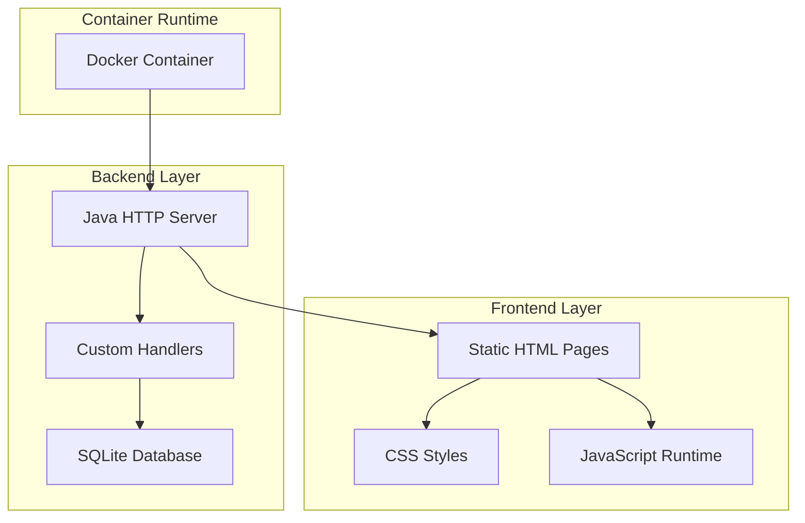
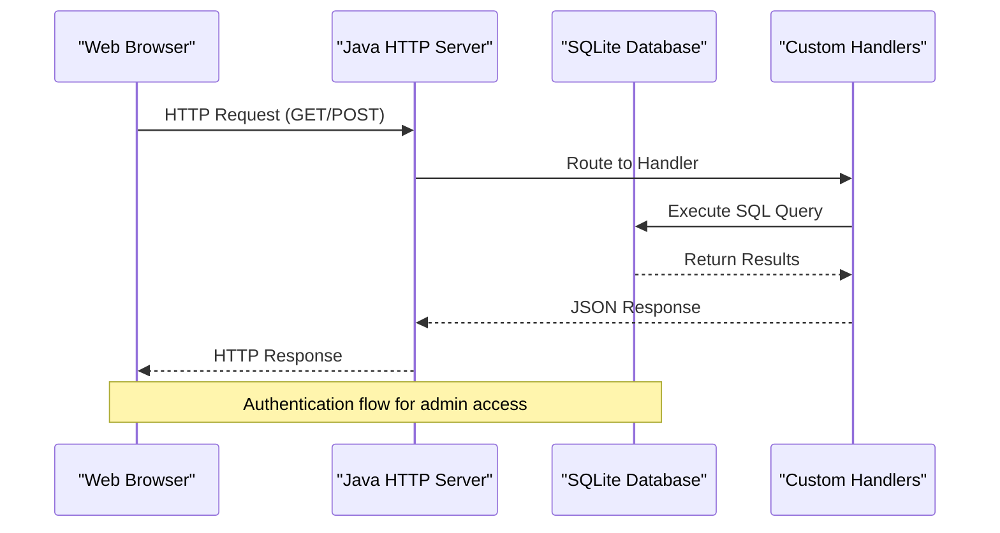
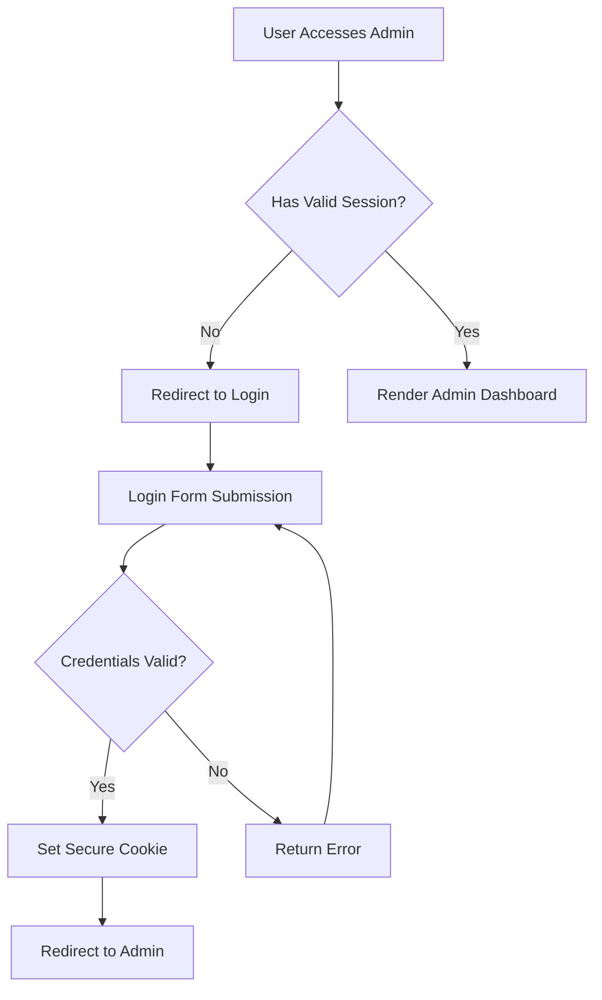
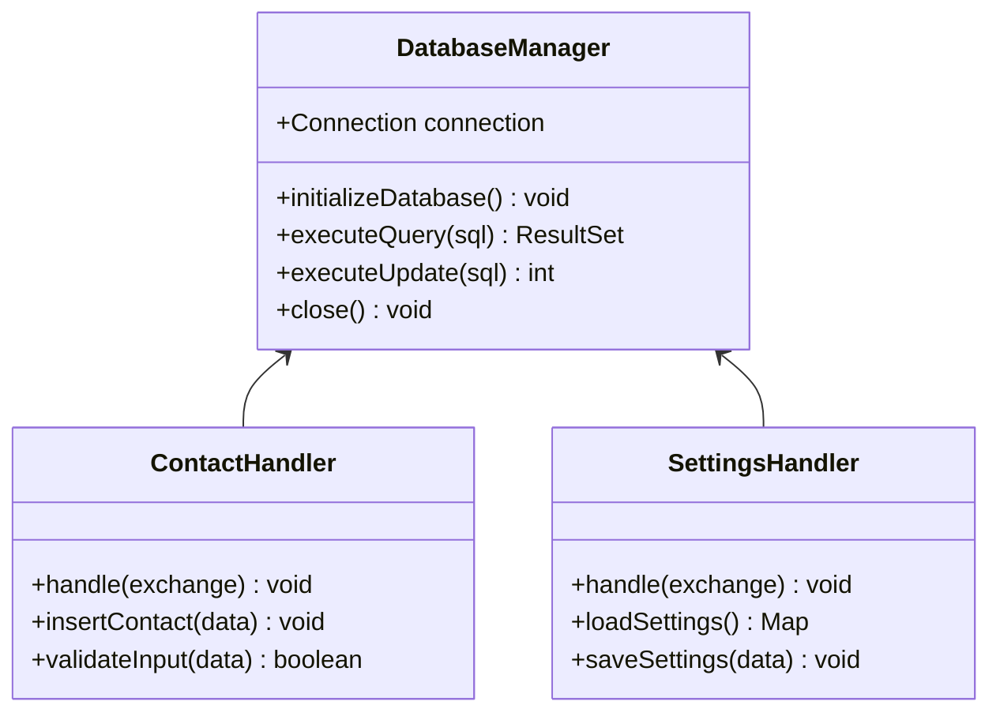
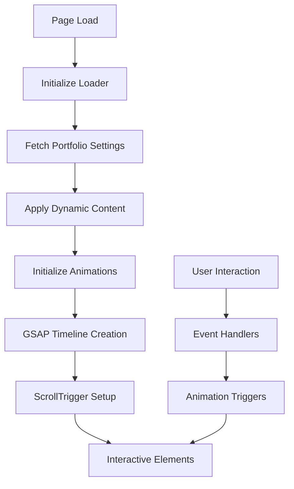
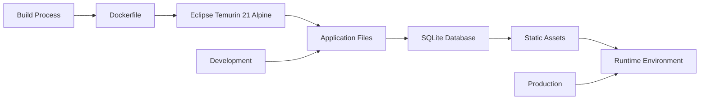
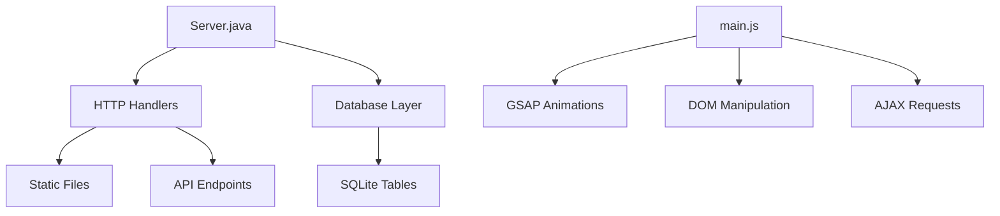

# Technology Stack Overview

<cite>
**Referenced Files in This Document**
- [Server.java](file://Server.java)
- [Dockerfile](file://Dockerfile)
- [run_server.bat](file://run_server.bat)
- [main.js](file://main.js)
- [style.css](file://style.css)
- [index.html](file://index.html)
- [admin.html](file://admin.html)
- [login.html](file://login.html)
- [design.md](file://design.md)
</cite>

## Table of Contents
1. [Introduction](#introduction)
2. [Project Structure](#project-structure)
3. [Core Components](#core-components)
4. [Architecture Overview](#architecture-overview)
5. [Detailed Component Analysis](#detailed-component-analysis)
6. [Dependency Analysis](#dependency-analysis)
7. [Performance Considerations](#performance-considerations)
8. [Troubleshooting Guide](#troubleshooting-guide)
9. [Conclusion](#conclusion)

## Introduction
This document provides a comprehensive technology stack overview for the Premium Portfolio application. The project combines a Java backend using the built-in HTTP server with a custom handler pattern, a SQLite database for local file-based persistence, and a modern frontend featuring HTML5, CSS3, JavaScript, GSAP animations, Tailwind CSS, and FontAwesome. Containerization is achieved through Docker using Alpine Linux with JDK 21. External dependencies include the SQLite JDBC driver and SLF4J logging. The document explains version compatibility, architectural decisions, and setup requirements for both development and production environments.

## Project Structure
The Premium Portfolio application follows a hybrid architecture:
- Backend: Java application packaged as a single-file server with custom HTTP handlers
- Database: SQLite file-based storage managed by the backend
- Frontend: Static HTML/CSS/JavaScript with dynamic content loaded via AJAX
- Containerization: Docker image built on Eclipse Temurin JDK 21 Alpine Linux

**Diagram sources**
- [Dockerfile:1-18](file://Dockerfile#L1-L18)
- [Server.java:34-83](file://Server.java#L34-L83)

**Section sources**
- [Dockerfile:1-18](file://Dockerfile#L1-L18)
- [Server.java:18-83](file://Server.java#L18-L83)

## Core Components

### Java Backend with Built-in HTTP Server
The backend is implemented as a standalone Java application using the built-in com.sun.net.httpserver package. The server initializes SQLite tables, exposes REST endpoints for contact forms, booking management, and administrative operations, and serves static content.

Key backend components:
- HttpServer instance with custom port configuration
- Handler pattern for routing requests to specific endpoints
- SQLite JDBC connectivity with automatic schema migration
- CORS configuration for cross-origin resource sharing
- Authentication middleware using HTTP-only cookies

**Section sources**
- [Server.java:18-83](file://Server.java#L18-L83)
- [Server.java:85-337](file://Server.java#L85-L337)
- [Server.java:339-352](file://Server.java#L339-L352)

### Database Layer (SQLite)
The application uses SQLite for local file-based persistence with automatic schema management:
- Contacts table for inbound messages
- Bookings table for consultation scheduling
- Portfolio settings table with theme and content configuration
- Projects, education, and experience tables for content management

Schema migration includes automatic column addition for new settings and seeding default content for demonstration.

**Section sources**
- [Server.java:98-331](file://Server.java#L98-L331)

### Frontend Technologies
The frontend leverages modern web standards with performance-focused implementations:
- HTML5 semantic markup with progressive enhancement
- CSS3 with custom properties and Tailwind CSS utility classes
- JavaScript ES6+ with modular architecture
- GSAP 3.x for advanced animations and scroll-triggered effects
- FontAwesome for scalable vector icons
- Responsive design with mobile-first approach

**Section sources**
- [main.js:1-1562](file://main.js#L1-L1562)
- [style.css:1-2329](file://style.css#L1-L2329)
- [index.html:1-1465](file://index.html#L1-L1465)

### Containerization Strategy
Docker configuration utilizes Eclipse Temurin JDK 21 Alpine Linux for minimal footprint:
- Multi-stage build process with Alpine base image
- SQLite CLI tools for debugging and verification
- Dynamic port exposure with environment variable support
- Classpath configuration for Linux runtime

**Section sources**
- [Dockerfile:1-18](file://Dockerfile#L1-L18)

## Architecture Overview

**Diagram sources**
- [Server.java:34-83](file://Server.java#L34-L83)
- [Server.java:355-396](file://Server.java#L355-L396)

The architecture implements a thin server pattern where the Java application acts as both HTTP server and application logic layer, eliminating the need for external application servers while maintaining scalability for small to medium workloads.

## Detailed Component Analysis

### Authentication and Security Architecture
The application implements a secure authentication system using HTTP-only cookies:

**Diagram sources**
- [login.html:122-171](file://login.html#L122-L171)
- [Server.java:339-352](file://Server.java#L339-L352)

**Section sources**
- [login.html:1-175](file://login.html#L1-175)
- [Server.java:355-396](file://Server.java#L355-L396)

### Database Interaction Patterns
The backend employs prepared statements and connection pooling for efficient database operations:

**Diagram sources**
- [Server.java:495-554](file://Server.java#L495-L554)
- [Server.java:85-337](file://Server.java#L85-L337)

**Section sources**
- [Server.java:495-800](file://Server.java#L495-L800)

### Frontend Animation System
The JavaScript runtime implements a sophisticated animation pipeline using GSAP:

**Diagram sources**
- [main.js:9-136](file://main.js#L9-L136)
- [main.js:398-621](file://main.js#L398-L621)

**Section sources**
- [main.js:1-1562](file://main.js#L1-L1562)

### Container Deployment Architecture
The Docker configuration ensures reproducible deployments across environments:

**Diagram sources**
- [Dockerfile:1-18](file://Dockerfile#L1-L18)

**Section sources**
- [Dockerfile:1-18](file://Dockerfile#L1-L18)

## Dependency Analysis

### External Dependencies
The application maintains minimal external dependencies for optimal performance and security:

| Category | Component | Version | Purpose |
|----------|-----------|---------|---------|
| Database | SQLite JDBC Driver | 3.45.1.0 | File-based database connectivity |
| Logging | SLF4J API | 1.7.36 | Structured logging framework |
| Animation | GSAP | 3.12.2 | Advanced animation and scroll effects |
| Styling | Tailwind CSS | Latest | Utility-first CSS framework |
| Icons | FontAwesome | 6.4.0 | Scalable vector icon library |

### Internal Dependencies
The codebase exhibits loose coupling between components:

**Diagram sources**
- [Server.java:34-83](file://Server.java#L34-L83)
- [main.js:702-800](file://main.js#L702-L800)

**Section sources**
- [run_server.bat:14-33](file://run_server.bat#L14-L33)
- [Server.java:12-16](file://Server.java#L12-L16)

## Performance Considerations
The technology stack is optimized for performance and resource efficiency:

- **Memory Footprint**: Alpine Linux base image reduces container size significantly
- **Startup Time**: Single JAR execution eliminates JVM warm-up overhead
- **Database Efficiency**: SQLite file-based storage minimizes connection overhead
- **Frontend Optimization**: Static asset delivery with minimal JavaScript bundle
- **Animation Performance**: GSAP optimized for GPU acceleration and smooth 60fps animations

## Troubleshooting Guide

### Common Issues and Solutions

**Database Connection Problems**
- Verify SQLite JDBC driver availability in lib/ directory
- Check file permissions for portfolio.db
- Ensure proper classpath configuration in Docker

**Port Conflicts**
- Default port 3000 can be overridden via PORT environment variable
- Container port mapping requires EXPOSE 3000 in Dockerfile

**Authentication Failures**
- Verify session cookie is HTTP-only and secure
- Check credential validation logic in LoginHandler
- Ensure proper CORS headers for cross-origin requests

**Section sources**
- [run_server.bat:14-56](file://run_server.bat#L14-L56)
- [Server.java:22-32](file://Server.java#L22-L32)

## Conclusion
The Premium Portfolio application demonstrates a pragmatic approach to full-stack development using proven technologies. The combination of Java's built-in HTTP server, SQLite database, and modern frontend tools creates a lightweight yet powerful platform. The Docker-based deployment ensures consistency across environments, while the modular architecture supports easy maintenance and future enhancements. This stack provides an excellent balance between simplicity, performance, and functionality for portfolio websites and similar applications.